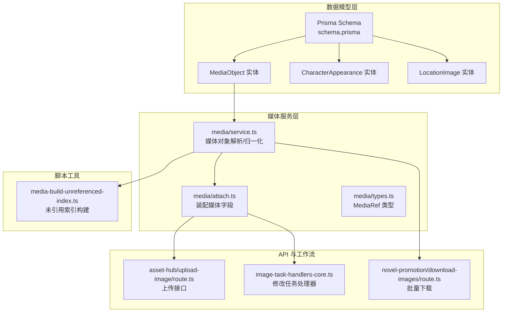
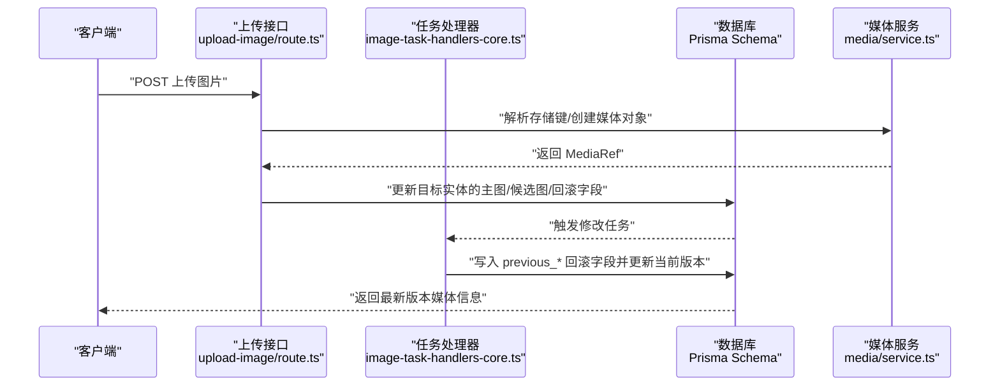
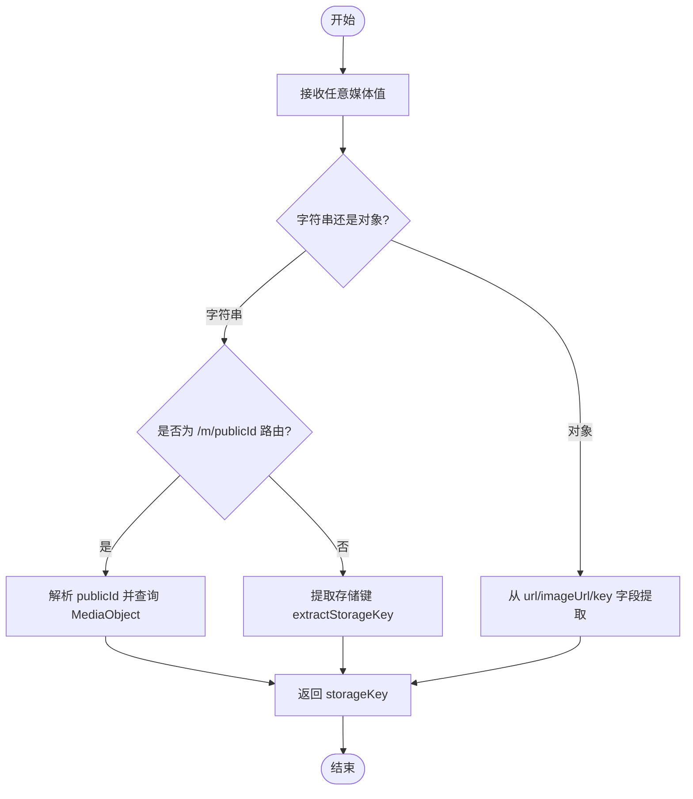
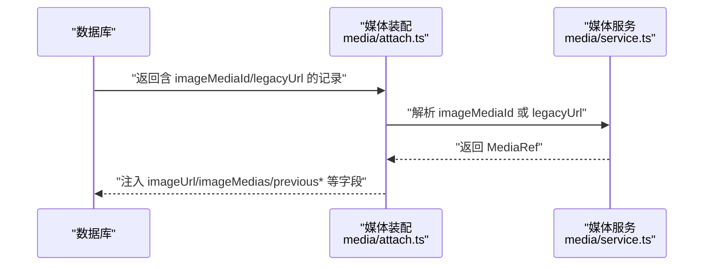
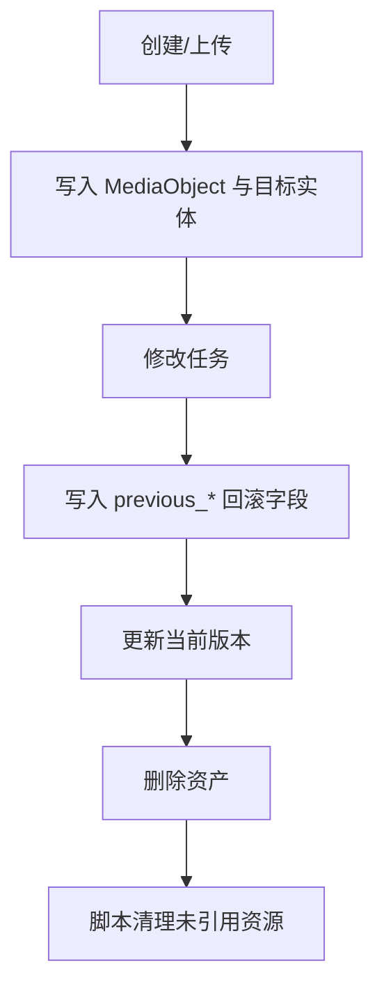
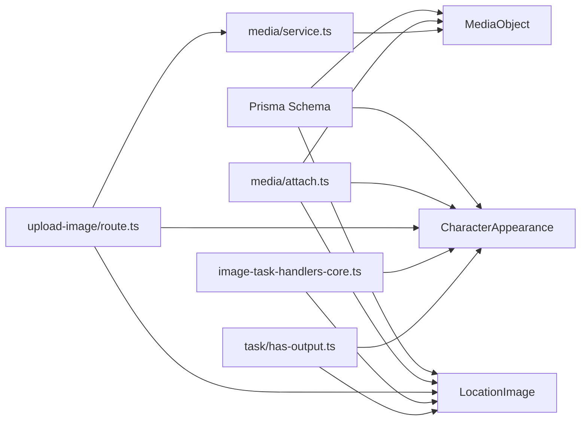

# 媒体资产模型

<cite>
**本文档引用的文件**
- [schema.prisma](file://prisma/schema.prisma)
- [schema.sqlit.prisma](file://prisma/schema.sqlit.prisma)
- [media/service.ts](file://src/lib/media/service.ts)
- [media/attach.ts](file://src/lib/media/attach.ts)
- [assets/mappers.ts](file://src/lib/assets/mappers.ts)
- [task/has-output.ts](file://src/lib/task/has-output.ts)
- [app/api/asset-hub/upload-image/route.ts](file://src/app/api/asset-hub/upload-image/route.ts)
- [workers/handlers/image-task-handlers-core.ts](file://src/lib/workers/handlers/image-task-handlers-core.ts)
- [app/api/novel-promotion/[projectId]/download-images/route.ts](file://src/app/api/novel-promotion/[projectId]/download-images/route.ts)
- [scripts/media-build-unreferenced-index.ts](file://scripts/media-build-unreferenced-index.ts)
- [media/types.ts](file://src/lib/media/types.ts)
</cite>

## 目录
1. [简介](#简介)
2. [项目结构](#项目结构)
3. [核心组件](#核心组件)
4. [架构总览](#架构总览)
5. [详细组件分析](#详细组件分析)
6. [依赖分析](#依赖分析)
7. [性能考虑](#性能考虑)
8. [故障排查指南](#故障排查指南)
9. [结论](#结论)
10. [附录](#附录)

## 简介
本文件系统性梳理 Waoowaoo 的媒体资产模型，重点覆盖以下实体与能力：
- 角色外观（CharacterAppearance）
- 场景图片（LocationImage）
- 媒体对象（MediaObject）及其统一引用机制
- 媒体文件的存储结构、引用关系与版本管理
- 多版本管理、历史记录与回滚机制
- 媒体资产的完整生命周期管理（创建、修改、删除）
- 与项目、角色、场景等实体的绑定关系
- 标签系统、分类管理与搜索优化策略

## 项目结构
媒体资产相关代码主要分布在以下模块：
- 数据模型层：Prisma Schema 定义了 CharacterAppearance、LocationImage、MediaObject 等核心实体及关系
- 媒体服务层：统一解析、归一化与持久化媒体引用
- 资产装配层：在查询结果中注入可直接消费的媒体 URL 与元信息
- 任务与输出检测：基于数据库状态判断是否已产出媒体
- API 层：上传、修改、下载等操作的接口实现
- 工作流层：图像生成与修改任务的执行与回滚字段更新
- 脚本工具：媒体索引构建与未引用资源清理



图表来源
- [schema.prisma:30-77](file://prisma/schema.prisma#L30-L77)
- [media/service.ts:1-224](file://src/lib/media/service.ts#L1-L224)
- [media/attach.ts:1-244](file://src/lib/media/attach.ts#L1-L244)
- [app/api/asset-hub/upload-image/route.ts:121-145](file://src/app/api/asset-hub/upload-image/route.ts#L121-L145)
- [workers/handlers/image-task-handlers-core.ts:155-187](file://src/lib/workers/handlers/image-task-handlers-core.ts#L155-L187)
- [app/api/novel-promotion/[projectId]/download-images/route.ts:148-183](file://src/app/api/novel-promotion/[projectId]/download-images/route.ts#L148-L183)
- [scripts/media-build-unreferenced-index.ts:1-37](file://scripts/media-build-unreferenced-index.ts#L1-L37)

章节来源
- [schema.prisma:30-77](file://prisma/schema.prisma#L30-L77)
- [media/service.ts:1-224](file://src/lib/media/service.ts#L1-L224)
- [media/attach.ts:1-244](file://src/lib/media/attach.ts#L1-L244)

## 核心组件
- 媒体对象（MediaObject）：统一存储媒体的存储键、MIME 类型、尺寸、时长、哈希等元信息，并通过 publicId 提供稳定访问路由
- 角色外观（CharacterAppearance）：记录角色不同外观版本的描述、主图与候选图集合，以及上一次版本的回滚字段
- 场景图片（LocationImage）：记录场景或道具的图片版本、可用拍摄位点、选中状态与回滚字段
- 媒体服务（media/service.ts）：提供媒体对象的创建/更新、存储键解析、URL 归一化、publicId 生成等能力
- 媒体装配（media/attach.ts）：在查询结果中注入可直接消费的媒体 URL 与元信息，支持多版本与回滚字段
- 资产映射（assets/mappers.ts）：将数据库记录映射为前端可消费的资产视图，包含变体、渲染项与任务引用
- 输出检测（task/has-output.ts）：根据数据库字段判断某目标是否已有媒体输出
- API 与工作流：上传、修改、下载接口与任务处理器，负责写入回滚字段与版本化数据

章节来源
- [media/types.ts:1-14](file://src/lib/media/types.ts#L1-L14)
- [media/service.ts:88-134](file://src/lib/media/service.ts#L88-L134)
- [media/attach.ts:26-44](file://src/lib/media/attach.ts#L26-L44)
- [assets/mappers.ts:161-235](file://src/lib/assets/mappers.ts#L161-L235)
- [task/has-output.ts:44-92](file://src/lib/task/has-output.ts#L44-L92)

## 架构总览
媒体资产模型采用“数据库实体 + 媒体服务 + 资产装配”的分层设计：
- 数据库层：以 CharacterAppearance、LocationImage、MediaObject 为核心，建立角色/场景与媒体的多对一/一对多关系
- 媒体服务层：屏蔽存储细节，提供稳定的 publicId 与 storageKey 映射，确保跨存储的一致性
- 资产装配层：在读取阶段将数据库中的存储键或 URL 解析为最终可访问的媒体 URL，并补充历史与回滚字段
- API 与工作流层：负责写入阶段的版本化与回滚字段更新，保证可追溯与可回滚



图表来源
- [app/api/asset-hub/upload-image/route.ts:121-145](file://src/app/api/asset-hub/upload-image/route.ts#L121-L145)
- [workers/handlers/image-task-handlers-core.ts:155-187](file://src/lib/workers/handlers/image-task-handlers-core.ts#L155-L187)
- [media/service.ts:88-134](file://src/lib/media/service.ts#L88-L134)
- [schema.prisma:30-77](file://prisma/schema.prisma#L30-L77)

## 详细组件分析

### 媒体对象（MediaObject）与引用机制
- 统一引用：通过 MediaObject 存储 storageKey 与 publicId，对外提供稳定 URL 路由 /m/{publicId}
- 解析与归一化：支持从 COS key、签名 URL、/m/publicId、对象形态等多种输入解析为 storageKey
- 并发安全：upsert 时处理唯一约束冲突，避免并发写入导致的异常
- 元信息：自动推断 MIME 类型，记录尺寸、时长、哈希等，便于前端渲染与缓存控制



图表来源
- [media/service.ts:152-171](file://src/lib/media/service.ts#L152-L171)
- [media/service.ts:185-200](file://src/lib/media/service.ts#L185-L200)

章节来源
- [media/service.ts:56-86](file://src/lib/media/service.ts#L56-L86)
- [media/service.ts:152-200](file://src/lib/media/service.ts#L152-L200)
- [media/types.ts:1-14](file://src/lib/media/types.ts#L1-L14)

### 角色外观（CharacterAppearance）数据模型
- 版本化字段：支持主图与候选图数组，以及对应的回滚字段（previousImageUrl/previousImageUrls/previousDescription/previousDescriptions）
- 关系：与 NovelPromotionCharacter 一对多，按 appearanceIndex 排序
- 任务集成：前端资产视图将每个外观作为“变体”，渲染项作为“版本”，支持选择与任务引用

```mermaid
erDiagram
NOVEL_PROMOTION_CHARACTER ||--o{ CHARACTER_APPEARANCE : "拥有多个外观"
CHARACTER_APPEARANCE {
string id PK
string characterId FK
int appearanceIndex
string? description
string? imageUrl
string? imageUrls
string? previousImageUrl
string? previousImageUrls
string? previousDescription
string? previousDescriptions
string? imageMediaId
}
```

图表来源
- [schema.prisma:30-54](file://prisma/schema.prisma#L30-L54)

章节来源
- [schema.prisma:30-54](file://prisma/schema.prisma#L30-L54)
- [assets/mappers.ts:161-235](file://src/lib/assets/mappers.ts#L161-L235)

### 场景图片（LocationImage）数据模型
- 版本化字段：支持单张图片的描述、可用拍摄位点、选中状态，以及回滚字段（previousImageUrl/previousDescription）
- 关系：与 NovelPromotionLocation 一对多，按 imageIndex 排序；支持 selectedByLocations 反向引用
- 任务集成：前端资产视图将每张图片作为“变体”，渲染项作为“版本”，支持选择与任务引用

```mermaid
erDiagram
NOVEL_PROMOTION_LOCATION ||--o{ LOCATION_IMAGE : "拥有多个图片"
LOCATION_IMAGE {
string id PK
string locationId FK
int imageIndex
string? description
string? availableSlots
string? imageUrl
boolean isSelected
string? previousImageUrl
string? previousDescription
string? imageMediaId
}
```

图表来源
- [schema.prisma:56-77](file://prisma/schema.prisma#L56-L77)

章节来源
- [schema.prisma:56-77](file://prisma/schema.prisma#L56-L77)
- [assets/mappers.ts:308-349](file://src/lib/assets/mappers.ts#L308-L349)

### 媒体装配与历史回滚
- 装配逻辑：在读取阶段将 imageMediaId 或 legacy imageUrl 解析为最终 URL，并补全 previousImageMedia、imageMedias 等字段
- 历史回滚：修改任务会先将当前版本写入 previous_* 字段，再更新当前版本，实现“可回滚”的版本管理
- 多媒体类型：支持图片、视频、音频等，分别注入对应 media 字段与 URL



图表来源
- [media/attach.ts:26-44](file://src/lib/media/attach.ts#L26-L44)
- [media/attach.ts:157-177](file://src/lib/media/attach.ts#L157-L177)
- [media/service.ts:191-200](file://src/lib/media/service.ts#L191-L200)

章节来源
- [media/attach.ts:26-44](file://src/lib/media/attach.ts#L26-L44)
- [media/attach.ts:157-177](file://src/lib/media/attach.ts#L157-L177)
- [workers/handlers/image-task-handlers-core.ts:155-187](file://src/lib/workers/handlers/image-task-handlers-core.ts#L155-L187)

### 生命周期管理与版本控制
- 创建：上传接口将媒体对象写入 MediaObject，并更新目标实体的主图/候选图字段
- 修改：任务处理器写入 previous_* 回滚字段，再更新当前版本
- 删除：通过资产动作接口删除项目或全局资产；脚本工具可用于构建未引用索引与清理



图表来源
- [app/api/asset-hub/upload-image/route.ts:121-145](file://src/app/api/asset-hub/upload-image/route.ts#L121-L145)
- [workers/handlers/image-task-handlers-core.ts:155-187](file://src/lib/workers/handlers/image-task-handlers-core.ts#L155-L187)
- [assets/services/asset-actions.ts:1185-1201](file://src/lib/assets/services/asset-actions.ts#L1185-L1201)
- [scripts/media-build-unreferenced-index.ts:1-37](file://scripts/media-build-unreferenced-index.ts#L1-L37)

章节来源
- [app/api/asset-hub/upload-image/route.ts:121-145](file://src/app/api/asset-hub/upload-image/route.ts#L121-L145)
- [workers/handlers/image-task-handlers-core.ts:155-187](file://src/lib/workers/handlers/image-task-handlers-core.ts#L155-L187)
- [assets/services/asset-actions.ts:1185-1201](file://src/lib/assets/services/asset-actions.ts#L1185-L1201)
- [scripts/media-build-unreferenced-index.ts:1-37](file://scripts/media-build-unreferenced-index.ts#L1-L37)

### 关联关系与绑定机制
- 与项目/角色/场景的绑定：通过 characterId、locationId 等外键建立一对一/一对多关系
- 与全局资产的绑定：全局资产（GlobalCharacter、GlobalLocation）支持跨项目复用
- 与任务的绑定：资产视图包含任务引用，支持一键触发生成/修改/再生等任务

章节来源
- [schema.prisma:79-119](file://prisma/schema.prisma#L79-L119)
- [assets/mappers.ts:161-235](file://src/lib/assets/mappers.ts#L161-L235)
- [assets/mappers.ts:308-349](file://src/lib/assets/mappers.ts#L308-L349)

### 标签系统、分类管理与搜索优化
- 分类与家族：资产视图包含 kind（角色/场景/道具/声音）、family（视觉/音频）、capabilities 等元信息
- 选择与筛选：前端可通过 kind、scope（项目/全局）进行筛选
- 搜索优化：数据库层面通过索引（如 characterId、locationId、imageMediaId）提升查询性能；媒体 URL 通过 /m/{publicId} 提供稳定访问

章节来源
- [assets/mappers.ts:161-235](file://src/lib/assets/mappers.ts#L161-L235)
- [assets/mappers.ts:308-349](file://src/lib/assets/mappers.ts#L308-L349)
- [schema.prisma:50-53](file://prisma/schema.prisma#L50-L53)
- [schema.prisma:73-76](file://prisma/schema.prisma#L73-L76)

## 依赖分析
- 数据模型依赖：CharacterAppearance 与 LocationImage 依赖 MediaObject 的外键关系
- 服务依赖：媒体服务被装配层与 API 层广泛调用
- 任务依赖：任务处理器依赖数据库写入与回滚字段更新
- 查询依赖：输出检测依赖数据库字段的存在性判断



图表来源
- [schema.prisma:30-77](file://prisma/schema.prisma#L30-L77)
- [media/attach.ts:1-244](file://src/lib/media/attach.ts#L1-L244)
- [media/service.ts:1-224](file://src/lib/media/service.ts#L1-L224)
- [app/api/asset-hub/upload-image/route.ts:121-145](file://src/app/api/asset-hub/upload-image/route.ts#L121-L145)
- [workers/handlers/image-task-handlers-core.ts:155-187](file://src/lib/workers/handlers/image-task-handlers-core.ts#L155-L187)
- [task/has-output.ts:44-92](file://src/lib/task/has-output.ts#L44-L92)

章节来源
- [schema.prisma:30-77](file://prisma/schema.prisma#L30-L77)
- [media/attach.ts:1-244](file://src/lib/media/attach.ts#L1-L244)
- [media/service.ts:1-224](file://src/lib/media/service.ts#L1-L224)
- [task/has-output.ts:44-92](file://src/lib/task/has-output.ts#L44-L92)

## 性能考虑
- 索引优化：针对 characterId、locationId、imageMediaId 等高频查询字段建立索引，降低查询延迟
- 缓存策略：/m/{publicId} 路由可结合 CDN 与浏览器缓存，减少重复请求
- 批量处理：批量下载与未引用索引构建脚本支持大体量数据的高效处理
- 并发安全：媒体对象 upsert 使用唯一约束兜底，避免并发写入冲突

## 故障排查指南
- 媒体 URL 无法访问（404）：检查 MediaObject 是否存在、storageKey 是否正确、/m/ 路由是否启用
- 上传后无回显：确认上传接口是否正确写入 imageMediaId 或 imageUrl，以及装配层是否解析成功
- 修改后无法回滚：检查任务处理器是否写入 previous_* 字段，以及数据库更新顺序是否正确
- 未引用资源堆积：运行媒体索引构建与清理脚本，识别并移除未引用资源

章节来源
- [media/service.ts:136-146](file://src/lib/media/service.ts#L136-L146)
- [media/attach.ts:26-44](file://src/lib/media/attach.ts#L26-L44)
- [workers/handlers/image-task-handlers-core.ts:155-187](file://src/lib/workers/handlers/image-task-handlers-core.ts#L155-L187)
- [scripts/media-build-unreferenced-index.ts:1-37](file://scripts/media-build-unreferenced-index.ts#L1-L37)

## 结论
Waoowaoo 的媒体资产模型通过“数据库实体 + 媒体服务 + 资产装配”的分层设计，实现了角色外观与场景图片的版本化管理、历史回滚与稳定访问。媒体服务提供了跨存储的一致性抽象，API 与工作流保障了写入路径的可靠性，脚本工具则支撑了大规模数据的维护与优化。该体系为项目内媒体资产的创建、修改与删除提供了完整的生命周期管理与可追溯能力。

## 附录
- 数据库迁移：schema.prisma 中包含与媒体资产相关的迁移记录，建议在升级前备份数据库
- 本地开发：使用 /m/ 路由访问媒体时需确保媒体服务与存储配置正确