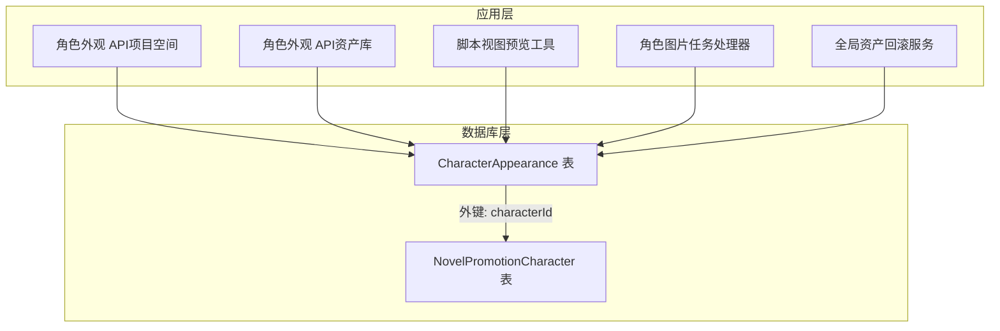
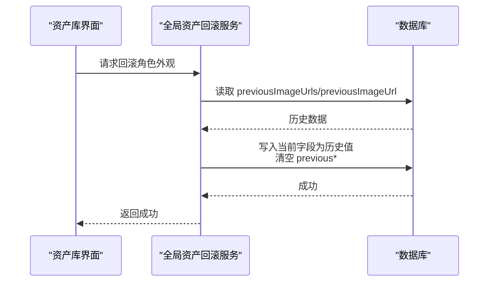
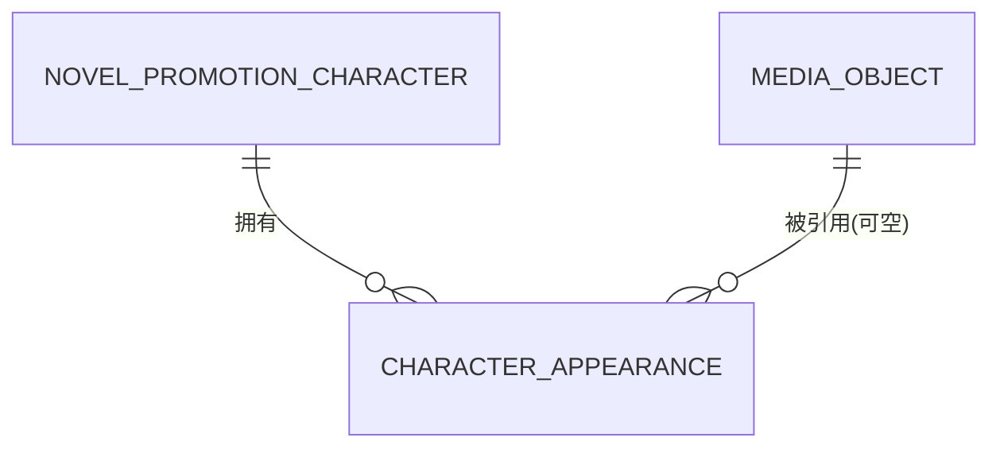
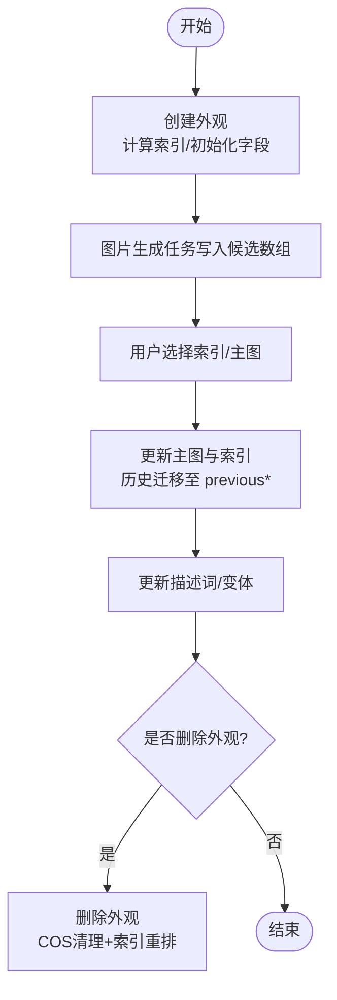
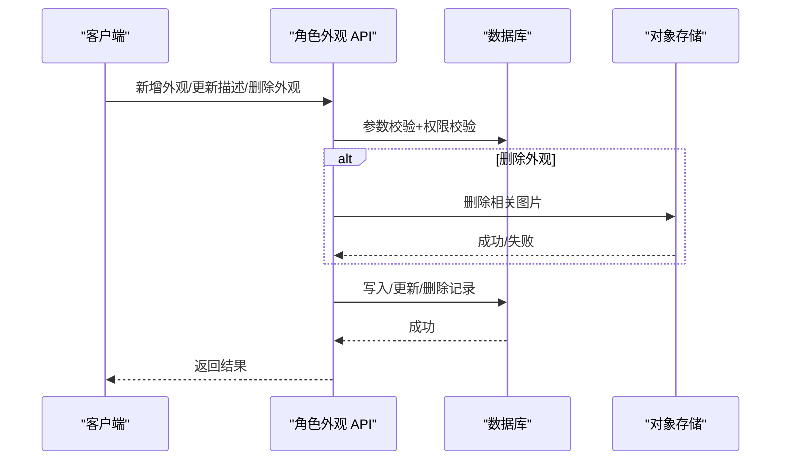
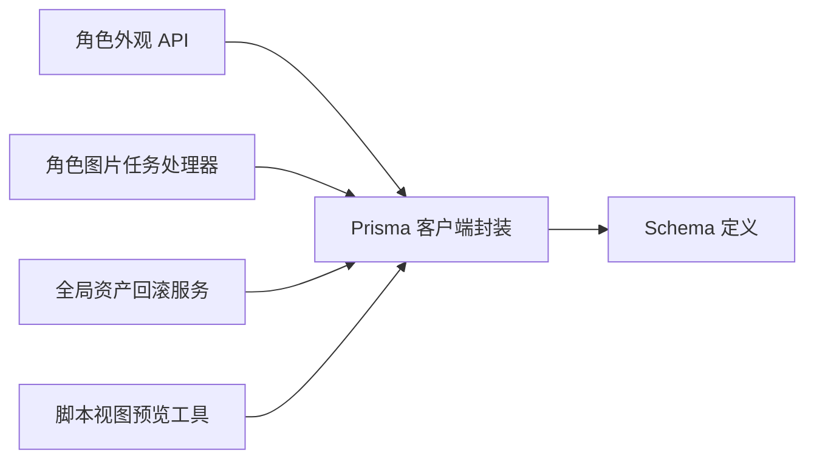

# 角色外观模型

<cite>
**本文档引用的文件**
- [schema.prisma](file://prisma/schema.prisma)
- [CharacterAppearance 接口定义](file://src/types/project.ts)
- [角色外观 API（项目空间）](file://src/app/api/novel-promotion/[projectId]/character/appearance/route.ts)
- [角色外观 API（资产库）](file://src/app/api/asset-hub/characters/[characterId]/appearances/[appearanceIndex]/route.ts)
- [角色外观预览工具函数](file://src/app/[locale]/workspace/[projectId]/modes/novel-promotion/components/script-view/ScriptViewAssetsPanel.tsx)
- [全局资产回滚服务](file://src/lib/assets/services/asset-actions.ts)
- [角色图片任务处理器](file://src/lib/workers/handlers/character-image-task-handler.ts)
- [全局资产回滚服务（位置）](file://src/lib/assets/services/asset-actions.ts)
- [全局资产回滚服务（角色）](file://src/lib/assets/services/asset-actions.ts)
- [全局资产回滚服务（角色-统一入口）](file://src/lib/assets/services/asset-actions.ts)
- [Prisma 客户端封装](file://src/lib/prisma.ts)
</cite>

## 目录
1. [简介](#简介)
2. [项目结构](#项目结构)
3. [核心组件](#核心组件)
4. [架构总览](#架构总览)
5. [详细组件分析](#详细组件分析)
6. [依赖关系分析](#依赖关系分析)
7. [性能考量](#性能考量)
8. [故障排查指南](#故障排查指南)
9. [结论](#结论)

## 简介
本文件系统性梳理 Waoowaoo 中“角色外观模型”的设计与实现，围绕 CharacterAppearance 实体展开，重点覆盖：
- 角色外观索引与多版本描述词管理
- 图像 URL 与候选数组的存储与选择逻辑
- 历史记录字段 previousImageUrl/previousDescription 的作用与回滚机制
- 与角色实体的关联关系、外键约束与级联删除策略
- 生命周期管理：创建、修改、删除与重排
- 多版本管理机制与 changeReason 字段的使用
- 查询优化策略与性能建议

## 项目结构
角色外观模型在数据库层通过 Prisma Schema 定义，在应用层通过 API 路由与前端组件协同完成全生命周期管理。



图表来源
- [schema.prisma](file://prisma/schema.prisma)
- [角色外观 API（项目空间）](file://src/app/api/novel-promotion/[projectId]/character/appearance/route.ts)
- [角色外观 API（资产库）](file://src/app/api/asset-hub/characters/[characterId]/appearances/[appearanceIndex]/route.ts)
- [角色外观预览工具函数](file://src/app/[locale]/workspace/[projectId]/modes/novel-promotion/components/script-view/ScriptViewAssetsPanel.tsx)
- [角色图片任务处理器](file://src/lib/workers/handlers/character-image-task-handler.ts)
- [全局资产回滚服务](file://src/lib/assets/services/asset-actions.ts)

章节来源
- [schema.prisma](file://prisma/schema.prisma)
- [角色外观 API（项目空间）](file://src/app/api/novel-promotion/[projectId]/character/appearance/route.ts)
- [角色外观 API（资产库）](file://src/app/api/asset-hub/characters/[characterId]/appearances/[appearanceIndex]/route.ts)
- [角色外观预览工具函数](file://src/app/[locale]/workspace/[projectId]/modes/novel-promotion/components/script-view/ScriptViewAssetsPanel.tsx)
- [角色图片任务处理器](file://src/lib/workers/handlers/character-image-task-handler.ts)
- [全局资产回滚服务](file://src/lib/assets/services/asset-actions.ts)

## 核心组件
- 数据模型：CharacterAppearance（角色外观）
  - 关键字段：appearanceIndex、changeReason、description/descriptions、imageUrl/imageUrls、previousImageUrl/previousImageUrls、previousDescription/previousDescriptions、selectedIndex、characterId 外键、createdAt/updatedAt
  - 约束：唯一索引（characterId, appearanceIndex）、索引（characterId、imageMediaId）
- 类型定义：CharacterAppearance 接口（前端消费）
- API 路由：提供新增、更新描述、删除外观等操作
- 历史回滚：通过 previous* 字段实现“撤销”能力
- 任务处理：图片生成任务写入 imageUrls 并选择最终结果

章节来源
- [schema.prisma](file://prisma/schema.prisma)
- [CharacterAppearance 接口定义](file://src/types/project.ts)
- [角色外观 API（项目空间）](file://src/app/api/novel-promotion/[projectId]/character/appearance/route.ts)
- [角色外观 API（资产库）](file://src/app/api/asset-hub/characters/[characterId]/appearances/[appearanceIndex]/route.ts)

## 架构总览
角色外观模型围绕“角色-外观-图片”三层关系构建，配合历史回滚与任务驱动的候选图片管理，形成完整的外观生命周期闭环。

```mermaid
classDiagram
class CharacterAppearance {
+id : string
+characterId : string
+appearanceIndex : number
+changeReason : string
+description : string?
+descriptions : string[]?
+imageUrl : string?
+imageUrls : string[] // 候选数组
+selectedIndex : number?
+previousImageUrl : string?
+previousImageUrls : string[]
+previousDescription : string?
+previousDescriptions : string[]?
+imageMediaId : string?
+createdAt : datetime
+updatedAt : datetime
}
class NovelPromotionCharacter {
+id : string
+appearances : CharacterAppearance[]
}
class MediaObject {
+id : string
+url : string
}
CharacterAppearance --> NovelPromotionCharacter : "外键 : characterId"
CharacterAppearance --> MediaObject : "imageMediaId"
```

图表来源
- [schema.prisma](file://prisma/schema.prisma)

## 详细组件分析

### 数据模型与字段语义
- appearanceIndex：外观序号，0 为主外观，1..N 为子外观；用于 UI 展示顺序与任务生成策略
- changeReason：外观变更原因，用于日志与用户理解
- description/descriptions：描述词与变体数组，支持多版本描述管理
- imageUrl/imageUrls：当前选中图片与候选图片数组；UI 优先使用 imageUrl，其次按 selectedIndex 从 imageUrls 选择，最后回退到首个非空项
- previous*：历史版本备份，用于“撤销”操作
- selectedIndex：用户在候选数组中的选择索引
- characterId：角色外键，建立外观与角色的一对多关系
- createdAt/updatedAt：时间戳

章节来源
- [schema.prisma](file://prisma/schema.prisma)
- [CharacterAppearance 接口定义](file://src/types/project.ts)
- [角色外观预览工具函数](file://src/app/[locale]/workspace/[projectId]/modes/novel-promotion/components/script-view/ScriptViewAssetsPanel.tsx)

### 历史记录与回滚机制
- 回滚入口：全局资产回滚服务针对角色外观执行“撤销”
- 回滚逻辑：
  - 读取 previousImageUrls 或 previousImageUrl
  - 将当前 imageUrls/imageUrl 还原为上一版本
  - 清空 previous* 字段并同步恢复描述词
- 适用范围：角色外观、场景图片等均具备 previous* 字段，便于统一回滚



图表来源
- [全局资产回滚服务（角色-统一入口）](file://src/lib/assets/services/asset-actions.ts)

章节来源
- [全局资产回滚服务（角色-统一入口）](file://src/lib/assets/services/asset-actions.ts)

### 与角色实体的关联关系
- 外键约束：CharacterAppearance.characterId → NovelPromotionCharacter.id
- 级联删除：当角色被删除时，其所有外观记录将级联删除
- 约束与索引：
  - 唯一索引：(characterId, appearanceIndex)，保证同一角色下外观序号唯一
  - 索引：characterId、imageMediaId，提升查询与关联性能



图表来源
- [schema.prisma](file://prisma/schema.prisma)

章节来源
- [schema.prisma](file://prisma/schema.prisma)

### 生命周期管理
- 创建：新增子外观时计算最大索引并递增，初始化 imageUrls/previousImageUrls 为空
- 修改：更新描述词（支持指定索引或默认首项），同时维护 descriptions 数组
- 删除：校验外观数量不得少于 1；删除 COS 图片与数据库记录；重排剩余外观索引
- 任务驱动：图片生成任务写入 imageUrls，用户选择后更新 imageUrl，并将旧值迁移至 previous*



图表来源
- [角色外观 API（项目空间）](file://src/app/api/novel-promotion/[projectId]/character/appearance/route.ts)
- [角色外观 API（资产库）](file://src/app/api/asset-hub/characters/[characterId]/appearances/[appearanceIndex]/route.ts)
- [角色图片任务处理器](file://src/lib/workers/handlers/character-image-task-handler.ts)

章节来源
- [角色外观 API（项目空间）](file://src/app/api/novel-promotion/[projectId]/character/appearance/route.ts)
- [角色外观 API（资产库）](file://src/app/api/asset-hub/characters/[characterId]/appearances/[appearanceIndex]/route.ts)
- [角色图片任务处理器](file://src/lib/workers/handlers/character-image-task-handler.ts)

### 多版本管理与外观选择逻辑
- 多版本描述：descriptions 数组支持多个描述变体，便于对比与回滚
- 外观选择：UI 优先使用 imageUrl；若为空则按 selectedIndex 从 imageUrls 选取；若仍为空则返回首个可用项
- changeReason：用于标注外观变更原因，便于审计与回溯

章节来源
- [角色外观预览工具函数](file://src/app/[locale]/workspace/[projectId]/modes/novel-promotion/components/script-view/ScriptViewAssetsPanel.tsx)
- [角色外观 API（项目空间）](file://src/app/api/novel-promotion/[projectId]/character/appearance/route.ts)
- [角色外观 API（资产库）](file://src/app/api/asset-hub/characters/[characterId]/appearances/[appearanceIndex]/route.ts)

### API 工作流
- 项目空间 API：负责项目内角色外观的新增、描述更新、删除
- 资产库 API：负责用户资产内角色外观的新增、描述更新、删除
- 两者均进行权限校验与参数校验，并在删除时清理 COS 对象



图表来源
- [角色外观 API（项目空间）](file://src/app/api/novel-promotion/[projectId]/character/appearance/route.ts)
- [角色外观 API（资产库）](file://src/app/api/asset-hub/characters/[characterId]/appearances/[appearanceIndex]/route.ts)

章节来源
- [角色外观 API（项目空间）](file://src/app/api/novel-promotion/[projectId]/character/appearance/route.ts)
- [角色外观 API（资产库）](file://src/app/api/asset-hub/characters/[characterId]/appearances/[appearanceIndex]/route.ts)

## 依赖关系分析
- 数据访问：通过 Prisma 客户端封装统一访问数据库
- 存储集成：图片 URL 与媒体对象解耦，支持签名 URL 与对象存储键解析
- 任务驱动：图片生成任务完成后写入候选数组，再由用户选择决定最终主图



图表来源
- [Prisma 客户端封装](file://src/lib/prisma.ts)
- [角色外观 API（项目空间）](file://src/app/api/novel-promotion/[projectId]/character/appearance/route.ts)
- [角色外观 API（资产库）](file://src/app/api/asset-hub/characters/[characterId]/appearances/[appearanceIndex]/route.ts)
- [角色图片任务处理器](file://src/lib/workers/handlers/character-image-task-handler.ts)
- [全局资产回滚服务](file://src/lib/assets/services/asset-actions.ts)
- [角色外观预览工具函数](file://src/app/[locale]/workspace/[projectId]/modes/novel-promotion/components/script-view/ScriptViewAssetsPanel.tsx)

章节来源
- [Prisma 客户端封装](file://src/lib/prisma.ts)
- [角色外观 API（项目空间）](file://src/app/api/novel-promotion/[projectId]/character/appearance/route.ts)
- [角色外观 API（资产库）](file://src/app/api/asset-hub/characters/[characterId]/appearances/[appearanceIndex]/route.ts)
- [角色图片任务处理器](file://src/lib/workers/handlers/character-image-task-handler.ts)
- [全局资产回滚服务](file://src/lib/assets/services/asset-actions.ts)
- [角色外观预览工具函数](file://src/app/[locale]/workspace/[projectId]/modes/novel-promotion/components/script-view/ScriptViewAssetsPanel.tsx)

## 性能考量
- 索引策略
  - 唯一索引：(characterId, appearanceIndex) 保障外观序号唯一性，避免重复
  - 普通索引：characterId、imageMediaId 提升查询与关联效率
- 查询优化建议
  - 列裁剪：仅查询必要字段（如仅需预览时避免加载大文本字段）
  - 分页与排序：按 appearanceIndex 升序获取外观列表
  - 缓存：对常用外观元数据进行短期缓存
- 存储与网络
  - 图片 URL 使用签名链接时注意过期时间与刷新策略
  - 批量操作时合并请求，减少往返

章节来源
- [schema.prisma](file://prisma/schema.prisma)

## 故障排查指南
- 常见错误与定位
  - 参数无效：检查 characterId、appearanceId、描述内容与索引范围
  - 权限不足：确认项目认证或用户认证状态
  - 资源不存在：确认外观记录是否存在且归属正确角色/用户
  - 删除失败：关注 COS 删除异常日志，确保键名解析正确
- 回滚验证
  - 回滚后检查 imageUrls 是否恢复到 previousImageUrls
  - 确认 previous* 字段已被清空
  - 校验描述词与索引是否同步恢复

章节来源
- [角色外观 API（项目空间）](file://src/app/api/novel-promotion/[projectId]/character/appearance/route.ts)
- [角色外观 API（资产库）](file://src/app/api/asset-hub/characters/[characterId]/appearances/[appearanceIndex]/route.ts)
- [全局资产回滚服务（角色-统一入口）](file://src/lib/assets/services/asset-actions.ts)

## 结论
角色外观模型通过清晰的索引与外键设计、完善的多版本描述与历史回滚机制，实现了从创建、修改到删除的全生命周期管理。结合任务驱动的候选图片管理与 UI 选择逻辑，既保证了创作灵活性，也提供了可靠的审计与回滚能力。建议在实际部署中重点关注索引策略与批量操作的性能优化，并完善权限与参数校验以提升稳定性。