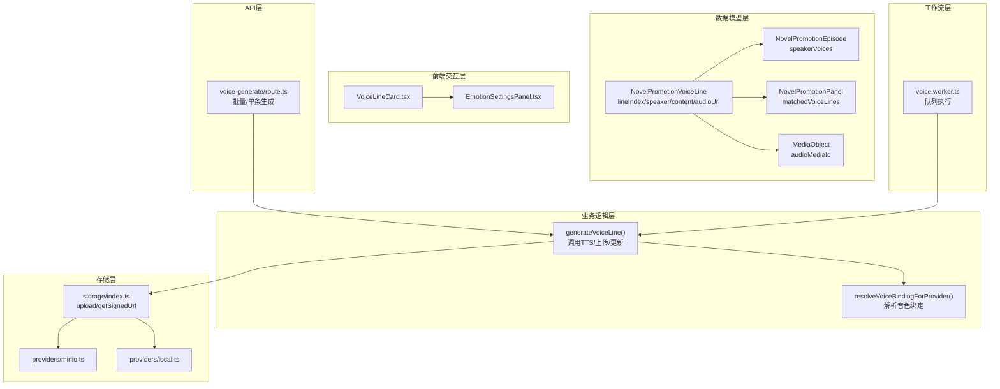
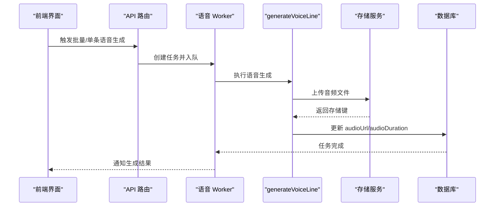
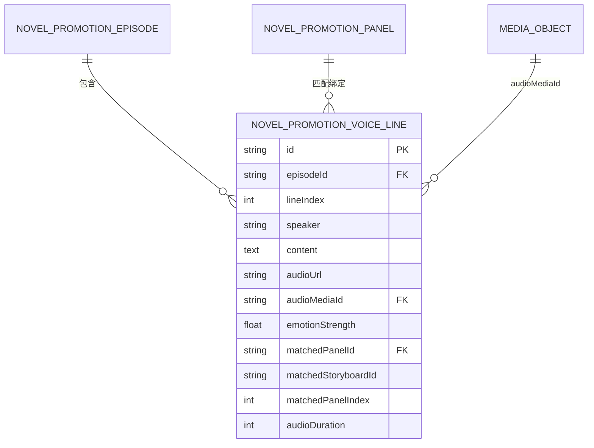
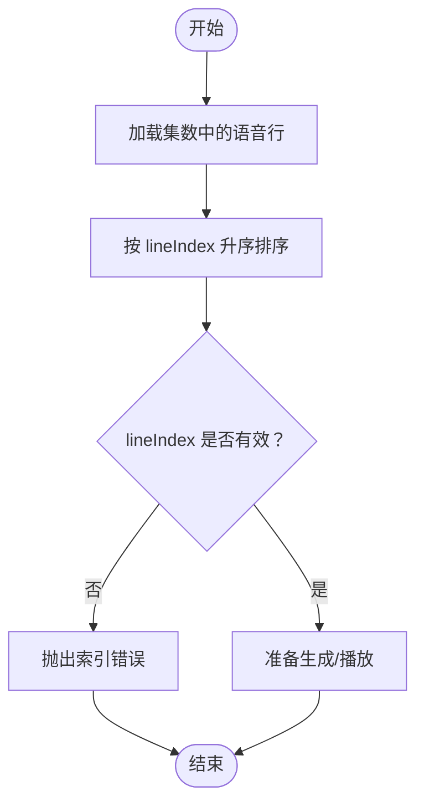
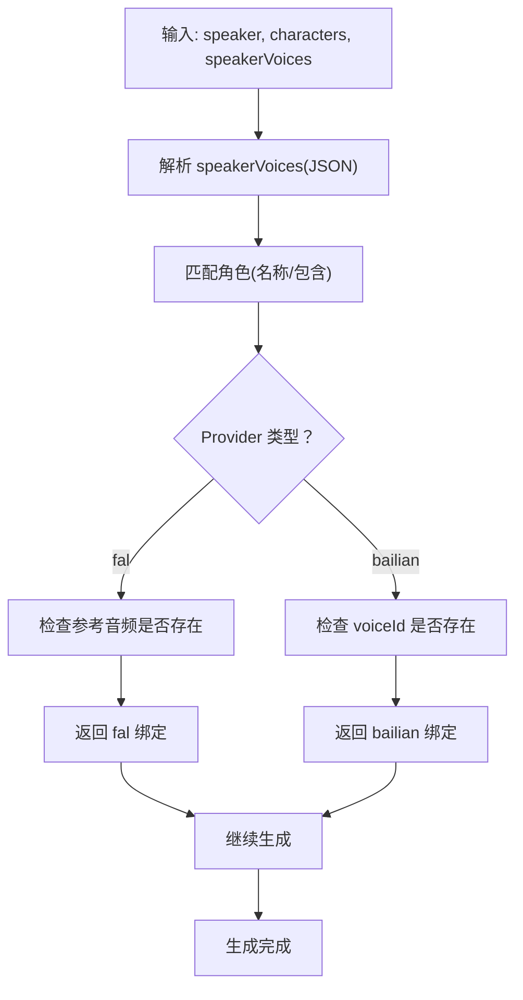
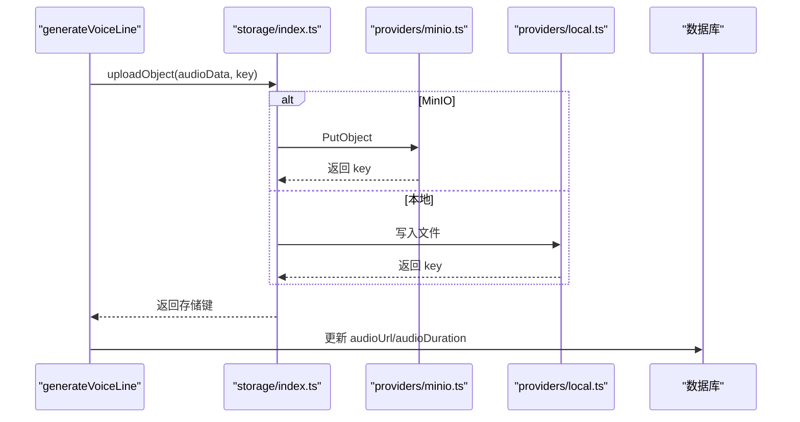
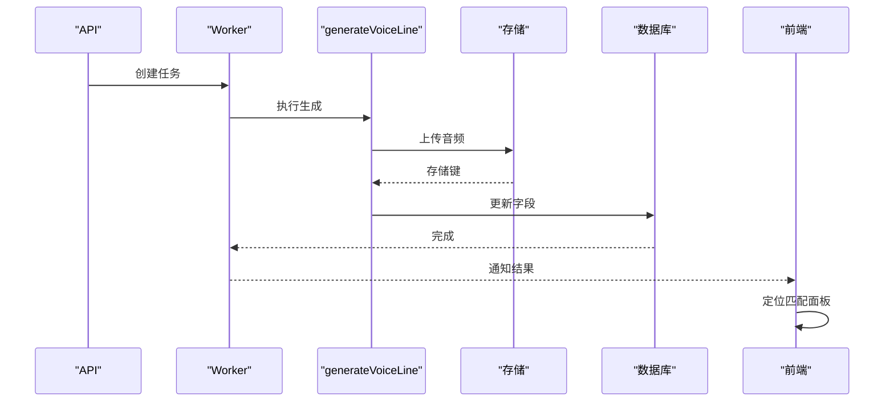
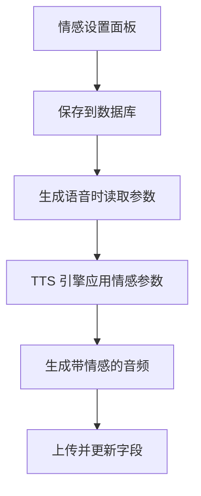
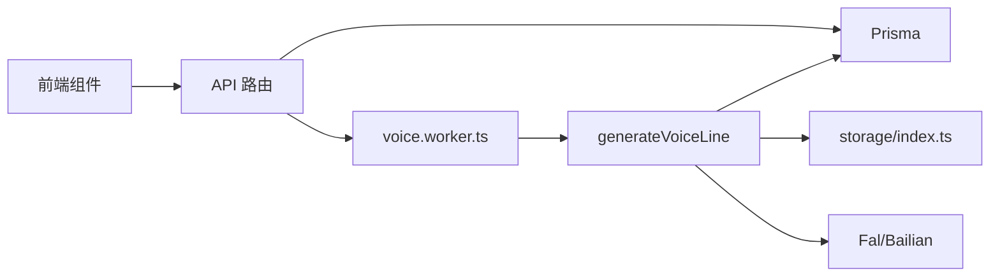

# 语音行模型

<cite>
**本文档引用的文件**
- [schema.prisma](file://prisma/schema.prisma)
- [generate-voice-line.ts](file://src/lib/voice/generate-voice-line.ts)
- [route.ts](file://src/app/api/novel-promotion/[projectId]/voice-generate/route.ts)
- [provider-voice-binding.ts](file://src/lib/voice/provider-voice-binding.ts)
- [storage/index.ts](file://src/lib/storage/index.ts)
- [minio.ts](file://src/lib/storage/providers/minio.ts)
- [local.ts](file://src/lib/storage/providers/local.ts)
- [voice.worker.ts](file://src/lib/workers/voice.worker.ts)
- [useVoiceLineCrudActions.ts](file://src/lib/novel-promotion/stages/voice-stage-runtime/useVoiceLineCrudActions.ts)
- [EmotionSettingsPanel.tsx](file://src/app/[locale]/workspace/[projectId]/modes/novel-promotion/components/voice/EmotionSettingsPanel.tsx)
- [VoiceLineCard.tsx](file://src/app/[locale]/workspace/[projectId]/modes/novel-promotion/components/voice/VoiceLineCard.tsx)
- [voice-generate.system.test.ts](file://tests/system/voice-generate.system.test.ts)
- [generate-voice-line.test.ts](file://tests/unit/voice/generate-voice-line.test.ts)
</cite>

## 目录
1. [简介](#简介)
2. [项目结构](#项目结构)
3. [核心组件](#核心组件)
4. [架构总览](#架构总览)
5. [详细组件分析](#详细组件分析)
6. [依赖关系分析](#依赖关系分析)
7. [性能考量](#性能考量)
8. [故障排查指南](#故障排查指南)
9. [结论](#结论)

## 简介
本文件系统性梳理 Waoowaoo 中 NovelPromotionVoiceLine 实体的设计与实现，围绕以下主题展开：
- 语音行索引与说话人标识：lineIndex 字段如何确保语音行在集数内的有序排列
- 说话人与音色绑定：通过 speakerVoices 映射与角色配置实现 Provider 级别的音色绑定
- 音频处理机制：audioUrl 存储、audioMediaId 关联与存储签名链接生成
- 生命周期管理：从文本生成、音频合成到匹配面板的全流程追踪
- 情感控制：emotionPrompt 与 emotionStrength 的使用与持久化
- 性能优化：针对音频文件存储与实时播放的策略建议

## 项目结构
与语音行模型直接相关的核心模块分布如下：
- 数据模型层：Prisma Schema 定义了 NovelPromotionVoiceLine 及其与集数、面板、媒体对象的关系
- 业务逻辑层：语音生成函数负责调用外部 TTS 提供商、上传音频并更新数据库
- API 层：REST 接口负责批量或单条语音生成任务的调度与校验
- 存储层：抽象的存储提供者（本地/MinIO）负责对象上传、签名链接与删除
- 前端交互层：情感设置面板与语音行卡片负责用户对情感参数的编辑与生成触发
- 工作流层：队列与 Worker 负责异步任务的执行与计费结算

**图表来源**
- [schema.prisma:483-509](file://prisma/schema.prisma#L483-L509)
- [generate-voice-line.ts:160-288](file://src/lib/voice/generate-voice-line.ts#L160-L288)
- [route.ts:164-250](file://src/app/api/novel-promotion/[projectId]/voice-generate/route.ts#L164-L250)
- [storage/index.ts:35-88](file://src/lib/storage/index.ts#L35-L88)
- [minio.ts:68-170](file://src/lib/storage/providers/minio.ts#L68-L170)
- [local.ts:12-86](file://src/lib/storage/providers/local.ts#L12-L86)
- [VoiceLineCard.tsx:40-218](file://src/app/[locale]/workspace/[projectId]/modes/novel-promotion/components/voice/VoiceLineCard.tsx#L40-L218)
- [EmotionSettingsPanel.tsx:1-97](file://src/app/[locale]/workspace/[projectId]/modes/novel-promotion/components/voice/EmotionSettingsPanel.tsx#L1-L97)
- [voice.worker.ts:40-63](file://src/lib/workers/voice.worker.ts#L40-L63)

**章节来源**
- [schema.prisma:483-509](file://prisma/schema.prisma#L483-L509)
- [generate-voice-line.ts:160-288](file://src/lib/voice/generate-voice-line.ts#L160-L288)
- [route.ts:164-250](file://src/app/api/novel-promotion/[projectId]/voice-generate/route.ts#L164-L250)
- [storage/index.ts:35-88](file://src/lib/storage/index.ts#L35-L88)
- [minio.ts:68-170](file://src/lib/storage/providers/minio.ts#L68-L170)
- [local.ts:12-86](file://src/lib/storage/providers/local.ts#L12-L86)
- [VoiceLineCard.tsx:40-218](file://src/app/[locale]/workspace/[projectId]/modes/novel-promotion/components/voice/VoiceLineCard.tsx#L40-L218)
- [EmotionSettingsPanel.tsx:1-97](file://src/app/[locale]/workspace/[projectId]/modes/novel-promotion/components/voice/EmotionSettingsPanel.tsx#L1-L97)
- [voice.worker.ts:40-63](file://src/lib/workers/voice.worker.ts#L40-L63)

## 核心组件
- NovelPromotionVoiceLine 实体
  - 关键字段：episodeId、lineIndex、speaker、content、emotionPrompt、emotionStrength、audioUrl、audioMediaId、audioDuration、matchedPanelId、matchedStoryboardId、matchedPanelIndex
  - 约束：唯一索引 (episodeId, lineIndex)，确保同一集内按 lineIndex 有序
  - 外键：关联集数与面板，支持与分镜面板的匹配绑定
- 说话人与音色绑定
  - 通过集数的 speakerVoices JSON 字段维护 speaker → 音色配置的映射
  - 解析与验证：parseSpeakerVoiceMap 与 resolveVoiceBindingForProvider
- 音频处理与存储
  - 生成完成后上传至存储提供者，返回签名链接；同时持久化 audioUrl 与 audioDuration
  - 支持本地与 MinIO 两种存储后端，统一通过 storage/index.ts 抽象接口
- 情感控制
  - 前端情感设置面板允许用户调整 emotionPrompt 与 emotionStrength，并持久化到数据库
- 生命周期管理
  - 从 AI 分析阶段生成语音行，到前端编辑情感参数，再到后台异步生成与存储，最终与面板匹配

**章节来源**
- [schema.prisma:483-509](file://prisma/schema.prisma#L483-L509)
- [provider-voice-binding.ts:128-167](file://src/lib/voice/provider-voice-binding.ts#L128-L167)
- [generate-voice-line.ts:160-288](file://src/lib/voice/generate-voice-line.ts#L160-L288)
- [storage/index.ts:35-88](file://src/lib/storage/index.ts#L35-L88)
- [EmotionSettingsPanel.tsx:1-97](file://src/app/[locale]/workspace/[projectId]/modes/novel-promotion/components/voice/EmotionSettingsPanel.tsx#L1-L97)

## 架构总览
语音行的生成与播放涉及多层协作：前端交互、API 调度、异步工作流、TTS 提供商、存储系统与数据库。

**图表来源**
- [route.ts:164-250](file://src/app/api/novel-promotion/[projectId]/voice-generate/route.ts#L164-L250)
- [voice.worker.ts:40-63](file://src/lib/workers/voice.worker.ts#L40-L63)
- [generate-voice-line.ts:160-288](file://src/lib/voice/generate-voice-line.ts#L160-L288)
- [storage/index.ts:35-88](file://src/lib/storage/index.ts#L35-L88)

## 详细组件分析

### 数据模型：NovelPromotionVoiceLine
- 字段职责
  - episodeId：所属集数，配合 lineIndex 实现有序排列
  - lineIndex：在同一集内的顺序索引，唯一约束保证排序稳定性
  - speaker/content：说话人与文本内容，驱动 TTS 合成
  - emotionPrompt/emotionStrength：情感提示与强度，影响音频情绪表达
  - audioUrl/audioMediaId/audioDuration：音频文件存储与元数据
  - matchedPanelId/matchedStoryboardId/matchedPanelIndex：与分镜面板的匹配绑定
- 关系映射
  - 与集数：一对多，同一集内按 lineIndex 升序排列
  - 与面板：多对一，支持反向匹配到具体面板
  - 与媒体对象：audioMediaId 关联 MediaObject，便于统一管理

**图表来源**
- [schema.prisma:121-146](file://prisma/schema.prisma#L121-L146)
- [schema.prisma:188-242](file://prisma/schema.prisma#L188-L242)
- [schema.prisma:483-509](file://prisma/schema.prisma#L483-L509)

**章节来源**
- [schema.prisma:483-509](file://prisma/schema.prisma#L483-L509)

### 语音行索引与有序排列
- lineIndex 的作用
  - 在同一集数内，lineIndex 决定语音行的顺序
  - 查询时通过 orderBy: { lineIndex: 'asc' } 保证稳定输出
- 与集数实体的关联
  - 通过 episodeId 与 NovelPromotionEpisode 关联
  - 唯一索引 (episodeId, lineIndex) 防止重复与冲突

**图表来源**
- [route.ts:180-191](file://src/app/api/novel-promotion/[projectId]/voice-generate/route.ts#L180-L191)
- [route.ts:220-229](file://src/app/api/novel-promotion/[projectId]/voice-generate/route.ts#L220-L229)

**章节来源**
- [route.ts:180-191](file://src/app/api/novel-promotion/[projectId]/voice-generate/route.ts#L180-L191)
- [route.ts:220-229](file://src/app/api/novel-promotion/[projectId]/voice-generate/route.ts#L220-L229)

### 说话人标识与音色绑定
- speaker 与角色/集数映射
  - 通过集数 speakerVoices JSON 映射 speaker → 音色配置
  - 通过角色列表匹配 speaker 名称，确定可用音色
- 绑定解析
  - parseSpeakerVoiceMap 解析 JSON 并校验格式
  - resolveVoiceBindingForProvider 根据 Provider 选择绑定方案（如 fal 的参考音频、bailian 的 voiceId）

**图表来源**
- [generate-voice-line.ts:170-221](file://src/lib/voice/generate-voice-line.ts#L170-L221)
- [provider-voice-binding.ts:128-167](file://src/lib/voice/provider-voice-binding.ts#L128-L167)

**章节来源**
- [generate-voice-line.ts:170-221](file://src/lib/voice/generate-voice-line.ts#L170-L221)
- [provider-voice-binding.ts:128-167](file://src/lib/voice/provider-voice-binding.ts#L128-L167)

### 音频处理机制：存储与签名链接
- 生成与上传
  - 生成完成后将音频 Buffer 上传至存储提供者，返回存储键
  - 更新数据库字段 audioUrl 与 audioDuration
- 签名链接
  - 通过 getSignedUrl 生成可下载链接，默认有效期 7200 秒
  - 本地与 MinIO 提供不同实现，但对外接口一致
- 存储提供者
  - MinIO：支持批量删除、签名 URL 生成、对象读取
  - 本地：开发环境直写文件系统，提供等效接口

**图表来源**
- [generate-voice-line.ts:268-279](file://src/lib/voice/generate-voice-line.ts#L268-L279)
- [storage/index.ts:35-88](file://src/lib/storage/index.ts#L35-L88)
- [minio.ts:68-170](file://src/lib/storage/providers/minio.ts#L68-L170)
- [local.ts:12-86](file://src/lib/storage/providers/local.ts#L12-L86)

**章节来源**
- [generate-voice-line.ts:268-279](file://src/lib/voice/generate-voice-line.ts#L268-L279)
- [storage/index.ts:35-88](file://src/lib/storage/index.ts#L35-L88)
- [minio.ts:68-170](file://src/lib/storage/providers/minio.ts#L68-L170)
- [local.ts:12-86](file://src/lib/storage/providers/local.ts#L12-L86)

### 语音行生命周期管理
- 生成流程
  - API 接收请求，校验 speakerVoice 绑定与 Provider 可用性
  - 入队异步任务，Worker 执行 generateVoiceLine
  - 上传音频、更新数据库、返回签名链接
- 匹配面板
  - 语音行可与分镜面板绑定，支持定位到对应面板
  - 前端提供“定位面板”功能，基于 matchedStoryboardId 与 matchedPanelIndex

**图表来源**
- [route.ts:164-250](file://src/app/api/novel-promotion/[projectId]/voice-generate/route.ts#L164-L250)
- [voice.worker.ts:40-63](file://src/lib/workers/voice.worker.ts#L40-L63)
- [generate-voice-line.ts:160-288](file://src/lib/voice/generate-voice-line.ts#L160-L288)
- [VoiceLineCard.tsx:40-218](file://src/app/[locale]/workspace/[projectId]/modes/novel-promotion/components/voice/VoiceLineCard.tsx#L40-L218)

**章节来源**
- [route.ts:164-250](file://src/app/api/novel-promotion/[projectId]/voice-generate/route.ts#L164-L250)
- [voice.worker.ts:40-63](file://src/lib/workers/voice.worker.ts#L40-L63)
- [generate-voice-line.ts:160-288](file://src/lib/voice/generate-voice-line.ts#L160-L288)
- [VoiceLineCard.tsx:40-218](file://src/app/[locale]/workspace/[projectId]/modes/novel-promotion/components/voice/VoiceLineCard.tsx#L40-L218)

### 情感控制机制：emotionPrompt 与 emotionStrength
- 前端交互
  - EmotionSettingsPanel 提供滑块与输入框，支持保存与触发重新生成
- 后端持久化
  - useVoiceLineCrudActions 将 emotionPrompt 与 emotionStrength 写回数据库
- 生成时应用
  - generateVoiceLine 在调用 TTS 时传入 emotionPrompt 与 emotionStrength，影响音频情绪

**图表来源**
- [EmotionSettingsPanel.tsx:1-97](file://src/app/[locale]/workspace/[projectId]/modes/novel-promotion/components/voice/EmotionSettingsPanel.tsx#L1-L97)
- [useVoiceLineCrudActions.ts:174-189](file://src/lib/novel-promotion/stages/voice-stage-runtime/useVoiceLineCrudActions.ts#L174-L189)
- [generate-voice-line.ts:234-236](file://src/lib/voice/generate-voice-line.ts#L234-L236)

**章节来源**
- [EmotionSettingsPanel.tsx:1-97](file://src/app/[locale]/workspace/[projectId]/modes/novel-promotion/components/voice/EmotionSettingsPanel.tsx#L1-L97)
- [useVoiceLineCrudActions.ts:174-189](file://src/lib/novel-promotion/stages/voice-stage-runtime/useVoiceLineCrudActions.ts#L174-L189)
- [generate-voice-line.ts:234-236](file://src/lib/voice/generate-voice-line.ts#L234-L236)

## 依赖关系分析
- 组件耦合
  - generateVoiceLine 依赖 Prisma、存储抽象、Provider 配置与 TTS SDK
  - API 路由依赖 Prisma 查询与校验逻辑
  - 前端组件依赖状态管理与 CRUD 动作
- 外部依赖
  - MinIO/本地存储提供者
  - Fal/Bailian TTS 提供商
  - Redis 队列与 Worker 执行

**图表来源**
- [generate-voice-line.ts:1-294](file://src/lib/voice/generate-voice-line.ts#L1-L294)
- [route.ts:164-250](file://src/app/api/novel-promotion/[projectId]/voice-generate/route.ts#L164-L250)
- [voice.worker.ts:40-63](file://src/lib/workers/voice.worker.ts#L40-L63)
- [storage/index.ts:35-88](file://src/lib/storage/index.ts#L35-L88)

**章节来源**
- [generate-voice-line.ts:1-294](file://src/lib/voice/generate-voice-line.ts#L1-L294)
- [route.ts:164-250](file://src/app/api/novel-promotion/[projectId]/voice-generate/route.ts#L164-L250)
- [voice.worker.ts:40-63](file://src/lib/workers/voice.worker.ts#L40-L63)
- [storage/index.ts:35-88](file://src/lib/storage/index.ts#L35-L88)

## 性能考量
- 存储与传输
  - 使用带重试的上传（默认最多 3 次，基础延迟 2000ms），提升网络抖动下的成功率
  - MinIO 支持批量删除与签名 URL，适合大规模清理与分发
- 实时播放
  - 采用签名链接而非直接暴露存储地址，兼顾安全与访问效率
  - 建议在前端缓存已生成音频的签名链接，减少重复请求
- 估算与节流
  - 提供按字符数估算最大时长的函数，可用于前端进度提示与资源规划
- 并发与队列
  - Worker 并发度可通过环境变量配置，避免单点瓶颈
- 建议
  - 对于高频生成场景，可在前端增加“正在生成”状态提示与去重队列
  - 对大文件上传可考虑分片或压缩策略（当前以 WAV 为主，注意体积控制）

**章节来源**
- [storage/index.ts:10-11](file://src/lib/storage/index.ts#L10-L11)
- [storage/index.ts:35-88](file://src/lib/storage/index.ts#L35-L88)
- [minio.ts:90-109](file://src/lib/storage/providers/minio.ts#L90-L109)
- [generate-voice-line.ts:290-293](file://src/lib/voice/generate-voice-line.ts#L290-L293)
- [voice.worker.ts:58-62](file://src/lib/workers/voice.worker.ts#L58-L62)

## 故障排查指南
- 常见错误与定位
  - 未找到语音行：检查 lineId 与 episodeId 是否正确
  - 缺少集数 ID：生成前需确保 episodeId 存在
  - 说话人未绑定音色：Fal 需参考音频，Bailian 需 voiceId
  - Provider 不支持：确认 audioModel 与 Provider 匹配
  - 音频为空：检查 content 是否为空或仅空白字符
- 测试覆盖
  - 系统测试：验证任务完成、结果字段一致性与生命周期事件
  - 单元测试：验证 Bailian 绑定缺失、参数异常与错误消息映射

**章节来源**
- [generate-voice-line.ts:170-213](file://src/lib/voice/generate-voice-line.ts#L170-L213)
- [generate-voice-line.ts:223-266](file://src/lib/voice/generate-voice-line.ts#L223-L266)
- [voice-generate.system.test.ts:76-108](file://tests/system/voice-generate.system.test.ts#L76-L108)
- [generate-voice-line.test.ts:145-166](file://tests/unit/voice/generate-voice-line.test.ts#L145-L166)

## 结论
NovelPromotionVoiceLine 模型通过 lineIndex 与 speakerVoices 实现了清晰的有序排列与灵活的音色绑定，结合存储签名链接与异步工作流，形成了完整的语音行生命周期管理。情感参数的前后端协同与持久化进一步增强了表现力。在性能方面，重试上传、签名链接与可配置并发为高可用提供了保障。建议在前端增加缓存与去重策略，以进一步优化实时播放体验与资源利用率。