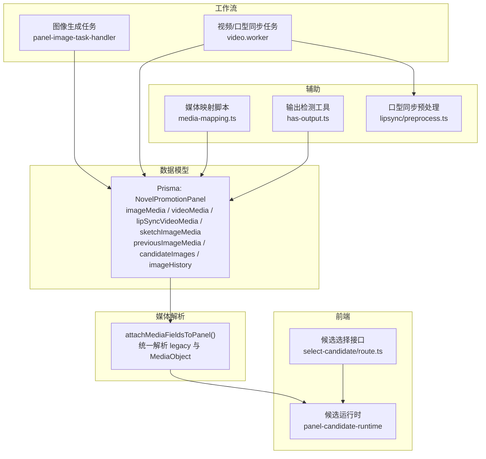
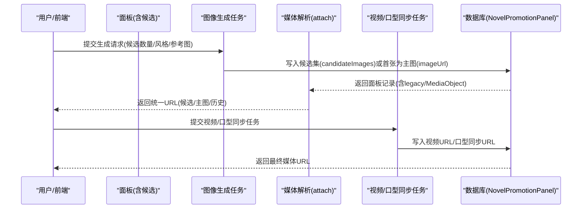
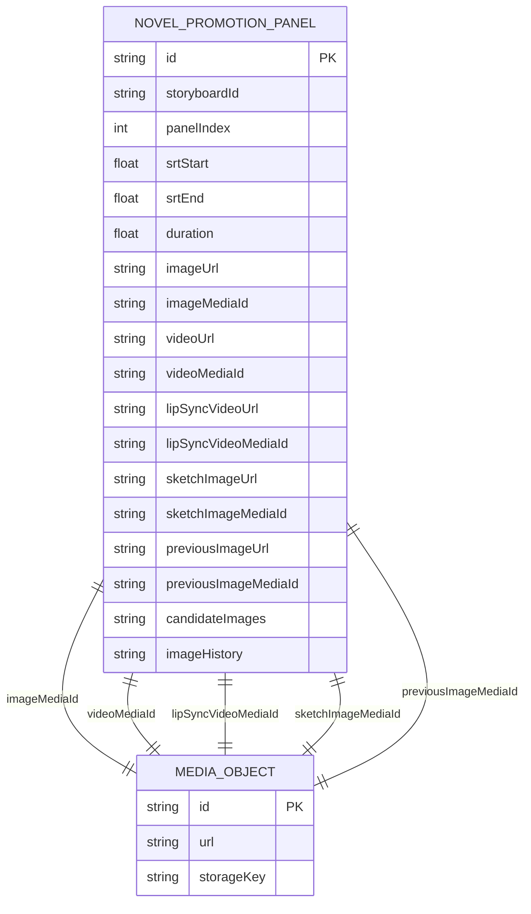
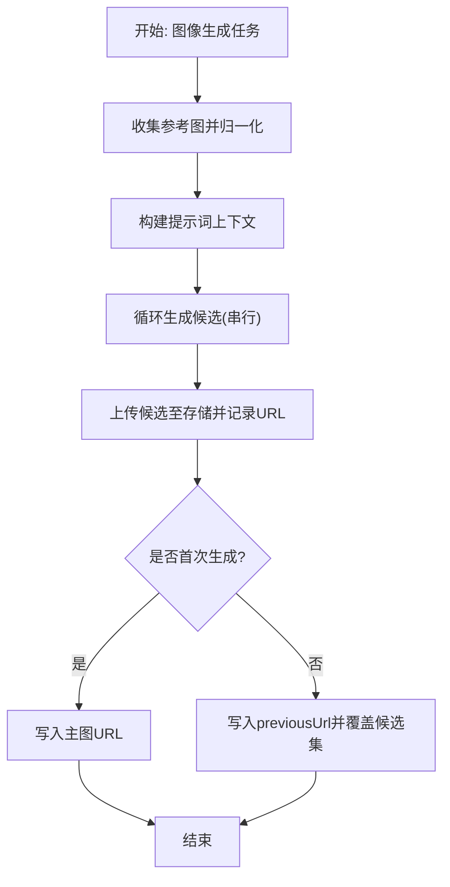
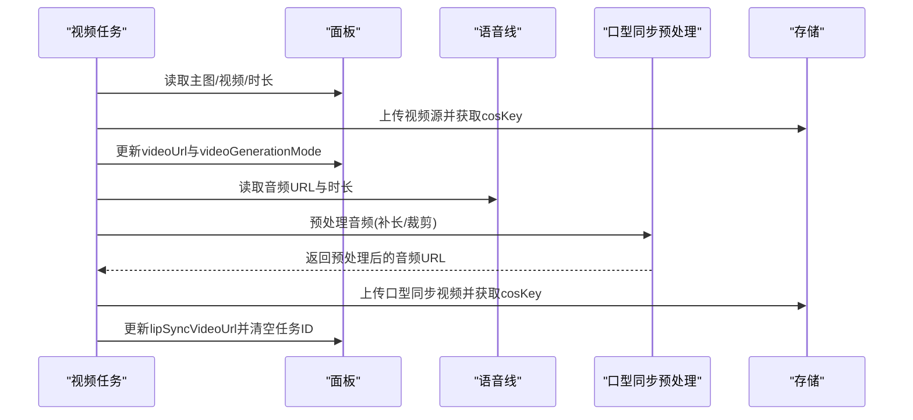
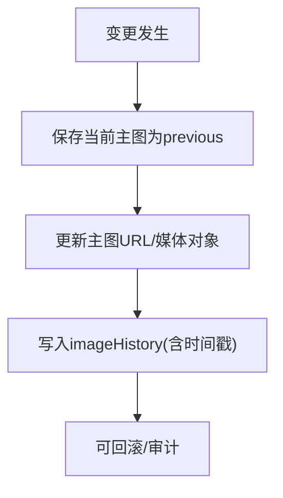
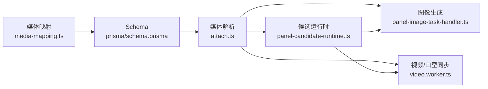

# 面板媒体模型

<cite>
**本文引用的文件**
- [prisma/schema.prisma](file://prisma/schema.prisma)
- [src/lib/media/attach.ts](file://src/lib/media/attach.ts)
- [src/lib/workers/handlers/panel-image-task-handler.ts](file://src/lib/workers/handlers/panel-image-task-handler.ts)
- [src/lib/workers/video.worker.ts](file://src/lib/workers/video.worker.ts)
- [src/app/api/novel-promotion/[projectId]/panel/select-candidate/route.ts](file://src/app/api/novel-promotion/[projectId]/panel/select-candidate/route.ts)
- [src/app/[locale]/workspace/[projectId]/modes/novel-promotion/components/storyboard/hooks/panel-candidate-runtime.ts](file://src/app/[locale]/workspace/[projectId]/modes/novel-promotion/components/storyboard/hooks/panel-candidate-runtime.ts)
- [src/lib/lipsync/preprocess.ts](file://src/lib/lipsync/preprocess.ts)
- [src/lib/lipsync/types.ts](file://src/lib/lipsync/types.ts)
- [scripts/media-mapping.ts](file://scripts/media-mapping.ts)
- [src/lib/task/has-output.ts](file://src/lib/task/has-output.ts)
</cite>

## 目录
1. [简介](#简介)
2. [项目结构](#项目结构)
3. [核心组件](#核心组件)
4. [架构总览](#架构总览)
5. [详细组件分析](#详细组件分析)
6. [依赖关系分析](#依赖关系分析)
7. [性能考量](#性能考量)
8. [故障排查指南](#故障排查指南)
9. [结论](#结论)
10. [附录](#附录)

## 简介
本文件系统性梳理 Waoowaoo 中 NovelPromotionPanel 实体的“面板媒体模型”，重点覆盖以下方面：
- 多类型媒体统一管理：图像、视频、口型同步视频、草图图像的字段设计与关联关系
- 多模态工作流：图像生成、视频合成、口型同步、草图绘制的端到端流程
- 历史记录与回滚：imageHistory、previousImageMediaId 的作用与媒体变更追踪
- 生命周期管理：从生成、编辑到确认的全流程追踪
- 版本控制与候选管理：候选图片的增量更新、选择与持久化策略
- 性能优化：大文件处理、实时预览与并发控制

## 项目结构
与面板媒体模型直接相关的代码分布在如下模块：
- 数据模型层：Prisma Schema 定义 NovelPromotionPanel 及其媒体字段
- 媒体解析层：attach.ts 将 legacy 字段与 MediaObject 关联统一为可消费的 URL
- 工作流层：图像生成与视频/口型同步任务处理器
- 前端候选运行时：候选列表初始化、选择与状态同步
- 辅助工具：媒体映射、输出检测、口型同步预处理

图表来源
- [prisma/schema.prisma](file://prisma/schema.prisma)
- [src/lib/media/attach.ts](file://src/lib/media/attach.ts)
- [src/lib/workers/handlers/panel-image-task-handler.ts](file://src/lib/workers/handlers/panel-image-task-handler.ts)
- [src/lib/workers/video.worker.ts](file://src/lib/workers/video.worker.ts)
- [src/app/[locale]/workspace/[projectId]/modes/novel-promotion/components/storyboard/hooks/panel-candidate-runtime.ts](file://src/app/[locale]/workspace/[projectId]/modes/novel-promotion/components/storyboard/hooks/panel-candidate-runtime.ts)
- [src/app/api/novel-promotion/[projectId]/panel/select-candidate/route.ts](file://src/app/api/novel-promotion/[projectId]/panel/select-candidate/route.ts)
- [scripts/media-mapping.ts](file://scripts/media-mapping.ts)
- [src/lib/task/has-output.ts](file://src/lib/task/has-output.ts)
- [src/lib/lipsync/preprocess.ts](file://src/lib/lipsync/preprocess.ts)

章节来源
- [prisma/schema.prisma](file://prisma/schema.prisma)
- [src/lib/media/attach.ts](file://src/lib/media/attach.ts)

## 核心组件
- NovelPromotionPanel 媒体字段族
  - 图像媒体：imageUrl、imageMediaId、imageMedia、imageHistory
  - 视频媒体：videoUrl、videoMediaId、videoMedia、videoGenerationMode
  - 口型同步视频：lipSyncVideoUrl、lipSyncVideoMediaId、lipSyncVideoMedia、lipSyncTaskId
  - 草图图像：sketchImageUrl、sketchImageMediaId、sketchImageMedia
  - 历史与回溯：previousImageUrl、previousImageMediaId、previousImageMedia
  - 候选集：candidateImages（JSON 字符串数组）
- 媒体解析器 attachMediaFieldsToPanel：将 legacy 字段与 MediaObject 解析为统一 URL，并对候选集进行兼容转换
- 图像生成任务处理器：构建提示词上下文、调用生成、上传并写入候选或主图
- 视频/口型同步任务处理器：基于面板主图或视频进行二次处理，产出视频与口型同步视频
- 候选运行时：维护面板候选列表、选择索引、pending 状态与增量更新
- 输出检测工具：hasPanelImageOutput/hasPanelVideoOutput/hasPanelLipSyncOutput

章节来源
- [prisma/schema.prisma](file://prisma/schema.prisma)
- [src/lib/media/attach.ts](file://src/lib/media/attach.ts)
- [src/lib/workers/handlers/panel-image-task-handler.ts](file://src/lib/workers/handlers/panel-image-task-handler.ts)
- [src/lib/workers/video.worker.ts](file://src/lib/workers/video.worker.ts)
- [src/app/[locale]/workspace/[projectId]/modes/novel-promotion/components/storyboard/hooks/panel-candidate-runtime.ts](file://src/app/[locale]/workspace/[projectId]/modes/novel-promotion/components/storyboard/hooks/panel-candidate-runtime.ts)
- [src/lib/task/has-output.ts](file://src/lib/task/has-output.ts)

## 架构总览
下图展示从“输入提示词/参考图”到“多模态输出”的整体流程，涵盖候选生成、主图确认、视频合成与口型同步。

图表来源
- [src/lib/workers/handlers/panel-image-task-handler.ts](file://src/lib/workers/handlers/panel-image-task-handler.ts)
- [src/lib/media/attach.ts](file://src/lib/media/attach.ts)
- [src/lib/workers/video.worker.ts](file://src/lib/workers/video.worker.ts)
- [prisma/schema.prisma](file://prisma/schema.prisma)

## 详细组件分析

### 媒体字段与关系设计
- 关键字段
  - imageMediaId → imageMedia：主图像媒体对象
  - videoMediaId → videoMedia：视频媒体对象
  - lipSyncVideoMediaId → lipSyncVideoMedia：口型同步视频媒体对象
  - sketchImageMediaId → sketchImageMedia：草图图像媒体对象
  - previousImageMediaId → previousImageMedia：上一张主图媒体对象
  - candidateImages：JSON 字符串数组，存储候选 URL 或“PENDING:索引”
  - imageHistory：历史记录(JSON 数组，包含 url 与 timestamp)
- 设计要点
  - legacy 字段与 MediaObject 并存，通过 attach 层统一解析
  - 候选集中“PENDING:”占位符用于前端实时预览与增量渲染
  - 历史记录与 previous 字段共同支撑“撤销/回退”能力

图表来源
- [prisma/schema.prisma](file://prisma/schema.prisma)

章节来源
- [prisma/schema.prisma](file://prisma/schema.prisma)
- [src/lib/media/attach.ts](file://src/lib/media/attach.ts)

### 图像生成与候选管理
- 流程概览
  - 收集参考图(normalizeReferenceImages)，构建提示词上下文(buildPanelPromptContext/buildPanelPrompt)
  - 串行生成候选，逐个上传至对象存储并记录候选 URL
  - 首次生成：将第一张候选作为主图；后续生成：将当前主图写入 previousImageUrl，并以候选集覆盖
- 候选运行时
  - 初始化：解析 candidateImages，过滤“PENDING:”得到有效候选
  - 选择：维护 selectedIndex，支持“生成开始/重生成/撤销”时重置为首项
  - 增量：当候选前缀一致时保留当前选择，否则重置为首项
- 候选选择接口
  - 提供面板候选选择的 API，解析历史记录结构，确保数据一致性

图表来源
- [src/lib/workers/handlers/panel-image-task-handler.ts](file://src/lib/workers/handlers/panel-image-task-handler.ts)

章节来源
- [src/lib/workers/handlers/panel-image-task-handler.ts](file://src/lib/workers/handlers/panel-image-task-handler.ts)
- [src/app/[locale]/workspace/[projectId]/modes/novel-promotion/components/storyboard/hooks/panel-candidate-runtime.ts](file://src/app/[locale]/workspace/[projectId]/modes/novel-promotion/components/storyboard/hooks/panel-candidate-runtime.ts)
- [src/app/api/novel-promotion/[projectId]/panel/select-candidate/route.ts](file://src/app/api/novel-promotion/[projectId]/panel/select-candidate/route.ts)

### 视频合成与口型同步
- 视频合成
  - 输入：面板主图(base64)、可选首尾帧(last frame)、视频提示词/参数
  - 处理：调用外部模型生成视频，上传至存储并写入 videoUrl 与 generationMode
- 口型同步
  - 输入：面板视频URL、语音线音频URL(带时长)
  - 预处理：根据提供商要求对音频进行补长/裁剪，必要时上传临时对象
  - 处理：提交口型同步任务，上传结果并写入 lipSyncVideoUrl，清空 lipSyncTaskId

图表来源
- [src/lib/workers/video.worker.ts](file://src/lib/workers/video.worker.ts)
- [src/lib/lipsync/preprocess.ts](file://src/lib/lipsync/preprocess.ts)
- [src/lib/lipsync/types.ts](file://src/lib/lipsync/types.ts)

章节来源
- [src/lib/workers/video.worker.ts](file://src/lib/workers/video.worker.ts)
- [src/lib/lipsync/preprocess.ts](file://src/lib/lipsync/preprocess.ts)
- [src/lib/lipsync/types.ts](file://src/lib/lipsync/types.ts)

### 历史记录与回滚机制
- imageHistory
  - 记录面板媒体变更历史，包含 url 与 timestamp，便于审计与回溯
- previousImageMediaId/previousImageUrl
  - 记录上一张主图，支持“撤销/回退”操作
- 输出检测
  - hasPanelImageOutput/hasPanelVideoOutput/hasPanelLipSyncOutput
  - 通过 imageMediaId、videoMediaId、lipSyncVideoMediaId 或 legacy URL 判断是否存在有效输出

图表来源
- [src/lib/task/has-output.ts](file://src/lib/task/has-output.ts)
- [prisma/schema.prisma](file://prisma/schema.prisma)

章节来源
- [src/lib/task/has-output.ts](file://src/lib/task/has-output.ts)
- [prisma/schema.prisma](file://prisma/schema.prisma)

### 版本控制与候选选择逻辑
- 候选集 candidateImages
  - JSON 字符串数组，元素为 URL 或“PENDING:索引”
  - 前端候选运行时负责：
    - 初始化：解析并过滤“PENDING:”
    - 选择：维护 selectedIndex
    - 增量：当候选前缀一致时保留当前选择，否则重置为首项
- 选择接口
  - 提供面板候选选择 API，解析历史记录结构，保证数据一致性

章节来源
- [src/app/[locale]/workspace/[projectId]/modes/novel-promotion/components/storyboard/hooks/panel-candidate-runtime.ts](file://src/app/[locale]/workspace/[projectId]/modes/novel-promotion/components/storyboard/hooks/panel-candidate-runtime.ts)
- [src/app/api/novel-promotion/[projectId]/panel/select-candidate/route.ts](file://src/app/api/novel-promotion/[projectId]/panel/select-candidate/route.ts)

### 生命周期管理
- 生成阶段：图像生成任务写入候选集或首张主图
- 编辑阶段：候选运行时维护选择与预览，支持撤销/重生成
- 确认阶段：选择某候选作为新主图，旧主图移至 previous，候选集清空
- 后续阶段：视频合成与口型同步，形成完整的多模态输出

章节来源
- [src/lib/workers/handlers/panel-image-task-handler.ts](file://src/lib/workers/handlers/panel-image-task-handler.ts)
- [src/lib/workers/video.worker.ts](file://src/lib/workers/video.worker.ts)
- [src/app/[locale]/workspace/[projectId]/modes/novel-promotion/components/storyboard/hooks/panel-candidate-runtime.ts](file://src/app/[locale]/workspace/[projectId]/modes/novel-promotion/components/storyboard/hooks/panel-candidate-runtime.ts)

## 依赖关系分析
- 媒体映射
  - scripts/media-mapping.ts 定义 novelPromotionPanel 的 legacy 字段到 mediaId 的映射，确保迁移与兼容
- 媒体解析
  - attach.ts 将 legacy 字段与 MediaObject 统一为 URL，同时对候选集进行兼容转换
- 任务执行
  - panel-image-task-handler 与 video.worker 分别负责图像与视频/口型同步的生成与落库
- 前端交互
  - panel-candidate-runtime 维护候选状态，select-candidate/route.ts 提供选择接口

图表来源
- [scripts/media-mapping.ts](file://scripts/media-mapping.ts)
- [prisma/schema.prisma](file://prisma/schema.prisma)
- [src/lib/media/attach.ts](file://src/lib/media/attach.ts)
- [src/app/[locale]/workspace/[projectId]/modes/novel-promotion/components/storyboard/hooks/panel-candidate-runtime.ts](file://src/app/[locale]/workspace/[projectId]/modes/novel-promotion/components/storyboard/hooks/panel-candidate-runtime.ts)
- [src/lib/workers/handlers/panel-image-task-handler.ts](file://src/lib/workers/handlers/panel-image-task-handler.ts)
- [src/lib/workers/video.worker.ts](file://src/lib/workers/video.worker.ts)

章节来源
- [scripts/media-mapping.ts](file://scripts/media-mapping.ts)
- [src/lib/media/attach.ts](file://src/lib/media/attach.ts)
- [src/lib/workers/handlers/panel-image-task-handler.ts](file://src/lib/workers/handlers/panel-image-task-handler.ts)
- [src/lib/workers/video.worker.ts](file://src/lib/workers/video.worker.ts)

## 性能考量
- 大文件处理
  - 图像/视频生成后统一上传至对象存储，避免在数据库中存储大二进制内容
  - 视频/口型同步任务支持下载头透传(如 Google 文件下载)，减少中间层拷贝
- 实时预览
  - 候选集中的“PENDING:”占位符用于前端即时显示生成进度，降低等待感知
  - 增量候选同步：当候选前缀一致时保留当前选择，避免频繁重置
- 并发与限流
  - 视频任务工作线程按用户维度进行并发门控，防止资源争用
  - 任务进度上报与断点续跑策略，提升吞吐与稳定性

章节来源
- [src/lib/workers/video.worker.ts](file://src/lib/workers/video.worker.ts)
- [src/app/[locale]/workspace/[projectId]/modes/novel-promotion/components/storyboard/hooks/panel-candidate-runtime.ts](file://src/app/[locale]/workspace/[projectId]/modes/novel-promotion/components/storyboard/hooks/panel-candidate-runtime.ts)

## 故障排查指南
- 常见错误与定位
  - 无主图/无视频：检查 hasPanelImageOutput/hasPanelVideoOutput/hasPanelLipSyncOutput 的返回值
  - 口型同步失败：确认面板存在 videoUrl、语音线存在 audioUrl 且时长匹配
  - 候选不更新：检查 candidateImages 是否包含“PENDING:”，以及候选前缀是否一致
- 排查步骤
  - 查看面板记录的 imageMediaId/videoMediaId/lipSyncVideoMediaId 与 legacy URL
  - 使用 attachMediaFieldsToPanel 统一解析 URL，核对候选集与选择索引
  - 检查任务日志与进度上报，确认生成阶段与持久化阶段是否成功

章节来源
- [src/lib/task/has-output.ts](file://src/lib/task/has-output.ts)
- [src/lib/media/attach.ts](file://src/lib/media/attach.ts)
- [src/lib/workers/video.worker.ts](file://src/lib/workers/video.worker.ts)

## 结论
NovelPromotionPanel 的媒体模型通过“legacy 字段 + MediaObject + 候选集 + 历史记录”的组合，实现了多模态媒体的统一管理与高效工作流。图像生成、视频合成、口型同步与草图绘制在任务层解耦，在前端通过候选运行时实现流畅的交互体验。配合媒体映射与解析工具，系统具备良好的扩展性与可维护性。

## 附录
- 媒体映射配置：定义 novelPromotionPanel 的 legacy 字段到 mediaId 的映射规则
- 输出检测工具：快速判断面板是否存在图像/视频/口型同步输出

章节来源
- [scripts/media-mapping.ts](file://scripts/media-mapping.ts)
- [src/lib/task/has-output.ts](file://src/lib/task/has-output.ts)