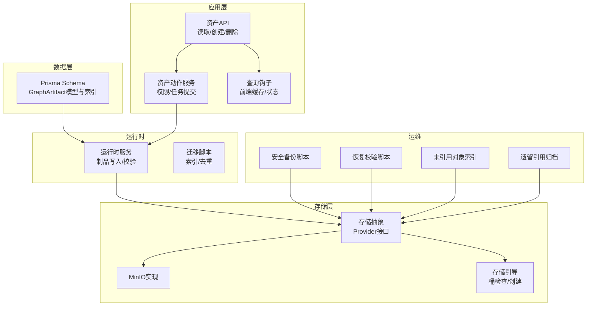
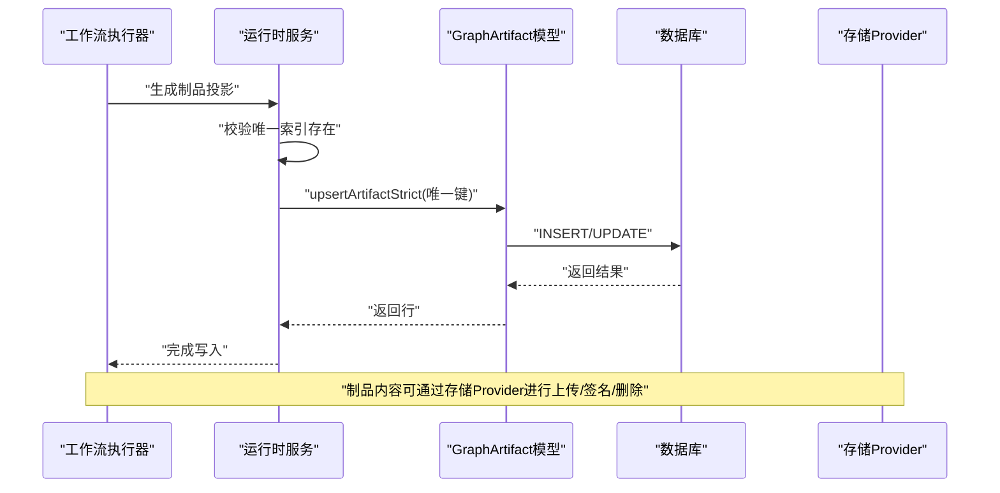
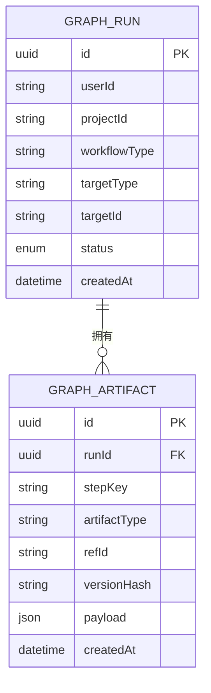
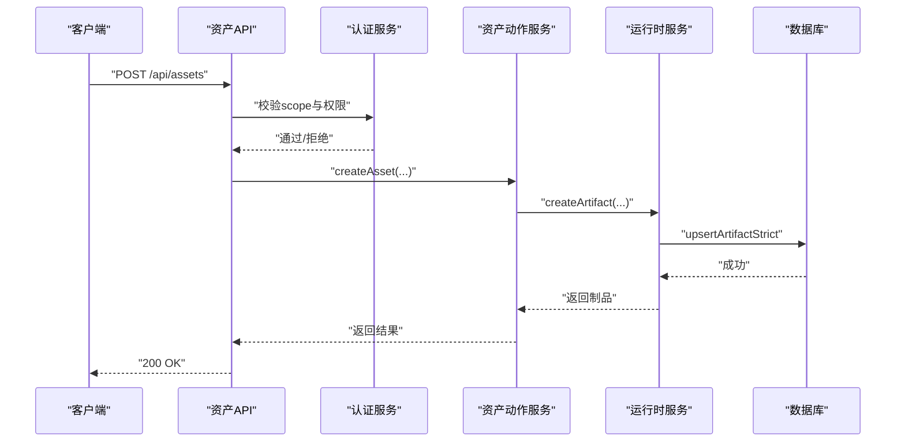
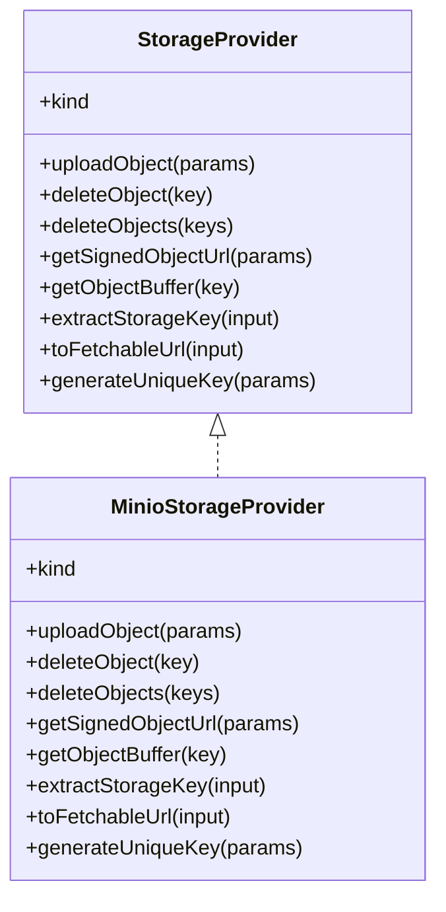
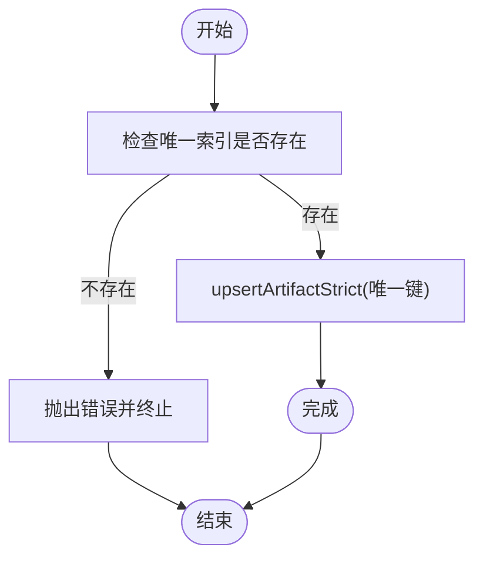
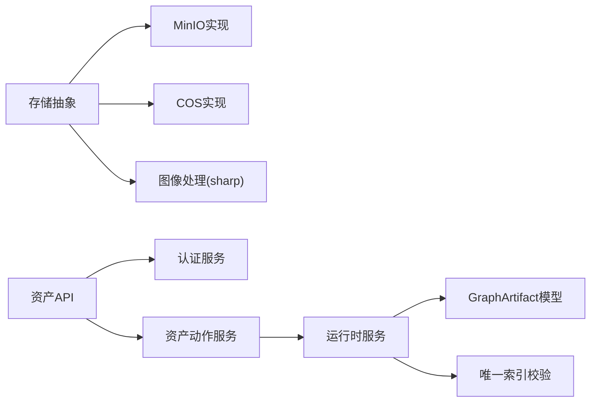

# GraphArtifact制品存储

<cite>
**本文档引用的文件**
- [schema.prisma](file://prisma/schema.prisma)
- [service.ts](file://src/lib/run-runtime/service.ts)
- [migrate-graph-artifacts-unique-index.ts](file://scripts/migrations/migrate-graph-artifacts-unique-index.ts)
- [migrate-release-blockers.ts](file://scripts/migrations/migrate-release-blockers.ts)
- [types.ts](file://src/lib/storage/types.ts)
- [minio.ts](file://src/lib/storage/providers/minio.ts)
- [index.ts](file://src/lib/storage/index.ts)
- [bootstrap.ts](file://src/lib/storage/bootstrap.ts)
- [media-safety-backup.ts](file://scripts/media-safety-backup.ts)
- [media-restore-dry-run.ts](file://scripts/media-restore-dry-run.ts)
- [media-build-unreferenced-index.ts](file://scripts/media-build-unreferenced-index.ts)
- [media-archive-legacy-refs.ts](file://scripts/media-archive-legacy-refs.ts)
- [test-minio.ts](file://scripts/test-minio.ts)
- [route.ts](file://src/app/api/assets/route.ts)
- [asset-actions.ts](file://src/lib/assets/services/asset-actions.ts)
- [useAssets.ts](file://src/lib/query/hooks/useAssets.ts)
- [route.ts](file://src/app/api/assets/[assetId]/route.ts)
- [core.ts](file://src/lib/logging/core.ts)
- [types.ts](file://src/lib/logging/types.ts)
- [check-log-semantic.ts](file://scripts/check-log-semantic.ts)
</cite>

## 目录
1. [简介](#简介)
2. [项目结构](#项目结构)
3. [核心组件](#核心组件)
4. [架构总览](#架构总览)
5. [详细组件分析](#详细组件分析)
6. [依赖分析](#依赖分析)
7. [性能考虑](#性能考虑)
8. [故障排查指南](#故障排查指南)
9. [结论](#结论)
10. [附录](#附录)

## 简介
本文件面向GraphArtifact制品存储系统，系统化梳理制品实体设计、类型管理、引用关系、版本控制、创建/关联/清理流程、元数据与索引、访问权限、完整性校验与一致性保障、监控与备份恢复、以及扩展性与自定义制品类型支持能力。文档以仓库中实际代码为依据，结合迁移脚本、运行时服务、存储抽象层与备份工具链，形成可操作、可验证的技术文档。

## 项目结构
围绕GraphArtifact制品存储的关键目录与文件如下：
- 数据模型与索引：prisma/schema.prisma中的GraphArtifact模型与相关索引
- 运行时写入与约束：src/lib/run-runtime/service.ts中的制品写入与唯一索引校验
- 迁移与去重：scripts/migrations下的索引与重复数据处理脚本
- 存储抽象与多提供商：src/lib/storage/*（类型、工厂、MinIO实现、引导）
- 备份与恢复：scripts/media-*系列脚本
- API与权限：src/app/api/assets*与src/lib/assets/services/asset-actions.ts
- 日志与监控：src/lib/logging/*与scripts/check-log-semantic.ts

**图表来源**
- [schema.prisma](file://prisma/schema.prisma)
- [service.ts](file://src/lib/run-runtime/service.ts)
- [migrate-graph-artifacts-unique-index.ts](file://scripts/migrations/migrate-graph-artifacts-unique-index.ts)
- [types.ts](file://src/lib/storage/types.ts)
- [minio.ts](file://src/lib/storage/providers/minio.ts)
- [bootstrap.ts](file://src/lib/storage/bootstrap.ts)
- [media-safety-backup.ts](file://scripts/media-safety-backup.ts)
- [media-restore-dry-run.ts](file://scripts/media-restore-dry-run.ts)
- [media-build-unreferenced-index.ts](file://scripts/media-build-unreferenced-index.ts)
- [media-archive-legacy-refs.ts](file://scripts/media-archive-legacy-refs.ts)
- [route.ts](file://src/app/api/assets/route.ts)
- [asset-actions.ts](file://src/lib/assets/services/asset-actions.ts)
- [useAssets.ts](file://src/lib/query/hooks/useAssets.ts)

**章节来源**
- [schema.prisma](file://prisma/schema.prisma)
- [service.ts](file://src/lib/run-runtime/service.ts)
- [migrate-graph-artifacts-unique-index.ts](file://scripts/migrations/migrate-graph-artifacts-unique-index.ts)
- [types.ts](file://src/lib/storage/types.ts)
- [minio.ts](file://src/lib/storage/providers/minio.ts)
- [bootstrap.ts](file://src/lib/storage/bootstrap.ts)
- [media-safety-backup.ts](file://scripts/media-safety-backup.ts)
- [media-restore-dry-run.ts](file://scripts/media-restore-dry-run.ts)
- [media-build-unreferenced-index.ts](file://scripts/media-build-unreferenced-index.ts)
- [media-archive-legacy-refs.ts](file://scripts/media-archive-legacy-refs.ts)
- [route.ts](file://src/app/api/assets/route.ts)
- [asset-actions.ts](file://src/lib/assets/services/asset-actions.ts)
- [useAssets.ts](file://src/lib/query/hooks/useAssets.ts)

## 核心组件
- GraphArtifact实体与索引
  - 实体字段：runId、stepKey、artifactType、refId、versionHash、payload、createdAt
  - 唯一索引：runId + stepKey + artifactType + refId，确保同一运行步骤下同类型引用的唯一性
  - 辅助索引：runId、runId+stepKey、artifactType+refId，支撑查询与清理
- 运行时写入与一致性
  - 写入前强制校验唯一索引存在，避免重复与竞态
  - upsertArtifactStrict按唯一键更新或创建，保持幂等
- 存储抽象与多提供商
  - 统一StorageProvider接口，支持minio/local/cos
  - 提供上传、签名URL、批量删除、对象下载等能力
- 资产API与权限
  - 支持全局/项目作用域的资产读取与创建
  - 删除仅限特定资产类型（location/prop）
- 备份与恢复
  - 安全备份：导出关键表快照、计算校验、统计存储对象
  - 恢复校验：对比当前数据库计数与备份预期差异
  - 未引用对象索引：扫描存储中未被数据库引用的对象
  - 遗留引用归档：提取并归档历史媒体引用，便于审计与迁移

**章节来源**
- [schema.prisma](file://prisma/schema.prisma)
- [service.ts](file://src/lib/run-runtime/service.ts)
- [types.ts](file://src/lib/storage/types.ts)
- [route.ts](file://src/app/api/assets/route.ts)
- [asset-actions.ts](file://src/lib/assets/services/asset-actions.ts)
- [media-safety-backup.ts](file://scripts/media-safety-backup.ts)
- [media-restore-dry-run.ts](file://scripts/media-restore-dry-run.ts)
- [media-build-unreferenced-index.ts](file://scripts/media-build-unreferenced-index.ts)
- [media-archive-legacy-refs.ts](file://scripts/media-archive-legacy-refs.ts)

## 架构总览
GraphArtifact制品存储贯穿“运行时写入—数据模型—存储抽象—应用API—运维备份”的完整链路。运行时通过严格索引约束保证唯一性；Prisma模型定义实体与索引；存储抽象屏蔽底层提供商差异；API层实现权限控制与业务编排；运维脚本保障数据完整性与可恢复性。

**图表来源**
- [service.ts](file://src/lib/run-runtime/service.ts)
- [schema.prisma](file://prisma/schema.prisma)

**章节来源**
- [service.ts](file://src/lib/run-runtime/service.ts)
- [schema.prisma](file://prisma/schema.prisma)

## 详细组件分析

### GraphArtifact实体与索引
- 设计要点
  - 唯一键组合：runId + stepKey + artifactType + refId，确保在单次运行步骤内，同类型引用唯一
  - 版本哈希versionHash：用于标识制品版本，支持幂等更新与变更追踪
  - payload：JSON结构承载制品元数据或引用信息
  - 辅助索引：提升按运行、按类型+引用的查询效率
- 索引迁移与去重
  - 迁移脚本负责添加唯一索引，并在存在重复组时抛错或先去重再添加
  - 运行时启动时亦会校验唯一索引存在，防止脏数据进入

**图表来源**
- [schema.prisma](file://prisma/schema.prisma)

**章节来源**
- [schema.prisma](file://prisma/schema.prisma)
- [migrate-graph-artifacts-unique-index.ts](file://scripts/migrations/migrate-graph-artifacts-unique-index.ts)
- [migrate-release-blockers.ts](file://scripts/migrations/migrate-release-blockers.ts)
- [service.ts](file://src/lib/run-runtime/service.ts)

### 制品创建、关联与清理流程
- 创建与关联
  - 运行时通过createArtifact封装参数并调用upsertArtifactStrict，确保唯一键存在且幂等
  - API层支持按scope（全局/项目）与kind（字符/场景/道具/声音）读取与创建资产
- 清理策略
  - 存储层提供批量删除接口，配合数据库清理策略
  - 未引用对象索引脚本可识别存储中孤立对象，辅助清理
- 权限控制
  - 资产API对项目作用域要求projectId与项目权限认证
  - 全局作用域要求用户认证

**图表来源**
- [route.ts](file://src/app/api/assets/route.ts)
- [asset-actions.ts](file://src/lib/assets/services/asset-actions.ts)
- [service.ts](file://src/lib/run-runtime/service.ts)

**章节来源**
- [route.ts](file://src/app/api/assets/route.ts)
- [asset-actions.ts](file://src/lib/assets/services/asset-actions.ts)
- [service.ts](file://src/lib/run-runtime/service.ts)

### 存储策略与访问权限
- 存储策略
  - 统一StorageProvider接口，支持minio/local/cos
  - 提供上传、签名URL、批量删除、对象下载、唯一Key生成等能力
  - 本地/MinIO迁移脚本与引导脚本确保桶可用与数据迁移
- 访问权限
  - API层根据scope区分权限路径：项目作用域需projectId与项目权限；全局作用域需用户认证
  - 删除接口限定为location/prop两类资产

**图表来源**
- [types.ts](file://src/lib/storage/types.ts)
- [minio.ts](file://src/lib/storage/providers/minio.ts)

**章节来源**
- [types.ts](file://src/lib/storage/types.ts)
- [minio.ts](file://src/lib/storage/providers/minio.ts)
- [index.ts](file://src/lib/storage/index.ts)
- [bootstrap.ts](file://src/lib/storage/bootstrap.ts)
- [route.ts](file://src/app/api/assets/[assetId]/route.ts)

### 元数据管理、索引优化与查询接口
- 元数据
  - GraphArtifact.payload承载制品元数据；versionHash用于版本标识
- 索引优化
  - 唯一索引：runId + stepKey + artifactType + refId
  - 辅助索引：runId、runId+stepKey、artifactType+refId
- 查询接口
  - 资产API支持按scope、projectId、folderId、kind过滤查询
  - 前端查询钩子useAssets提供缓存与任务状态整合

**章节来源**
- [schema.prisma](file://prisma/schema.prisma)
- [route.ts](file://src/app/api/assets/route.ts)
- [useAssets.ts](file://src/lib/query/hooks/useAssets.ts)

### 版本哈希、完整性校验与一致性保证
- 版本哈希
  - versionHash用于标识制品版本，配合upsert实现幂等更新
- 完整性校验
  - 运行时启动前校验唯一索引存在，迁移脚本在添加索引前检测重复组并报错或先去重
- 一致性保证
  - 唯一键约束 + upsert语义 + 唯一索引前置校验，避免竞态与重复

**图表来源**
- [service.ts](file://src/lib/run-runtime/service.ts)
- [migrate-graph-artifacts-unique-index.ts](file://scripts/migrations/migrate-graph-artifacts-unique-index.ts)

**章节来源**
- [service.ts](file://src/lib/run-runtime/service.ts)
- [migrate-graph-artifacts-unique-index.ts](file://scripts/migrations/migrate-graph-artifacts-unique-index.ts)
- [migrate-release-blockers.ts](file://scripts/migrations/migrate-release-blockers.ts)

### 监控指标、存储优化与备份恢复
- 监控
  - 日志规范：统一日志上下文字段（requestId、taskId、projectId、userId、module、action、errorCode、retryable、durationMs、provider、details、error）
  - 脚本校验：check-log-semantic确保关键模块遵循日志规范
- 存储优化
  - 上传前图像压缩与大小限制，减少带宽与存储成本
  - 批量删除与未引用对象索引，降低存储冗余
- 备份与恢复
  - 安全备份：导出关键表快照、计算校验、统计存储对象
  - 恢复校验：对比当前数据库计数与备份预期差异，发现漂移
  - 未引用对象索引：定位存储中未被数据库引用的对象
  - 遗留引用归档：提取历史媒体引用，便于审计与迁移

**章节来源**
- [core.ts](file://src/lib/logging/core.ts)
- [types.ts](file://src/lib/logging/types.ts)
- [check-log-semantic.ts](file://scripts/check-log-semantic.ts)
- [index.ts](file://src/lib/storage/index.ts)
- [media-safety-backup.ts](file://scripts/media-safety-backup.ts)
- [media-restore-dry-run.ts](file://scripts/media-restore-dry-run.ts)
- [media-build-unreferenced-index.ts](file://scripts/media-build-unreferenced-index.ts)
- [media-archive-legacy-refs.ts](file://scripts/media-archive-legacy-refs.ts)

### 扩展性设计与自定义制品类型支持
- 扩展点
  - 唯一键组合允许在不同runId/stepKey下扩展制品类型，无需修改Schema
  - payload字段承载任意JSON元数据，便于扩展新类型
- 支持能力
  - 运行时通过artifactType与refId解耦具体制品类型与引用关系
  - API层按scope/kind扩展新的资产类型（当前已覆盖字符/场景/道具/声音）

**章节来源**
- [schema.prisma](file://prisma/schema.prisma)
- [service.ts](file://src/lib/run-runtime/service.ts)
- [route.ts](file://src/app/api/assets/route.ts)

## 依赖分析
- 组件耦合
  - 运行时服务依赖Prisma模型与唯一索引校验
  - 存储抽象独立于业务，通过Provider接口解耦
  - API层依赖认证服务与资产动作服务
- 外部依赖
  - MinIO SDK、COS SDK、@aws-sdk/client-s3等用于不同存储提供商
  - sharp用于图像处理与压缩

**图表来源**
- [service.ts](file://src/lib/run-runtime/service.ts)
- [types.ts](file://src/lib/storage/types.ts)
- [minio.ts](file://src/lib/storage/providers/minio.ts)
- [route.ts](file://src/app/api/assets/route.ts)
- [asset-actions.ts](file://src/lib/assets/services/asset-actions.ts)

**章节来源**
- [service.ts](file://src/lib/run-runtime/service.ts)
- [types.ts](file://src/lib/storage/types.ts)
- [minio.ts](file://src/lib/storage/providers/minio.ts)
- [route.ts](file://src/app/api/assets/route.ts)
- [asset-actions.ts](file://src/lib/assets/services/asset-actions.ts)

## 性能考虑
- 索引命中
  - 唯一键与辅助索引确保upsert与查询高效
- I/O优化
  - 上传前图像压缩与大小限制，降低网络与存储压力
  - 批量删除接口减少多次往返
- 并发与重试
  - 上传操作具备重试机制，提升稳定性

[本节为通用建议，无需列出具体文件来源]

## 故障排查指南
- 唯一索引缺失
  - 现象：运行时启动报错或迁移脚本报错
  - 排查：确认唯一索引是否已添加；若存在重复组，先执行去重再添加
- 重复数据
  - 现象：迁移脚本提示存在重复组
  - 排查：使用去重脚本清理重复后再添加唯一索引
- 存储异常
  - 现象：上传/签名/删除失败
  - 排查：检查Provider配置、桶权限与网络连通性；使用test-minio脚本验证
- 备份/恢复问题
  - 现象：恢复校验差异或备份不完整
  - 排查：核对备份目录与元数据文件；使用恢复校验脚本比对当前数据库计数

**章节来源**
- [service.ts](file://src/lib/run-runtime/service.ts)
- [migrate-graph-artifacts-unique-index.ts](file://scripts/migrations/migrate-graph-artifacts-unique-index.ts)
- [migrate-release-blockers.ts](file://scripts/migrations/migrate-release-blockers.ts)
- [test-minio.ts](file://scripts/test-minio.ts)
- [media-restore-dry-run.ts](file://scripts/media-restore-dry-run.ts)
- [media-safety-backup.ts](file://scripts/media-safety-backup.ts)

## 结论
GraphArtifact制品存储通过严格的唯一索引约束、完善的运行时写入流程、可插拔的存储抽象与健全的运维工具链，实现了制品的可靠存储、高效查询与可恢复性。其扩展性强，可通过artifactType与payload灵活支持多种制品类型；同时具备良好的监控与备份能力，满足生产环境的稳定性与可维护性需求。

[本节为总结性内容，无需列出具体文件来源]

## 附录
- 最佳实践
  - 在创建制品前确保唯一索引存在
  - 使用payload承载制品元数据，versionHash用于版本标识
  - 定期执行未引用对象索引与备份，保障数据健康
- 常用命令
  - 运行迁移脚本：tsx scripts/migrations/migrate-graph-artifacts-unique-index.ts --apply
  - 测试MinIO：tsx scripts/test-minio.ts
  - 安全备份：tsx scripts/media-safety-backup.ts
  - 恢复校验：tsx scripts/media-restore-dry-run.ts
  - 未引用索引：tsx scripts/media-build-unreferenced-index.ts
  - 遗留引用归档：tsx scripts/media-archive-legacy-refs.ts

[本节为补充信息，无需列出具体文件来源]