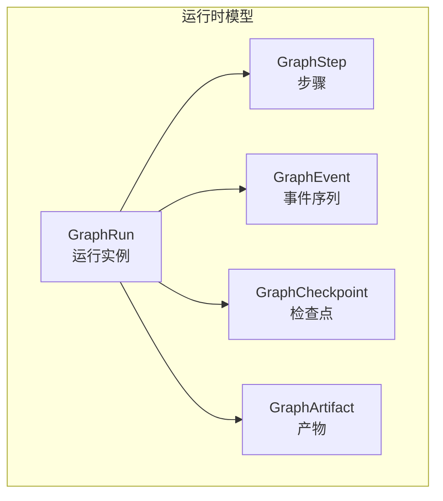
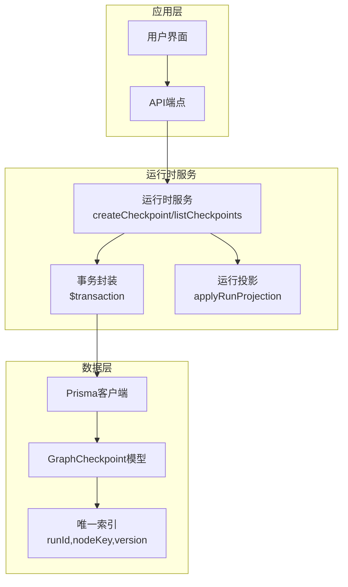
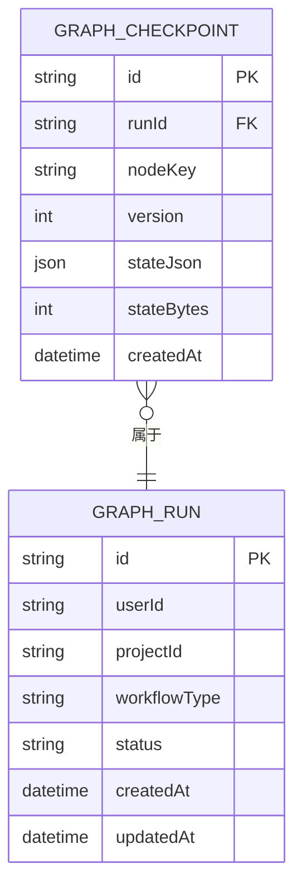
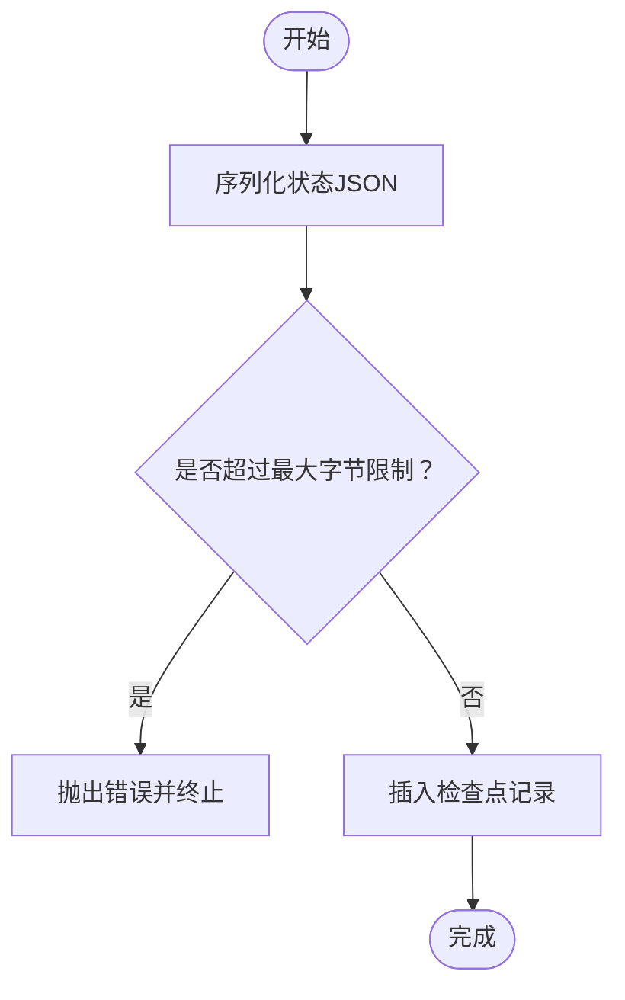
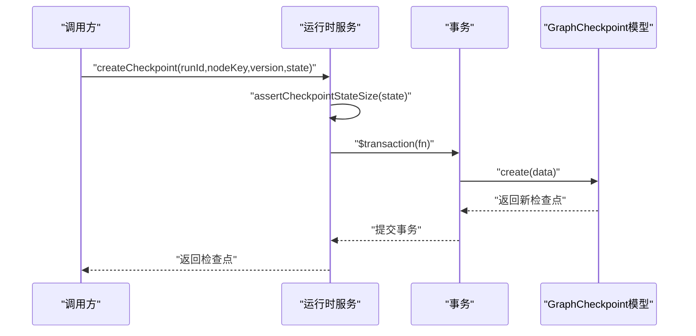
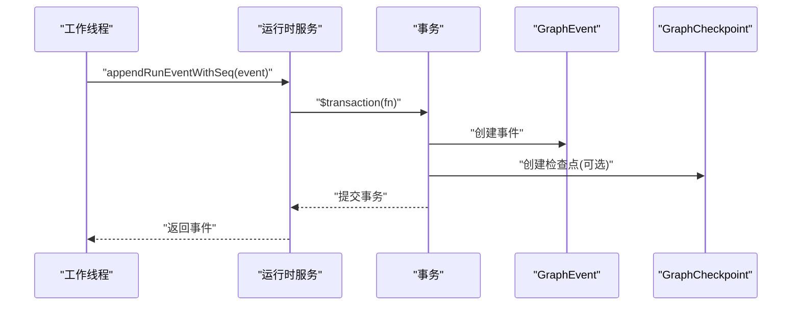
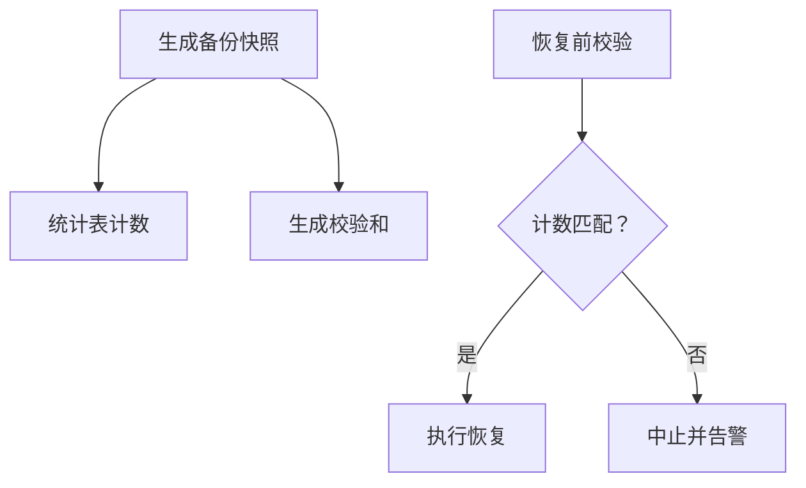

# GraphCheckpoint检查点管理

<cite>
**本文档引用的文件**
- [service.ts](file://src/lib/run-runtime/service.ts)
- [types.ts](file://src/lib/run-runtime/types.ts)
- [schema.prisma](file://prisma/schema.prisma)
- [recovery.ts](file://src/lib/run-runtime/recovery.ts)
- [recovery-probe.ts](file://src/lib/query/hooks/run-stream/recovery-probe.ts)
- [media-restore-dry-run.ts](file://scripts/media-restore-dry-run.ts)
- [media-safety-backup.ts](file://scripts/media-safety-backup.ts)
</cite>

## 目录
1. [简介](#简介)
2. [项目结构](#项目结构)
3. [核心组件](#核心组件)
4. [架构概览](#架构概览)
5. [详细组件分析](#详细组件分析)
6. [依赖分析](#依赖分析)
7. [性能考虑](#性能考虑)
8. [故障排查指南](#故障排查指南)
9. [结论](#结论)
10. [附录](#附录)

## 简介
本文件为GraphCheckpoint检查点管理系统的技术文档，聚焦于检查点实体的设计与实现，涵盖版本管理、状态快照与恢复机制、创建/更新/清理流程、增量与全量检查点差异、存储策略与空间优化、版本控制与回滚机制、一致性保证、监控指标与性能分析、故障恢复工具，以及扩展性与自定义策略支持。该系统基于Prisma数据库模型与运行时服务层实现，确保在复杂工作流执行过程中对节点状态进行可靠持久化与可追溯恢复。

## 项目结构
GraphCheckpoint位于运行时子系统中，与GraphRun、GraphStep、GraphEvent、GraphArtifact等模型共同构成工作流执行与状态管理的核心数据层。检查点通过唯一索引约束保证同一运行、节点与版本的幂等写入；通过查询接口支持按运行与节点维度检索历史版本，为增量/全量检查点策略提供基础。

**图表来源**
- [schema.prisma:648-777](file://prisma/schema.prisma#L648-L777)

**章节来源**
- [schema.prisma:648-777](file://prisma/schema.prisma#L648-L777)

## 核心组件
- GraphCheckpoint模型：存储节点状态快照，包含运行ID、节点键、版本号、状态JSON与字节大小等字段，并建立唯一索引以避免重复版本覆盖。
- 运行时服务层：提供创建检查点、列出检查点、断言状态大小等能力；配合事务保证事件与检查点的一致性。
- 类型与限制：定义运行状态、事件类型、最大状态字节数等常量与类型，确保系统行为一致与安全。
- 恢复与探测：通过恢复逻辑选择可恢复运行实例，结合探测机制在无本地状态时自动恢复。

**章节来源**
- [schema.prisma:764-777](file://prisma/schema.prisma#L764-L777)
- [service.ts:114-146](file://src/lib/run-runtime/service.ts#L114-L146)
- [types.ts:100-101](file://src/lib/run-runtime/types.ts#L100-L101)
- [recovery.ts:17-48](file://src/lib/run-runtime/recovery.ts#L17-L48)

## 架构概览
GraphCheckpoint在整体架构中的位置如下：

**图表来源**
- [service.ts:900-929](file://src/lib/run-runtime/service.ts#L900-L929)
- [service.ts:987-1021](file://src/lib/run-runtime/service.ts#L987-L1021)
- [schema.prisma:764-777](file://prisma/schema.prisma#L764-L777)

## 详细组件分析

### GraphCheckpoint实体设计
- 字段与约束
  - 唯一索引：runId + nodeKey + version，确保单节点在单次运行内的版本幂等。
  - 索引：runId + createdAt，便于按时间顺序查询最新检查点。
  - 字段：stateJson（状态快照）、stateBytes（字节大小）、createdAt（创建时间）。
- 数据模型映射：Prisma模型与数据库表一一对应，支持外键关联到GraphRun。

**图表来源**
- [schema.prisma:764-777](file://prisma/schema.prisma#L764-L777)
- [schema.prisma:648-688](file://prisma/schema.prisma#L648-L688)

**章节来源**
- [schema.prisma:764-777](file://prisma/schema.prisma#L764-L777)

### 版本管理与状态快照
- 版本号语义：版本号递增，同一runId+nodeKey下仅保留最新版本，旧版本通过历史查询接口获取。
- 状态快照：stateJson保存节点状态，stateBytes记录字节大小，用于容量控制。
- 最大状态限制：RUN_STATE_MAX_BYTES限制单个检查点状态大小，防止过大快照影响性能与存储。

**图表来源**
- [service.ts:962-969](file://src/lib/run-runtime/service.ts#L962-L969)
- [service.ts:994-1002](file://src/lib/run-runtime/service.ts#L994-L1002)
- [types.ts:100-101](file://src/lib/run-runtime/types.ts#L100-L101)

**章节来源**
- [service.ts:962-1003](file://src/lib/run-runtime/service.ts#L962-L1003)
- [types.ts:100-101](file://src/lib/run-runtime/types.ts#L100-L101)

### 创建、更新与清理流程
- 创建检查点
  - 步骤：断言状态大小 → 写入数据库 → 返回结果。
  - 事务：通常与事件写入在同一事务中，保证一致性。
- 更新检查点
  - 由于唯一索引约束，新版本会覆盖旧版本；若需保留历史，应使用不同版本号。
- 清理策略
  - 当前未发现专门的检查点清理函数；可通过业务策略定期删除过期或冗余版本，或在运行完成后清理无关版本。

**图表来源**
- [service.ts:987-1003](file://src/lib/run-runtime/service.ts#L987-L1003)
- [service.ts:900-929](file://src/lib/run-runtime/service.ts#L900-L929)

**章节来源**
- [service.ts:987-1021](file://src/lib/run-runtime/service.ts#L987-L1021)
- [service.ts:900-929](file://src/lib/run-runtime/service.ts#L900-L929)

### 增量检查点与全量检查点
- 增量检查点
  - 通过版本号递增实现，仅保存状态变化部分；适合频繁更新但体量较小的状态。
  - 查询接口支持按节点键过滤，便于快速定位最近版本。
- 全量检查点
  - 保存完整状态快照，便于快速恢复与审计；适合关键节点或阶段性里程碑。
- 差异对比
  - 增量：更节省存储，但需要版本链路；全量：恢复简单，但占用更多空间。

**章节来源**
- [service.ts:1005-1021](file://src/lib/run-runtime/service.ts#L1005-L1021)

### 存储策略、压缩与空间优化
- 存储策略
  - 使用JSON字段存储状态，配合stateBytes记录字节大小，便于容量监控。
  - 唯一索引保证版本幂等，避免重复写入造成膨胀。
- 压缩算法
  - 代码中未发现显式压缩实现；可在应用层对stateJson进行压缩后再入库，或在数据库层面启用压缩（取决于底层存储支持）。
- 空间优化建议
  - 定期清理历史版本（业务侧策略）。
  - 合理设置RUN_STATE_MAX_BYTES阈值，避免超大快照。
  - 对热点节点采用全量+周期性清理策略。

**章节来源**
- [schema.prisma:764-777](file://prisma/schema.prisma#L764-L777)
- [types.ts:100-101](file://src/lib/run-runtime/types.ts#L100-L101)

### 版本控制、回滚机制与一致性保证
- 版本控制
  - 唯一索引runId+nodeKey+version确保版本唯一性；查询按version降序，优先获取最新版本。
- 回滚机制
  - 通过listCheckpoints获取历史版本，结合业务逻辑选择目标版本进行恢复。
  - 运行时服务层在事件处理中使用事务，确保事件与检查点写入的一致性。
- 一致性保证
  - 事务包裹事件与检查点写入，避免中间态导致的数据不一致。
  - 恢复逻辑selectRecoverableRun优先选择最新活跃运行，减少冲突概率。

**图表来源**
- [service.ts:899-929](file://src/lib/run-runtime/service.ts#L899-L929)
- [service.ts:987-1003](file://src/lib/run-runtime/service.ts#L987-L1003)

**章节来源**
- [service.ts:899-929](file://src/lib/run-runtime/service.ts#L899-L929)
- [service.ts:1005-1021](file://src/lib/run-runtime/service.ts#L1005-L1021)
- [recovery.ts:50-85](file://src/lib/run-runtime/recovery.ts#L50-L85)

### 监控指标、性能分析与故障恢复工具
- 监控指标
  - 检查点数量：按runId统计GraphCheckpoint数量，评估版本密度。
  - 状态大小分布：stateBytes直方图，识别异常大快照。
  - 写入延迟：事件与检查点写入耗时，结合事务日志分析。
- 性能分析
  - 唯一索引命中率：runId+nodeKey+version的写入路径应保持高命中。
  - 查询性能：按version降序与按createdAt索引的查询成本。
- 故障恢复工具
  - 备份与校验：媒体安全备份脚本生成表计数快照与校验和，用于恢复前验证一致性。
  - 恢复探测：运行流恢复探测器在无本地状态时轮询查找活跃运行ID并触发恢复回调。

**图表来源**
- [media-safety-backup.ts:207-224](file://scripts/media-safety-backup.ts#L207-L224)
- [media-restore-dry-run.ts:73-102](file://scripts/media-restore-dry-run.ts#L73-L102)

**章节来源**
- [media-safety-backup.ts:179-224](file://scripts/media-safety-backup.ts#L179-L224)
- [media-restore-dry-run.ts:73-102](file://scripts/media-restore-dry-run.ts#L73-L102)
- [recovery-probe.ts:47-90](file://src/lib/query/hooks/run-stream/recovery-probe.ts#L47-L90)

### 扩展性设计与自定义策略支持
- 扩展性
  - 模型层：新增字段（如压缩标志、策略标签）可在Prisma层扩展，不影响现有查询。
  - 服务层：通过参数化策略（版本间隔、清理阈值）支持多种检查点策略。
- 自定义策略
  - 增量/全量混合：热点节点全量+周期清理，非热点节点增量。
  - 条件触发：根据节点状态变化频率动态调整版本生成策略。
  - 外部存储：将stateJson落地到对象存储，数据库仅存元信息与访问签名。

**章节来源**
- [schema.prisma:764-777](file://prisma/schema.prisma#L764-L777)
- [service.ts:987-1021](file://src/lib/run-runtime/service.ts#L987-L1021)

## 依赖分析
- 组件耦合
  - GraphCheckpoint依赖GraphRun作为父实体，通过外键关联。
  - 运行时服务层依赖Prisma客户端与事务封装，保证原子性。
- 外部依赖
  - Prisma ORM：提供模型定义与查询能力。
  - 数据库：MySQL，支持唯一索引与JSON字段。
- 潜在循环依赖
  - 未发现直接循环依赖；服务层通过类型声明与Prisma客户端解耦。

**图表来源**
- [service.ts:146-146](file://src/lib/run-runtime/service.ts#L146-L146)
- [schema.prisma:764-777](file://prisma/schema.prisma#L764-L777)
- [schema.prisma:648-688](file://prisma/schema.prisma#L648-L688)

**章节来源**
- [service.ts:146-146](file://src/lib/run-runtime/service.ts#L146-L146)
- [schema.prisma:764-777](file://prisma/schema.prisma#L764-L777)

## 性能考虑
- 写入性能
  - 唯一索引写入：runId+nodeKey+version的写入路径应保持高效；避免频繁跨节点写入导致锁竞争。
  - 事务批量：将事件与检查点合并到同一事务，减少往返开销。
- 读取性能
  - 列表查询：按runId过滤，version降序，limit限制，避免全表扫描。
  - 时间索引：按createdAt索引可用于清理与归档。
- 存储与网络
  - 大状态快照：通过RUN_STATE_MAX_BYTES限制与外部存储策略降低数据库压力。
  - 压缩：在应用层对stateJson进行压缩，减少I/O与存储成本。

## 故障排查指南
- 检查点过大
  - 现象：创建检查点时报错“checkpoint state too large”。
  - 排查：检查stateJson大小，确认是否超出RUN_STATE_MAX_BYTES；优化状态结构或拆分为多个检查点。
- 无法恢复运行
  - 现象：selectRecoverableRun返回不可恢复。
  - 排查：确认运行状态为QUEUED/RUNNING/CANCELING；检查leaseExpiresAt与heartbeatAt是否过期；必要时延长心跳或释放租约。
- 恢复探测失败
  - 现象：恢复探测器未找到活跃运行。
  - 排查：检查resolveActiveRunId逻辑与权限；确认项目ID与存储作用域键正确；查看探测冷却时间与重试间隔。

**章节来源**
- [service.ts:962-969](file://src/lib/run-runtime/service.ts#L962-L969)
- [recovery.ts:29-48](file://src/lib/run-runtime/recovery.ts#L29-L48)
- [recovery-probe.ts:47-90](file://src/lib/query/hooks/run-stream/recovery-probe.ts#L47-L90)

## 结论
GraphCheckpoint检查点管理系统通过简洁而强健的模型设计与运行时服务层实现了对节点状态的可靠持久化与可追溯恢复。其版本唯一性约束、事务一致性保障与灵活的查询接口为增量/全量策略提供了良好基础。结合备份校验与恢复探测工具，系统具备较强的运维可观测性与故障恢复能力。未来可在应用层引入压缩与外部存储策略，进一步优化空间与性能表现。

## 附录
- 相关常量与类型
  - RUN_STATE_MAX_BYTES：检查点状态最大字节数。
  - RUN_EVENT_TYPE/RUN_STATUS：事件与运行状态枚举，用于事件投影与恢复判断。
- 实现参考路径
  - 创建检查点：[createCheckpoint:987-1003](file://src/lib/run-runtime/service.ts#L987-L1003)
  - 列出检查点：[listCheckpoints:1005-1021](file://src/lib/run-runtime/service.ts#L1005-L1021)
  - 断言状态大小：[assertCheckpointStateSize:962-969](file://src/lib/run-runtime/service.ts#L962-L969)
  - 恢复逻辑：[selectRecoverableRun:50-85](file://src/lib/run-runtime/recovery.ts#L50-L85)