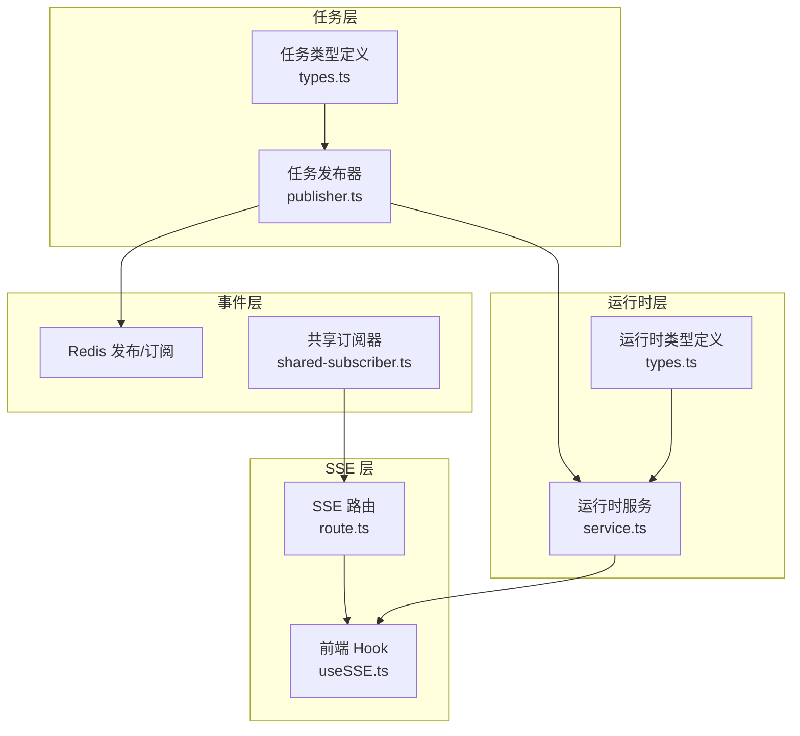
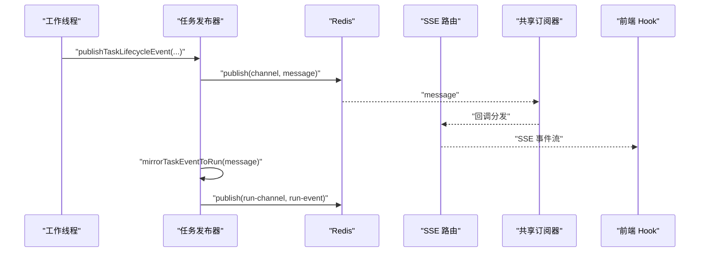
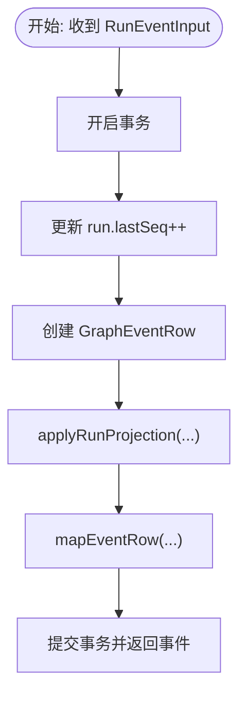
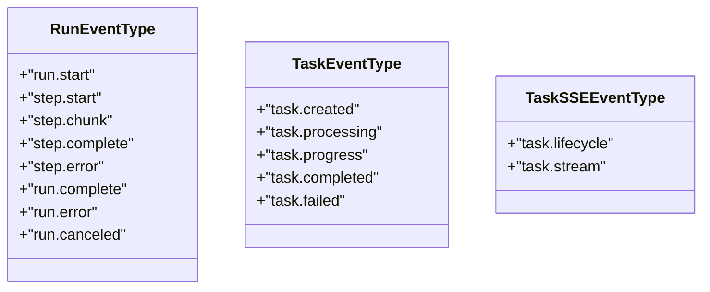
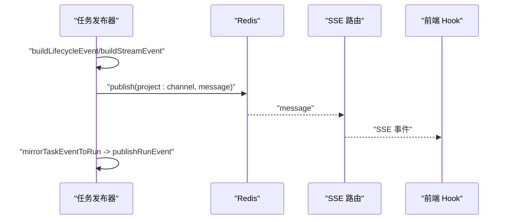
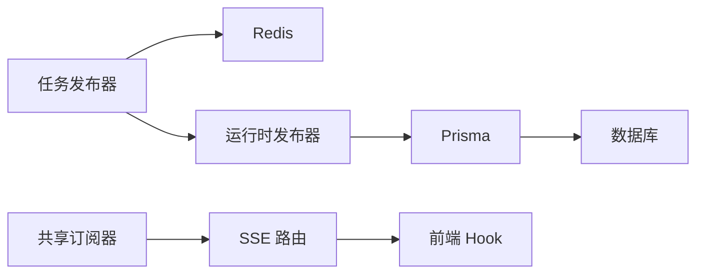

# GraphEvent事件系统

<cite>
**本文档引用的文件**
- [src/lib/run-runtime/service.ts](file://src/lib/run-runtime/service.ts)
- [src/lib/run-runtime/types.ts](file://src/lib/run-runtime/types.ts)
- [src/lib/task/publisher.ts](file://src/lib/task/publisher.ts)
- [src/lib/task/types.ts](file://src/lib/task/types.ts)
- [src/lib/sse/shared-subscriber.ts](file://src/lib/sse/shared-subscriber.ts)
- [src/app/api/sse/route.ts](file://src/app/api/sse/route.ts)
- [src/lib/query/hooks/useSSE.ts](file://src/lib/query/hooks/useSSE.ts)
</cite>

## 目录
1. [简介](#简介)
2. [项目结构](#项目结构)
3. [核心组件](#核心组件)
4. [架构总览](#架构总览)
5. [详细组件分析](#详细组件分析)
6. [依赖关系分析](#依赖关系分析)
7. [性能考量](#性能考量)
8. [故障排查指南](#故障排查指南)
9. [结论](#结论)
10. [附录](#附录)

## 简介
本文件系统性梳理并文档化 GraphEvent 事件系统的设计与实现，覆盖事件序列管理、事件类型定义、事件流控制、创建/分发/处理流程、有序性与并发控制、过滤/聚合/路由策略、持久化与查询、历史追溯、监控与调试、以及扩展性与自定义事件类型支持。该系统以任务生命周期事件为核心，通过 Redis 发布/订阅将事件广播到前端 SSE 流，同时在运行时引擎中维护事件序列与投影状态，确保跨模块的一致性与可追溯性。

## 项目结构
围绕 GraphEvent 的关键文件分布如下：
- 运行时事件模型与服务：src/lib/run-runtime/service.ts、src/lib/run-runtime/types.ts
- 任务事件发布与镜像：src/lib/task/publisher.ts、src/lib/task/types.ts
- SSE 共享订阅器与服务端路由：src/lib/sse/shared-subscriber.ts、src/app/api/sse/route.ts
- 前端 SSE 订阅与应用集成：src/lib/query/hooks/useSSE.ts

**图表来源**
- [src/lib/task/publisher.ts:1-391](file://src/lib/task/publisher.ts#L1-L391)
- [src/lib/sse/shared-subscriber.ts:1-82](file://src/lib/sse/shared-subscriber.ts#L1-L82)
- [src/app/api/sse/route.ts:77-111](file://src/app/api/sse/route.ts#L77-L111)
- [src/lib/query/hooks/useSSE.ts:165-196](file://src/lib/query/hooks/useSSE.ts#L165-L196)
- [src/lib/run-runtime/service.ts:899-969](file://src/lib/run-runtime/service.ts#L899-L969)
- [src/lib/run-runtime/types.ts:1-101](file://src/lib/run-runtime/types.ts#L1-L101)

**章节来源**
- [src/lib/run-runtime/service.ts:1-1200](file://src/lib/run-runtime/service.ts#L1-L1200)
- [src/lib/run-runtime/types.ts:1-101](file://src/lib/run-runtime/types.ts#L1-L101)
- [src/lib/task/publisher.ts:1-391](file://src/lib/task/publisher.ts#L1-L391)
- [src/lib/task/types.ts:1-159](file://src/lib/task/types.ts#L1-L159)
- [src/lib/sse/shared-subscriber.ts:1-82](file://src/lib/sse/shared-subscriber.ts#L1-L82)
- [src/app/api/sse/route.ts:77-111](file://src/app/api/sse/route.ts#L77-L111)
- [src/lib/query/hooks/useSSE.ts:165-196](file://src/lib/query/hooks/useSSE.ts#L165-L196)

## 核心组件
- 事件模型与序列
  - GraphEventRow：事件持久化结构，包含运行标识、项目/用户、序列号、事件类型、步骤键、尝试次数、通道、载荷与时间戳。
  - RunEvent/RunEventInput：对外暴露的事件数据结构，含有序列号 seq 与标准化 lanes。
- 事件类型
  - RUN_EVENT_TYPE：run.start、step.start、step.chunk、step.complete、step.error、run.complete、run.error、run.canceled。
  - TASK_EVENT_TYPE：task.created、task.processing、task.progress、task.completed、task.failed。
  - TASK_SSE_EVENT_TYPE：task.lifecycle、task.stream。
- 事件序列管理
  - appendRunEventWithSeq：事务内递增 run.lastSeq 并写入事件，保证事件顺序严格递增。
  - listRunEventsAfterSeq：基于 afterSeq 与 limit 的增量拉取，按 seq 升序返回。
- 事件投影与运行时状态
  - applyRunProjection：根据事件类型更新 run 状态、step 状态、stepAttempt 与 artifacts 投影。
  - createCheckpoint/listCheckpoints：检查点持久化，限制状态大小。
  - createArtifact/listArtifacts：产物持久化与查询。
- 事件发布与镜像
  - publishTaskLifecycleEvent/publishTaskStreamEvent：构建并发布生命周期/流式事件，支持持久化与镜像到运行时事件。
  - mirrorTaskEventToRun：将任务事件映射为运行时事件并发布。
- SSE 分发与订阅
  - getProjectChannel：频道命名规范。
  - SharedSubscriber：共享订阅器，自动订阅/退订，错误隔离。
  - SSE 路由：基于 last-event-id 回放，构建快照事件。
  - useSSE：前端解析事件、应用到查询缓存、触发失效。

**章节来源**
- [src/lib/run-runtime/service.ts:75-146](file://src/lib/run-runtime/service.ts#L75-L146)
- [src/lib/run-runtime/service.ts:203-217](file://src/lib/run-runtime/service.ts#L203-L217)
- [src/lib/run-runtime/service.ts:899-969](file://src/lib/run-runtime/service.ts#L899-L969)
- [src/lib/run-runtime/service.ts:987-1021](file://src/lib/run-runtime/service.ts#L987-L1021)
- [src/lib/run-runtime/service.ts:1023-1099](file://src/lib/run-runtime/service.ts#L1023-L1099)
- [src/lib/run-runtime/types.ts:22-58](file://src/lib/run-runtime/types.ts#L22-L58)
- [src/lib/task/publisher.ts:224-284](file://src/lib/task/publisher.ts#L224-L284)
- [src/lib/task/publisher.ts:312-357](file://src/lib/task/publisher.ts#L312-L357)
- [src/lib/sse/shared-subscriber.ts:1-82](file://src/lib/sse/shared-subscriber.ts#L1-L82)
- [src/app/api/sse/route.ts:77-111](file://src/app/api/sse/route.ts#L77-L111)
- [src/lib/query/hooks/useSSE.ts:165-196](file://src/lib/query/hooks/useSSE.ts#L165-L196)

## 架构总览
事件从任务层产生，经 Redis 广播至 SSE，前端通过 useSSE 消费；同时，任务事件被镜像为运行时事件，写入数据库并投影到 run/step/artifact 状态，形成可查询的历史与可观测性基础。

**图表来源**
- [src/lib/task/publisher.ts:239-284](file://src/lib/task/publisher.ts#L239-L284)
- [src/lib/sse/shared-subscriber.ts:12-31](file://src/lib/sse/shared-subscriber.ts#L12-L31)
- [src/app/api/sse/route.ts:92-111](file://src/app/api/sse/route.ts#L92-L111)
- [src/lib/query/hooks/useSSE.ts:165-196](file://src/lib/query/hooks/useSSE.ts#L165-L196)

## 详细组件分析

### 事件序列管理与有序性保证
- 事务内原子递增 lastSeq 并写入事件，避免并发写入导致的乱序。
- 查询接口对 afterSeq 与 limit 做安全边界校验，按 seq 升序返回，确保客户端可稳定增量消费。
- 运行时投影函数根据事件类型更新 run/step 状态，保持状态机一致性。

**图表来源**
- [src/lib/run-runtime/service.ts:899-929](file://src/lib/run-runtime/service.ts#L899-L929)
- [src/lib/run-runtime/service.ts:468-674](file://src/lib/run-runtime/service.ts#L468-L674)

**章节来源**
- [src/lib/run-runtime/service.ts:899-969](file://src/lib/run-runtime/service.ts#L899-L969)

### 事件类型定义与扩展
- 运行时事件类型：run.start、step.*、run.*，覆盖运行期全生命周期。
- 任务事件类型：task.created/processing/progress/completed/failed，区分生命周期与流式事件。
- 扩展点：新增事件类型仅需在对应枚举中添加条目，并在发布/订阅与投影逻辑中补充分支。

**图表来源**
- [src/lib/run-runtime/types.ts:22-31](file://src/lib/run-runtime/types.ts#L22-L31)
- [src/lib/task/types.ts:14-29](file://src/lib/task/types.ts#L14-L29)

**章节来源**
- [src/lib/run-runtime/types.ts:1-101](file://src/lib/run-runtime/types.ts#L1-L101)
- [src/lib/task/types.ts:1-159](file://src/lib/task/types.ts#L1-L159)

### 事件创建、分发与处理流程
- 创建：任务发布器构建消息，可选择持久化到任务事件表，生成临时 id 或使用数据库自增 id。
- 分发：通过 Redis 按项目频道发布，共享订阅器统一接收并回调给 SSE 路由。
- 处理：SSE 路由将消息转为标准事件格式，前端 useSSE 解析并更新本地缓存；同时镜像为运行时事件，写入数据库并投影状态。

**图表来源**
- [src/lib/task/publisher.ts:96-159](file://src/lib/task/publisher.ts#L96-L159)
- [src/lib/task/publisher.ts:228-237](file://src/lib/task/publisher.ts#L228-L237)
- [src/app/api/sse/route.ts:77-111](file://src/app/api/sse/route.ts#L77-L111)
- [src/lib/query/hooks/useSSE.ts:165-196](file://src/lib/query/hooks/useSSE.ts#L165-L196)

**章节来源**
- [src/lib/task/publisher.ts:224-357](file://src/lib/task/publisher.ts#L224-L357)
- [src/app/api/sse/route.ts:77-111](file://src/app/api/sse/route.ts#L77-L111)
- [src/lib/query/hooks/useSSE.ts:165-196](file://src/lib/query/hooks/useSSE.ts#L165-L196)

### 并发处理机制
- 事务保障：事件写入与状态投影在单事务内完成，避免中间态。
- 租约与心跳：运行时提供 claimRenew/releaseLease，配合心跳防止资源抢占冲突。
- 共享订阅器：单实例订阅，多监听者回调隔离，异常不传播到其他监听者。

**章节来源**
- [src/lib/run-runtime/service.ts:746-806](file://src/lib/run-runtime/service.ts#L746-L806)
- [src/lib/sse/shared-subscriber.ts:12-31](file://src/lib/sse/shared-subscriber.ts#L12-L31)

### 过滤、聚合与路由策略
- 过滤：SSE 路由与前端 useSSE 仅处理生命周期与流式事件；任务事件按类型过滤后回放。
- 聚合：前端按目标类型/目标 id 分组，按 updatedAt 降序取最新视图。
- 路由：按 projectId 命名频道；全局资产库走特殊鉴权路径。

**章节来源**
- [src/lib/task/publisher.ts:161-222](file://src/lib/task/publisher.ts#L161-L222)
- [src/lib/query/hooks/useSSE.ts:165-196](file://src/lib/query/hooks/useSSE.ts#L165-L196)
- [src/app/api/sse/route.ts:92-111](file://src/app/api/sse/route.ts#L92-L111)

### 持久化存储、查询接口与历史追溯
- 持久化
  - 任务事件：taskEvent 表，支持生命周期与流式事件持久化。
  - 运行时事件：graphEvent 表，带有序列号与投影字段。
  - 检查点：graphCheckpoint，限制状态大小。
  - 产物：graphArtifact，唯一索引约束。
- 查询
  - listTaskLifecycleEvents：按 taskId 倒序取回放事件。
  - listRunEventsAfterSeq：按 runId+afterSeq 增量查询。
  - listRuns：按用户/项目/工作流/目标等条件筛选。
  - listCheckpoints/listArtifacts：按 runId/stepKey 等维度查询。
- 历史追溯
  - SSE 路由支持 last-event-id 回放。
  - 任务事件表支持扫描回放。

**章节来源**
- [src/lib/task/publisher.ts:212-222](file://src/lib/task/publisher.ts#L212-L222)
- [src/lib/run-runtime/service.ts:931-969](file://src/lib/run-runtime/service.ts#L931-L969)
- [src/lib/run-runtime/service.ts:844-874](file://src/lib/run-runtime/service.ts#L844-L874)
- [src/lib/run-runtime/service.ts:1005-1021](file://src/lib/run-runtime/service.ts#L1005-L1021)
- [src/lib/run-runtime/service.ts:1071-1099](file://src/lib/run-runtime/service.ts#L1071-L1099)
- [src/app/api/sse/route.ts:77-111](file://src/app/api/sse/route.ts#L77-L111)

### 监控指标、性能优化与调试工具
- 监控
  - SSE 事件计数与错误日志：共享订阅器对监听器异常进行记录。
  - 前端 useSSE：对解析失败进行错误上报。
- 性能
  - 事件序列安全边界：afterSeq/limit 上下限保护，避免超大扫描。
  - 产物唯一索引：graph_artifacts 唯一索引检查，避免重复写入。
  - 检查点大小限制：RUN_STATE_MAX_BYTES 限制，防止状态膨胀。
- 调试
  - 任务事件回放：listEventsAfter 增量扫描，支持最大扫描行数限制。
  - 日志：共享订阅器与前端 hook 使用统一错误日志接口。

**章节来源**
- [src/lib/sse/shared-subscriber.ts:12-31](file://src/lib/sse/shared-subscriber.ts#L12-L31)
- [src/lib/query/hooks/useSSE.ts:193-196](file://src/lib/query/hooks/useSSE.ts#L193-L196)
- [src/lib/run-runtime/service.ts:348-370](file://src/lib/run-runtime/service.ts#L348-L370)
- [src/lib/run-runtime/service.ts:962-969](file://src/lib/run-runtime/service.ts#L962-L969)
- [src/lib/task/publisher.ts:359-390](file://src/lib/task/publisher.ts#L359-L390)

### 扩展性设计与自定义事件类型支持
- 类型扩展：在 RUN_EVENT_TYPE/TASK_EVENT_TYPE 中新增条目。
- 发布扩展：在发布器中补充事件构建与镜像逻辑。
- 投影扩展：在 applyRunProjection 中增加事件分支，更新 run/step/artifact。
- 前端扩展：在 useSSE 中补充事件解析与副作用逻辑。

**章节来源**
- [src/lib/run-runtime/types.ts:22-58](file://src/lib/run-runtime/types.ts#L22-L58)
- [src/lib/task/types.ts:14-29](file://src/lib/task/types.ts#L14-L29)
- [src/lib/run-runtime/service.ts:468-674](file://src/lib/run-runtime/service.ts#L468-L674)
- [src/lib/task/publisher.ts:228-237](file://src/lib/task/publisher.ts#L228-L237)

## 依赖关系分析
- 模块耦合
  - 任务发布器依赖 Redis 与 Prisma；与运行时发布器存在镜像调用。
  - SSE 路由依赖共享订阅器；前端 Hook 依赖路由与查询缓存。
  - 运行时服务依赖 Prisma 与事务，负责事件投影与状态维护。
- 外部依赖
  - Redis：发布/订阅事件通道。
  - Prisma：事件与运行时状态持久化。
  - 前端查询框架：useSSE 将事件映射到缓存失效与 UI 更新。

**图表来源**
- [src/lib/task/publisher.ts:224-284](file://src/lib/task/publisher.ts#L224-L284)
- [src/lib/run-runtime/service.ts:899-929](file://src/lib/run-runtime/service.ts#L899-L929)
- [src/lib/sse/shared-subscriber.ts:12-31](file://src/lib/sse/shared-subscriber.ts#L12-L31)
- [src/app/api/sse/route.ts:92-111](file://src/app/api/sse/route.ts#L92-L111)

**章节来源**
- [src/lib/task/publisher.ts:1-391](file://src/lib/task/publisher.ts#L1-L391)
- [src/lib/run-runtime/service.ts:1-1200](file://src/lib/run-runtime/service.ts#L1-L1200)
- [src/lib/sse/shared-subscriber.ts:1-82](file://src/lib/sse/shared-subscriber.ts#L1-L82)
- [src/app/api/sse/route.ts:77-111](file://src/app/api/sse/route.ts#L77-L111)

## 性能考量
- 事件序列扫描：afterSeq/limit 边界保护，避免一次性拉取过多事件。
- 数据库索引：graph_artifacts 唯一索引检查，确保 upsert 写入性能与一致性。
- 状态大小限制：检查点状态字节上限，防止内存与序列化开销过大。
- 回放扫描：任务事件回放设置最大扫描行数，避免长时间阻塞。

[本节为通用性能建议，无需特定文件来源]

## 故障排查指南
- 事件未到达前端
  - 检查 Redis 订阅是否成功，确认频道名称与项目鉴权。
  - 查看共享订阅器错误日志，定位回调异常。
- 事件解析失败
  - 前端 useSSE 对解析异常进行错误上报，检查 payload 结构与字段映射。
- 事件重复或乱序
  - 确认事务内写入与 lastSeq 递增逻辑；核对 afterSeq 参数。
- 产物缺失或重复
  - 检查 graph_artifacts 唯一索引是否存在；确认 upsert 逻辑。

**章节来源**
- [src/lib/sse/shared-subscriber.ts:12-31](file://src/lib/sse/shared-subscriber.ts#L12-L31)
- [src/lib/query/hooks/useSSE.ts:193-196](file://src/lib/query/hooks/useSSE.ts#L193-L196)
- [src/lib/run-runtime/service.ts:348-370](file://src/lib/run-runtime/service.ts#L348-L370)

## 结论
GraphEvent 事件系统通过“任务事件 → Redis/SSE → 运行时事件”的双轨设计，实现了高可靠、可追溯、可扩展的事件驱动架构。其核心优势在于：
- 严格的事件序列与事务一致性保障；
- 清晰的事件类型与投影模型；
- 完备的持久化与查询接口；
- 可观测与可调试的链路；
- 易于扩展的事件类型与处理分支。

## 附录
- 关键接口速览
  - 运行时事件：appendRunEventWithSeq、listRunEventsAfterSeq、applyRunProjection
  - 任务事件：publishTaskLifecycleEvent、publishTaskStreamEvent、listTaskLifecycleEvents、listEventsAfter
  - SSE：getProjectChannel、SharedSubscriber、SSE 路由、useSSE
  - 持久化：createCheckpoint、listCheckpoints、createArtifact、listArtifacts、listRuns

[本节为概览性汇总，无需特定文件来源]