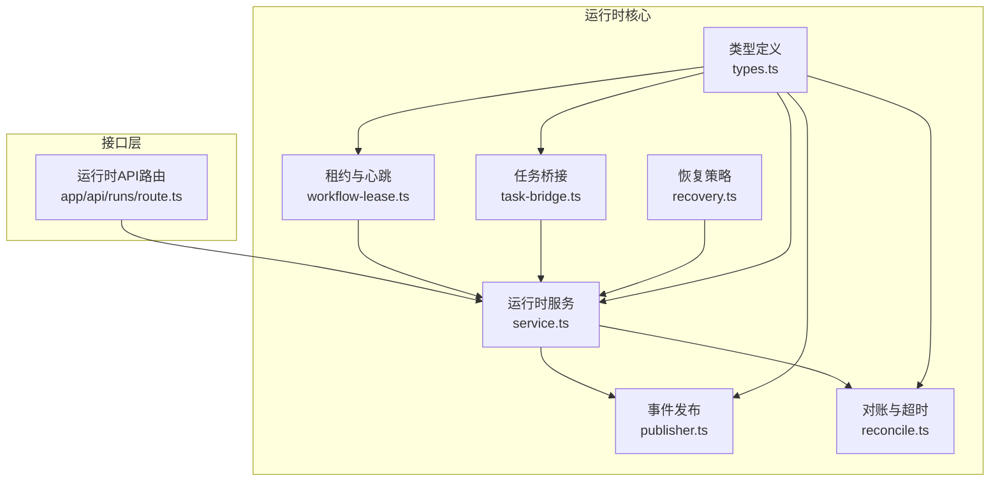
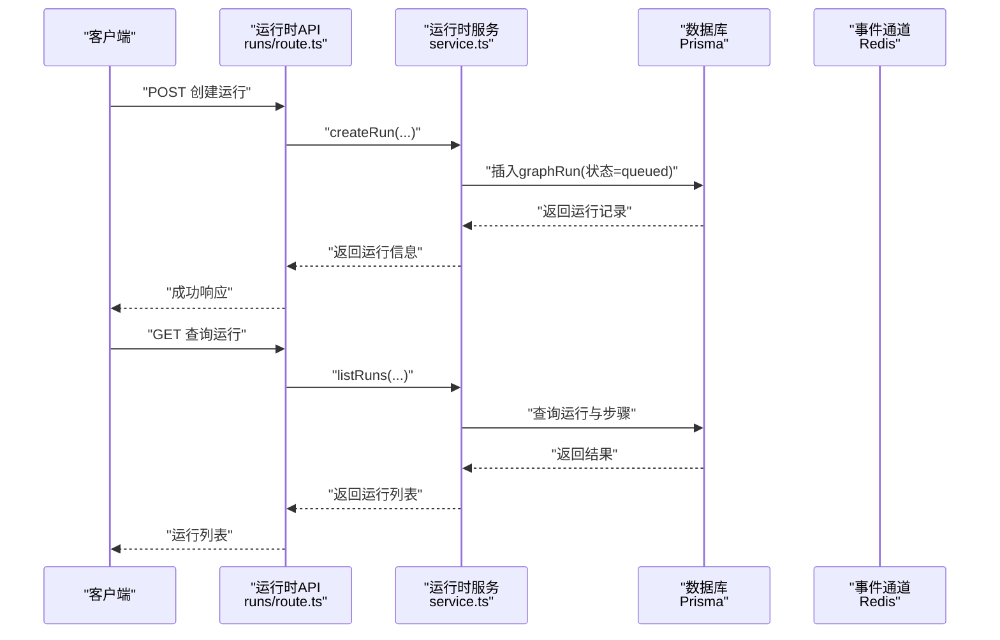
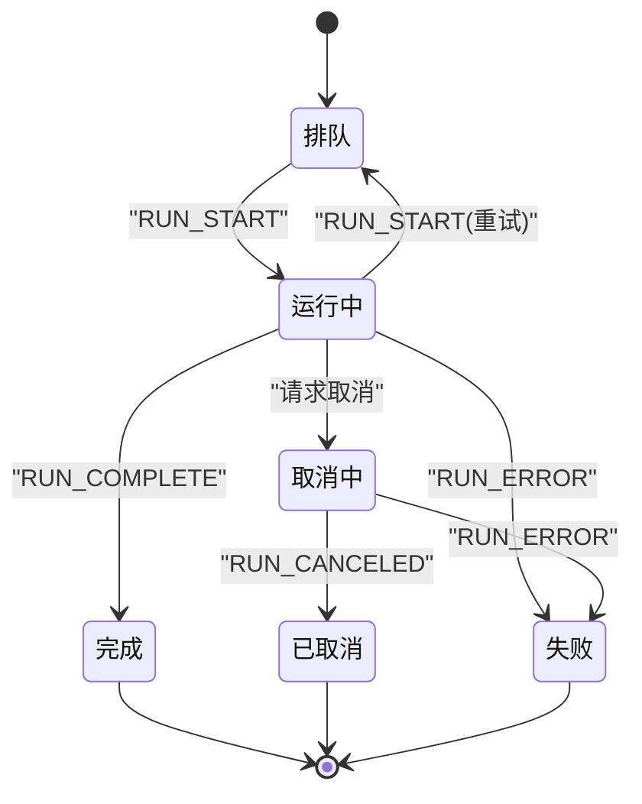
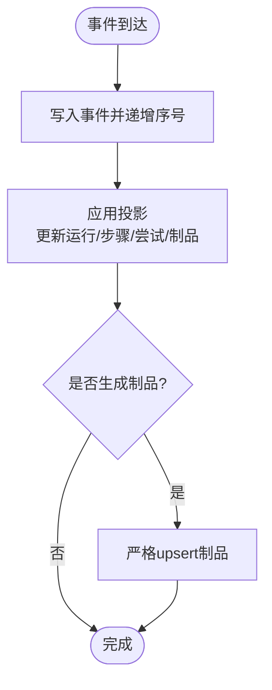
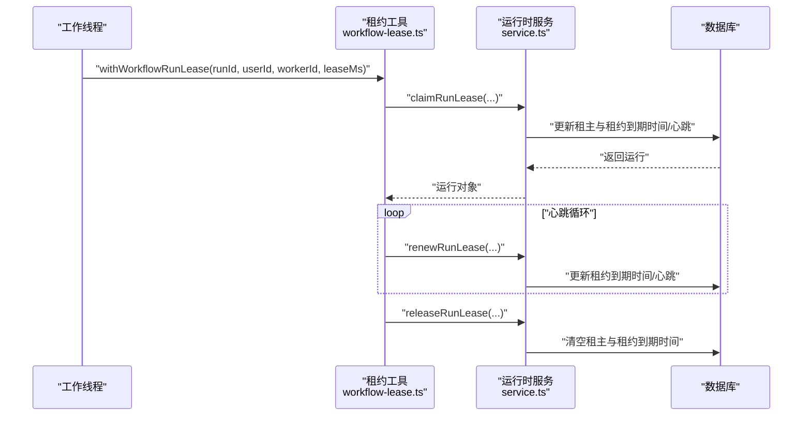
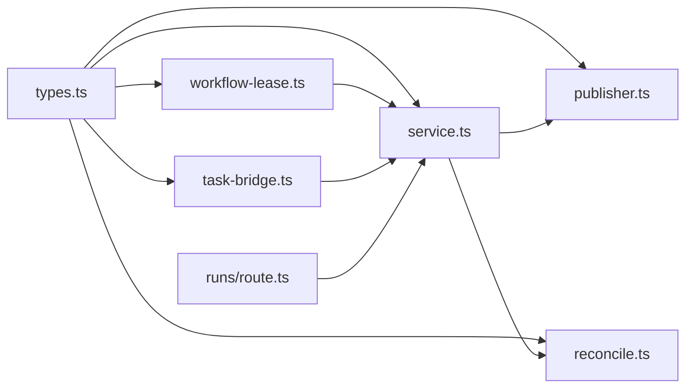

# GraphRun运行时

<cite>
**本文引用的文件**
- [src/lib/run-runtime/types.ts](file://src/lib/run-runtime/types.ts)
- [src/lib/run-runtime/service.ts](file://src/lib/run-runtime/service.ts)
- [src/lib/run-runtime/workflow-lease.ts](file://src/lib/run-runtime/workflow-lease.ts)
- [src/lib/run-runtime/publisher.ts](file://src/lib/run-runtime/publisher.ts)
- [src/lib/run-runtime/recovery.ts](file://src/lib/run-runtime/recovery.ts)
- [src/lib/run-runtime/reconcile.ts](file://src/lib/run-runtime/reconcile.ts)
- [src/lib/run-runtime/task-bridge.ts](file://src/lib/run-runtime/task-bridge.ts)
- [src/app/api/runs/route.ts](file://src/app/api/runs/route.ts)
</cite>

## 目录
1. [简介](#简介)
2. [项目结构](#项目结构)
3. [核心组件](#核心组件)
4. [架构总览](#架构总览)
5. [详细组件分析](#详细组件分析)
6. [依赖关系分析](#依赖关系分析)
7. [性能考量](#性能考量)
8. [故障排查指南](#故障排查指南)
9. [结论](#结论)
10. [附录](#附录)

## 简介
本文件为GraphRun运行时系统的权威技术文档，面向开发者与运维人员，系统化阐述GraphRun实体的设计与实现，覆盖运行时状态管理、生命周期控制、资源分配与租约机制、心跳与超时处理、并发控制与优先级调度、资源限制、监控指标、性能优化与故障恢复，以及扩展性与自定义运行时支持能力。读者可据此理解从创建、启动、执行到完成的完整流程，掌握状态转换规则与异常处理策略，并据此进行集成与二次开发。

## 项目结构
GraphRun运行时位于src/lib/run-runtime目录下，围绕“运行时服务”“租约与心跳”“事件发布”“恢复与对账”“任务桥接”“类型定义”等模块组织，配合API路由对外暴露运行时能力。

图表来源
- [src/lib/run-runtime/types.ts:1-101](file://src/lib/run-runtime/types.ts#L1-L101)
- [src/lib/run-runtime/service.ts:1-1200](file://src/lib/run-runtime/service.ts#L1-L1200)
- [src/lib/run-runtime/workflow-lease.ts:1-73](file://src/lib/run-runtime/workflow-lease.ts#L1-L73)
- [src/lib/run-runtime/publisher.ts:1-31](file://src/lib/run-runtime/publisher.ts#L1-L31)
- [src/lib/run-runtime/recovery.ts:1-86](file://src/lib/run-runtime/recovery.ts#L1-L86)
- [src/lib/run-runtime/reconcile.ts:1-306](file://src/lib/run-runtime/reconcile.ts#L1-L306)
- [src/lib/run-runtime/task-bridge.ts:1-185](file://src/lib/run-runtime/task-bridge.ts#L1-L185)
- [src/app/api/runs/route.ts:1-123](file://src/app/api/runs/route.ts#L1-L123)

章节来源
- [src/lib/run-runtime/types.ts:1-101](file://src/lib/run-runtime/types.ts#L1-L101)
- [src/lib/run-runtime/service.ts:1-1200](file://src/lib/run-runtime/service.ts#L1-L1200)
- [src/lib/run-runtime/workflow-lease.ts:1-73](file://src/lib/run-runtime/workflow-lease.ts#L1-L73)
- [src/lib/run-runtime/publisher.ts:1-31](file://src/lib/run-runtime/publisher.ts#L1-L31)
- [src/lib/run-runtime/recovery.ts:1-86](file://src/lib/run-runtime/recovery.ts#L1-L86)
- [src/lib/run-runtime/reconcile.ts:1-306](file://src/lib/run-runtime/reconcile.ts#L1-L306)
- [src/lib/run-runtime/task-bridge.ts:1-185](file://src/lib/run-runtime/task-bridge.ts#L1-L185)
- [src/app/api/runs/route.ts:1-123](file://src/app/api/runs/route.ts#L1-L123)

## 核心组件
- 类型与常量：统一定义运行时状态、步骤状态、事件类型、输入输出结构与最大状态字节限制，确保跨模块契约一致。
- 运行时服务：负责运行创建、事件追加与投影、快照查询、租约操作、取消请求、事件列表查询、状态大小校验等。
- 租约与心跳：提供租约申请、续租、释放与心跳定时器管理，保障单worker独占执行权。
- 事件发布：将运行事件写入数据库并广播至Redis频道，供订阅者实时消费。
- 恢复策略：在多条活跃运行中选择可恢复实例，综合考虑最新更新时间、租约到期与心跳情况。
- 对账与超时：周期性扫描活跃运行，基于租约过期与取消超时进行失败收敛；同时联动已终结的任务进行完成或失败对账。
- 任务桥接：将任务SSE事件映射为运行事件，贯通任务执行与运行时状态。
- API路由：对外提供运行创建与查询接口，封装鉴权与参数校验。

章节来源
- [src/lib/run-runtime/types.ts:1-101](file://src/lib/run-runtime/types.ts#L1-L101)
- [src/lib/run-runtime/service.ts:468-969](file://src/lib/run-runtime/service.ts#L468-L969)
- [src/lib/run-runtime/workflow-lease.ts:33-73](file://src/lib/run-runtime/workflow-lease.ts#L33-L73)
- [src/lib/run-runtime/publisher.ts:11-31](file://src/lib/run-runtime/publisher.ts#L11-L31)
- [src/lib/run-runtime/recovery.ts:50-86](file://src/lib/run-runtime/recovery.ts#L50-L86)
- [src/lib/run-runtime/reconcile.ts:73-306](file://src/lib/run-runtime/reconcile.ts#L73-L306)
- [src/lib/run-runtime/task-bridge.ts:65-185](file://src/lib/run-runtime/task-bridge.ts#L65-L185)
- [src/app/api/runs/route.ts:46-123](file://src/app/api/runs/route.ts#L46-L123)

## 架构总览
GraphRun运行时以“事件驱动+事务投影”的方式维护运行与步骤状态，结合租约与心跳保证并发安全，通过Redis通道实现事件广播，借助恢复与对账机制实现高可用与一致性。

图表来源
- [src/app/api/runs/route.ts:46-123](file://src/app/api/runs/route.ts#L46-L123)
- [src/lib/run-runtime/service.ts:676-716](file://src/lib/run-runtime/service.ts#L676-L716)

章节来源
- [src/app/api/runs/route.ts:46-123](file://src/app/api/runs/route.ts#L46-L123)
- [src/lib/run-runtime/service.ts:676-716](file://src/lib/run-runtime/service.ts#L676-L716)

## 详细组件分析

### GraphRun实体与状态模型
- 运行状态：排队(queued)、运行中(running)、完成(completed)、失败(failed)、取消中(canceling)、已取消(canceled)。
- 步骤状态：待定(pending)、运行中(running)、完成(completed)、失败(failed)、已取消(canceled)。
- 事件类型：运行开始、步骤开始、步骤流式片段、步骤完成、步骤错误、运行完成、运行错误、运行取消。
- 最大状态字节：运行时checkpoint状态大小上限，防止过大状态导致存储与序列化开销。

图表来源
- [src/lib/run-runtime/types.ts:1-34](file://src/lib/run-runtime/types.ts#L1-L34)
- [src/lib/run-runtime/service.ts:468-562](file://src/lib/run-runtime/service.ts#L468-L562)

章节来源
- [src/lib/run-runtime/types.ts:1-34](file://src/lib/run-runtime/types.ts#L1-L34)
- [src/lib/run-runtime/service.ts:468-562](file://src/lib/run-runtime/service.ts#L468-L562)

### 生命周期与事件投影
- 事件追加：原子事务内递增lastSeq并写入graphEvent，随后根据事件类型应用投影，更新graphRun与graphStep及graphStepAttempt。
- 投影规则：
  - RUN_START：运行进入运行中并记录开始时间。
  - RUN_COMPLETE：运行进入完成，写入输出，清空租约，批量将未完成步骤置为完成。
  - RUN_ERROR：运行进入失败，记录错误码与消息，清空租约，批量将未完成步骤置为失败。
  - RUN_CANCELED：运行进入已取消，清空租约，批量将未完成步骤置为已取消。
  - STEP_*：根据事件类型更新步骤状态、尝试次数、阶段索引与总数、错误信息、用量等；同时生成artifact条目（如步骤输出或错误）。
- 事件查询：按seq过滤与分页，限制最大条数，确保读取性能与安全性。

图表来源
- [src/lib/run-runtime/service.ts:899-960](file://src/lib/run-runtime/service.ts#L899-L960)
- [src/lib/run-runtime/service.ts:468-674](file://src/lib/run-runtime/service.ts#L468-L674)

章节来源
- [src/lib/run-runtime/service.ts:899-960](file://src/lib/run-runtime/service.ts#L899-L960)
- [src/lib/run-runtime/service.ts:468-674](file://src/lib/run-runtime/service.ts#L468-L674)

### 租约机制、心跳与超时
- 租约申请：仅当运行处于排队/运行中/取消中且满足“无租主/租主为当前worker/租约已过期”条件时才可获得租约。
- 续租与心跳：租约持有者定期续租，同时更新heartbeatAt，用于对账判断。
- 超时处理：对账扫描发现租约过期且长时间无心跳，或取消请求超过阈值未完成，将运行与未完成步骤置为失败，清空租约。
- 保活策略：默认租约时长与心跳间隔由工具函数提供，避免频繁续租带来的压力。

图表来源
- [src/lib/run-runtime/workflow-lease.ts:33-73](file://src/lib/run-runtime/workflow-lease.ts#L33-L73)
- [src/lib/run-runtime/service.ts:746-822](file://src/lib/run-runtime/service.ts#L746-L822)
- [src/lib/run-runtime/reconcile.ts:99-168](file://src/lib/run-runtime/reconcile.ts#L99-L168)

章节来源
- [src/lib/run-runtime/workflow-lease.ts:33-73](file://src/lib/run-runtime/workflow-lease.ts#L33-L73)
- [src/lib/run-runtime/service.ts:746-822](file://src/lib/run-runtime/service.ts#L746-L822)
- [src/lib/run-runtime/reconcile.ts:99-168](file://src/lib/run-runtime/reconcile.ts#L99-L168)

### 并发控制、优先级与资源限制
- 并发控制：通过租约机制确保同一时刻仅一个worker持有运行的执行权；对账扫描在租约过期且无心跳时强制失败，避免僵尸运行占用资源。
- 优先级调度：当前实现未显式引入优先级字段；建议在业务侧通过队列策略或外部调度器实现优先级。
- 资源限制：
  - 运行状态大小限制：checkpoint状态最大字节数限制，防止过大状态影响序列化与存储。
  - 事件查询限制：分页与最大条数限制，避免一次性拉取过多事件造成内存压力。
  - 制品唯一索引：要求graph_artifacts上存在唯一索引，避免重复制品写入引发数据不一致。

章节来源
- [src/lib/run-runtime/types.ts:100-101](file://src/lib/run-runtime/types.ts#L100-L101)
- [src/lib/run-runtime/service.ts:931-960](file://src/lib/run-runtime/service.ts#L931-L960)
- [src/lib/run-runtime/service.ts:348-370](file://src/lib/run-runtime/service.ts#L348-L370)

### 监控指标与可观测性
- 事件通道：运行事件通过Redis频道广播，订阅方可实时获取运行进度与状态变化。
- 快照查询：支持按运行ID获取运行与步骤快照，便于前端或监控面板展示。
- 对账日志：对账过程会记录失败原因（如租约过期、取消超时、关联任务失败），可用于问题定位与统计。

章节来源
- [src/lib/run-runtime/publisher.ts:11-31](file://src/lib/run-runtime/publisher.ts#L11-L31)
- [src/lib/run-runtime/service.ts:824-842](file://src/lib/run-runtime/service.ts#L824-L842)
- [src/lib/run-runtime/reconcile.ts:124-168](file://src/lib/run-runtime/reconcile.ts#L124-L168)

### 故障恢复与自愈
- 恢复策略：在多条活跃运行中，优先选择最新更新、仍在租约期内或仍有心跳的运行作为可恢复实例；若均不可用则判定为过期租约或终态。
- 对账自愈：对账扫描将租约过期且无心跳的运行标记为失败，并对已完成/失败的关联任务进行对账，确保运行状态与任务状态一致。
- 取消流程：用户请求取消后，运行进入取消中并设置取消时间戳；对账扫描在超时后将其标记为失败，避免无限等待。

章节来源
- [src/lib/run-runtime/recovery.ts:50-86](file://src/lib/run-runtime/recovery.ts#L50-L86)
- [src/lib/run-runtime/reconcile.ts:73-306](file://src/lib/run-runtime/reconcile.ts#L73-L306)
- [src/lib/run-runtime/service.ts:876-897](file://src/lib/run-runtime/service.ts#L876-L897)

### 扩展性与自定义运行时
- 事件桥接：任务SSE事件可映射为运行事件，便于接入不同任务提供方与工作流引擎。
- 类型扩展：通过新增事件类型与状态，可在不破坏现有契约的前提下扩展运行时语义。
- API扩展：运行时API路由可扩展更多查询条件与行为，如按目标类型/目标ID/剧集ID等维度筛选。

章节来源
- [src/lib/run-runtime/task-bridge.ts:65-185](file://src/lib/run-runtime/task-bridge.ts#L65-L185)
- [src/app/api/runs/route.ts:46-78](file://src/app/api/runs/route.ts#L46-L78)

## 依赖关系分析

图表来源
- [src/lib/run-runtime/types.ts:1-101](file://src/lib/run-runtime/types.ts#L1-L101)
- [src/lib/run-runtime/service.ts:1-146](file://src/lib/run-runtime/service.ts#L1-L146)
- [src/lib/run-runtime/workflow-lease.ts:1-9](file://src/lib/run-runtime/workflow-lease.ts#L1-L9)
- [src/lib/run-runtime/publisher.ts:1-6](file://src/lib/run-runtime/publisher.ts#L1-L6)
- [src/lib/run-runtime/reconcile.ts:1-10](file://src/lib/run-runtime/reconcile.ts#L1-L10)
- [src/lib/run-runtime/task-bridge.ts:1-5](file://src/lib/run-runtime/task-bridge.ts#L1-L5)
- [src/app/api/runs/route.ts:1-6](file://src/app/api/runs/route.ts#L1-L6)

章节来源
- [src/lib/run-runtime/types.ts:1-101](file://src/lib/run-runtime/types.ts#L1-L101)
- [src/lib/run-runtime/service.ts:1-146](file://src/lib/run-runtime/service.ts#L1-L146)
- [src/lib/run-runtime/workflow-lease.ts:1-9](file://src/lib/run-runtime/workflow-lease.ts#L1-L9)
- [src/lib/run-runtime/publisher.ts:1-6](file://src/lib/run-runtime/publisher.ts#L1-L6)
- [src/lib/run-runtime/reconcile.ts:1-10](file://src/lib/run-runtime/reconcile.ts#L1-L10)
- [src/lib/run-runtime/task-bridge.ts:1-5](file://src/lib/run-runtime/task-bridge.ts#L1-L5)
- [src/app/api/runs/route.ts:1-6](file://src/app/api/runs/route.ts#L1-L6)

## 性能考量
- 事务投影：事件追加与状态更新在同一事务内完成，减少中间态，提升一致性与吞吐。
- 分页与限流：事件查询支持分页与最大条数限制，避免一次性读取过多数据。
- 状态大小控制：checkpoint状态大小上限，降低序列化与存储成本。
- 唯一索引约束：制品表唯一索引确保upsert高效且避免重复写入。
- 对账批处理：对账扫描限制每次处理数量，避免对数据库造成瞬时压力。

章节来源
- [src/lib/run-runtime/service.ts:899-960](file://src/lib/run-runtime/service.ts#L899-L960)
- [src/lib/run-runtime/types.ts:100-101](file://src/lib/run-runtime/types.ts#L100-L101)
- [src/lib/run-runtime/service.ts:348-370](file://src/lib/run-runtime/service.ts#L348-L370)
- [src/lib/run-runtime/reconcile.ts:73-96](file://src/lib/run-runtime/reconcile.ts#L73-L96)

## 故障排查指南
- 租约丢失：检查worker是否持续续租与心跳；确认租约时长与心跳间隔配置是否合理。
- 运行卡死：对账扫描会将租约过期且无心跳的运行标记为失败；可通过查询运行快照定位未完成步骤。
- 取消超时：取消请求超过阈值未完成会被对账标记为失败；检查任务侧取消逻辑与回调。
- 事件未达：确认Redis通道是否正常；检查事件发布函数是否被调用。
- 数据不一致：确保graph_artifacts唯一索引存在；避免绕过upsert直接写入。

章节来源
- [src/lib/run-runtime/workflow-lease.ts:11-31](file://src/lib/run-runtime/workflow-lease.ts#L11-L31)
- [src/lib/run-runtime/reconcile.ts:99-168](file://src/lib/run-runtime/reconcile.ts#L99-L168)
- [src/lib/run-runtime/publisher.ts:11-31](file://src/lib/run-runtime/publisher.ts#L11-L31)
- [src/lib/run-runtime/service.ts:348-370](file://src/lib/run-runtime/service.ts#L348-L370)

## 结论
GraphRun运行时以事件驱动与事务投影为核心，结合租约与心跳实现强一致的并发控制，通过Redis通道提供可观测性，并以恢复与对账机制实现高可用与自愈。其清晰的类型定义与严格的资源限制为扩展与定制提供了坚实基础。建议在生产环境中配合合理的租约时长、心跳间隔与对账频率，以平衡性能与可靠性。

## 附录
- API示例路径
  - 创建运行：[src/app/api/runs/route.ts:80-123](file://src/app/api/runs/route.ts#L80-L123)
  - 查询运行：[src/app/api/runs/route.ts:46-78](file://src/app/api/runs/route.ts#L46-L78)
- 关键实现路径
  - 事件投影与事务：[src/lib/run-runtime/service.ts:899-960](file://src/lib/run-runtime/service.ts#L899-L960)
  - 租约与心跳：[src/lib/run-runtime/workflow-lease.ts:33-73](file://src/lib/run-runtime/workflow-lease.ts#L33-L73)
  - 事件发布：[src/lib/run-runtime/publisher.ts:11-31](file://src/lib/run-runtime/publisher.ts#L11-L31)
  - 恢复策略：[src/lib/run-runtime/recovery.ts:50-86](file://src/lib/run-runtime/recovery.ts#L50-L86)
  - 对账与超时：[src/lib/run-runtime/reconcile.ts:73-306](file://src/lib/run-runtime/reconcile.ts#L73-L306)
  - 任务桥接：[src/lib/run-runtime/task-bridge.ts:65-185](file://src/lib/run-runtime/task-bridge.ts#L65-L185)