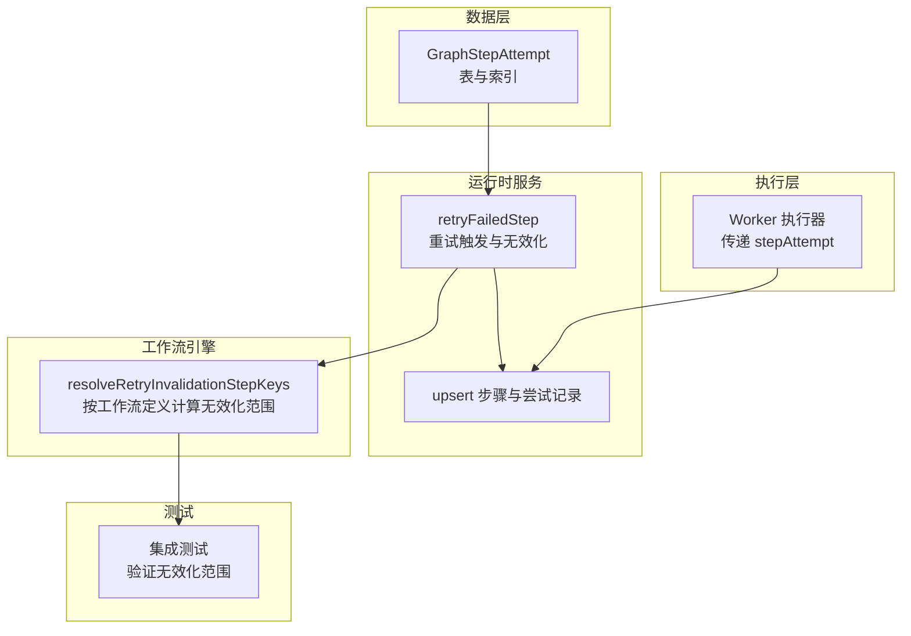
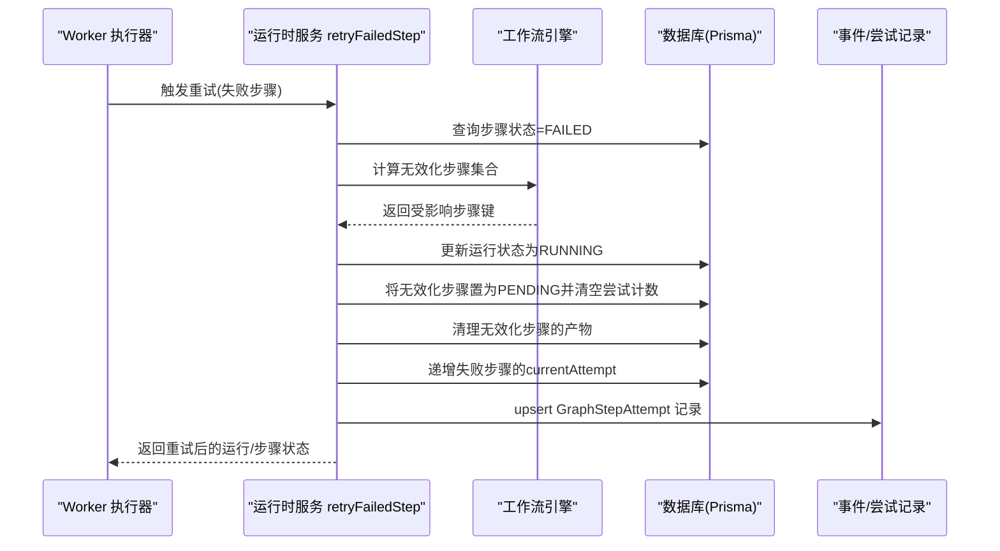
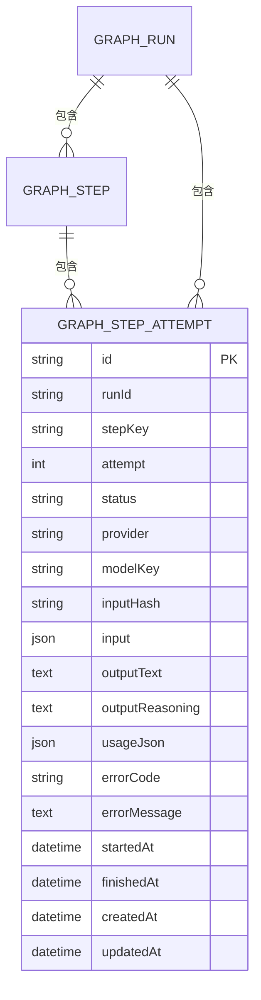
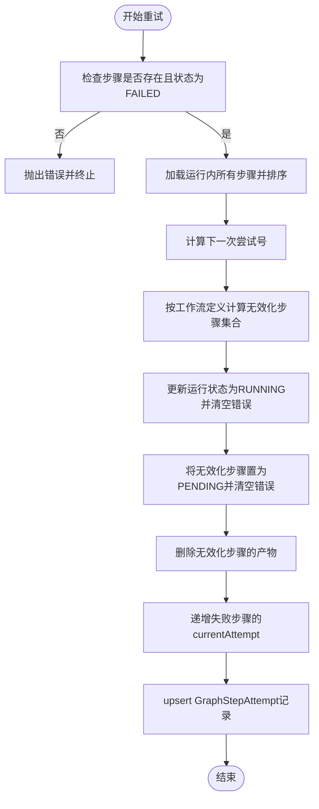
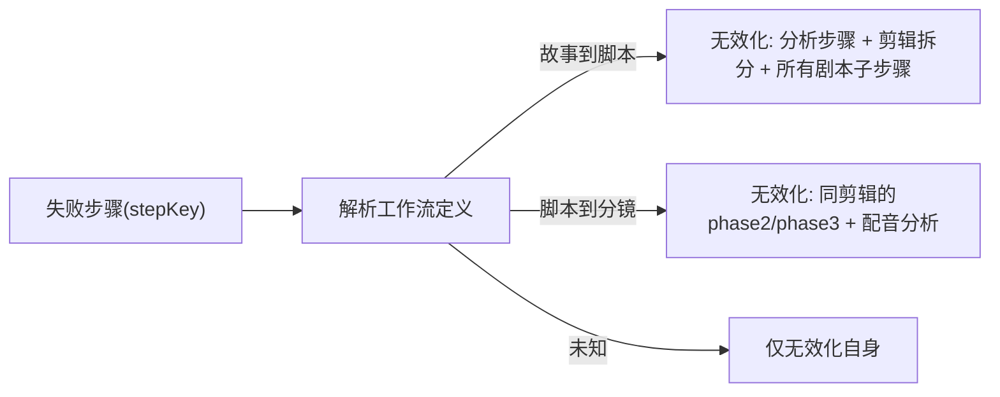
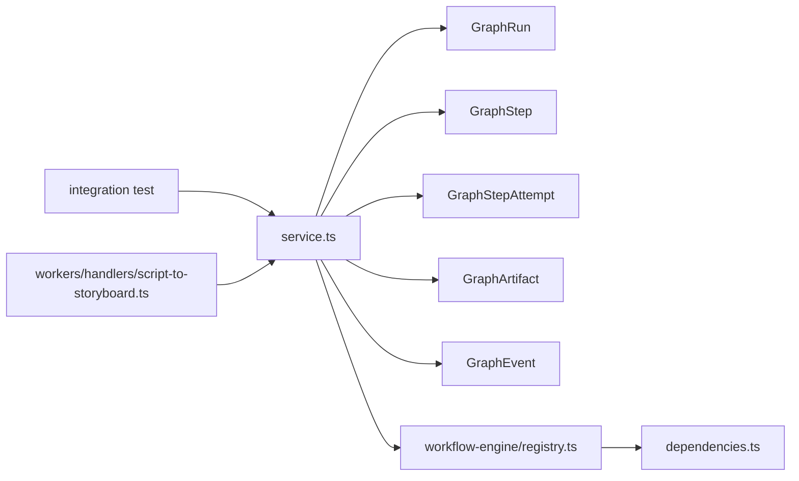

# GraphStepAttempt尝试机制

<cite>
**本文引用的文件**
- [prisma/schema.prisma](file://prisma/schema.prisma)
- [src/lib/run-runtime/service.ts](file://src/lib/run-runtime/service.ts)
- [src/lib/run-runtime/types.ts](file://src/lib/run-runtime/types.ts)
- [src/lib/workflow-engine/registry.ts](file://src/lib/workflow-engine/registry.ts)
- [src/lib/workflow-engine/dependencies.ts](file://src/lib/workflow-engine/dependencies.ts)
- [tests/integration/run-runtime/retry-failed-step.integration.test.ts](file://tests/integration/run-runtime/retry-failed-step.integration.test.ts)
- [src/lib/workers/handlers/script-to-storyboard.ts](file://src/lib/workers/handlers/script-to-storyboard.ts)
- [src/lib/novel-promotion/script-to-storyboard/orchestrator.ts](file://src/lib/novel-promotion/script-to-storyboard/orchestrator.ts)
</cite>

## 目录
1. [引言](#引言)
2. [项目结构](#项目结构)
3. [核心组件](#核心组件)
4. [架构总览](#架构总览)
5. [详细组件分析](#详细组件分析)
6. [依赖分析](#依赖分析)
7. [性能考虑](#性能考虑)
8. [故障排查指南](#故障排查指南)
9. [结论](#结论)
10. [附录](#附录)

## 引言
本文件系统性阐述 GraphStepAttempt 尝试机制的设计与实现，覆盖以下关键主题：
- 尝试次数管理：如何在步骤内进行多次尝试，以及尝试号的递增与持久化。
- 重试策略：失败步骤的重试触发、下游无效化范围计算、以及与工作流定义的耦合。
- 错误处理：错误码与错误信息的提取、记录与传播。
- 执行生命周期：尝试的创建、执行、完成或失败的记录流程。
- 指数退避与取消：当前实现是否支持指数退避与取消；若不支持，如何扩展。
- 输入输出缓存与状态持久化：输入哈希、输出文本/推理、使用量等字段的作用与持久化。
- 监控与统计：事件与尝试记录如何支撑可观测性与故障分析。
- 可扩展性：如何通过工作流定义扩展自定义重试策略。

## 项目结构
围绕 GraphStepAttempt 的相关模块主要分布在以下位置：
- 数据模型层：Prisma Schema 定义了 GraphStepAttempt 表及其索引、唯一约束。
- 运行时服务层：负责事务内尝试与步骤的状态更新、重试触发与无效化。
- 工作流引擎层：根据工作流类型与步骤键，计算重试时的无效化范围。
- 测试用例：验证不同工作流下的重试无效化行为。
- Worker 层：在执行阶段将尝试号传递给底层执行器，以便正确记录与关联。

图表来源
- [prisma/schema.prisma:714-740](file://prisma/schema.prisma#L714-L740)
- [src/lib/run-runtime/service.ts:1119-1199](file://src/lib/run-runtime/service.ts#L1119-L1199)
- [src/lib/workflow-engine/registry.ts:201-214](file://src/lib/workflow-engine/registry.ts#L201-L214)
- [tests/integration/run-runtime/retry-failed-step.integration.test.ts:1-344](file://tests/integration/run-runtime/retry-failed-step.integration.test.ts#L1-L344)
- [src/lib/workers/handlers/script-to-storyboard.ts:220-233](file://src/lib/workers/handlers/script-to-storyboard.ts#L220-L233)

章节来源
- [prisma/schema.prisma:714-740](file://prisma/schema.prisma#L714-L740)
- [src/lib/run-runtime/service.ts:100-299](file://src/lib/run-runtime/service.ts#L100-L299)
- [src/lib/workflow-engine/registry.ts:1-215](file://src/lib/workflow-engine/registry.ts#L1-L215)
- [tests/integration/run-runtime/retry-failed-step.integration.test.ts:1-344](file://tests/integration/run-runtime/retry-failed-step.integration.test.ts#L1-L344)
- [src/lib/workers/handlers/script-to-storyboard.ts:220-233](file://src/lib/workers/handlers/script-to-storyboard.ts#L220-L233)

## 核心组件
- GraphStepAttempt 数据模型：记录单次尝试的输入、输出、错误、计费用量、时间戳等，唯一键为 runId + stepKey + attempt，确保每步每次尝试的唯一性。
- 运行时服务 retryFailedStep：在步骤失败时触发重试，计算下一次尝试号，确定无效化步骤集合，并清理下游产物，最后将运行态置为 RUNNING。
- 工作流引擎 resolveRetryInvalidationStepKeys：依据工作流类型与步骤键，返回需要被无效化的后续步骤集合，确保重试不会污染下游已生成的产物。
- 类型系统 RUN_STATUS/RUN_STEP_STATUS：统一运行与步骤状态枚举，保证跨模块一致性。
- Worker 执行器：在执行阶段将 stepAttempt 作为元数据传入，便于运行时记录与追踪。

章节来源
- [prisma/schema.prisma:714-740](file://prisma/schema.prisma#L714-L740)
- [src/lib/run-runtime/service.ts:1119-1199](file://src/lib/run-runtime/service.ts#L1119-L1199)
- [src/lib/workflow-engine/registry.ts:201-214](file://src/lib/workflow-engine/registry.ts#L201-L214)
- [src/lib/run-runtime/types.ts:1-101](file://src/lib/run-runtime/types.ts#L1-L101)
- [src/lib/workers/handlers/script-to-storyboard.ts:220-233](file://src/lib/workers/handlers/script-to-storyboard.ts#L220-L233)

## 架构总览
GraphStepAttempt 尝试机制贯穿“失败检测—重试触发—无效化—产物清理—状态恢复”的闭环，同时通过工作流定义控制无效化范围，避免重试导致的数据不一致。

图表来源
- [src/lib/run-runtime/service.ts:1119-1199](file://src/lib/run-runtime/service.ts#L1119-L1199)
- [src/lib/workflow-engine/registry.ts:201-214](file://src/lib/workflow-engine/registry.ts#L201-L214)
- [prisma/schema.prisma:714-740](file://prisma/schema.prisma#L714-L740)

## 详细组件分析

### GraphStepAttempt 实体设计
- 唯一键：runId + stepKey + attempt，确保同一步骤的每次尝试独立记录。
- 关键字段：
  - 状态：pending/running/completed/failed/canceled
  - 输入/输出：input/inputHash、outputText/outputReasoning
  - 错误：errorCode/errorMessage
  - 使用量：usageJson
  - 时间戳：startedAt/finishedAt
  - 关系：属于 GraphRun 与 GraphStep
- 索引：runId + stepKey、runId + createdAt，优化查询与归档。

图表来源
- [prisma/schema.prisma:714-740](file://prisma/schema.prisma#L714-L740)

章节来源
- [prisma/schema.prisma:714-740](file://prisma/schema.prisma#L714-L740)

### 尝试次数管理与状态流转
- 当前尝试号：由失败步骤的 currentAttempt 决定，重试后递增为 max(1, currentAttempt + 1)。
- 步骤状态：失败步骤在重试后置为 PENDING，运行态置为 RUNNING；其他无效化步骤同样置为 PENDING 并清空 lastErrorCode/lastErrorMessage。
- 事务一致性：所有更新在单个事务中完成，避免中间态不一致。

图表来源
- [src/lib/run-runtime/service.ts:1119-1199](file://src/lib/run-runtime/service.ts#L1119-L1199)
- [src/lib/workflow-engine/registry.ts:201-214](file://src/lib/workflow-engine/registry.ts#L201-L214)

章节来源
- [src/lib/run-runtime/service.ts:1119-1199](file://src/lib/run-runtime/service.ts#L1119-L1199)

### 重试策略与无效化范围
- 工作流定义决定无效化范围：
  - 故事到脚本：当分析角色/地点/道具任一步骤失败时，会级联无效化剪辑拆分与所有剧本子步骤。
  - 脚本到分镜：当某剪辑的 phase1 失败，会级联无效化该剪辑的 phase2/phase3 与配音分析。
- 依赖解析函数：resolveRetryInvalidationStepKeys 将请求委托给工作流定义，若未找到定义则仅无效化自身。

图表来源
- [src/lib/workflow-engine/registry.ts:26-96](file://src/lib/workflow-engine/registry.ts#L26-L96)
- [src/lib/workflow-engine/dependencies.ts:1-9](file://src/lib/workflow-engine/dependencies.ts#L1-L9)

章节来源
- [src/lib/workflow-engine/registry.ts:26-96](file://src/lib/workflow-engine/registry.ts#L26-L96)
- [src/lib/workflow-engine/dependencies.ts:1-9](file://src/lib/workflow-engine/dependencies.ts#L1-L9)

### 错误处理与结果记录
- 错误提取：从 payload 中优先读取 message/errorMessage，其次从 payload.error 中提取，保证多形态错误的一致化。
- 成功记录：当步骤完成时，写入 outputText/outputReasoning、usageJson，并设置 finishedAt。
- 失败记录：当步骤失败时，写入 errorCode/errorMessage，并设置 finishedAt。
- 事件映射：运行时服务提供 mapEventRow/mapStepRow 等映射函数，确保事件与步骤/尝试记录的结构一致。

章节来源
- [src/lib/run-runtime/service.ts:171-195](file://src/lib/run-runtime/service.ts#L171-L195)
- [src/lib/run-runtime/service.ts:203-289](file://src/lib/run-runtime/service.ts#L203-L289)

### 执行与输入输出缓存
- 输入缓存：inputHash 字段可用于判断输入是否变化，从而决定是否复用已有产物或强制重新尝试。
- 输出缓存：outputText/outputReasoning 保存最终输出，便于展示与二次消费。
- 使用量：usageJson 记录调用模型的用量，便于成本统计与审计。
- 执行器集成：Worker 在执行时将 stepAttempt 注入元数据，确保运行时能正确 upsert 对应尝试记录。

章节来源
- [prisma/schema.prisma:714-740](file://prisma/schema.prisma#L714-L740)
- [src/lib/workers/handlers/script-to-storyboard.ts:220-233](file://src/lib/workers/handlers/script-to-storyboard.ts#L220-L233)
- [src/lib/novel-promotion/script-to-storyboard/orchestrator.ts:31-42](file://src/lib/novel-promotion/script-to-storyboard/orchestrator.ts#L31-L42)

### 指数退避、最大重试次数与取消机制
- 指数退避：当前实现未见内置指数退避逻辑，重试由用户手动触发或外部调度器驱动。
- 最大重试次数：当前实现未限制尝试上限，需在上层业务或调度层增加限制以避免无限重试。
- 取消机制：运行时提供 CANCELING/CANCELED 状态，但 GraphStepAttempt 未直接暴露取消字段；可在尝试记录中新增取消标志位以完善取消语义。

章节来源
- [src/lib/run-runtime/types.ts:1-101](file://src/lib/run-runtime/types.ts#L1-L101)
- [src/lib/run-runtime/service.ts:1119-1199](file://src/lib/run-runtime/service.ts#L1119-L1199)

### 状态持久化与恢复策略
- 状态持久化：GraphStepAttempt 与 GraphStep 通过 Prisma upsert 保持一致，事务内原子更新。
- 恢复策略：运行时提供 recoverable run 判定与过滤，结合步骤与尝试记录可实现断点续跑与重放。

章节来源
- [src/lib/run-runtime/service.ts:133-144](file://src/lib/run-runtime/service.ts#L133-L144)
- [src/lib/run-runtime/service.ts:249-265](file://src/lib/run-runtime/service.ts#L249-L265)

### 监控指标、性能统计与故障分析
- 指标建议：
  - 尝试次数分布、失败率、平均耗时、重试触发频率。
  - 无效化步骤数量与比例，评估工作流定义的有效性。
  - usageJson 中 token 数与成本指标，结合运行时状态进行聚合。
- 故障分析：
  - 通过 errorCode/errorMessage 与 outputText 的组合定位问题根因。
  - 结合事件序列与尝试记录，重建执行轨迹，辅助排障。

章节来源
- [src/lib/run-runtime/service.ts:171-195](file://src/lib/run-runtime/service.ts#L171-L195)
- [src/lib/run-runtime/service.ts:203-289](file://src/lib/run-runtime/service.ts#L203-L289)

### 扩展性与自定义重试策略
- 工作流定义扩展：通过注册新的 WorkflowDefinition，实现针对特定任务类型的自定义无效化策略。
- 尝试策略扩展：可在运行时服务中引入配置项，如最大尝试次数、退避参数、条件重试规则等，再由工作流定义或执行器读取。

章节来源
- [src/lib/workflow-engine/registry.ts:192-199](file://src/lib/workflow-engine/registry.ts#L192-L199)
- [src/lib/run-runtime/service.ts:1119-1199](file://src/lib/run-runtime/service.ts#L1119-L1199)

## 依赖分析
- 运行时服务依赖：
  - Prisma 模型：GraphRun/GraphStep/GraphStepAttempt/GraphArtifact/GraphEvent。
  - 工作流引擎：resolveRetryInvalidationStepKeys。
- 执行器依赖：
  - Worker 将 stepAttempt 注入执行上下文，确保运行时能正确 upsert 尝试记录。
- 测试依赖：
  - 集成测试覆盖两种工作流的无效化范围，验证重试后状态与产物清理。

图表来源
- [src/lib/run-runtime/service.ts:100-144](file://src/lib/run-runtime/service.ts#L100-L144)
- [src/lib/workflow-engine/registry.ts:1-215](file://src/lib/workflow-engine/registry.ts#L1-L215)
- [src/lib/workflow-engine/dependencies.ts:1-9](file://src/lib/workflow-engine/dependencies.ts#L1-L9)
- [tests/integration/run-runtime/retry-failed-step.integration.test.ts:1-344](file://tests/integration/run-runtime/retry-failed-step.integration.test.ts#L1-L344)
- [src/lib/workers/handlers/script-to-storyboard.ts:220-233](file://src/lib/workers/handlers/script-to-storyboard.ts#L220-L233)

章节来源
- [src/lib/run-runtime/service.ts:100-144](file://src/lib/run-runtime/service.ts#L100-L144)
- [src/lib/workflow-engine/registry.ts:1-215](file://src/lib/workflow-engine/registry.ts#L1-L215)
- [src/lib/workflow-engine/dependencies.ts:1-9](file://src/lib/workflow-engine/dependencies.ts#L1-L9)
- [tests/integration/run-runtime/retry-failed-step.integration.test.ts:1-344](file://tests/integration/run-runtime/retry-failed-step.integration.test.ts#L1-L344)
- [src/lib/workers/handlers/script-to-storyboard.ts:220-233](file://src/lib/workers/handlers/script-to-storyboard.ts#L220-L233)

## 性能考虑
- 数据库写入：upsert GraphStepAttempt 与 GraphStep 在事务中批量提交，减少往返开销。
- 索引优化：runId + stepKey、runId + createdAt 索引有助于高频查询与归档扫描。
- 事件与产物清理：无效化步骤的产物删除避免存储膨胀，建议定期归档旧尝试记录。

## 故障排查指南
- 常见问题
  - RUN_STEP_NOT_FOUND/RUN_STEP_NOT_FAILED：确认步骤存在且状态为 FAILED。
  - 无效化范围异常：检查工作流定义中 resolveRetryInvalidationStepKeys 的实现。
  - 产物残留：确认无效化步骤的产物已被清理。
- 排查步骤
  - 核对 GraphStepAttempt 的 finishedAt/usageJson 是否完整。
  - 检查 errorCode/errorMessage 与 outputText 的一致性。
  - 对比集成测试中的期望值，定位差异。

章节来源
- [src/lib/run-runtime/service.ts:1119-1199](file://src/lib/run-runtime/service.ts#L1119-L1199)
- [tests/integration/run-runtime/retry-failed-step.integration.test.ts:1-344](file://tests/integration/run-runtime/retry-failed-step.integration.test.ts#L1-L344)

## 结论
GraphStepAttempt 尝试机制通过“失败检测—重试触发—无效化—产物清理—状态恢复”的闭环，结合工作流定义实现了可控的重试范围与幂等性保障。当前实现聚焦于状态与数据层面的正确性，建议在上层补充指数退避、最大重试次数与取消语义，以进一步提升鲁棒性与可运维性。

## 附录
- 相关类型与常量：RUN_STATUS、RUN_STEP_STATUS、RUN_EVENT_TYPE 等，统一了运行时状态与事件类型。
- 执行器元数据：stepAttempt 作为关键元数据贯穿执行与记录，确保尝试与步骤的精确关联。

章节来源
- [src/lib/run-runtime/types.ts:1-101](file://src/lib/run-runtime/types.ts#L1-L101)
- [src/lib/novel-promotion/script-to-storyboard/orchestrator.ts:31-42](file://src/lib/novel-promotion/script-to-storyboard/orchestrator.ts#L31-L42)