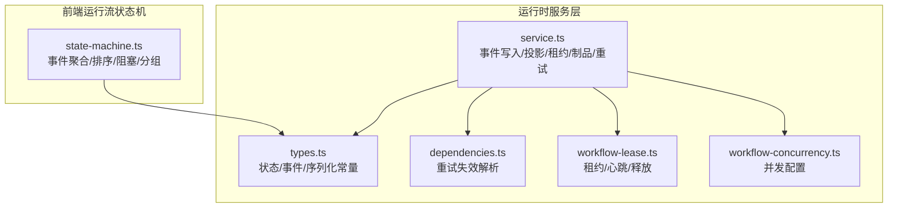
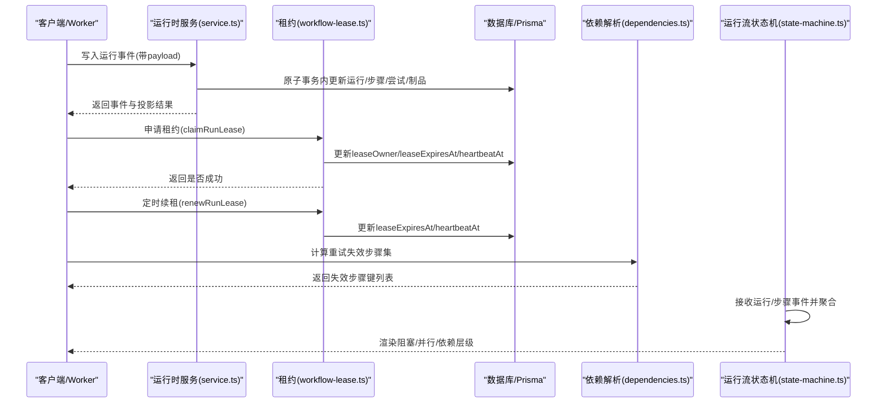
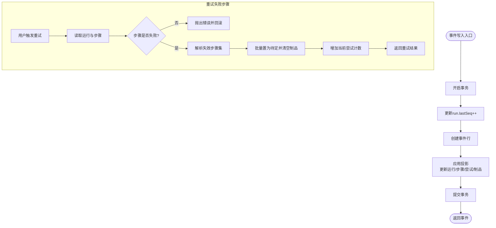
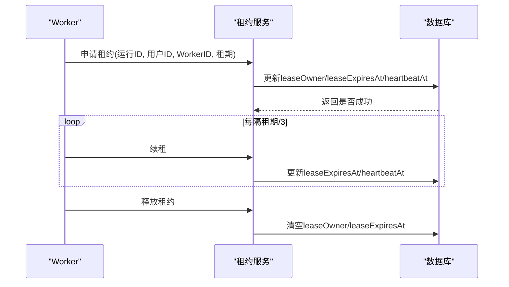
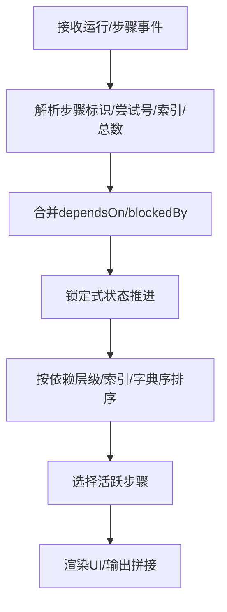
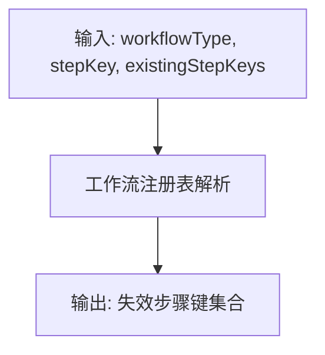
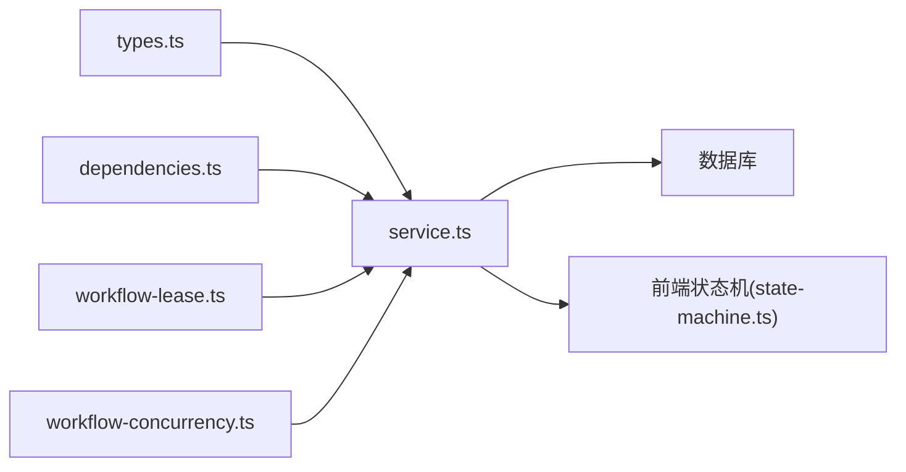

# GraphStep步骤执行

<cite>
**本文引用的文件**
- [src/lib/run-runtime/service.ts](file://src/lib/run-runtime/service.ts)
- [src/lib/run-runtime/types.ts](file://src/lib/run-runtime/types.ts)
- [src/lib/run-runtime/workflow-lease.ts](file://src/lib/run-runtime/workflow-lease.ts)
- [src/lib/workflow-concurrency.ts](file://src/lib/workflow-concurrency.ts)
- [src/lib/workflow-engine/dependencies.ts](file://src/lib/workflow-engine/dependencies.ts)
- [src/lib/query/hooks/run-stream/state-machine.ts](file://src/lib/query/hooks/run-stream/state-machine.ts)
- [tests/integration/run-runtime/retry-failed-step.integration.test.ts](file://tests/integration/run-runtime/retry-failed-step.integration.test.ts)
- [tests/integration/api/contract/run-step-retry.route.test.ts](file://tests/integration/api/contract/run-step-retry.route.test.ts)
</cite>

## 目录
1. [简介](#简介)
2. [项目结构](#项目结构)
3. [核心组件](#核心组件)
4. [架构总览](#架构总览)
5. [详细组件分析](#详细组件分析)
6. [依赖分析](#依赖分析)
7. [性能考虑](#性能考虑)
8. [故障排查指南](#故障排查指南)
9. [结论](#结论)
10. [附录](#附录)

## 简介
本文件围绕 GraphStep 步骤执行系统进行系统化说明，覆盖步骤实体设计、状态管理、执行顺序控制、依赖关系处理、创建/调度/执行/完成流程、重试机制、并行与串行控制、条件分支、输入输出与上下文传递、错误传播、监控与性能分析、调试工具以及扩展与自定义能力。目标是帮助开发者在不深入源码的前提下，理解并正确使用该执行框架。

## 项目结构
与 GraphStep 步骤执行直接相关的核心模块如下：
- 运行时服务层：负责事件写入、投影更新、运行与步骤状态持久化、租约管理、检查点与制品管理、重试失败步骤等
- 类型定义：统一运行与步骤状态、事件类型、序列化与限制等
- 工作流并发配置：控制不同类型工作流的最大并发度
- 租约与心跳：保障 Worker 对运行的独占访问与续租
- 依赖解析：根据工作流类型与步骤键计算重试时的失效范围
- 运行流状态机：前端侧对运行/步骤事件的聚合与排序，支持阻塞、分组、并行键、依赖层级等
- 测试用例：验证重试失效范围、API 合约与任务提交绑定

**图表来源**
- [src/lib/run-runtime/service.ts:1-1200](file://src/lib/run-runtime/service.ts#L1-L1200)
- [src/lib/run-runtime/types.ts:1-101](file://src/lib/run-runtime/types.ts#L1-L101)
- [src/lib/run-runtime/workflow-lease.ts:1-73](file://src/lib/run-runtime/workflow-lease.ts#L1-L73)
- [src/lib/workflow-concurrency.ts:1-43](file://src/lib/workflow-concurrency.ts#L1-L43)
- [src/lib/workflow-engine/dependencies.ts:1-10](file://src/lib/workflow-engine/dependencies.ts#L1-L10)
- [src/lib/query/hooks/run-stream/state-machine.ts:1-587](file://src/lib/query/hooks/run-stream/state-machine.ts#L1-L587)

**章节来源**
- [src/lib/run-runtime/service.ts:1-1200](file://src/lib/run-runtime/service.ts#L1-L1200)
- [src/lib/run-runtime/types.ts:1-101](file://src/lib/run-runtime/types.ts#L1-L101)
- [src/lib/run-runtime/workflow-lease.ts:1-73](file://src/lib/run-runtime/workflow-lease.ts#L1-L73)
- [src/lib/workflow-concurrency.ts:1-43](file://src/lib/workflow-concurrency.ts#L1-L43)
- [src/lib/workflow-engine/dependencies.ts:1-10](file://src/lib/workflow-engine/dependencies.ts#L1-L10)
- [src/lib/query/hooks/run-stream/state-machine.ts:1-587](file://src/lib/query/hooks/run-stream/state-machine.ts#L1-L587)

## 核心组件
- 运行（Run）与步骤（Step）状态模型
  - 运行状态：排队、运行中、完成、失败、取消中、已取消
  - 步骤状态：待定、运行中、完成、失败、取消
- 事件类型
  - 运行级：开始、完成、错误、取消
  - 步骤级：开始、分片、完成、错误
- 事件输入结构
  - 包含 runId、projectId、userId、eventType、stepKey、attempt、lane、payload 等
- 租约与心跳
  - Worker 通过租约声明对运行的独占权，定时续租，超时自动释放
- 并发控制
  - 不同工作流类型的并发上限可配置
- 依赖与失效
  - 基于工作流定义与步骤键，计算重试时需要失效的下游步骤集合
- 制品与检查点
  - 按 runId+stepKey+artifactType+refId 唯一约束存储制品；检查点记录节点状态大小限制

**章节来源**
- [src/lib/run-runtime/types.ts:1-101](file://src/lib/run-runtime/types.ts#L1-L101)
- [src/lib/run-runtime/service.ts:468-674](file://src/lib/run-runtime/service.ts#L468-L674)
- [src/lib/run-runtime/workflow-lease.ts:1-73](file://src/lib/run-runtime/workflow-lease.ts#L1-L73)
- [src/lib/workflow-concurrency.ts:1-43](file://src/lib/workflow-concurrency.ts#L1-L43)
- [src/lib/workflow-engine/dependencies.ts:1-10](file://src/lib/workflow-engine/dependencies.ts#L1-L10)

## 架构总览
下图展示从事件产生到状态投影、租约持有、并发控制与重试失效的整体流程。

**图表来源**
- [src/lib/run-runtime/service.ts:899-929](file://src/lib/run-runtime/service.ts#L899-L929)
- [src/lib/run-runtime/service.ts:468-674](file://src/lib/run-runtime/service.ts#L468-L674)
- [src/lib/run-runtime/workflow-lease.ts:33-72](file://src/lib/run-runtime/workflow-lease.ts#L33-L72)
- [src/lib/workflow-engine/dependencies.ts:1-10](file://src/lib/workflow-engine/dependencies.ts#L1-L10)
- [src/lib/query/hooks/run-stream/state-machine.ts:279-575](file://src/lib/query/hooks/run-stream/state-machine.ts#L279-L575)

## 详细组件分析

### 组件A：运行时服务（事件写入与投影）
- 职责
  - 将事件写入事件表并递增 run 的 lastSeq
  - 在同一事务内应用投影，更新运行状态、步骤状态、步骤尝试、制品
  - 提供租约申请/续租/释放、运行快照、事件查询、检查点、制品 CRUD、重试失败步骤等
- 关键流程
  - 事件写入：原子更新 run.lastSeq 并创建事件行，随后调用投影函数
  - 投影应用：根据事件类型设置运行/步骤状态，维护尝试次数与错误信息，按需生成制品
  - 重试失败步骤：计算下一个尝试号，基于工作流定义解析失效步骤集合，清空相关制品，将失效步骤置为待定并重置尝试计数
- 数据一致性
  - 使用事务保证事件写入与投影的一致性
  - 制品唯一索引校验，避免重复写入导致的数据不一致

**图表来源**
- [src/lib/run-runtime/service.ts:899-929](file://src/lib/run-runtime/service.ts#L899-L929)
- [src/lib/run-runtime/service.ts:468-674](file://src/lib/run-runtime/service.ts#L468-L674)
- [src/lib/run-runtime/service.ts:1101-1199](file://src/lib/run-runtime/service.ts#L1101-L1199)
- [src/lib/workflow-engine/dependencies.ts:1-10](file://src/lib/workflow-engine/dependencies.ts#L1-L10)

**章节来源**
- [src/lib/run-runtime/service.ts:899-929](file://src/lib/run-runtime/service.ts#L899-L929)
- [src/lib/run-runtime/service.ts:468-674](file://src/lib/run-runtime/service.ts#L468-L674)
- [src/lib/run-runtime/service.ts:1101-1199](file://src/lib/run-runtime/service.ts#L1101-L1199)

### 组件B：租约与心跳（Worker 生命周期）
- 职责
  - 申请租约：仅当运行未被其他 Worker 占有或已过期时才允许
  - 续租：定期刷新 leaseExpiresAt 与 heartbeatAt
  - 释放：结束工作时主动释放租约
  - 断言：在关键阶段检查运行状态与租约有效性，防止竞态
- 保护机制
  - 心跳定时器与租约过期时间配合，避免 Worker 长时间占用导致死锁
  - 断言失败时抛出终止错误，确保上层能感知并停止

**图表来源**
- [src/lib/run-runtime/workflow-lease.ts:33-72](file://src/lib/run-runtime/workflow-lease.ts#L33-L72)

**章节来源**
- [src/lib/run-runtime/workflow-lease.ts:1-73](file://src/lib/run-runtime/workflow-lease.ts#L1-L73)

### 组件C：运行流状态机（前端事件聚合）
- 职责
  - 将运行/步骤事件聚合为前端可渲染的状态，维护步骤顺序、依赖层级、阻塞关系、并行键、分组等
  - 支持 think 标签内容拆分与合并，区分 text 与 reasoning 输出
  - 锁定式状态推进，避免逆向回退
- 关键算法
  - 依赖层级计算：拓扑层级，用于排序与并行调度
  - 阻塞判定：来自事件或 payload 的 blockedBy 字段决定步骤状态
  - 活跃步骤选择：基于最大 stepIndex 与最近更新时间确定当前活跃步骤

**图表来源**
- [src/lib/query/hooks/run-stream/state-machine.ts:248-277](file://src/lib/query/hooks/run-stream/state-machine.ts#L248-L277)
- [src/lib/query/hooks/run-stream/state-machine.ts:488-534](file://src/lib/query/hooks/run-stream/state-machine.ts#L488-L534)
- [src/lib/query/hooks/run-stream/state-machine.ts:279-575](file://src/lib/query/hooks/run-stream/state-machine.ts#L279-L575)

**章节来源**
- [src/lib/query/hooks/run-stream/state-machine.ts:1-587](file://src/lib/query/hooks/run-stream/state-machine.ts#L1-L587)

### 组件D：依赖解析与重试失效
- 职责
  - 根据工作流类型与失败步骤键，计算需要失效的下游步骤集合
  - 保证重试时不会脏读上游已变更的结果
- 测试验证
  - 针对不同工作流（如故事到脚本、脚本到分镜）验证失效范围的正确性
  - API 合约测试验证失败步骤重试的拒绝与成功路径

**图表来源**
- [src/lib/workflow-engine/dependencies.ts:1-10](file://src/lib/workflow-engine/dependencies.ts#L1-L10)
- [tests/integration/run-runtime/retry-failed-step.integration.test.ts:1-344](file://tests/integration/run-runtime/retry-failed-step.integration.test.ts#L1-L344)
- [tests/integration/api/contract/run-step-retry.route.test.ts:1-135](file://tests/integration/api/contract/run-step-retry.route.test.ts#L1-L135)

**章节来源**
- [src/lib/workflow-engine/dependencies.ts:1-10](file://src/lib/workflow-engine/dependencies.ts#L1-L10)
- [tests/integration/run-runtime/retry-failed-step.integration.test.ts:1-344](file://tests/integration/run-runtime/retry-failed-step.integration.test.ts#L1-L344)
- [tests/integration/api/contract/run-step-retry.route.test.ts:1-135](file://tests/integration/api/contract/run-step-retry.route.test.ts#L1-L135)

### 组件E：并发控制
- 职责
  - 为分析、图像、视频三类工作流提供并发上限配置
  - 输入标准化，确保正整数与默认值处理
- 应用场景
  - 在 Worker 调度或队列策略中作为限流依据

**章节来源**
- [src/lib/workflow-concurrency.ts:1-43](file://src/lib/workflow-concurrency.ts#L1-L43)

## 依赖分析
- 组件耦合
  - 运行时服务依赖类型定义、依赖解析、租约服务与并发配置
  - 前端状态机依赖类型定义与事件格式
  - 重试功能依赖工作流注册表以确定失效范围
- 外部依赖
  - 数据库事务与唯一索引约束保障数据一致性
  - API 层将重试请求绑定到具体任务，形成“运行-任务”闭环

**图表来源**
- [src/lib/run-runtime/service.ts:1-1200](file://src/lib/run-runtime/service.ts#L1-L1200)
- [src/lib/run-runtime/types.ts:1-101](file://src/lib/run-runtime/types.ts#L1-L101)
- [src/lib/run-runtime/workflow-lease.ts:1-73](file://src/lib/run-runtime/workflow-lease.ts#L1-L73)
- [src/lib/workflow-concurrency.ts:1-43](file://src/lib/workflow-concurrency.ts#L1-L43)
- [src/lib/workflow-engine/dependencies.ts:1-10](file://src/lib/workflow-engine/dependencies.ts#L1-L10)
- [src/lib/query/hooks/run-stream/state-machine.ts:1-587](file://src/lib/query/hooks/run-stream/state-machine.ts#L1-L587)

**章节来源**
- [src/lib/run-runtime/service.ts:1-1200](file://src/lib/run-runtime/service.ts#L1-L1200)
- [src/lib/run-runtime/types.ts:1-101](file://src/lib/run-runtime/types.ts#L1-L101)
- [src/lib/run-runtime/workflow-lease.ts:1-73](file://src/lib/run-runtime/workflow-lease.ts#L1-L73)
- [src/lib/workflow-concurrency.ts:1-43](file://src/lib/workflow-concurrency.ts#L1-L43)
- [src/lib/workflow-engine/dependencies.ts:1-10](file://src/lib/workflow-engine/dependencies.ts#L1-L10)
- [src/lib/query/hooks/run-stream/state-machine.ts:1-587](file://src/lib/query/hooks/run-stream/state-machine.ts#L1-L587)

## 性能考虑
- 事务与索引
  - 事件写入与投影在同一事务内完成，减少中间态
  - 制品唯一索引确保 upsert 的高效与一致性
- 序列化与大小限制
  - 检查点状态大小限制，避免过大状态导致写入失败
- 并发与租约
  - 并发上限与租约续租结合，避免资源争用与长时间占用
- 排序与渲染
  - 依赖层级排序与活跃步骤选择降低前端渲染压力

[本节为通用指导，无需列出具体文件来源]

## 故障排查指南
- 常见问题
  - 租约丢失或过期：确认续租定时器是否正常，检查租约断言
  - 重试失败但未生效：确认步骤状态为失败，核对失效步骤集合是否正确
  - 制品缺失或重复：检查唯一索引是否存在，关注 upsert 行为
  - UI 显示异常：检查 blockedBy、dependsOn、parallelKey 等字段是否正确传入
- 可用工具
  - 运行快照：获取运行与步骤的最新视图
  - 事件查询：按 seq 查询增量事件，辅助定位问题
  - 检查点：保存节点状态，便于回溯与恢复
- 测试参考
  - 重试失效范围与 API 合约测试可作为行为基线

**章节来源**
- [src/lib/run-runtime/service.ts:824-842](file://src/lib/run-runtime/service.ts#L824-L842)
- [src/lib/run-runtime/service.ts:931-960](file://src/lib/run-runtime/service.ts#L931-L960)
- [src/lib/run-runtime/service.ts:987-1021](file://src/lib/run-runtime/service.ts#L987-L1021)
- [tests/integration/run-runtime/retry-failed-step.integration.test.ts:1-344](file://tests/integration/run-runtime/retry-failed-step.integration.test.ts#L1-L344)
- [tests/integration/api/contract/run-step-retry.route.test.ts:1-135](file://tests/integration/api/contract/run-step-retry.route.test.ts#L1-L135)

## 结论
GraphStep 步骤执行系统通过事件驱动与投影机制，实现了运行与步骤状态的强一致管理；租约与心跳保障了 Worker 的安全独占；依赖解析与重试失效机制确保了失败后的正确恢复；前端状态机提供了丰富的可视化与交互能力。整体设计兼顾了可靠性、可观测性与可扩展性。

[本节为总结，无需列出具体文件来源]

## 附录

### 步骤状态与转换规则
- 运行状态转换
  - 从排队进入运行，开始时间首次设置
  - 完成/错误/取消分别更新完成时间与错误信息
- 步骤状态转换
  - 开始 → 运行；分片 → 运行；完成 → 完成；错误 → 失败
  - 支持 stale 状态标记，前端可据此提示过期
- 阻塞与解锁
  - blockedBy 存在则阻塞；收到 start/chunk 且无阻塞则解锁

**章节来源**
- [src/lib/run-runtime/service.ts:468-674](file://src/lib/run-runtime/service.ts#L468-L674)
- [src/lib/query/hooks/run-stream/state-machine.ts:398-486](file://src/lib/query/hooks/run-stream/state-machine.ts#L398-L486)

### 并行执行与串行依赖
- 串行依赖
  - 通过 stepIndex 与依赖层级排序保证执行顺序
- 并行键与分组
  - parallelKey 与 groupId 支持并行与分组控制
- 活跃步骤选择
  - 最大 stepIndex 与最近更新时间优先

**章节来源**
- [src/lib/query/hooks/run-stream/state-machine.ts:514-564](file://src/lib/query/hooks/run-stream/state-machine.ts#L514-L564)

### 条件分支与阻塞
- blockedBy 字段
  - 来自事件或 payload，决定步骤是否阻塞
- stale 标记
  - 通过 payload.stale 或事件状态标记过期

**章节来源**
- [src/lib/query/hooks/run-stream/state-machine.ts:488-505](file://src/lib/query/hooks/run-stream/state-machine.ts#L488-L505)

### 输入输出管理与上下文传递
- 输入
  - 创建运行时的 input 字段随运行持久化
- 输出
  - 步骤完成时可生成制品；运行完成时保存运行输出
- 上下文
  - 通过 payload 传递上下文信息，如 refId、版本哈希、使用量等

**章节来源**
- [src/lib/run-runtime/service.ts:676-744](file://src/lib/run-runtime/service.ts#L676-L744)
- [src/lib/run-runtime/service.ts:424-466](file://src/lib/run-runtime/service.ts#L424-L466)
- [src/lib/run-runtime/service.ts:1023-1069](file://src/lib/run-runtime/service.ts#L1023-L1069)

### 错误传播机制
- 步骤错误
  - 记录 errorCode 与 errorMessage，步骤状态置为失败
- 运行错误
  - 运行状态置为失败，清理租约，未完成步骤统一置为失败
- UI 展示
  - 前端状态机在 run.error 时将未完成步骤标记为失败，避免 UI 长时间显示“处理中”

**章节来源**
- [src/lib/run-runtime/service.ts:508-562](file://src/lib/run-runtime/service.ts#L508-L562)
- [src/lib/query/hooks/run-stream/state-machine.ts:324-345](file://src/lib/query/hooks/run-stream/state-machine.ts#L324-L345)

### 监控指标与性能分析
- 指标建议
  - 运行/步骤状态分布、事件吞吐、租约成功率、重试次数与失效范围统计
  - 检查点大小分布与阈值命中率
- 分析方法
  - 基于事件序列与快照进行时序分析
  - 通过制品数量与大小评估产出质量

**章节来源**
- [src/lib/run-runtime/service.ts:987-1021](file://src/lib/run-runtime/service.ts#L987-L1021)

### 调试工具
- 快照与事件查询
  - 获取运行与步骤快照，按 seq 查询增量事件
- 检查点
  - 保存节点状态，便于回溯
- API 合约测试
  - 验证重试接口的行为边界

**章节来源**
- [src/lib/run-runtime/service.ts:824-842](file://src/lib/run-runtime/service.ts#L824-L842)
- [src/lib/run-runtime/service.ts:931-960](file://src/lib/run-runtime/service.ts#L931-L960)
- [src/lib/run-runtime/service.ts:987-1021](file://src/lib/run-runtime/service.ts#L987-L1021)
- [tests/integration/api/contract/run-step-retry.route.test.ts:1-135](file://tests/integration/api/contract/run-step-retry.route.test.ts#L1-L135)

### 扩展性与自定义
- 自定义步骤
  - 通过工作流注册表定义步骤序列与依赖，重试失效范围随之确定
- 自定义工作流
  - 新增 workflowType 后，重试失效逻辑会按新定义计算
- 并发策略
  - 可针对不同类型工作流调整并发上限

**章节来源**
- [src/lib/workflow-engine/dependencies.ts:1-10](file://src/lib/workflow-engine/dependencies.ts#L1-L10)
- [src/lib/workflow-concurrency.ts:1-43](file://src/lib/workflow-concurrency.ts#L1-L43)