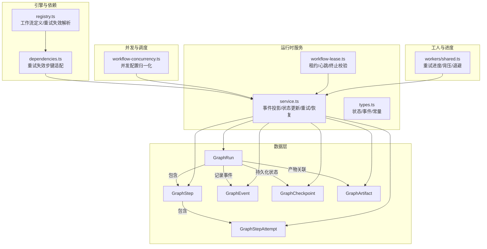
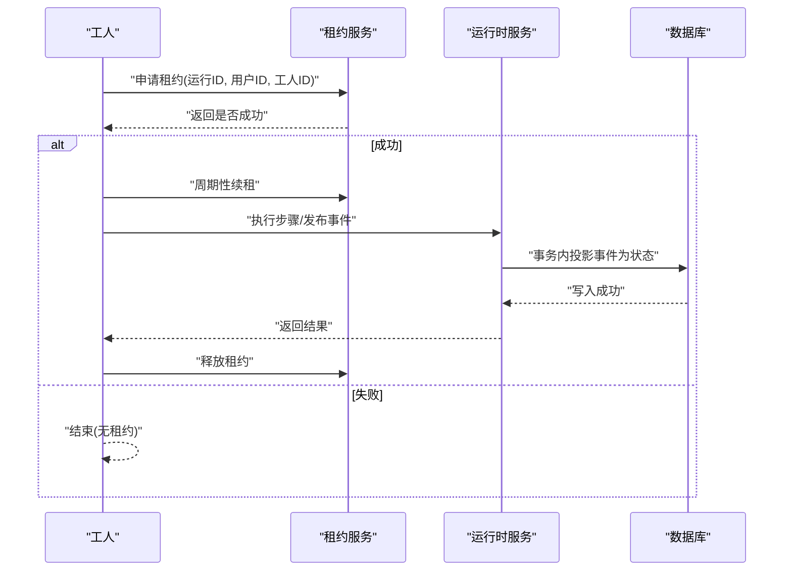
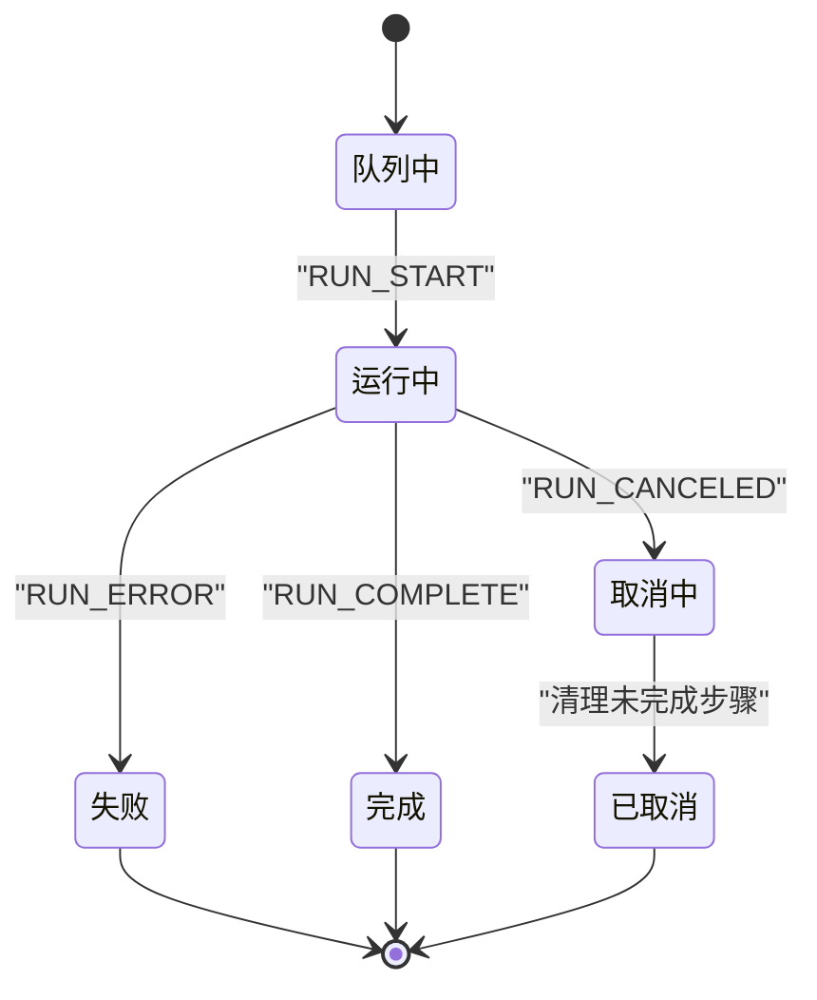
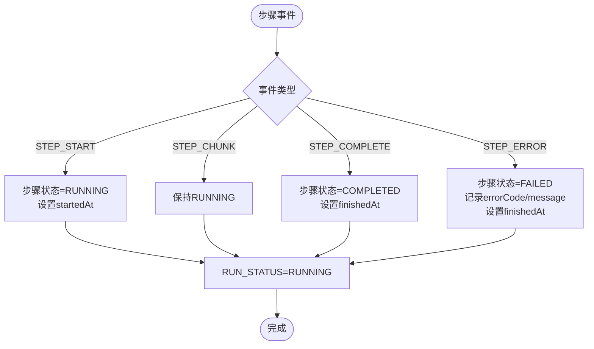
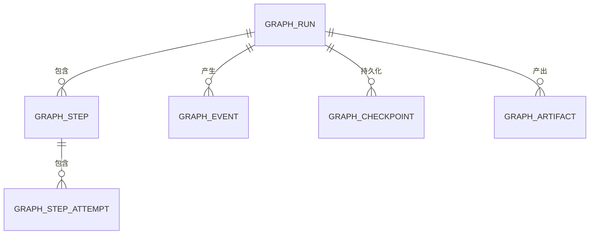
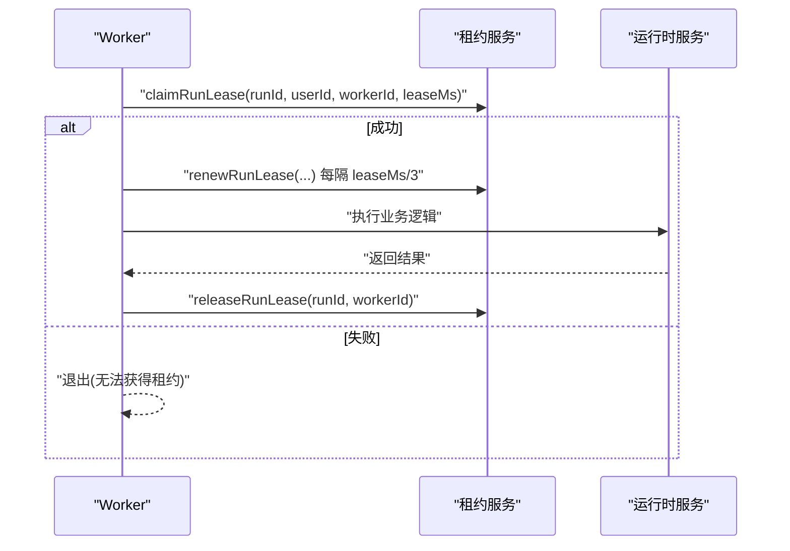
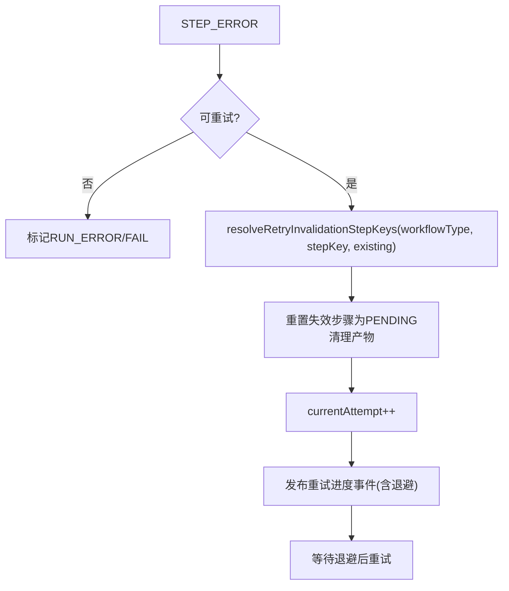
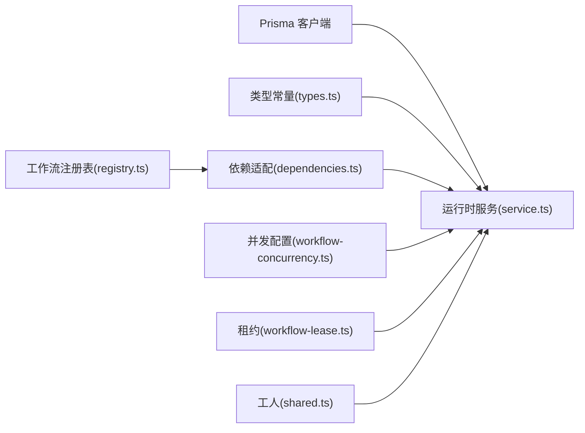

# 工作流执行模型

<cite>
**本文引用的文件**
- [prisma/schema.prisma](file://prisma/schema.prisma)
- [src/lib/run-runtime/service.ts](file://src/lib/run-runtime/service.ts)
- [src/lib/run-runtime/types.ts](file://src/lib/run-runtime/types.ts)
- [src/lib/run-runtime/workflow-lease.ts](file://src/lib/run-runtime/workflow-lease.ts)
- [src/lib/workflow-concurrency.ts](file://src/lib/workflow-concurrency.ts)
- [src/lib/workflow-engine/dependencies.ts](file://src/lib/workflow-engine/dependencies.ts)
- [src/lib/workflow-engine/registry.ts](file://src/lib/workflow-engine/registry.ts)
- [src/lib/workers/shared.ts](file://src/lib/workers/shared.ts)
- [tests/integration/run-runtime/reconcile-active-runs.integration.test.ts](file://tests/integration/run-runtime/reconcile-active-runs.integration.test.ts)
- [tests/integration/run-runtime/retry-failed-step.integration.test.ts](file://tests/integration/run-runtime/retry-failed-step.integration.test.ts)
- [tests/unit/run-runtime/recovery.test.ts](file://tests/unit/run-runtime/recovery.test.ts)
- [tests/unit/run-runtime/task-bridge.test.ts](file://tests/unit/run-runtime/task-bridge.test.ts)
</cite>

## 目录
1. [简介](#简介)
2. [项目结构](#项目结构)
3. [核心组件](#核心组件)
4. [架构总览](#架构总览)
5. [组件详解](#组件详解)
6. [依赖关系分析](#依赖关系分析)
7. [性能考量](#性能考量)
8. [故障排查指南](#故障排查指南)
9. [结论](#结论)
10. [附录](#附录)

## 简介
本文件系统性阐述 Waoowaoo 的工作流执行模型，围绕 GraphRun、GraphStep、GraphStepAttempt、GraphEvent 等核心实体，解释其数据结构、状态机设计、步骤执行机制、错误处理策略、任务调度与重试、超时与租约管理、并行与依赖、资源与检查点、状态持久化与恢复，以及引擎扩展性与自定义工作流支持能力。目标是帮助开发者与运维人员全面理解从创建工作流到完成/失败的全生命周期管理。

## 项目结构
工作流执行模型主要由以下部分构成：
- 数据层：Prisma 模型定义了 GraphRun、GraphStep、GraphStepAttempt、GraphEvent、GraphCheckpoint、GraphArtifact 等实体及其索引与约束。
- 运行时服务：负责事件投影、状态更新、重试与失效步键计算、租约与心跳、恢复与一致性维护。
- 类型与常量：统一运行时事件类型、运行与步骤状态、序列化与限制等。
- 并发与调度：工作流并发配置与归一化，保障不同工作流类型的资源占用可控。
- 引擎与依赖：工作流注册表与依赖解析，支持按工作流类型定制重试失效范围。
- 工人与进度：工人侧的重试进度发布、背压与退避策略，以及生命周期事件上报。

图表来源
- [prisma/schema.prisma:680-795](file://prisma/schema.prisma#L680-L795)
- [src/lib/run-runtime/service.ts:1-200](file://src/lib/run-runtime/service.ts#L1-L200)
- [src/lib/run-runtime/types.ts:1-101](file://src/lib/run-runtime/types.ts#L1-L101)
- [src/lib/run-runtime/workflow-lease.ts:1-73](file://src/lib/run-runtime/workflow-lease.ts#L1-L73)
- [src/lib/workflow-concurrency.ts:1-43](file://src/lib/workflow-concurrency.ts#L1-L43)
- [src/lib/workflow-engine/dependencies.ts:1-9](file://src/lib/workflow-engine/dependencies.ts#L1-L9)
- [src/lib/workflow-engine/registry.ts:197-214](file://src/lib/workflow-engine/registry.ts#L197-L214)
- [src/lib/workers/shared.ts:547-592](file://src/lib/workers/shared.ts#L547-L592)

章节来源
- [prisma/schema.prisma:680-795](file://prisma/schema.prisma#L680-L795)
- [src/lib/run-runtime/service.ts:1-200](file://src/lib/run-runtime/service.ts#L1-L200)
- [src/lib/run-runtime/types.ts:1-101](file://src/lib/run-runtime/types.ts#L1-L101)
- [src/lib/run-runtime/workflow-lease.ts:1-73](file://src/lib/run-runtime/workflow-lease.ts#L1-L73)
- [src/lib/workflow-concurrency.ts:1-43](file://src/lib/workflow-concurrency.ts#L1-L43)
- [src/lib/workflow-engine/dependencies.ts:1-9](file://src/lib/workflow-engine/dependencies.ts#L1-L9)
- [src/lib/workflow-engine/registry.ts:197-214](file://src/lib/workflow-engine/registry.ts#L197-L214)
- [src/lib/workers/shared.ts:547-592](file://src/lib/workers/shared.ts#L547-L592)

## 核心组件
- GraphRun：工作流运行实例，承载输入、输出、状态、租约、计数与时间戳；支持按用户、项目、目标与工作流类型检索与索引。
- GraphStep：单个步骤，包含步骤键、标题、序号、总数、当前尝试次数、状态与错误信息；与 GraphStepAttempt 建模“多次尝试”。
- GraphStepAttempt：步骤的一次尝试，记录提供商、模型、输入哈希、文本/推理输出、用量、错误码与消息、起止时间；支持唯一索引(runId, stepKey, attempt)。
- GraphEvent：事件序列，按 runId+seq 唯一，记录事件类型、步骤键、尝试号、通道(text/reasoning)与载荷；用于审计、追踪与实时视图构建。
- GraphCheckpoint：检查点，按 runId+nodeKey+version 唯一，存储节点状态与字节大小，支持恢复与版本演进。
- GraphArtifact：产物，按 runId+stepKey+artifactType+refId 唯一，记录产物类型、引用标识、版本哈希与载荷，便于去重与回放。

章节来源
- [prisma/schema.prisma:680-795](file://prisma/schema.prisma#L680-L795)

## 架构总览
工作流执行采用“事件驱动 + 状态投影”的架构：
- 事件源：GraphEvent 记录所有运行期事件（run/step 生命周期、chunk 流式输出、错误）。
- 投影器：service.ts 将事件投影为 GraphRun、GraphStep、GraphStepAttempt 的一致状态，并维护索引与约束。
- 租约与心跳：workflow-lease.ts 通过 claim/renew/release 保证同一时刻仅一个 worker 处理某 run，防止竞态。
- 重试与失效：registry.ts + dependencies.ts 定义工作流级重试失效范围，service.ts 在重试时清理受影响产物并重置步状态。
- 并发控制：workflow-concurrency.ts 归一化并发配置，避免负值与非整数，确保资源上限。
- 工人反馈：workers/shared.ts 发布重试进度事件，携带退避与错误上下文，便于可观测性与用户提示。

图表来源
- [src/lib/run-runtime/workflow-lease.ts:33-72](file://src/lib/run-runtime/workflow-lease.ts#L33-L72)
- [src/lib/run-runtime/service.ts:468-562](file://src/lib/run-runtime/service.ts#L468-L562)
- [prisma/schema.prisma:680-795](file://prisma/schema.prisma#L680-L795)

章节来源
- [src/lib/run-runtime/workflow-lease.ts:1-73](file://src/lib/run-runtime/workflow-lease.ts#L1-L73)
- [src/lib/run-runtime/service.ts:468-562](file://src/lib/run-runtime/service.ts#L468-L562)
- [prisma/schema.prisma:680-795](file://prisma/schema.prisma#L680-L795)

## 组件详解

### GraphRun：运行实例与状态机
- 关键字段：用户/项目/目标/工作流类型、任务类型/任务ID、状态、输入/输出、错误码/消息、队列/开始/结束时间、最后序列号、租约持有者/过期时间、心跳时间、版本。
- 状态机：QUEUED → RUNNING → COMPLETED/FAILED/CANCELED；支持取消中(CANCELING)与取消(CANCELED)中间态。
- 事件投影：
  - RUN_START：状态置为 RUNNING，设置 startedAt。
  - RUN_COMPLETE：状态置为 COMPLETED，写入 output，finishedAt，清空租约。
  - RUN_ERROR：状态置为 FAILED，写入 errorCode/message，finishedAt，清空租约。
  - RUN_CANCELED：状态置为 CANCELED，finishedAt，清空租约。
  - 同步更新未完成的步骤为 COMPLETED/FAILED/CANCELED 并填充完成时间与错误信息。
- 查询与索引：按用户、项目、目标、工作流类型、状态、租约过期时间建立索引，支持高效检索与回收。

图表来源
- [src/lib/run-runtime/service.ts:468-562](file://src/lib/run-runtime/service.ts#L468-L562)
- [src/lib/run-runtime/types.ts:1-34](file://src/lib/run-runtime/types.ts#L1-L34)
- [prisma/schema.prisma:680-688](file://prisma/schema.prisma#L680-L688)

章节来源
- [src/lib/run-runtime/service.ts:468-562](file://src/lib/run-runtime/service.ts#L468-L562)
- [src/lib/run-runtime/types.ts:1-34](file://src/lib/run-runtime/types.ts#L1-L34)
- [prisma/schema.prisma:680-688](file://prisma/schema.prisma#L680-L688)

### GraphStep：步骤与尝试
- 关键字段：runId、stepKey、标题、序号/总数、当前尝试(currentAttempt)、状态、错误码/消息、起止时间。
- GraphStepAttempt：一次尝试的详细记录，含提供商/模型/输入哈希/输出/用量/错误信息/起止时间。
- 步骤状态机：PENDING → RUNNING → COMPLETED/FAILED/CANCELED；STEP_ERROR/STEP_COMPLETE 会触发 run 状态提升为 RUNNING。
- 尝试递增：重试时 currentAttempt 自增，清理受影响产物，保留最新尝试的输出与用量。

图表来源
- [src/lib/run-runtime/service.ts:564-590](file://src/lib/run-runtime/service.ts#L564-L590)
- [src/lib/run-runtime/types.ts:12-21](file://src/lib/run-runtime/types.ts#L12-L21)
- [prisma/schema.prisma:690-740](file://prisma/schema.prisma#L690-L740)

章节来源
- [src/lib/run-runtime/service.ts:564-590](file://src/lib/run-runtime/service.ts#L564-L590)
- [src/lib/run-runtime/types.ts:12-21](file://src/lib/run-runtime/types.ts#L12-L21)
- [prisma/schema.prisma:690-740](file://prisma/schema.prisma#L690-L740)

### GraphEvent：事件序列与实时视图
- 结构：runId、projectId、userId、seq、eventType、stepKey、attempt、lane(text/reasoning)、payload、createdAt。
- 唯一性：runId+seq 唯一，便于幂等重放与顺序消费。
- 用途：作为事件源驱动运行时投影，同时用于前端实时视图派生与审计追踪。

图表来源
- [prisma/schema.prisma:680-795](file://prisma/schema.prisma#L680-L795)

章节来源
- [prisma/schema.prisma:742-762](file://prisma/schema.prisma#L742-L762)

### 租约与心跳：运行安全与超时处理
- 申请租约：claimRunLease，返回布尔值表示是否获得。
- 心跳：周期性 renewRunLease，心跳间隔为 min(5s, 租约时长/3)，避免长时间阻塞。
- 终止校验：assertWorkflowRunActive 在每个阶段检查 run 是否存在、租约是否仍属于当前 worker、状态是否允许继续。
- 释放租约：finally 中释放，确保异常路径也能回收。

图表来源
- [src/lib/run-runtime/workflow-lease.ts:33-72](file://src/lib/run-runtime/workflow-lease.ts#L33-L72)
- [src/lib/run-runtime/workflow-lease.ts:11-31](file://src/lib/run-runtime/workflow-lease.ts#L11-L31)

章节来源
- [src/lib/run-runtime/workflow-lease.ts:1-73](file://src/lib/run-runtime/workflow-lease.ts#L1-L73)

### 重试机制与失效范围
- 触发条件：步骤失败(STEP_ERROR)后，进入重试流程；重试时 currentAttempt 自增。
- 失效范围解析：根据 workflowType 查找工作流定义，调用 resolveRetryInvalidationStepKeys 计算需要重置/失效的 stepKey 列表。
- 清理与重置：删除受影响 stepKey 对应的产物，重置这些步骤为 PENDING，currentAttempt 归零，清除错误信息与时间戳。
- 背压与退避：工人侧发布重试进度事件，携带已失败次数、最大次数与下一次退避毫秒数，便于 UI 与可观测性。

图表来源
- [src/lib/run-runtime/service.ts:1119-1199](file://src/lib/run-runtime/service.ts#L1119-L1199)
- [src/lib/workflow-engine/dependencies.ts:1-9](file://src/lib/workflow-engine/dependencies.ts#L1-L9)
- [src/lib/workflow-engine/registry.ts:201-214](file://src/lib/workflow-engine/registry.ts#L201-L214)
- [src/lib/workers/shared.ts:547-592](file://src/lib/workers/shared.ts#L547-L592)

章节来源
- [src/lib/run-runtime/service.ts:1119-1199](file://src/lib/run-runtime/service.ts#L1119-L1199)
- [src/lib/workflow-engine/dependencies.ts:1-9](file://src/lib/workflow-engine/dependencies.ts#L1-L9)
- [src/lib/workflow-engine/registry.ts:201-214](file://src/lib/workflow-engine/registry.ts#L201-L214)
- [src/lib/workers/shared.ts:547-592](file://src/lib/workers/shared.ts#L547-L592)

### 并行执行与资源管理
- 并发配置：默认 analysis/image/video 并发均为 5；normalizeWorkflowConcurrencyConfig 将未知/非法值归一化为正整数，否则使用默认值。
- 使用方式：在任务提交/排队时依据 workflowType 选择对应并发上限，避免资源争用导致抖动。

章节来源
- [src/lib/workflow-concurrency.ts:1-43](file://src/lib/workflow-concurrency.ts#L1-L43)

### 检查点与状态持久化/恢复
- 检查点模型：按 runId+nodeKey+version 唯一，记录节点状态 JSON 与字节数，支持版本演进与回溯。
- 恢复策略：selectRecoverableRun 与 recovery 测试用例表明，系统可基于 run 状态与事件序列进行恢复，结合租约与心跳维持一致性。

章节来源
- [prisma/schema.prisma:764-777](file://prisma/schema.prisma#L764-L777)
- [src/lib/run-runtime/service.ts:2-3](file://src/lib/run-runtime/service.ts#L2-L3)
- [tests/unit/run-runtime/recovery.test.ts](file://tests/unit/run-runtime/recovery.test.ts)

### 扩展性与自定义工作流
- 工作流注册表：通过 getWorkflowDefinition 获取定义，resolveWorkflowRetryInvalidationStepKeys 支持按工作流类型定制重试失效范围。
- 依赖适配：dependencies.ts 作为适配层，将外部调用委托给 registry.ts，便于替换与扩展。

章节来源
- [src/lib/workflow-engine/registry.ts:197-214](file://src/lib/workflow-engine/registry.ts#L197-L214)
- [src/lib/workflow-engine/dependencies.ts:1-9](file://src/lib/workflow-engine/dependencies.ts#L1-L9)

## 依赖关系分析
- 数据模型依赖：GraphRun 与 GraphStep 建立一对多关系；GraphStep 与 GraphStepAttempt 建立一对多关系；GraphEvent 与 GraphRun 建立一对多关系；GraphCheckpoint/GraphArtifact 与 GraphRun 建立一对多关系。
- 运行时服务依赖：service.ts 依赖 Prisma 客户端与运行时类型，负责事务内投影与一致性维护。
- 引擎依赖：registry.ts 提供工作流定义与重试策略；dependencies.ts 作为适配层。
- 并发与租约：workflow-concurrency.ts 与 workflow-lease.ts 分别负责资源上限与运行安全。
- 工人集成：workers/shared.ts 与运行时协作，发布重试进度事件。

图表来源
- [src/lib/run-runtime/service.ts:1-200](file://src/lib/run-runtime/service.ts#L1-L200)
- [src/lib/run-runtime/types.ts:1-101](file://src/lib/run-runtime/types.ts#L1-L101)
- [src/lib/workflow-engine/registry.ts:197-214](file://src/lib/workflow-engine/registry.ts#L197-L214)
- [src/lib/workflow-engine/dependencies.ts:1-9](file://src/lib/workflow-engine/dependencies.ts#L1-L9)
- [src/lib/workflow-concurrency.ts:1-43](file://src/lib/workflow-concurrency.ts#L1-L43)
- [src/lib/run-runtime/workflow-lease.ts:1-73](file://src/lib/run-runtime/workflow-lease.ts#L1-L73)
- [src/lib/workers/shared.ts:547-592](file://src/lib/workers/shared.ts#L547-L592)

章节来源
- [src/lib/run-runtime/service.ts:1-200](file://src/lib/run-runtime/service.ts#L1-L200)
- [src/lib/run-runtime/types.ts:1-101](file://src/lib/run-runtime/types.ts#L1-L101)
- [src/lib/workflow-engine/registry.ts:197-214](file://src/lib/workflow-engine/registry.ts#L197-L214)
- [src/lib/workflow-engine/dependencies.ts:1-9](file://src/lib/workflow-engine/dependencies.ts#L1-L9)
- [src/lib/workflow-concurrency.ts:1-43](file://src/lib/workflow-concurrency.ts#L1-L43)
- [src/lib/run-runtime/workflow-lease.ts:1-73](file://src/lib/run-runtime/workflow-lease.ts#L1-L73)
- [src/lib/workers/shared.ts:547-592](file://src/lib/workers/shared.ts#L547-L592)

## 性能考量
- 索引优化：runId+status、runId+stepIndex、runId+createdAt 等索引有助于快速筛选与排序。
- 事务一致性：事件投影在单事务内完成，减少中间态可见性问题。
- 心跳频率：心跳间隔与租约时长成比例，避免过于频繁的心跳开销。
- 并发上限：通过并发配置限制不同类型工作流的并发度，避免资源争用。
- 状态大小限制：RUN_STATE_MAX_BYTES 限制状态载荷大小，防止过大 JSON 导致写放大。

章节来源
- [prisma/schema.prisma:680-795](file://prisma/schema.prisma#L680-L795)
- [src/lib/run-runtime/types.ts:100-101](file://src/lib/run-runtime/types.ts#L100-L101)
- [src/lib/workflow-concurrency.ts:1-43](file://src/lib/workflow-concurrency.ts#L1-L43)
- [src/lib/run-runtime/workflow-lease.ts:51-58](file://src/lib/run-runtime/workflow-lease.ts#L51-L58)

## 故障排查指南
- 租约丢失/运行终止：assertWorkflowRunActive 会在 run 不存在、租约不属于当前 worker 或状态为已完成/取消/失败时抛出 TaskTerminatedError，需检查 workerId 与 run 状态。
- 重试无效：若重试后状态未变化，确认 resolveRetryInvalidationStepKeys 返回的失效步骤集合是否包含目标 stepKey，以及是否正确清理了产物。
- 事件未生效：核对 GraphEvent 的 seq 与 eventType 是否符合预期，检查 RUN_START/RUN_ERROR/RUN_CANCELED 是否被投影为 GraphRun 状态。
- 恢复失败：检查 recoverable run 条件与租约状态，确保心跳正常且未过期。

章节来源
- [src/lib/run-runtime/workflow-lease.ts:11-31](file://src/lib/run-runtime/workflow-lease.ts#L11-L31)
- [src/lib/run-runtime/service.ts:468-562](file://src/lib/run-runtime/service.ts#L468-L562)
- [tests/integration/run-runtime/reconcile-active-runs.integration.test.ts](file://tests/integration/run-runtime/reconcile-active-runs.integration.test.ts)
- [tests/integration/run-runtime/retry-failed-step.integration.test.ts](file://tests/integration/run-runtime/retry-failed-step.integration.test.ts)
- [tests/unit/run-runtime/recovery.test.ts](file://tests/unit/run-runtime/recovery.test.ts)

## 结论
Waoowaoo 的工作流执行模型以事件驱动为核心，通过 GraphRun/GraphStep/GraphStepAttempt/GraphEvent/GraphCheckpoint/GraphArtifact 等实体实现强一致的状态投影与可观测性。租约与心跳保障运行安全，重试与失效范围解析支持细粒度容错，检查点与恢复机制提供稳健的持久化与回溯能力。并发配置与资源上限控制确保系统在高负载下的稳定性。注册表与依赖适配为自定义工作流提供了清晰的扩展点。

## 附录
- 相关测试用例：
  - 运行时一致性与恢复：tests/integration/run-runtime/reconcile-active-runs.integration.test.ts、tests/unit/run-runtime/recovery.test.ts
  - 步骤重试与失效范围：tests/integration/run-runtime/retry-failed-step.integration.test.ts
  - 任务桥接与运行时交互：tests/unit/run-runtime/task-bridge.test.ts

章节来源
- [tests/integration/run-runtime/reconcile-active-runs.integration.test.ts](file://tests/integration/run-runtime/reconcile-active-runs.integration.test.ts)
- [tests/integration/run-runtime/retry-failed-step.integration.test.ts](file://tests/integration/run-runtime/retry-failed-step.integration.test.ts)
- [tests/unit/run-runtime/recovery.test.ts](file://tests/unit/run-runtime/recovery.test.ts)
- [tests/unit/run-runtime/task-bridge.test.ts](file://tests/unit/run-runtime/task-bridge.test.ts)