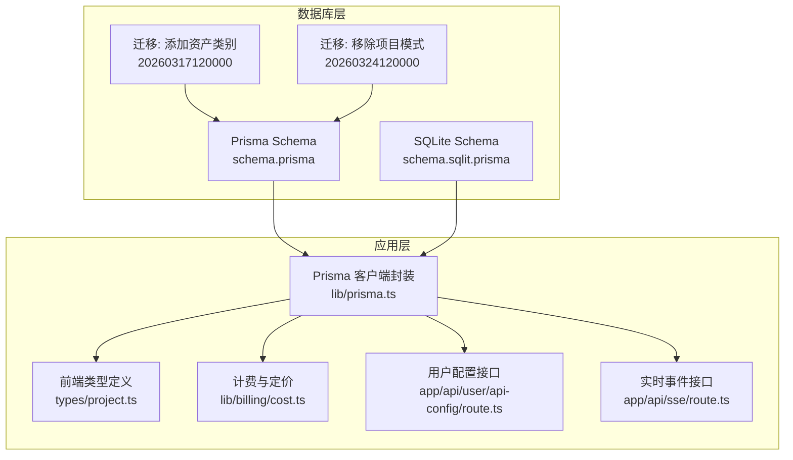
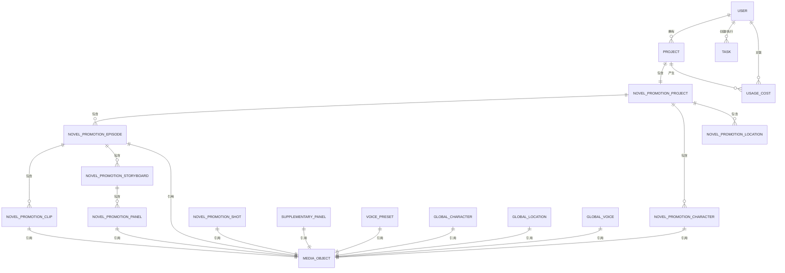
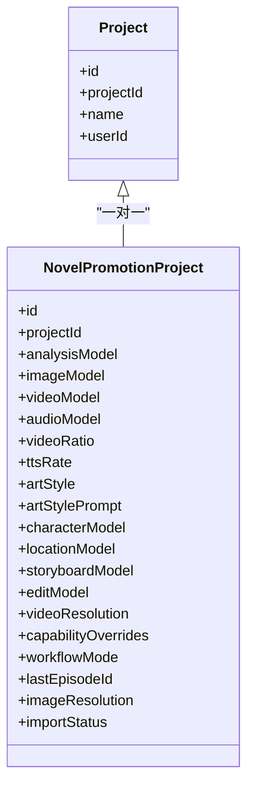
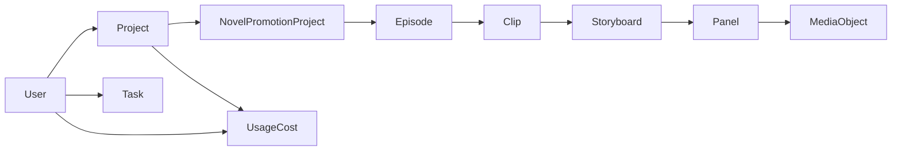

# 数据模型

<cite>
**本文引用的文件**
- [schema.prisma](file://prisma/schema.prisma)
- [schema.sqlit.prisma](file://prisma/schema.sqlit.prisma)
- [project.ts](file://src/types/project.ts)
- [prisma.ts](file://src/lib/prisma.ts)
- [cost.ts](file://src/lib/billing/cost.ts)
- [route.ts](file://src/app/api/user/api-config/route.ts)
- [migration.sql(20260317120000)](file://prisma/migrations/20260317120000_add_asset_kind_to_locations/migration.sql)
- [migration.sql(20260324120000)](file://prisma/migrations/20260324120000_drop_project_mode/migration.sql)
- [route.ts(sse)](file://src/app/api/sse/route.ts)
- [tasks.ts](file://tests/system/helpers/tasks.ts)
- [route.ts(user/api-config)](file://src/app/api/user/api-config/route.ts)
</cite>

## 目录
1. [简介](#简介)
2. [项目结构](#项目结构)
3. [核心组件](#核心组件)
4. [架构总览](#架构总览)
5. [详细组件分析](#详细组件分析)
6. [依赖分析](#依赖分析)
7. [性能考量](#性能考量)
8. [故障排查指南](#故障排查指南)
9. [结论](#结论)
10. [附录](#附录)

## 简介
本文件系统性梳理 Waoowaoo 基于 Prisma ORM 的核心数据模型，聚焦以下关键实体：Project、NovelPromotionProject、User、Task、UsageCost，并扩展到与之紧密耦合的媒体对象、图形工作流、计费与余额等子模型。文档从字段定义、数据类型、约束条件与业务含义出发，阐明一对一、一对多、多对多关系的实现；并结合迁移脚本与应用层类型，解释主键、外键、唯一约束与索引的设计考量，以及数据验证规则、默认值设置、业务规则与生命周期管理。

## 项目结构
- 数据模型定义位于 Prisma Schema 文件中，采用 MySQL 作为生产数据库，同时提供 SQLite 版本用于开发与测试。
- 应用层通过 Prisma Client 访问数据库，计费与模型能力校验在业务层完成，确保数据一致性与定价正确性。
- 迁移脚本记录了历史演进，例如新增资产类别字段、移除项目模式字段等。

图表来源
- [schema.prisma](file://prisma/schema.prisma)
- [schema.sqlit.prisma](file://prisma/schema.sqlit.prisma)
- [prisma.ts](file://src/lib/prisma.ts)
- [project.ts](file://src/types/project.ts)
- [cost.ts](file://src/lib/billing/cost.ts)
- [route.ts(user/api-config)](file://src/app/api/user/api-config/route.ts)
- [route.ts(sse)](file://src/app/api/sse/route.ts)
- [migration.sql(20260317120000)](file://prisma/migrations/20260317120000_add_asset_kind_to_locations/migration.sql)
- [migration.sql(20260324120000)](file://prisma/migrations/20260324120000_drop_project_mode/migration.sql)

章节来源
- [schema.prisma](file://prisma/schema.prisma)
- [schema.sqlit.prisma](file://prisma/schema.sqlit.prisma)
- [prisma.ts](file://src/lib/prisma.ts)

## 核心组件
本节聚焦五个核心实体及其关键字段、约束与业务含义。

- Project（项目）
  - 字段要点：主键 id，名称、描述、所属用户、访问时间戳、与 NovelPromotionProject 的一对一关系、与 UsageCost 的一对多关系。
  - 约束：索引在 userId；与 User 外键级联删除。
  - 业务含义：承载用户创作内容的容器，小说推广模式下的数据入口。

- NovelPromotionProject（小说推广项目）
  - 字段要点：主键 id，关联外部 Project 的 projectId（唯一），工作流模型配置（分析、图像、视频、语音、画风、分辨率、比例、TTS速率等），最后集数引用，与 Project 的一对一关系，与 Characters/Locations/Episodes 的一对多关系。
  - 约束：索引在 projectId；与 Project 外键级联删除。
  - 业务含义：定义小说推广工作流的全局参数与状态，驱动后续分镜、剪辑、配音等环节。

- User（用户）
  - 字段要点：主键 id，用户名唯一、邮箱、头像、密码、创建/更新时间；与 Account/Session/UsageCost 的一对多关系；与 Project 的一对多关系；与 Task/GraphRun 等协作工作流实体的多对多间接关系。
  - 约束：用户名唯一；索引在 id。
  - 业务含义：系统主体，贯穿鉴权、计费、任务调度与资产中心。

- Task（任务）
  - 字段要点：主键 id，用户/项目/剧集引用，目标类型/目标 id，状态、进度、尝试次数、优先级、去重键、外部 ID、负载/结果、错误码/消息、计费信息、时间戳（排队/开始/结束/心跳/入队）。
  - 约束：dedupeKey 唯一；多处索引覆盖状态、类型、目标组合、项目、用户、心跳时间。
  - 业务含义：统一的任务执行载体，支撑工作流与图形运行时的异步编排。

- UsageCost（用量计费）
  - 字段要点：主键 id，项目/用户引用，API 类型、模型、动作、数量、单位、金额、元数据、创建时间；与 Project/User 的多对一关系。
  - 约束：索引在 apiType、createdAt、projectId、userId；与 Project/User 外键级联删除。
  - 业务含义：记录具体消费明细，用于账单与成本归集。

章节来源
- [schema.prisma](file://prisma/schema.prisma)
- [project.ts](file://src/types/project.ts)

## 架构总览
下图展示核心实体间的关系与典型交互路径，包括项目-推广项目-剧集-分镜-面板-媒体对象的链路，以及任务驱动的生命周期。

图表来源
- [schema.prisma](file://prisma/schema.prisma)

## 详细组件分析

### 实体关系与字段映射
- 主键/外键/唯一约束
  - 主键：所有模型均以字符串 UUID 为主键，确保分布式安全与可追踪性。
  - 外键：User → Project/Task/UsageCost；Project → NovelPromotionProject；Task → User/Project；UsageCost → User/Project；各实体间通过外键维持引用完整性。
  - 唯一约束：用户名唯一；项目 id 唯一；任务 dedupeKey 唯一；媒体对象 publicId/storageKey 唯一；余额冻结记录 idempotencyKey 唯一；某些中间表复合唯一（如角色形象、场景图片索引组合）。
- 索引设计
  - 性能导向：在高频查询字段上建立索引，如 Task 的 status/type/targetType+targetId、用户/项目/时间维度；UsageCost 的 apiType/createdAt/projectId/userId；MediaObject 的 createdAt 等。
  - 唯一性保障：通过唯一索引或唯一约束防止重复与不一致。
- 默认值与业务规则
  - 默认值：视频比例、TTS速率、画风、视频分辨率、图像分辨率、余额与冻结金额等均有默认值，确保新用户与新项目具备合理起点。
  - 业务规则：工作流模式（srt/agent）、资产类别（location/prop 等）、媒体对象的宽高/时长/尺寸等字段承载业务语义；任务状态机与生命周期事件驱动 UI 与下游处理。

章节来源
- [schema.prisma](file://prisma/schema.prisma)

### Project（项目）
- 字段与约束
  - 关键字段：id、name、description、userId、lastAccessedAt、novelPromotionData（可选）、createdAt/updatedAt。
  - 约束：索引在 userId；与 User 外键级联删除；与 NovelPromotionProject 一对一；与 UsageCost 一对多。
- 业务含义
  - 用户的创作容器，承载小说推广模式的全局配置与资源组织。
- 生命周期
  - 通过 lastAccessedAt 记录访问时间；与 NovelPromotionProject 的绑定决定是否启用推广模式。

章节来源
- [schema.prisma](file://prisma/schema.prisma)

### NovelPromotionProject（小说推广项目）
- 字段与约束
  - 关键字段：projectId（唯一）、analysisModel/imageModel/videoModel/audioModel、videoRatio/ttsRate、artStyle/artStylePrompt、characterModel/locationModel/storyboardModel/editModel、videoResolution/capabilityOverrides、workflowMode、lastEpisodeId、imageResolution、importStatus。
  - 约束：索引在 projectId；与 Project 外键级联删除；与 Characters/Locations/Episodes 的一对多关系。
- 业务含义
  - 定义推广工作流的全局参数，控制生成模型、比例、分辨率、TTS速率、画风等，贯穿分镜、剪辑、配音等阶段。
- 关系图

图表来源
- [schema.prisma](file://prisma/schema.prisma)

章节来源
- [schema.prisma](file://prisma/schema.prisma)

### User（用户）
- 字段与约束
  - 关键字段：id、name（唯一）、email/emailVerified、image/password、createdAt/updatedAt。
  - 约束：用户名唯一；与 Account/Session/UsageCost/Project/Task/GraphRun 等一对多关系。
- 业务含义
  - 系统主体，贯穿鉴权、计费、任务与工作流。
- 扩展关系
  - 与资产中心（全局角色/场景/音色/文件夹）的多对多间接关系通过中间表体现。

章节来源
- [schema.prisma](file://prisma/schema.prisma)

### Task（任务）
- 字段与约束
  - 关键字段：id、userId、projectId、episodeId、type、targetType、targetId、status、progress、attempt/maxAttempts、priority、dedupeKey、payload/result、errorCode/errorMessage、billingInfo/billedAt、时间戳（queued/started/finished/heartbeat/enqueued）。
  - 约束：dedupeKey 唯一；索引覆盖状态、类型、目标组合、项目、用户、心跳时间。
- 生命周期
  - 通过状态机与 SSE 事件驱动 UI 更新；终端状态（完成/失败/取消/忽略）触发下游处理。
- 事件与监听
  - SSE 接口返回活动生命周期快照，按项目/用户筛选 queued/processing 状态的任务。

章节来源
- [schema.prisma](file://prisma/schema.prisma)
- [route.ts(sse)](file://src/app/api/sse/route.ts)
- [tasks.ts](file://tests/system/helpers/tasks.ts)

### UsageCost（用量计费）
- 字段与约束
  - 关键字段：id、projectId、userId、apiType、model、action、quantity、unit、cost、metadata、createdAt。
  - 约束：索引在 apiType/createdAt/projectId/userId；与 Project/User 外键级联删除。
- 业务含义
  - 记录具体消费明细，支持按项目/用户/时间/API 类型聚合统计。

章节来源
- [schema.prisma](file://prisma/schema.prisma)

### 媒体对象与资产中心（补充）
- MediaObject（媒体对象）
  - 关键字段：id/publicId/storageKey（唯一）、mimeType/sizeBytes/width/height/durationMs、createdAt/updatedAt。
  - 约束：索引在 createdAt；与多个实体的多对一关系（如角色形象、场景图片、分镜图片、音色等）。
- 全局资产（角色/场景/音色/文件夹）
  - 与用户/文件夹的多对一关系，支持跨项目复用与统一管理。

章节来源
- [schema.prisma](file://prisma/schema.prisma)

### 计费与定价（补充）
- 计费中心
  - 严格从统一定价目录解析价格，禁止隐式回退到硬编码表；支持 markup、自定义定价与能力选择校验。
- 用户默认模型与并发度
  - 用户偏好接口对默认模型与并发度进行规范化与校验，确保与能力目录一致。

章节来源
- [cost.ts](file://src/lib/billing/cost.ts)
- [route.ts(user/api-config)](file://src/app/api/user/api-config/route.ts)

## 依赖分析
- 组件耦合
  - Project 与 NovelPromotionProject 强绑定，后者承载工作流配置；Task 作为执行载体贯穿各阶段；UsageCost 作为计费锚点连接用户与项目。
- 外部依赖
  - Prisma Client 提供 ORM 访问；MySQL/SQLite 作为数据存储；迁移脚本维护演进。
- 循环依赖
  - 模型间通过外键形成树形依赖（用户→项目→推广项目→剧集/分镜/面板），未见循环依赖迹象。

图表来源
- [schema.prisma](file://prisma/schema.prisma)

章节来源
- [schema.prisma](file://prisma/schema.prisma)

## 性能考量
- 索引策略
  - 在 Task 的状态/类型/目标组合、项目/用户、心跳时间等字段建立索引，提升查询与筛选效率。
  - 在 UsageCost 的 apiType/createdAt/projectId/userId 建立索引，优化计费报表与审计查询。
  - 在 MediaObject 的 createdAt 建立索引，便于媒体归档与清理。
- 唯一性约束
  - 使用唯一键避免重复任务与重复计费，减少冗余写入与查询。
- 迁移与演进
  - 通过迁移脚本添加必要字段（如资产类别）与索引，确保历史数据与新功能兼容。

章节来源
- [schema.prisma](file://prisma/schema.prisma)
- [migration.sql(20260317120000)](file://prisma/migrations/20260317120000_add_asset_kind_to_locations/migration.sql)
- [migration.sql(20260324120000)](file://prisma/migrations/20260324120000_drop_project_mode/migration.sql)

## 故障排查指南
- 任务生命周期异常
  - 现象：任务长时间处于 queued/processing 或未收到进度更新。
  - 排查：检查 SSE 接口返回的活动生命周期快照，确认状态与时间戳；核对 Task 的 heartbeatAt 与 enqueuedAt 是否正常推进。
- 计费异常
  - 现象：用量计费缺失或金额不符。
  - 排查：核对 UsageCost 的 apiType/model/action/quantity/unit 与 Task 的 billingInfo 是否一致；检查计费目录与用户自定义定价配置。
- 唯一性冲突
  - 现象：插入任务/媒体/余额冻结时报唯一键冲突。
  - 排查：确认 dedupeKey/idempotencyKey 的生成与去重策略；检查迁移脚本是否正确执行唯一索引。

章节来源
- [route.ts(sse)](file://src/app/api/sse/route.ts)
- [tasks.ts](file://tests/system/helpers/tasks.ts)
- [schema.prisma](file://prisma/schema.prisma)

## 结论
Waoowaoo 的数据模型围绕“用户—项目—推广项目—剧集/分镜/面板—媒体对象”的主干展开，配合任务驱动与计费模块，形成从创作到产出的闭环。Prisma 的强约束与索引策略保障了数据一致性与查询性能；迁移脚本与业务层校验共同维护了演进过程中的稳定性。建议持续关注任务状态机与计费目录的对齐，确保用户体验与成本控制的双重目标达成。

## 附录
- 数据模型演进
  - 新增资产类别字段：为场景与全局场景增加 assetKind，默认值为 location。
  - 移除项目模式字段：简化项目结构，将模式配置下沉至推广项目与用户偏好。
- 类型与接口
  - 前端类型定义涵盖媒体引用、角色/场景/分镜/剪辑等结构，便于 UI 与服务端协同。

章节来源
- [migration.sql(20260317120000)](file://prisma/migrations/20260317120000_add_asset_kind_to_locations/migration.sql)
- [migration.sql(20260324120000)](file://prisma/migrations/20260324120000_drop_project_mode/migration.sql)
- [project.ts](file://src/types/project.ts)