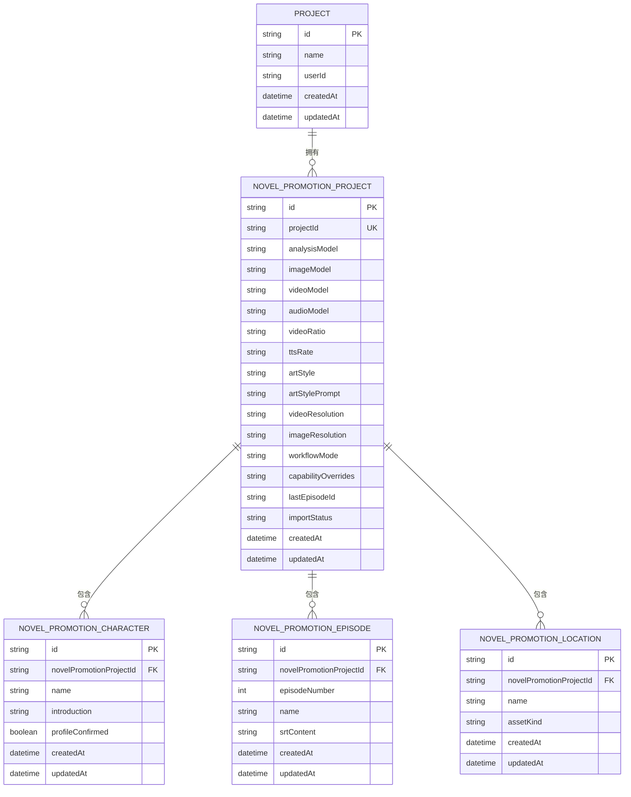
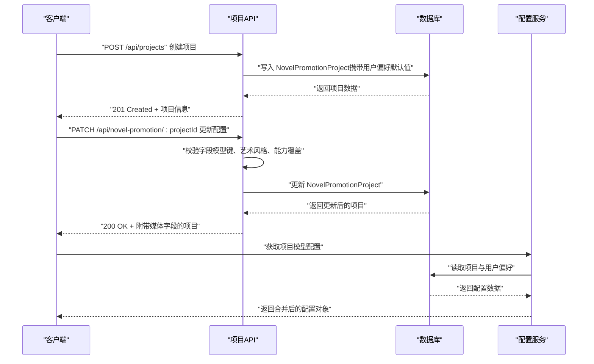
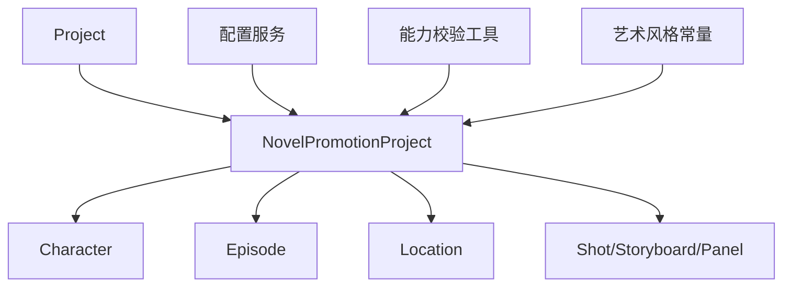

# NovelPromotionProject小说推广项目模型

<cite>
**本文档引用的文件**
- [prisma/schema.prisma](file://prisma/schema.prisma)
- [prisma/schema.sqlit.prisma](file://prisma/schema.sqlit.prisma)
- [src/lib/config-service.ts](file://src/lib/config-service.ts)
- [src/app/api/projects/route.ts](file://src/app/api/projects/route.ts)
- [src/app/api/novel-promotion/[projectId]/route.ts](file://src/app/api/novel-promotion/[projectId]/route.ts)
- [src/types/project.ts](file://src/types/project.ts)
- [src/lib/constants.ts](file://src/lib/constants.ts)
- [src/lib/model-capabilities/lookup.ts](file://src/lib/model-capabilities/lookup.ts)
- [src/lib/model-config-contract.ts](file://src/lib/model-config-contract.ts)
- [src/types/storyboard-types.ts](file://src/types/storyboard-types.ts)
</cite>

## 目录
1. [简介](#简介)
2. [项目结构](#项目结构)
3. [核心组件](#核心组件)
4. [架构总览](#架构总览)
5. [详细组件分析](#详细组件分析)
6. [依赖分析](#依赖分析)
7. [性能考虑](#性能考虑)
8. [故障排查指南](#故障排查指南)
9. [结论](#结论)
10. [附录](#附录)

## 简介
本文件系统性阐述 NovelPromotionProject 小说推广项目模型的设计理念与实现细节，聚焦其作为小说推广工作流核心实体的职责边界、字段语义与默认值、与 Project 及 Character/Episode/Location 等实体的复杂关联关系，以及配置管理机制（AI 模型选择、艺术风格设置、分辨率配置等）。同时提供实际使用场景与配置示例，帮助开发者正确使用该模型进行小说推广项目的管理。

## 项目结构
NovelPromotionProject 是小说推广模式的核心数据模型，位于 Prisma Schema 中，与 Project 保持一对一关系；并聚合了 Character、Episode、Location 等子实体，形成完整的工作流数据骨架。下图展示其在数据层的组织关系：

图表来源
- [prisma/schema.prisma:244-271](file://prisma/schema.prisma#L244-L271)
- [prisma/schema.prisma:353-367](file://prisma/schema.prisma#L353-L367)
- [prisma/schema.prisma:79-119](file://prisma/schema.prisma#L79-L119)
- [prisma/schema.prisma:121-146](file://prisma/schema.prisma#L121-L146)
- [prisma/schema.prisma:102-119](file://prisma/schema.prisma#L102-L119)

章节来源
- [prisma/schema.prisma:244-271](file://prisma/schema.prisma#L244-L271)
- [prisma/schema.prisma:353-367](file://prisma/schema.prisma#L353-L367)

## 核心组件
本节对 NovelPromotionProject 的关键字段进行逐项说明，包括字段含义、默认值与约束，以及与工作流的关系。

- 基础标识与时间戳
  - id：UUID 主键
  - projectId：唯一关联到 Project 的外键，删除策略为级联
  - createdAt/updatedAt：自动维护的时间戳

- AI 模型配置
  - analysisModel：分析模型（可空，但启用分析功能前需配置）
  - imageModel：图片生成模型
  - videoModel：视频生成模型
  - audioModel：语音合成模型
  - characterModel：角色图片模型
  - locationModel：场景图片模型
  - storyboardModel：分镜图片模型
  - editModel：修图/编辑模型

- 视频与音频参数
  - videoRatio：视频宽高比，默认“9:16”
  - ttsRate：TTS 语速，默认“+50%”
  - videoResolution：视频分辨率，默认“720p”
  - imageResolution：图片分辨率，默认“2K”

- 艺术风格与提示
  - artStyle：艺术风格枚举，默认“american-comic”
  - artStylePrompt：风格提示文本（按需实时查询，不强制存储）

- 工作流与状态
  - workflowMode：工作流模式，默认“srt”
  - capabilityOverrides：能力覆盖配置（JSON 字符串），用于精细化控制模型能力
  - lastEpisodeId：最后处理的剧集 ID
  - importStatus：导入状态标记

- 关联集合
  - characters：角色集合
  - episodes：剧集集合
  - locations：场景集合

章节来源
- [prisma/schema.prisma:244-271](file://prisma/schema.prisma#L244-L271)
- [prisma/schema.sqlit.prisma:238-265](file://prisma/schema.sqlit.prisma#L238-L265)
- [src/types/project.ts:240-287](file://src/types/project.ts#L240-L287)

## 架构总览
下图展示 NovelPromotionProject 在应用层的典型交互路径：项目创建时写入默认模型配置，更新接口支持增量校验与能力覆盖验证，运行时通过配置服务合并项目级与用户级配置。

图表来源
- [src/app/api/projects/route.ts:220-244](file://src/app/api/projects/route.ts#L220-L244)
- [src/app/api/novel-promotion/[projectId]/route.ts](file://src/app/api/novel-promotion/[projectId]/route.ts#L294-L329)
- [src/lib/config-service.ts:144-177](file://src/lib/config-service.ts#L144-L177)

## 详细组件分析

### 字段定义与默认值详解
- analysisModel
  - 作用：指定小说分析阶段使用的模型键
  - 默认值：无（必须显式配置）
  - 使用场景：启用“全局分析/章节分析”等流程前必须配置
- imageModel / videoModel / audioModel
  - 作用：分别指定图片、视频、语音生成所用模型键
  - 默认值：无（可空，但建议在工作流中明确）
- characterModel / locationModel / storyboardModel / editModel
  - 作用：针对角色、场景、分镜与修图任务的专用模型键
  - 默认值：无（可空）
- videoRatio
  - 作用：视频输出宽高比
  - 默认值：“9:16”
- ttsRate
  - 作用：TTS 语速调节
  - 默认值：“+50%”
- artStyle
  - 作用：统一的艺术风格枚举
  - 默认值：“american-comic”
  - 支持值：通过常量定义（如“american-comic”、“chinese-comic”、“japanese-anime”、“realistic”）
- artStylePrompt
  - 作用：风格提示词（按需实时查询，不强制存储）
- videoResolution / imageResolution
  - 作用：视频与图片分辨率
  - 默认值：videoResolution=“720p”，imageResolution=“2K”
- workflowMode
  - 作用：工作流模式（如“srt”）
  - 默认值：“srt”
- capabilityOverrides
  - 作用：能力覆盖配置（JSON 字符串），用于限制或调整模型能力选项
  - 默认值：无（可空）
- lastEpisodeId / importStatus
  - 作用：工作流进度与导入状态跟踪
  - 默认值：无（可空）

章节来源
- [prisma/schema.prisma:244-271](file://prisma/schema.prisma#L244-L271)
- [prisma/schema.sqlit.prisma:238-265](file://prisma/schema.sqlit.prisma#L238-L265)
- [src/lib/constants.ts:137-189](file://src/lib/constants.ts#L137-L189)
- [src/types/project.ts:240-287](file://src/types/project.ts#L240-L287)

### 与 Project 的关联关系
- 一对一关系：每个 Project 可能包含一个 NovelPromotionProject
- 删除策略：当 Project 被删除时，对应的 NovelPromotionProject 会级联删除
- 创建流程：项目创建时，NovelPromotionProject 会以用户偏好中的模型配置作为默认值进行初始化

章节来源
- [prisma/schema.prisma:353-367](file://prisma/schema.prisma#L353-L367)
- [prisma/schema.prisma:273-273](file://prisma/schema.prisma#L273-L273)
- [src/app/api/projects/route.ts:220-244](file://src/app/api/projects/route.ts#L220-L244)

### 与 Character/Episode/Location 的复杂关联设计
- Character
  - 关系：一对多（Project → Characters）
  - 关键点：支持角色档案确认、自定义音色媒体关联、外观历史等
- Episode
  - 关系：一对多（Project → Episodes）
  - 关键点：支持 SRT 字幕内容、语音行、剪辑、分镜等
- Location
  - 关系：一对多（Project → Locations）
  - 关键点：支持资产类型（location/prop）、选中图片、可用槽位等
- Shot/Storyboard/Panel
  - 关系：多层嵌套（Episode → Clip → Shot/Storyboard → Panel）
  - 关键点：支持分镜面板候选图、图像历史、摄影计划等

章节来源
- [prisma/schema.prisma:79-119](file://prisma/schema.prisma#L79-L119)
- [prisma/schema.prisma:121-146](file://prisma/schema.prisma#L121-L146)
- [prisma/schema.prisma:102-119](file://prisma/schema.prisma#L102-L119)
- [prisma/schema.prisma:276-351](file://prisma/schema.prisma#L276-L351)
- [src/types/storyboard-types.ts:1-49](file://src/types/storyboard-types.ts#L1-L49)

### 配置管理机制
- 项目级配置获取
  - 逻辑：优先读取项目配置，其次回退到用户偏好配置
  - 返回：包含各模型键、视频/图片分辨率、艺术风格、能力默认值与覆盖等
- 用户级配置回退
  - 逻辑：当项目未配置某项时，使用用户偏好中的默认值
- 能力覆盖校验
  - 逻辑：对 capabilityOverrides 进行规范化、清理与合法性校验，确保仅允许模型支持的能力字段与取值
- 艺术风格校验
  - 逻辑：仅接受预定义的风格枚举值，否则视为无效

章节来源
- [src/lib/config-service.ts:144-177](file://src/lib/config-service.ts#L144-L177)
- [src/app/api/novel-promotion/[projectId]/route.ts](file://src/app/api/novel-promotion/[projectId]/route.ts#L294-L329)
- [src/lib/model-capabilities/lookup.ts:106-170](file://src/lib/model-capabilities/lookup.ts#L106-L170)
- [src/lib/model-config-contract.ts:209-244](file://src/lib/model-config-contract.ts#L209-L244)
- [src/lib/constants.ts:137-189](file://src/lib/constants.ts#L137-L189)

### 实际使用场景与配置示例
- 场景一：新建项目并初始化模型配置
  - 步骤：调用项目创建接口，系统将用户偏好中的模型键与参数写入 NovelPromotionProject
  - 关键字段：analysisModel、imageModel、videoModel、audioModel、videoRatio、artStyle、ttsRate
- 场景二：更新项目配置
  - 步骤：PATCH 请求仅允许更新受控字段，系统执行模型键校验、艺术风格校验与能力覆盖校验
  - 关键字段：analysisModel、characterModel、locationModel、storyboardModel、editModel、videoModel、audioModel、videoRatio、artStyle、ttsRate、capabilityOverrides
- 场景三：运行时读取合并配置
  - 步骤：通过配置服务读取项目与用户偏好，得到最终生效的模型配置
  - 关键字段：analysisModel、characterModel、locationModel、storyboardModel、editModel、videoModel、audioModel、videoRatio、artStyle、capabilityDefaults、capabilityOverrides

章节来源
- [src/app/api/projects/route.ts:220-244](file://src/app/api/projects/route.ts#L220-L244)
- [src/app/api/novel-promotion/[projectId]/route.ts](file://src/app/api/novel-promotion/[projectId]/route.ts#L294-L329)
- [src/lib/config-service.ts:144-177](file://src/lib/config-service.ts#L144-L177)

## 依赖分析
- 组件耦合
  - NovelPromotionProject 与 Project 强耦合（一对一），通过外键关联
  - 与 Character/Episode/Location 形成一对多聚合关系，支撑完整工作流
- 外部依赖
  - 艺术风格依赖常量定义与实时查询函数
  - 能力覆盖依赖模型能力目录与校验工具
- 循环依赖
  - 未发现直接循环依赖；类型定义通过 TypeScript 接口与 Prisma 模型解耦

图表来源
- [prisma/schema.prisma:353-367](file://prisma/schema.prisma#L353-L367)
- [prisma/schema.prisma:244-271](file://prisma/schema.prisma#L244-L271)
- [src/lib/config-service.ts:144-177](file://src/lib/config-service.ts#L144-L177)
- [src/lib/model-capabilities/lookup.ts:106-170](file://src/lib/model-capabilities/lookup.ts#L106-L170)
- [src/lib/constants.ts:137-189](file://src/lib/constants.ts#L137-L189)

## 性能考虑
- 配置读取合并
  - 并发读取项目与用户偏好，避免重复查询
  - 合理缓存 artStylePrompt 与能力覆盖结果，减少重复计算
- 字段更新
  - 仅允许受控字段更新，降低不必要的数据库写入
  - 能力覆盖校验前置化，尽早失败，减少无效任务提交
- 关系查询
  - 使用索引字段（如 novelPromotionProjectId、episodeId 等）优化关联查询
  - 分页加载大型集合（如角色/场景/分镜面板）以控制内存占用

## 故障排查指南
- 分析模型未配置
  - 现象：无法启动“全局分析/章节分析”流程
  - 处理：在项目配置中设置 analysisModel
- 艺术风格无效
  - 现象：PATCH 返回艺术风格校验错误
  - 处理：使用预定义枚举值（如 “american-comic”、“chinese-comic”、“japanese-anime”、“realistic”）
- 能力覆盖不合法
  - 现象：PATCH 返回能力覆盖校验错误
  - 处理：仅填写模型支持的能力字段与允许值，参考模型能力目录
- 视频/图片分辨率不匹配
  - 现象：生成任务报错或输出不符合预期
  - 处理：根据目标平台与设备选择合适分辨率（videoResolution/imageResolution）

章节来源
- [src/app/api/novel-promotion/[projectId]/route.ts](file://src/app/api/novel-promotion/[projectId]/route.ts#L294-L329)
- [src/lib/model-capabilities/lookup.ts:106-170](file://src/lib/model-capabilities/lookup.ts#L106-L170)
- [src/lib/constants.ts:137-189](file://src/lib/constants.ts#L137-L189)

## 结论
NovelPromotionProject 作为小说推广工作流的核心实体，通过严谨的字段设计与完善的配置管理机制，实现了从项目创建、模型配置、能力覆盖到工作流执行的闭环。其与 Project、Character、Episode、Location 等实体的清晰关联，确保了数据一致性与扩展性。开发者在使用时应重点关注模型键的有效性、艺术风格的合法性与能力覆盖的合规性，以获得稳定可靠的工作流体验。

## 附录
- 预定义艺术风格
  - american-comic：漫画风
  - chinese-comic：精致国漫
  - japanese-anime：日系动漫风
  - realistic：真人风格
- 受控更新字段清单
  - analysisModel、characterModel、locationModel、storyboardModel、editModel、videoModel、audioModel、videoRatio、artStyle、ttsRate、capabilityOverrides

章节来源
- [src/lib/constants.ts:137-189](file://src/lib/constants.ts#L137-L189)
- [src/app/api/novel-promotion/[projectId]/route.ts](file://src/app/api/novel-promotion/[projectId]/route.ts#L294-L329)