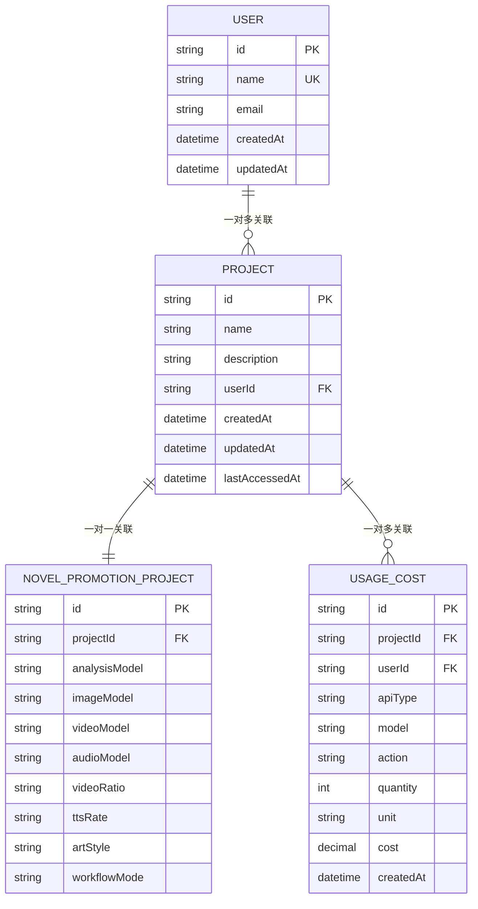
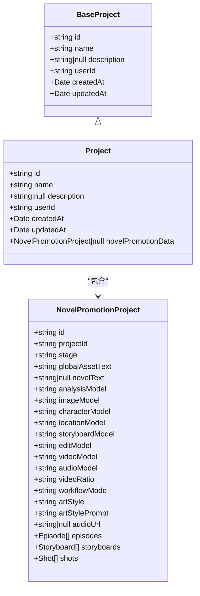
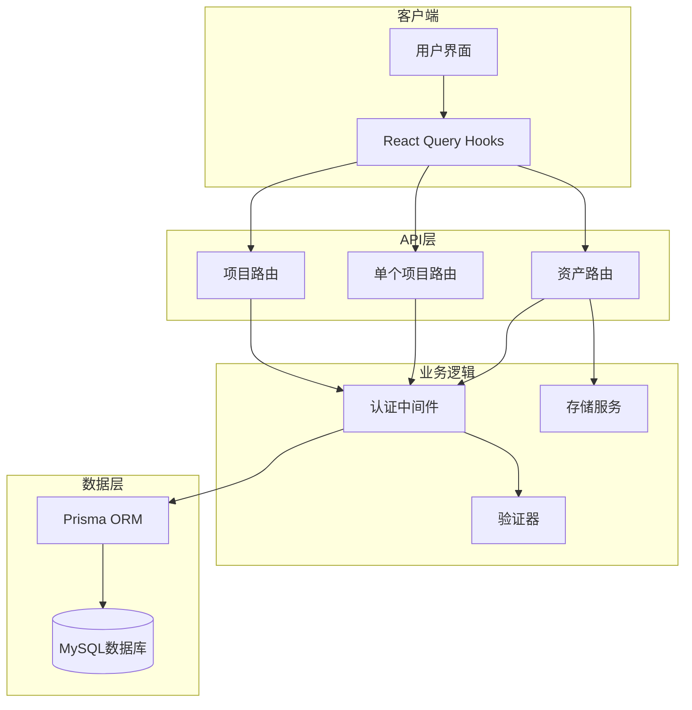
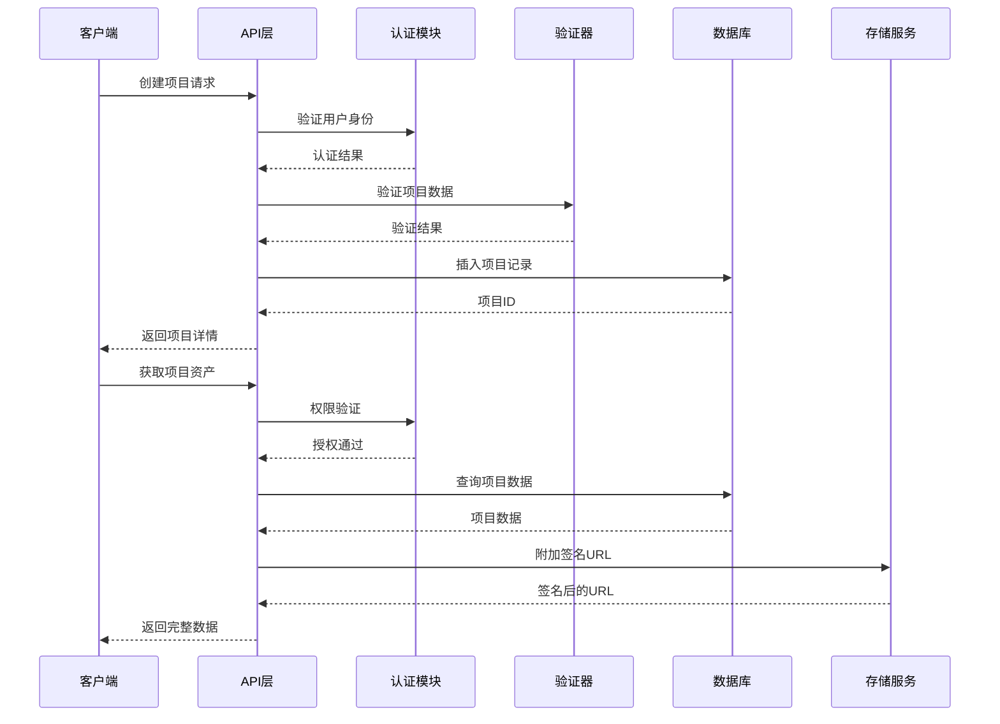
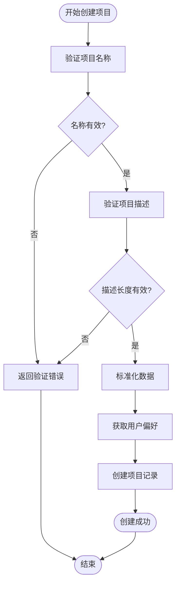
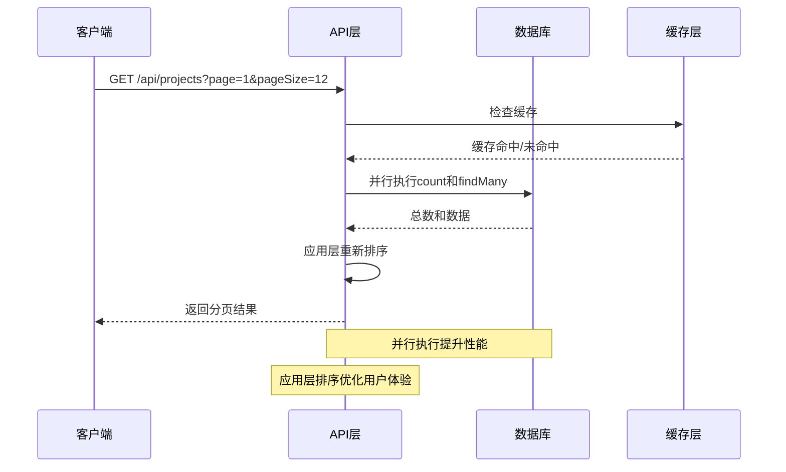
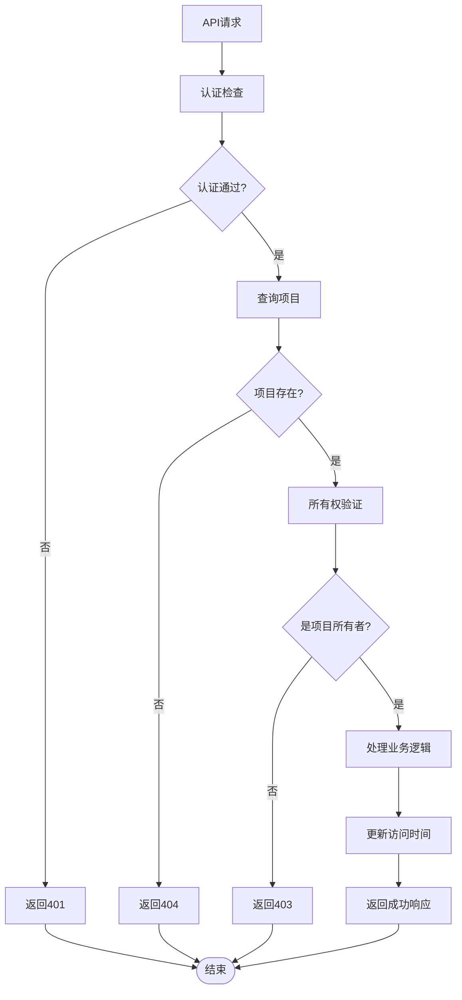
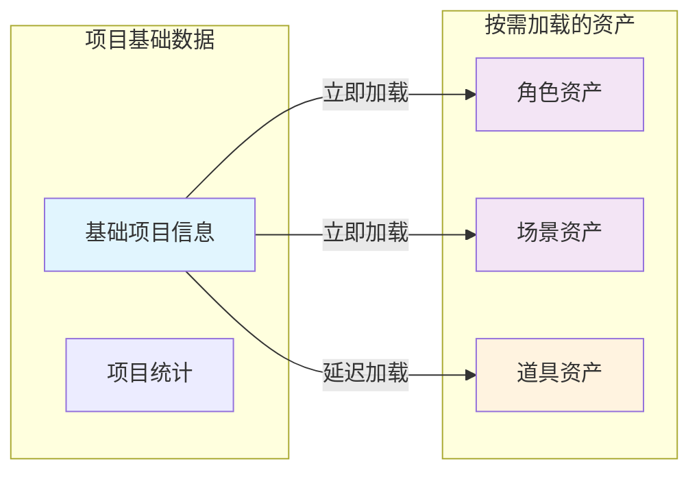
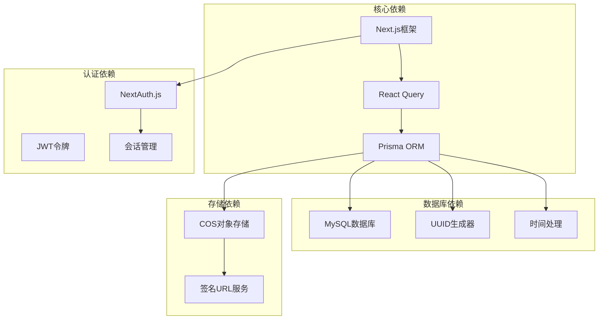
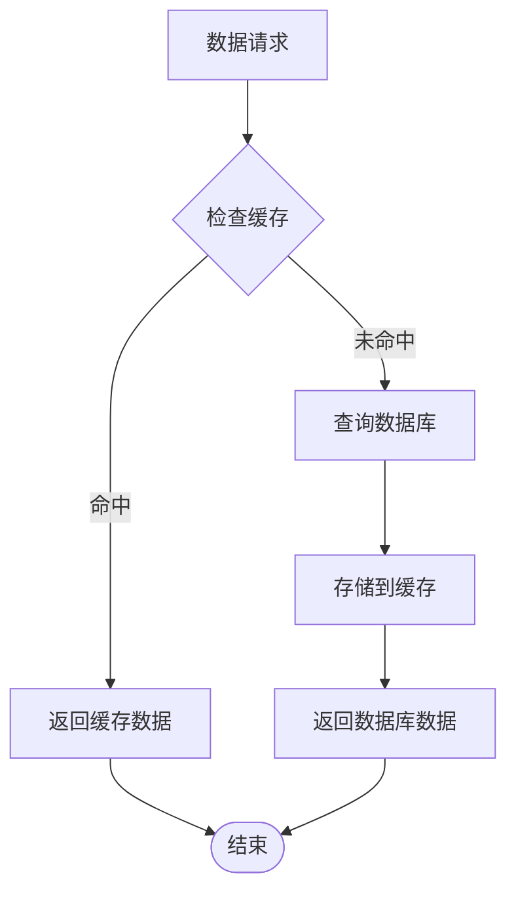

# Project项目模型

<cite>
**本文档引用的文件**
- [schema.prisma](file://prisma/schema.prisma)
- [project.ts](file://src/types/project.ts)
- [route.ts](file://src/app/api/projects/route.ts)
- [route.ts](file://src/app/api/projects/[projectId]/route.ts)
- [route.ts](file://src/app/api/projects/[projectId]/assets/route.ts)
- [validation.ts](file://src/lib/projects/validation.ts)
- [default-name.ts](file://src/lib/projects/default-name.ts)
- [useProjectData.ts](file://src/lib/query/hooks/useProjectData.ts)
- [validation.test.ts](file://tests/unit/projects/validation.test.ts)
- [default-name.test.ts](file://tests/unit/projects/default-name.test.ts)
</cite>

## 目录
1. [简介](#简介)
2. [项目结构](#项目结构)
3. [核心组件](#核心组件)
4. [架构概览](#架构概览)
5. [详细组件分析](#详细组件分析)
6. [依赖分析](#依赖分析)
7. [性能考虑](#性能考虑)
8. [故障排除指南](#故障排除指南)
9. [结论](#结论)

## 简介

Project项目模型是Waoowaoo系统的核心业务实体，负责管理用户创建的创作项目。该模型不仅承载着项目的基础信息，还作为小说推广模式（Novel Promotion）的容器，为用户提供完整的创作工作流。

在系统架构中，Project模型扮演着多重关键角色：
- **项目生命周期管理者**：从创建、维护到删除的完整生命周期
- **权限控制中心**：确保用户只能访问自己的项目资源
- **数据聚合枢纽**：整合用户偏好配置和使用成本信息
- **工作流入口点**：作为各种创作模式的起点

## 项目结构

### 数据库模型设计



**图表来源**
- [schema.prisma:353-367](file://prisma/schema.prisma#L353-L367)
- [schema.prisma:244-274](file://prisma/schema.prisma#L244-L274)

### TypeScript类型定义

项目模型在TypeScript层面提供了完整的类型安全保证：



**图表来源**
- [project.ts:7-14](file://src/types/project.ts#L7-L14)
- [project.ts:285-287](file://src/types/project.ts#L285-L287)
- [project.ts:240-280](file://src/types/project.ts#L240-L280)

**章节来源**
- [schema.prisma:353-367](file://prisma/schema.prisma#L353-L367)
- [project.ts:7-14](file://src/types/project.ts#L7-L14)
- [project.ts:285-287](file://src/types/project.ts#L285-L287)

## 核心组件

### 字段定义详解

| 字段名 | 数据类型 | 约束条件 | 业务含义 | 默认值 |
|--------|----------|----------|----------|--------|
| id | String | 主键，UUID | 项目唯一标识符 | 自动生成 |
| name | String | 必填，最大100字符 | 项目名称 | 无 |
| description | String | 可空，最大500字符 | 项目描述 | null |
| userId | String | 外键，必填 | 创建者用户ID | 无 |
| createdAt | DateTime | 自动设置 | 创建时间 | 当前时间 |
| updatedAt | DateTime | 自动更新 | 最后修改时间 | 当前时间 |
| lastAccessedAt | DateTime | 可空 | 最后访问时间 | null |

### 关系映射

#### 与User的一对多关系
- **外键约束**：`userId` 引用 `User.id`
- **级联删除**：用户删除时项目级联删除
- **权限控制**：确保数据隔离和安全性

#### 与NovelPromotionProject的一对一关系
- **唯一性约束**：每个项目只能有一个对应的推广项目
- **级联删除**：项目删除时推广项目级联删除
- **数据完整性**：保证项目与其创作模式数据的绑定

**章节来源**
- [schema.prisma:353-367](file://prisma/schema.prisma#L353-L367)
- [schema.prisma:244-274](file://prisma/schema.prisma#L244-L274)

## 架构概览

### API路由架构



**图表来源**
- [route.ts:1-218](file://src/app/api/projects/route.ts#L1-L218)
- [route.ts:1-263](file://src/app/api/projects/[projectId]/route.ts#L1-L263)
- [route.ts:1-70](file://src/app/api/projects/[projectId]/assets/route.ts#L1-L70)

### 数据流处理



**图表来源**
- [route.ts:184-218](file://src/app/api/projects/route.ts#L184-L218)
- [route.ts:15-70](file://src/app/api/projects/[projectId]/assets/route.ts#L15-L70)

**章节来源**
- [route.ts:1-218](file://src/app/api/projects/route.ts#L1-L218)
- [route.ts:1-263](file://src/app/api/projects/[projectId]/route.ts#L1-L263)

## 详细组件分析

### 项目创建流程

#### 数据验证机制



**图表来源**
- [validation.ts:40-67](file://src/lib/projects/validation.ts#L40-L67)
- [route.ts:184-218](file://src/app/api/projects/route.ts#L184-L218)

#### 默认名称生成

系统提供了智能的默认项目名称生成功能：

| 时间格式 | 示例 | 用途 |
|----------|------|------|
| MM-DD HH:MM | 03-29 18:56 | 生成简洁的日期时间戳 |
| 月份 | 03 | 两位数字表示 |
| 日期 | 29 | 两位数字表示 |
| 小时 | 18 | 24小时制 |
| 分钟 | 56 | 两位数字表示 |

**章节来源**
- [validation.ts:1-83](file://src/lib/projects/validation.ts#L1-L83)
- [default-name.ts:1-12](file://src/lib/projects/default-name.ts#L1-L12)
- [default-name.test.ts:1-9](file://tests/unit/projects/default-name.test.ts#L1-L9)

### 项目查询与权限控制

#### 分页查询优化

系统实现了高效的分页查询机制：



**图表来源**
- [route.ts:27-82](file://src/app/api/projects/route.ts#L27-L82)

#### 权限验证流程



**图表来源**
- [route.ts:14-52](file://src/app/api/projects/[projectId]/route.ts#L14-L52)

**章节来源**
- [route.ts:27-82](file://src/app/api/projects/route.ts#L27-L82)
- [route.ts:14-52](file://src/app/api/projects/[projectId]/route.ts#L14-L52)

### 项目资产管理

#### 延迟加载策略

系统采用延迟加载机制来优化性能：



**图表来源**
- [route.ts:11-70](file://src/app/api/projects/[projectId]/assets/route.ts#L11-L70)

#### 存储集成

项目资产与云存储系统的深度集成：

| 资产类型 | 存储位置 | 访问控制 | 安全措施 |
|----------|----------|----------|----------|
| 角色图片 | COS存储 | 签名URL | 临时访问令牌 |
| 场景图片 | COS存储 | 签名URL | 临时访问令牌 |
| 音频文件 | COS存储 | 签名URL | 临时访问令牌 |
| 视频文件 | COS存储 | 签名URL | 临时访问令牌 |

**章节来源**
- [route.ts:1-70](file://src/app/api/projects/[projectId]/assets/route.ts#L1-L70)

### 使用示例

#### 创建项目

```typescript
// 基本项目创建
const project = await prisma.project.create({
  data: {
    name: "我的小说项目",
    description: "这是一个测试项目",
    userId: currentUser.id
  }
});

// 使用API创建项目
const response = await fetch('/api/projects', {
  method: 'POST',
  headers: { 'Content-Type': 'application/json' },
  body: JSON.stringify({
    name: "新项目",
    description: "项目描述"
  })
});
```

#### 查询项目

```typescript
// 获取用户所有项目
const projects = await prisma.project.findMany({
  where: { userId: currentUserId },
  orderBy: { updatedAt: 'desc' },
  take: 12
});

// 获取单个项目详情
const project = await prisma.project.findUnique({
  where: { id: projectId },
  include: { user: true }
});
```

#### 更新项目

```typescript
// 更新项目信息
const updatedProject = await prisma.project.update({
  where: { id: projectId },
  data: {
    name: "更新后的名称",
    description: "更新后的描述"
  }
});
```

**章节来源**
- [route.ts:184-218](file://src/app/api/projects/route.ts#L184-L218)
- [route.ts:54-95](file://src/app/api/projects/[projectId]/route.ts#L54-L95)

## 依赖分析

### 外部依赖关系



### 内部模块依赖

| 模块 | 依赖模块 | 用途 |
|------|----------|------|
| project.ts | types/ | 类型定义 |
| validation.ts | i18n/ | 国际化支持 |
| route.ts | lib/api-errors | 错误处理 |
| route.ts | lib/api-auth | 权限验证 |
| useProjectData.ts | lib/query/keys | 查询缓存 |

**章节来源**
- [schema.prisma:1-10](file://prisma/schema.prisma#L1-L10)
- [project.ts:1-3](file://src/types/project.ts#L1-L3)

## 性能考虑

### 查询优化策略

1. **并行查询执行**
   - 使用 `Promise.all` 同时执行计数和数据查询
   - 减少数据库往返次数

2. **应用层排序**
   - 先按更新时间排序获取所有匹配项目
   - 在应用层进行二次排序优化用户体验

3. **延迟加载**
   - 项目资产按需加载
   - 避免一次性加载大量数据

### 缓存策略



### 存储优化

1. **签名URL缓存**
   - 临时访问令牌减少鉴权开销
   - CDN加速静态资源访问

2. **批量操作**
   - 删除项目时批量清理存储文件
   - 减少API调用次数

## 故障排除指南

### 常见问题及解决方案

#### 项目创建失败

**问题症状**：创建项目时报错，返回400状态码

**可能原因**：
1. 项目名称为空或超长
2. 项目描述超长
3. 用户未登录
4. 数据库连接异常

**解决步骤**：
1. 检查项目名称长度（≤100字符）
2. 检查项目描述长度（≤500字符）
3. 确认用户已登录
4. 查看服务器日志

#### 权限访问被拒绝

**问题症状**：访问项目返回403状态码

**可能原因**：
1. 用户不是项目所有者
2. 项目不存在
3. 会话过期

**解决步骤**：
1. 确认用户身份验证
2. 检查项目ID是否正确
3. 重新登录系统

#### 性能问题

**问题症状**：项目列表加载缓慢

**优化建议**：
1. 检查网络连接
2. 清理浏览器缓存
3. 减少同时发起的请求
4. 使用分页功能

**章节来源**
- [validation.test.ts:1-29](file://tests/unit/projects/validation.test.ts#L1-L29)
- [default-name.test.ts:1-9](file://tests/unit/projects/default-name.test.ts#L1-L9)

## 结论

Project项目模型作为Waoowaoo系统的核心实体，通过精心设计的数据库结构、完善的TypeScript类型系统和健壮的API架构，为用户提供了完整的项目管理体验。

### 设计优势

1. **类型安全**：完整的TypeScript类型定义确保编译时类型检查
2. **权限控制**：严格的用户权限验证保障数据安全
3. **性能优化**：并行查询、延迟加载等策略提升用户体验
4. **扩展性强**：清晰的架构设计便于功能扩展

### 最佳实践建议

1. **数据验证**：始终在创建和更新项目时进行数据验证
2. **权限检查**：在处理任何项目相关操作前进行权限验证
3. **错误处理**：完善错误处理机制，提供友好的错误提示
4. **性能监控**：定期监控查询性能，及时发现和解决性能瓶颈

通过遵循这些实践，可以确保Project项目模型在生产环境中稳定可靠地运行，为用户提供优质的创作体验。