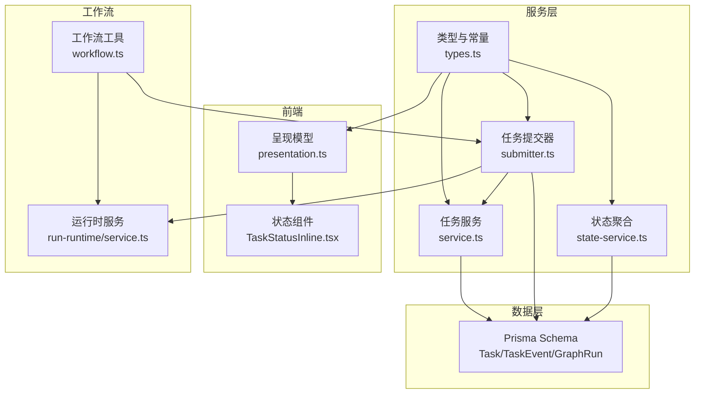
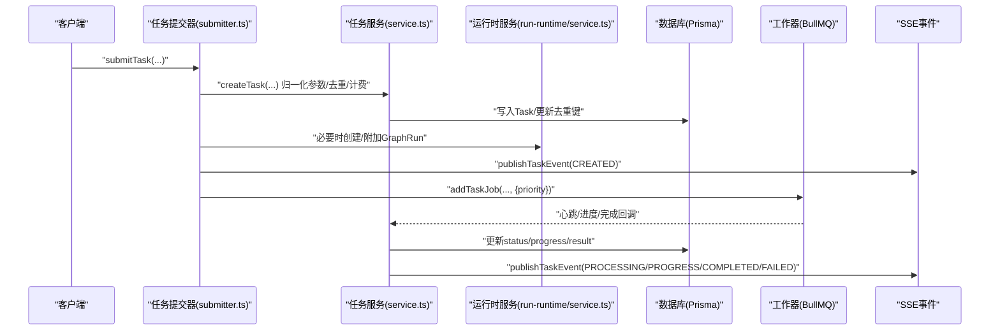
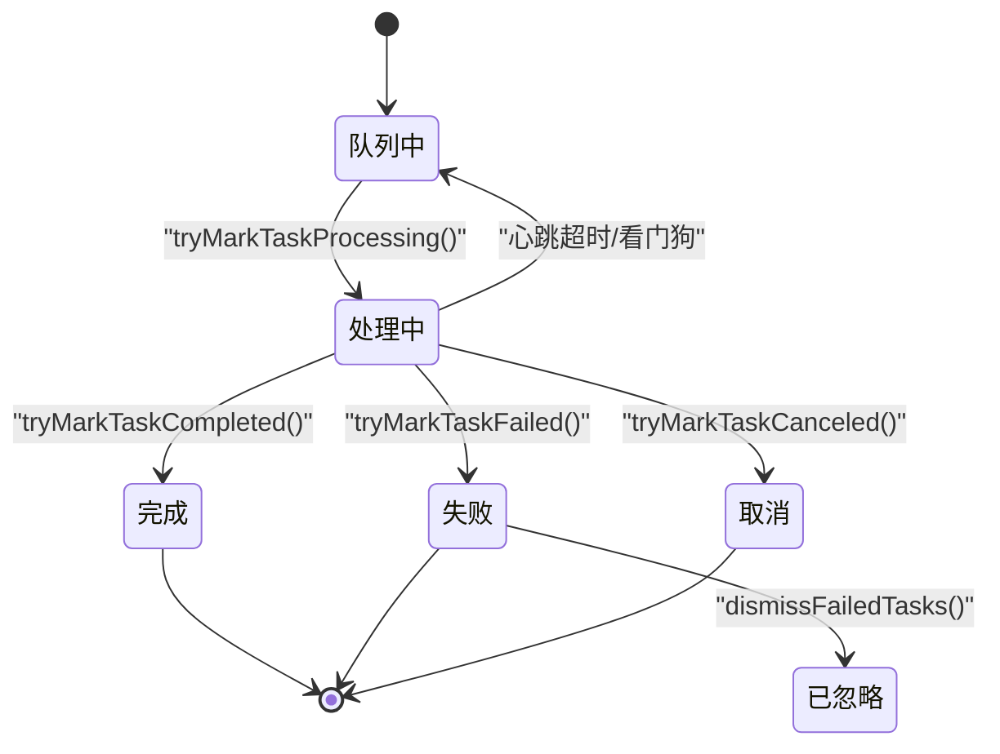
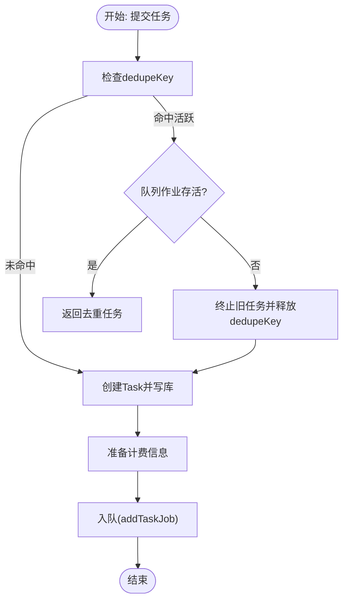
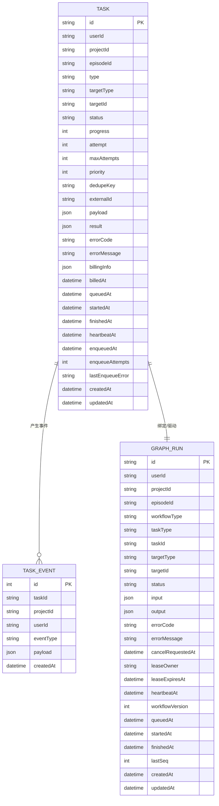
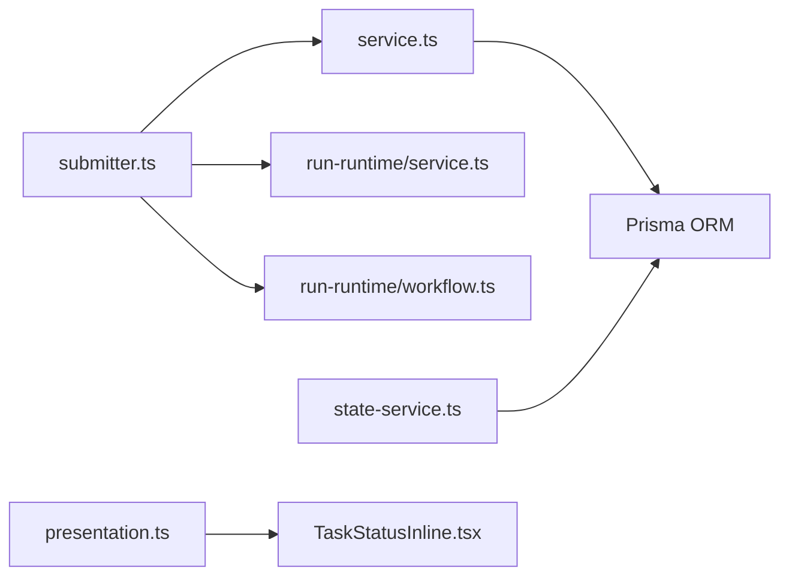

# Task任务模型

<cite>
**本文引用的文件**
- [schema.prisma](file://prisma/schema.prisma)
- [schema.sqlit.prisma](file://prisma/schema.sqlit.prisma)
- [types.ts](file://src/lib/task/types.ts)
- [service.ts](file://src/lib/task/service.ts)
- [submitter.ts](file://src/lib/task/submitter.ts)
- [state-service.ts](file://src/lib/task/state-service.ts)
- [presentation.ts](file://src/lib/task/presentation.ts)
- [TaskStatusInline.tsx](file://src/components/task/TaskStatusInline.tsx)
- [workflow.ts](file://src/lib/run-runtime/workflow.ts)
- [service.ts（运行时）](file://src/lib/run-runtime/service.ts)
- [create-task-dedupe.integration.test.ts](file://tests/integration/task/create-task-dedupe.integration.test.ts)
</cite>

## 目录
1. [简介](#简介)
2. [项目结构](#项目结构)
3. [核心组件](#核心组件)
4. [架构总览](#架构总览)
5. [详细组件分析](#详细组件分析)
6. [依赖分析](#依赖分析)
7. [性能考量](#性能考量)
8. [故障排查指南](#故障排查指南)
9. [结论](#结论)
10. [附录](#附录)

## 简介
本文件系统性梳理Waoowaoo中Task任务模型的设计理念与实现细节，重点覆盖以下方面：
- Task实体在异步任务处理系统中的核心地位与职责边界
- 所有字段的业务含义与约束（id、userId、projectId、episodeId、type、targetType、targetId、status、progress、attempt、maxAttempts、priority等）
- 状态管理机制（queued、processing、completed、failed、canceled、dismissed）及其转换逻辑
- 高级特性：优先级调度、重试与补偿、去重键（dedupeKey）、心跳与看门狗、事件发布与SSE推送
- 与GraphRun、TaskEvent等实体的关联关系及在工作流引擎中的作用
- 实战示例与最佳实践：任务创建、监控、故障处理

## 项目结构
围绕Task任务模型的关键代码分布在如下模块：
- 数据模型与索引：Prisma Schema
- 类型与常量：src/lib/task/types.ts
- 服务层：src/lib/task/service.ts（任务生命周期、状态变更、去重与孤儿恢复、看门狗）
- 提交器：src/lib/task/submitter.ts（提交任务、生成/校验计费信息、发布事件、入队）
- 状态聚合：src/lib/task/state-service.ts（目标维度的任务状态聚合）
- 前端展示：src/components/task/TaskStatusInline.tsx、src/lib/task/presentation.ts
- 工作流集成：src/lib/run-runtime/workflow.ts、src/lib/run-runtime/service.ts
- 测试：tests/integration/task/create-task-dedupe.integration.test.ts

图表来源
- [schema.prisma:587-628](file://prisma/schema.prisma#L587-L628)
- [types.ts:1-159](file://src/lib/task/types.ts#L1-L159)
- [service.ts:1-637](file://src/lib/task/service.ts#L1-L637)
- [submitter.ts:1-411](file://src/lib/task/submitter.ts#L1-L411)
- [state-service.ts:1-288](file://src/lib/task/state-service.ts#L1-L288)
- [presentation.ts:1-66](file://src/lib/task/presentation.ts#L1-L66)
- [TaskStatusInline.tsx:1-31](file://src/components/task/TaskStatusInline.tsx#L1-L31)
- [workflow.ts:1-13](file://src/lib/run-runtime/workflow.ts#L1-L13)
- [service.ts（运行时）:676-708](file://src/lib/run-runtime/service.ts#L676-L708)

章节来源
- [schema.prisma:587-628](file://prisma/schema.prisma#L587-L628)
- [types.ts:1-159](file://src/lib/task/types.ts#L1-L159)

## 核心组件
- Task实体：承载单个异步任务的完整生命周期数据与元信息，支持去重、计费、进度、重试与心跳监控
- TaskEvent：记录任务生命周期事件（created/processing/progress/completed/failed），用于审计与SSE推送
- GraphRun：工作流运行实例，可与Task建立一对一绑定，形成“任务驱动的工作流”模式
- 提交器（Submitter）：统一入口，负责参数归一化、计费准备、去重策略、事件发布、入队与错误补偿
- 状态聚合（State Service）：按target聚合多个任务，输出目标维度的运行态摘要（phase、intent、progress等）

章节来源
- [schema.prisma:587-646](file://prisma/schema.prisma#L587-L646)
- [service.ts:164-294](file://src/lib/task/service.ts#L164-L294)
- [submitter.ts:110-410](file://src/lib/task/submitter.ts#L110-L410)
- [state-service.ts:106-185](file://src/lib/task/state-service.ts#L106-L185)

## 架构总览
下图展示了从提交到执行、再到事件发布与工作流绑定的整体流程。

图表来源
- [submitter.ts:110-410](file://src/lib/task/submitter.ts#L110-L410)
- [service.ts:164-294](file://src/lib/task/service.ts#L164-L294)
- [service.ts（运行时）:676-708](file://src/lib/run-runtime/service.ts#L676-L708)

## 详细组件分析

### Task实体字段定义与业务含义
- id：任务唯一标识（UUID）
- userId：任务归属用户
- projectId：项目上下文
- episodeId：剧集上下文（可空）
- type：任务类型（枚举，涵盖图像/视频/语音/文本等任务族）
- targetType/targetId：目标任务域与目标对象标识，用于去重与状态聚合
- status：任务状态（默认queued）
- progress：0~100的进度百分比
- attempt/maxAttempts：当前尝试次数与最大尝试次数
- priority：优先级（数字越大越先执行）
- dedupeKey：去重键（唯一索引），用于幂等提交
- externalId：外部系统任务ID（如第三方流水号）
- payload/result：任务输入/输出载荷（JSON）
- errorCode/errorMessage：错误码与错误信息
- billingInfo/billedAt：计费相关信息与计费时间
- 时间戳：queuedAt/startedAt/finishedAt/heartbeatAt/enqueuedAt/lastEnqueueError/enqueueAttempts/createdAt/updatedAt

章节来源
- [schema.prisma:587-628](file://prisma/schema.prisma#L587-L628)
- [schema.sqlit.prisma:574-615](file://prisma/schema.sqlit.prisma#L574-L615)

### 状态管理机制
- 状态集合：queued、processing、completed、failed、canceled、dismissed
- 转换规则要点：
  - queued → processing：仅对活跃任务进行原子更新，设置startedAt、heartbeatAt、attempt++
  - processing → completed：设置progress=100、finishedAt、heartbeatAt=null
  - processing → failed/canceled：记录errorCode/errorMessage、finishedAt、heartbeatAt=null
  - dismissed：仅允许用户主动将failed任务标记为已忽略
- 心跳与看门狗：通过heartbeatAt或startedAt+阈值检测“僵尸任务”，批量标记为失败并触发计费回滚
- 去重与孤儿恢复：当dedupeKey命中且队列作业存活则返回去重；否则终止旧任务并释放dedupeKey后创建新任务

图表来源
- [service.ts:393-504](file://src/lib/task/service.ts#L393-L504)
- [service.ts:543-621](file://src/lib/task/service.ts#L543-L621)

章节来源
- [types.ts:3-12](file://src/lib/task/types.ts#L3-L12)
- [service.ts:393-504](file://src/lib/task/service.ts#L393-L504)
- [service.ts:543-621](file://src/lib/task/service.ts#L543-L621)

### 优先级调度、重试机制与去重键
- 优先级：提交时传入priority，入队时作为BullMQ优先级使用
- 重试：maxAttempts控制最大尝试次数；attempt自增；enqueueAttempts记录入队失败次数
- 去重键：dedupeKey唯一索引；命中时：
  - 若旧任务仍活跃且队列作业存活：直接返回去重
  - 若旧任务活跃但队列作业缺失：终止旧任务并释放dedupeKey，创建新任务
  - 若旧任务非活跃：释放dedupeKey后创建新任务
- 计费补偿：失败/取消/看门狗超时会根据billingInfo进行回滚或冻结处理

图表来源
- [service.ts:164-294](file://src/lib/task/service.ts#L164-L294)
- [submitter.ts:172-184](file://src/lib/task/submitter.ts#L172-L184)
- [create-task-dedupe.integration.test.ts:21-106](file://tests/integration/task/create-task-dedupe.integration.test.ts#L21-L106)

章节来源
- [service.ts:164-294](file://src/lib/task/service.ts#L164-L294)
- [submitter.ts:172-184](file://src/lib/task/submitter.ts#L172-L184)
- [create-task-dedupe.integration.test.ts:21-106](file://tests/integration/task/create-task-dedupe.integration.test.ts#L21-L106)

### 任务与GraphRun、TaskEvent的关联
- GraphRun：AI类任务通常会创建或复用一个GraphRun，并将Task与之绑定（runId/taskId），形成“任务即步骤”的工作流语义
- TaskEvent：提交器在任务创建后发布CREATED事件；处理中/进度/完成/失败时分别发布对应事件，供SSE订阅与前端渲染
- 前端呈现：presentation.ts将phase/intent/resource等映射为UI状态；TaskStatusInline.tsx在运行态显示加载图标与文案

图表来源
- [schema.prisma:587-646](file://prisma/schema.prisma#L587-L646)
- [service.ts（运行时）:676-708](file://src/lib/run-runtime/service.ts#L676-L708)

章节来源
- [schema.prisma:587-646](file://prisma/schema.prisma#L587-L646)
- [submitter.ts:146-223](file://src/lib/task/submitter.ts#L146-L223)
- [service.ts（运行时）:676-708](file://src/lib/run-runtime/service.ts#L676-L708)

### 前端呈现与交互
- presentation.ts：将phase/intent/resource/hasOutput映射为UI状态（运行中/失败/完成），决定是否覆盖层、占位符或无展示
- TaskStatusInline.tsx：在运行态显示旋转指示器与国际化文案，失败态以警示色显示

章节来源
- [presentation.ts:18-65](file://src/lib/task/presentation.ts#L18-L65)
- [TaskStatusInline.tsx:12-30](file://src/components/task/TaskStatusInline.tsx#L12-L30)

### 工作流引擎中的作用
- isAiTaskType：识别AI类任务类型，决定是否创建/复用GraphRun
- workflowTypeFromTaskType：将任务类型映射为工作流类型
- createRun/attachTaskToRun：在首次提交AI任务或复用活跃运行时，自动创建GraphRun并将Task绑定

章节来源
- [workflow.ts:1-13](file://src/lib/run-runtime/workflow.ts#L1-L13)
- [submitter.ts:146-223](file://src/lib/task/submitter.ts#L146-L223)
- [service.ts（运行时）:676-708](file://src/lib/run-runtime/service.ts#L676-L708)

## 依赖分析
- 低耦合高内聚：Submitter集中处理提交前逻辑（去重、计费、事件、入队），Service专注任务状态与DB交互，State Service聚焦聚合查询
- 外部依赖：Redis/BullMQ（队列与作业存活校验）、计费服务（冻结/回滚）、Prisma（ORM）
- 循环依赖：未见直接循环；各模块通过函数调用与类型接口解耦

图表来源
- [submitter.ts:1-411](file://src/lib/task/submitter.ts#L1-L411)
- [service.ts:1-637](file://src/lib/task/service.ts#L1-L637)
- [state-service.ts:1-288](file://src/lib/task/state-service.ts#L1-L288)
- [presentation.ts:1-66](file://src/lib/task/presentation.ts#L1-L66)
- [TaskStatusInline.tsx:1-31](file://src/components/task/TaskStatusInline.tsx#L1-L31)
- [service.ts（运行时）:676-708](file://src/lib/run-runtime/service.ts#L676-L708)
- [workflow.ts:1-13](file://src/lib/run-runtime/workflow.ts#L1-L13)

## 性能考量
- 查询优化：按targetType/targetId/type/status等多维索引查询；分批查询避免MySQL排序缓冲溢出
- 写入优化：去重键唯一约束减少重复任务；批量看门狗扫描限制数量
- 队列优先级：priority字段直接影响入队顺序，建议按业务紧急度合理分配
- 计费与补偿：失败/取消/看门狗均触发计费回滚，避免资源浪费

## 故障排查指南
- 入队失败：检查队列服务可用性；查看enqueueAttempts/lastEnqueueError；确认计费准备是否成功
- 任务卡死：观察heartbeatAt/startedAt；看门狗会将超时任务标记为失败并回滚计费
- 去重异常：若出现“孤儿任务”，确认verifyJobAlive结果；必要时手动清理dedupeKey后重试
- 缺少语言环境：任务payload需包含locale，否则直接标记失败并回滚计费
- 计费不足：ENFORCE模式下缺少server-generated billingInfo会直接拒绝提交

章节来源
- [service.ts:337-355](file://src/lib/task/service.ts#L337-L355)
- [service.ts:543-621](file://src/lib/task/service.ts#L543-L621)
- [submitter.ts:225-268](file://src/lib/task/submitter.ts#L225-L268)
- [create-task-dedupe.integration.test.ts:61-106](file://tests/integration/task/create-task-dedupe.integration.test.ts#L61-L106)

## 结论
Task任务模型通过严谨的数据结构、完善的生命周期管理与去重/计费/看门狗等高级特性，构建了稳定可靠的异步任务基础设施。配合GraphRun与事件系统，实现了“任务驱动工作流”的强一致语义，既满足工程可运维性，也兼顾产品体验与成本控制。

## 附录

### 字段速查表
- id：任务主键
- userId/projectId/episodeId：上下文归属
- type：任务类型（枚举）
- targetType/targetId：目标域与目标对象
- status：任务状态
- progress：进度百分比
- attempt/maxAttempts：尝试次数与上限
- priority：优先级
- dedupeKey：去重键
- externalId：外部ID
- payload/result：输入/输出载荷
- errorCode/errorMessage：错误信息
- billingInfo/billedAt：计费信息与时间
- 时间戳：queuedAt/startedAt/finishedAt/heartbeatAt/enqueuedAt/lastEnqueueError/enqueueAttempts/createdAt/updatedAt

章节来源
- [schema.prisma:587-628](file://prisma/schema.prisma#L587-L628)
- [schema.sqlit.prisma:574-615](file://prisma/schema.sqlit.prisma#L574-L615)

### 最佳实践清单
- 提交任务时务必提供dedupeKey（除非是运行时任务），避免重复执行
- 合理设置priority与maxAttempts，结合业务SLA权衡吞吐与可靠性
- 在payload中显式声明locale，避免因语言缺失导致任务失败
- 使用state-service按target聚合状态，减少重复查询
- 对于AI类任务，优先复用活跃GraphRun，降低运行时开销
- 监控enqueueAttempts与lastEnqueueError，及时发现队列异常
- 定期巡检看门狗超时任务，确保计费与资源回收