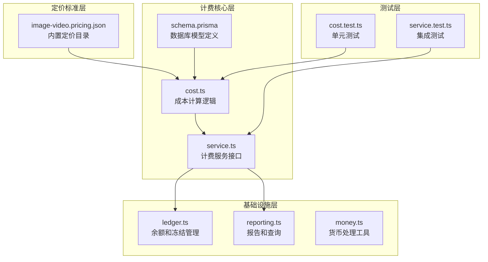
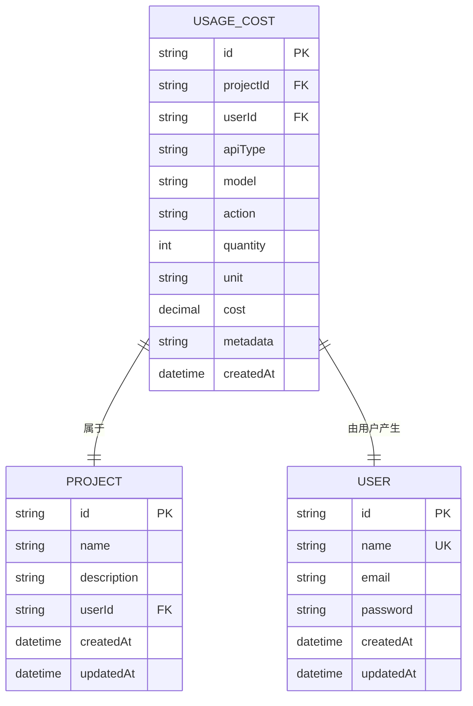
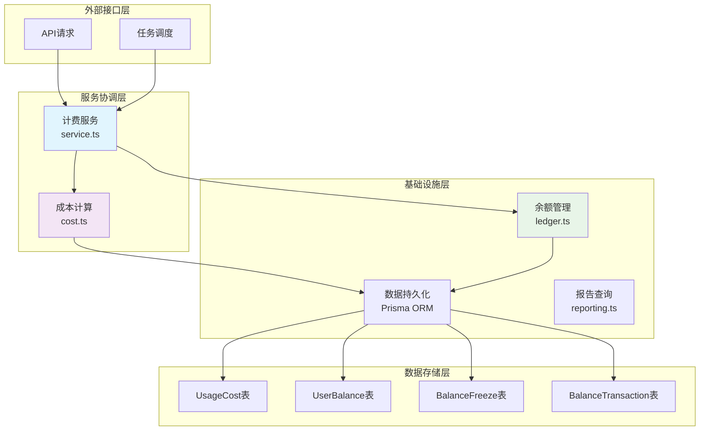
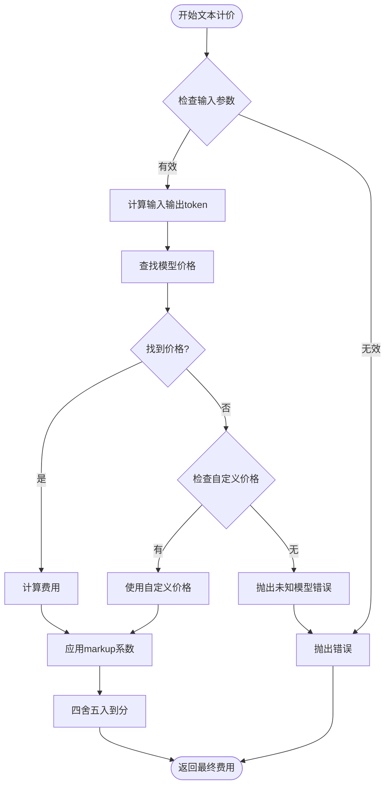
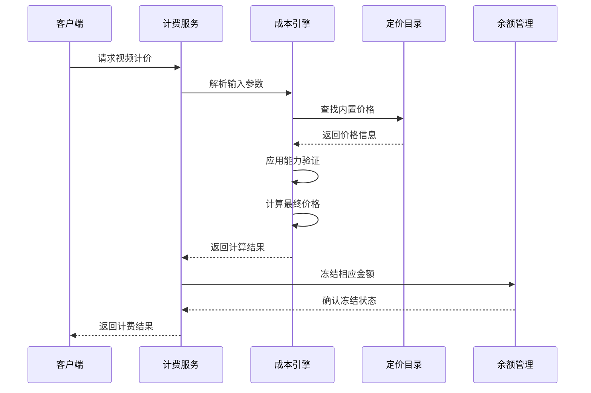
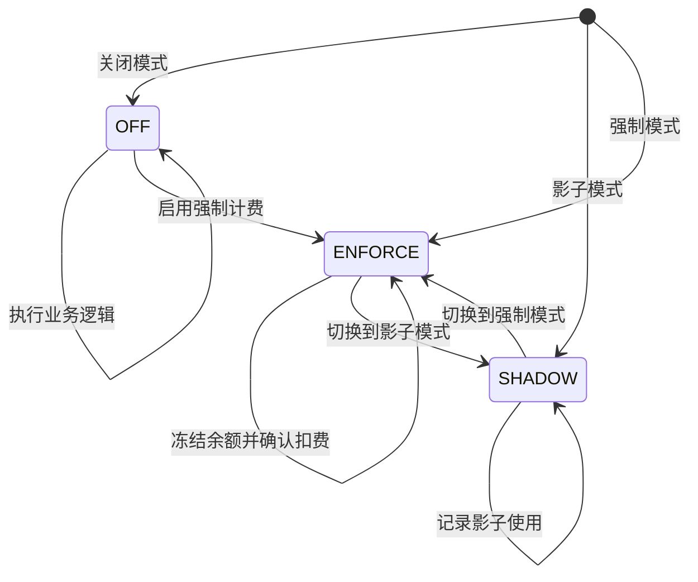
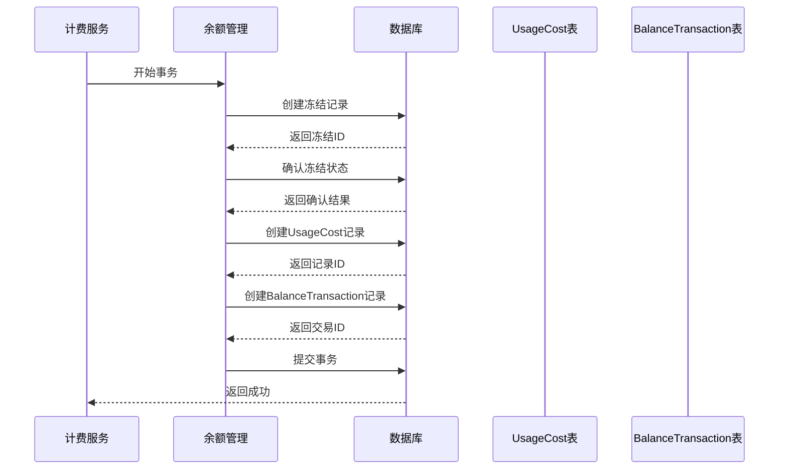
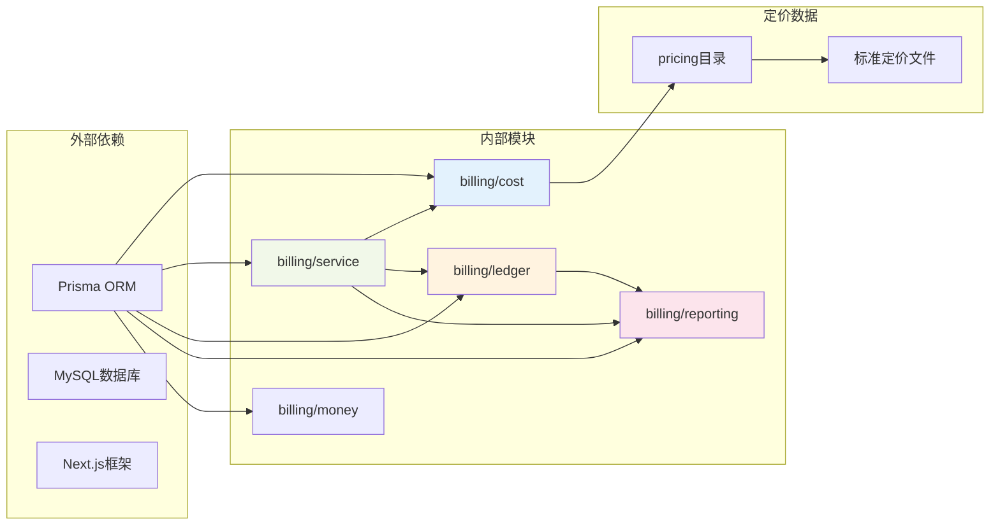
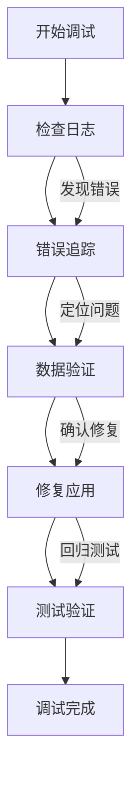

# UsageCost使用成本模型

<cite>
**本文档引用的文件**
- [schema.prisma](file://prisma/schema.prisma)
- [cost.ts](file://src/lib/billing/cost.ts)
- [service.ts](file://src/lib/billing/service.ts)
- [reporting.ts](file://src/lib/billing/reporting.ts)
- [ledger.ts](file://src/lib/billing/ledger.ts)
- [money.ts](file://src/lib/billing/money.ts)
- [image-video.pricing.json](file://standards/pricing/image-video.pricing.json)
- [cost.test.ts](file://tests/unit/billing/cost.test.ts)
- [service.test.ts](file://tests/unit/billing/service.test.ts)
</cite>

## 目录
1. [简介](#简介)
2. [项目结构](#项目结构)
3. [核心组件](#核心组件)
4. [架构概览](#架构概览)
5. [详细组件分析](#详细组件分析)
6. [依赖分析](#依赖分析)
7. [性能考虑](#性能考虑)
8. [故障排除指南](#故障排除指南)
9. [结论](#结论)
10. [附录](#附录)

## 简介

UsageCost是Waoowaoo计费系统的核心实体，用于追踪和管理用户在平台各项服务中的使用成本。该模型实现了统一的计费框架，支持文本、图像、视频、语音等多种API类型的差异化定价策略。

UsageCost实体的设计理念基于以下核心原则：
- **统一性**：所有计费操作都通过UsageCost实体进行持久化记录
- **可追溯性**：完整的成本追踪和审计能力
- **灵活性**：支持多种计价模式和自定义定价
- **准确性**：精确到分的货币处理和四舍五入机制

## 项目结构

计费系统的文件组织遵循清晰的分层架构：

**图表来源**
- [schema.prisma:380-400](file://prisma/schema.prisma#L380-L400)
- [cost.ts:1-742](file://src/lib/billing/cost.ts#L1-L742)
- [service.ts:1-800](file://src/lib/billing/service.ts#L1-L800)

**章节来源**
- [schema.prisma:1-800](file://prisma/schema.prisma#L1-L800)
- [cost.ts:1-742](file://src/lib/billing/cost.ts#L1-L742)

## 核心组件

### UsageCost实体定义

UsageCost作为计费系统的核心数据模型，具有以下关键属性：

| 字段名 | 数据类型 | 约束条件 | 业务含义 |
|--------|----------|----------|----------|
| id | String | 主键，UUID | 记录唯一标识符 |
| projectId | String | 外键，非空 | 关联项目标识 |
| userId | String | 外键，非空 | 关联用户标识 |
| apiType | String | 枚举值，非空 | API类型：text/image/video/voice/voice-design/lip-sync |
| model | String | 非空 | 使用的具体模型标识 |
| action | String | 非空 | 业务动作类型 |
| quantity | Integer | 非负整数 | 使用量或数量 |
| unit | String | 枚举值，非空 | 计量单位：token/image/video/second/call |
| cost | Decimal(18,6) | 非负，精度6位小数 | 实际产生费用 |
| metadata | String | JSON格式，可选 | 扩展元数据信息 |
| createdAt | DateTime | 默认当前时间 | 记录创建时间 |

### 关联关系设计

UsageCost与核心实体的关联关系：

**图表来源**
- [schema.prisma:380-415](file://prisma/schema.prisma#L380-L415)

**章节来源**
- [schema.prisma:380-400](file://prisma/schema.prisma#L380-L400)

## 架构概览

计费系统采用分层架构设计，确保职责分离和模块化：

**图表来源**
- [service.ts:37-531](file://src/lib/billing/service.ts#L37-L531)
- [ledger.ts:105-281](file://src/lib/billing/ledger.ts#L105-L281)
- [reporting.ts:83-136](file://src/lib/billing/reporting.ts#L83-L136)

## 详细组件分析

### 成本计算引擎

成本计算引擎是UsageCost系统的核心逻辑处理器，负责不同类型API的定价策略：

#### 文本服务计价

文本服务采用基于token的计价模式：

**图表来源**
- [cost.ts:420-435](file://src/lib/billing/cost.ts#L420-L435)
- [cost.ts:82-136](file://src/lib/billing/cost.ts#L82-L136)

#### 图像服务计价

图像服务支持固定价格和平面价格两种模式：

| 定价模式 | 特点 | 适用场景 |
|----------|------|----------|
| 固定价格 | 单价固定，不受分辨率影响 | 标准化生成服务 |
| 能力定价 | 基于分辨率等能力维度定价 | 高质量图像生成 |

#### 视频服务计价

视频服务是最复杂的计价模块，支持多种定价策略：

**图表来源**
- [service.ts:380-531](file://src/lib/billing/service.ts#L380-L531)
- [cost.ts:548-698](file://src/lib/billing/cost.ts#L548-L698)

#### 语音服务计价

语音服务采用固定费率模式，按秒计费：

| 服务类型 | 默认模型 | 计价单位 | 特点 |
|----------|----------|----------|------|
| 语音合成 | index-tts2 | 秒 | 固定费率，支持批量折扣 |
| 语音设计 | bailian-voice-design | 次 | 固定费率，一次性收费 |
| 口型同步 | kling | 次 | 固定费率，高质量算法 |

**章节来源**
- [cost.ts:718-741](file://src/lib/billing/cost.ts#L718-L741)
- [service.ts:707-778](file://src/lib/billing/service.ts#L707-L778)

### 计费流程控制

计费系统支持三种运行模式，确保不同场景下的灵活部署：

**图表来源**
- [service.ts:388-401](file://src/lib/billing/service.ts#L388-L401)

**章节来源**
- [service.ts:380-531](file://src/lib/billing/service.ts#L380-L531)

### 数据持久化策略

UsageCost的持久化采用事务性写入，确保数据一致性：

**图表来源**
- [ledger.ts:191-281](file://src/lib/billing/ledger.ts#L191-L281)
- [reporting.ts:83-136](file://src/lib/billing/reporting.ts#L83-L136)

**章节来源**
- [ledger.ts:105-281](file://src/lib/billing/ledger.ts#L105-L281)
- [reporting.ts:83-136](file://src/lib/billing/reporting.ts#L83-L136)

## 依赖分析

计费系统的依赖关系体现了清晰的分层架构：

**图表来源**
- [schema.prisma:1-8](file://prisma/schema.prisma#L1-L8)
- [cost.ts:14-20](file://src/lib/billing/cost.ts#L14-L20)

**章节来源**
- [schema.prisma:1-8](file://prisma/schema.prisma#L1-L8)
- [cost.ts:14-20](file://src/lib/billing/cost.ts#L14-L20)

## 性能考虑

### 货币精度处理

系统采用高精度货币处理机制，避免浮点数运算误差：

- **存储精度**：Decimal(18,6)，支持最多18位数字，6位小数
- **计算精度**：内部使用6位小数精度进行计算
- **四舍五入**：统一采用银行家舍入法，确保计算准确性

### 查询优化策略

针对UsageCost的查询进行了专门优化：

| 查询类型 | 优化策略 | 性能收益 |
|----------|----------|----------|
| 项目总费用 | 使用聚合函数直接计算 | 减少数据传输量 |
| 成本明细查询 | 基于索引的分组查询 | 提高查询响应速度 |
| 最近记录查询 | 限制返回数量和排序优化 | 改善用户体验 |

### 缓存机制

系统实现了多层次缓存策略：

- **内存缓存**：热点数据缓存在内存中
- **数据库索引**：为常用查询字段建立索引
- **查询结果缓存**：对复杂报表查询结果进行缓存

## 故障排除指南

### 常见错误类型及解决方案

| 错误类型 | 错误代码 | 描述 | 解决方案 |
|----------|----------|------|----------|
| 余额不足 | INSUFFICIENT_BALANCE | 用户余额不足以支付费用 | 充值账户或调整使用量 |
| 冻结状态异常 | BILLING_FREEZE_NOT_PENDING | 冻结记录状态不是pending | 检查冻结流程或联系技术支持 |
| 重复计费 | BILLING_IDEMPOTENT_ALREADY_CONFIRMED | 重复的计费请求 | 检查幂等性键或等待处理完成 |
| 未知模型 | BILLING_UNKNOWN_MODEL | 不支持的模型标识 | 更新模型配置或使用受支持的模型 |

### 调试工具和方法

系统提供了完善的调试和监控功能：

**图表来源**
- [service.ts:780-793](file://src/lib/billing/service.ts#L780-L793)

**章节来源**
- [service.ts:780-793](file://src/lib/billing/service.ts#L780-L793)

## 结论

UsageCost使用成本模型通过精心设计的架构和实现，为Waoowaoo平台提供了强大而灵活的计费能力。该模型的主要优势包括：

1. **统一性**：所有计费操作都通过UsageCost实体进行，确保数据一致性和可追溯性
2. **灵活性**：支持多种计价模式和自定义定价策略，适应不同的业务需求
3. **准确性**：精确的货币处理和严格的错误控制机制
4. **可扩展性**：模块化的架构设计便于功能扩展和维护

通过合理的成本管理和最佳实践，UsageCost模型能够有效支撑Waoowaoo平台的商业化运营，为用户提供透明、准确的计费体验。

## 附录

### API类型和计费规则对照表

| API类型 | 计费单位 | 计费策略 | 典型应用场景 |
|---------|----------|----------|--------------|
| text | token | 基于token的输入输出分别计费 | 文本生成、对话系统 |
| image | image | 固定价格或能力定价 | 图像生成、编辑 |
| video | video | 能力定价（分辨率、时长、音频） | 视频生成、合成 |
| voice | second | 按时长计费 | 语音合成 |
| voice-design | call | 固定费用 | 音色定制 |
| lip-sync | call | 固定费用 | 口型同步 |

### 成本管理最佳实践

1. **预算控制**：设置合理的月度预算和预警机制
2. **使用监控**：定期检查各API类型的使用情况
3. **成本优化**：选择合适的模型和参数以降低成本
4. **审计跟踪**：保留完整的计费记录用于财务审计