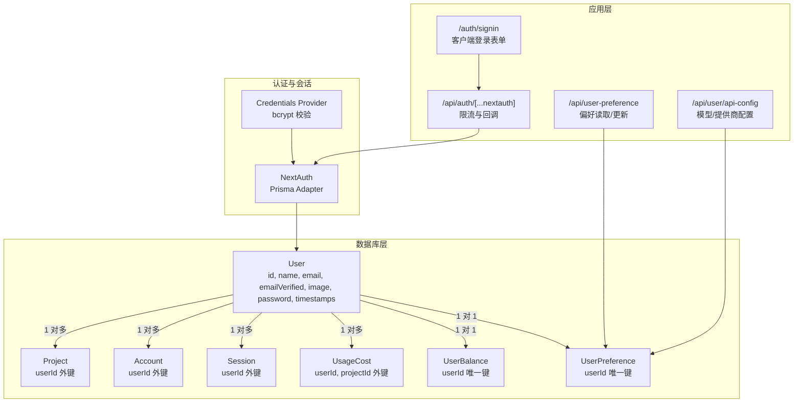
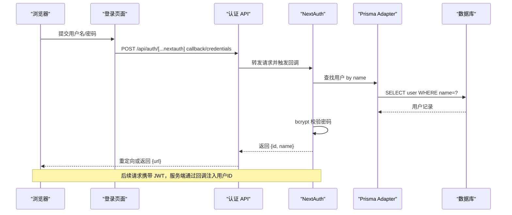
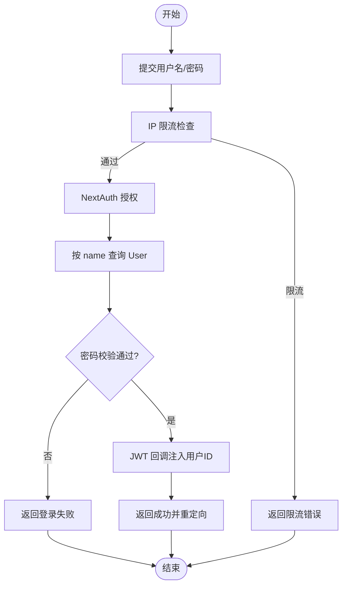
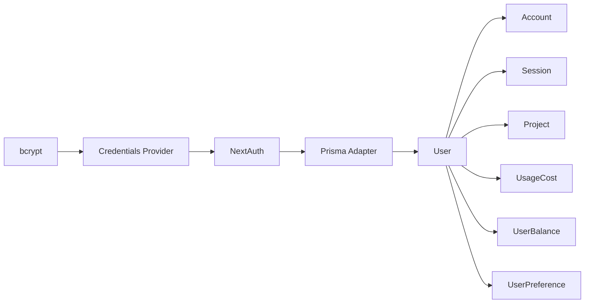

# User用户模型

<cite>
**本文引用的文件**
- [schema.prisma](file://prisma/schema.prisma)
- [schema.sqlit.prisma](file://prisma/schema.sqlit.prisma)
- [auth.ts](file://src/lib/auth.ts)
- [route.ts](file://src/app/api/auth/[...nextauth]/route.ts)
- [page.tsx](file://src/app/[locale]/auth/signin/page.tsx)
- [next-auth.d.ts](file://src/types/next-auth.d.ts)
- [route.ts](file://src/app/api/user-preference/route.ts)
- [route.ts](file://src/app/api/user/api-config/route.ts)
</cite>

## 目录
1. [简介](#简介)
2. [项目结构](#项目结构)
3. [核心组件](#核心组件)
4. [架构总览](#架构总览)
5. [详细组件分析](#详细组件分析)
6. [依赖分析](#依赖分析)
7. [性能考量](#性能考量)
8. [故障排查指南](#故障排查指南)
9. [结论](#结论)
10. [附录](#附录)

## 简介
本文件围绕 Waoowaoo 的 User 用户模型进行系统化文档化，重点阐释以下方面：
- User 实体的设计理念与实现细节
- 在认证系统中的核心作用与集成点
- 字段定义、数据类型、约束条件与业务含义
- 与核心实体的关系：Project（一对多）、Account/Session（关联）、UsageCost（关联）
- 在认证流程中的作用：账户绑定、会话管理、权限验证
- 扩展实体 UserBalance、UserPreference 的设计与使用方法
- 用户管理最佳实践与安全注意事项

## 项目结构
User 模型位于数据库 Schema 中，并通过 NextAuth 集成到认证流程中；同时与项目工作区、计费与偏好设置等模块存在紧密关联。

图表来源
- [schema.prisma:402-429](file://prisma/schema.prisma#L402-L429)
- [auth.ts:1-79](file://src/lib/auth.ts#L1-L79)
- [route.ts:1-50](file://src/app/api/auth/[...nextauth]/route.ts#L1-L50)
- [page.tsx:1-43](file://src/app/[locale]/auth/signin/page.tsx#L1-L43)
- [route.ts:44-93](file://src/app/api/user-preference/route.ts#L44-L93)
- [route.ts:1658-1688](file://src/app/api/user/api-config/route.ts#L1658-L1688)

章节来源
- [schema.prisma:402-429](file://prisma/schema.prisma#L402-L429)
- [auth.ts:1-79](file://src/lib/auth.ts#L1-L79)
- [route.ts:1-50](file://src/app/api/auth/[...nextauth]/route.ts#L1-L50)
- [page.tsx:1-43](file://src/app/[locale]/auth/signin/page.tsx#L1-L43)
- [route.ts:44-93](file://src/app/api/user-preference/route.ts#L44-L93)
- [route.ts:1658-1688](file://src/app/api/user/api-config/route.ts#L1658-L1688)

## 核心组件
- User：用户主体，承载认证凭据与元信息，关联项目、账户、会话、用量成本、余额与偏好。
- Account/Session：第三方账户与会话令牌，均通过外键关联 User。
- Project：用户创建的工作项目，外键指向 User。
- UsageCost：按用户与项目维度归集的用量与费用明细。
- UserBalance/UserPreference：用户余额与偏好配置，一对一关联 User。

章节来源
- [schema.prisma:10-28](file://prisma/schema.prisma#L10-L28)
- [schema.prisma:363-378](file://prisma/schema.prisma#L363-L378)
- [schema.prisma:353-367](file://prisma/schema.prisma#L353-L367)
- [schema.prisma:374-400](file://prisma/schema.prisma#L374-L400)
- [schema.prisma:526-537](file://prisma/schema.prisma#L526-L537)
- [schema.prisma:431-472](file://prisma/schema.prisma#L431-L472)

## 架构总览
User 在认证体系中的关键路径如下：
- 客户端提交用户名/密码
- NextAuth 使用 Prisma Adapter 查询 User 并通过 bcrypt 校验密码
- 成功后通过 JWT 回调注入用户标识，后续会话以 JWT 传递用户上下文
- 应用层接口统一通过 requireUserAuth 进行鉴权，确保操作归属当前用户

图表来源
- [page.tsx:18-43](file://src/app/[locale]/auth/signin/page.tsx#L18-L43)
- [route.ts:19-44](file://src/app/api/auth/[...nextauth]/route.ts#L19-L44)
- [auth.ts:22-53](file://src/lib/auth.ts#L22-L53)
- [schema.prisma:396-416](file://prisma/schema.prisma#L396-L416)

章节来源
- [page.tsx:1-43](file://src/app/[locale]/auth/signin/page.tsx#L1-L43)
- [route.ts:1-50](file://src/app/api/auth/[...nextauth]/route.ts#L1-L50)
- [auth.ts:1-79](file://src/lib/auth.ts#L1-L79)
- [schema.prisma:396-416](file://prisma/schema.prisma#L396-L416)

## 详细组件分析

### User 实体字段与约束
- id：字符串主键，UUID 默认值
- name：字符串，唯一索引
- email：可空字符串
- emailVerified：可空日期时间
- image：可空字符串
- password：可空字符串（存储经 bcrypt 哈希后的密码）
- createdAt/updatedAt：时间戳，默认值与自动更新
- 关系：
  - accounts：Account 数组（一对多）
  - projects：Project 数组（一对多）
  - sessions：Session 数组（一对多）
  - usageCosts：UsageCost 数组（一对多）
  - balance：UserBalance（一对一）
  - preferences：UserPreference（一对一）

字段业务含义与约束要点
- 唯一性：name 唯一，保证用户名全局唯一
- 可空性：email、emailVerified、image、password 可为空，支持多种登录方式
- 时间戳：自动维护创建与更新时间，便于审计与统计
- 关系完整性：删除用户时级联删除其账户、会话、用量成本等

章节来源
- [schema.prisma:396-416](file://prisma/schema.prisma#L396-L416)
- [schema.sqlit.prisma:396-410](file://prisma/schema.sqlit.prisma#L396-L410)

### 认证系统中的核心作用
- 凭据校验：NextAuth 的 Credentials Provider 通过 Prisma Adapter 查询 User，并使用 bcrypt 校验密码
- 会话策略：采用 JWT 策略，回调将用户 ID 注入 token 与 session
- 页面路由：登录失败或限流时跳转至 /auth/signin，并通过 URL 参数提示错误
- 限流保护：对 callback/credentials 路径进行 IP 限流，避免暴力破解

章节来源
- [auth.ts:1-79](file://src/lib/auth.ts#L1-L79)
- [route.ts:1-50](file://src/app/api/auth/[...nextauth]/route.ts#L1-L50)
- [page.tsx:1-43](file://src/app/[locale]/auth/signin/page.tsx#L1-L43)
- [next-auth.d.ts:1-21](file://src/types/next-auth.d.ts#L1-L21)

### 与 Project 的一对多关系
- User 作为项目的所有者，每个项目记录包含 userId 外键
- 业务意义：隔离用户资源，支持多项目并行管理

章节来源
- [schema.prisma:353-367](file://prisma/schema.prisma#L353-L367)

### 与 Account/Session 的关联
- Account：记录第三方登录账户信息，唯一索引约束 provider+providerAccountId，索引 userId
- Session：记录会话令牌与过期时间，索引 userId
- 业务意义：支持多账户绑定与会话生命周期管理

章节来源
- [schema.prisma:10-28](file://prisma/schema.prisma#L10-L28)
- [schema.prisma:363-378](file://prisma/schema.prisma#L363-L378)

### 与 UsageCost 的关联
- UsageCost 记录按用户与项目维度的用量成本明细，索引 apiType、createdAt、projectId、userId
- 业务意义：精细化计费与成本归集

章节来源
- [schema.prisma:374-400](file://prisma/schema.prisma#L374-L400)

### UserBalance 与 UserPreference 设计与使用
- UserBalance（一对一）：余额、冻结金额、累计消费，自动维护时间戳
- UserPreference（一对一）：用户偏好配置（模型选择、并发限制、样式参数等），支持自定义模型与提供商配置，敏感字段加密存储
- 使用场景：
  - 余额查询与事务流水：通过 /api/user-preference 读取偏好，结合余额表进行消费控制
  - 模型与提供商配置：通过 /api/user/api-config 获取用户可用模型与提供商列表

章节来源
- [schema.prisma:526-537](file://prisma/schema.prisma#L526-L537)
- [schema.prisma:431-472](file://prisma/schema.prisma#L431-L472)
- [route.ts:44-93](file://src/app/api/user-preference/route.ts#L44-L93)
- [route.ts:1658-1688](file://src/app/api/user/api-config/route.ts#L1658-L1688)

### 认证流程与权限验证
- 登录流程：客户端提交凭据 → 服务端限流检查 → NextAuth 授权 → 成功后返回重定向
- 会话管理：JWT 回调注入用户 ID，后续接口统一 requireUserAuth 校验
- 权限验证：所有用户相关接口需先通过 requireUserAuth，确保操作主体为当前登录用户

图表来源
- [route.ts:19-44](file://src/app/api/auth/[...nextauth]/route.ts#L19-L44)
- [auth.ts:22-53](file://src/lib/auth.ts#L22-L53)
- [page.tsx:18-43](file://src/app/[locale]/auth/signin/page.tsx#L18-L43)

章节来源
- [route.ts:1-50](file://src/app/api/auth/[...nextauth]/route.ts#L1-L50)
- [auth.ts:1-79](file://src/lib/auth.ts#L1-L79)
- [page.tsx:1-43](file://src/app/[locale]/auth/signin/page.tsx#L1-L43)

## 依赖分析
- 数据库层依赖：User 依赖 Account/Session/Project/UsageCost/UserBalance/UserPreference 的外键关系
- 认证依赖：NextAuth 通过 Prisma Adapter 访问 User；bcrypt 用于密码校验
- 应用层依赖：/api/user-preference 与 /api/user/api-config 依赖 UserPreference；/api/auth/[...nextauth] 依赖限流与日志

图表来源
- [schema.prisma:10-28](file://prisma/schema.prisma#L10-L28)
- [schema.prisma:353-367](file://prisma/schema.prisma#L353-L367)
- [schema.prisma:363-378](file://prisma/schema.prisma#L363-L378)
- [schema.prisma:374-400](file://prisma/schema.prisma#L374-L400)
- [schema.prisma:526-537](file://prisma/schema.prisma#L526-L537)
- [schema.prisma:431-472](file://prisma/schema.prisma#L431-L472)
- [auth.ts:1-79](file://src/lib/auth.ts#L1-L79)

章节来源
- [schema.prisma:10-28](file://prisma/schema.prisma#L10-L28)
- [schema.prisma:353-367](file://prisma/schema.prisma#L353-L367)
- [schema.prisma:363-378](file://prisma/schema.prisma#L363-L378)
- [schema.prisma:374-400](file://prisma/schema.prisma#L374-L400)
- [schema.prisma:526-537](file://prisma/schema.prisma#L526-L537)
- [schema.prisma:431-472](file://prisma/schema.prisma#L431-L472)
- [auth.ts:1-79](file://src/lib/auth.ts#L1-L79)

## 性能考量
- 索引优化：User.name 唯一索引、Account/Session/UsageCost/Project 等外键索引，有助于快速查找与连接
- 会话策略：JWT 会话减少数据库查询次数，但需注意令牌大小与传输开销
- 限流策略：对登录回调进行限流，防止暴力破解，建议结合速率阈值与退避策略
- 密码哈希：bcrypt 已内置成本因子，建议保持默认配置以平衡安全性与性能

## 故障排查指南
- 登录失败
  - 检查用户名是否存在且已设置密码
  - 核对密码是否正确（bcrypt 校验）
  - 查看日志中认证动作记录，定位具体失败原因
- 限流错误
  - 若出现 RateLimited，检查 IP 限流配置与客户端重试间隔
  - 确认 /api/auth/[...nextauth] 的 POST 路由是否命中 credentials 回调
- 会话无效
  - 确认 JWT 回调是否成功注入用户 ID
  - 检查客户端是否正确携带并发送 JWT
- 偏好与配置异常
  - 检查 /api/user-preference 是否返回预期字段
  - 自定义模型/提供商配置需满足格式要求，必要时执行迁移脚本

章节来源
- [auth.ts:22-53](file://src/lib/auth.ts#L22-L53)
- [route.ts:19-44](file://src/app/api/auth/[...nextauth]/route.ts#L19-L44)
- [page.tsx:18-43](file://src/app/[locale]/auth/signin/page.tsx#L18-L43)
- [route.ts:44-93](file://src/app/api/user-preference/route.ts#L44-L93)

## 结论
User 用户模型在 Waoowaoo 中承担核心地位：既是认证入口，也是项目、会话、用量与偏好的枢纽。通过 Prisma 的关系建模与 NextAuth 的适配，实现了清晰的用户生命周期管理。配合限流、加密与索引策略，既保障了安全性，也兼顾了性能与可维护性。建议在生产环境中持续关注密码策略、令牌安全与限额配置，并定期审查用户偏好与计费数据的一致性。

## 附录
- 最佳实践
  - 强制启用 HTTPS 以确保 Cookie 安全（secure）
  - 为 User.name 设置唯一约束，避免重复
  - 对敏感字段（如 User.password、UserPreference.apiKey）进行加密存储
  - 合理设置会话过期时间与刷新策略
  - 使用索引覆盖高频查询字段（如 email、name、id）
- 安全考虑
  - 登录限流：针对 credentials 回调进行 IP 限流
  - 令牌安全：严格控制 JWT 的签名与有效期
  - 输入校验：对用户名/密码长度与字符集进行约束
  - 审计日志：记录登录与授权事件，便于追踪