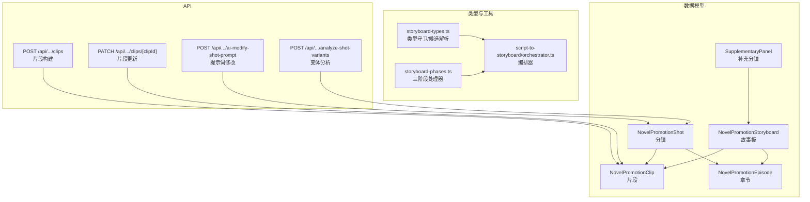
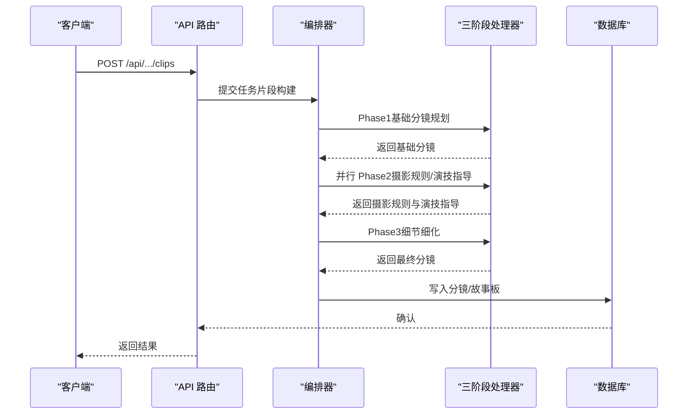
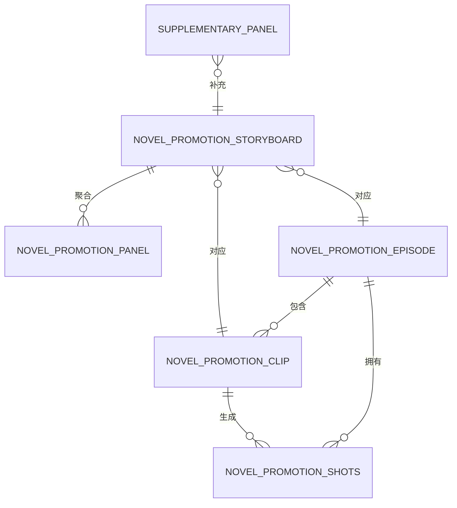
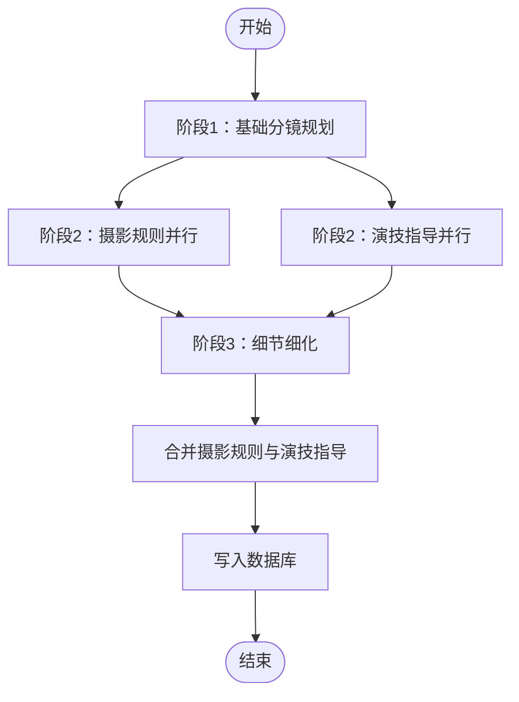
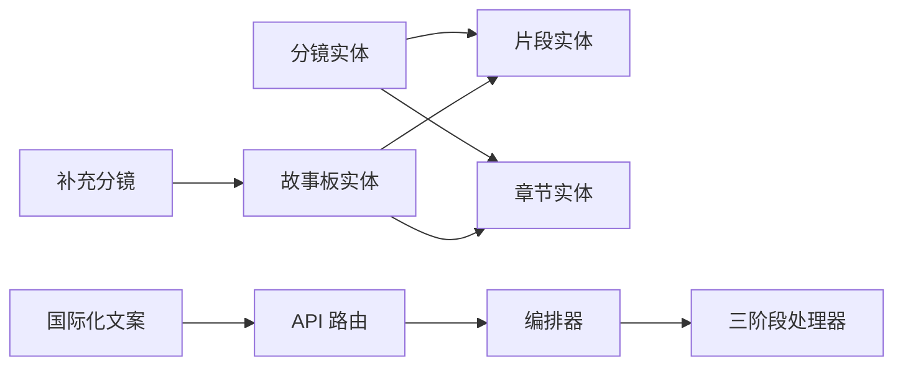

# 分镜实体

<cite>
**本文引用的文件**
- [prisma/schema.prisma](file://prisma/schema.prisma)
- [src/types/storyboard-types.ts](file://src/types/storyboard-types.ts)
- [src/lib/storyboard-phases.ts](file://src/lib/storyboard-phases.ts)
- [src/lib/novel-promotion/script-to-storyboard/orchestrator.ts](file://src/lib/novel-promotion/script-to-storyboard/orchestrator.ts)
- [src/app/api/novel-promotion/[projectId]/clips/route.ts](file://src/app/api/novel-promotion/[projectId]/clips/route.ts)
- [src/app/api/novel-promotion/[projectId]/clips/[clipId]/route.ts](file://src/app/api/novel-promotion/[projectId]/clips/[clipId]/route.ts)
- [src/app/api/novel-promotion/[projectId]/ai-modify-shot-prompt/route.ts](file://src/app/api/novel-promotion/[projectId]/ai-modify-shot-prompt/route.ts)
- [src/app/api/novel-promotion/[projectId]/analyze-shot-variants/route.ts](file://src/app/api/novel-promotion/[projectId]/analyze-shot-variants/route.ts)
- [messages/en/novel-promotion.json](file://messages/en/novel-promotion.json)
- [messages/zh/novel-promotion.json](file://messages/zh/novel-promotion.json)
</cite>

## 目录
1. [简介](#简介)
2. [项目结构](#项目结构)
3. [核心组件](#核心组件)
4. [架构总览](#架构总览)
5. [详细组件分析](#详细组件分析)
6. [依赖关系分析](#依赖关系分析)
7. [性能考量](#性能考量)
8. [故障排查指南](#故障排查指南)
9. [结论](#结论)
10. [附录](#附录)

## 简介
本文件围绕 Waoowaoo 小说推广工作流中的“分镜实体”进行系统化说明，重点阐释 NovelPromotionShot 的设计理念、字段含义与职责边界，并结合分镜与片段（Clip）、章节（Episode）的关系，梳理其在从文本到画面的自动化生成流水线中的作用。同时，文档覆盖分镜的图像生成提示词、摄影规则、镜头运动等创作要素，给出创建、编辑、生成的完整 API 接口说明与使用建议，帮助开发者理解分镜作为镜头设计基本单元的关键价值。

## 项目结构
与分镜实体相关的核心文件分布如下：
- 数据模型层：Prisma Schema 定义了分镜、故事板、片段、补充分镜等实体及关系
- 类型与工具层：Storyboard 类型守卫与面板候选解析工具
- 工作流层：分镜生成的三阶段处理器与编排器
- API 层：片段构建、片段更新、提示词修改、变体分析等接口
- 国际化文案：分镜阶段与操作的本地化文本

图表来源
- [prisma/schema.prisma:276-330](file://prisma/schema.prisma#L276-L330)
- [src/types/storyboard-types.ts:1-49](file://src/types/storyboard-types.ts#L1-L49)
- [src/lib/storyboard-phases.ts:1-120](file://src/lib/storyboard-phases.ts#L1-L120)
- [src/lib/novel-promotion/script-to-storyboard/orchestrator.ts:1-120](file://src/lib/novel-promotion/script-to-storyboard/orchestrator.ts#L1-L120)
- [src/app/api/novel-promotion/[projectId]/clips/route.ts](file://src/app/api/novel-promotion/[projectId]/clips/route.ts#L1-L49)
- [src/app/api/novel-promotion/[projectId]/clips/[clipId]/route.ts](file://src/app/api/novel-promotion/[projectId]/clips/[clipId]/route.ts#L1-L51)
- [src/app/api/novel-promotion/[projectId]/ai-modify-shot-prompt/route.ts](file://src/app/api/novel-promotion/[projectId]/ai-modify-shot-prompt/route.ts#L1-L40)
- [src/app/api/novel-promotion/[projectId]/analyze-shot-variants/route.ts](file://src/app/api/novel-promotion/[projectId]/analyze-shot-variants/route.ts#L1-L38)

章节来源
- [prisma/schema.prisma:276-330](file://prisma/schema.prisma#L276-L330)
- [src/types/storyboard-types.ts:1-49](file://src/types/storyboard-types.ts#L1-L49)
- [src/lib/storyboard-phases.ts:1-120](file://src/lib/storyboard-phases.ts#L1-L120)
- [src/lib/novel-promotion/script-to-storyboard/orchestrator.ts:1-120](file://src/lib/novel-promotion/script-to-storyboard/orchestrator.ts#L1-L120)
- [src/app/api/novel-promotion/[projectId]/clips/route.ts](file://src/app/api/novel-promotion/[projectId]/clips/route.ts#L1-L49)
- [src/app/api/novel-promotion/[projectId]/clips/[clipId]/route.ts](file://src/app/api/novel-promotion/[projectId]/clips/[clipId]/route.ts#L1-L51)
- [src/app/api/novel-promotion/[projectId]/ai-modify-shot-prompt/route.ts](file://src/app/api/novel-promotion/[projectId]/ai-modify-shot-prompt/route.ts#L1-L40)
- [src/app/api/novel-promotion/[projectId]/analyze-shot-variants/route.ts](file://src/app/api/novel-promotion/[projectId]/analyze-shot-variants/route.ts#L1-L38)

## 核心组件
- 分镜实体（NovelPromotionShot）
  - 关键字段：分镜序列、位置信息、角色信息、剧情描述、摄影指导、图像生成提示词、镜头运动、POV 等
  - 关系：属于章节与片段，可关联媒体对象
- 片段实体（NovelPromotionClip）
  - 作为分镜的承载容器，提供角色、地点、道具、内容、剧本等上下文
- 故事板实体（NovelPromotionStoryboard）
  - 一组分镜的聚合，包含面板候选、摄影计划、文本等
- 补充分镜（SupplementaryPanel）
  - 与故事板关联，用于补充或扩展画面

章节来源
- [prisma/schema.prisma:276-330](file://prisma/schema.prisma#L276-L330)

## 架构总览
分镜实体在小说推广工作流中的定位：
- 输入：章节文本、角色库、地点库、道具库、SRT 时间戳范围
- 处理：三阶段分镜生成（规划、摄影规则、演技指导、细节细化），随后与摄影规则合并
- 输出：带摄影指导与细节的分镜集合，支持图像生成与后续视频/配音集成

图表来源
- [src/lib/novel-promotion/script-to-storyboard/orchestrator.ts:285-508](file://src/lib/novel-promotion/script-to-storyboard/orchestrator.ts#L285-L508)
- [src/lib/storyboard-phases.ts:244-704](file://src/lib/storyboard-phases.ts#L244-L704)
- [src/app/api/novel-promotion/[projectId]/clips/route.ts](file://src/app/api/novel-promotion/[projectId]/clips/route.ts#L11-L48)

## 详细组件分析

### 分镜实体设计与字段说明
- 设计理念
  - 分镜是镜头设计的基本单元，承载画面描述、摄影规则、角色与地点信息、镜头运动、POV 等创作要素
  - 通过与片段、章节的外键关联，确保分镜在正确的时间轴与语境下生成与呈现
- 字段要点
  - 序列与时间：分镜序号、SRT 起止与时长，便于与音频/字幕对齐
  - 场景与角色：位置、角色列表、剧情描述，支撑画面内容
  - 摄影指导：构图、灯光、色调、氛围、技术备注等
  - 镜头运动：如推拉摇移、景深变化等
  - 图像生成：图像提示词、生成后的媒体对象引用
  - 其他：缩放、模块、焦点、中文摘要、POV 等
- 关系与索引
  - 与片段、章节的级联删除，保证数据一致性
  - 对片段、章节、分镜 ID、媒体对象的索引优化查询

章节来源
- [prisma/schema.prisma:276-307](file://prisma/schema.prisma#L276-L307)

### 分镜与片段、章节的关系
- 片段（Clip）是分镜的承载容器，提供角色、地点、道具、内容、剧本等上下文
- 分镜（Shot）属于某个片段与章节，具备 SRT 时间戳范围，确保与音频/字幕的精确对齐
- 故事板（Storyboard）聚合多个分镜，支持面板候选、摄影计划等

图表来源
- [prisma/schema.prisma:276-330](file://prisma/schema.prisma#L276-L330)

### 分镜在小说推广工作流中的作用
- 文本到画面的桥梁：将章节文本与角色/地点/道具库结合，生成可执行的画面描述
- 创意与规范并存：摄影规则与演技指导确保风格统一与表现力
- 可编辑与可迭代：支持提示词修改、变体分析、候选图选择等编辑能力
- 与后续流程衔接：为图像生成、视频合成、配音绑定提供基础素材

章节来源
- [src/lib/storyboard-phases.ts:133-138](file://src/lib/storyboard-phases.ts#L133-L138)
- [src/app/api/novel-promotion/[projectId]/ai-modify-shot-prompt/route.ts](file://src/app/api/novel-promotion/[projectId]/ai-modify-shot-prompt/route.ts#L1-L40)
- [src/app/api/novel-promotion/[projectId]/analyze-shot-variants/route.ts](file://src/app/api/novel-promotion/[projectId]/analyze-shot-variants/route.ts#L1-L38)

### 图像生成提示词、摄影规则与镜头运动
- 图像生成提示词
  - 分镜实体内置图像提示词字段，支持直接生成或二次修改
  - 可结合角色、地点、道具、摄影规则生成更高质量的提示词
- 摄影规则
  - 包含构图、灯光、色调、氛围、技术备注等维度，用于指导画面风格
- 镜头运动
  - 描述推拉摇移、景深变化、视角切换等，提升画面节奏感

章节来源
- [prisma/schema.prisma:276-307](file://prisma/schema.prisma#L276-L307)
- [src/lib/storyboard-phases.ts:95-107](file://src/lib/storyboard-phases.ts#L95-L107)

### 创建、编辑、生成的完整 API 接口说明

#### 片段构建（第二步：片段切分）
- 方法与路径
  - POST /api/novel-promotion/{projectId}/clips
- 请求体
  - episodeId: 章节 ID（必填）
- 权限与行为
  - 需要项目认证；提交异步任务（CLIPS_BUILD）以构建片段
- 返回
  - 异步任务响应或错误码

章节来源
- [src/app/api/novel-promotion/[projectId]/clips/route.ts](file://src/app/api/novel-promotion/[projectId]/clips/route.ts#L1-L49)

#### 更新片段信息
- 方法与路径
  - PATCH /api/novel-promotion/{projectId}/clips/{clipId}
- 请求体
  - characters: 角色引用 JSON 字符串
  - location: 地点名称
  - props: 道具数组 JSON 字符串
  - content: 片段内容
  - screenplay: 剧本 JSON 字符串
- 权限与行为
  - 轻量认证；直接更新片段记录
- 返回
  - 成功标志与更新后的片段

章节来源
- [src/app/api/novel-promotion/[projectId]/clips/[clipId]/route.ts](file://src/app/api/novel-promotion/[projectId]/clips/[clipId]/route.ts#L1-L51)

#### 提示词修改（针对分镜或项目）
- 方法与路径
  - POST /api/novel-promotion/{projectId}/ai-modify-shot-prompt
- 请求体
  - currentPrompt: 当前提示词（必填）
  - modifyInstruction: 修改指令（必填）
  - panelId: 分镜 ID（可选）
  - episodeId: 章节 ID（可选）
- 权限与行为
  - 需要项目认证；根据 panelId 或项目级别提交异步任务（AI_MODIFY_SHOT_PROMPT）
- 返回
  - 异步任务响应或错误码

章节来源
- [src/app/api/novel-promotion/[projectId]/ai-modify-shot-prompt/route.ts](file://src/app/api/novel-promotion/[projectId]/ai-modify-shot-prompt/route.ts#L1-L40)

#### 变体分析（基于分镜）
- 方法与路径
  - POST /api/novel-promotion/{projectId}/analyze-shot-variants
- 请求体
  - panelId: 分镜 ID（必填）
  - episodeId: 章节 ID（可选）
- 权限与行为
  - 轻量认证；提交异步任务（ANALYZE_SHOT_VARIANTS）
- 返回
  - 异步任务响应或错误码

章节来源
- [src/app/api/novel-promotion/[projectId]/analyze-shot-variants/route.ts](file://src/app/api/novel-promotion/[projectId]/analyze-shot-variants/route.ts#L1-L38)

### 分镜生成工作流（三阶段与编排）
- 阶段划分
  - 阶段1：基础分镜规划（根据角色、地点、道具、剧本生成初始分镜）
  - 阶段2：摄影规则与演技指导（并行生成，为每个分镜提供摄影与表演指导）
  - 阶段3：细节细化（补充画面细节与视频提示词，过滤无效分镜）
- 编排器
  - 控制步骤元数据、重试策略、并发度与结果汇总
  - 将摄影规则与演技指导合并到最终分镜

图表来源
- [src/lib/storyboard-phases.ts:244-704](file://src/lib/storyboard-phases.ts#L244-L704)
- [src/lib/novel-promotion/script-to-storyboard/orchestrator.ts:285-508](file://src/lib/novel-promotion/script-to-storyboard/orchestrator.ts#L285-L508)

章节来源
- [src/lib/storyboard-phases.ts:133-138](file://src/lib/storyboard-phases.ts#L133-L138)
- [src/lib/novel-promotion/script-to-storyboard/orchestrator.ts:156-283](file://src/lib/novel-promotion/script-to-storyboard/orchestrator.ts#L156-L283)

### 类型与工具：分镜与故事板
- 类型守卫与安全访问
  - hasLoadedPanels：判断故事板是否已加载面板
  - getPanels：安全获取面板数组
  - getPanelCandidates：解析面板候选历史 JSON
- 用途
  - 在前端与服务端安全地处理故事板与面板数据，避免运行时断言问题

章节来源
- [src/types/storyboard-types.ts:12-48](file://src/types/storyboard-types.ts#L12-L48)

## 依赖关系分析
- 数据模型依赖
  - 分镜依赖片段与章节；故事板依赖片段与章节；补充分镜依赖故事板
- 处理流程依赖
  - 编排器依赖三阶段处理器；API 路由依赖编排器与任务系统
- 国际化依赖
  - 分镜阶段与操作文案由消息文件提供

图表来源
- [prisma/schema.prisma:276-330](file://prisma/schema.prisma#L276-L330)
- [src/lib/novel-promotion/script-to-storyboard/orchestrator.ts:1-120](file://src/lib/novel-promotion/script-to-storyboard/orchestrator.ts#L1-L120)
- [src/lib/storyboard-phases.ts:1-120](file://src/lib/storyboard-phases.ts#L1-L120)
- [messages/en/novel-promotion.json](file://messages/en/novel-promotion.json)
- [messages/zh/novel-promotion.json](file://messages/zh/novel-promotion.json)

章节来源
- [prisma/schema.prisma:276-330](file://prisma/schema.prisma#L276-L330)
- [src/lib/novel-promotion/script-to-storyboard/orchestrator.ts:1-120](file://src/lib/novel-promotion/script-to-storyboard/orchestrator.ts#L1-L120)
- [src/lib/storyboard-phases.ts:1-120](file://src/lib/storyboard-phases.ts#L1-L120)
- [messages/en/novel-promotion.json](file://messages/en/novel-promotion.json)
- [messages/zh/novel-promotion.json](file://messages/zh/novel-promotion.json)

## 性能考量
- 并发与重试
  - 编排器支持并发控制与指数退避重试，降低 LLM 调用失败的影响
- 结果过滤
  - 阶段3对空分镜进行过滤，减少无效数据写入
- 索引优化
  - 分镜、故事板、片段、补充分镜均建立关键索引，提升查询效率

章节来源
- [src/lib/novel-promotion/script-to-storyboard/orchestrator.ts:285-508](file://src/lib/novel-promotion/script-to-storyboard/orchestrator.ts#L285-L508)
- [prisma/schema.prisma:276-330](file://prisma/schema.prisma#L276-L330)

## 故障排查指南
- 常见错误与定位
  - 参数无效：检查请求体字段是否齐全（如 episodeId、panelId、prompt 等）
  - 权限不足：确认项目认证与轻量认证是否满足接口要求
  - JSON 解析失败：检查提示词与片段 JSON 的格式
  - 无有效分镜：阶段1/3可能返回空或全部为空，需检查角色/地点/道具上下文
- 日志与追踪
  - 使用日志记录提示词与输出，便于回溯与调试
  - 异步任务状态可通过任务系统查询

章节来源
- [src/app/api/novel-promotion/[projectId]/clips/route.ts](file://src/app/api/novel-promotion/[projectId]/clips/route.ts#L19-L21)
- [src/app/api/novel-promotion/[projectId]/clips/[clipId]/route.ts](file://src/app/api/novel-promotion/[projectId]/clips/[clipId]/route.ts#L21-L42)
- [src/lib/storyboard-phases.ts:320-386](file://src/lib/storyboard-phases.ts#L320-L386)
- [src/lib/novel-promotion/script-to-storyboard/orchestrator.ts:229-283](file://src/lib/novel-promotion/script-to-storyboard/orchestrator.ts#L229-L283)

## 结论
分镜实体作为小说推广工作流中的核心镜头设计单元，通过明确的字段设计、严格的上下文依赖与完善的三阶段生成流程，实现了从文本到画面的高效转化。配合 API 的提示词修改与变体分析能力，开发者可以灵活地迭代与优化画面效果，最终为视频与配音制作提供高质量的基础素材。

## 附录
- 国际化文案参考
  - 英文文案：messages/en/novel-promotion.json
  - 中文文案：messages/zh/novel-promotion.json

章节来源
- [messages/en/novel-promotion.json](file://messages/en/novel-promotion.json)
- [messages/zh/novel-promotion.json](file://messages/zh/novel-promotion.json)