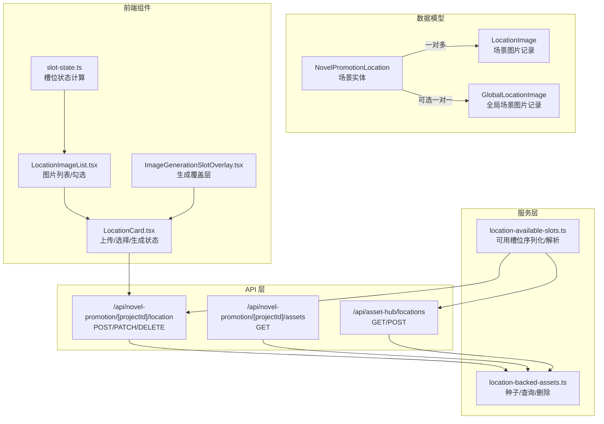
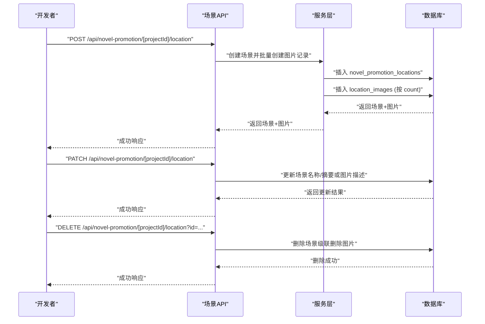
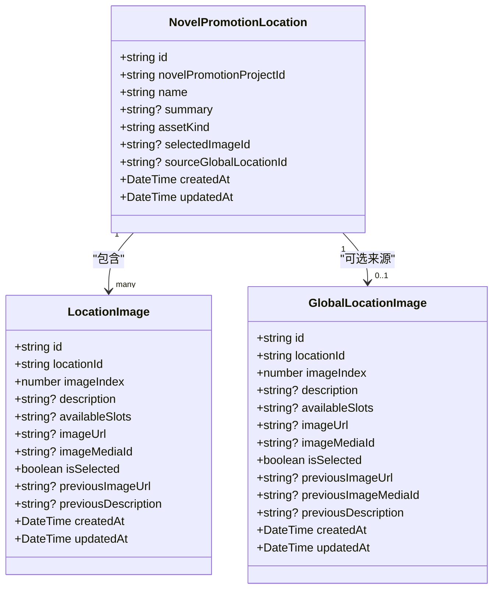
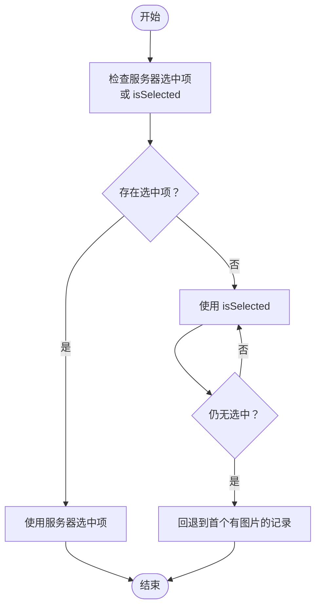
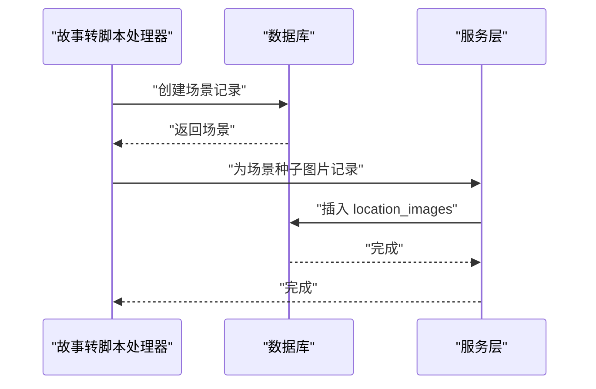
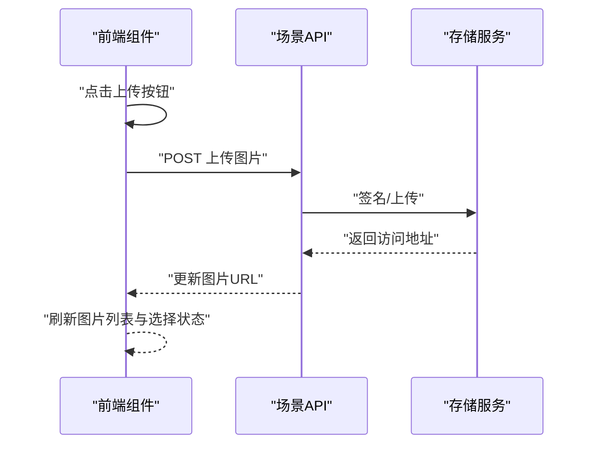
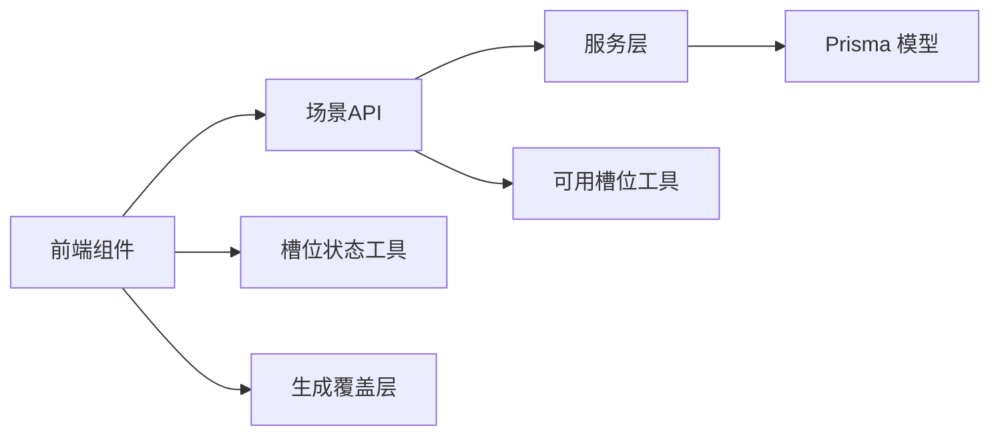

# 场景实体

<cite>
**本文引用的文件**
- [schema.prisma](file://prisma/schema.prisma)
- [route.ts](file://src/app/api/novel-promotion/[projectId]/location/route.ts)
- [route.ts](file://src/app/api/novel-promotion/[projectId]/assets/route.ts)
- [route.ts](file://src/app/api/asset-hub/locations/route.ts)
- [location-backed-assets.ts](file://src/lib/assets/services/location-backed-assets.ts)
- [location-available-slots.ts](file://src/lib/location-available-slots.ts)
- [LocationCard.tsx](file://src/app/[locale]/workspace/[projectId]/modes/novel-promotion/components/assets/LocationCard.tsx)
- [LocationImageList.tsx](file://src/app/[locale]/workspace/[projectId]/modes/novel-promotion/components/assets/location-card/LocationImageList.tsx)
- [ImageGenerationSlotOverlay.tsx](file://src/components/image-generation/ImageGenerationSlotOverlay.tsx)
- [slot-state.ts](file://src/lib/image-generation/slot-state.ts)
- [story-to-script-helpers.ts](file://src/lib/workers/handlers/story-to-script-helpers.ts)
- [shot-ai-persist.ts](file://src/lib/workers/handlers/shot-ai-persist.ts)
- [project.ts](file://src/types/project.ts)
</cite>

## 目录
1. [简介](#简介)
2. [项目结构](#项目结构)
3. [核心组件](#核心组件)
4. [架构总览](#架构总览)
5. [详细组件分析](#详细组件分析)
6. [依赖关系分析](#依赖关系分析)
7. [性能考量](#性能考量)
8. [故障排查指南](#故障排查指南)
9. [结论](#结论)
10. [附录](#附录)

## 简介
本文件面向Waoowaoo小说推广场景实体的完整设计与实现，围绕以下目标展开：
- 解释NovelPromotionLocation实体的设计理念与实现细节，包括场景名称、摘要描述、资产类型等基本信息。
- 说明场景图片管理机制，包括LocationImage实体如何管理场景的不同图片版本、可用槽位管理、图片选择逻辑等。
- 阐述场景与项目的关系，以及场景在小说推广工作流中的作用。
- 提供场景创建、图片上传、图片选择的完整API接口说明与使用示例，帮助开发者理解场景管理的完整流程。

## 项目结构
与场景实体直接相关的代码分布在以下层次：
- 数据模型层：Prisma Schema定义了场景与图片的结构及关系。
- API 层：提供场景的创建、更新、删除与查询接口；提供项目资产统一拉取接口。
- 服务层：封装项目/全局场景资产的种子、查询与删除逻辑。
- 前端组件层：负责图片上传、图片选择、占位与生成状态展示。
- 工具层：可用槽位序列化/解析、图片槽位状态计算等。

图表来源
- [schema.prisma:56-119](file://prisma/schema.prisma#L56-L119)
- [route.ts:47-161](file://src/app/api/novel-promotion/[projectId]/location/route.ts#L47-L161)
- [route.ts:15-62](file://src/app/api/novel-promotion/[projectId]/assets/route.ts#L15-L62)
- [route.ts:14-106](file://src/app/api/asset-hub/locations/route.ts#L14-L106)
- [location-backed-assets.ts:135-188](file://src/lib/assets/services/location-backed-assets.ts#L135-L188)
- [location-available-slots.ts:8-46](file://src/lib/location-available-slots.ts#L8-L46)
- [LocationCard.tsx:70-107](file://src/app/[locale]/workspace/[projectId]/modes/novel-promotion/components/assets/LocationCard.tsx#L70-L107)
- [LocationImageList.tsx:25-170](file://src/app/[locale]/workspace/[projectId]/modes/novel-promotion/components/assets/location-card/LocationImageList.tsx#L25-L170)
- [ImageGenerationSlotOverlay.tsx:9-15](file://src/components/image-generation/ImageGenerationSlotOverlay.tsx#L9-L15)
- [slot-state.ts:16-78](file://src/lib/image-generation/slot-state.ts#L16-L78)

章节来源
- [schema.prisma:56-119](file://prisma/schema.prisma#L56-L119)
- [route.ts:47-161](file://src/app/api/novel-promotion/[projectId]/location/route.ts#L47-L161)
- [route.ts:15-62](file://src/app/api/novel-promotion/[projectId]/assets/route.ts#L15-L62)
- [route.ts:14-106](file://src/app/api/asset-hub/locations/route.ts#L14-L106)
- [location-backed-assets.ts:135-188](file://src/lib/assets/services/location-backed-assets.ts#L135-L188)
- [location-available-slots.ts:8-46](file://src/lib/location-available-slots.ts#L8-L46)
- [LocationCard.tsx:70-107](file://src/app/[locale]/workspace/[projectId]/modes/novel-promotion/components/assets/LocationCard.tsx#L70-L107)
- [LocationImageList.tsx:25-170](file://src/app/[locale]/workspace/[projectId]/modes/novel-promotion/components/assets/location-card/LocationImageList.tsx#L25-L170)
- [ImageGenerationSlotOverlay.tsx:9-15](file://src/components/image-generation/ImageGenerationSlotOverlay.tsx#L9-L15)
- [slot-state.ts:16-78](file://src/lib/image-generation/slot-state.ts#L16-L78)

## 核心组件
- 场景实体（NovelPromotionLocation）
  - 关键字段：项目ID、名称、摘要、资产类型、来源全局场景ID、选中图片ID、创建/更新时间。
  - 关系：包含多个场景图片记录；可选指向一个被选中的图片记录。
- 场景图片实体（LocationImage）
  - 关键字段：场景ID、图片索引、描述、可用槽位、当前图片URL/媒体、上一次描述/图片、是否选中、创建/更新时间。
  - 关系：属于一个场景；可选关联媒体对象；可被场景作为“选中图片”引用。
- 可用槽位工具（LocationAvailableSlot）
  - 将数组形式的可用槽位标准化、序列化与解析，保证去重与一致性。
- 服务层（location-backed-assets）
  - 提供项目/全局场景资产的查询、种子（批量创建图片记录）、删除能力。
- 前端组件（LocationCard/LocationImageList）
  - 负责图片上传触发、上传调用、图片选择、生成状态展示与交互。

章节来源
- [schema.prisma:56-119](file://prisma/schema.prisma#L56-L119)
- [location-available-slots.ts:8-46](file://src/lib/location-available-slots.ts#L8-L46)
- [location-backed-assets.ts:135-188](file://src/lib/assets/services/location-backed-assets.ts#L135-L188)
- [LocationCard.tsx:70-107](file://src/app/[locale]/workspace/[projectId]/modes/novel-promotion/components/assets/LocationCard.tsx#L70-L107)
- [LocationImageList.tsx:25-170](file://src/app/[locale]/workspace/[projectId]/modes/novel-promotion/components/assets/location-card/LocationImageList.tsx#L25-L170)

## 架构总览
场景实体在小说推广工作流中的定位：
- 作为“地点/场景”的资产载体，贯穿故事板生成、镜头变体生成、剪辑与视频合成等阶段。
- 通过“可用槽位”与“图片描述”驱动AI生成与人工编辑，最终选定一张图片作为该场景的代表图。
- 与项目/全局资产系统解耦但互通：项目内场景可复制自全局场景，形成来源追踪。

图表来源
- [route.ts:47-161](file://src/app/api/novel-promotion/[projectId]/location/route.ts#L47-L161)
- [location-backed-assets.ts:190-228](file://src/lib/assets/services/location-backed-assets.ts#L190-L228)

## 详细组件分析

### 数据模型与关系
- 实体关系图（类图）

图表来源
- [schema.prisma:56-119](file://prisma/schema.prisma#L56-L119)
- [schema.prisma:897-922](file://prisma/schema.prisma#L897-L922)

章节来源
- [schema.prisma:56-119](file://prisma/schema.prisma#L56-L119)
- [schema.prisma:897-922](file://prisma/schema.prisma#L897-L922)

### 场景图片管理机制
- 图片版本与槽位
  - 每个场景维护一组图片记录，按imageIndex排序；每条记录包含当前描述、可用槽位、当前图片URL/媒体、上一次描述/图片等字段，便于回溯与撤销。
  - 可用槽位通过字符串化存储，前端与后端均提供标准化与解析工具，确保一致性。
- 图片选择逻辑
  - 服务器侧通过selectedImageId或图片记录的isSelected字段确定选中项；前端组件在渲染时优先使用服务器选中项，其次使用isSelected，最后回退到首个有图片的记录。
  - 勾选按钮仅在“该格子自身未在生成且已有图片”时启用，避免干扰组任务运行期间的生成状态。
- 图片上传与生成
  - 前端通过隐藏文件输入触发上传，调用上传接口后刷新图片列表；生成状态通过任务运行标志与占位网格控制，避免显示无意义的空槽位。

图表来源
- [LocationCard.tsx:113-117](file://src/app/[locale]/workspace/[projectId]/modes/novel-promotion/components/assets/LocationCard.tsx#L113-L117)
- [LocationImageList.tsx:144-158](file://src/app/[locale]/workspace/[projectId]/modes/novel-promotion/components/assets/location-card/LocationImageList.tsx#L144-L158)

章节来源
- [LocationCard.tsx:113-117](file://src/app/[locale]/workspace/[projectId]/modes/novel-promotion/components/assets/LocationCard.tsx#L113-L117)
- [LocationImageList.tsx:144-158](file://src/app/[locale]/workspace/[projectId]/modes/novel-promotion/components/assets/location-card/LocationImageList.tsx#L144-L158)

### 场景与项目的关系
- 项目内场景
  - 通过项目ID关联，支持批量查询与带媒体签名URL的返回；可用于工作流各阶段的数据输入。
- 全局场景
  - 用户可创建全局场景并设置风格、目录等，项目内可复用其图片描述与可用槽位，形成来源追踪（sourceGlobalLocationId）。
- 工作流集成
  - 故事转脚本处理器会基于文本分析创建场景，并填充图片槽位；AI持久化处理器可更新场景描述与可用槽位。

图表来源
- [story-to-script-helpers.ts:128-152](file://src/lib/workers/handlers/story-to-script-helpers.ts#L128-L152)
- [location-backed-assets.ts:272-303](file://src/lib/assets/services/location-backed-assets.ts#L272-L303)

章节来源
- [story-to-script-helpers.ts:128-152](file://src/lib/workers/handlers/story-to-script-helpers.ts#L128-L152)
- [location-backed-assets.ts:272-303](file://src/lib/assets/services/location-backed-assets.ts#L272-L303)

### API 接口说明与使用示例

- 获取项目资产（角色 + 场景 + 道具）
  - 方法与路径：GET /api/novel-promotion/[projectId]/assets
  - 功能：返回项目内的角色、场景与道具资产，按创建时间升序排列；图片按imageIndex升序排列；自动附加媒体签名URL。
  - 权限：需要项目轻量鉴权。
  - 响应：包含characters、locations、props三部分。
  - 示例请求
    - GET /api/novel-promotion/proj-xxx/assets
  - 示例响应
    - 包含角色、场景、道具的列表，每个场景包含images数组。

章节来源
- [route.ts:15-62](file://src/app/api/novel-promotion/[projectId]/assets/route.ts#L15-L62)

- 创建场景（含初始图片记录）
  - 方法与路径：POST /api/novel-promotion/[projectId]/location
  - 请求体字段
    - name: 场景名称（必填）
    - description: 场景描述（必填）
    - summary: 场景摘要（可选）
    - count: 初始图片数量，默认1（可选）
    - availableSlots: 可用槽位数组（可选）
    - artStyle: 艺术风格值（可选，需为受支持值）
  - 行为：创建场景并批量创建图片记录（按count），图片描述去除提示后缀，可用槽位序列化存储。
  - 示例请求
    - POST /api/novel-promotion/proj-xxx/location
    - Body: { name: "图书馆", description: "描述内容...", count: 3, availableSlots: ["角色A","角色B"] }
  - 示例响应
    - { success: true, location: { id, name, summary, images: [...] } }

章节来源
- [route.ts:47-110](file://src/app/api/novel-promotion/[projectId]/location/route.ts#L47-L110)
- [location-available-slots.ts:32-34](file://src/lib/location-available-slots.ts#L32-L34)

- 更新场景或图片描述
  - 方法与路径：PATCH /api/novel-promotion/[projectId]/location
  - 请求体字段（二选一）
    - 更新场景：locationId + name（可选）+ summary（可选）
    - 更新图片：locationId + imageIndex（必填）+ description（必填）+ availableSlots（可选）
  - 行为：根据传入字段分别更新场景信息或图片描述；图片描述同样去除提示后缀；可用槽位可单独更新。
  - 示例请求
    - PATCH /api/novel-promotion/proj-xxx/location
    - Body: { locationId: "...", name: "新名称", summary: "新摘要" }
    - 或
    - Body: { locationId: "...", imageIndex: 0, description: "新描述", availableSlots: ["角色C"] }
  - 示例响应
    - { success: true, location 或 image }

章节来源
- [route.ts:113-161](file://src/app/api/novel-promotion/[projectId]/location/route.ts#L113-L161)
- [location-available-slots.ts:32-34](file://src/lib/location-available-slots.ts#L32-L34)

- 删除场景
  - 方法与路径：DELETE /api/novel-promotion/[projectId]/location?id=...
  - 行为：删除场景记录，级联删除其所有图片记录。
  - 示例请求
    - DELETE /api/novel-promotion/proj-xxx/location?id=loc-xxx
  - 示例响应
    - { success: true }

章节来源
- [route.ts:21-44](file://src/app/api/novel-promotion/[projectId]/location/route.ts#L21-L44)

- 获取全局场景（资产库）
  - 方法与路径：GET /api/asset-hub/locations
  - 查询参数：folderId（可选，支持"null"表示未分类）
  - 行为：返回当前用户的所有全局场景及其图片，按创建时间倒序；自动附加媒体签名URL。
  - 示例请求
    - GET /api/asset-hub/locations?folderId=null
  - 示例响应
    - { locations: [...] }

章节来源
- [route.ts:14-41](file://src/app/api/asset-hub/locations/route.ts#L14-L41)

- 创建全局场景（资产库）
  - 方法与路径：POST /api/asset-hub/locations
  - 请求体字段：name（必填）、summary（可选）、folderId（可选）、artStyle（必填且需受支持）、count（可选，默认1）、availableSlots（可选）
  - 行为：创建全局场景并批量创建图片记录；返回带媒体签名URL的场景。
  - 示例请求
    - POST /api/asset-hub/locations
    - Body: { name: "房间", summary: "描述", folderId: "folder-xxx", artStyle: "写实", count: 2 }
  - 示例响应
    - { success: true, location: {...} }

章节来源
- [route.ts:44-106](file://src/app/api/asset-hub/locations/route.ts#L44-L106)

### 前端交互与图片上传
- 上传流程
  - 触发：点击卡片上的上传入口，弹出隐藏的文件选择框。
  - 执行：选择图片后触发上传请求，携带locationId、imageIndex（可选）与标签文本。
  - 成功/失败：成功提示与错误处理，完成后清理文件输入。
- 选择流程
  - 勾选：仅当该格子未在生成且已有图片时允许勾选；勾选即设置该图片为场景选中项。
  - 确认：在选择模式下，确认后调用后端确认接口（由上层工作流决定）。
- 生成状态
  - 占位网格：根据任务运行状态与已生成数量动态显示；单图生成时仅显示一个占位，多图生成时显示请求的数量。
  - 覆盖层：生成过程中显示旋转加载图标与标签。

图表来源
- [LocationCard.tsx:70-107](file://src/app/[locale]/workspace/[projectId]/modes/novel-promotion/components/assets/LocationCard.tsx#L70-L107)
- [ImageGenerationSlotOverlay.tsx:9-15](file://src/components/image-generation/ImageGenerationSlotOverlay.tsx#L9-L15)
- [slot-state.ts:24-37](file://src/lib/image-generation/slot-state.ts#L24-L37)

章节来源
- [LocationCard.tsx:70-107](file://src/app/[locale]/workspace/[projectId]/modes/novel-promotion/components/assets/LocationCard.tsx#L70-L107)
- [ImageGenerationSlotOverlay.tsx:9-15](file://src/components/image-generation/ImageGenerationSlotOverlay.tsx#L9-L15)
- [slot-state.ts:24-37](file://src/lib/image-generation/slot-state.ts#L24-L37)

## 依赖关系分析
- 模型依赖
  - NovelPromotionLocation 依赖 LocationImage（一对多）；可选关联 GlobalLocationImage（用于来源追踪）。
- 服务依赖
  - 场景API依赖服务层进行种子与查询；可用槽位工具在API与服务层之间传递标准化数据。
- 前端依赖
  - 组件依赖服务层提供的状态计算（如生成计数、显示槽位、组任务状态）与UI覆盖层组件。

图表来源
- [schema.prisma:56-119](file://prisma/schema.prisma#L56-L119)
- [location-backed-assets.ts:135-188](file://src/lib/assets/services/location-backed-assets.ts#L135-L188)
- [location-available-slots.ts:32-34](file://src/lib/location-available-slots.ts#L32-L34)
- [slot-state.ts:16-78](file://src/lib/image-generation/slot-state.ts#L16-L78)
- [ImageGenerationSlotOverlay.tsx:9-15](file://src/components/image-generation/ImageGenerationSlotOverlay.tsx#L9-L15)

章节来源
- [schema.prisma:56-119](file://prisma/schema.prisma#L56-L119)
- [location-backed-assets.ts:135-188](file://src/lib/assets/services/location-backed-assets.ts#L135-L188)
- [location-available-slots.ts:32-34](file://src/lib/location-available-slots.ts#L32-L34)
- [slot-state.ts:16-78](file://src/lib/image-generation/slot-state.ts#L16-L78)
- [ImageGenerationSlotOverlay.tsx:9-15](file://src/components/image-generation/ImageGenerationSlotOverlay.tsx#L9-L15)

## 性能考量
- 数据查询
  - 使用include包含images并按imageIndex排序，避免客户端二次排序开销。
  - 对于项目资产统一接口，先按创建时间排序，再对图片按索引排序，减少复杂度。
- 存储与签名
  - 自动附加媒体签名URL，避免前端重复签名逻辑，提升首屏渲染效率。
- 生成状态
  - 通过显示策略仅在必要时渲染占位网格，减少DOM节点与重排。

## 故障排查指南
- 常见错误与定位
  - 参数无效：当缺少必需字段（如name/description）或艺术风格不合法时，API会抛出参数错误。
  - 权限不足：需要正确的项目鉴权或用户鉴权，否则返回禁止访问。
  - 资源不存在：场景或图片记录不存在时，相关操作会报错。
- 建议排查步骤
  - 检查请求体字段是否符合要求（名称必填、描述必填、可用槽位数组去重且非空）。
  - 确认项目ID与用户身份有效。
  - 查看响应中的错误码与消息，结合日志定位具体环节。
- 相关实现参考
  - 参数校验与错误处理集中在API层与服务层。
  - 前端上传与选择逻辑包含错误提示与清理流程。

章节来源
- [route.ts:79-81](file://src/app/api/novel-promotion/[projectId]/location/route.ts#L79-L81)
- [route.ts:57-66](file://src/app/api/asset-hub/locations/route.ts#L57-L66)
- [LocationCard.tsx:94-98](file://src/app/[locale]/workspace/[projectId]/modes/novel-promotion/components/assets/LocationCard.tsx#L94-L98)

## 结论
NovelPromotionLocation与LocationImage共同构成了小说推广场景的核心数据结构，配合可用槽位工具与服务层的种子/查询/删除能力，实现了从场景创建、图片管理到工作流集成的完整闭环。前端通过直观的上传与选择交互，辅以生成状态与占位网格，提升了用户体验与开发效率。建议在扩展新功能时遵循现有数据模型与API契约，保持可用槽位与图片描述的一致性，确保工作流的稳定性与可追溯性。

## 附录
- 类型定义参考
  - Location与LocationImage类型定义，包含图片任务态字段与媒体引用，便于前端消费与渲染。

章节来源
- [project.ts:77-104](file://src/types/project.ts#L77-L104)