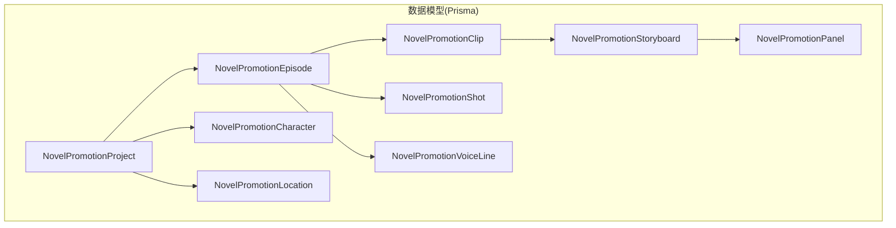
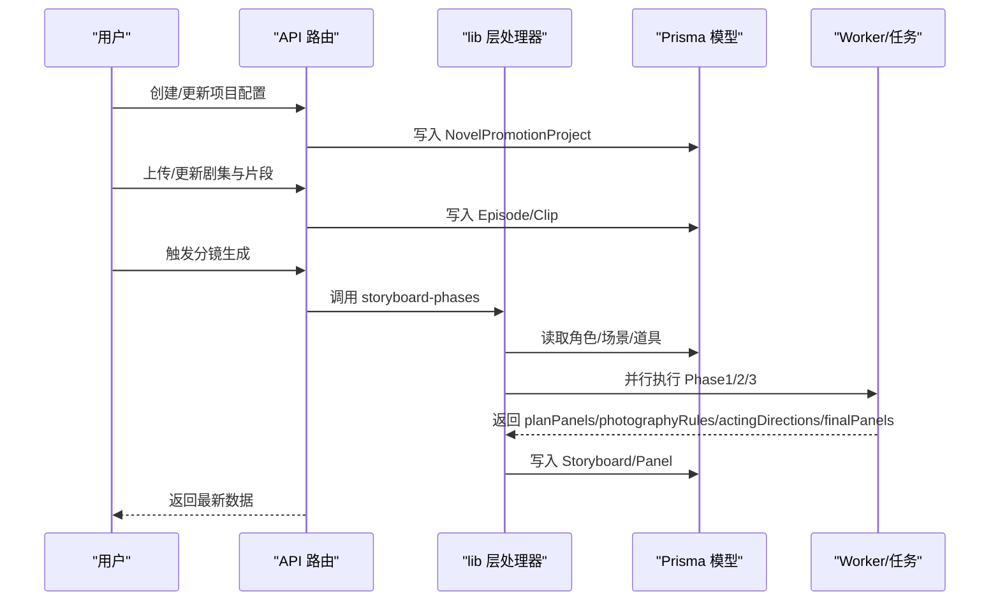
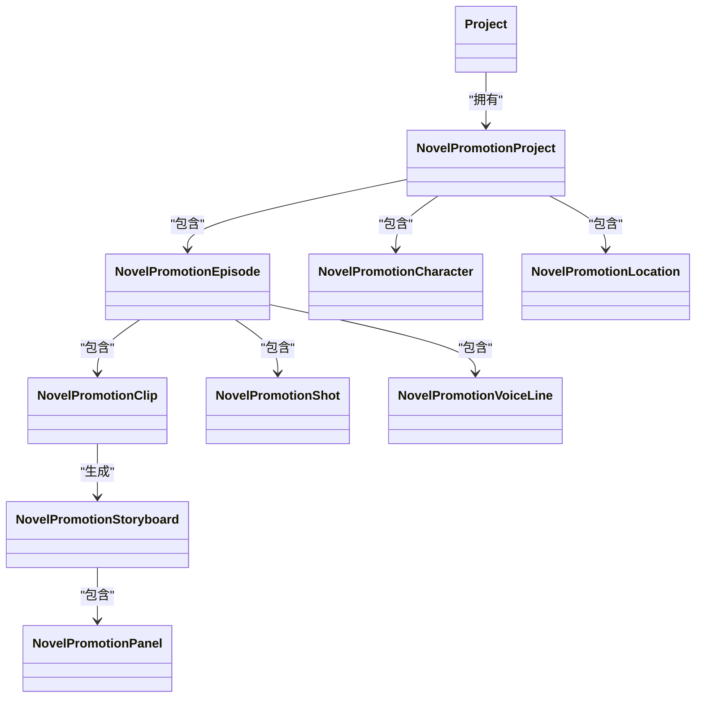
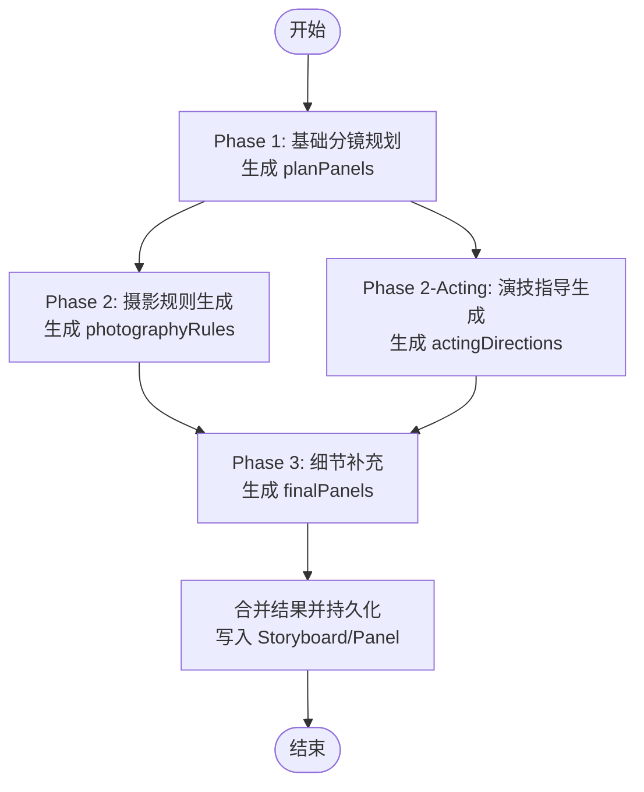
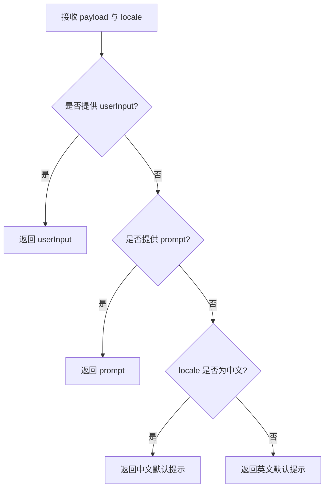
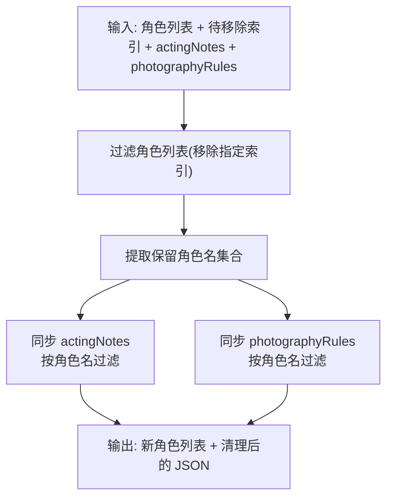
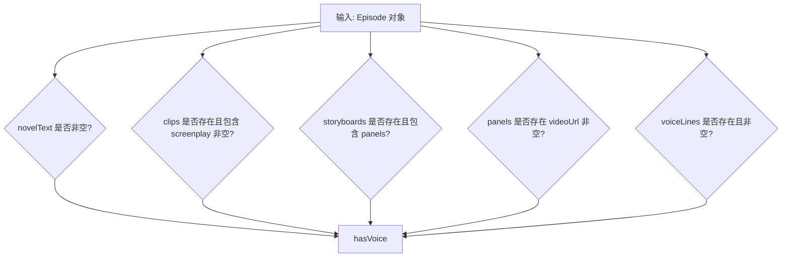
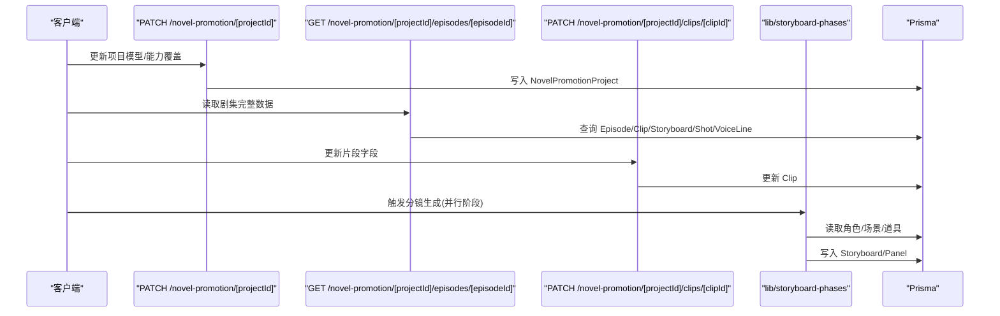
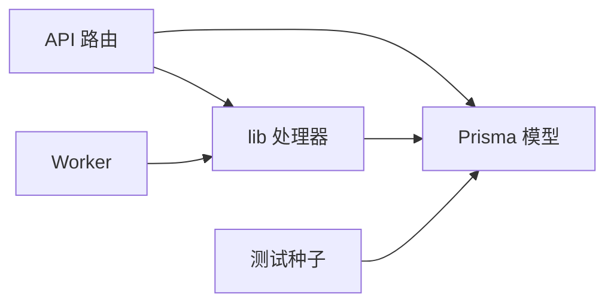

# 小说推广实体集合

<cite>
**本文引用的文件**
- [prisma/schema.prisma](file://prisma/schema.prisma)
- [src/lib/novel-promotion/insert-panel.ts](file://src/lib/novel-promotion/insert-panel.ts)
- [src/lib/novel-promotion/insert-panel-prompt-context.ts](file://src/lib/novel-promotion/insert-panel-prompt-context.ts)
- [src/lib/novel-promotion/panel-ai-data-sync.ts](file://src/lib/novel-promotion/panel-ai-data-sync.ts)
- [src/lib/novel-promotion/stage-readiness.ts](file://src/lib/novel-promotion/stage-readiness.ts)
- [src/lib/storyboard-phases.ts](file://src/lib/storyboard-phases.ts)
- [src/app/api/novel-promotion/[projectId]/route.ts](file://src/app/api/novel-promotion/[projectId]/route.ts)
- [src/app/api/novel-promotion/[projectId]/episodes/[episodeId]/route.ts](file://src/app/api/novel-promotion/[projectId]/episodes/[episodeId]/route.ts)
- [src/app/api/novel-promotion/[projectId]/clips/[clipId]/route.ts](file://src/app/api/novel-promotion/[projectId]/clips/[clipId]/route.ts)
- [src/lib/workers/text.worker.ts](file://src/lib/workers/text.worker.ts)
- [src/lib/workers/handlers/script-to-storyboard-helpers.ts](file://src/lib/workers/handlers/script-to-storyboard-helpers.ts)
- [tests/system/helpers/seed.ts](file://tests/system/helpers/seed.ts)
</cite>

## 目录
1. [简介](#简介)
2. [项目结构](#项目结构)
3. [核心组件](#核心组件)
4. [架构总览](#架构总览)
5. [详细组件分析](#详细组件分析)
6. [依赖分析](#依赖分析)
7. [性能考量](#性能考量)
8. [故障排查指南](#故障排查指南)
9. [结论](#结论)
10. [附录](#附录)

## 简介
本文件系统性梳理 Waoowaoo 小说推广工作流中的核心实体集合，围绕 NovelPromotionCharacter、NovelPromotionEpisode、NovelPromotionLocation、NovelPromotionClip、NovelPromotionPanel、NovelPromotionShot、NovelPromotionStoryboard 等实体，解释其设计理念、字段语义、业务用途与相互关系；并结合分镜生成的多阶段流程与 API 使用路径，给出完整的工作流数据结构设计与实践建议。

## 项目结构
小说推广相关的核心数据模型集中在 Prisma Schema 中，配套的业务逻辑分布在 lib 层（如分镜阶段处理器、面板插入策略、AI 数据同步等）以及 API 路由层（负责读写实体与触发工作流）。测试辅助脚本提供了最小可用状态的种子数据，便于理解实体间的层级关系与典型数据形态。

图表来源
- [prisma/schema.prisma:79-146](file://prisma/schema.prisma#L79-L146)
- [prisma/schema.prisma:163-186](file://prisma/schema.prisma#L163-L186)
- [prisma/schema.prisma:276-307](file://prisma/schema.prisma#L276-L307)
- [prisma/schema.prisma:309-330](file://prisma/schema.prisma#L309-L330)
- [prisma/schema.prisma:188-242](file://prisma/schema.prisma#L188-L242)
- [prisma/schema.prisma:79-119](file://prisma/schema.prisma#L79-L119)
- [prisma/schema.prisma:483-509](file://prisma/schema.prisma#L483-L509)

章节来源
- [prisma/schema.prisma:79-146](file://prisma/schema.prisma#L79-L146)
- [prisma/schema.prisma:163-186](file://prisma/schema.prisma#L163-L186)
- [prisma/schema.prisma:276-330](file://prisma/schema.prisma#L276-L330)
- [prisma/schema.prisma:188-242](file://prisma/schema.prisma#L188-L242)
- [prisma/schema.prisma:79-119](file://prisma/schema.prisma#L79-L119)
- [prisma/schema.prisma:483-509](file://prisma/schema.prisma#L483-L509)

## 核心组件
本节对各实体进行字段定义、业务含义与使用场景的说明，并强调它们在小说推广工作流中的职责边界。

- NovelPromotionProject（项目）
  - 作用：承载全局配置与资产集合，绑定到具体 Project。
  - 关键字段：模型配置（analysisModel、characterModel、locationModel、storyboardModel、editModel、videoModel、audioModel）、画风（artStyle）、视频比例（videoRatio）、TTS 速率（ttsRate）、能力覆盖（capabilityOverrides）等。
  - 使用场景：统一配置与跨实体的资源选择。

- NovelPromotionCharacter（角色）
  - 作用：项目内角色主体，可关联多个外观（CharacterAppearance）。
  - 关键字段：名称、别名、配音（voiceId、voiceType、customVoiceMedia）、档案数据（profileData、profileConfirmed）、引入语（introduction）等。
  - 使用场景：角色创建、画像确认、音色绑定与外观迭代。

- NovelPromotionLocation（场景）
  - 作用：项目内场景主体，可关联多个场景图（LocationImage）。
  - 关键字段：名称、摘要（summary）、资产类型（assetKind，默认 location）、选中图（selectedImage）等。
  - 使用场景：场景设计、图库管理、可用槽位（availableSlots）标注。

- NovelPromotionEpisode（剧集）
  - 作用：承载小说文本、音频、SRT、分镜与配音行。
  - 关键字段：剧集编号（episodeNumber）、名称、描述、小说正文（novelText）、音频（audioUrl/audioMedia）、SRT（srtContent）、配音行（voiceLines）等。
  - 使用场景：章节切分、脚本转换、分镜与配音联动。

- NovelPromotionClip（片段）
  - 作用：基于剧集切分的连续剧情片段，承载角色、地点、道具、内容与剧本。
  - 关键字段：起止（start/end/duration）、摘要（summary）、地点（location）、角色（characters）、道具（props）、内容（content）、剧本（screenplay）等。
  - 使用场景：脚本到分镜的输入单元。

- NovelPromotionStoryboard（分镜）
  - 作用：以 Clip 为单位生成的分镜蓝图，包含面板集合与摄影计划。
  - 关键字段：面板数量（panelCount）、面板集合（panels）、故事板图像（storyboardImageUrl）、摄影计划（photographyPlan）、候选图（candidateImages）等。
  - 使用场景：分镜规划、摄影规则与演技指导的落地容器。

- NovelPromotionPanel（面板）
  - 作用：分镜中的单个画面单元，承载画面/视频提示词、历史、口型同步等。
  - 关键字段：索引（panelIndex）、编号（panelNumber）、镜头类型（shotType）、机位运动（cameraMove）、地点/角色/道具（location/characters/props）、SRT 片段（srtSegment）、画面/视频提示词（imagePrompt/videoPrompt）、图像/视频媒体（imageMedia/videoMedia）、口型同步（lipSyncVideoMedia）、草图/历史（sketchImageMedia/imageHistory）等。
  - 使用场景：画面/视频生成、口型同步、面板链接与变体生成。

- NovelPromotionShot（镜头）
  - 作用：面向生成的镜头级元数据，记录 SRT 时间窗、场景/角色/剧情提示、图像媒体等。
  - 关键字段：SRT 起止（srtStart/srtEnd/srtDuration）、序列/地点/角色/剧情（sequence/locations/characters/plot）、图像提示词（imagePrompt）、缩放/模块/焦点（scale/module/focus）、视角（pov）、图像媒体（imageMedia）等。
  - 使用场景：与面板/分镜解耦的镜头级数据沉淀。

- NovelPromotionVoiceLine（配音行）
  - 作用：与剧集绑定的台词行，支持匹配到面板或分镜。
  - 关键字段：行索引（lineIndex）、说话人（speaker）、内容（content）、音色预设（voicePresetId）、音频媒体（audioMedia）、情感提示（emotionPrompt/ emotionStrength）、匹配目标（matchedPanel/matchedStoryboard）等。
  - 使用场景：配音生成与面板/分镜的时序对齐。

章节来源
- [prisma/schema.prisma:244-274](file://prisma/schema.prisma#L244-L274)
- [prisma/schema.prisma:79-101](file://prisma/schema.prisma#L79-L101)
- [prisma/schema.prisma:103-119](file://prisma/schema.prisma#L103-L119)
- [prisma/schema.prisma:121-146](file://prisma/schema.prisma#L121-L146)
- [prisma/schema.prisma:163-186](file://prisma/schema.prisma#L163-L186)
- [prisma/schema.prisma:309-330](file://prisma/schema.prisma#L309-L330)
- [prisma/schema.prisma:188-242](file://prisma/schema.prisma#L188-L242)
- [prisma/schema.prisma:276-307](file://prisma/schema.prisma#L276-L307)
- [prisma/schema.prisma:483-509](file://prisma/schema.prisma#L483-L509)

## 架构总览
小说推广工作流以“项目-剧集-片段-分镜-面板”为主线，辅以角色、场景、镜头与配音行的支撑。API 路由负责读写与触发，lib 层提供分镜多阶段处理、面板插入策略与数据同步逻辑，测试脚本提供最小可用状态的种子数据。

图表来源
- [src/lib/storyboard-phases.ts:245-387](file://src/lib/storyboard-phases.ts#L245-L387)
- [src/lib/storyboard-phases.ts:390-487](file://src/lib/storyboard-phases.ts#L390-L487)
- [src/lib/storyboard-phases.ts:576-704](file://src/lib/storyboard-phases.ts#L576-L704)
- [src/app/api/novel-promotion/[projectId]/episodes/[episodeId]/route.ts](file://src/app/api/novel-promotion/[projectId]/episodes/[episodeId]/route.ts#L13-L60)
- [src/lib/workers/text.worker.ts:337-365](file://src/lib/workers/text.worker.ts#L337-L365)
- [src/lib/workers/handlers/script-to-storyboard-helpers.ts:257-292](file://src/lib/workers/handlers/script-to-storyboard-helpers.ts#L257-L292)

章节来源
- [src/lib/storyboard-phases.ts:245-704](file://src/lib/storyboard-phases.ts#L245-L704)
- [src/app/api/novel-promotion/[projectId]/episodes/[episodeId]/route.ts](file://src/app/api/novel-promotion/[projectId]/episodes/[episodeId]/route.ts#L13-L60)
- [src/lib/workers/text.worker.ts:337-365](file://src/lib/workers/text.worker.ts#L337-L365)
- [src/lib/workers/handlers/script-to-storyboard-helpers.ts:257-292](file://src/lib/workers/handlers/script-to-storyboard-helpers.ts#L257-L292)

## 详细组件分析

### 实体关系与层级
- 项目（Project） → 小说推广项目（NovelPromotionProject）
- 小说推广项目 → 剧集（NovelPromotionEpisode）
- 剧集 → 片段（NovelPromotionClip）
- 片段 → 分镜（NovelPromotionStoryboard）
- 分镜 → 面板（NovelPromotionPanel）
- 剧集 → 镜头（NovelPromotionShot）
- 剧集 → 配音行（NovelPromotionVoiceLine）
- 小说推广项目 → 角色（NovelPromotionCharacter）
- 小说推广项目 → 场景（NovelPromotionLocation）

图表来源
- [prisma/schema.prisma:244-274](file://prisma/schema.prisma#L244-L274)
- [prisma/schema.prisma:121-146](file://prisma/schema.prisma#L121-L146)
- [prisma/schema.prisma:163-186](file://prisma/schema.prisma#L163-L186)
- [prisma/schema.prisma:309-330](file://prisma/schema.prisma#L309-L330)
- [prisma/schema.prisma:188-242](file://prisma/schema.prisma#L188-L242)
- [prisma/schema.prisma:276-307](file://prisma/schema.prisma#L276-L307)
- [prisma/schema.prisma:483-509](file://prisma/schema.prisma#L483-L509)
- [prisma/schema.prisma:79-119](file://prisma/schema.prisma#L79-L119)

章节来源
- [prisma/schema.prisma:244-274](file://prisma/schema.prisma#L244-L274)
- [prisma/schema.prisma:121-146](file://prisma/schema.prisma#L121-L146)
- [prisma/schema.prisma:163-186](file://prisma/schema.prisma#L163-L186)
- [prisma/schema.prisma:309-330](file://prisma/schema.prisma#L309-L330)
- [prisma/schema.prisma:188-242](file://prisma/schema.prisma#L188-L242)
- [prisma/schema.prisma:276-307](file://prisma/schema.prisma#L276-L307)
- [prisma/schema.prisma:483-509](file://prisma/schema.prisma#L483-L509)
- [prisma/schema.prisma:79-119](file://prisma/schema.prisma#L79-L119)

### 分镜生成多阶段流程
分镜生成被拆分为三个阶段，分别负责“基础规划”“摄影规则”“演技指导”“细节补充”，并在 API 层并行执行与合并结果，确保在平台时间限制内完成。

图表来源
- [src/lib/storyboard-phases.ts:245-387](file://src/lib/storyboard-phases.ts#L245-L387)
- [src/lib/storyboard-phases.ts:390-487](file://src/lib/storyboard-phases.ts#L390-L487)
- [src/lib/storyboard-phases.ts:576-704](file://src/lib/storyboard-phases.ts#L576-L704)

章节来源
- [src/lib/storyboard-phases.ts:245-704](file://src/lib/storyboard-phases.ts#L245-L704)

### 面板插入与提示上下文
- 插入面板的用户输入解析：根据语言环境与显式输入选择默认提示。
- 插入面板的场景描述构建：基于相关场景与可用槽位生成描述文本，供 AI 生成新面板时参考。

图表来源
- [src/lib/novel-promotion/insert-panel.ts:14-24](file://src/lib/novel-promotion/insert-panel.ts#L14-L24)
- [src/lib/novel-promotion/insert-panel-prompt-context.ts:19-46](file://src/lib/novel-promotion/insert-panel-prompt-context.ts#L19-L46)

章节来源
- [src/lib/novel-promotion/insert-panel.ts:14-24](file://src/lib/novel-promotion/insert-panel.ts#L14-L24)
- [src/lib/novel-promotion/insert-panel-prompt-context.ts:19-46](file://src/lib/novel-promotion/insert-panel-prompt-context.ts#L19-L46)

### 面板 JSON 数据同步
当角色列表变更时，需同步清理与角色相关的 JSON 字段（如演技指导、摄影规则），保证数据一致性与结构正确性。

图表来源
- [src/lib/novel-promotion/panel-ai-data-sync.ts:140-154](file://src/lib/novel-promotion/panel-ai-data-sync.ts#L140-L154)

章节来源
- [src/lib/novel-promotion/panel-ai-data-sync.ts:140-154](file://src/lib/novel-promotion/panel-ai-data-sync.ts#L140-L154)

### 剧集阶段就绪度判定
通过剧集内的脚本、分镜、视频、配音等产物的存在与否，判断当前阶段的完成度，用于前端与工作流的状态推进。

图表来源
- [src/lib/novel-promotion/stage-readiness.ts:66-74](file://src/lib/novel-promotion/stage-readiness.ts#L66-L74)

章节来源
- [src/lib/novel-promotion/stage-readiness.ts:66-74](file://src/lib/novel-promotion/stage-readiness.ts#L66-L74)

### API 工作流示例（从片段到面板）
- 项目配置：通过路由更新项目模型与能力覆盖。
- 剧集读取：获取剧集、片段、分镜、镜头与配音行的聚合数据。
- 片段更新：更新角色、地点、道具、内容与剧本。
- 分镜生成：调用分镜阶段处理器，生成面板并持久化。

图表来源
- [src/app/api/novel-promotion/[projectId]/route.ts](file://src/app/api/novel-promotion/[projectId]/route.ts#L265-L345)
- [src/app/api/novel-promotion/[projectId]/episodes/[episodeId]/route.ts](file://src/app/api/novel-promotion/[projectId]/episodes/[episodeId]/route.ts#L13-L60)
- [src/app/api/novel-promotion/[projectId]/clips/[clipId]/route.ts](file://src/app/api/novel-promotion/[projectId]/clips/[clipId]/route.ts#L11-L50)
- [src/lib/storyboard-phases.ts:245-704](file://src/lib/storyboard-phases.ts#L245-L704)

章节来源
- [src/app/api/novel-promotion/[projectId]/route.ts](file://src/app/api/novel-promotion/[projectId]/route.ts#L265-L345)
- [src/app/api/novel-promotion/[projectId]/episodes/[episodeId]/route.ts](file://src/app/api/novel-promotion/[projectId]/episodes/[episodeId]/route.ts#L13-L60)
- [src/app/api/novel-promotion/[projectId]/clips/[clipId]/route.ts](file://src/app/api/novel-promotion/[projectId]/clips/[clipId]/route.ts#L11-L50)
- [src/lib/storyboard-phases.ts:245-704](file://src/lib/storyboard-phases.ts#L245-L704)

## 依赖分析
- Prisma Schema 定义了实体与外键约束，确保数据完整性与查询效率。
- lib 层处理器（如 storyboard-phases）依赖 Prisma 读取资产上下文，同时通过 Worker 执行 AI 步骤。
- API 路由负责鉴权、参数校验与数据转换，调用 lib 与 Prisma 完成端到端流程。
- 测试脚本提供最小种子数据，验证实体关系与典型数据形态。

图表来源
- [src/lib/storyboard-phases.ts:245-704](file://src/lib/storyboard-phases.ts#L245-L704)
- [src/app/api/novel-promotion/[projectId]/episodes/[episodeId]/route.ts](file://src/app/api/novel-promotion/[projectId]/episodes/[episodeId]/route.ts#L13-L60)
- [tests/system/helpers/seed.ts:14-184](file://tests/system/helpers/seed.ts#L14-L184)

章节来源
- [src/lib/storyboard-phases.ts:245-704](file://src/lib/storyboard-phases.ts#L245-L704)
- [src/app/api/novel-promotion/[projectId]/episodes/[episodeId]/route.ts](file://src/app/api/novel-promotion/[projectId]/episodes/[episodeId]/route.ts#L13-L60)
- [tests/system/helpers/seed.ts:14-184](file://tests/system/helpers/seed.ts#L14-L184)

## 性能考量
- 分镜生成阶段拆分与并行执行，降低单次请求耗时风险。
- 使用唯一索引与外键约束，提升查询与级联删除的稳定性。
- 面板 JSON 同步在角色变更时批量清理，避免冗余数据膨胀。
- 项目级能力覆盖与模型配置缓存，减少重复解析成本。

## 故障排查指南
- 分镜生成失败：检查分析模型配置、片段字段完整性（characters/location/props/screenplay）、以及阶段输出的 JSON 结构与 source_text 字段。
- 面板数据异常：核对角色列表与演技指导/摄影规则的同步结果，确保角色名一致。
- 媒体对象引用：确认 imageMedia/videoMedia/lipSyncVideoMedia 等媒体对象存在且可访问。
- 权限与鉴权：确认路由参数与项目归属校验通过，避免越权访问。

章节来源
- [src/lib/storyboard-phases.ts:218-242](file://src/lib/storyboard-phases.ts#L218-L242)
- [src/lib/novel-promotion/panel-ai-data-sync.ts:140-154](file://src/lib/novel-promotion/panel-ai-data-sync.ts#L140-L154)
- [src/app/api/novel-promotion/[projectId]/episodes/[episodeId]/route.ts](file://src/app/api/novel-promotion/[projectId]/episodes/[episodeId]/route.ts#L13-L60)

## 结论
小说推广实体集合以清晰的层级与职责划分支撑了从角色/场景设计到片段、分镜、面板与配音的完整工作流。借助分镜多阶段处理器与 API 路由的协同，系统实现了高扩展性与可控的性能表现。通过测试种子与工具函数，开发者可以快速理解并验证数据结构与流程。

## 附录
- 最小种子数据包含：项目、剧集、片段、分镜、面板、角色、外观、场景、场景图、配音行等，便于本地调试与集成测试。

章节来源
- [tests/system/helpers/seed.ts:14-184](file://tests/system/helpers/seed.ts#L14-L184)