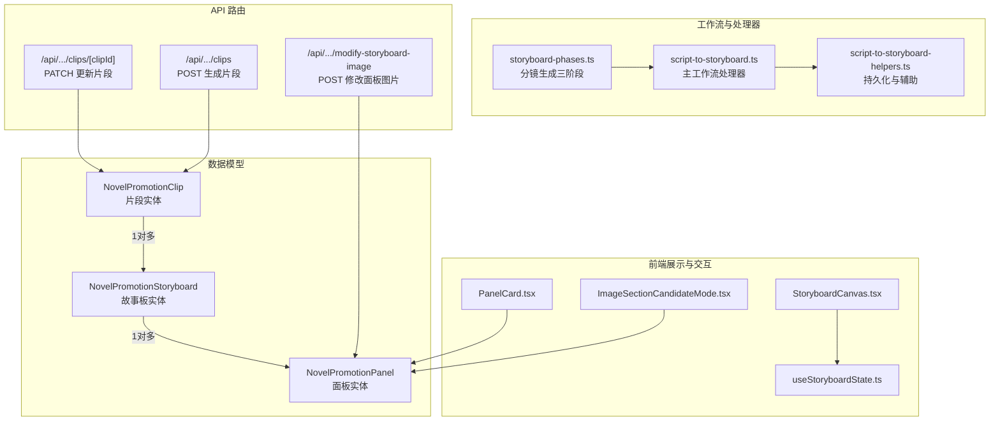
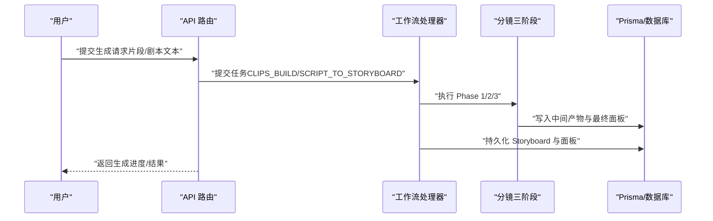
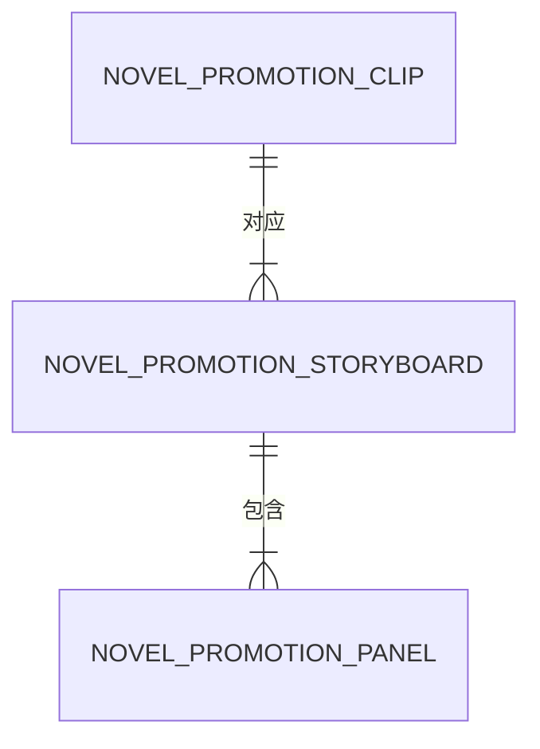
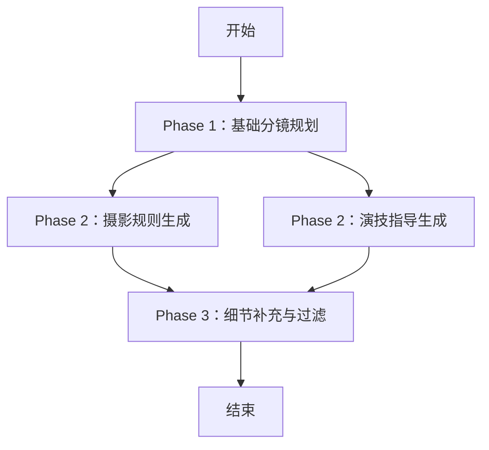
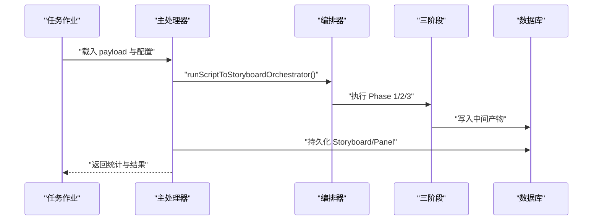
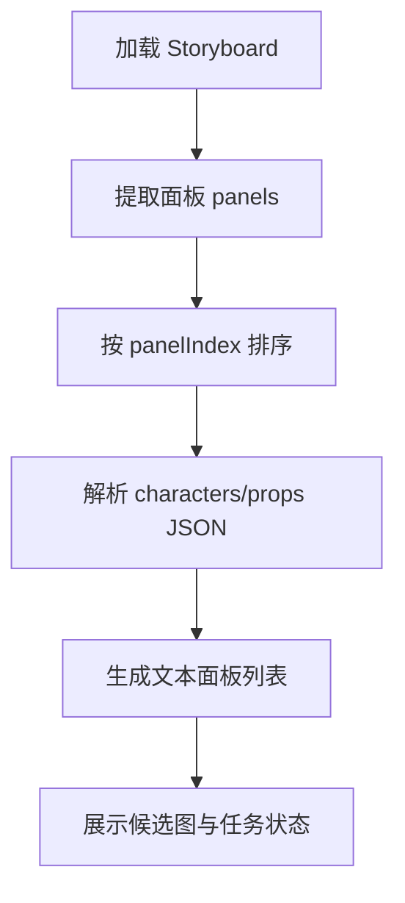
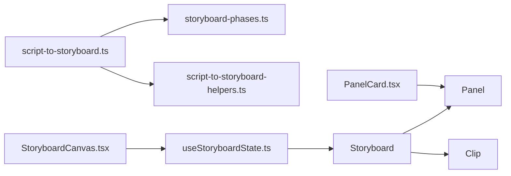

# 故事板实体

<cite>
**本文引用的文件**
- [prisma/schema.prisma](file://prisma/schema.prisma)
- [prisma/schema.sqlit.prisma](file://prisma/schema.sqlit.prisma)
- [src/types/project.ts](file://src/types/project.ts)
- [src/types/storyboard-types.ts](file://src/types/storyboard-types.ts)
- [src/lib/storyboard-phases.ts](file://src/lib/storyboard-phases.ts)
- [src/lib/workers/handlers/script-to-storyboard.ts](file://src/lib/workers/handlers/script-to-storyboard.ts)
- [src/lib/workers/handlers/script-to-storyboard-helpers.ts](file://src/lib/workers/handlers/script-to-storyboard-helpers.ts)
- [src/app/api/novel-promotion/[projectId]/clips/[clipId]/route.ts](file://src/app/api/novel-promotion/[projectId]/clips/[clipId]/route.ts)
- [src/app/api/novel-promotion/[projectId]/clips/route.ts](file://src/app/api/novel-promotion/[projectId]/clips/route.ts)
- [src/app/api/novel-promotion/[projectId]/modify-storyboard-image/route.ts](file://src/app/api/novel-promotion/[projectId]/modify-storyboard-image/route.ts)
- [src/app/[locale]/workspace/[projectId]/modes/novel-promotion/components/storyboard/hooks/useStoryboardState.ts](file://src/app/[locale]/workspace/[projectId]/modes/novel-promotion/components/storyboard/hooks/useStoryboardState.ts)
- [src/app/[locale]/workspace/[projectId]/modes/novel-promotion/components/storyboard/StoryboardGroup.types.ts](file://src/app/[locale]/workspace/[projectId]/modes/novel-promotion/components/storyboard/StoryboardGroup.types.ts)
- [src/app/[locale]/workspace/[projectId]/modes/novel-promotion/components/storyboard/StoryboardCanvas.tsx](file://src/app/[locale]/workspace/[projectId]/modes/novel-promotion/components/storyboard/StoryboardCanvas.tsx)
- [src/app/[locale]/workspace/[projectId]/modes/novel-promotion/components/storyboard/PanelCard.tsx](file://src/app/[locale]/workspace/[projectId]/modes/novel-promotion/components/storyboard/PanelCard.tsx)
- [src/app/[locale]/workspace/[projectId]/modes/novel-promotion/components/storyboard/ImageSectionCandidateMode.tsx](file://src/app/[locale]/workspace/[projectId]/modes/novel-promotion/components/storyboard/ImageSectionCandidateMode.tsx)
</cite>

## 目录
1. [简介](#简介)
2. [项目结构](#项目结构)
3. [核心组件](#核心组件)
4. [架构总览](#架构总览)
5. [详细组件分析](#详细组件分析)
6. [依赖关系分析](#依赖关系分析)
7. [性能考量](#性能考量)
8. [故障排查指南](#故障排查指南)
9. [结论](#结论)
10. [附录](#附录)

## 简介
本文件围绕 Waoowaoo 小说推广模式中的“故事板实体”进行系统化技术文档化，重点阐释 NovelPromotionStoryboard 的设计理念、数据模型、与片段（Clip）与面板（Panel）的关系，以及在小说推广工作流中的关键作用。文档同时覆盖故事板的自动生成、编辑与优化流程，并提供完整的 API 接口说明与使用示例，帮助开发者理解故事板作为视频分镜蓝图的重要地位。

## 项目结构
故事板实体位于小说推广模式的后端数据模型与前端展示层之间，通过 Prisma 数据模型定义、工作流处理器驱动生成、API 路由暴露、前端组件渲染与交互，形成从“文本脚本到视频分镜”的闭环。

图表来源
- [prisma/schema.prisma:309-330](file://prisma/schema.prisma#L309-L330)
- [src/lib/workers/handlers/script-to-storyboard.ts:60-565](file://src/lib/workers/handlers/script-to-storyboard.ts#L60-L565)
- [src/lib/storyboard-phases.ts:244-705](file://src/lib/storyboard-phases.ts#L244-L705)
- [src/app/api/novel-promotion/[projectId]/clips/[clipId]/route.ts](file://src/app/api/novel-promotion/[projectId]/clips/[clipId]/route.ts#L11-L51)
- [src/app/api/novel-promotion/[projectId]/clips/route.ts](file://src/app/api/novel-promotion/[projectId]/clips/route.ts#L11-L49)
- [src/app/api/novel-promotion/[projectId]/modify-storyboard-image/route.ts](file://src/app/api/novel-promotion/[projectId]/modify-storyboard-image/route.ts#L19-L133)
- [src/app/[locale]/workspace/[projectId]/modes/novel-promotion/components/storyboard/StoryboardCanvas.tsx](file://src/app/[locale]/workspace/[projectId]/modes/novel-promotion/components/storyboard/StoryboardCanvas.tsx#L136-L145)

章节来源
- [prisma/schema.prisma:309-330](file://prisma/schema.prisma#L309-L330)
- [prisma/schema.sqlit.prisma:303-324](file://prisma/schema.sqlit.prisma#L303-L324)
- [src/types/project.ts:201-214](file://src/types/project.ts#L201-L214)

## 核心组件
- 故事板实体（NovelPromotionStoryboard）
  - 关键字段：id、episodeId、clipId（唯一）、panelCount（默认9）、storyboardTextJson、storyboardImageUrl、candidateImages、lastError、photographyPlan；并维护与面板的 1 对多关系。
  - 与片段（Clip）：通过 clipId 关联，一个 Clip 对应一个 Storyboard。
  - 与面板（Panel）：通过 panels 字段加载，每个 Storyboard 包含若干 Panel。
- 面板实体（NovelPromotionPanel）
  - 关键字段：panelIndex、panelNumber、shotType、cameraMove、description、location、characters、props、srtSegment、videoPrompt、imageHistory、candidateImages、imageUrl、videoUrl、photographyRules、actingNotes 等。
- 分镜生成三阶段（storyboard-phases.ts）
  - Phase 1：基础分镜规划
  - Phase 2：摄影规则生成（并行：摄影与演技两个子阶段）
  - Phase 3：镜头细节补充与过滤
- 工作流处理器（script-to-storyboard.ts）
  - 负责编排三阶段、持久化输出、生成语音行、创建工件与进度上报。
- 前端状态与展示（useStoryboardState.ts、StoryboardCanvas.tsx、PanelCard.tsx、ImageSectionCandidateMode.tsx）
  - 提供面板排序、候选图解析、错误展示、任务状态呈现等。

章节来源
- [src/types/project.ts:162-199](file://src/types/project.ts#L162-L199)
- [src/types/project.ts:201-214](file://src/types/project.ts#L201-L214)
- [src/lib/storyboard-phases.ts:244-705](file://src/lib/storyboard-phases.ts#L244-L705)
- [src/lib/workers/handlers/script-to-storyboard.ts:60-565](file://src/lib/workers/handlers/script-to-storyboard.ts#L60-L565)
- [src/app/[locale]/workspace/[projectId]/modes/novel-promotion/components/storyboard/hooks/useStoryboardState.ts](file://src/app/[locale]/workspace/[projectId]/modes/novel-promotion/components/storyboard/hooks/useStoryboardState.ts#L107-L139)
- [src/app/[locale]/workspace/[projectId]/modes/novel-promotion/components/storyboard/StoryboardCanvas.tsx](file://src/app/[locale]/workspace/[projectId]/modes/novel-promotion/components/storyboard/StoryboardCanvas.tsx#L136-L145)
- [src/app/[locale]/workspace/[projectId]/modes/novel-promotion/components/storyboard/PanelCard.tsx](file://src/app/[locale]/workspace/[projectId]/modes/novel-promotion/components/storyboard/PanelCard.tsx#L1-L14)
- [src/app/[locale]/workspace/[projectId]/modes/novel-promotion/components/storyboard/ImageSectionCandidateMode.tsx](file://src/app/[locale]/workspace/[projectId]/modes/novel-promotion/components/storyboard/ImageSectionCandidateMode.tsx#L1-L40)

## 架构总览
故事板在小说推广工作流中的位置如下：

图表来源
- [src/app/api/novel-promotion/[projectId]/clips/route.ts](file://src/app/api/novel-promotion/[projectId]/clips/route.ts#L11-L49)
- [src/lib/workers/handlers/script-to-storyboard.ts:60-565](file://src/lib/workers/handlers/script-to-storyboard.ts#L60-L565)
- [src/lib/storyboard-phases.ts:244-705](file://src/lib/storyboard-phases.ts#L244-L705)
- [prisma/schema.prisma:309-330](file://prisma/schema.prisma#L309-L330)

## 详细组件分析

### 数据模型与关系
- 故事板与片段、面板的关系
  - 一个 Clip 对应一个 Storyboard（clipId 唯一），Storyboard 内部包含多个 Panel（按 panelIndex 排序）。
  - Storyboard 与 Panel 通过外键关联，删除时级联。
- 关键字段说明
  - panelCount：默认 9，表示故事板建议面板数量。
  - storyboardTextJson：故事板文本描述或结构化 JSON。
  - storyboardImageUrl：故事板封面或预览图 URL。
  - candidateImages：候选图片集合（JSON 字符串）。
  - lastError：最后一次生成失败的错误信息。
  - photographyPlan：摄影方案 JSON。
  - panels：已加载的面板集合（用于前端渲染）。

图表来源
- [prisma/schema.prisma:309-330](file://prisma/schema.prisma#L309-L330)
- [prisma/schema.sqlit.prisma:303-324](file://prisma/schema.sqlit.prisma#L303-L324)

章节来源
- [prisma/schema.prisma:309-330](file://prisma/schema.prisma#L309-L330)
- [prisma/schema.sqlit.prisma:303-324](file://prisma/schema.sqlit.prisma#L303-L324)
- [src/types/project.ts:201-214](file://src/types/project.ts#L201-L214)
- [src/types/project.ts:162-199](file://src/types/project.ts#L162-L199)

### 分镜生成三阶段
- Phase 1：基础分镜规划
  - 输入：片段内容、角色/场景/道具上下文、可选剧本 JSON。
  - 输出：基础面板数组（含描述、地点、角色、props、source_text 等）。
  - 错误处理：空面板、缺失 source_text 时重试。
- Phase 2：摄影规则与演技指导（并行）
  - 摄影规则：基于面板与场景/角色/道具描述生成摄影规则。
  - 演技指导：基于角色描述生成演技指导。
  - 合并与持久化：与 Phase 1 结果合并，写入中间工件。
- Phase 3：细节补充与过滤
  - 补充 video_prompt、细化描述，过滤无效面板。
  - 输出最终面板数组，写入工件与数据库。

图表来源
- [src/lib/storyboard-phases.ts:244-705](file://src/lib/storyboard-phases.ts#L244-L705)

章节来源
- [src/lib/storyboard-phases.ts:244-705](file://src/lib/storyboard-phases.ts#L244-L705)

### 工作流处理器与持久化
- 主处理器职责
  - 解析项目与片段数据，选择分析模型，构建提示词模板。
  - 并行执行 Phase 2 子阶段，串行执行 Phase 1/3。
  - 创建工件（artifact）记录各阶段输出，持久化 Storyboard 与面板。
  - 生成语音行并持久化，上报进度。
- 持久化逻辑
  - 将最终面板写入 NovelPromotionPanel，建立与 Storyboard 的关系。
  - 更新 Storyboard 的 storyboardTextJson、candidateImages、lastError、photographyPlan 等字段。

图表来源
- [src/lib/workers/handlers/script-to-storyboard.ts:60-565](file://src/lib/workers/handlers/script-to-storyboard.ts#L60-L565)
- [src/lib/workers/handlers/script-to-storyboard-helpers.ts:257-292](file://src/lib/workers/handlers/script-to-storyboard-helpers.ts#L257-L292)

章节来源
- [src/lib/workers/handlers/script-to-storyboard.ts:60-565](file://src/lib/workers/handlers/script-to-storyboard.ts#L60-L565)
- [src/lib/workers/handlers/script-to-storyboard-helpers.ts:257-292](file://src/lib/workers/handlers/script-to-storyboard-helpers.ts#L257-L292)

### 前端状态与展示
- 面板排序与渲染
  - 使用 panelIndex 对面板进行排序，生成文本面板列表，支持 description、location、characters、props 等字段展示。
- 候选图解析
  - 通过 getPanelCandidates 解析 panel.imageHistory（JSON 字符串）为候选图数组。
- 错误与任务状态
  - 展示 storyboard.lastError，结合任务状态（imageTaskRunning、videoTaskRunning）与错误消息（imageErrorMessage）。

图表来源
- [src/app/[locale]/workspace/[projectId]/modes/novel-promotion/components/storyboard/hooks/useStoryboardState.ts](file://src/app/[locale]/workspace/[projectId]/modes/novel-promotion/components/storyboard/hooks/useStoryboardState.ts#L107-L139)
- [src/types/storyboard-types.ts:40-49](file://src/types/storyboard-types.ts#L40-L49)

章节来源
- [src/app/[locale]/workspace/[projectId]/modes/novel-promotion/components/storyboard/hooks/useStoryboardState.ts](file://src/app/[locale]/workspace/[projectId]/modes/novel-promotion/components/storyboard/hooks/useStoryboardState.ts#L107-L139)
- [src/types/storyboard-types.ts:40-49](file://src/types/storyboard-types.ts#L40-L49)

### API 接口与使用示例

- 生成片段（第二步：片段切分）
  - 方法：POST
  - 路径：/api/novel-promotion/{projectId}/clips
  - 请求体：{ episodeId: string }
  - 响应：异步任务提交成功或错误码
  - 示例：提交后触发 CLIPS_BUILD 任务，生成多个 Clip

- 更新片段信息
  - 方法：PATCH
  - 路径：/api/novel-promotion/{projectId}/clips/{clipId}
  - 请求体：{ characters?: string, location?: string, props?: string, content?: string, screenplay?: string }
  - 响应：{ success: true, clip }

- 修改面板图片（生成/替换图片）
  - 方法：POST
  - 路径：/api/novel-promotion/{projectId}/modify-storyboard-image
  - 请求体：
    - storyboardId: string
    - panelIndex: number
    - modifyPrompt: string
    - extraImageUrls?: string[]
    - selectedAssets?: { imageUrl: string; ... }[]
    - meta?: object
  - 响应：任务提交结果（去重键 modify_storyboard_image:{panelId}）

章节来源
- [src/app/api/novel-promotion/[projectId]/clips/route.ts](file://src/app/api/novel-promotion/[projectId]/clips/route.ts#L11-L49)
- [src/app/api/novel-promotion/[projectId]/clips/[clipId]/route.ts](file://src/app/api/novel-promotion/[projectId]/clips/[clipId]/route.ts#L11-L51)
- [src/app/api/novel-promotion/[projectId]/modify-storyboard-image/route.ts](file://src/app/api/novel-promotion/[projectId]/modify-storyboard-image/route.ts#L19-L133)

## 依赖关系分析
- 模型耦合
  - Storyboard 与 Panel：强关联（1 对多），删除级联。
  - Storyboard 与 Clip：一对一（clipId 唯一），通过外键约束。
- 处理器依赖
  - script-to-storyboard.ts 依赖 storyboard-phases.ts 的三阶段实现与 script-to-storyboard-helpers.ts 的持久化逻辑。
- 前端依赖
  - useStoryboardState.ts 依赖 StoryboardWithPanels 类型与 getPanels/getPanelCandidates 工具。
  - StoryboardCanvas.tsx 依赖 StoryboardGroup.types.ts 的 Props 定义与任务状态管理。

图表来源
- [prisma/schema.prisma:309-330](file://prisma/schema.prisma#L309-L330)
- [src/lib/workers/handlers/script-to-storyboard.ts:60-565](file://src/lib/workers/handlers/script-to-storyboard.ts#L60-L565)
- [src/lib/storyboard-phases.ts:244-705](file://src/lib/storyboard-phases.ts#L244-L705)
- [src/lib/workers/handlers/script-to-storyboard-helpers.ts:257-292](file://src/lib/workers/handlers/script-to-storyboard-helpers.ts#L257-L292)
- [src/app/[locale]/workspace/[projectId]/modes/novel-promotion/components/storyboard/hooks/useStoryboardState.ts](file://src/app/[locale]/workspace/[projectId]/modes/novel-promotion/components/storyboard/hooks/useStoryboardState.ts#L107-L139)
- [src/app/[locale]/workspace/[projectId]/modes/novel-promotion/components/storyboard/StoryboardCanvas.tsx](file://src/app/[locale]/workspace/[projectId]/modes/novel-promotion/components/storyboard/StoryboardCanvas.tsx#L136-L145)
- [src/app/[locale]/workspace/[projectId]/modes/novel-promotion/components/storyboard/PanelCard.tsx](file://src/app/[locale]/workspace/[projectId]/modes/novel-promotion/components/storyboard/PanelCard.tsx#L1-L14)

章节来源
- [prisma/schema.prisma:309-330](file://prisma/schema.prisma#L309-L330)
- [src/lib/workers/handlers/script-to-storyboard.ts:60-565](file://src/lib/workers/handlers/script-to-storyboard.ts#L60-L565)
- [src/app/[locale]/workspace/[projectId]/modes/novel-promotion/components/storyboard/hooks/useStoryboardState.ts](file://src/app/[locale]/workspace/[projectId]/modes/novel-promotion/components/storyboard/hooks/useStoryboardState.ts#L107-L139)

## 性能考量
- 分阶段与并行
  - Phase 2 下的摄影与演技生成并行，缩短整体耗时。
- 重试机制
  - Phase 1/2/3 在 JSON 解析失败或空数据时自动重试一次，提升稳定性。
- 任务并发与配额
  - 工作流根据用户并发配置与模型能力选项动态调整推理努力程度与温度，避免超时与资源争用。
- 前端渲染优化
  - 仅在需要时解析 JSON（如 candidateImages），减少不必要的计算。

## 故障排查指南
- 常见错误与定位
  - lastError：故事板生成失败时记录的错误信息，前端可直接展示。
  - imageErrorMessage：面板图片生成失败的错误消息。
  - INVALID_PARAMS/NOT_FOUND：API 参数校验失败或目标未找到。
- 排查步骤
  - 检查 Storyboard.lastError 与 Panel.imageErrorMessage。
  - 确认片段 characters/location/props/screenplay 是否正确传入。
  - 确认 modify-storyboard-image 请求体中的 storyboardId、panelIndex、modifyPrompt 是否有效。
  - 查看工作流日志（AI 分析日志与工件）定位三阶段具体失败点。

章节来源
- [src/app/[locale]/workspace/[projectId]/modes/novel-promotion/components/storyboard/StoryboardCanvas.tsx](file://src/app/[locale]/workspace/[projectId]/modes/novel-promotion/components/storyboard/StoryboardCanvas.tsx#L136-L145)
- [src/app/api/novel-promotion/[projectId]/modify-storyboard-image/route.ts](file://src/app/api/novel-promotion/[projectId]/modify-storyboard-image/route.ts#L35-L50)

## 结论
NovelPromotionStoryboard 作为小说推广工作流的核心蓝图，通过三阶段分镜生成、并行摄影与演技设计、以及严格的持久化与错误处理机制，实现了从文本到视频分镜的自动化与可控化。其与 Clip、Panel 的清晰关系，配合完善的 API 与前端展示，使开发者能够高效地构建、编辑与优化故事板，支撑高质量视频内容的生产。

## 附录
- 相关类型与工具
  - StoryboardWithPanels、hasLoadedPanels、getPanels、getPanelCandidates
- 前端交互要点
  - 候选图选择与确认、任务状态展示、错误提示与重试

章节来源
- [src/types/storyboard-types.ts:12-49](file://src/types/storyboard-types.ts#L12-L49)
- [src/app/[locale]/workspace/[projectId]/modes/novel-promotion/components/storyboard/ImageSectionCandidateMode.tsx](file://src/app/[locale]/workspace/[projectId]/modes/novel-promotion/components/storyboard/ImageSectionCandidateMode.tsx#L1-L40)