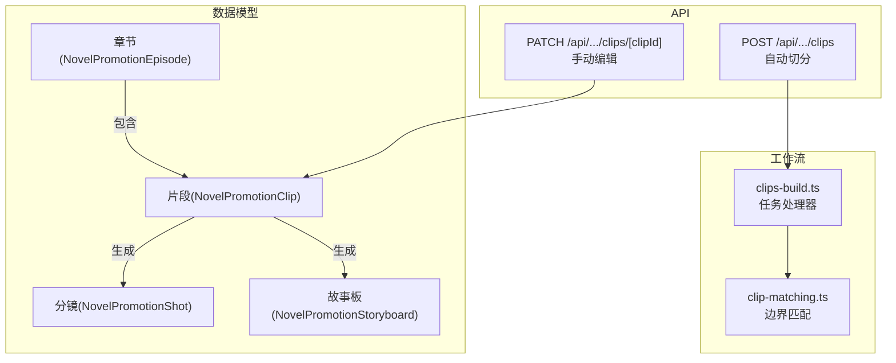
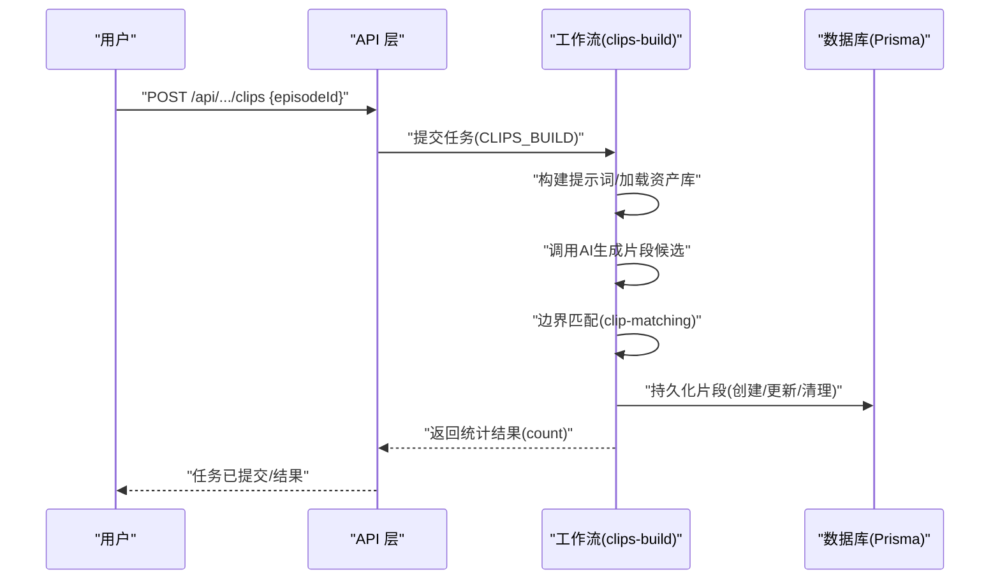
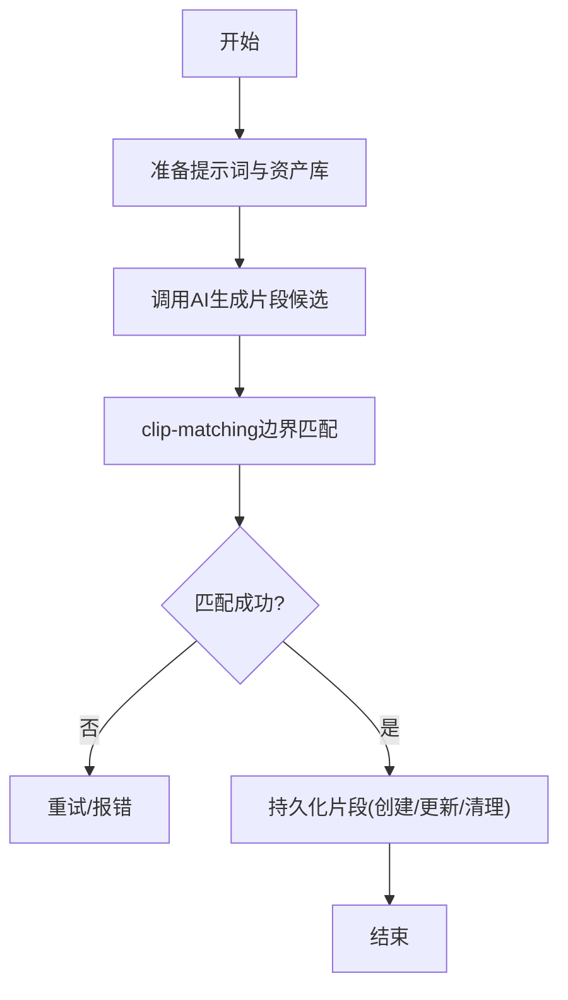
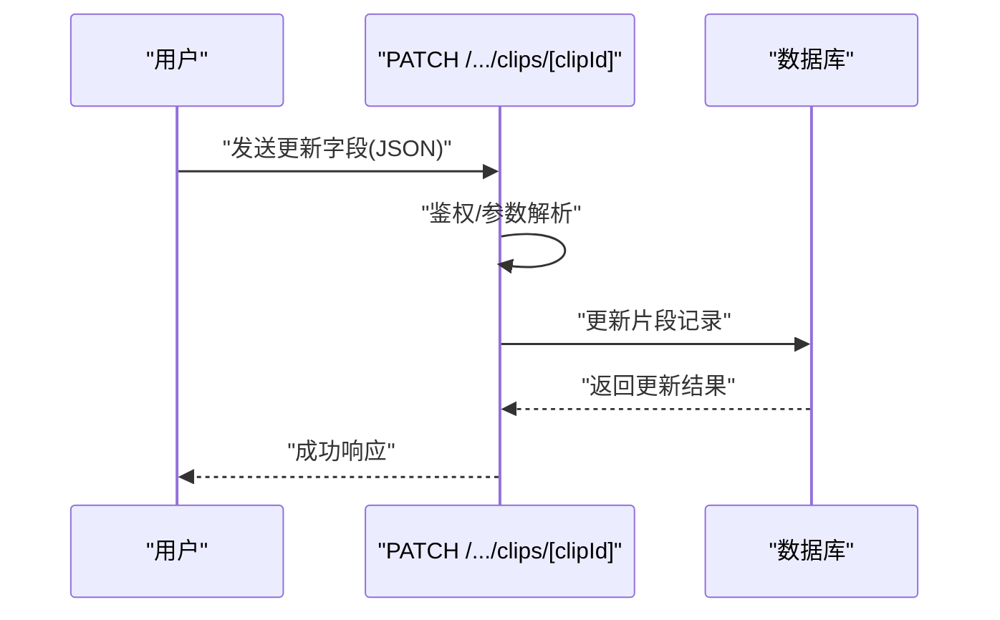
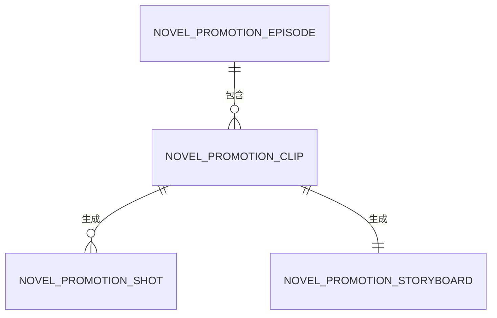
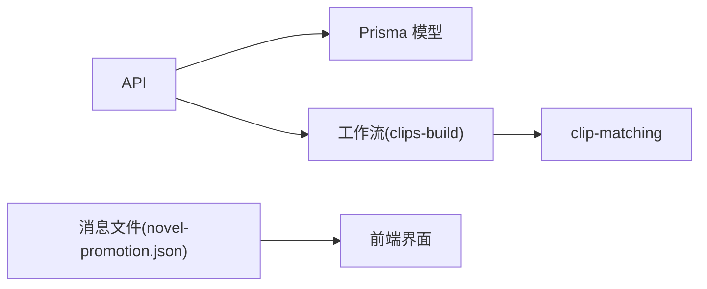

# 片段实体

<cite>
**本文引用的文件**
- [schema.prisma](file://prisma/schema.prisma)
- [clips/route.ts](file://src/app/api/novel-promotion/[projectId]/clips/route.ts)
- [clips/[clipId]/route.ts](file://src/app/api/novel-promotion/[projectId]/clips/[clipId]/route.ts)
- [clips-build.ts](file://src/lib/workers/handlers/clips-build.ts)
- [clip-matching.ts](file://src/lib/novel-promotion/story-to-script/clip-matching.ts)
- [script-to-storyboard-atomic-retry.ts](file://src/lib/workers/handlers/script-to-storyboard-atomic-retry.ts)
- [crud-routes.test.ts](file://tests/integration/api/contract/crud-routes.test.ts)
- [clips-build.test.ts](file://tests/unit/worker/clips-build.test.ts)
- [novel-promotion.json](file://messages/zh/novel-promotion.json)
</cite>

## 目录
1. [引言](#引言)
2. [项目结构](#项目结构)
3. [核心组件](#核心组件)
4. [架构总览](#架构总览)
5. [详细组件分析](#详细组件分析)
6. [依赖分析](#依赖分析)
7. [性能考虑](#性能考虑)
8. [故障排查指南](#故障排查指南)
9. [结论](#结论)
10. [附录](#附录)

## 引言
本文件围绕 Waoowaoo 小说推广工作流中的“片段实体”（NovelPromotionClip）进行系统化说明。目标读者包括开发者与产品/运营人员，帮助理解：
- 片段实体的设计理念与字段含义（时间锚点、摘要、场景、角色、道具、内容等）
- 片段与章节、分镜、故事板之间的关系
- 片段在工作流中的作用与流转
- 片段的自动分割机制与手动编辑能力
- 片段的创建、编辑、删除 API 接口与使用示例

## 项目结构
与片段实体直接相关的代码分布在以下区域：
- 数据模型层：Prisma Schema 中定义了片段实体及其与章节、分镜、故事板的关联
- API 层：提供片段的创建（自动切分）与更新（手动编辑）接口
- 工作流层：负责将小说文本切分为片段，并持久化到数据库
- 匹配工具：提供边界匹配算法，确保 AI 生成的片段边界能可靠落回到原文本
- 测试与国际化：覆盖接口契约与单元测试，同时提供文案支撑

**图表来源**
- [schema.prisma](file://prisma/schema.prisma)
- [clips/route.ts](file://src/app/api/novel-promotion/[projectId]/clips/route.ts)
- [clips/[clipId]/route.ts](file://src/app/api/novel-promotion/[projectId]/clips/[clipId]/route.ts)
- [clips-build.ts](file://src/lib/workers/handlers/clips-build.ts)
- [clip-matching.ts](file://src/lib/novel-promotion/story-to-script/clip-matching.ts)

**章节来源**
- [schema.prisma](file://prisma/schema.prisma)
- [clips/route.ts](file://src/app/api/novel-promotion/[projectId]/clips/route.ts)
- [clips/[clipId]/route.ts](file://src/app/api/novel-promotion/[projectId]/clips/[clipId]/route.ts)
- [clips-build.ts](file://src/lib/workers/handlers/clips-build.ts)
- [clip-matching.ts](file://src/lib/novel-promotion/story-to-script/clip-matching.ts)

## 核心组件
- 片段实体（NovelPromotionClip）
  - 所属章节：episodeId
  - 时间锚点：start、end（整数，可选）、startText、endText（字符串，可选）
  - 内容摘要：summary（必填）
  - 场景描述：location（可选）
  - 角色与道具：characters（JSON 数组字符串，可选）、props（JSON 数组字符串，可选）
  - 文本内容：content（必填，片段在原文中的实际内容）
  - 衍生数据：shotCount（可选）、screenplay（JSON 字符串，可选）
  - 关系：属于一个章节；可生成若干分镜与一个故事板
- 与章节（Episode）：一对多关系，每个片段属于一个章节
- 与分镜（Shot）：一对多关系，每个片段可生成多个分镜
- 与故事板（Storyboard）：一对一关系，每个片段最终生成一个故事板

**章节来源**
- [schema.prisma](file://prisma/schema.prisma)

## 架构总览
片段在小说推广工作流中的位置如下：
- 输入：章节的小说文本
- 自动切分：由工作流根据 AI 提示词与边界匹配算法，将文本切分为若干片段
- 手动编辑：运营/作者可在界面上对片段的角色、场景、道具、内容摘要等进行修正
- 后续阶段：基于片段生成分镜与故事板，再进入视频/图像生成与剪辑阶段

**图表来源**
- [clips/route.ts](file://src/app/api/novel-promotion/[projectId]/clips/route.ts)
- [clips-build.ts](file://src/lib/workers/handlers/clips-build.ts)
- [clip-matching.ts](file://src/lib/novel-promotion/story-to-script/clip-matching.ts)

## 详细组件分析

### 片段实体设计与字段说明
- 字段语义
  - 时间锚点：start/end 与 startText/endText 双轨设计，既支持精确索引，也保留可读的文本锚点，便于人工核对与回溯
  - 摘要与内容：summary 用于概览，content 保存片段在原文中的真实文本，保证溯源与一致性
  - 场景/角色/道具：以 JSON 字符串形式存储数组，便于与资产库联动与后续渲染
  - 派生统计：shotCount 用于统计该片段生成的分镜数量
  - 剧本数据：screenplay 用于承载更复杂的剧本结构（如场景列表），便于后续流程使用
- 关系约束
  - 片段属于章节（外键约束）
  - 片段可生成分镜与故事板，形成清晰的“片段→分镜/故事板”的生成链路

**章节来源**
- [schema.prisma](file://prisma/schema.prisma)

### 自动分割机制
- 触发入口
  - 通过 API POST /api/.../clips 提交任务，指定 episodeId
- 处理流程
  - 解析项目与章节数据，加载角色/场景/道具等资产库信息
  - 构建提示词模板，调用 AI 生成片段候选（包含起止锚点、摘要、场景、角色、道具等）
  - 使用 clip-matching 对 AI 生成的起止锚点进行边界匹配，确保锚点能在原文本中定位
  - 将匹配后的片段持久化，若已有旧片段则更新，多余片段会被清理
- 边界匹配策略
  - 精确匹配：按原始文本精确查找
  - 归一化匹配：忽略全角/半角、标点差异与空白，提升鲁棒性
  - 近似匹配：对较长片段采用 Levenshtein 距离与采样策略，进一步放宽约束
- 容错与重试
  - 最多重试两次，若仍无法定位边界，则抛出明确错误

**图表来源**
- [clips-build.ts](file://src/lib/workers/handlers/clips-build.ts)
- [clip-matching.ts](file://src/lib/novel-promotion/story-to-script/clip-matching.ts)

**章节来源**
- [clips/route.ts](file://src/app/api/novel-promotion/[projectId]/clips/route.ts)
- [clips-build.ts](file://src/lib/workers/handlers/clips-build.ts)
- [clip-matching.ts](file://src/lib/novel-promotion/story-to-script/clip-matching.ts)
- [clips-build.test.ts](file://tests/unit/worker/clips-build.test.ts)

### 手动编辑功能
- 编辑入口
  - 通过 PATCH /api/.../clips/[clipId] 更新片段信息
- 支持字段
  - characters（角色数组，JSON 字符串）
  - location（场景名称）
  - props（道具数组，JSON 字符串）
  - content（片段内容）
  - screenplay（剧本结构，JSON 字符串）
- 权限与校验
  - 调用统一鉴权函数，确保操作者具备项目访问权限
  - Prisma 会处理记录存在性与更新

**图表来源**
- [clips/[clipId]/route.ts](file://src/app/api/novel-promotion/[projectId]/clips/[clipId]/route.ts)

**章节来源**
- [clips/[clipId]/route.ts](file://src/app/api/novel-promotion/[projectId]/clips/[clipId]/route.ts)
- [crud-routes.test.ts](file://tests/integration/api/contract/crud-routes.test.ts)

### 片段与章节、分镜、故事板的关系
- 片段与章节
  - 一对多：一个章节包含多个片段
- 片段与分镜
  - 一对多：一个片段可生成多个分镜；分镜表包含 srtStart/srtEnd/srtDuration 等时间轴信息
- 片段与故事板
  - 一对一：一个片段最终生成一个故事板，故事板内含面板集合

**图表来源**
- [schema.prisma](file://prisma/schema.prisma)

**章节来源**
- [schema.prisma](file://prisma/schema.prisma)

### 片段在工作流中的作用
- 在“剧本→分镜→视频”链路中，片段是基础单元
- 片段的摘要、角色、场景、道具等信息直接影响后续分镜规划与画面生成
- 片段内容与时间锚点决定分镜的时序与节奏
- 故事板阶段可基于片段进行二次细化与规则应用

**章节来源**
- [script-to-storyboard-atomic-retry.ts](file://src/lib/workers/handlers/script-to-storyboard-atomic-retry.ts)

## 依赖分析
- 数据模型依赖
  - 片段依赖章节；分镜依赖片段与章节；故事板依赖片段与章节
- API 依赖
  - 片段创建依赖工作流任务；片段更新依赖数据库模型
- 工具依赖
  - 边界匹配依赖 clip-matching 工具，保障 AI 输出的锚点可落地
- 国际化与文案
  - 工作流状态与错误文案由消息文件提供，便于用户理解进度与问题

**图表来源**
- [clips/route.ts](file://src/app/api/novel-promotion/[projectId]/clips/route.ts)
- [clips/[clipId]/route.ts](file://src/app/api/novel-promotion/[projectId]/clips/[clipId]/route.ts)
- [clips-build.ts](file://src/lib/workers/handlers/clips-build.ts)
- [clip-matching.ts](file://src/lib/novel-promotion/story-to-script/clip-matching.ts)
- [novel-promotion.json](file://messages/zh/novel-promotion.json)

**章节来源**
- [clips/route.ts](file://src/app/api/novel-promotion/[projectId]/clips/route.ts)
- [clips/[clipId]/route.ts](file://src/app/api/novel-promotion/[projectId]/clips/[clipId]/route.ts)
- [clips-build.ts](file://src/lib/workers/handlers/clips-build.ts)
- [clip-matching.ts](file://src/lib/novel-promotion/story-to-script/clip-matching.ts)
- [novel-promotion.json](file://messages/zh/novel-promotion.json)

## 性能考虑
- 边界匹配复杂度
  - 精确匹配为 O(n) 查找；归一化与近似匹配引入额外开销，但通过采样与阈值控制在可接受范围
- 任务重试与幂等
  - 自动切分支持有限次重试，避免一次性失败导致整体阻塞
  - 持久化过程对现有记录进行更新，多余片段清理避免数据膨胀
- 并发与队列
  - 任务提交时设置优先级与去重键，保障高并发下的稳定性

[本节为通用性能讨论，无需特定文件引用]

## 故障排查指南
- 常见错误与定位
  - “episodeId 缺失/无效”：检查请求体与鉴权上下文
  - “AI 未返回响应/片段结构无效”：检查提示词构建与模型可用性
  - “边界匹配失败”：确认 AI 锚点是否存在于原文本，必要时调整提示词或放宽条件
  - “鉴权失败”：确认用户对项目的访问权限
- 单元测试参考
  - 自动切分：覆盖缺失参数、边界匹配失败等场景
  - CRUD 接口：覆盖 PATCH 请求的字段更新行为

**章节来源**
- [clips-build.test.ts](file://tests/unit/worker/clips-build.test.ts)
- [crud-routes.test.ts](file://tests/integration/api/contract/crud-routes.test.ts)

## 结论
NovelPromotionClip 作为小说推广工作流的基础单元，承担着“从文本到画面”的关键桥梁作用。其双轨时间锚点设计兼顾了可读性与可检索性，自动切分与边界匹配保障了输出质量，而后续的手动编辑与故事板生成则提供了灵活的二次创作空间。通过完善的 API 与任务系统，片段实体在端到端工作流中实现了高可靠性与高扩展性。

[本节为总结性内容，无需特定文件引用]

## 附录

### API 接口清单与使用示例

- 创建片段（自动切分）
  - 方法与路径：POST /api/novel-promotion/{projectId}/clips
  - 请求体
    - episodeId: string（必填）
    - 其他参数：由工作流内部使用，如 displayMode: detail
  - 响应：任务提交成功，返回任务状态或异步结果
  - 示例
    - curl -X POST /api/novel-promotion/{projectId}/clips -d '{"episodeId":"<episode-id>"}'

- 更新片段（手动编辑）
  - 方法与路径：PATCH /api/novel-promotion/{projectId}/clips/{clipId}
  - 请求体（可选字段，仅传入需要更新的字段）
    - characters: string（JSON 数组字符串）
    - location: string
    - props: string（JSON 数组字符串）
    - content: string
    - screenplay: string（JSON 对象字符串）
  - 响应：返回 { success: true, clip }

- 删除片段
  - 当前实现：通过“自动切分”重新执行时，会清理超出新片段数量的旧片段
  - 若需彻底删除，可在业务侧调用“自动切分”并传入新的片段列表，使多余片段被清理

**章节来源**
- [clips/route.ts](file://src/app/api/novel-promotion/[projectId]/clips/route.ts)
- [clips/[clipId]/route.ts](file://src/app/api/novel-promotion/[projectId]/clips/[clipId]/route.ts)
- [crud-routes.test.ts](file://tests/integration/api/contract/crud-routes.test.ts)