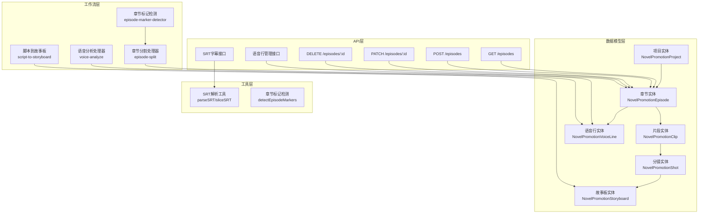
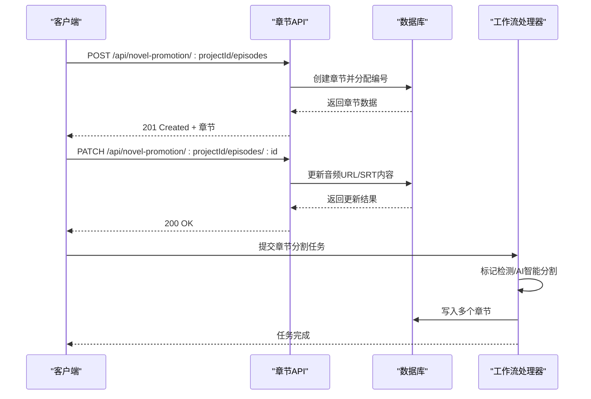
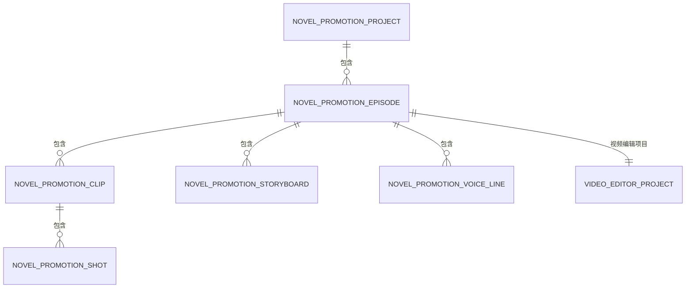
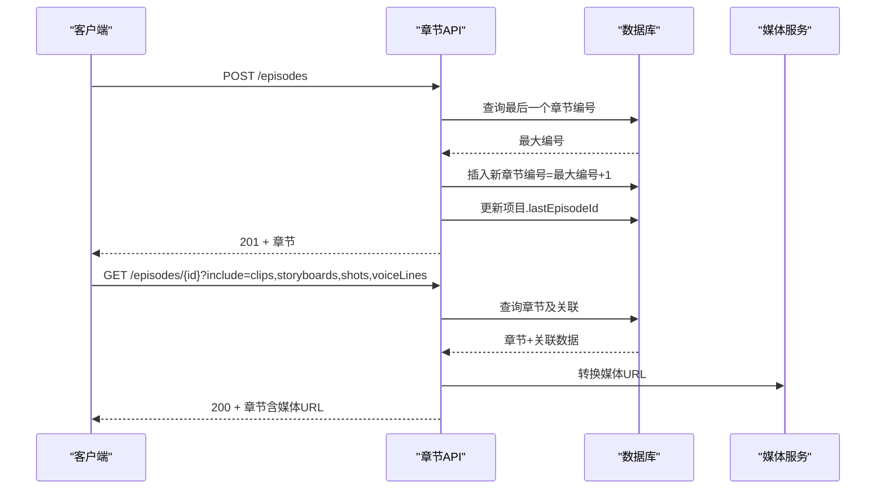
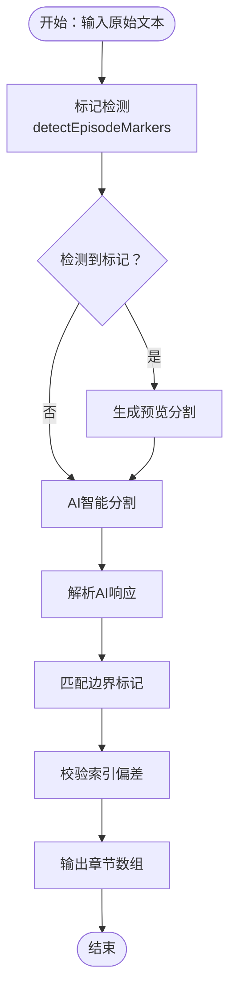
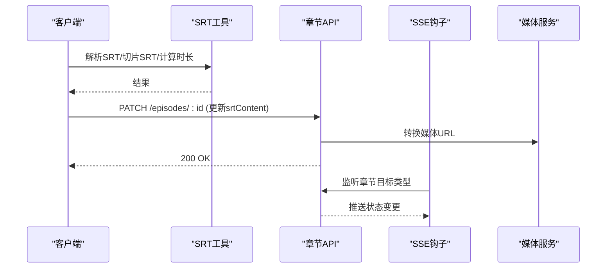
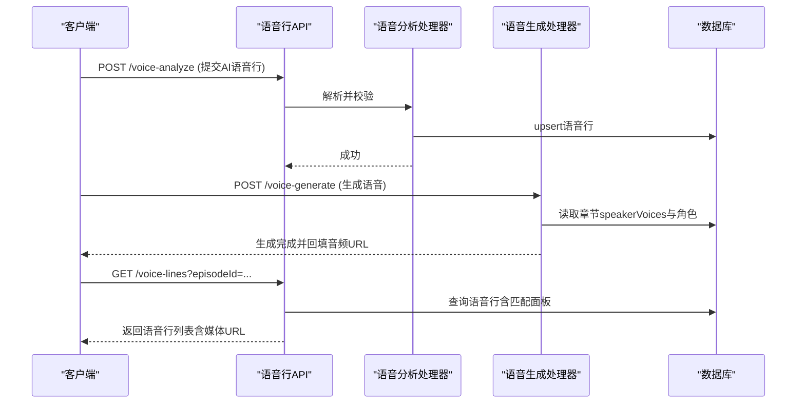
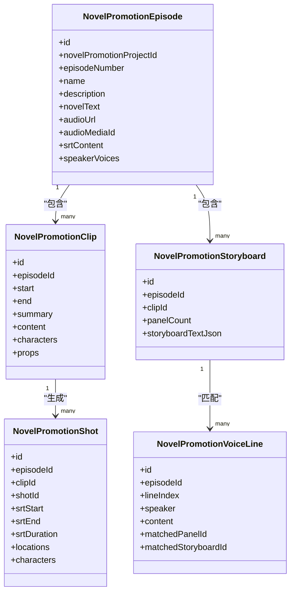
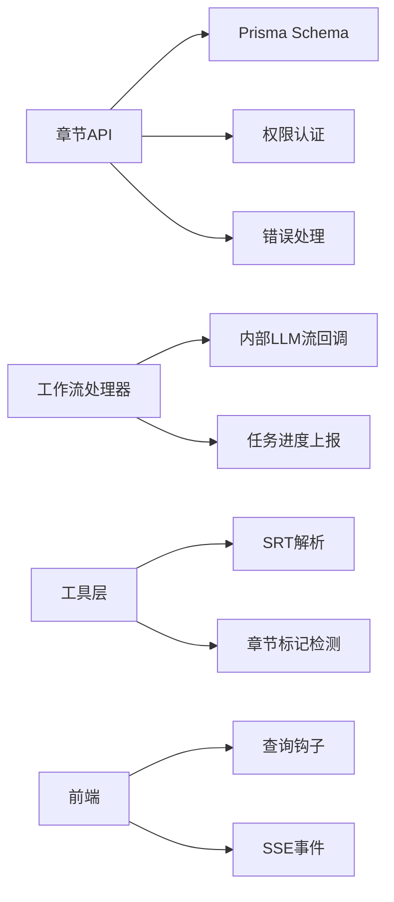

# 章节实体

<cite>
**本文档引用的文件**
- [src/app/api/novel-promotion/[projectId]/episodes/route.ts](file://src/app/api/novel-promotion/[projectId]/episodes/route.ts)
- [src/app/api/novel-promotion/[projectId]/episodes/[episodeId]/route.ts](file://src/app/api/novel-promotion/[projectId]/episodes/[episodeId]/route.ts)
- [src/lib/episode-marker-detector.ts](file://src/lib/episode-marker-detector.ts)
- [src/lib/workers/handlers/episode-split.ts](file://src/lib/workers/handlers/episode-split.ts)
- [prisma/schema.prisma](file://prisma/schema.prisma)
- [src/lib/srt.ts](file://src/lib/srt.ts)
- [src/lib/workers/handlers/voice-analyze.ts](file://src/lib/workers/handlers/voice-analyze.ts)
- [src/app/api/novel-promotion/[projectId]/voice-lines/route.ts](file://src/app/api/novel-promotion/[projectId]/voice-lines/route.ts)
- [src/lib/voice/generate-voice-line.ts](file://src/lib/voice/generate-voice-line.ts)
- [src/app/api/novel-promotion/[projectId]/voice-generate/route.ts](file://src/app/api/novel-promotion/[projectId]/voice-generate/route.ts)
- [src/app/api/projects/[projectId]/route.ts](file://src/app/api/projects/[projectId]/route.ts)
- [src/lib/query/hooks/useVoiceLines.ts](file://src/lib/query/hooks/useVoiceLines.ts)
- [src/lib/query/hooks/useSSE.ts](file://src/lib/query/hooks/useSSE.ts)
- [src/lib/query/hooks/useScriptToStoryboardRunStream.ts](file://src/lib/query/hooks/useScriptToStoryboardRunStream.ts)
- [src/lib/query/hooks/useStoryToScriptRunStream.ts](file://src/lib/query/hooks/useStoryToScriptRunStream.ts)
- [src/app/[locale]/workspace/[projectId]/modes/novel-promotion/components/storyboard/hooks/useStoryboardTaskAwareStoryboards.ts](file://src/app/[locale]/workspace/[projectId]/modes/novel-promotion/components/storyboard/hooks/useStoryboardTaskAwareStoryboards.ts)
- [src/app/api/novel-promotion/[projectId]/clips/route.ts](file://src/app/api/novel-promotion/[projectId]/clips/route.ts)
- [src/app/api/novel-promotion/[projectId]/screenplay-conversion/route.ts](file://src/app/api/novel-promotion/[projectId]/screenplay-conversion/route.ts)
- [src/app/api/novel-promotion/[projectId]/script-to-storyboard-stream/route.ts](file://src/app/api/novel-promotion/[projectId]/script-to-storyboard-stream/route.ts)
- [src/app/api/novel-promotion/[projectId]/story-to-script-stream/route.ts](file://src/app/api/novel-promotion/[projectId]/story-to-script-stream/route.ts)
- [src/app/api/novel-promotion/[projectId]/voice-analyze/route.ts](file://src/app/api/novel-promotion/[projectId]/voice-analyze/route.ts)
- [src/lib/workers/handlers/script-to-storyboard-helpers.ts](file://src/lib/workers/handlers/script-to-storyboard-helpers.ts)
- [tests/integration/api/contract/novel-promotion-episode-create-text.test.ts](file://tests/integration/api/contract/novel-promotion-episode-create-text.test.ts)
- [tests/unit/worker/episode-split.test.ts](file://tests/unit/worker/episode-split.test.ts)
- [tests/unit/workspace/episode-selection.test.ts](file://tests/unit/workspace/episode-selection.test.ts)
- [tests/system/helpers/seed.ts](file://tests/system/helpers/seed.ts)
</cite>

## 目录
1. [简介](#简介)
2. [项目结构](#项目结构)
3. [核心组件](#核心组件)
4. [架构概览](#架构概览)
5. [详细组件分析](#详细组件分析)
6. [依赖分析](#依赖分析)
7. [性能考虑](#性能考虑)
8. [故障排除指南](#故障排除指南)
9. [结论](#结论)
10. [附录](#附录)

## 简介
本文件系统性阐述Waoowaoo小说推广工作流中的章节实体（NovelPromotionEpisode）设计与实现。章节实体承载小说推广的核心内容与多媒体资产，贯穿从文本创作、音频生成、SRT字幕处理到分镜与故事板构建的完整链路。本文将深入解析章节实体的数据结构、与音频处理的关系、与片段（Clip）、分镜（Shot）、故事板（Storyboard）等下级实体的层级关系，并提供章节创建、分割、合并的完整API说明与使用示例，帮助开发者理解章节管理在整个小说推广工作流中的核心地位。

## 项目结构
小说推广章节实体位于以下关键模块：
- 数据模型层：Prisma Schema定义章节实体及其关联关系
- API层：提供章节的增删改查、音频与SRT更新、语音行管理等REST接口
- 工作流层：包含章节分割（基于标记检测与AI智能拆分）、语音分析、脚本到故事板转换等任务处理器
- 工具层：提供SRT解析与处理、章节标记检测、语音行生成等工具函数
- 前端集成：通过查询钩子与SSE事件驱动章节状态变更与媒体URL转换

**图表来源**
- [prisma/schema.prisma](file://prisma/schema.prisma)
- [src/app/api/novel-promotion/[projectId]/episodes/route.ts](file://src/app/api/novel-promotion/[projectId]/episodes/route.ts)
- [src/app/api/novel-promotion/[projectId]/episodes/[episodeId]/route.ts](file://src/app/api/novel-promotion/[projectId]/episodes/[episodeId]/route.ts)
- [src/lib/episode-marker-detector.ts](file://src/lib/episode-marker-detector.ts)
- [src/lib/workers/handlers/episode-split.ts](file://src/lib/workers/handlers/episode-split.ts)
- [src/lib/srt.ts](file://src/lib/srt.ts)
- [src/lib/workers/handlers/voice-analyze.ts](file://src/lib/workers/handlers/voice-analyze.ts)
- [src/app/api/novel-promotion/[projectId]/voice-lines/route.ts](file://src/app/api/novel-promotion/[projectId]/voice-lines/route.ts)

**章节来源**
- [prisma/schema.prisma](file://prisma/schema.prisma)
- [src/app/api/novel-promotion/[projectId]/episodes/route.ts](file://src/app/api/novel-promotion/[projectId]/episodes/route.ts)
- [src/app/api/novel-promotion/[projectId]/episodes/[episodeId]/route.ts](file://src/app/api/novel-promotion/[projectId]/episodes/[episodeId]/route.ts)

## 核心组件
- 章节实体（NovelPromotionEpisode）
  - 关键字段：项目ID、章节编号、名称、描述、小说文本、音频URL、音频媒体ID、SRT内容、说话人语音配置、创建/更新时间
  - 关联实体：片段（Clips）、分镜（Shots）、故事板（Storyboards）、语音行（VoiceLines）、视频编辑项目（VideoEditorProject）
- 片段（NovelPromotionClip）：章节内的剧情片段，包含起止时间、地点、角色、道具、剧本等
- 分镜（NovelPromotionShot）：镜头级别的画面描述，包含位置、角色、构图、焦点等
- 故事板（NovelPromotionStoryboard）：由面板组成的视觉化分镜序列，包含候选图像、摄影计划等
- 语音行（NovelPromotionVoiceLine）：对白文本、说话人、情感强度、匹配的面板索引与故事板ID、音频URL等
- 项目（NovelPromotionProject）：包含用户配置的分析/图像/视频/语音模型、工作流模式、最后编辑章节ID等

章节实体在Prisma Schema中的定义体现了其作为小说推广工作流核心节点的地位，既承载文本内容，又连接音频、SRT与视觉资产，形成“文本→音频→画面”的闭环。

**章节来源**
- [prisma/schema.prisma](file://prisma/schema.prisma)

## 架构概览
章节实体贯穿以下关键流程：
- 章节创建与基础信息维护：通过API创建章节，自动分配章节编号并更新项目最后编辑章节
- 章节内容分割：支持基于标记检测与AI智能分割两种策略，生成多个章节
- 音频与SRT处理：支持上传音频、写入SRT内容；通过SRT工具进行解析、切片与时长计算
- 语音行管理：分析语音行、匹配面板、生成语音并回填音频URL
- 与片段/分镜/故事板的联动：章节作为上层容器，驱动片段、分镜与故事板的生成与匹配

**图表来源**
- [src/app/api/novel-promotion/[projectId]/episodes/route.ts](file://src/app/api/novel-promotion/[projectId]/episodes/route.ts)
- [src/app/api/novel-promotion/[projectId]/episodes/[episodeId]/route.ts](file://src/app/api/novel-promotion/[projectId]/episodes/[episodeId]/route.ts)
- [src/lib/episode-marker-detector.ts](file://src/lib/episode-marker-detector.ts)
- [src/lib/workers/handlers/episode-split.ts](file://src/lib/workers/handlers/episode-split.ts)

## 详细组件分析

### 章节实体数据模型与关系
章节实体在Prisma Schema中定义了与项目、片段、分镜、故事板、语音行以及视频编辑项目的多对一/一对多关系，确保章节作为上层容器的完整性与可追溯性。

**图表来源**
- [prisma/schema.prisma](file://prisma/schema.prisma)

**章节来源**
- [prisma/schema.prisma](file://prisma/schema.prisma)

### 章节创建与管理API
- 获取所有章节
  - 方法：GET
  - 路径：/api/novel-promotion/{projectId}/episodes
  - 功能：按章节编号升序返回项目下的所有章节
- 创建章节
  - 方法：POST
  - 路径：/api/novel-promotion/{projectId}/episodes
  - 请求体：name（必填）、description、novelText、audioUrl、srtContent
  - 行为：自动生成下一个章节编号，创建章节并更新项目最后编辑章节ID
- 获取单个章节（含关联数据）
  - 方法：GET
  - 路径：/api/novel-promotion/{projectId}/episodes/{episodeId}
  - 关联：包含片段、故事板（含面板）、分镜、语音行，并转换为带签名的媒体URL
- 更新章节
  - 方法：PATCH
  - 路径：/api/novel-promotion/{projectId}/episodes/{episodeId}
  - 请求体：name、description、novelText、audioUrl、srtContent
  - 行为：更新字段并解析媒体引用
- 删除章节
  - 方法：DELETE
  - 路径：/api/novel-promotion/{projectId}/episodes/{episodeId}
  - 行为：删除章节并处理项目最后编辑章节ID

**图表来源**
- [src/app/api/novel-promotion/[projectId]/episodes/route.ts](file://src/app/api/novel-promotion/[projectId]/episodes/route.ts)
- [src/app/api/novel-promotion/[projectId]/episodes/[episodeId]/route.ts](file://src/app/api/novel-promotion/[projectId]/episodes/[episodeId]/route.ts)

**章节来源**
- [src/app/api/novel-promotion/[projectId]/episodes/route.ts](file://src/app/api/novel-promotion/[projectId]/episodes/route.ts)
- [src/app/api/novel-promotion/[projectId]/episodes/[episodeId]/route.ts](file://src/app/api/novel-promotion/[projectId]/episodes/[episodeId]/route.ts)

### 章节分割：标记检测与AI智能分割
- 标记检测（EpisodeMarkerDetector）
  - 功能：识别文本中的章节标记（中文“第X集/章/幕”、英文“Episode/Chapter”、场景编号、Markdown加粗数字、纯数字等），并生成预览分割方案
  - 输出：标记类型、置信度、匹配位置与预览分割列表
- AI智能分割（EpisodeSplit Handler）
  - 输入：项目ID、原始文本
  - 流程：构建提示词、调用内部LLM流回调、解析AI响应、匹配边界标记、校验索引偏差、输出标准化章节
  - 输出：章节数组（编号、标题、摘要、内容、字数）

**图表来源**
- [src/lib/episode-marker-detector.ts](file://src/lib/episode-marker-detector.ts)
- [src/lib/workers/handlers/episode-split.ts](file://src/lib/workers/handlers/episode-split.ts)

**章节来源**
- [src/lib/episode-marker-detector.ts](file://src/lib/episode-marker-detector.ts)
- [src/lib/workers/handlers/episode-split.ts](file://src/lib/workers/handlers/episode-split.ts)

### 音频处理与SRT字幕
- SRT工具
  - 解析SRT：将SRT文本解析为条目数组，包含序号、起止时间、文本
  - 切片SRT：根据序号范围切割SRT内容
  - 计算时长：计算SRT片段的总时长（秒）
  - 校验与提取：验证SRT格式有效性，提取纯文本
- 章节与SRT
  - 章节实体支持保存SRT内容，前端通过SSE与查询钩子获取并转换为稳定媒体URL
  - 项目路由中根据音频URL解析存储键，便于资源访问

**图表来源**
- [src/lib/srt.ts](file://src/lib/srt.ts)
- [src/app/api/novel-promotion/[projectId]/episodes/[episodeId]/route.ts](file://src/app/api/novel-promotion/[projectId]/episodes/[episodeId]/route.ts)
- [src/lib/query/hooks/useSSE.ts](file://src/lib/query/hooks/useSSE.ts)
- [src/app/api/projects/[projectId]/route.ts](file://src/app/api/projects/[projectId]/route.ts)

**章节来源**
- [src/lib/srt.ts](file://src/lib/srt.ts)
- [src/app/api/novel-promotion/[projectId]/episodes/[episodeId]/route.ts](file://src/app/api/novel-promotion/[projectId]/episodes/[episodeId]/route.ts)
- [src/lib/query/hooks/useSSE.ts](file://src/lib/query/hooks/useSSE.ts)
- [src/app/api/projects/[projectId]/route.ts](file://src/app/api/projects/[projectId]/route.ts)

### 语音行管理与说话人语音配置
- 语音行分析
  - 语音分析处理器接收AI响应，严格校验每条语音行的lineIndex、speaker、content、emotionStrength等字段，然后upsert到数据库
- 语音行生成
  - 语音生成接口根据章节ID或单条语音行ID，结合说话人语音配置与可用提供商，生成语音并回填音频URL
- 语音行查询
  - 支持按章节查询语音行列表，包含匹配的面板信息，并转换为稳定媒体URL
- 说话人语音配置
  - 章节实体包含speakerVoices字段，存储每个说话人的语音提供商与类型配置；系统在生成语音前进行校验与匹配

**图表来源**
- [src/lib/workers/handlers/voice-analyze.ts](file://src/lib/workers/handlers/voice-analyze.ts)
- [src/app/api/novel-promotion/[projectId]/voice-lines/route.ts](file://src/app/api/novel-promotion/[projectId]/voice-lines/route.ts)
- [src/lib/voice/generate-voice-line.ts](file://src/lib/voice/generate-voice-line.ts)
- [src/app/api/novel-promotion/[projectId]/voice-generate/route.ts](file://src/app/api/novel-promotion/[projectId]/voice-generate/route.ts)

**章节来源**
- [src/lib/workers/handlers/voice-analyze.ts](file://src/lib/workers/handlers/voice-analyze.ts)
- [src/app/api/novel-promotion/[projectId]/voice-lines/route.ts](file://src/app/api/novel-promotion/[projectId]/voice-lines/route.ts)
- [src/lib/voice/generate-voice-line.ts](file://src/lib/voice/generate-voice-line.ts)
- [src/app/api/novel-promotion/[projectId]/voice-generate/route.ts](file://src/app/api/novel-promotion/[projectId]/voice-generate/route.ts)

### 与片段、分镜、故事板的层级关系
- 章节（Episode）包含多个片段（Clip），每个片段可进一步生成分镜（Shot）与故事板（Storyboard）
- 故事板包含多个面板（Panel），面板可匹配到具体的语音行（VoiceLine）
- 查询钩子与SSE事件确保前端能够感知章节目标类型变更，驱动UI更新

**图表来源**
- [prisma/schema.prisma](file://prisma/schema.prisma)
- [src/app/api/novel-promotion/[projectId]/clips/route.ts](file://src/app/api/novel-promotion/[projectId]/clips/route.ts)
- [src/app/api/novel-promotion/[projectId]/screenplay-conversion/route.ts](file://src/app/api/novel-promotion/[projectId]/screenplay-conversion/route.ts)
- [src/app/api/novel-promotion/[projectId]/script-to-storyboard-stream/route.ts](file://src/app/api/novel-promotion/[projectId]/script-to-storyboard-stream/route.ts)
- [src/app/api/novel-promotion/[projectId]/story-to-script-stream/route.ts](file://src/app/api/novel-promotion/[projectId]/story-to-script-stream/route.ts)
- [src/app/api/novel-promotion/[projectId]/voice-analyze/route.ts](file://src/app/api/novel-promotion/[projectId]/voice-analyze/route.ts)
- [src/lib/query/hooks/useScriptToStoryboardRunStream.ts](file://src/lib/query/hooks/useScriptToStoryboardRunStream.ts)
- [src/lib/query/hooks/useStoryToScriptRunStream.ts](file://src/lib/query/hooks/useStoryToScriptRunStream.ts)
- [src/app/[locale]/workspace/[projectId]/modes/novel-promotion/components/storyboard/hooks/useStoryboardTaskAwareStoryboards.ts](file://src/app/[locale]/workspace/[projectId]/modes/novel-promotion/components/storyboard/hooks/useStoryboardTaskAwareStoryboards.ts)

**章节来源**
- [prisma/schema.prisma](file://prisma/schema.prisma)
- [src/app/api/novel-promotion/[projectId]/clips/route.ts](file://src/app/api/novel-promotion/[projectId]/clips/route.ts)
- [src/app/api/novel-promotion/[projectId]/screenplay-conversion/route.ts](file://src/app/api/novel-promotion/[projectId]/screenplay-conversion/route.ts)
- [src/app/api/novel-promotion/[projectId]/script-to-storyboard-stream/route.ts](file://src/app/api/novel-promotion/[projectId]/script-to-storyboard-stream/route.ts)
- [src/app/api/novel-promotion/[projectId]/story-to-script-stream/route.ts](file://src/app/api/novel-promotion/[projectId]/story-to-script-stream/route.ts)
- [src/app/api/novel-promotion/[projectId]/voice-analyze/route.ts](file://src/app/api/novel-promotion/[projectId]/voice-analyze/route.ts)
- [src/lib/query/hooks/useScriptToStoryboardRunStream.ts](file://src/lib/query/hooks/useScriptToStoryboardRunStream.ts)
- [src/lib/query/hooks/useStoryToScriptRunStream.ts](file://src/lib/query/hooks/useStoryToScriptRunStream.ts)
- [src/app/[locale]/workspace/[projectId]/modes/novel-promotion/components/storyboard/hooks/useStoryboardTaskAwareStoryboards.ts](file://src/app/[locale]/workspace/[projectId]/modes/novel-promotion/components/storyboard/hooks/useStoryboardTaskAwareStoryboards.ts)

## 依赖分析
- 章节实体依赖Prisma Schema定义的外键与索引，确保章节编号唯一性与高效查询
- API层依赖权限认证与错误处理工具，保证请求合法性与错误统一返回
- 工作流层依赖内部LLM流回调与任务进度上报，确保分割与语音分析过程可观测
- 工具层提供SRT解析与章节标记检测，支撑章节内容的自动化处理
- 前端通过查询钩子与SSE事件感知章节状态变化，实现媒体URL转换与UI刷新

**图表来源**
- [src/app/api/novel-promotion/[projectId]/episodes/route.ts](file://src/app/api/novel-promotion/[projectId]/episodes/route.ts)
- [src/lib/workers/handlers/episode-split.ts](file://src/lib/workers/handlers/episode-split.ts)
- [src/lib/srt.ts](file://src/lib/srt.ts)
- [src/lib/episode-marker-detector.ts](file://src/lib/episode-marker-detector.ts)
- [src/lib/query/hooks/useVoiceLines.ts](file://src/lib/query/hooks/useVoiceLines.ts)
- [src/lib/query/hooks/useSSE.ts](file://src/lib/query/hooks/useSSE.ts)

**章节来源**
- [src/app/api/novel-promotion/[projectId]/episodes/route.ts](file://src/app/api/novel-promotion/[projectId]/episodes/route.ts)
- [src/lib/workers/handlers/episode-split.ts](file://src/lib/workers/handlers/episode-split.ts)
- [src/lib/srt.ts](file://src/lib/srt.ts)
- [src/lib/episode-marker-detector.ts](file://src/lib/episode-marker-detector.ts)
- [src/lib/query/hooks/useVoiceLines.ts](file://src/lib/query/hooks/useVoiceLines.ts)
- [src/lib/query/hooks/useSSE.ts](file://src/lib/query/hooks/useSSE.ts)

## 性能考虑
- 章节编号唯一性约束与索引：确保章节查询与去重操作高效
- 媒体URL转换：在API响应中统一转换为带签名的稳定URL，避免重复解析
- 任务进度上报：工作流处理器分阶段上报进度，提升用户体验与可观测性
- SRT处理：批量解析与切片操作应避免重复计算，建议缓存中间结果
- 语音行生成：按需生成（all=false）可减少不必要的计算与存储开销

## 故障排除指南
- 章节创建失败
  - 检查请求体中的name字段是否为空
  - 确认项目权限与鉴权头正确
- 章节更新失败
  - 确认audioUrl格式合法，系统会解析媒体引用并回写audioMediaId
- 章节删除后项目lastEpisodeId异常
  - 系统会自动选择另一个章节作为默认，若无其他章节则清空lastEpisodeId
- 语音行生成失败
  - 检查章节speakerVoices配置与角色映射是否正确
  - 确认所选提供商支持该说话人语音
- SRT解析异常
  - 使用isValidSRT进行格式校验，确保时间轴格式符合标准

**章节来源**
- [src/app/api/novel-promotion/[projectId]/episodes/route.ts](file://src/app/api/novel-promotion/[projectId]/episodes/route.ts)
- [src/app/api/novel-promotion/[projectId]/episodes/[episodeId]/route.ts](file://src/app/api/novel-promotion/[projectId]/episodes/[episodeId]/route.ts)
- [src/lib/srt.ts](file://src/lib/srt.ts)
- [src/lib/workers/handlers/voice-analyze.ts](file://src/lib/workers/handlers/voice-analyze.ts)
- [src/app/api/novel-promotion/[projectId]/voice-generate/route.ts](file://src/app/api/novel-promotion/[projectId]/voice-generate/route.ts)

## 结论
章节实体（NovelPromotionEpisode）是Waoowaoo小说推广工作流的核心节点，承担内容承载、音频与SRT管理、与片段/分镜/故事板的衔接职责。通过标记检测与AI智能分割，章节内容可被高效拆分；借助SRT工具与语音行管理，音频与字幕处理流程得以自动化；配合查询钩子与SSE事件，前端可实时感知状态变化并完成媒体URL转换。整体架构清晰、职责分明，为小说推广的全流程自动化提供了坚实基础。

## 附录
- 章节创建文本测试用例：验证章节创建接口的文本处理能力
- 章节分割单元测试：覆盖AI智能分割的边界条件与错误处理
- 章节选择单元测试：验证工作区中章节选择逻辑
- 系统种子数据：演示speakerVoices字段的初始化与故事板扩展

**章节来源**
- [tests/integration/api/contract/novel-promotion-episode-create-text.test.ts](file://tests/integration/api/contract/novel-promotion-episode-create-text.test.ts)
- [tests/unit/worker/episode-split.test.ts](file://tests/unit/worker/episode-split.test.ts)
- [tests/unit/workspace/episode-selection.test.ts](file://tests/unit/workspace/episode-selection.test.ts)
- [tests/system/helpers/seed.ts](file://tests/system/helpers/seed.ts)