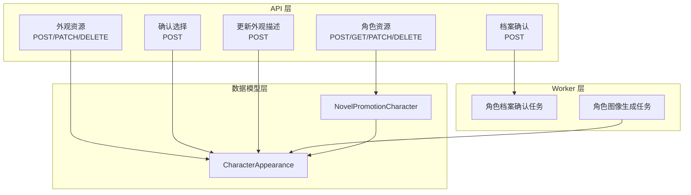
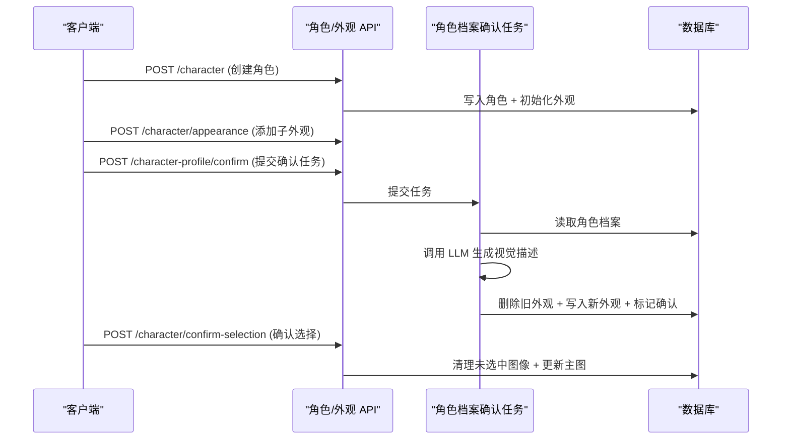
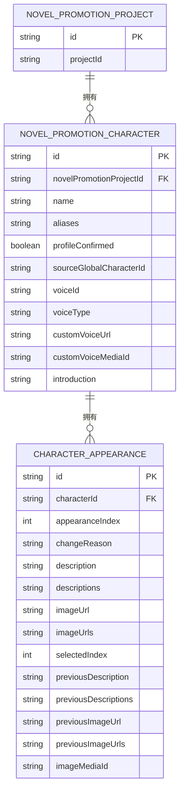

# 角色实体

<cite>
**本文档引用的文件**
- [prisma/schema.prisma](file://prisma/schema.prisma)
- [prisma/schema.sqlit.prisma](file://prisma/schema.sqlit.prisma)
- [src/app/api/novel-promotion/[projectId]/character/route.ts](file://src/app/api/novel-promotion/[projectId]/character/route.ts)
- [src/app/api/novel-promotion/[projectId]/character/appearance/route.ts](file://src/app/api/novel-promotion/[projectId]/character/appearance/route.ts)
- [src/app/api/novel-promotion/[projectId]/character/confirm-selection/route.ts](file://src/app/api/novel-promotion/[projectId]/character/confirm-selection/route.ts)
- [src/app/api/novel-promotion/[projectId]/character-profile/confirm/route.ts](file://src/app/api/novel-promotion/[projectId]/character-profile/confirm/route.ts)
- [src/app/api/novel-promotion/[projectId]/update-appearance/route.ts](file://src/app/api/novel-promotion/[projectId]/update-appearance/route.ts)
- [src/lib/workers/handlers/character-profile.ts](file://src/lib/workers/handlers/character-profile.ts)
- [src/lib/workers/handlers/character-image-task-handler.ts](file://src/lib/workers/handlers/character-image-task-handler.ts)
- [src/lib/query/mutations/character-profile-mutations.ts](file://src/lib/query/mutations/character-profile-mutations.ts)
- [src/lib/query/mutations/character-voice-mutations.ts](file://src/lib/query/mutations/character-voice-mutations.ts)
- [.next/types/routes.d.ts](file://.next/types/routes.d.ts)
</cite>

## 目录
1. [简介](#简介)
2. [项目结构](#项目结构)
3. [核心组件](#核心组件)
4. [架构总览](#架构总览)
5. [详细组件分析](#详细组件分析)
6. [依赖分析](#依赖分析)
7. [性能考虑](#性能考虑)
8. [故障排查指南](#故障排查指南)
9. [结论](#结论)
10. [附录](#附录)

## 简介
本文件围绕 Waoowaoo 小说推广角色实体进行系统化文档化，重点阐释以下内容：
- NovelPromotionCharacter 实体的设计理念与实现细节，包括角色基本信息（名称、别名）、角色配置（语音设置、艺术风格）、角色状态（确认状态、来源标识）等核心字段。
- 角色外观管理机制，包括 CharacterAppearance 实体如何管理角色的不同外观版本、变更历史记录与版本控制。
- 角色与项目的关系，以及角色在小说推广工作流中的作用。
- 角色创建、更新、删除的完整 API 接口说明与使用示例，帮助开发者理解角色管理的完整生命周期。

## 项目结构
本项目采用分层与按功能域组织的结构。与角色实体相关的关键模块包括：
- 数据模型层：Prisma Schema 定义角色与外观的持久化结构。
- API 层：面向项目的角色与外观管理接口，覆盖创建、更新、删除、确认选择等。
- Worker 层：异步任务处理器，负责角色档案确认、生成视觉描述、批量确认等。
- 前端查询与变更封装：基于 TanStack Query 的变更钩子，统一调用上述 API 并维护缓存。

图表来源
- [src/app/api/novel-promotion/[projectId]/character/route.ts](file://src/app/api/novel-promotion/[projectId]/character/route.ts#L117-L229)
- [src/app/api/novel-promotion/[projectId]/character/appearance/route.ts](file://src/app/api/novel-promotion/[projectId]/character/appearance/route.ts#L1-L259)
- [src/app/api/novel-promotion/[projectId]/character/confirm-selection/route.ts](file://src/app/api/novel-promotion/[projectId]/character/confirm-selection/route.ts#L1-L116)
- [src/app/api/novel-promotion/[projectId]/character-profile/confirm/route.ts](file://src/app/api/novel-promotion/[projectId]/character-profile/confirm/route.ts#L1-L41)
- [src/lib/workers/handlers/character-profile.ts:24-195](file://src/lib/workers/handlers/character-profile.ts#L24-L195)
- [src/lib/workers/handlers/character-image-task-handler.ts:71-196](file://src/lib/workers/handlers/character-image-task-handler.ts#L71-L196)
- [prisma/schema.prisma:79-101](file://prisma/schema.prisma#L79-L101)

章节来源
- [prisma/schema.prisma:79-101](file://prisma/schema.prisma#L79-L101)
- [src/app/api/novel-promotion/[projectId]/character/route.ts](file://src/app/api/novel-promotion/[projectId]/character/route.ts#L117-L229)
- [src/app/api/novel-promotion/[projectId]/character/appearance/route.ts](file://src/app/api/novel-promotion/[projectId]/character/appearance/route.ts#L1-L259)
- [src/app/api/novel-promotion/[projectId]/character/confirm-selection/route.ts](file://src/app/api/novel-promotion/[projectId]/character/confirm-selection/route.ts#L1-L116)
- [src/app/api/novel-promotion/[projectId]/character-profile/confirm/route.ts](file://src/app/api/novel-promotion/[projectId]/character-profile/confirm/route.ts#L1-L41)
- [src/lib/workers/handlers/character-profile.ts:24-195](file://src/lib/workers/handlers/character-profile.ts#L24-L195)
- [src/lib/workers/handlers/character-image-task-handler.ts:71-196](file://src/lib/workers/handlers/character-image-task-handler.ts#L71-L196)

## 核心组件
本节聚焦于角色实体与外观实体的核心字段与职责。

- NovelPromotionCharacter（角色）
  - 标识与归属：id、novelPromotionProjectId
  - 基本信息：name、aliases
  - 状态与来源：profileConfirmed、sourceGlobalCharacterId
  - 语音配置：voiceId、voiceType、customVoiceUrl、customVoiceMediaId
  - 其他：introduction、createdAt、updatedAt
  - 关系：与 CharacterAppearance 一对多；与 NovelPromotionProject 多对一

- CharacterAppearance（角色外观）
  - 标识与归属：id、characterId
  - 版本与变更：appearanceIndex、changeReason
  - 描述与历史：description、descriptions、previousDescription、previousDescriptions
  - 图像与媒体：imageUrl、imageUrls、previousImageUrl、previousImageUrls、imageMediaId
  - 时间戳：createdAt、updatedAt
  - 关系：与 NovelPromotionCharacter 多对一；与 MediaObject 可选一对一

章节来源
- [prisma/schema.prisma:79-101](file://prisma/schema.prisma#L79-L101)
- [prisma/schema.prisma:30-54](file://prisma/schema.prisma#L30-L54)

## 架构总览
角色实体在小说推广工作流中的关键流转如下：
- 角色创建：通过 API 创建角色并初始化主外观。
- 外观管理：为角色添加子外观、更新描述、删除外观。
- 档案确认：提交角色档案确认任务，由 Worker 解析 AI 输出，重建外观集合并标记确认状态。
- 图像生成：根据外观描述生成候选图像，并支持“确认选择”清理未选中图像。
- 语音配置：支持系统音色、上传音色、自定义音色三种方式。

图表来源
- [src/app/api/novel-promotion/[projectId]/character/route.ts](file://src/app/api/novel-promotion/[projectId]/character/route.ts#L117-L229)
- [src/app/api/novel-promotion/[projectId]/character/appearance/route.ts](file://src/app/api/novel-promotion/[projectId]/character/appearance/route.ts#L1-L259)
- [src/app/api/novel-promotion/[projectId]/character-profile/confirm/route.ts](file://src/app/api/novel-promotion/[projectId]/character-profile/confirm/route.ts#L1-L41)
- [src/lib/workers/handlers/character-profile.ts:24-195](file://src/lib/workers/handlers/character-profile.ts#L24-L195)
- [src/app/api/novel-promotion/[projectId]/character/confirm-selection/route.ts](file://src/app/api/novel-promotion/[projectId]/character/confirm-selection/route.ts#L1-L116)

## 详细组件分析

### 角色实体（NovelPromotionCharacter）
- 字段说明
  - 基本信息：name（必填）、aliases（可空）
  - 状态：profileConfirmed（布尔，默认 false）
  - 来源：sourceGlobalCharacterId（可空，复制时记录）
  - 语音：voiceId、voiceType、customVoiceUrl、customVoiceMediaId
  - 关联：appearances（外键 characterId）

- 设计要点
  - 通过 novelPromotionProjectId 与项目绑定，确保角色仅属于特定项目。
  - profileConfirmed 作为工作流关键开关，驱动外观重建与后续生成。
  - 语音字段支持多种来源，便于灵活配置。

章节来源
- [prisma/schema.prisma:79-101](file://prisma/schema.prisma#L79-L101)

### 外观实体（CharacterAppearance）
- 字段说明
  - 版本控制：appearanceIndex（唯一索引 characterId + appearanceIndex）
  - 变更原因：changeReason
  - 描述：description（单值）、descriptions（数组，支持多版本描述）
  - 历史回溯：previousDescription、previousDescriptions
  - 图像：imageUrl（主图）、imageUrls（候选图数组）、previousImageUrls
  - 媒体：imageMediaId（可空，关联媒体对象）
  - 时间戳：createdAt、updatedAt

- 设计要点
  - 通过 descriptions 数组实现“版本化描述”，便于回滚与对比。
  - 通过 previous* 字段记录上一次状态，支撑“撤回/恢复”能力。
  - 与角色的级联删除保证数据一致性。

章节来源
- [prisma/schema.prisma:30-54](file://prisma/schema.prisma#L30-L54)

### 角色与项目的关系
- 角色通过 novelPromotionProjectId 与项目关联，确保资源隔离与权限控制。
- 外观通过 characterId 与角色关联，形成“项目 → 角色 → 外观”的层级关系。

章节来源
- [prisma/schema.prisma:79-101](file://prisma/schema.prisma#L79-L101)
- [prisma/schema.prisma:30-54](file://prisma/schema.prisma#L30-L54)

### 角色在小说推广工作流中的作用
- 角色是“视觉描述 → 图像生成 → 剧本/分镜适配”的起点。
- 档案确认后，系统根据 AI 生成的视觉描述批量重建外观，确保风格与项目一致。
- 外观确认选择后，清理未选中候选图，降低存储与渲染成本。

章节来源
- [src/lib/workers/handlers/character-profile.ts:24-195](file://src/lib/workers/handlers/character-profile.ts#L24-L195)
- [src/app/api/novel-promotion/[projectId]/character/confirm-selection/route.ts](file://src/app/api/novel-promotion/[projectId]/character/confirm-selection/route.ts#L1-L116)

### 角色外观管理机制（版本与历史）
- 版本化描述：descriptions 数组记录每次变更后的描述集合。
- 历史回溯：previousDescription/previousDescriptions 记录变更前状态。
- 变更原因：changeReason 便于审计与用户理解。
- 主图与候选图：imageUrl/imageUrls 支持多候选与主图切换。

章节来源
- [prisma/schema.prisma:30-54](file://prisma/schema.prisma#L30-L54)

### API 接口与使用示例

#### 角色资源
- 创建角色
  - 方法与路径：POST /api/novel-promotion/{projectId}/character
  - 请求体字段：name（必填）、description、referenceImageUrls、generateFromReference、customDescription、count、artStyle
  - 行为：创建角色并初始化主外观；若启用参考图生成，将触发后台任务解析参考图并生成描述。
  - 响应：返回包含角色与外观的数据。
- 更新角色信息（名称/介绍）
  - 方法与路径：PATCH /api/novel-promotion/{projectId}/character
  - 请求体字段：characterId（必填）、name、introduction
  - 行为：更新角色名称或介绍。
- 删除角色
  - 方法与路径：DELETE /api/novel-promotion/{projectId}/character?id={characterId}
  - 行为：删除角色及其所有外观记录（级联删除）；同时清理未被其他角色使用的云端音色资源。

章节来源
- [src/app/api/novel-promotion/[projectId]/character/route.ts](file://src/app/api/novel-promotion/[projectId]/character/route.ts#L24-L114)
- [src/app/api/novel-promotion/[projectId]/character/route.ts](file://src/app/api/novel-promotion/[projectId]/character/route.ts#L117-L229)

#### 外观资源
- 添加子外观
  - 方法与路径：POST /api/novel-promotion/{projectId}/character/appearance
  - 请求体字段：characterId（必填）、changeReason（必填）、description（必填）
  - 行为：计算新索引并创建外观记录。
- 更新外观描述
  - 方法与路径：PATCH /api/novel-promotion/{projectId}/character/appearance
  - 请求体字段：characterId（必填）、appearanceId（必填）、description（必填）、descriptionIndex（可选）
  - 行为：更新 descriptions 数组中指定索引的描述，或追加到末尾。
- 删除外观
  - 方法与路径：DELETE /api/novel-promotion/{projectId}/character/appearance?characterId={characterId}&appearanceId={appearanceId}
  - 行为：删除外观记录；若存在云端图片则一并清理；随后重排剩余外观索引。

章节来源
- [src/app/api/novel-promotion/[projectId]/character/appearance/route.ts](file://src/app/api/novel-promotion/[projectId]/character/appearance/route.ts#L1-L259)

#### 确认选择
- 确认并清理未选中候选图
  - 方法与路径：POST /api/novel-promotion/{projectId}/character/confirm-selection
  - 请求体字段：characterId（必填）、appearanceId（必填）
  - 行为：校验已选择；删除 imageUrls 中未选中项；仅保留选中主图并同步 descriptions。

章节来源
- [src/app/api/novel-promotion/[projectId]/character/confirm-selection/route.ts](file://src/app/api/novel-promotion/[projectId]/character/confirm-selection/route.ts#L1-L116)

#### 档案确认（异步任务）
- 提交角色档案确认任务
  - 方法与路径：POST /api/novel-promotion/{projectId}/character-profile/confirm
  - 请求体字段：characterId（必填）
  - 行为：提交 CHARACTER_PROFILE_CONFIRM 任务；Worker 读取角色档案，调用 LLM 生成视觉描述，重建外观并标记确认。

章节来源
- [src/app/api/novel-promotion/[projectId]/character-profile/confirm/route.ts](file://src/app/api/novel-promotion/[projectId]/character-profile/confirm/route.ts#L1-L41)
- [src/lib/workers/handlers/character-profile.ts:24-195](file://src/lib/workers/handlers/character-profile.ts#L24-L195)

#### 前端变更钩子（React Query）
- 角色介绍更新、AI 修改外观描述、创建角色、添加外观、确认选择、确认档案、批量确认档案、上传/更新角色语音等。
- 钩子自动维护查询缓存与错误提示，简化前端集成。

章节来源
- [src/lib/query/mutations/character-profile-mutations.ts:1-282](file://src/lib/query/mutations/character-profile-mutations.ts#L1-L282)
- [src/lib/query/mutations/character-voice-mutations.ts:1-92](file://src/lib/query/mutations/character-voice-mutations.ts#L1-L92)

### API 路由类型（类型安全）
- 项目内路由类型文件提供了上述 API 的类型签名，便于在前端以类型安全的方式构造请求。

章节来源
- [.next/types/routes.d.ts:67-82](file://.next/types/routes.d.ts#L67-L82)
- [.next/types/routes.d.ts:77-82](file://.next/types/routes.d.ts#L77-L82)
- [.next/types/routes.d.ts:96-96](file://.next/types/routes.d.ts#L96-L96)
- [.next/types/routes.d.ts:110-110](file://.next/types/routes.d.ts#L110-L110)
- [.next/types/routes.d.ts:117-117](file://.next/types/routes.d.ts#L117-L117)

## 依赖分析
- 角色与外观的依赖关系
  - 角色 → 外观：一对多，外键 characterId；删除角色时级联删除外观。
  - 外观 → 媒体：可选关联 imageMediaId，支持媒体对象管理。
- API 与 Worker 的依赖关系
  - 档案确认 API → Worker：提交 CHARACTER_PROFILE_CONFIRM 任务。
  - 图像生成 API → Worker：提交 IMAGE_CHARACTER 任务（见图像任务处理器）。
- 前端与后端的契约
  - React Query 钩子与后端 API 一一对应，统一错误处理与缓存失效策略。

图表来源
- [prisma/schema.prisma:79-101](file://prisma/schema.prisma#L79-L101)
- [prisma/schema.prisma:30-54](file://prisma/schema.prisma#L30-L54)

章节来源
- [prisma/schema.prisma:79-101](file://prisma/schema.prisma#L79-L101)
- [prisma/schema.prisma:30-54](file://prisma/schema.prisma#L30-L54)

## 性能考虑
- 外观版本化与历史回溯
  - 使用 descriptions 数组与 previous* 字段，避免频繁全量更新，便于增量变更与回滚。
- 图像存储与清理
  - 在确认选择阶段清理未选中候选图，减少存储占用与渲染开销。
- 任务异步化
  - 档案确认与图像生成通过任务队列异步执行，避免阻塞请求线程。
- 级联删除与幂等性
  - 删除角色时级联删除外观，删除外观时幂等清理云端对象，降低脏数据风险。

## 故障排查指南
- 常见错误码
  - INVALID_PARAMS：请求参数缺失或非法（如缺少 characterId、无效 artStyle）。
  - NOT_FOUND：目标不存在（角色、外观、媒体）。
  - FORBIDDEN：无权限访问（非角色所属用户）。
- 排查步骤
  - 确认鉴权：检查项目权限与用户会话。
  - 参数校验：核对 characterId、appearanceId、description、descriptionIndex 等。
  - 任务状态：查看任务队列与 Worker 日志，确认 CHARACTER_PROFILE_CONFIRM 是否成功执行。
  - 存储清理：确认 confirm-selection 是否正确清理未选中图像。

章节来源
- [src/app/api/novel-promotion/[projectId]/character/route.ts](file://src/app/api/novel-promotion/[projectId]/character/route.ts#L38-L57)
- [src/app/api/novel-promotion/[projectId]/character/appearance/route.ts](file://src/app/api/novel-promotion/[projectId]/character/appearance/route.ts#L168-L193)
- [src/app/api/novel-promotion/[projectId]/character/confirm-selection/route.ts](file://src/app/api/novel-promotion/[projectId]/character/confirm-selection/route.ts#L47-L49)

## 结论
NovelPromotionCharacter 与 CharacterAppearance 通过清晰的字段划分与版本化机制，构建了可审计、可回滚、可扩展的角色外观管理体系。配合异步任务与严格的权限控制，角色实体在小说推广工作流中扮演着“视觉描述生成”的关键节点，为后续剧本、分镜与视频生成提供稳定基础。

## 附录

### API 接口一览（方法、路径、关键字段）
- POST /api/novel-promotion/{projectId}/character
  - 关键字段：name、description、referenceImageUrls、generateFromReference、customDescription、count、artStyle
- PATCH /api/novel-promotion/{projectId}/character
  - 关键字段：characterId、name、introduction
- DELETE /api/novel-promotion/{projectId}/character?id={characterId}
  - 关键字段：id（查询参数）
- POST /api/novel-promotion/{projectId}/character/appearance
  - 关键字段：characterId、changeReason、description
- PATCH /api/novel-promotion/{projectId}/character/appearance
  - 关键字段：characterId、appearanceId、description、descriptionIndex
- DELETE /api/novel-promotion/{projectId}/character/appearance?characterId=&appearanceId=
  - 关键字段：characterId、appearanceId（查询参数）
- POST /api/novel-promotion/{projectId}/character/confirm-selection
  - 关键字段：characterId、appearanceId
- POST /api/novel-promotion/{projectId}/character-profile/confirm
  - 关键字段：characterId

章节来源
- [src/app/api/novel-promotion/[projectId]/character/route.ts](file://src/app/api/novel-promotion/[projectId]/character/route.ts#L24-L114)
- [src/app/api/novel-promotion/[projectId]/character/route.ts](file://src/app/api/novel-promotion/[projectId]/character/route.ts#L117-L229)
- [src/app/api/novel-promotion/[projectId]/character/appearance/route.ts](file://src/app/api/novel-promotion/[projectId]/character/appearance/route.ts#L1-L259)
- [src/app/api/novel-promotion/[projectId]/character/confirm-selection/route.ts](file://src/app/api/novel-promotion/[projectId]/character/confirm-selection/route.ts#L1-L116)
- [src/app/api/novel-promotion/[projectId]/character-profile/confirm/route.ts](file://src/app/api/novel-promotion/[projectId]/character-profile/confirm/route.ts#L1-L41)