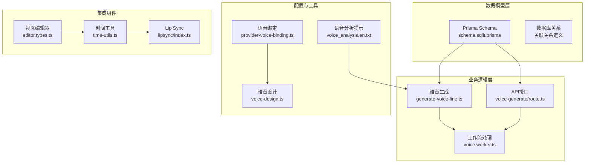
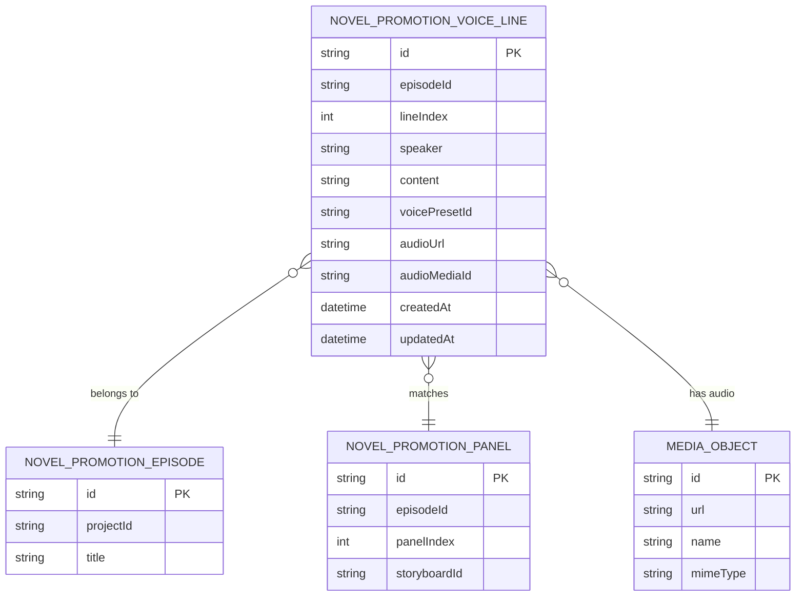
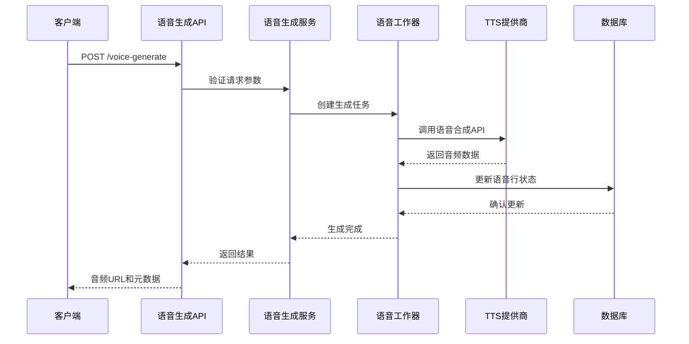
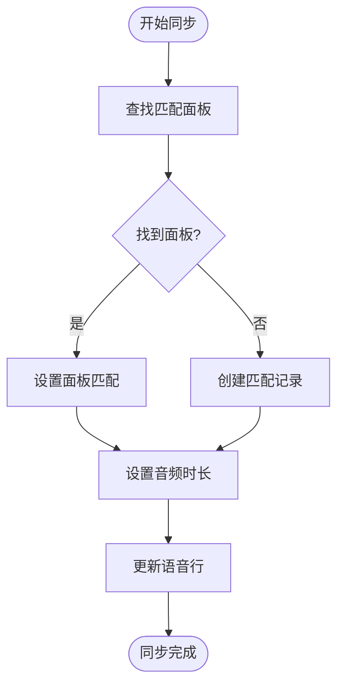
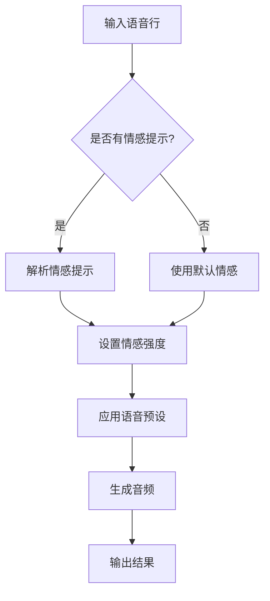
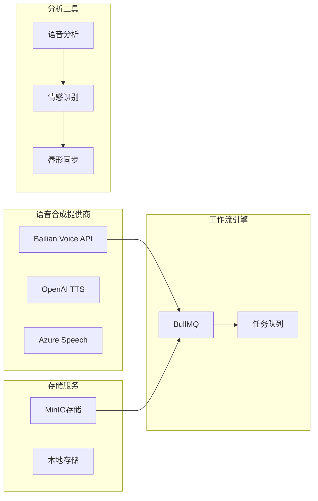
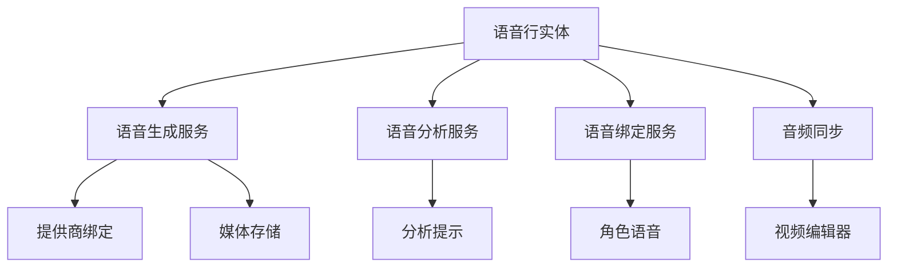

# 语音行实体

<cite>
**本文档引用的文件**
- [prisma/schema.sqlit.prisma](file://prisma/schema.sqlit.prisma)
- [src/lib/voice/generate-voice-line.ts](file://src/lib/voice/generate-voice-line.ts)
- [src/app/api/novel-promotion/[projectId]/voice-generate/route.ts](file://src/app/api/novel-promotion/[projectId]/voice-generate/route.ts)
- [lib/prompts/novel-promotion/voice_analysis.en.txt](file://lib/prompts/novel-promotion/voice_analysis.en.txt)
- [src/lib/workers/handlers/voice-analyze.ts](file://src/lib/workers/handlers/voice-analyze.ts)
- [src/lib/workers/handlers/voice-analyze-helpers.ts](file://src/lib/workers/handlers/voice-analyze-helpers.ts)
- [src/lib/workers/voice.worker.ts](file://src/lib/workers/voice.worker.ts)
- [src/lib/providers/bailian/voice-design.ts](file://src/lib/providers/bailian/voice-design.ts)
- [src/lib/providers/bailian/voice-manage.ts](file://src/lib/providers/bailian/voice-manage.ts)
- [src/lib/providers/bailian/voice-cleanup.ts](file://src/lib/providers/bailian/voice-cleanup.ts)
- [src/lib/voice/provider-voice-binding.ts](file://src/lib/voice/provider-voice-binding.ts)
- [src/lib/novel-promotion/stages/contracts/voice-stage-contract.ts](file://src/lib/novel-promotion/stages/contracts/voice-stage-contract.ts)
- [src/lib/query/mutations/character-voice-mutations.ts](file://src/lib/query/mutations/character-voice-mutations.ts)
- [src/lib/query/mutations/asset-hub-voice-mutations.ts](file://src/lib/query/mutations/asset-hub-voice-mutations.ts)
- [src/components/voice/voice-design-shared.ts](file://src/components/voice/voice-design-shared.ts)
- [src/features/video-editor/types/editor.types.ts](file://src/features/video-editor/types/editor.types.ts)
- [src/features/video-editor/utils/time-utils.ts](file://src/features/video-editor/utils/time-utils.ts)
- [src/lib/lipsync/index.ts](file://src/lib/lipsync/index.ts)
</cite>

## 目录
1. [简介](#简介)
2. [项目结构](#项目结构)
3. [核心组件](#核心组件)
4. [架构概览](#架构概览)
5. [详细组件分析](#详细组件分析)
6. [依赖分析](#依赖分析)
7. [性能考虑](#性能考虑)
8. [故障排除指南](#故障排除指南)
9. [结论](#结论)

## 简介

Waoowaoo项目中的小说推广语音行实体（NovelPromotionVoiceLine）是音频内容生成系统的核心数据模型，负责管理小说推广视频中的语音内容。该实体不仅存储语音行的基础信息，还承担着连接章节、面板与音频生成流程的重要桥梁作用。

语音行实体的设计理念围绕以下几个核心目标：
- **模块化设计**：将语音内容与视觉内容分离，支持灵活的音频生成和同步
- **情感表达**：通过情感提示和强度参数增强语音的表现力
- **工作流集成**：无缝对接小说推广的完整工作流程
- **扩展性**：支持多种语音合成提供商和音频格式

## 项目结构

基于代码库分析，小说推广语音行实体相关的文件组织结构如下：



**图表来源**
- [prisma/schema.sqlit.prisma](file://prisma/schema.sqlit.prisma)
- [src/lib/voice/generate-voice-line.ts](file://src/lib/voice/generate-voice-line.ts)
- [src/app/api/novel-promotion/[projectId]/voice-generate/route.ts](file://src/app/api/novel-promotion/[projectId]/voice-generate/route.ts)

**章节来源**
- [prisma/schema.sqlit.prisma](file://prisma/schema.sqlit.prisma)
- [src/lib/voice/generate-voice-line.ts](file://src/lib/voice/generate-voice-line.ts)
- [src/app/api/novel-promotion/[projectId]/voice-generate/route.ts](file://src/app/api/novel-promotion/[projectId]/voice-generate/route.ts)

## 核心组件

### 数据模型定义

语音行实体在Prisma Schema中定义为`NovelPromotionVoiceLine`模型，具有以下核心字段：

| 字段名 | 类型 | 描述 | 约束 |
|--------|------|------|------|
| id | String | UUID主键 | @id @default(uuid()) |
| episodeId | String | 所属剧集ID | 必填 |
| lineIndex | Int | 语音行索引 | 必填，唯一约束 |
| speaker | String | 说话人标识 | 必填 |
| content | String | 语音内容文本 | 必填 |
| voicePresetId | String? | 语音预设ID | 可选 |
| audioUrl | String? | 音频文件URL | 可选 |
| audioMediaId | String? | 音频媒体ID | 可选 |
| emotionPrompt | String? | 情感提示 | 可选 |
| emotionStrength | Float? | 情感强度 | 默认0.4 |
| matchedPanelIndex | Int? | 匹配面板索引 | 可选 |
| matchedStoryboardId | String? | 匹配故事板ID | 可选 |
| audioDuration | Int? | 音频时长（秒） | 可选 |
| matchedPanelId | String? | 匹配面板ID | 可选 |

### 关键关系定义

语音行实体与相关模型建立了以下关系：



**图表来源**
- [prisma/schema.sqlit.prisma](file://prisma/schema.sqlit.prisma)

**章节来源**
- [prisma/schema.sqlit.prisma](file://prisma/schema.sqlit.prisma)

## 架构概览

语音行实体在整个小说推广系统中的架构位置如下：

```mermaid
graph TB
subgraph "用户界面层"
UI[语音设计界面<br/>Voice Design Dialog]
VE[视频编辑器<br/>Video Editor]
end
subgraph "API服务层"
API[语音生成API<br/>/api/novel-promotion/[projectId]/voice-generate]
ASR[语音分析服务<br/>Voice Analysis]
end
subgraph "业务逻辑层"
VGS[语音生成服务<br/>Voice Generation Service]
VAS[语音分析服务<br/>Voice Analysis Service]
VBS[语音绑定服务<br/>Voice Binding Service]
end
subgraph "数据持久层"
PRISMA[Prisma ORM]
DB[(SQLite Database)]
end
subgraph "外部服务层"
TTS[TTS Provider<br/>Bailian Voice API]
STORAGE[存储服务<br/>Media Storage]
end
UI --> API
VE --> API
API --> VGS
API --> VAS
API --> VBS
VGS --> PRISMA
VAS --> PRISMA
VBS --> PRISMA
PRISMA --> DB
VGS --> TTS
VGS --> STORAGE
VAS --> ASR
```

**图表来源**
- [src/app/api/novel-promotion/[projectId]/voice-generate/route.ts](file://src/app/api/novel-promotion/[projectId]/voice-generate/route.ts)
- [src/lib/voice/generate-voice-line.ts](file://src/lib/voice/generate-voice-line.ts)
- [src/lib/workers/voice.worker.ts](file://src/lib/workers/voice.worker.ts)

## 详细组件分析

### 语音行生成流程

语音行的自动生成流程涉及多个组件的协同工作：



**图表来源**
- [src/app/api/novel-promotion/[projectId]/voice-generate/route.ts](file://src/app/api/novel-promotion/[projectId]/voice-generate/route.ts)
- [src/lib/voice/generate-voice-line.ts](file://src/lib/voice/generate-voice-line.ts)
- [src/lib/workers/voice.worker.ts](file://src/lib/workers/voice.worker.ts)

### 语音行与章节关系

语音行与章节（Episode）建立了强关联关系，这种关系体现在：

1. **层级结构**：每个语音行都必须归属于特定的剧集
2. **索引管理**：通过`lineIndex`字段维护语音行的顺序
3. **批量操作**：支持按剧集批量生成语音行
4. **状态同步**：语音行状态与剧集状态保持一致

### 语音行与面板同步

语音行与面板（Panel）的匹配机制确保了音频内容与视觉内容的精确同步：



**图表来源**
- [src/lib/voice/generate-voice-line.ts](file://src/lib/voice/generate-voice-line.ts)

### 情感调节机制

语音行支持情感调节功能，通过以下参数实现：

| 参数 | 类型 | 默认值 | 说明 |
|------|------|--------|------|
| emotionPrompt | String | null | 情感描述提示词 |
| emotionStrength | Float | 0.4 | 情感强度（0.0-1.0） |
| voicePresetId | String | null | 语音预设标识 |

情感调节的工作流程：



**图表来源**
- [src/lib/voice/generate-voice-line.ts](file://src/lib/voice/generate-voice-line.ts)

**章节来源**
- [src/lib/voice/generate-voice-line.ts](file://src/lib/voice/generate-voice-line.ts)
- [src/app/api/novel-promotion/[projectId]/voice-generate/route.ts](file://src/app/api/novel-promotion/[projectId]/voice-generate/route.ts)

## 依赖分析

### 外部依赖关系

语音行实体依赖于以下外部组件：



**图表来源**
- [src/lib/providers/bailian/voice-design.ts](file://src/lib/providers/bailian/voice-design.ts)
- [src/lib/workers/voice.worker.ts](file://src/lib/workers/voice.worker.ts)
- [src/lib/lipsync/index.ts](file://src/lib/lipsync/index.ts)

### 内部依赖关系

语音行实体与其他组件的依赖关系：



**图表来源**
- [src/lib/voice/generate-voice-line.ts](file://src/lib/voice/generate-voice-line.ts)
- [src/lib/voice/provider-voice-binding.ts](file://src/lib/voice/provider-voice-binding.ts)
- [src/lib/workers/handlers/voice-analyze.ts](file://src/lib/workers/handlers/voice-analyze.ts)

**章节来源**
- [src/lib/voice/generate-voice-line.ts](file://src/lib/voice/generate-voice-line.ts)
- [src/lib/voice/provider-voice-binding.ts](file://src/lib/voice/provider-voice-binding.ts)

## 性能考虑

### 数据访问优化

语音行实体的查询优化策略：

1. **索引设计**：为`episodeId`和`lineIndex`建立复合索引
2. **批量查询**：支持按剧集批量获取语音行
3. **分页处理**：大数据量场景下的分页查询
4. **缓存策略**：常用语音行数据的缓存机制

### 生成性能优化

语音生成过程的性能优化：

1. **并发处理**：支持多语音行并发生成
2. **资源池管理**：TTS提供商的连接池管理
3. **内存优化**：音频数据的内存使用控制
4. **超时处理**：长时间任务的超时机制

## 故障排除指南

### 常见问题及解决方案

| 问题类型 | 症状 | 可能原因 | 解决方案 |
|----------|------|----------|----------|
| 生成失败 | 语音行状态停留在"待生成" | TTS提供商错误 | 检查API密钥和网络连接 |
| 同步失败 | 音频与画面不同步 | 时间戳计算错误 | 验证音频时长和面板时长 |
| 情感调节无效 | 语音情感不符合预期 | 情感提示词格式错误 | 检查情感提示词语法 |
| 音频质量差 | 生成的音频质量不佳 | 语音预设配置错误 | 更换合适的语音预设 |

### 调试工具

系统提供了以下调试工具：

1. **语音分析工具**：分析语音内容和情感
2. **音频验证工具**：验证音频文件的完整性
3. **同步检查工具**：检查音频与画面的同步状态
4. **性能监控工具**：监控语音生成的性能指标

**章节来源**
- [src/lib/workers/handlers/voice-analyze.ts](file://src/lib/workers/handlers/voice-analyze.ts)
- [src/lib/workers/handlers/voice-analyze-helpers.ts](file://src/lib/workers/handlers/voice-analyze-helpers.ts)

## 结论

Waoowaoo项目中的小说推广语音行实体展现了现代音频内容生成系统的最佳实践。通过精心设计的数据模型、完善的业务流程和强大的技术架构，该实体成功实现了：

1. **模块化设计**：语音内容与视觉内容的完美分离
2. **情感表达**：通过情感提示和强度参数增强语音表现力
3. **工作流集成**：无缝对接小说推广的完整工作流程
4. **扩展性**：支持多种语音合成提供商和音频格式
5. **性能优化**：高效的批量处理和并发执行能力

该语音行实体不仅满足了当前的业务需求，还为未来的功能扩展和技术升级奠定了坚实的基础。通过持续的优化和完善，它将继续在小说推广音频内容生成领域发挥重要作用。