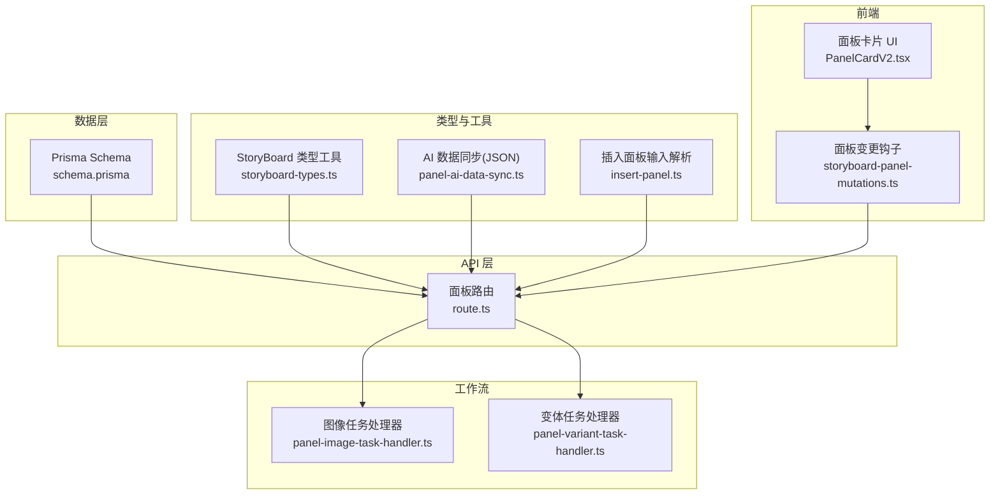
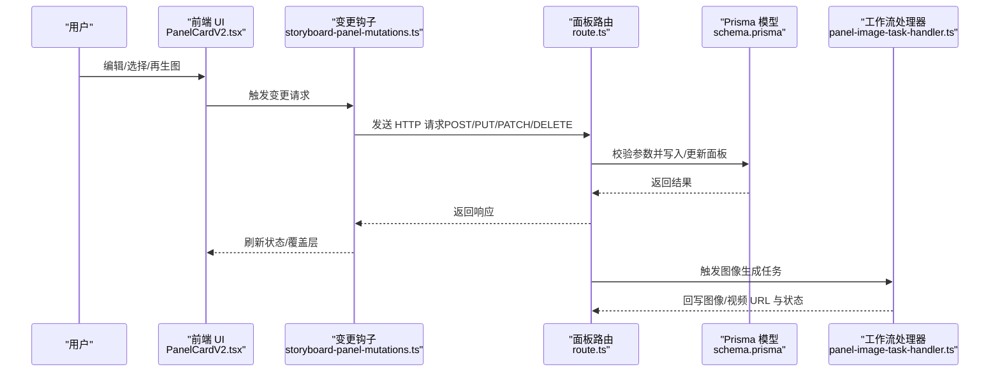
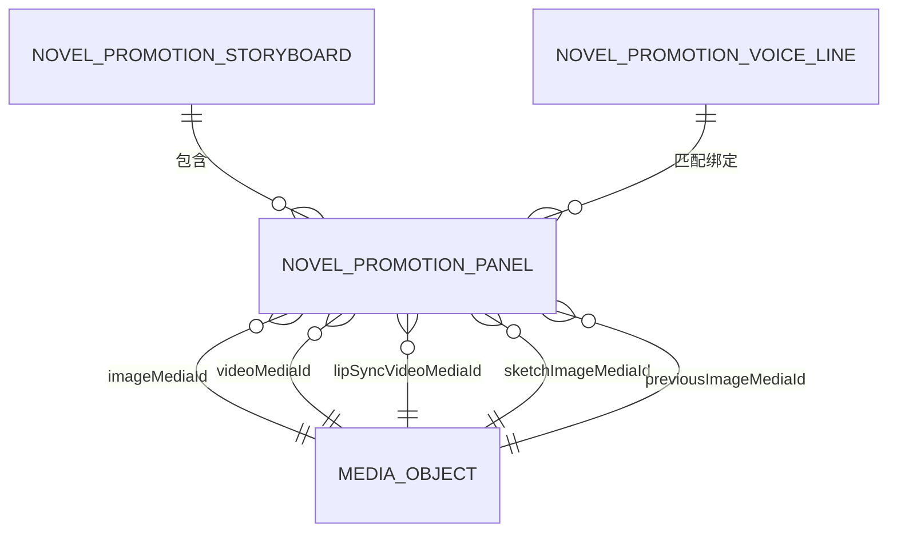
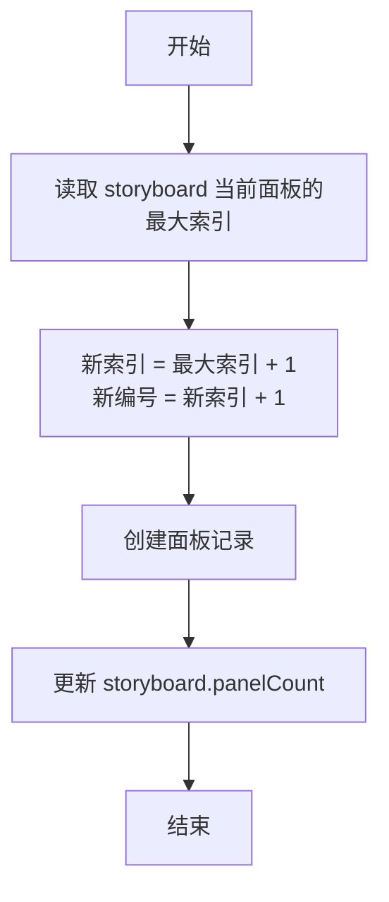
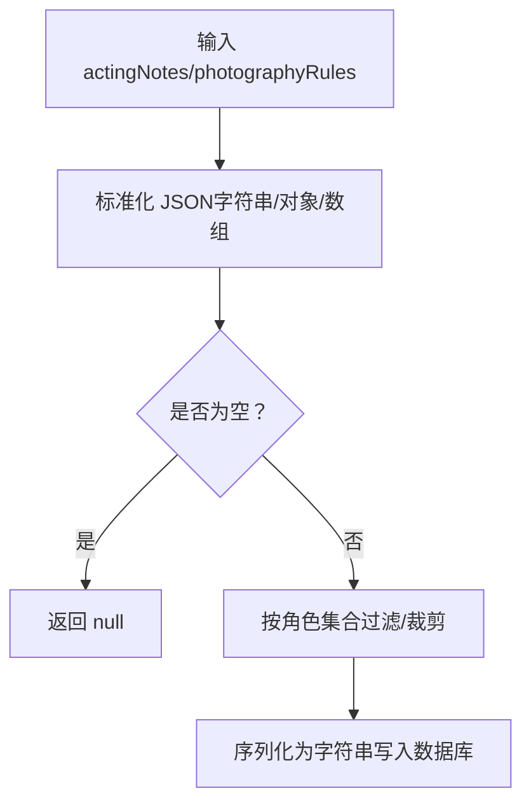
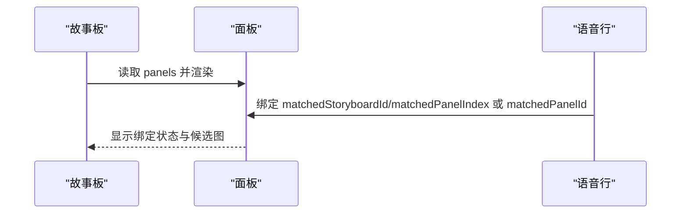
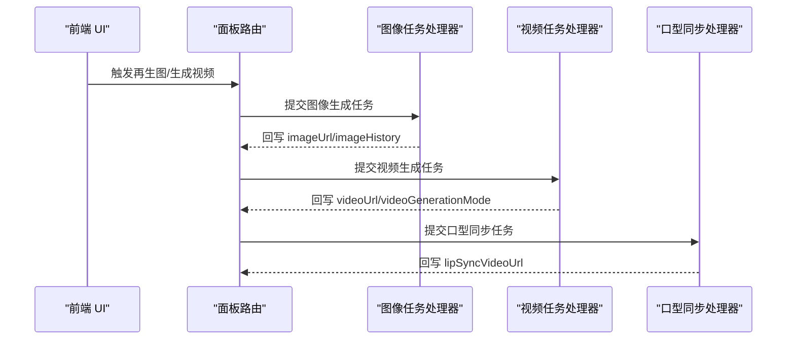
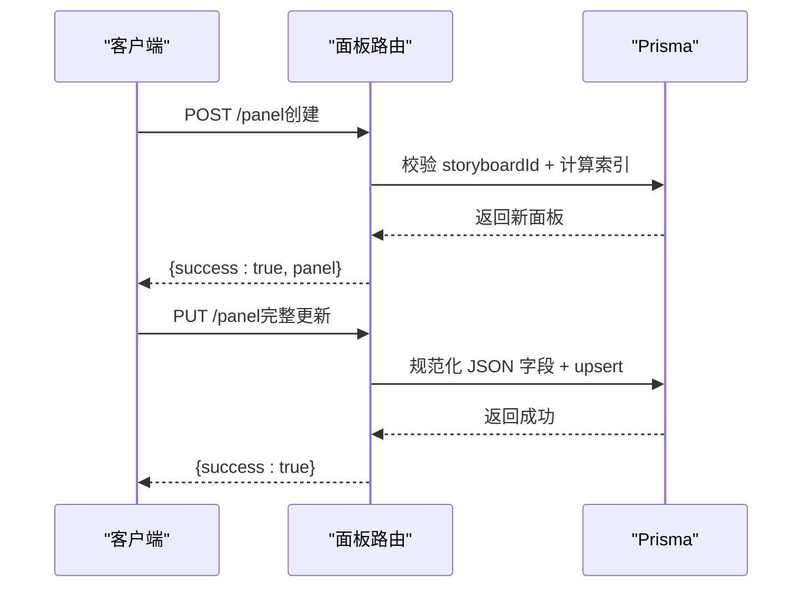
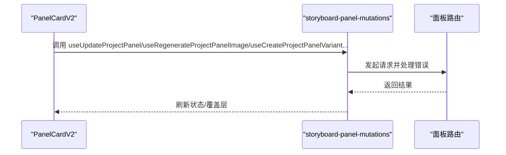
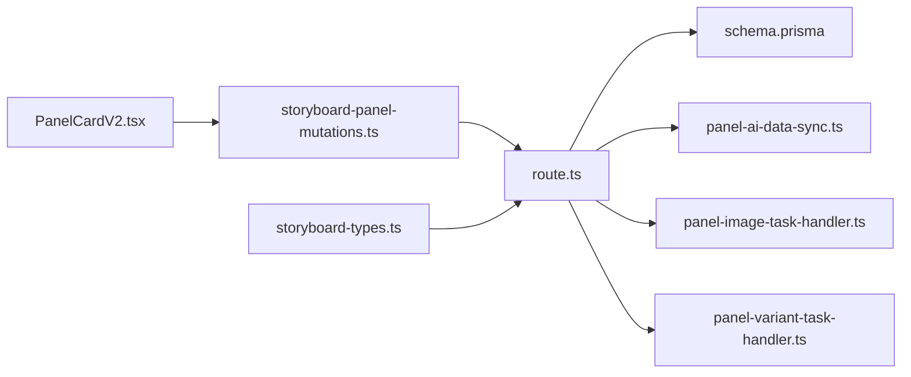

# 面板实体

<cite>
**本文引用的文件**
- [schema.prisma](file://prisma/schema.prisma)
- [route.ts](file://src/app/api/novel-promotion/[projectId]/panel/route.ts)
- [storyboard-types.ts](file://src/types/storyboard-types.ts)
- [panel-ai-data-sync.ts](file://src/lib/novel-promotion/panel-ai-data-sync.ts)
- [insert-panel.ts](file://src/lib/novel-promotion/insert-panel.ts)
- [PanelCardV2.tsx](file://src/components/ui/patterns/PanelCardV2.tsx)
- [storyboard-panel-mutations.ts](file://src/lib/query/mutations/storyboard-panel-mutations.ts)
- [panel-image-task-handler.ts](file://src/lib/workers/handlers/panel-image-task-handler.ts)
- [panel-variant-task-handler.ts](file://src/lib/workers/handlers/panel-variant-task-handler.ts)
- [crud-routes.test.ts](file://tests/integration/api/contract/crud-routes.test.ts)
- [panel-variant-route.test.ts](file://tests/integration/api/specific/panel-variant-route.test.ts)
- [image-task-handlers-core.test.ts](file://tests/unit/worker/image-task-handlers-core.test.ts)
</cite>

## 目录
1. [简介](#简介)
2. [项目结构](#项目结构)
3. [核心组件](#核心组件)
4. [架构总览](#架构总览)
5. [详细组件分析](#详细组件分析)
6. [依赖分析](#依赖分析)
7. [性能考量](#性能考量)
8. [故障排查指南](#故障排查指南)
9. [结论](#结论)
10. [附录](#附录)

## 简介
本文件系统化梳理 Waoowaoo 中“小说推广”模式下的“面板实体（NovelPromotionPanel）”。该实体是视频生成流水线的基本单元，承载镜头类型、摄影规则、表演指导、语音行绑定、图像与视频生成状态、口型同步等关键信息。本文将从设计理念、数据结构、API 接口、工作流与依赖关系等方面进行深入说明，并提供可视化图示与排障建议，帮助开发者高效理解与扩展。

## 项目结构
围绕面板实体的关键目录与文件如下：
- 数据层：Prisma 模型定义位于 schema.prisma，包含 NovelPromotionPanel、NovelPromotionStoryboard、NovelPromotionVoiceLine 等。
- API 层：Next.js 路由处理面板的增删改查与属性更新。
- 类型与工具：storyboard-types.ts 提供 StoryboardWithPanels 等类型辅助；panel-ai-data-sync.ts 提供 JSON 结构化字段的规范化与同步。
- 前端交互：PanelCardV2.tsx 作为面板卡片 UI，驱动用户对面板进行编辑、候选图选择与再生图。
- 查询与变更：storyboard-panel-mutations.ts 提供 React Query 变更钩子，封装面板相关 API 请求。
- 工作流与任务：panel-image-task-handler.ts、panel-variant-task-handler.ts 处理面板图像与变体生成任务。
- 测试：crud-routes.test.ts、panel-variant-route.test.ts、image-task-handlers-core.test.ts 验证 API 行为与任务更新。

**图表来源**
- [schema.prisma](file://prisma/schema.prisma)
- [route.ts](file://src/app/api/novel-promotion/[projectId]/panel/route.ts)
- [storyboard-types.ts](file://src/types/storyboard-types.ts)
- [panel-ai-data-sync.ts](file://src/lib/novel-promotion/panel-ai-data-sync.ts)
- [insert-panel.ts](file://src/lib/novel-promotion/insert-panel.ts)
- [PanelCardV2.tsx](file://src/components/ui/patterns/PanelCardV2.tsx)
- [storyboard-panel-mutations.ts](file://src/lib/query/mutations/storyboard-panel-mutations.ts)
- [panel-image-task-handler.ts](file://src/lib/workers/handlers/panel-image-task-handler.ts)
- [panel-variant-task-handler.ts](file://src/lib/workers/handlers/panel-variant-task-handler.ts)

**章节来源**
- [schema.prisma](file://prisma/schema.prisma)
- [route.ts](file://src/app/api/novel-promotion/[projectId]/panel/route.ts)
- [storyboard-types.ts](file://src/types/storyboard-types.ts)
- [panel-ai-data-sync.ts](file://src/lib/novel-promotion/panel-ai-data-sync.ts)
- [insert-panel.ts](file://src/lib/novel-promotion/insert-panel.ts)
- [PanelCardV2.tsx](file://src/components/ui/patterns/PanelCardV2.tsx)
- [storyboard-panel-mutations.ts](file://src/lib/query/mutations/storyboard-panel-mutations.ts)
- [panel-image-task-handler.ts](file://src/lib/workers/handlers/panel-image-task-handler.ts)
- [panel-variant-task-handler.ts](file://src/lib/workers/handlers/panel-variant-task-handler.ts)

## 核心组件
- 面板实体（NovelPromotionPanel）
  - 作为视频生成的基本单元，记录镜头索引、镜头类型、摄影规则、表演指导、语音行绑定、图像/视频生成状态、口型同步等。
  - 关键字段：storyboardId、panelIndex、panelNumber、shotType、cameraMove、description、location、characters、props、srtSegment/srtStart/srtEnd/duration、imagePrompt/imageUrl/imageHistory、videoPrompt/firstLastFramePrompt/videoUrl/videoGenerationMode、photographyRules、actingNotes、candidateImages、linkedToNextPanel、lipSyncTaskId/lipSyncVideoUrl、sketchImageUrl、previousImageUrl 等。
- 故事板（NovelPromotionStoryboard）
  - 与面板一对多关系，维护 panelCount 用于快速统计。
- 语音行（NovelPromotionVoiceLine）
  - 与面板多对多绑定，支持按索引或面板 ID 进行匹配与播放。

**章节来源**
- [schema.prisma](file://prisma/schema.prisma)
- [storyboard-types.ts](file://src/types/storyboard-types.ts)

## 架构总览
面板实体贯穿“输入（文本/语音）—图像—视频—口型同步”的完整链路，API 层负责数据持久化与校验，前端负责交互与状态反馈，工作流负责异步任务编排与执行。

**图表来源**
- [PanelCardV2.tsx](file://src/components/ui/patterns/PanelCardV2.tsx)
- [storyboard-panel-mutations.ts](file://src/lib/query/mutations/storyboard-panel-mutations.ts)
- [route.ts](file://src/app/api/novel-promotion/[projectId]/panel/route.ts)
- [schema.prisma](file://prisma/schema.prisma)
- [panel-image-task-handler.ts](file://src/lib/workers/handlers/panel-image-task-handler.ts)

## 详细组件分析

### 数据模型与关系
- 面板与故事板：一对多，通过 storyboardId 关联；唯一约束为 storyboardId + panelIndex，保证同一故事板内面板顺序唯一。
- 面板与语音行：多对多，通过 matchedStoryboardId/matchedPanelIndex 或 matchedPanelId 进行绑定。
- 面板与媒体对象：通过 imageMediaId/videoMediaId/lipSyncVideoMediaId/sketchImageMediaId/previousImageMediaId 关联媒体表，支持历史版本与候选图管理。

**图表来源**
- [schema.prisma](file://prisma/schema.prisma)

**章节来源**
- [schema.prisma](file://prisma/schema.prisma)

### 面板索引与排序
- 面板索引（panelIndex）与编号（panelNumber）：新增面板时自动取当前最大索引 + 1；删除面板时通过两阶段偏移批量更新，避免唯一约束冲突。
- 故事板计数（panelCount）：每次增删改后同步更新，便于前端快速渲染与统计。

**图表来源**
- [route.ts](file://src/app/api/novel-promotion/[projectId]/panel/route.ts)

**章节来源**
- [route.ts](file://src/app/api/novel-promotion/[projectId]/panel/route.ts)

### 镜头类型、摄影规则与表演指导
- 镜头类型（shotType）与摄影规则（photographyRules）：均以结构化 JSON 存储，支持对象或数组形式，便于 AI 生成与前端解析。
- 演技指导（actingNotes）：支持按角色过滤与同步，当角色列表变化时自动裁剪 JSON 内容，保持一致性。
- 输入解析：insert-panel.ts 提供插入面板时的用户输入解析逻辑，支持中英文默认提示词与显式输入优先级。

**图表来源**
- [panel-ai-data-sync.ts](file://src/lib/novel-promotion/panel-ai-data-sync.ts)

**章节来源**
- [panel-ai-data-sync.ts](file://src/lib/novel-promotion/panel-ai-data-sync.ts)
- [insert-panel.ts](file://src/lib/novel-promotion/insert-panel.ts)

### 与故事板、语音行的关系
- 故事板（Storyboard）：包含 panels 列表与 panelCount，用于快速渲染与统计。
- 语音行（VoiceLine）：支持按 lineIndex 或 matchedStoryboardId/matchedPanelIndex 进行绑定，便于视频与语音对齐。
- 候选图与历史图：candidateImages 与 imageHistory 以 JSON 字符串存储，提供候选图选择与历史回溯能力。

**图表来源**
- [storyboard-types.ts](file://src/types/storyboard-types.ts)
- [schema.prisma](file://prisma/schema.prisma)

**章节来源**
- [storyboard-types.ts](file://src/types/storyboard-types.ts)
- [schema.prisma](file://prisma/schema.prisma)

### 图像生成、视频生成与口型同步
- 图像生成：前端触发再生图，API 写入 imagePrompt，工作流处理器根据策略生成图像并回写 imageUrl 与 imageHistory。
- 视频生成：支持普通视频与首尾帧模式（videoGenerationMode），分别写入 videoPrompt/firstLastFramePrompt，生成后回写 videoUrl。
- 口型同步：生成完成后触发口型同步任务，回写 lipSyncVideoUrl 并建立面板与语音行的同步链接。

**图表来源**
- [route.ts](file://src/app/api/novel-promotion/[projectId]/panel/route.ts)
- [panel-image-task-handler.ts](file://src/lib/workers/handlers/panel-image-task-handler.ts)
- [panel-variant-task-handler.ts](file://src/lib/workers/handlers/panel-variant-task-handler.ts)

**章节来源**
- [route.ts](file://src/app/api/novel-promotion/[projectId]/panel/route.ts)
- [panel-image-task-handler.ts](file://src/lib/workers/handlers/panel-image-task-handler.ts)
- [panel-variant-task-handler.ts](file://src/lib/workers/handlers/panel-variant-task-handler.ts)

### 面板创建、编辑、生成的 API 接口说明
- 新增面板（POST /api/novel-promotion/[projectId]/panel）
  - 必填：storyboardId
  - 自动：计算 panelIndex 与 panelNumber，创建记录并更新 storyboard.panelCount
- 删除面板（DELETE /api/novel-promotion/[projectId]/panel?panelId=...）
  - 事务：删除 + 两阶段批量重排 + 重新计算 panelCount
- 更新面板属性（PATCH /api/novel-promotion/[projectId]/panel）
  - 支持两种方式：panelId 直接更新；或 storyboardId + panelIndex 兼容更新
  - 可更新：videoPrompt、firstLastFramePrompt
- 完整更新面板（PUT /api/novel-promotion/[projectId]/panel）
  - 可更新：shotType、cameraMove、description、location、characters、props、srtStart/srtEnd/duration、videoPrompt、firstLastFramePrompt、actingNotes、photographyRules
  - JSON 字段统一规范化存储

**图表来源**
- [route.ts](file://src/app/api/novel-promotion/[projectId]/panel/route.ts)

**章节来源**
- [route.ts](file://src/app/api/novel-promotion/[projectId]/panel/route.ts)

### 前端交互与变更钩子
- 面板卡片（PanelCardV2.tsx）：提供编辑、再生图、候选图选择、错误清理等能力。
- 变更钩子（storyboard-panel-mutations.ts）：封装面板 CRUD、再生图、变体生成、故事板组操作等请求，统一错误处理与缓存失效。

**图表来源**
- [PanelCardV2.tsx](file://src/components/ui/patterns/PanelCardV2.tsx)
- [storyboard-panel-mutations.ts](file://src/lib/query/mutations/storyboard-panel-mutations.ts)
- [route.ts](file://src/app/api/novel-promotion/[projectId]/panel/route.ts)

**章节来源**
- [PanelCardV2.tsx](file://src/components/ui/patterns/PanelCardV2.tsx)
- [storyboard-panel-mutations.ts](file://src/lib/query/mutations/storyboard-panel-mutations.ts)

## 依赖分析
- 组件耦合
  - API 路由直接依赖 Prisma 模型与权限校验；与工作流处理器解耦，通过任务系统异步执行。
  - 前端变更钩子与 UI 组件通过 API 路由解耦，便于独立演进。
- 外部依赖
  - 媒体对象（MediaObject）：通过外键关联，支持图像/视频/口型同步等资源管理。
  - 语音行（VoiceLine）：与面板绑定，支撑视频与语音对齐。

**图表来源**
- [route.ts](file://src/app/api/novel-promotion/[projectId]/panel/route.ts)
- [schema.prisma](file://prisma/schema.prisma)
- [panel-ai-data-sync.ts](file://src/lib/novel-promotion/panel-ai-data-sync.ts)
- [panel-image-task-handler.ts](file://src/lib/workers/handlers/panel-image-task-handler.ts)
- [panel-variant-task-handler.ts](file://src/lib/workers/handlers/panel-variant-task-handler.ts)
- [PanelCardV2.tsx](file://src/components/ui/patterns/PanelCardV2.tsx)
- [storyboard-panel-mutations.ts](file://src/lib/query/mutations/storyboard-panel-mutations.ts)
- [storyboard-types.ts](file://src/types/storyboard-types.ts)

**章节来源**
- [route.ts](file://src/app/api/novel-promotion/[projectId]/panel/route.ts)
- [schema.prisma](file://prisma/schema.prisma)
- [panel-ai-data-sync.ts](file://src/lib/novel-promotion/panel-ai-data-sync.ts)
- [panel-image-task-handler.ts](file://src/lib/workers/handlers/panel-image-task-handler.ts)
- [panel-variant-task-handler.ts](file://src/lib/workers/handlers/panel-variant-task-handler.ts)
- [PanelCardV2.tsx](file://src/components/ui/patterns/PanelCardV2.tsx)
- [storyboard-panel-mutations.ts](file://src/lib/query/mutations/storyboard-panel-mutations.ts)
- [storyboard-types.ts](file://src/types/storyboard-types.ts)

## 性能考量
- 批量重排优化：删除面板时采用两阶段偏移（offset）避免唯一约束冲突，随后回落到正确索引，减少锁竞争与循环更新成本。
- panelCount 缓存：每次变更后仅更新 storyboard.panelCount，降低复杂查询开销。
- JSON 字段规范化：actingNotes/photographyRules 统一序列化，减少前端解析负担。
- 任务异步化：图像/视频/口型同步通过工作流异步执行，避免阻塞 API 响应。

[本节为通用性能讨论，无需列出具体文件来源]

## 故障排查指南
- 参数校验失败（INVALID_PARAMS）
  - 检查必填字段（如 storyboardId、panelIndex）与数值字段格式。
- 资源未找到（NOT_FOUND）
  - 确认 storyboardId/panelId 是否存在；检查 storyId 与 panelIndex 组合唯一性。
- 事务超时或锁冲突
  - 删除面板时若面板数量较多，可能触发批量更新超时；建议分批操作或优化数据库索引。
- JSON 字段异常
  - actingNotes/photographyRules 需为合法 JSON；若为字符串需可被二次解析。
- 再生图失败
  - 检查配额限制、敏感内容拦截与网络异常；前端变更钩子会捕获并提示。

**章节来源**
- [route.ts](file://src/app/api/novel-promotion/[projectId]/panel/route.ts)
- [storyboard-panel-mutations.ts](file://src/lib/query/mutations/storyboard-panel-mutations.ts)

## 结论
NovelPromotionPanel 作为小说推广视频生成流水线的核心实体，承担了从文本/语音到图像/视频再到口型同步的桥梁职责。其设计强调：
- 索引与排序的原子性与一致性；
- 结构化 JSON 字段的规范化与角色级同步；
- 与故事板、语音行的强关联与弱耦合；
- 前后端分离与异步任务的清晰边界。

通过本文档的接口说明、流程图与排障建议，开发者可以高效地扩展与维护面板实体相关功能。

## 附录
- 相关测试用例参考
  - CRUD 行为验证：[crud-routes.test.ts](file://tests/integration/api/contract/crud-routes.test.ts)
  - 面板变体路由行为：[panel-variant-route.test.ts](file://tests/integration/api/specific/panel-variant-route.test.ts)
  - 图像任务处理器更新回写：[image-task-handlers-core.test.ts](file://tests/unit/worker/image-task-handlers-core.test.ts)