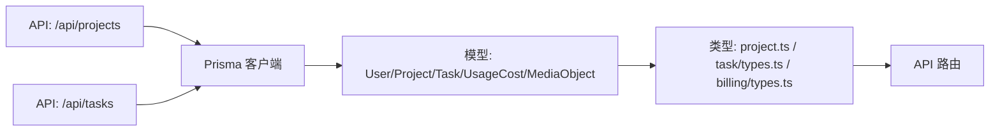
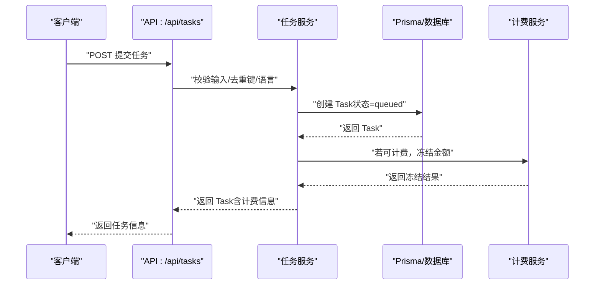

# 核心业务模型

<cite>
**本文引用的文件**
- [prisma/schema.prisma](file://prisma/schema.prisma)
- [src/types/project.ts](file://src/types/project.ts)
- [src/lib/task/types.ts](file://src/lib/task/types.ts)
- [src/lib/billing/types.ts](file://src/lib/billing/types.ts)
- [src/lib/projects/validation.ts](file://src/lib/projects/validation.ts)
- [src/lib/novel-promotion/stage-readiness.ts](file://src/lib/novel-promotion/stage-readiness.ts)
- [src/app/api/projects/route.ts](file://src/app/api/projects/route.ts)
- [src/app/api/tasks/route.ts](file://src/app/api/tasks/route.ts)
- [src/lib/task/service.ts](file://src/lib/task/service.ts)
</cite>

## 目录
1. [简介](#简介)
2. [项目结构](#项目结构)
3. [核心组件](#核心组件)
4. [架构总览](#架构总览)
5. [详细组件分析](#详细组件分析)
6. [依赖分析](#依赖分析)
7. [性能考量](#性能考量)
8. [故障排查指南](#故障排查指南)
9. [结论](#结论)
10. [附录](#附录)

## 简介
本文件系统性梳理 Waoowaoo 的核心业务模型，围绕 Project（项目）、NovelPromotionProject（小说推广项目）、User（用户）、Task（任务）、UsageCost（使用成本）等关键实体，阐明其字段定义、数据类型、约束条件、业务含义与关系设计；并结合实际 API 实现与类型定义，解释主键、外键、唯一约束与索引的设计考量，以及数据验证规则、默认值与业务规则。最后，给出项目管理、小说推广、任务执行等核心业务流程中的数据流转与状态管理说明。

## 项目结构
本项目采用基于 Prisma 的数据库建模与 Next.js API 路由实现相结合的方式：
- 数据层：通过 Prisma Schema 描述实体与关系，并生成客户端。
- 类型层：在 TypeScript 中定义业务模型接口，确保前后端一致性。
- 服务层：在 API 路由中调用 Prisma 与业务服务模块，完成数据校验、聚合与持久化。
- 任务与计费：通过 Task 与 UsageCost/账务相关模型支撑异步任务编排与计费闭环。

```mermaid
graph TB
subgraph "数据层(Prisma)"
U["User"]
P["Project"]
NPP["NovelPromotionProject"]
T["Task"]
UC["UsageCost"]
MO["MediaObject"]
end
subgraph "类型层(TypeScript)"
TP["Project 类型定义"]
TT["Task 类型定义"]
BT["计费类型定义"]
NPV["小说推广阶段就绪工具"]
end
subgraph "服务层(API 路由)"
APIP["/api/projects"]
APIT["/api/tasks"]
end
U -- "1" --> |"拥有"| P
P -- "1" --> |"包含"| NPP
P -- "N" --> |"产生"| UC
U -- "N" --> |"创建/参与"| T
T -- "N" --> |"记录计费"| UC
NPP -- "N" --> |"生成"| T
T -- "N" --> |"引用媒体"| MO
UC -- "N" --> |"引用媒体"| MO
TP -.-> P
TT -.-> T
BT -.-> UC
NPV -.-> NPP
APIP -.-> P
APIT -.-> T
```

图表来源
- [prisma/schema.prisma](file://prisma/schema.prisma)
- [src/types/project.ts](file://src/types/project.ts)
- [src/lib/task/types.ts](file://src/lib/task/types.ts)
- [src/lib/billing/types.ts](file://src/lib/billing/types.ts)
- [src/lib/novel-promotion/stage-readiness.ts](file://src/lib/novel-promotion/stage-readiness.ts)
- [src/app/api/projects/route.ts](file://src/app/api/projects/route.ts)
- [src/app/api/tasks/route.ts](file://src/app/api/tasks/route.ts)

章节来源
- [prisma/schema.prisma](file://prisma/schema.prisma)
- [src/types/project.ts](file://src/types/project.ts)
- [src/lib/task/types.ts](file://src/lib/task/types.ts)
- [src/lib/billing/types.ts](file://src/lib/billing/types.ts)
- [src/lib/novel-promotion/stage-readiness.ts](file://src/lib/novel-promotion/stage-readiness.ts)
- [src/app/api/projects/route.ts](file://src/app/api/projects/route.ts)
- [src/app/api/tasks/route.ts](file://src/app/api/tasks/route.ts)

## 核心组件
本节从“实体-字段-约束-关系”的角度，逐项解析核心业务模型。

- User（用户）
  - 主键：id（UUID）
  - 唯一约束：name
  - 关系：1 对多（拥有）Project、Account、Session；1 对 1（拥有）UserBalance、UserPreference；多对多（通过中间表）GraphRun/GraphEvent/Task/TaskEvent 等
  - 约束与默认：createdAt 默认 now；updatedAt 自动更新
  - 业务含义：系统身份主体，承载偏好、余额、资产中心与任务事件

- Project（项目）
  - 主键：id（UUID）
  - 外键：userId → User(id)，级联删除
  - 唯一约束：无；索引：userId
  - 关系：1 对 1（关联）NovelPromotionProject；1 对 多（拥有）UsageCost
  - 约束与默认：createdAt/updatedAt 默认 now；lastAccessedAt 可空
  - 业务含义：承载小说推广项目的基础元数据与计费聚合

- NovelPromotionProject（小说推广项目）
  - 主键：id（UUID）
  - 外键：projectId → Project(id)，级联删除
  - 唯一约束：projectId 唯一；索引：novelPromotionProjectId、audioMediaId
  - 关系：1 对 1（关联）Project；1 对 多（拥有）Character、Episode、Location
  - 约束与默认：videoRatio 默认 "9:16"；ttsRate 默认 "+50%"；artStyle 默认 "american-comic"；videoResolution 默认 "720p"；imageResolution 默认 "2K"；workflowMode 默认 "srt"
  - 业务含义：承载小说推广工作流的配置与产物聚合（角色、场景、剧集、分镜、镜头、配音等）

- Task（任务）
  - 主键：id（UUID）
  - 外键：userId → User(id)；projectId → Project(id)；episodeId → NovelPromotionEpisode(id)?
  - 唯一约束：dedupeKey；索引：status、type、targetType/targetId、projectId、userId、heartbeatAt
  - 关系：1 对 多（拥有）TaskEvent；1 对 1（关联）User
  - 约束与默认：status 默认 "queued"；progress 默认 0；attempt/maxAttempts 默认 0/5；priority 默认 0；createdAt/updatedAt 默认 now
  - 业务含义：承载异步任务生命周期（排队/处理/完成/失败/取消/忽略），并记录计费信息

- UsageCost（使用成本）
  - 主键：id（UUID）
  - 外键：projectId → Project(id)；userId → User(id)
  - 索引：apiType、createdAt、projectId、userId
  - 关系：1 对 1（关联）Project；1 对 1（关联）User
  - 约束与默认：cost 使用 Decimal(18,6)；metadata 文本；createdAt 默认 now
  - 业务含义：记录任务产生的计费明细，支持按项目/用户/时间聚合

- MediaObject（媒体对象）
  - 主键：id（UUID）
  - 唯一约束：publicId、storageKey
  - 索引：createdAt
  - 关系：多对多（通过各实体的 mediaId 字段）关联到多个业务实体（如 Panel/Image、VoiceLine/Audio 等）
  - 约束与默认：尺寸、分辨率、时长等字段可空
  - 业务含义：统一管理图片/视频/音频等媒体资源的元数据与引用

章节来源
- [prisma/schema.prisma](file://prisma/schema.prisma)

## 架构总览
下图展示核心业务模型之间的关系与交互，强调一对一、一对多与多对多关系的实现方式。

```mermaid
erDiagram
USER {
string id PK
string name UK
string email
datetime createdAt
datetime updatedAt
}
PROJECT {
string id PK
string userId FK
string name
string description
datetime createdAt
datetime updatedAt
datetime lastAccessedAt
}
NOVEL_PROMOTION_PROJECT {
string id PK
string projectId UK FK
string analysisModel
string imageModel
string videoModel
string audioModel
string videoRatio
string ttsRate
string artStyle
string workflowMode
string videoResolution
string imageResolution
}
TASK {
string id PK
string userId FK
string projectId FK
string episodeId FK
string type
string targetType
string targetId
string status
int progress
int attempt
int maxAttempts
int priority
string dedupeKey UK
json payload
json result
string errorCode
text errorMessage
datetime createdAt
datetime updatedAt
}
USAGE_COST {
string id PK
string projectId FK
string userId FK
string apiType
string model
string action
int quantity
string unit
decimal cost
text metadata
datetime createdAt
}
MEDIA_OBJECT {
string id PK
string publicId UK
string storageKey UK
string mimeType
bigint sizeBytes
int width
int height
int durationMs
datetime createdAt
datetime updatedAt
}
USER ||--o{ PROJECT : "拥有"
PROJECT ||--|| NOVEL_PROMOTION_PROJECT : "包含"
PROJECT ||--o{ USAGE_COST : "产生"
USER ||--o{ TASK : "创建/参与"
TASK ||--o{ USAGE_COST : "计费"
TASK ||--o{ MEDIA_OBJECT : "引用"
NOVEL_PROMOTION_PROJECT ||--o{ TASK : "驱动"
```

图表来源
- [prisma/schema.prisma](file://prisma/schema.prisma)

## 详细组件分析

### Project（项目）
- 字段与约束
  - id（UUID，PK）、userId（FK，外键）、name/description（文本）、lastAccessedAt（时间戳，可空）、createdAt/updatedAt（默认 now）
  - 索引：userId
- 关系
  - 1 对 1：关联 NovelPromotionProject（通过 projectId）
  - 1 对 多：关联 UsageCost（按项目聚合计费）
- 业务规则
  - 项目列表支持分页、搜索（名称/描述模糊匹配）、按最近访问与更新时间排序
  - 创建项目时合并用户偏好作为默认值，不自动创建默认剧集
- 数据验证
  - 名称必填且长度限制；描述长度限制；非法参数返回标准化错误

章节来源
- [prisma/schema.prisma](file://prisma/schema.prisma)
- [src/app/api/projects/route.ts](file://src/app/api/projects/route.ts)
- [src/lib/projects/validation.ts](file://src/lib/projects/validation.ts)

### NovelPromotionProject（小说推广项目）
- 字段与约束
  - id（UUID，PK）、projectId（UUID，UK，FK，级联删除）
  - 配置字段：analysisModel、imageModel、videoModel、audioModel、characterModel、locationModel、storyboardModel、editModel、videoRatio、ttsRate、artStyle、artStylePrompt、videoResolution、imageResolution、capabilityOverrides、workflowMode、lastEpisodeId、importStatus
  - 索引：novelPromotionProjectId、audioMediaId
- 关系
  - 1 对 1：关联 Project
  - 1 对 多：关联 Character、Episode、Location
- 业务规则
  - 默认值来源于用户偏好；artStylePrompt 通过实时查询获取，不持久化
  - workflowMode 支持 srt/agent 两种模式
- 数据验证
  - 仅在创建时根据用户偏好初始化配置字段

章节来源
- [prisma/schema.prisma](file://prisma/schema.prisma)
- [src/app/api/projects/route.ts](file://src/app/api/projects/route.ts)
- [src/types/project.ts](file://src/types/project.ts)

### User（用户）
- 字段与约束
  - id（UUID，PK）、name（UK）、email/emailVerified/password（可空）、createdAt/updatedAt（默认 now）
  - 索引：无（但关系字段在其他表上建立索引）
- 关系
  - 1 对 多：拥有 Project/Account/Session
  - 1 对 1：拥有 UserBalance/UserPreference
  - 多对多：通过中间表关联 GraphRun/GraphEvent/Task/TaskEvent
- 业务规则
  - 用户偏好影响小说推广项目默认配置
  - 支持资产中心（全局角色/场景/音色/文件夹）与任务事件

章节来源
- [prisma/schema.prisma](file://prisma/schema.prisma)

### Task（任务）
- 字段与约束
  - id（UUID，PK）、userId/projectId/episodeId（FKs）、type/targetType/targetId（任务目标）、status（默认 queued）、progress（默认 0）、attempt/maxAttempts（默认 0/5）、priority（默认 0）、dedupeKey（UK）、payload/result（JSON）、errorCode/errorMessage（文本）、billingInfo（JSON）、心跳与时间戳字段
  - 索引：status、type、targetType/targetId、projectId、userId、heartbeatAt
- 关系
  - 1 对 多：拥有 TaskEvent；1 对 1：关联 User
- 业务规则
  - 去重键 dedupeKey：避免重复提交；活跃状态（排队/处理）下校验队列作业存活，否则回滚计费并替换
  - 心跳超时清理：watchdog 超时将失败并回滚计费
  - 成功/失败/取消均记录结构化错误码与消息
- 数据验证
  - 任务类型与生命周期事件枚举化；支持 SSE 事件推送

章节来源
- [prisma/schema.prisma](file://prisma/schema.prisma)
- [src/lib/task/types.ts](file://src/lib/task/types.ts)
- [src/lib/task/service.ts](file://src/lib/task/service.ts)
- [src/app/api/tasks/route.ts](file://src/app/api/tasks/route.ts)

### UsageCost（使用成本）
- 字段与约束
  - id（UUID，PK）、projectId/projectId（FKs）、userId（FK）、apiType/model/action/quantity/unit（计费要素）、cost（Decimal(18,6)）、metadata（文本）、createdAt（默认 now）
  - 索引：apiType、createdAt、projectId、userId
- 关系
  - 1 对 1：关联 Project；1 对 1：关联 User
- 业务规则
  - 与 Task 的 billingInfo 关联，支持冻结/结算/回滚
  - 支持按项目/用户/时间聚合统计

章节来源
- [prisma/schema.prisma](file://prisma/schema.prisma)
- [src/lib/billing/types.ts](file://src/lib/billing/types.ts)

### MediaObject（媒体对象）
- 字段与约束
  - id（UUID，PK）、publicId/storageKey（UK）、mimeType/sizeBytes/width/height/durationMs（可空）、createdAt/updatedAt（默认 now）
  - 索引：createdAt
- 关系
  - 多对多：通过各实体的 mediaId 字段关联到多个业务实体（如 Panel/Image、VoiceLine/Audio 等）
- 业务规则
  - 统一媒体资源元数据与引用，便于跨实体复用与清理

章节来源
- [prisma/schema.prisma](file://prisma/schema.prisma)

### 小说推广阶段就绪度（Stage Readiness）
- 功能概述
  - 通过判断剧集的文本、剧本、分镜面板、视频与配音等产物是否存在，计算阶段就绪度
- 关键函数
  - hasScriptArtifacts：检查 clips 中是否存在非空 screenplay
  - hasStoryboardArtifacts：检查 storyboards 中是否存在面板
  - hasVideoArtifacts：检查 storyboards 中是否存在非空 videoUrl
  - resolveEpisodeStageArtifacts：汇总上述结果

章节来源
- [src/lib/novel-promotion/stage-readiness.ts](file://src/lib/novel-promotion/stage-readiness.ts)

## 依赖分析
- 组件耦合
  - Project 与 NovelPromotionProject 强绑定（1 对 1），通过 projectId 关联
  - Task 与 User/Project/Episode 紧密耦合，承载异步工作流
  - UsageCost 与 Task/Project/User 关联，形成计费闭环
  - MediaObject 作为媒体中心，被多实体引用
- 外部依赖
  - API 层依赖 Prisma 客户端与业务服务模块
  - 任务服务依赖去重键、心跳监控与计费回滚机制
- 循环依赖
  - 未发现直接循环依赖；关系均为单向外键引用



图表来源
- [src/app/api/projects/route.ts](file://src/app/api/projects/route.ts)
- [src/app/api/tasks/route.ts](file://src/app/api/tasks/route.ts)
- [prisma/schema.prisma](file://prisma/schema.prisma)
- [src/types/project.ts](file://src/types/project.ts)
- [src/lib/task/types.ts](file://src/lib/task/types.ts)
- [src/lib/billing/types.ts](file://src/lib/billing/types.ts)

章节来源
- [src/app/api/projects/route.ts](file://src/app/api/projects/route.ts)
- [src/app/api/tasks/route.ts](file://src/app/api/tasks/route.ts)
- [prisma/schema.prisma](file://prisma/schema.prisma)
- [src/types/project.ts](file://src/types/project.ts)
- [src/lib/task/types.ts](file://src/lib/task/types.ts)
- [src/lib/billing/types.ts](file://src/lib/billing/types.ts)

## 性能考量
- 查询优化
  - 项目列表：并行统计总数与分页数据；按 lastAccessedAt 与 updatedAt 组合排序，减少二次排序开销
  - 费用聚合：使用 groupBy 按项目汇总，避免 N+1 查询
- 索引策略
  - Task 表针对高频过滤字段（status、type、targetType/targetId、projectId、userId、heartbeatAt）建立索引，提升查询与清理效率
  - UsageCost 表针对 apiType/createdAt/projectId/userId 建立索引，支持计费报表与审计
- 去重与竞态
  - dedupeKey 唯一键约束 + 活跃状态校验，配合队列作业存活检测，避免孤儿任务与重复执行
- 写入优化
  - JSON 字段使用 Prisma InputJsonValue，减少序列化开销；批量操作与事务封装在服务层

[本节为通用性能建议，无需具体文件引用]

## 故障排查指南
- 任务失败与回滚
  - 当任务缺失语言信息或队列作业丢失时，服务层会尝试回滚计费并标记失败，同时提供补偿失败的错误码
  - 心跳超时的任务会被 watchdog 清理并回滚计费
- 错误码与消息
  - 任务生命周期事件包含标准化错误码与消息，便于前端展示与定位
- API 参数校验
  - 项目名称/描述长度校验失败时，返回本地化的错误信息
- 常见问题定位
  - 任务长时间处于 processing：检查 heartbeatAt 与 startedAt，确认 watchdog 是否触发
  - 重复提交：检查 dedupeKey 是否冲突，确认去重逻辑与队列作业状态
  - 计费异常：核对 Task.billingInfo 与 UsageCost 的映射关系

章节来源
- [src/lib/task/service.ts](file://src/lib/task/service.ts)
- [src/app/api/tasks/route.ts](file://src/app/api/tasks/route.ts)
- [src/lib/projects/validation.ts](file://src/lib/projects/validation.ts)

## 结论
本文件从数据模型、关系设计、字段约束、默认值与业务规则等方面，全面解析了 Waoowaoo 的核心业务模型。通过 Project/NovelPromotionProject/User/Task/UsageCost 的协同，系统实现了小说推广项目从创建、配置、任务驱动到计费闭环的完整流程。API 层与服务层的配合，保证了数据一致性、可追踪性与可扩展性。

[本节为总结性内容，无需具体文件引用]

## 附录

### 字段映射与约束一览（核心实体）
- User
  - 主键：id；唯一：name；关系：1 对 多 Project/Account/Session；1 对 1 UserBalance/UserPreference
- Project
  - 主键：id；外键：userId → User；关系：1 对 1 NovelPromotionProject；1 对 多 UsageCost
- NovelPromotionProject
  - 主键：id；外键：projectId → Project；唯一：projectId；默认：videoRatio/ttsRate/artStyle/videoResolution/imageResolution/workflowMode
- Task
  - 主键：id；外键：userId → User；projectId → Project；episodeId → Episode；唯一：dedupeKey；默认：status=queued、progress=0、attempt/maxAttempts、priority
- UsageCost
  - 主键：id；外键：projectId → Project；userId → User；默认：cost=Decimal(18,6)、createdAt
- MediaObject
  - 主键：id；唯一：publicId、storageKey；索引：createdAt

章节来源
- [prisma/schema.prisma](file://prisma/schema.prisma)

### 业务流程时序图（任务提交与计费）



图表来源
- [src/app/api/tasks/route.ts](file://src/app/api/tasks/route.ts)
- [src/lib/task/service.ts](file://src/lib/task/service.ts)