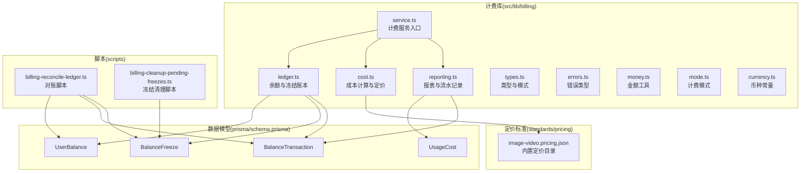
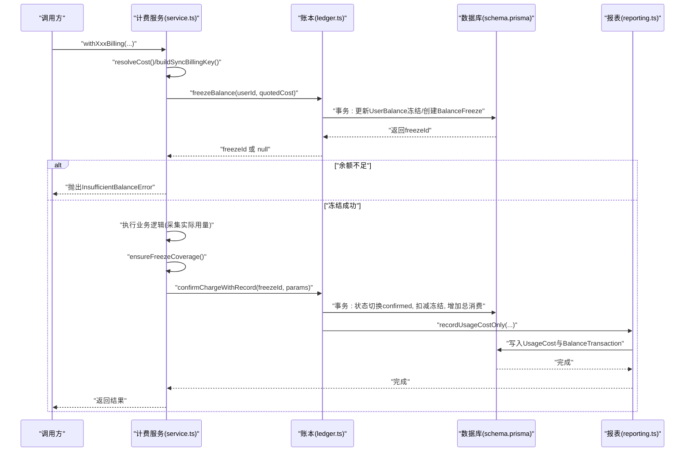
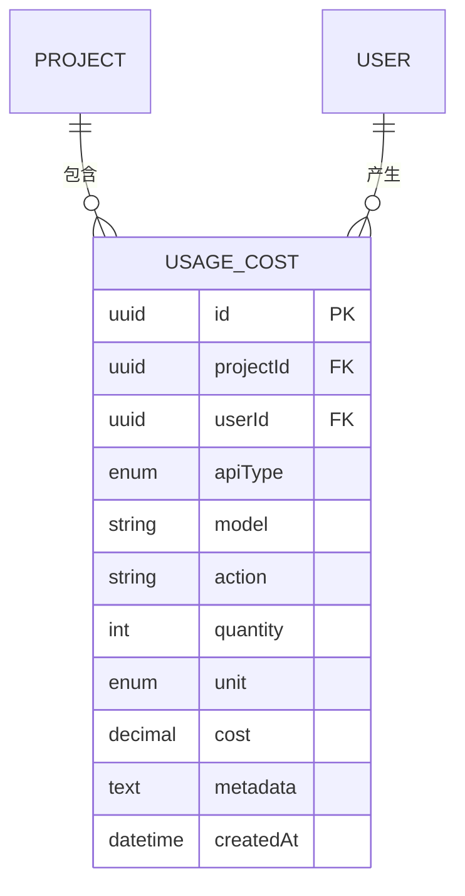
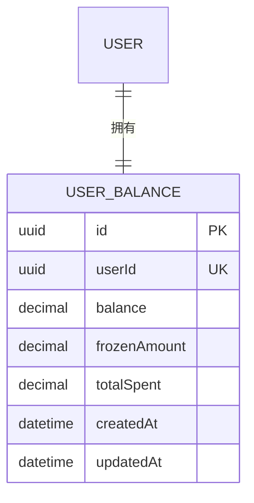
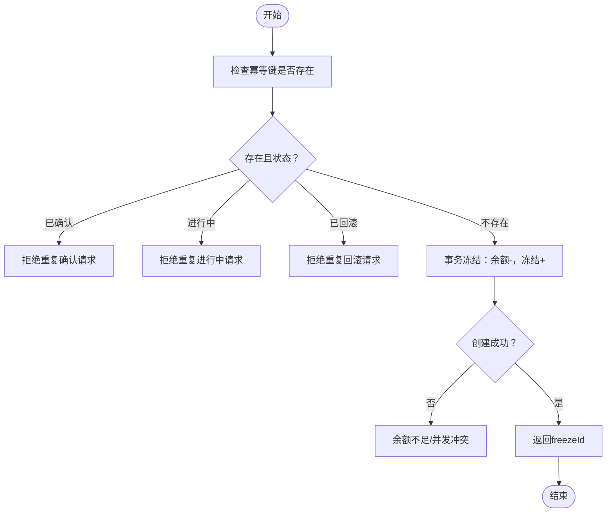
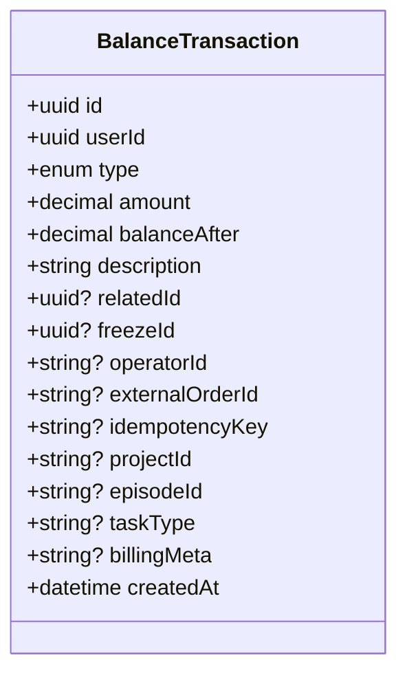
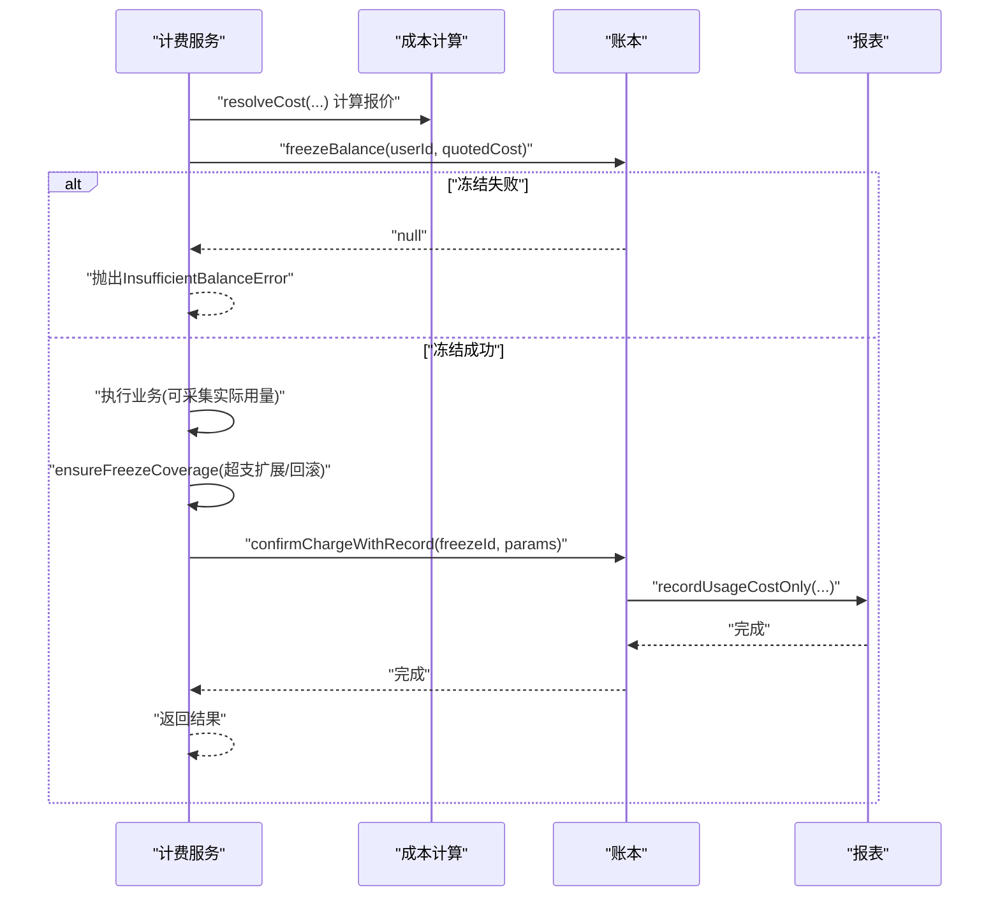
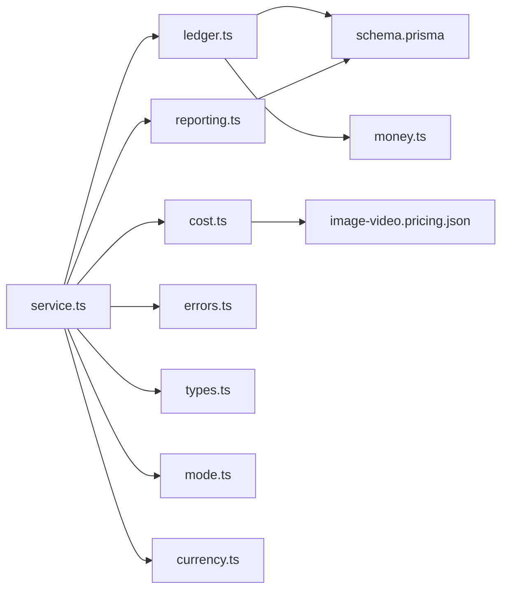

# 计费成本模型

<cite>
**本文引用的文件**
- [schema.prisma](file://prisma/schema.prisma)
- [cost.ts](file://src/lib/billing/cost.ts)
- [ledger.ts](file://src/lib/billing/ledger.ts)
- [service.ts](file://src/lib/billing/service.ts)
- [reporting.ts](file://src/lib/billing/reporting.ts)
- [types.ts](file://src/lib/billing/types.ts)
- [errors.ts](file://src/lib/billing/errors.ts)
- [money.ts](file://src/lib/billing/money.ts)
- [mode.ts](file://src/lib/billing/mode.ts)
- [currency.ts](file://src/lib/billing/currency.ts)
- [billing-reconcile-ledger.ts](file://scripts/billing-reconcile-ledger.ts)
- [billing-cleanup-pending-freezes.ts](file://scripts/billing-cleanup-pending-freezes.ts)
- [image-video.pricing.json](file://standards/pricing/image-video.pricing.json)
</cite>

## 目录
1. [简介](#简介)
2. [项目结构](#项目结构)
3. [核心组件](#核心组件)
4. [架构总览](#架构总览)
5. [详细组件分析](#详细组件分析)
6. [依赖分析](#依赖分析)
7. [性能考虑](#性能考虑)
8. [故障排查指南](#故障排查指南)
9. [结论](#结论)
10. [附录](#附录)

## 简介
本文件系统性梳理 Waoowaoo 的计费成本模型，围绕 UsageCost、UserBalance、BalanceFreeze、BalanceTransaction 四大核心实体，阐释余额管理、冻结机制与交易记录的完整流程；详解成本计算算法、计费规则与价格体系；给出从“消费产生—余额扣减—到账单生成”的全生命周期追踪；并覆盖并发控制、事务一致性与异常处理机制，以及审计日志、合规与财务对账能力。

## 项目结构
计费子系统位于 src/lib/billing 下，采用“服务层 + 账本层 + 报表层 + 成本层”的分层设计，并通过 Prisma 数据模型与数据库表进行持久化。配套脚本提供对账与冻结清理的运维能力。

图表来源
- [service.ts](file://src/lib/billing/service.ts)
- [ledger.ts](file://src/lib/billing/ledger.ts)
- [reporting.ts](file://src/lib/billing/reporting.ts)
- [cost.ts](file://src/lib/billing/cost.ts)
- [schema.prisma](file://prisma/schema.prisma)
- [billing-reconcile-ledger.ts](file://scripts/billing-reconcile-ledger.ts)
- [billing-cleanup-pending-freezes.ts](file://scripts/billing-cleanup-pending-freezes.ts)
- [image-video.pricing.json](file://standards/pricing/image-video.pricing.json)

章节来源
- [schema.prisma](file://prisma/schema.prisma)
- [service.ts](file://src/lib/billing/service.ts)
- [ledger.ts](file://src/lib/billing/ledger.ts)
- [reporting.ts](file://src/lib/billing/reporting.ts)
- [cost.ts](file://src/lib/billing/cost.ts)
- [billing-reconcile-ledger.ts](file://scripts/billing-reconcile-ledger.ts)
- [billing-cleanup-pending-freezes.ts](file://scripts/billing-cleanup-pending-freezes.ts)
- [image-video.pricing.json](file://standards/pricing/image-video.pricing.json)

## 核心组件
- UsageCost：按项目维度归集的明细消费记录，用于项目成本统计与报表聚合。
- UserBalance：用户账户余额、冻结金额与累计消费的实时快照。
- BalanceFreeze：预冻结额度与状态（pending/confirmed/rolled_back），支持幂等键去重。
- BalanceTransaction：最终确认的消费流水，记录余额变动、关联冻结与项目/剧集/任务类型等元数据。
- 计费服务：统一入口，负责报价、冻结、结算、影子记录与错误处理。
- 成本计算：基于内置定价目录与用户自定义定价，按 API 类型与用量单位计算费用。
- 报表与对账：构建 billingMeta 展示信息，提供项目/用户维度的成本统计与流水查询。

章节来源
- [schema.prisma](file://prisma/schema.prisma)
- [service.ts](file://src/lib/billing/service.ts)
- [ledger.ts](file://src/lib/billing/ledger.ts)
- [reporting.ts](file://src/lib/billing/reporting.ts)
- [cost.ts](file://src/lib/billing/cost.ts)

## 架构总览
计费系统以“服务层”为入口，贯穿“成本计算—余额冻结—确认结算—流水记录—报表统计”的闭环。事务保证在关键路径上使用 Prisma 事务，确保余额与冻结状态的一致性；同时提供“影子模式”用于非强制计费下的观测与审计。

图表来源
- [service.ts](file://src/lib/billing/service.ts)
- [ledger.ts](file://src/lib/billing/ledger.ts)
- [reporting.ts](file://src/lib/billing/reporting.ts)
- [schema.prisma](file://prisma/schema.prisma)

## 详细组件分析

### UsageCost：项目级成本明细
- 字段要点：apiType、model、action、quantity、unit、cost、metadata、外键关联项目与用户。
- 写入时机：在确认结算时，若项目有效则写入 UsageCost；否则仅记录流水。
- 统计接口：按 apiType/action 聚合、最近条目查询、用户/项目汇总。

图表来源
- [schema.prisma](file://prisma/schema.prisma)

章节来源
- [schema.prisma](file://prisma/schema.prisma)
- [reporting.ts](file://src/lib/billing/reporting.ts)

### UserBalance：用户余额与冻结
- 字段要点：balance、frozenAmount、totalSpent，均以高精度 Decimal 存储。
- 初始化：首次访问时自动创建默认记录。
- 并发安全：冻结与解冻通过事务更新余额与冻结字段，避免透支。

图表来源
- [schema.prisma](file://prisma/schema.prisma)

章节来源
- [schema.prisma](file://prisma/schema.prisma)
- [ledger.ts](file://src/lib/billing/ledger.ts)
- [money.ts](file://src/lib/billing/money.ts)

### BalanceFreeze：预冻结与幂等
- 字段要点：amount、status、source、taskId/requestId/idempotencyKey、expiresAt、metadata。
- 幂等：以 idempotencyKey 去重，避免重复冻结。
- 状态机：pending → confirmed/rolled_back；仅 pending 可扩展或回滚。
- 过期清理：提供脚本扫描过期 pending 冻结并回滚。

图表来源
- [ledger.ts](file://src/lib/billing/ledger.ts)
- [billing-cleanup-pending-freezes.ts](file://scripts/billing-cleanup-pending-freezes.ts)

章节来源
- [schema.prisma](file://prisma/schema.prisma)
- [ledger.ts](file://src/lib/billing/ledger.ts)
- [billing-cleanup-pending-freezes.ts](file://scripts/billing-cleanup-pending-freezes.ts)

### BalanceTransaction：最终流水与审计
- 字段要点：type（consume/shadow_consume/recharge/adjust）、amount、balanceAfter、description、relatedId/operatorId、外部订单号、idempotencyKey、项目/剧集/任务类型、billingMeta。
- 影子记录：在 SHADOW 模式下仅记录不扣款，便于观测与对账。
- 对账：billingMeta 保存计费详情，前端据此展示“数量×单位”。

图表来源
- [schema.prisma](file://prisma/schema.prisma)
- [reporting.ts](file://src/lib/billing/reporting.ts)

章节来源
- [schema.prisma](file://prisma/schema.prisma)
- [reporting.ts](file://src/lib/billing/reporting.ts)

### 计费服务：报价、冻结、结算与错误处理
- 报价：根据 apiType 与单位，解析内置定价或用户自定义定价，支持最大限额与报价上限。
- 同步计费：构建幂等键，先冻结，再执行业务，最后结算；若超预算自动扩展冻结或回滚。
- 异常：余额不足抛出专用错误；重复请求返回明确错误码；其他操作失败包装为操作错误。
- 多媒体计费：文本（token）、图像（分辨率/选项）、视频（分辨率/时长/是否含输入/音频）、语音（秒）、音色设计、唇-sync。

图表来源
- [service.ts](file://src/lib/billing/service.ts)
- [cost.ts](file://src/lib/billing/cost.ts)
- [ledger.ts](file://src/lib/billing/ledger.ts)
- [reporting.ts](file://src/lib/billing/reporting.ts)

章节来源
- [service.ts](file://src/lib/billing/service.ts)
- [cost.ts](file://src/lib/billing/cost.ts)
- [ledger.ts](file://src/lib/billing/ledger.ts)
- [reporting.ts](file://src/lib/billing/reporting.ts)
- [errors.ts](file://src/lib/billing/errors.ts)

### 成本计算与价格体系
- 定价来源：优先内置定价目录（image-video.pricing.json），其次用户自定义定价（来自用户偏好）。
- 文本：按 input/output tokens 数量与单价计算，支持 markup。
- 图像/视频：按能力选择（分辨率、生成模式、是否含音频、时长等）匹配定价；部分模型按 token 估算计费。
- 语音/音色/唇-sync：按固定单价计算。
- 错误分支：当模型或能力组合无法匹配时，抛出明确错误码，便于前端提示与降级。

章节来源
- [cost.ts](file://src/lib/billing/cost.ts)
- [image-video.pricing.json](file://standards/pricing/image-video.pricing.json)

### 报表与审计
- billingMeta：序列化计费详情（数量、单位、模型、分辨率/时长/生成模式等），供前端展示。
- UsageCost 聚合：按 apiType/action 分组统计，支持最近条目与用户/项目汇总。
- BalanceTransaction：记录每次余额变动，支持审计摘要与外部订单号关联。

章节来源
- [reporting.ts](file://src/lib/billing/reporting.ts)
- [schema.prisma](file://prisma/schema.prisma)

### 计费模式与动态开关
- 模式：OFF（关闭）、SHADOW（只记录不扣款）、ENFORCE（强制扣款）。
- 启动时生效：通过环境变量控制，脚本启动时即确定模式。
- 业务影响：OFF 直接放行；SHADOW 仅记录影子消费；ENFORCE 正常冻结/结算。

章节来源
- [mode.ts](file://src/lib/billing/mode.ts)
- [service.ts](file://src/lib/billing/service.ts)

## 依赖分析
- 服务层依赖账本层与成本层；账本层依赖 Prisma；报表层依赖账本层与 Prisma；成本层依赖内置定价目录与用户偏好。
- 数据模型耦合：UsageCost 与 BalanceTransaction 通过外键与元数据关联；UserBalance 与 BalanceFreeze 通过 userId 关联。
- 外部依赖：内置定价目录（standards/pricing）为成本计算提供权威依据。

图表来源
- [service.ts](file://src/lib/billing/service.ts)
- [ledger.ts](file://src/lib/billing/ledger.ts)
- [reporting.ts](file://src/lib/billing/reporting.ts)
- [cost.ts](file://src/lib/billing/cost.ts)
- [schema.prisma](file://prisma/schema.prisma)
- [image-video.pricing.json](file://standards/pricing/image-video.pricing.json)
- [money.ts](file://src/lib/billing/money.ts)
- [errors.ts](file://src/lib/billing/errors.ts)
- [types.ts](file://src/lib/billing/types.ts)
- [mode.ts](file://src/lib/billing/mode.ts)
- [currency.ts](file://src/lib/billing/currency.ts)

章节来源
- [service.ts](file://src/lib/billing/service.ts)
- [ledger.ts](file://src/lib/billing/ledger.ts)
- [reporting.ts](file://src/lib/billing/reporting.ts)
- [cost.ts](file://src/lib/billing/cost.ts)
- [schema.prisma](file://prisma/schema.prisma)
- [image-video.pricing.json](file://standards/pricing/image-video.pricing.json)

## 性能考虑
- 事务粒度：冻结、结算与余额更新均在单事务内完成，减少锁竞争与不一致风险。
- 幂等键：冻结与充值均支持 idempotencyKey，避免重复处理带来的额外开销。
- 金额精度：统一使用高精度 Decimal 与四舍五入工具，避免浮点误差累积。
- 查询优化：报表按需分页与聚合，避免全表扫描；对账脚本批量统计与排序。

## 故障排查指南
- 余额不足：检查 UserBalance 与冻结情况；确认是否被其他请求占用。
- 重复请求：核对 idempotencyKey 是否已存在；查看 BalanceFreeze 状态（已确认/进行中/已回滚）。
- 结算失败：确认冻结状态为 pending；检查 chargedAmount 是否在冻结范围内；查看错误码定位问题。
- 对账差异：运行对账脚本，检查用户余额与流水净额差异；关注孤儿 pending 冻结。
- 冻结清理：定期运行冻结清理脚本，回滚过期 pending 冻结，释放余额。

章节来源
- [errors.ts](file://src/lib/billing/errors.ts)
- [ledger.ts](file://src/lib/billing/ledger.ts)
- [billing-reconcile-ledger.ts](file://scripts/billing-reconcile-ledger.ts)
- [billing-cleanup-pending-freezes.ts](file://scripts/billing-cleanup-pending-freezes.ts)

## 结论
该计费成本模型以严谨的数据模型与事务保障为核心，结合灵活的定价目录与用户自定义策略，实现了从报价、冻结、结算到报表与对账的全链路闭环。通过影子模式与运维脚本，系统兼顾了生产稳定性与可观测性，满足多场景下的计费需求与合规要求。

## 附录
- 币种：人民币（CNY）
- 金额精度：小数点后 6 位
- 计费模式：OFF/SHADOW/ENFORCE
- 关键流程：报价→冻结→结算→记账→报表