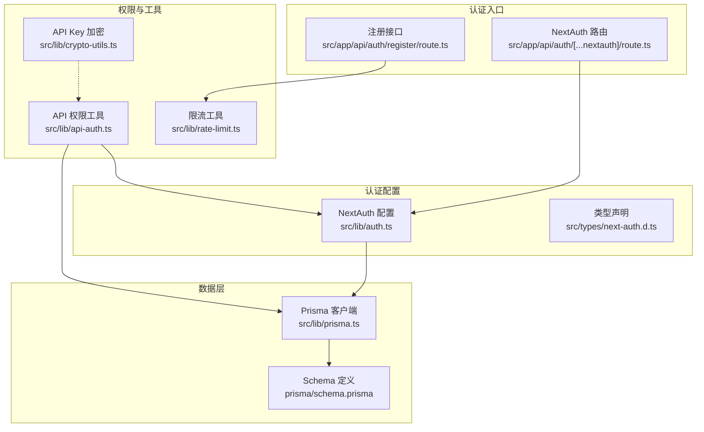
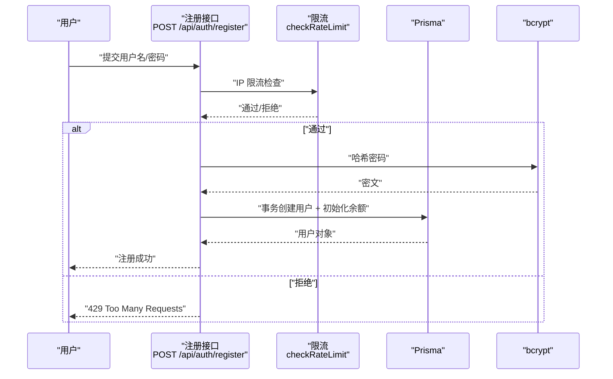
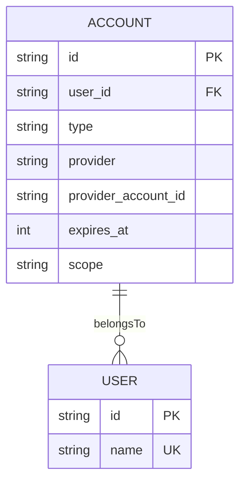
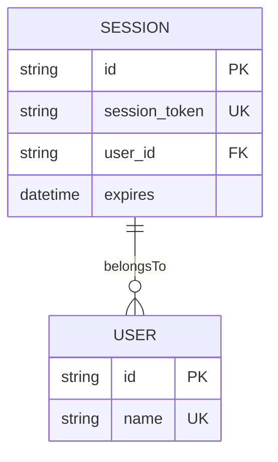
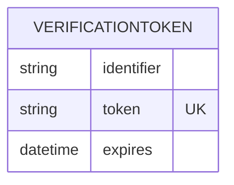
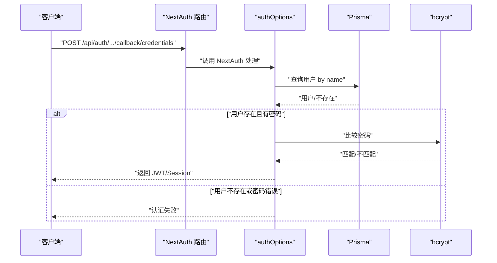
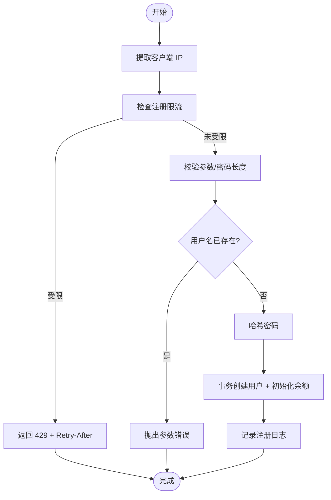
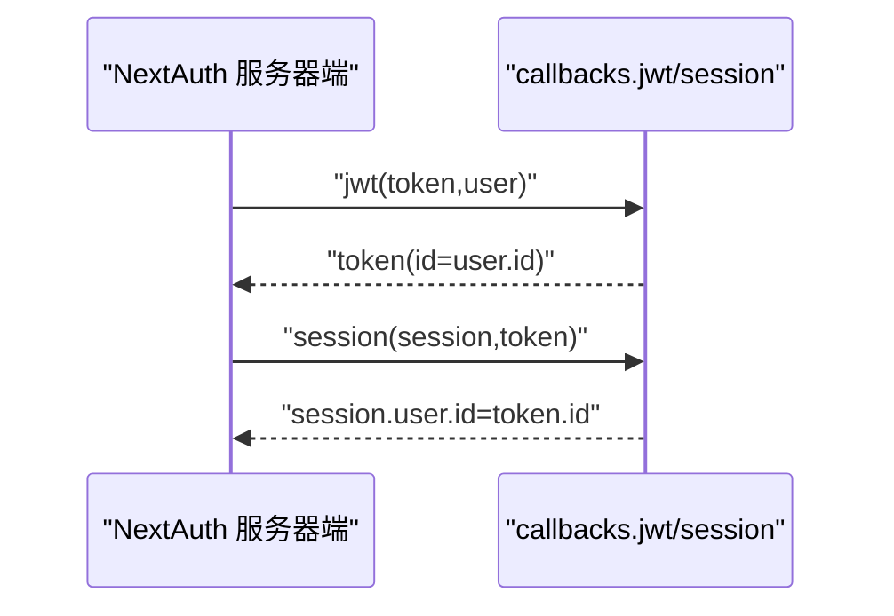
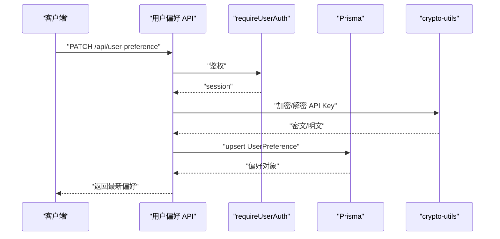
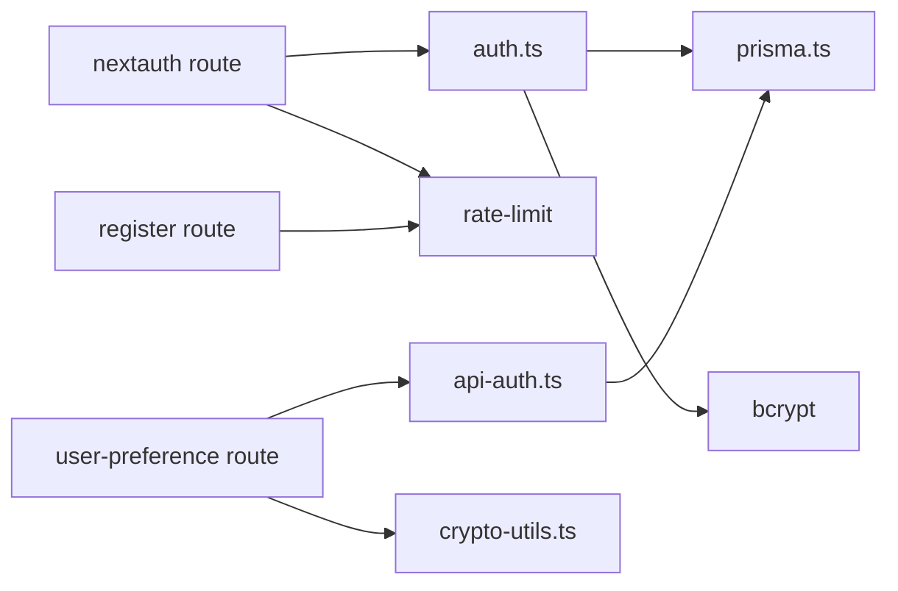

# 认证会话模型

<cite>
**本文引用的文件**
- [src/lib/auth.ts](file://src/lib/auth.ts)
- [src/app/api/auth/[...nextauth]/route.ts](file://src/app/api/auth/[...nextauth]/route.ts)
- [src/app/api/auth/register/route.ts](file://src/app/api/auth/register/route.ts)
- [prisma/schema.prisma](file://prisma/schema.prisma)
- [src/lib/rate-limit.ts](file://src/lib/rate-limit.ts)
- [src/lib/api-auth.ts](file://src/lib/api-auth.ts)
- [src/app/api/user-preference/route.ts](file://src/app/api/user-preference/route.ts)
- [src/lib/crypto-utils.ts](file://src/lib/crypto-utils.ts)
- [messages/zh/auth.json](file://messages/zh/auth.json)
- [src/types/next-auth.d.ts](file://src/types/next-auth.d.ts)
- [src/lib/prisma.ts](file://src/lib/prisma.ts)
</cite>

## 目录
1. [简介](#简介)
2. [项目结构](#项目结构)
3. [核心组件](#核心组件)
4. [架构总览](#架构总览)
5. [详细组件分析](#详细组件分析)
6. [依赖分析](#依赖分析)
7. [性能考虑](#性能考虑)
8. [故障排查指南](#故障排查指南)
9. [结论](#结论)
10. [附录](#附录)

## 简介
本文件系统性梳理 Waoowaoo 的认证与会话模型，覆盖以下主题：
- 实体设计：Account、Session、VerificationToken、User、UserPreference、UserBalance 等
- 认证方式：密码认证（基于 Credentials Provider）、第三方 OAuth（通过 NextAuth Adapter 集成）、会话管理（JWT 策略）
- 会话生命周期：创建、续期、过期处理、安全策略（Cookie Secure/HttpOnly、主机信任、协议驱动的 Secure Cookie）
- 完整流程：注册、登录、会话维护、偏好设置与 API Key 管理
- 安全防护：防暴力破解（Redis 滑动窗口限流）、会话劫持与 CSRF 防护（NextAuth 默认策略）
- 配置与扩展：灵活的用户偏好与 API Key 加密存储，便于定制化

## 项目结构
认证相关代码主要分布在如下位置：
- NextAuth 配置与路由适配：src/lib/auth.ts、src/app/api/auth/[...nextauth]/route.ts
- 注册接口与限流：src/app/api/auth/register/route.ts、src/lib/rate-limit.ts
- 数据模型：prisma/schema.prisma（Account、Session、VerificationToken、User、UserPreference、UserBalance 等）
- 会话与权限工具：src/lib/api-auth.ts、src/types/next-auth.d.ts
- 用户偏好与 API Key：src/app/api/user-preference/route.ts、src/lib/crypto-utils.ts
- 日志与本地化：src/lib/logging/semantic（在认证日志中使用）、messages/zh/auth.json



图表来源
- [src/app/api/auth/[...nextauth]/route.ts:1-51](file://src/app/api/auth/[...nextauth]/route.ts#L1-L51)
- [src/app/api/auth/register/route.ts:1-88](file://src/app/api/auth/register/route.ts#L1-L88)
- [src/lib/auth.ts:1-79](file://src/lib/auth.ts#L1-L79)
- [src/lib/prisma.ts:1-9](file://src/lib/prisma.ts#L1-L9)
- [prisma/schema.prisma:10-481](file://prisma/schema.prisma#L10-L481)
- [src/lib/api-auth.ts:1-355](file://src/lib/api-auth.ts#L1-L355)
- [src/lib/rate-limit.ts:1-146](file://src/lib/rate-limit.ts#L1-L146)
- [src/lib/crypto-utils.ts:1-195](file://src/lib/crypto-utils.ts#L1-L195)

章节来源
- [src/lib/auth.ts:1-79](file://src/lib/auth.ts#L1-L79)
- [src/app/api/auth/[...nextauth]/route.ts:1-51](file://src/app/api/auth/[...nextauth]/route.ts#L1-L51)
- [src/app/api/auth/register/route.ts:1-88](file://src/app/api/auth/register/route.ts#L1-L88)
- [prisma/schema.prisma:10-481](file://prisma/schema.prisma#L10-L481)
- [src/lib/rate-limit.ts:1-146](file://src/lib/rate-limit.ts#L1-L146)
- [src/lib/api-auth.ts:1-355](file://src/lib/api-auth.ts#L1-L355)
- [src/lib/crypto-utils.ts:1-195](file://src/lib/crypto-utils.ts#L1-L195)
- [src/types/next-auth.d.ts:1-22](file://src/types/next-auth.d.ts#L1-L22)
- [src/lib/prisma.ts:1-9](file://src/lib/prisma.ts#L1-L9)

## 核心组件
- NextAuth 配置与回调
  - 使用 Prisma 作为 Adapter，启用信任主机与根据协议自动选择 Secure Cookie
  - 提供 Credentials Provider 进行密码认证，回调中注入用户 id 到 JWT 与 Session
- 注册接口
  - 输入校验、密码哈希、事务创建用户与初始余额记录；集成 IP 限流
- 数据模型
  - Account：第三方 OAuth 账号绑定
  - Session：传统 Session Token（uuid 主键、唯一 token、外键用户、过期时间）
  - VerificationToken：邮箱/验证码类用途的一次性令牌
  - User：用户名、邮箱、密码哈希、关联账户、会话、偏好、余额
  - UserPreference：用户偏好与 API Key（加密存储）
  - UserBalance：用户余额与冻结金额
- 会话与权限工具
  - getServerSession 获取当前会话；requireUserAuth/requireProjectAuth 统一鉴权入口
- 限流与安全
  - Redis 滑动窗口实现登录/注册限流；NextAuth 默认 CSRF 与会话安全策略
- API Key 加密
  - 基于 AES-256-GCM，PBKDF2 派生密钥，统一加密/解密 API

章节来源
- [src/lib/auth.ts:8-79](file://src/lib/auth.ts#L8-L79)
- [src/app/api/auth/register/route.ts:8-88](file://src/app/api/auth/register/route.ts#L8-L88)
- [prisma/schema.prisma:10-481](file://prisma/schema.prisma#L10-L481)
- [src/lib/api-auth.ts:173-313](file://src/lib/api-auth.ts#L173-L313)
- [src/lib/rate-limit.ts:58-118](file://src/lib/rate-limit.ts#L58-L118)
- [src/lib/crypto-utils.ts:50-111](file://src/lib/crypto-utils.ts#L50-L111)

## 架构总览
认证系统采用“NextAuth + Prisma + Redis 限流”的组合：
- 密码认证：Credentials Provider -> Prisma 查询用户 -> bcrypt 校验 -> JWT 注入用户 id -> Session 返回
- 第三方 OAuth：通过 Account 模型与 NextAuth Adapter 管理
- 会话策略：JWT 策略，结合 NextAuth 默认的安全 Cookie 设置
- 限流策略：登录/注册使用 Redis 滑动窗口，防止暴力破解
- 权限体系：统一 requireUserAuth/requireProjectAuth，贯穿 API 层



图表来源
- [src/app/api/auth/register/route.ts:8-88](file://src/app/api/auth/register/route.ts#L8-L88)
- [src/lib/rate-limit.ts:58-118](file://src/lib/rate-limit.ts#L58-L118)
- [src/lib/crypto-utils.ts:50-73](file://src/lib/crypto-utils.ts#L50-L73)

## 详细组件分析

### Account 实体与第三方 OAuth
- 字段要点：provider/providerAccountId 唯一键、refresh_token/access_token/expires_at/id_token/scope 等 OAuth 相关字段
- 关系：与 User 的一对多关系，删除用户时级联清理
- 用途：承载第三方账号信息，配合 NextAuth Adapter 实现 OAuth 登录



图表来源
- [prisma/schema.prisma:10-28](file://prisma/schema.prisma#L10-L28)
- [prisma/schema.prisma:402-429](file://prisma/schema.prisma#L402-L429)

章节来源
- [prisma/schema.prisma:10-28](file://prisma/schema.prisma#L10-L28)
- [prisma/schema.prisma:402-429](file://prisma/schema.prisma#L402-L429)

### Session 实体与会话生命周期
- 字段要点：sessionToken 唯一索引、expires 过期时间、userId 外键
- 生命周期：创建时生成 token 并设定过期；NextAuth 在回调中控制续期；过期后需重新登录
- 安全策略：根据协议自动设置 Secure Cookie；信任主机以支持局域网访问



图表来源
- [prisma/schema.prisma:369-378](file://prisma/schema.prisma#L369-L378)
- [prisma/schema.prisma:402-429](file://prisma/schema.prisma#L402-L429)

章节来源
- [prisma/schema.prisma:369-378](file://prisma/schema.prisma#L369-L378)
- [src/lib/auth.ts:56-58](file://src/lib/auth.ts#L56-L58)
- [src/lib/auth.ts:10-14](file://src/lib/auth.ts#L10-L14)

### VerificationToken 实体与令牌验证
- 字段要点：identifier/token 唯一键、expires 过期时间
- 用途：验证码/邮件验证等一次性令牌场景，过期即失效



图表来源
- [prisma/schema.prisma:474-481](file://prisma/schema.prisma#L474-L481)

章节来源
- [prisma/schema.prisma:474-481](file://prisma/schema.prisma#L474-L481)

### User、UserPreference、UserBalance 与 API Key 管理
- User：用户名、邮箱、密码哈希、关联账户/会话/偏好/余额
- UserPreference：用户偏好（模型、分辨率、风格等）与 API Key（加密存储）
- UserBalance：余额、冻结金额、累计消费
- API Key 加密：AES-256-GCM，PBKDF2 派生密钥，统一加密/解密

```mermaid
erDiagram
USER {
string id PK
string name UK
}
USERPREFERENCE {
string id PK
string user_id UK FK
string llm_api_key
string fal_api_key
string google_ai_key
string ark_api_key
string qwen_api_key
}
USERBALANCE {
string id PK
string user_id UK FK
decimal balance
decimal frozen_amount
decimal total_spent
}
USER ||--o| USERPREFERENCE : "has_one"
USER ||--o| USERBALANCE : "has_one"
```

图表来源
- [prisma/schema.prisma:402-429](file://prisma/schema.prisma#L402-L429)
- [prisma/schema.prisma:431-472](file://prisma/schema.prisma#L431-L472)
- [prisma/schema.prisma:526-537](file://prisma/schema.prisma#L526-L537)
- [src/lib/crypto-utils.ts:27-38](file://src/lib/crypto-utils.ts#L27-L38)

章节来源
- [prisma/schema.prisma:402-429](file://prisma/schema.prisma#L402-L429)
- [prisma/schema.prisma:431-472](file://prisma/schema.prisma#L431-L472)
- [prisma/schema.prisma:526-537](file://prisma/schema.prisma#L526-L537)
- [src/lib/crypto-utils.ts:50-111](file://src/lib/crypto-utils.ts#L50-L111)

### 密码认证流程（Credentials Provider）


图表来源
- [src/lib/auth.ts:22-54](file://src/lib/auth.ts#L22-L54)
- [src/app/api/auth/[...nextauth]/route.ts:19-44](file://src/app/api/auth/[...nextauth]/route.ts#L19-L44)

章节来源
- [src/lib/auth.ts:22-54](file://src/lib/auth.ts#L22-L54)
- [src/app/api/auth/[...nextauth]/route.ts:19-44](file://src/app/api/auth/[...nextauth]/route.ts#L19-L44)

### 注册流程与限流


图表来源
- [src/app/api/auth/register/route.ts:8-88](file://src/app/api/auth/register/route.ts#L8-L88)
- [src/lib/rate-limit.ts:58-118](file://src/lib/rate-limit.ts#L58-L118)

章节来源
- [src/app/api/auth/register/route.ts:8-88](file://src/app/api/auth/register/route.ts#L8-L88)
- [src/lib/rate-limit.ts:58-118](file://src/lib/rate-limit.ts#L58-L118)

### 会话管理与安全策略
- 会话策略：JWT 策略，回调中将用户 id 注入 token 与 session
- Cookie 安全：根据协议自动设置 Secure Cookie；信任主机以支持局域网访问
- CSRF 与会话劫持：NextAuth 默认提供 CSRF 保护与安全会话策略



图表来源
- [src/lib/auth.ts:62-77](file://src/lib/auth.ts#L62-L77)

章节来源
- [src/lib/auth.ts:56-77](file://src/lib/auth.ts#L56-L77)

### 用户偏好与 API Key 管理
- 用户偏好：GET/PATCH 接口统一鉴权，支持 upsert 创建默认偏好
- API Key：加密存储于 UserPreference，支持批量加密/解密，便于在前端安全显示与使用



图表来源
- [src/app/api/user-preference/route.ts:26-94](file://src/app/api/user-preference/route.ts#L26-L94)
- [src/lib/api-auth.ts:306-313](file://src/lib/api-auth.ts#L306-L313)
- [src/lib/crypto-utils.ts:125-194](file://src/lib/crypto-utils.ts#L125-L194)

章节来源
- [src/app/api/user-preference/route.ts:26-94](file://src/app/api/user-preference/route.ts#L26-L94)
- [src/lib/api-auth.ts:306-313](file://src/lib/api-auth.ts#L306-L313)
- [src/lib/crypto-utils.ts:125-194](file://src/lib/crypto-utils.ts#L125-L194)

## 依赖分析
- 组件耦合
  - NextAuth 配置依赖 Prisma Adapter 与 bcrypt；路由层包装 NextAuth 并叠加限流
  - API 层统一使用 requireUserAuth/requireProjectAuth 进行鉴权
  - UserPreference 与 API Key 加密工具双向协作
- 外部依赖
  - Redis：滑动窗口限流
  - Prisma：ORM 与 Schema 定义
  - NextAuth：会话与 OAuth 管理



图表来源
- [src/lib/auth.ts:1-79](file://src/lib/auth.ts#L1-L79)
- [src/app/api/auth/[...nextauth]/route.ts:1-51](file://src/app/api/auth/[...nextauth]/route.ts#L1-L51)
- [src/app/api/auth/register/route.ts:1-88](file://src/app/api/auth/register/route.ts#L1-L88)
- [src/lib/rate-limit.ts:1-146](file://src/lib/rate-limit.ts#L1-L146)
- [src/lib/api-auth.ts:1-355](file://src/lib/api-auth.ts#L1-L355)
- [src/app/api/user-preference/route.ts:1-94](file://src/app/api/user-preference/route.ts#L1-L94)
- [src/lib/crypto-utils.ts:1-195](file://src/lib/crypto-utils.ts#L1-L195)
- [src/lib/prisma.ts:1-9](file://src/lib/prisma.ts#L1-L9)

章节来源
- [src/lib/auth.ts:1-79](file://src/lib/auth.ts#L1-L79)
- [src/app/api/auth/[...nextauth]/route.ts:1-51](file://src/app/api/auth/[...nextauth]/route.ts#L1-L51)
- [src/app/api/auth/register/route.ts:1-88](file://src/app/api/auth/register/route.ts#L1-L88)
- [src/lib/rate-limit.ts:1-146](file://src/lib/rate-limit.ts#L1-L146)
- [src/lib/api-auth.ts:1-355](file://src/lib/api-auth.ts#L1-L355)
- [src/app/api/user-preference/route.ts:1-94](file://src/app/api/user-preference/route.ts#L1-L94)
- [src/lib/crypto-utils.ts:1-195](file://src/lib/crypto-utils.ts#L1-L195)
- [src/lib/prisma.ts:1-9](file://src/lib/prisma.ts#L1-L9)

## 性能考虑
- 限流策略
  - 登录/注册使用 Redis 滑动窗口，避免热点攻击；窗口过期略大于窗口时长，减少边界竞争
- 密码哈希
  - 注册阶段使用较高成本参数，降低彩虹表风险；登录阶段仅进行对比，避免重复哈希
- 会话策略
  - JWT 策略减少数据库查询；Cookie 安全设置避免不必要的跨站传输
- 数据库访问
  - 注册事务保证一致性；鉴权工具封装统一的会话获取与错误响应

## 故障排查指南
- 登录频繁被限流
  - 检查 Redis 是否可用；确认 getClientIp 是否正确提取客户端 IP；核对 AUTH_LOGIN_LIMIT 配置
- 注册频繁被限流
  - 检查 AUTH_REGISTER_LIMIT；确认请求头 x-forwarded-for/x-real-ip 是否正确传递
- 密码认证失败
  - 确认用户名存在且有密码；检查 bcrypt 比较逻辑；查看日志中的认证动作记录
- 会话无效或 Cookie 无法设置
  - 检查 NEXTAUTH_URL 协议；确认 trustHost 与 useSecureCookies 配置；确保浏览器支持 Cookie
- API Key 读取异常
  - 检查加密密钥派生（NEXTAUTH_SECRET/API_ENCRYPTION_KEY）；确认解密过程异常日志

章节来源
- [src/lib/rate-limit.ts:58-118](file://src/lib/rate-limit.ts#L58-L118)
- [src/lib/rate-limit.ts:128-145](file://src/lib/rate-limit.ts#L128-L145)
- [src/lib/auth.ts:22-54](file://src/lib/auth.ts#L22-L54)
- [src/lib/auth.ts:10-14](file://src/lib/auth.ts#L10-L14)
- [src/lib/crypto-utils.ts:27-38](file://src/lib/crypto-utils.ts#L27-L38)

## 结论
Waoowaoo 的认证会话模型以 NextAuth 为核心，结合 Prisma 数据模型与 Redis 限流，实现了：
- 多样化的认证方式：密码认证与第三方 OAuth
- 安全可控的会话管理：JWT 策略、Cookie 安全、主机信任与协议驱动的 Secure Cookie
- 完整的生命周期：注册、登录、会话维护、偏好与 API Key 管理
- 强健的防护机制：防暴力破解、会话劫持与 CSRF 保护
该体系具备良好的扩展性，便于后续接入更多第三方提供商与增强安全策略。

## 附录
- 术语
  - JWT：JSON Web Token，用于无状态会话标识
  - OAuth：开放授权协议，支持第三方登录
  - CSRF：跨站请求伪造，通过 NextAuth 默认策略防护
- 常用配置项参考
  - NEXTAUTH_URL：NextAuth 基础地址，影响 Cookie Secure 设置
  - NEXTAUTH_SECRET：NextAuth 密钥，用于签名与派生加密密钥
  - API_ENCRYPTION_KEY：API Key 加密密钥（优先于 NEXTAUTH_SECRET）