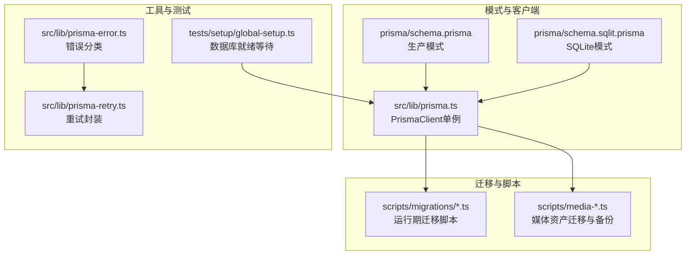
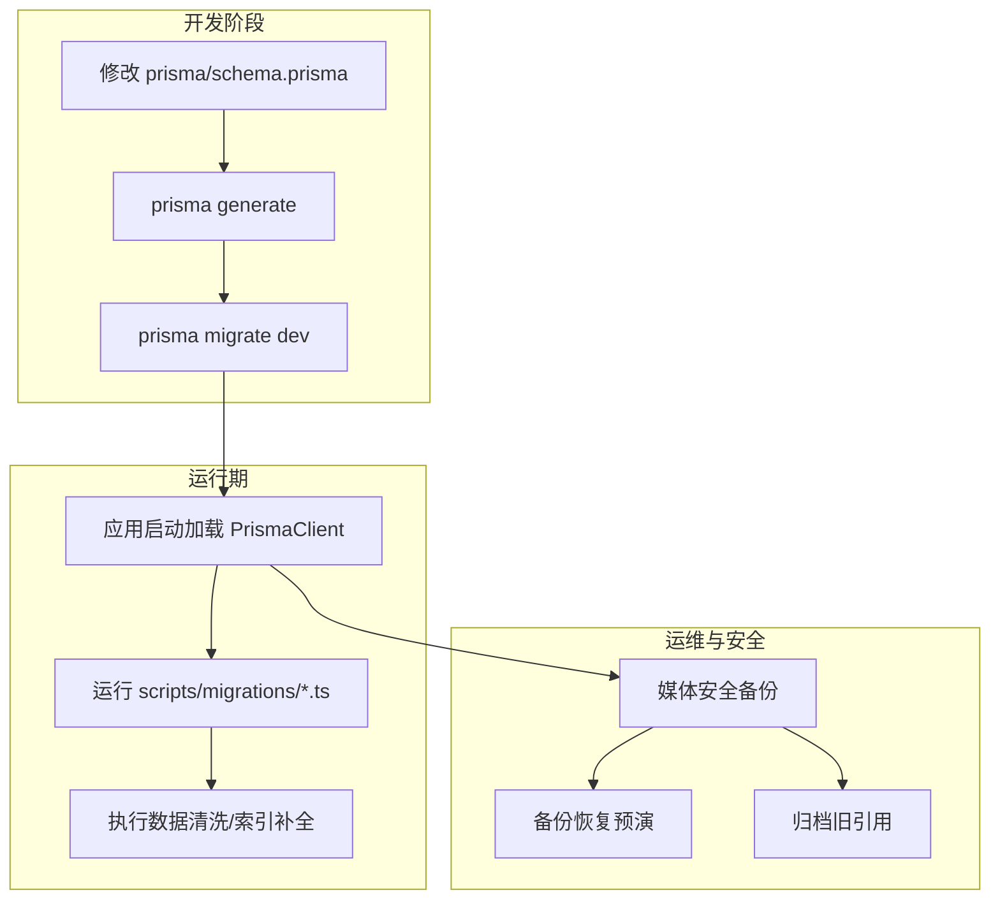
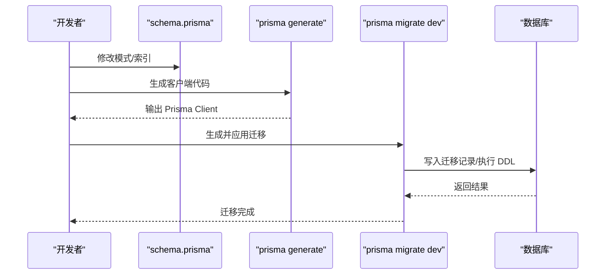
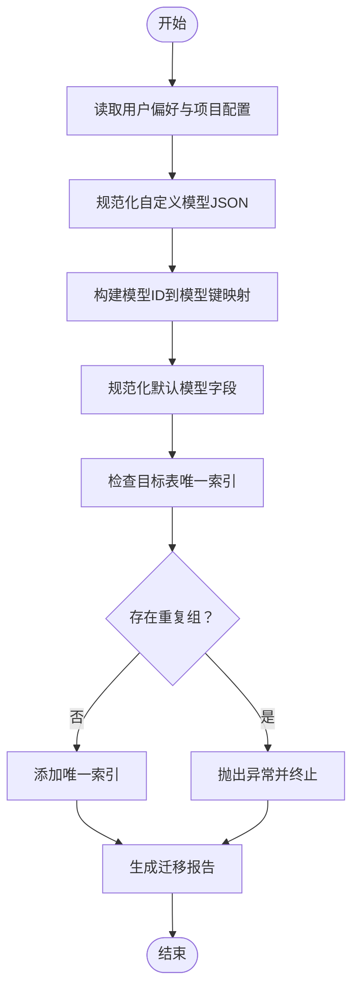
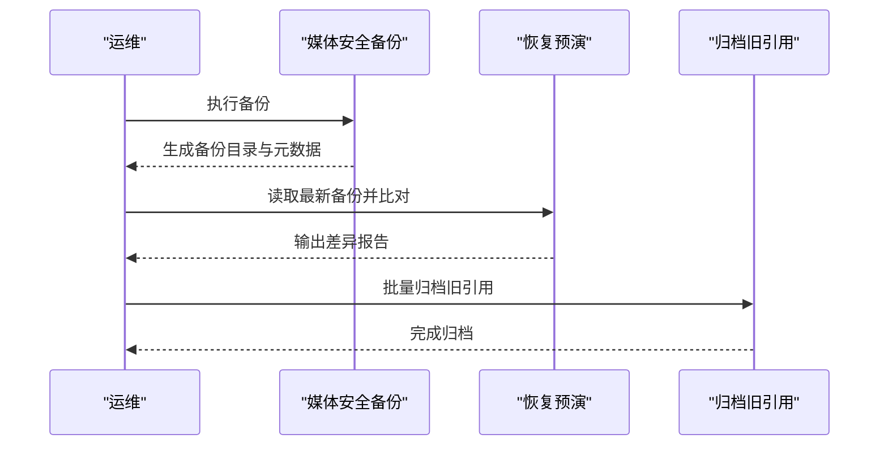
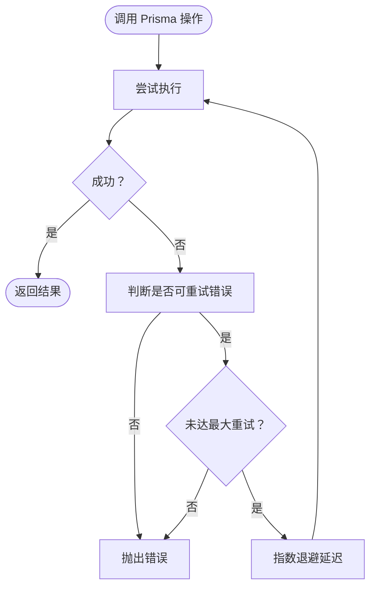
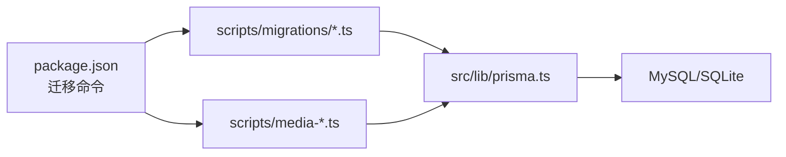
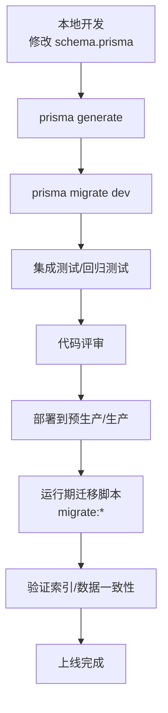

# 迁移管理

<cite>
**本文引用的文件**   
- [schema.prisma](file://prisma/schema.prisma)
- [schema.sqlit.prisma](file://prisma/schema.sqlit.prisma)
- [prisma 客户端初始化](file://src/lib/prisma.ts)
- [Prisma 错误分类与重试工具](file://src/lib/prisma-error.ts)
- [Prisma 重试封装](file://src/lib/prisma-retry.ts)
- [迁移脚本：模型配置合约迁移](file://scripts/migrations/migrate-model-config-contract.ts)
- [迁移脚本：图产物唯一索引迁移](file://scripts/migrations/migrate-graph-artifacts-unique-index.ts)
- [迁移脚本：发布阻塞问题修复总入口](file://scripts/migrations/migrate-release-blockers.ts)
- [媒体安全备份脚本](file://scripts/media-safety-backup.ts)
- [媒体备份恢复预演脚本](file://scripts/media-restore-dry-run.ts)
- [媒体备份归档脚本](file://scripts/media-archive-legacy-refs.ts)
- [包管理脚本（包含迁移命令）](file://package.json)
- [测试环境数据库就绪等待](file://tests/setup/global-setup.ts)
</cite>

## 目录
1. [简介](#简介)
2. [项目结构](#项目结构)
3. [核心组件](#核心组件)
4. [架构总览](#架构总览)
5. [详细组件分析](#详细组件分析)
6. [依赖分析](#依赖分析)
7. [性能考虑](#性能考虑)
8. [故障排除指南](#故障排除指南)
9. [结论](#结论)
10. [附录](#附录)

## 简介
本指南面向 Waoowaoo 的数据库迁移管理，围绕基于 Prisma 的迁移机制展开，覆盖迁移文件生成、执行与版本控制；迁移脚本编写规范（DDL、数据转换、索引创建）；迁移策略（向后兼容、数据备份与回滚）；从开发到生产的完整迁移流程；增量与全量迁移的区别与适用场景；数据一致性与锁机制；以及迁移故障排除与最佳实践。

## 项目结构
- 数据库模式定义位于 prisma/schema.prisma（生产 MySQL）与 prisma/schema.sqlit.prisma（SQLite 测试/本地）。
- 应用通过 src/lib/prisma.ts 获取 PrismaClient 单例，确保进程内共享连接。
- 迁移脚本集中于 scripts/migrations，覆盖数据规范化、索引补全等运行期迁移。
- 媒体资产迁移配套有备份、恢复预演与归档脚本，保障大体量数据的安全演进。
- 包脚本中提供迁移相关命令，便于 CI/CD 集成。

**图表来源**
- [schema.prisma:1-8](file://prisma/schema.prisma#L1-L8)
- [schema.sqlit.prisma:1-8](file://prisma/schema.sqlit.prisma#L1-L8)
- [prisma 客户端初始化:1-9](file://src/lib/prisma.ts#L1-L9)
- [Prisma 错误分类与重试工具:1-54](file://src/lib/prisma-error.ts#L1-L54)
- [Prisma 重试封装:1-51](file://src/lib/prisma-retry.ts#L1-L51)
- [测试环境数据库就绪等待:1-49](file://tests/setup/global-setup.ts#L1-L49)

**章节来源**
- [schema.prisma:1-8](file://prisma/schema.prisma#L1-L8)
- [schema.sqlit.prisma:1-8](file://prisma/schema.sqlit.prisma#L1-L8)
- [prisma 客户端初始化:1-9](file://src/lib/prisma.ts#L1-L9)
- [包管理脚本（包含迁移命令）:9-111](file://package.json#L9-L111)

## 核心组件
- 模式定义：生产使用 MySQL，SQLite 用于测试与本地开发，二者均通过 Prisma 模式文件声明实体与索引。
- Prisma 客户端：单例初始化，避免重复连接；在非生产环境注入全局缓存以复用实例。
- 运行期迁移脚本：对历史数据进行清洗、规范化与索引补全，确保业务字段一致性与查询效率。
- 媒体资产迁移：提供安全备份、恢复预演与归档能力，保障大体量对象存储数据的可追溯与可回滚。
- 错误处理与重试：识别可重试的 Prisma 错误码与断连场景，提供指数退避重试封装。

**章节来源**
- [schema.prisma:1-8](file://prisma/schema.prisma#L1-L8)
- [schema.sqlit.prisma:1-8](file://prisma/schema.sqlit.prisma#L1-L8)
- [prisma 客户端初始化:1-9](file://src/lib/prisma.ts#L1-L9)
- [Prisma 错误分类与重试工具:1-54](file://src/lib/prisma-error.ts#L1-L54)
- [Prisma 重试封装:1-51](file://src/lib/prisma-retry.ts#L1-L51)

## 架构总览
下图展示了从“模式变更”到“运行期迁移”的整体路径，以及媒体资产迁移与备份恢复的闭环。

**图表来源**
- [schema.prisma:1-8](file://prisma/schema.prisma#L1-L8)
- [prisma 客户端初始化:1-9](file://src/lib/prisma.ts#L1-L9)
- [媒体安全备份脚本:1-61](file://scripts/media-safety-backup.ts#L1-L61)
- [媒体备份恢复预演脚本:1-37](file://scripts/media-restore-dry-run.ts#L1-L37)
- [媒体备份归档脚本:1-49](file://scripts/media-archive-legacy-refs.ts#L1-L49)

## 详细组件分析

### 组件A：基于 Prisma 的迁移文件生成与执行
- 模式文件：生产使用 MySQL，SQLite 用于本地/测试，两者均通过 Prisma 模式文件声明实体与索引。
- 生成与迁移：通过 prisma generate 生成客户端；prisma migrate dev 在开发分支生成迁移文件并应用。
- 版本控制：迁移文件目录按时间戳命名，确保顺序与幂等性。

**图表来源**
- [schema.prisma:1-8](file://prisma/schema.prisma#L1-L8)
- [包管理脚本（包含迁移命令）:9-111](file://package.json#L9-L111)

**章节来源**
- [schema.prisma:1-8](file://prisma/schema.prisma#L1-L8)
- [schema.sqlit.prisma:1-8](file://prisma/schema.sqlit.prisma#L1-L8)
- [包管理脚本（包含迁移命令）:9-111](file://package.json#L9-L111)

### 组件B：运行期迁移脚本（数据清洗与索引补全）
- 数据清洗：将历史字符串模型键规范化为统一格式，修复自定义模型 JSON 结构与能力字段。
- 索引补全：检测并添加唯一索引，处理重复组，必要时删除冗余再建唯一索引。
- 报告输出：生成迁移报告，记录扫描、更新、问题等统计信息，支持 dry-run 与 apply 两种模式。

**图表来源**
- [迁移脚本：模型配置合约迁移:315-499](file://scripts/migrations/migrate-model-config-contract.ts#L315-L499)
- [迁移脚本：图产物唯一索引迁移:90-146](file://scripts/migrations/migrate-graph-artifacts-unique-index.ts#L90-L146)

**章节来源**
- [迁移脚本：模型配置合约迁移:1-499](file://scripts/migrations/migrate-model-config-contract.ts#L1-L499)
- [迁移脚本：图产物唯一索引迁移:1-146](file://scripts/migrations/migrate-graph-artifacts-unique-index.ts#L1-L146)

### 组件C：媒体资产迁移与备份恢复
- 备份：对指定表字段进行快照备份，生成带校验的 JSON 文件与元数据，支持离线归档。
- 恢复预演：读取最新备份目录，比对表计数与预期差异，验证恢复可行性。
- 归档：批量处理旧引用，按批次写入归档记录，降低单次事务压力。

**图表来源**
- [媒体安全备份脚本:1-61](file://scripts/media-safety-backup.ts#L1-L61)
- [媒体备份恢复预演脚本:1-37](file://scripts/media-restore-dry-run.ts#L1-L37)
- [媒体备份归档脚本:1-49](file://scripts/media-archive-legacy-refs.ts#L1-L49)

**章节来源**
- [媒体安全备份脚本:1-61](file://scripts/media-safety-backup.ts#L1-L61)
- [媒体备份恢复预演脚本:1-37](file://scripts/media-restore-dry-run.ts#L1-L37)
- [媒体备份归档脚本:1-49](file://scripts/media-archive-legacy-refs.ts#L1-L49)

### 组件D：Prisma 错误分类与重试
- 错误分类：识别 Prisma 错误码与典型断连消息，区分是否可重试。
- 重试封装：提供指数退避重试，限制最大重试次数，避免雪崩。

**图表来源**
- [Prisma 错误分类与重试工具:1-54](file://src/lib/prisma-error.ts#L1-L54)
- [Prisma 重试封装:1-51](file://src/lib/prisma-retry.ts#L1-L51)

**章节来源**
- [Prisma 错误分类与重试工具:1-54](file://src/lib/prisma-error.ts#L1-L54)
- [Prisma 重试封装:1-51](file://src/lib/prisma-retry.ts#L1-L51)

## 依赖分析
- 模式文件依赖 Prisma 客户端生成与数据库驱动；生产使用 MySQL，测试使用 SQLite。
- 运行期迁移脚本依赖 PrismaClient 与业务模型；部分脚本通过原生 SQL 查询索引状态。
- 媒体迁移脚本依赖对象存储 SDK 与文件系统；备份目录结构固定，便于自动化处理。
- 包脚本提供迁移命令入口，便于在 CI/CD 中统一调度。

**图表来源**
- [包管理脚本（包含迁移命令）:9-111](file://package.json#L9-L111)
- [prisma 客户端初始化:1-9](file://src/lib/prisma.ts#L1-L9)

**章节来源**
- [包管理脚本（包含迁移命令）:9-111](file://package.json#L9-L111)
- [prisma 客户端初始化:1-9](file://src/lib/prisma.ts#L1-L9)

## 性能考虑
- 运行期迁移采用分批处理与最小化写入，避免长事务与热点更新。
- 唯一索引添加前先检测重复组，必要时清理后再建索引，减少锁竞争。
- 媒体归档使用固定批次大小，降低单次写入压力。
- 使用 Prisma 重试封装应对瞬时网络抖动与数据库连接问题，提升稳定性。

[本节为通用指导，无需列出具体文件来源]

## 故障排除指南
- 连接超时或断开：检查数据库可达性与连接池配置；使用重试封装自动恢复。
- 唯一索引冲突：运行期迁移会检测重复组并报错，需先清理重复再重建索引。
- 断连错误码：识别 P1001/P1002/P1008/P1017/P2024/P2028 等可重试错误，结合退避重试。
- 数据不一致：优先使用 dry-run 生成报告，确认影响范围后再 apply；媒体迁移建议先做恢复预演。

**章节来源**
- [Prisma 错误分类与重试工具:1-54](file://src/lib/prisma-error.ts#L1-L54)
- [Prisma 重试封装:1-51](file://src/lib/prisma-retry.ts#L1-L51)
- [迁移脚本：图产物唯一索引迁移:110-132](file://scripts/migrations/migrate-graph-artifacts-unique-index.ts#L110-L132)
- [媒体备份恢复预演脚本:1-37](file://scripts/media-restore-dry-run.ts#L1-L37)

## 结论
Waoowaoo 的迁移体系由“模式驱动的增量迁移 + 运行期数据清洗与索引补全 + 媒体资产安全备份与归档”构成。通过 Prisma 客户端单例、错误分类与重试封装，确保迁移过程的稳定与可控；通过报告与预演机制，降低生产风险。建议在 CI/CD 中固化迁移命令，并结合媒体迁移脚本形成完整的数据演进闭环。

[本节为总结性内容，无需列出具体文件来源]

## 附录

### 迁移策略与流程
- 开发到生产的迁移流程（概念示意）

[本图为概念流程，不直接映射具体文件，故无图表来源]

### 增量迁移 vs 全量迁移
- 增量迁移：基于 Prisma 模式变更生成迁移文件，适合结构演进与索引补充，具备幂等性与可回滚性。
- 全量迁移：通过运行期脚本对历史数据进行大规模清洗与重构，适合字段标准化、索引补全与数据治理。

[本节为概念说明，无需列出具体文件来源]

### 数据一致性与锁机制
- 唯一索引添加前检测重复组并报错，避免并发写入导致的死锁与不一致。
- 媒体归档采用固定批次写入，降低长事务与行级锁持有时间。
- 使用 Prisma 重试封装应对瞬时断连，减少人工干预。

**章节来源**
- [迁移脚本：图产物唯一索引迁移:110-132](file://scripts/migrations/migrate-graph-artifacts-unique-index.ts#L110-L132)
- [媒体备份归档脚本:1-49](file://scripts/media-archive-legacy-refs.ts#L1-L49)
- [Prisma 错误分类与重试工具:1-54](file://src/lib/prisma-error.ts#L1-L54)

### 最佳实践与性能优化建议
- 在 PR 中引入 dry-run 报告，评估影响范围后再 apply。
- 对大表操作采用分批处理与事务拆分，避免长时间锁持有。
- 使用媒体迁移脚本的恢复预演功能，提前验证备份可用性。
- 在 CI/CD 中固定迁移命令，确保环境一致性与可追溯性。

[本节为通用指导，无需列出具体文件来源]