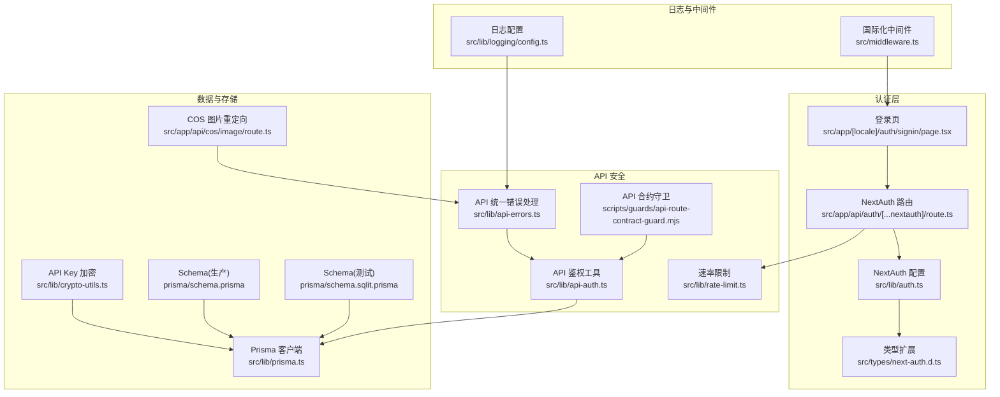
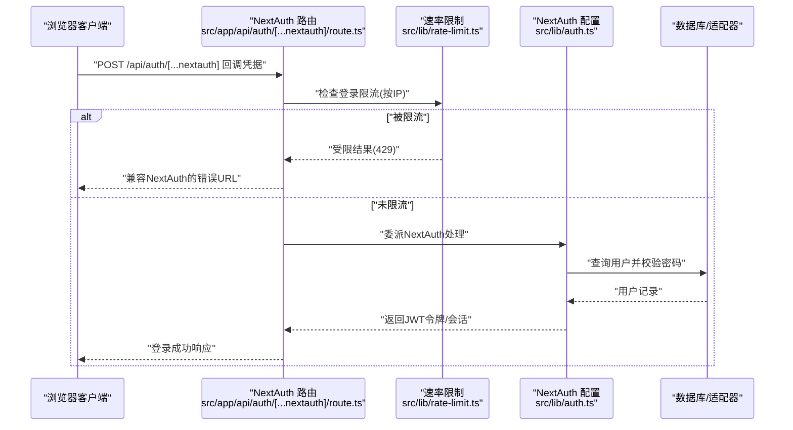
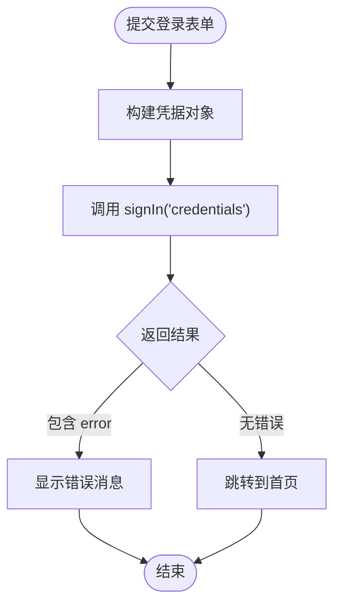
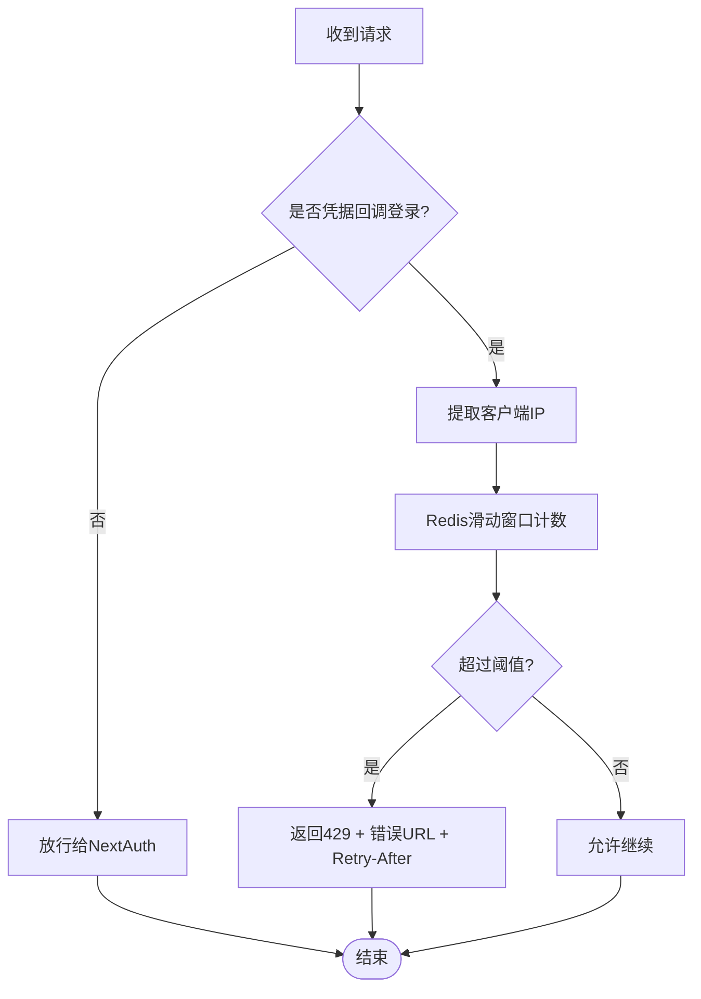
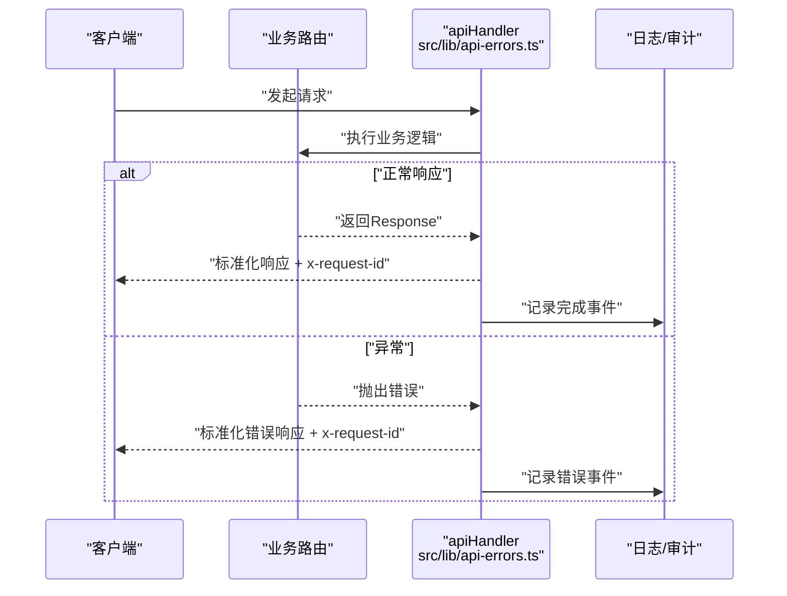
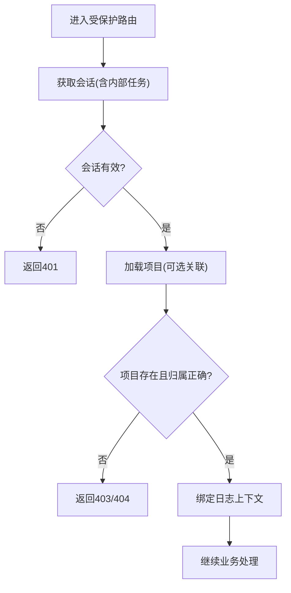
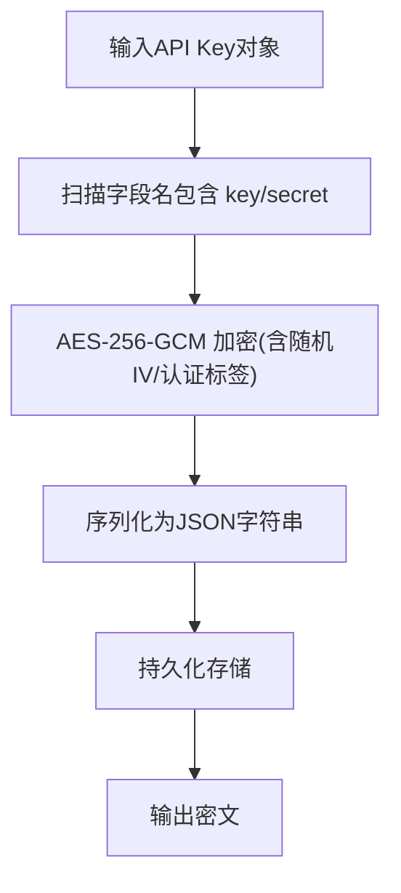
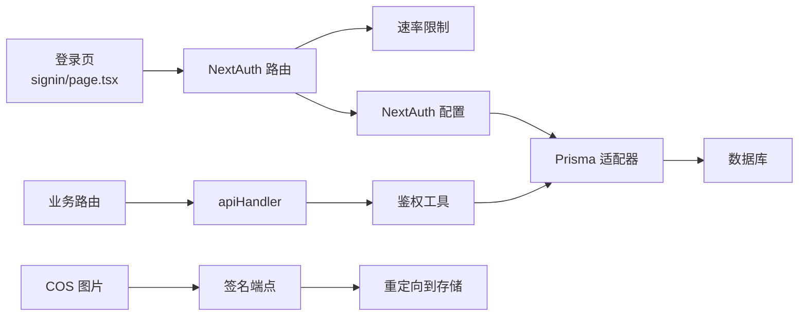

# 安全架构

<cite>
**本文引用的文件**
- [src/app/api/auth/[...nextauth]/route.ts](file://src/app/api/auth/[...nextauth]/route.ts)
- [src/lib/auth.ts](file://src/lib/auth.ts)
- [src/types/next-auth.d.ts](file://src/types/next-auth.d.ts)
- [src/app/[locale]/auth/signin/page.tsx](file://src/app/[locale]/auth/signin/page.tsx)
- [src/lib/rate-limit.ts](file://src/lib/rate-limit.ts)
- [src/lib/api-auth.ts](file://src/lib/api-auth.ts)
- [src/lib/api-errors.ts](file://src/lib/api-errors.ts)
- [src/lib/crypto-utils.ts](file://src/lib/crypto-utils.ts)
- [src/lib/logging/config.ts](file://src/lib/logging/config.ts)
- [src/lib/prisma.ts](file://src/lib/prisma.ts)
- [prisma/schema.prisma](file://prisma/schema.prisma)
- [prisma/schema.sqlit.prisma](file://prisma/schema.sqlit.prisma)
- [src/middleware.ts](file://src/middleware.ts)
- [src/app/api/cos/image/route.ts](file://src/app/api/cos/image/route.ts)
- [scripts/guards/api-route-contract-guard.mjs](file://scripts/guards/api-route-contract-guard.mjs)
- [package.json](file://package.json)
</cite>

## 目录
1. [引言](#引言)
2. [项目结构](#项目结构)
3. [核心组件](#核心组件)
4. [架构总览](#架构总览)
5. [详细组件分析](#详细组件分析)
6. [依赖关系分析](#依赖关系分析)
7. [性能考量](#性能考量)
8. [故障排查指南](#故障排查指南)
9. [结论](#结论)
10. [附录](#附录)

## 引言
本文件面向Waoowaoo项目的安全架构，系统化阐述身份认证与授权、API安全策略、数据安全保护、访问控制与权限管理、威胁模型与防护措施。文档以代码为依据，结合可视化图示，帮助开发者与运维人员理解并优化系统安全。

## 项目结构
围绕安全的关键目录与文件：
- 认证入口与NextAuth集成：src/app/api/auth/[...nextauth]/route.ts、src/lib/auth.ts、src/types/next-auth.d.ts
- 速率限制与登录保护：src/lib/rate-limit.ts、src/app/[locale]/auth/signin/page.tsx
- API统一错误处理与鉴权：src/lib/api-auth.ts、src/lib/api-errors.ts
- 数据安全与密钥管理：src/lib/crypto-utils.ts
- 日志与审计配置：src/lib/logging/config.ts
- 数据库与适配器：prisma/schema.prisma、prisma/schema.sqlit.prisma、src/lib/prisma.ts
- 中间件与路由约束：src/middleware.ts、scripts/guards/api-route-contract-guard.mjs
- 存储签名与重定向：src/app/api/cos/image/route.ts
- 依赖与运行时：package.json

**图表来源**
- [src/app/api/auth/[...nextauth]/route.ts:1-50](file://src/app/api/auth/[...nextauth]/route.ts#L1-L50)
- [src/lib/auth.ts:1-79](file://src/lib/auth.ts#L1-L79)
- [src/types/next-auth.d.ts:1-21](file://src/types/next-auth.d.ts#L1-L21)
- [src/app/[locale]/auth/signin/page.tsx:1-43](file://src/app/[locale]/auth/signin/page.tsx#L1-L43)
- [src/lib/rate-limit.ts:1-146](file://src/lib/rate-limit.ts#L1-L146)
- [src/lib/api-auth.ts:1-355](file://src/lib/api-auth.ts#L1-L355)
- [src/lib/api-errors.ts:1-571](file://src/lib/api-errors.ts#L1-L571)
- [src/lib/crypto-utils.ts:1-195](file://src/lib/crypto-utils.ts#L1-L195)
- [src/lib/prisma.ts:1-7](file://src/lib/prisma.ts#L1-L7)
- [prisma/schema.prisma:1-28](file://prisma/schema.prisma#L1-L28)
- [prisma/schema.sqlit.prisma:1-28](file://prisma/schema.sqlit.prisma#L1-L28)
- [src/app/api/cos/image/route.ts:1-15](file://src/app/api/cos/image/route.ts#L1-L15)
- [src/lib/logging/config.ts:1-41](file://src/lib/logging/config.ts#L1-L41)
- [src/middleware.ts:1-28](file://src/middleware.ts#L1-L28)
- [scripts/guards/api-route-contract-guard.mjs:1-53](file://scripts/guards/api-route-contract-guard.mjs#L1-L53)

**章节来源**
- [src/app/api/auth/[...nextauth]/route.ts:1-50](file://src/app/api/auth/[...nextauth]/route.ts#L1-L50)
- [src/lib/auth.ts:1-79](file://src/lib/auth.ts#L1-L79)
- [src/types/next-auth.d.ts:1-21](file://src/types/next-auth.d.ts#L1-L21)
- [src/app/[locale]/auth/signin/page.tsx:1-43](file://src/app/[locale]/auth/signin/page.tsx#L1-L43)
- [src/lib/rate-limit.ts:1-146](file://src/lib/rate-limit.ts#L1-L146)
- [src/lib/api-auth.ts:1-355](file://src/lib/api-auth.ts#L1-L355)
- [src/lib/api-errors.ts:1-571](file://src/lib/api-errors.ts#L1-L571)
- [src/lib/crypto-utils.ts:1-195](file://src/lib/crypto-utils.ts#L1-L195)
- [src/lib/prisma.ts:1-7](file://src/lib/prisma.ts#L1-L7)
- [prisma/schema.prisma:1-28](file://prisma/schema.prisma#L1-L28)
- [prisma/schema.sqlit.prisma:1-28](file://prisma/schema.sqlit.prisma#L1-L28)
- [src/app/api/cos/image/route.ts:1-15](file://src/app/api/cos/image/route.ts#L1-L15)
- [src/lib/logging/config.ts:1-41](file://src/lib/logging/config.ts#L1-L41)
- [src/middleware.ts:1-28](file://src/middleware.ts#L1-L28)
- [scripts/guards/api-route-contract-guard.mjs:1-53](file://scripts/guards/api-route-contract-guard.mjs#L1-L53)

## 核心组件
- NextAuth配置与回调：基于凭据提供者，JWT会话策略，回调注入用户ID至会话与令牌。
- 登录速率限制：针对凭据回调登录进行IP级滑动窗口限流，Redis原子脚本实现。
- API统一鉴权与权限：requireUserAuth/requireProjectAuth/requireProjectAuthLight，结合Prisma查询与日志上下文绑定。
- API统一错误处理：标准化错误码、状态映射、审计日志与请求ID追踪。
- 密钥加密工具：AES-256-GCM，PBKDF2派生密钥，统一加密/解密API Key对象。
- 日志与审计：可配置日志级别、审计开关、敏感字段脱敏。
- 存储签名与重定向：COS图片访问通过签名端点重定向，避免暴露原始链接。
- 中间件与路由合约：国际化中间件与API路由合约守卫，确保受保护路由具备显式鉴权。

**章节来源**
- [src/lib/auth.ts:56-78](file://src/lib/auth.ts#L56-L78)
- [src/lib/rate-limit.ts:35-45](file://src/lib/rate-limit.ts#L35-L45)
- [src/lib/rate-limit.ts:58-118](file://src/lib/rate-limit.ts#L58-L118)
- [src/lib/api-auth.ts:173-191](file://src/lib/api-auth.ts#L173-L191)
- [src/lib/api-auth.ts:214-292](file://src/lib/api-auth.ts#L214-L292)
- [src/lib/api-auth.ts:306-313](file://src/lib/api-auth.ts#L306-L313)
- [src/lib/api-errors.ts:440-562](file://src/lib/api-errors.ts#L440-L562)
- [src/lib/crypto-utils.ts:27-38](file://src/lib/crypto-utils.ts#L27-L38)
- [src/lib/crypto-utils.ts:50-111](file://src/lib/crypto-utils.ts#L50-L111)
- [src/lib/crypto-utils.ts:125-146](file://src/lib/crypto-utils.ts#L125-L146)
- [src/lib/logging/config.ts:24-35](file://src/lib/logging/config.ts#L24-L35)
- [src/app/api/cos/image/route.ts:4-15](file://src/app/api/cos/image/route.ts#L4-L15)
- [src/middleware.ts:1-28](file://src/middleware.ts#L1-L28)
- [scripts/guards/api-route-contract-guard.mjs:11-24](file://scripts/guards/api-route-contract-guard.mjs#L11-L24)

## 架构总览
下图展示登录流程、速率限制、NextAuth回调与会话管理的交互。

**图表来源**
- [src/app/api/auth/[...nextauth]/route.ts:19-44](file://src/app/api/auth/[...nextauth]/route.ts#L19-L44)
- [src/lib/rate-limit.ts:58-118](file://src/lib/rate-limit.ts#L58-L118)
- [src/lib/auth.ts:22-53](file://src/lib/auth.ts#L22-L53)

**章节来源**
- [src/app/api/auth/[...nextauth]/route.ts:19-44](file://src/app/api/auth/[...nextauth]/route.ts#L19-L44)
- [src/lib/rate-limit.ts:58-118](file://src/lib/rate-limit.ts#L58-L118)
- [src/lib/auth.ts:22-53](file://src/lib/auth.ts#L22-L53)

## 详细组件分析

### 身份认证与会话控制
- 凭据提供者与密码校验：用户名/密码经bcrypt比对，成功后写入日志。
- JWT会话策略：回调将用户ID写入token与session，前端通过next-auth/react消费。
- 安全Cookie策略：根据NEXTAUTH_URL协议动态启用Secure Cookie，支持局域网HTTP场景。
- 登录页面与错误提示：登录页捕获NextAuth返回的错误（含限流），本地提示用户。

**图表来源**
- [src/app/[locale]/auth/signin/page.tsx:18-43](file://src/app/[locale]/auth/signin/page.tsx#L18-L43)

**章节来源**
- [src/lib/auth.ts:15-78](file://src/lib/auth.ts#L15-L78)
- [src/types/next-auth.d.ts:1-21](file://src/types/next-auth.d.ts#L1-L21)
- [src/app/[locale]/auth/signin/page.tsx:18-43](file://src/app/[locale]/auth/signin/page.tsx#L18-L43)

### 速率限制与防暴力破解
- 动作维度：区分登录与注册，分别配置窗口与阈值。
- 实现方式：Redis ZSET滑动窗口，Lua脚本原子清理过期与计数。
- IP提取：优先x-forwarded-for首IP，其次x-real-ip，再回退到请求属性，最终兜底。
- 登录限流：仅对凭据回调登录生效，其他NextAuth内部路由不拦截；限流时返回兼容NextAuth的错误URL与Retry-After头部。

**图表来源**
- [src/app/api/auth/[...nextauth]/route.ts:19-44](file://src/app/api/auth/[...nextauth]/route.ts#L19-L44)
- [src/lib/rate-limit.ts:58-118](file://src/lib/rate-limit.ts#L58-L118)
- [src/lib/rate-limit.ts:128-145](file://src/lib/rate-limit.ts#L128-L145)

**章节来源**
- [src/app/api/auth/[...nextauth]/route.ts:19-44](file://src/app/api/auth/[...nextauth]/route.ts#L19-L44)
- [src/lib/rate-limit.ts:35-45](file://src/lib/rate-limit.ts#L35-L45)
- [src/lib/rate-limit.ts:58-118](file://src/lib/rate-limit.ts#L58-L118)
- [src/lib/rate-limit.ts:128-145](file://src/lib/rate-limit.ts#L128-L145)

### API安全策略与错误处理
- 统一错误处理：apiHandler包装路由，标准化错误码、状态码、审计事件与请求ID。
- 审计范围：对生成类操作（如生成/分析/语音等）在非5xx时进行审计日志。
- 内部任务流：支持内部任务流回调发布，保障内部执行链路可观测性。
- 路由合约守卫：API路由白名单与鉴权要求检查，确保受保护路由具备显式鉴权。

**图表来源**
- [src/lib/api-errors.ts:440-562](file://src/lib/api-errors.ts#L440-L562)

**章节来源**
- [src/lib/api-errors.ts:41-51](file://src/lib/api-errors.ts#L41-L51)
- [src/lib/api-errors.ts:440-562](file://src/lib/api-errors.ts#L440-L562)
- [scripts/guards/api-route-contract-guard.mjs:11-24](file://scripts/guards/api-route-contract-guard.mjs#L11-L24)

### 访问控制与权限管理
- 用户级鉴权：requireUserAuth，适用于用户资源API。
- 项目级鉴权：requireProjectAuth，校验项目存在、所有权与必要关联数据。
- 轻量项目鉴权：requireProjectAuthLight，适用于不需要完整novelPromotionData的场景。
- 内部任务鉴权：通过请求头携带令牌与用户ID，仅在开发或显式配置时放行。
- 日志上下文：鉴权通过后绑定userId与projectId，便于审计追踪。

**图表来源**
- [src/lib/api-auth.ts:173-191](file://src/lib/api-auth.ts#L173-L191)
- [src/lib/api-auth.ts:214-292](file://src/lib/api-auth.ts#L214-L292)
- [src/lib/api-auth.ts:306-313](file://src/lib/api-auth.ts#L306-L313)

**章节来源**
- [src/lib/api-auth.ts:173-191](file://src/lib/api-auth.ts#L173-L191)
- [src/lib/api-auth.ts:214-292](file://src/lib/api-auth.ts#L214-L292)
- [src/lib/api-auth.ts:306-313](file://src/lib/api-auth.ts#L306-L313)

### 数据安全保护机制
- 敏感信息加密：API Key对象批量加密，字段名包含key或secret时自动加密；解密失败保留原文，避免服务中断。
- 传输安全：NextAuth根据URL协议动态启用Secure Cookie；登录页通过兼容格式返回错误，避免泄露内部细节。
- 存储安全：数据库采用Prisma适配器；日志配置支持敏感字段脱敏；COS图片访问通过签名端点重定向，隐藏真实存储地址。
- 会话安全：JWT策略配合回调注入用户ID，避免在客户端存储敏感信息。

**图表来源**
- [src/lib/crypto-utils.ts:125-146](file://src/lib/crypto-utils.ts#L125-L146)
- [src/lib/crypto-utils.ts:50-111](file://src/lib/crypto-utils.ts#L50-L111)

**章节来源**
- [src/lib/crypto-utils.ts:27-38](file://src/lib/crypto-utils.ts#L27-L38)
- [src/lib/crypto-utils.ts:50-111](file://src/lib/crypto-utils.ts#L50-L111)
- [src/lib/crypto-utils.ts:125-146](file://src/lib/crypto-utils.ts#L125-L146)
- [src/lib/logging/config.ts:24-35](file://src/lib/logging/config.ts#L24-L35)
- [src/app/api/cos/image/route.ts:4-15](file://src/app/api/cos/image/route.ts#L4-L15)

### 访问控制列表与权限策略
- API路由白名单：明确允许公开访问或框架管理的路由（如认证、系统引导、文件上传等）。
- 明确鉴权要求：受保护路由必须显式调用鉴权工具（如requireUserAuth/requireProjectAuth）。
- 例外与合规：合约守卫对特定路由放行，同时要求受保护路由具备鉴权与错误处理包装。

**章节来源**
- [scripts/guards/api-route-contract-guard.mjs:11-24](file://scripts/guards/api-route-contract-guard.mjs#L11-L24)
- [scripts/guards/api-route-contract-guard.mjs:26-30](file://scripts/guards/api-route-contract-guard.mjs#L26-L30)

## 依赖关系分析
- 认证链路：登录路由 -> 速率限制 -> NextAuth配置 -> 数据库适配器。
- API链路：业务路由 -> apiHandler -> 鉴权工具 -> 数据库/外部服务 -> 统一错误处理。
- 存储链路：COS图片访问 -> 签名端点 -> 重定向到真实存储。
- 中间件：国际化中间件影响路由匹配与重定向策略。

**图表来源**
- [src/app/[locale]/auth/signin/page.tsx:18-43](file://src/app/[locale]/auth/signin/page.tsx#L18-L43)
- [src/app/api/auth/[...nextauth]/route.ts:19-44](file://src/app/api/auth/[...nextauth]/route.ts#L19-L44)
- [src/lib/rate-limit.ts:58-118](file://src/lib/rate-limit.ts#L58-L118)
- [src/lib/auth.ts:15-78](file://src/lib/auth.ts#L15-L78)
- [src/lib/api-auth.ts:173-191](file://src/lib/api-auth.ts#L173-L191)
- [src/lib/api-errors.ts:440-562](file://src/lib/api-errors.ts#L440-L562)
- [src/app/api/cos/image/route.ts:4-15](file://src/app/api/cos/image/route.ts#L4-L15)

**章节来源**
- [src/lib/prisma.ts:1-7](file://src/lib/prisma.ts#L1-L7)
- [prisma/schema.prisma:1-28](file://prisma/schema.prisma#L1-L28)
- [prisma/schema.sqlit.prisma:1-28](file://prisma/schema.sqlit.prisma#L1-L28)

## 性能考量
- 速率限制：Redis原子Lua脚本减少网络往返，窗口过期略大于窗口时长避免边界竞争。
- 统一错误处理：集中化日志与审计，避免重复实现；对生成类操作进行选择性审计，降低开销。
- 会话策略：JWT会话避免频繁查询会话表，结合回调最小化负载。
- 存储签名：通过重定向减少应用层直接暴露存储凭证，降低耦合与风险。

[本节为通用指导，无需具体文件分析]

## 故障排查指南
- 登录被限流：检查Redis可用性与限流键空间；确认客户端IP提取是否正确；查看响应头Retry-After。
- 401/403：确认会话是否有效；核对项目ID归属；检查内部任务令牌配置。
- API错误：查看x-request-id定位日志；关注审计事件；确认错误码映射与用户消息键。
- 存储访问失败：确认签名参数与过期时间；检查重定向目标可达性。
- 日志脱敏：确认敏感字段列表与日志级别配置。

**章节来源**
- [src/lib/rate-limit.ts:98-118](file://src/lib/rate-limit.ts#L98-L118)
- [src/lib/api-auth.ts:184-191](file://src/lib/api-auth.ts#L184-L191)
- [src/lib/api-errors.ts:534-557](file://src/lib/api-errors.ts#L534-L557)
- [src/lib/logging/config.ts:24-35](file://src/lib/logging/config.ts#L24-L35)
- [src/app/api/cos/image/route.ts:4-15](file://src/app/api/cos/image/route.ts#L4-L15)

## 结论
Waoowaoo的安全架构以NextAuth/JWT为核心，结合Redis速率限制、统一API错误处理与鉴权工具、敏感数据加密与日志脱敏、以及存储签名重定向，形成完整的认证授权与API安全体系。通过合约守卫与中间件约束，进一步强化了路由与访问控制的合规性。建议持续完善令牌刷新与撤销、审计覆盖与告警联动，并定期评估第三方依赖与运行时配置。

[本节为总结，无需具体文件分析]

## 附录
- 运行时依赖：NextAuth、Prisma、Redis、Express/BullBoard等。
- 开发与测试：多套守卫脚本与测试矩阵，保障API契约与行为质量。

**章节来源**
- [package.json:112-162](file://package.json#L112-L162)
- [package.json:27-90](file://package.json#L27-L90)