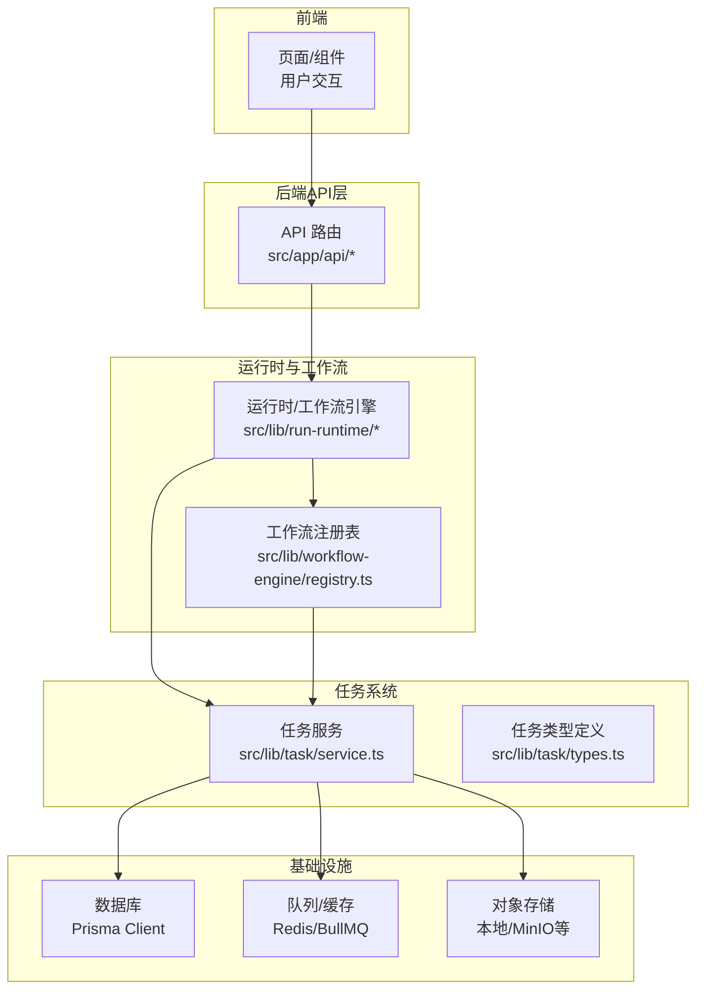
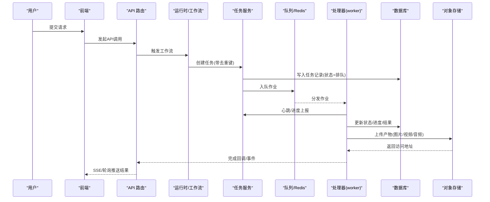
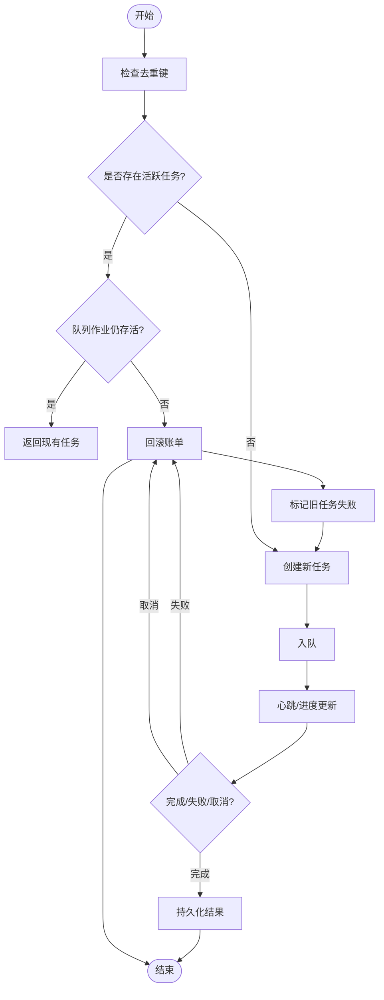
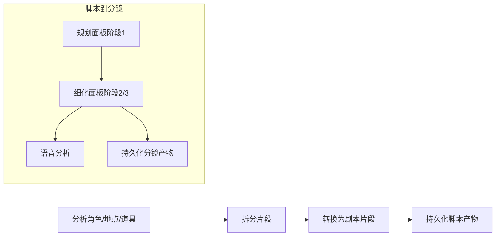
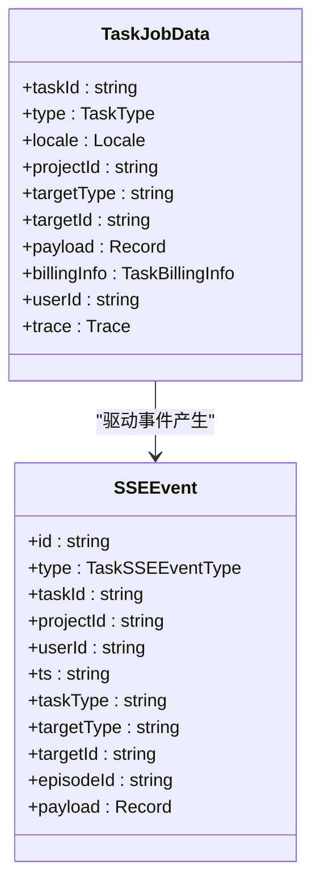
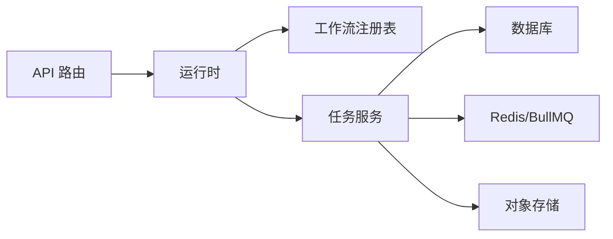

# 数据流设计

<cite>
**本文引用的文件**
- [src/lib/prisma.ts](file://src/lib/prisma.ts)
- [src/lib/redis.ts](file://src/lib/redis.ts)
- [src/lib/storage/index.ts](file://src/lib/storage/index.ts)
- [src/lib/task/types.ts](file://src/lib/task/types.ts)
- [src/lib/task/service.ts](file://src/lib/task/service.ts)
- [src/lib/workflow-engine/registry.ts](file://src/lib/workflow-engine/registry.ts)
- [src/lib/run-runtime/workflow.ts](file://src/lib/run-runtime/workflow.ts)
- [src/lib/media-process.ts](file://src/lib/media-process.ts)
- [src/lib/media.ts](file://src/lib/media.ts)
- [src/lib/media-process.ts](file://src/lib/media-process.ts)
- [src/lib/media.ts](file://src/lib/media.ts)
- [src/lib/media-process.ts](file://src/lib/media-process.ts)
- [src/lib/media.ts](file://src/lib/media.ts)
- [src/lib/media-process.ts](file://src/lib/media-process.ts)
- [src/lib/media.ts](file://src/lib/media.ts)
- [src/lib/media-process.ts](file://src/lib/media-process.ts)
- [src/lib/media.ts](file://src/lib/media.ts)
- [src/lib/media-process.ts](file://src/lib/media-process.ts)
- [src/lib/media.ts](file://src/lib/media.ts)
- [src/lib/media-process.ts](file://src/lib/media-process.ts)
- [src/lib/media.ts](file://src/lib/media.ts)
- [src/lib/media-process.ts](file://src/lib/media-process.ts)
- [src/lib/media.ts](file://src/lib/media.ts)
- [src/lib/media-process.ts](file://src/lib/media-process.ts)
- [src/lib/media.ts](file://src/lib/media.ts)
- [src/lib/media-process.ts](file://src/lib/media-process.ts)
- [src/lib/media.ts](file://src/lib/media.ts)
- [src/lib/media-process.ts](file://src/lib/media-process.ts)
- [src/lib/media.ts](file://src/lib/media.ts)
- [src/lib/media-process.ts](file://src/lib/media-process.ts)
- [src/lib/media.ts](file://src/lib/media.ts)
- [src/lib/media-process.ts](file://src/lib/media-process.ts)
- [src/lib/media.ts](file://src/lib/media.ts)
- [src/lib/media-process.ts](file://src/lib/media-process.ts)
- [src/lib/media.ts](file://src/lib/media.ts)
- [src/lib/media-process.ts](file://src/lib/media-process.ts)
- [src/lib/media.ts](file://src/lib/media.ts)
- [src/lib/media-process.ts](file://src/lib/media-process.ts)
- [src/lib/media.ts](file://src/lib/media.ts)
- [src/lib/media-process.ts](file://src/lib/media-process.ts)
- [src/lib/media.ts](file://src/lib/media.ts)
- [src/lib/media-process.ts](file://src......)
</cite>

## 目录
1. [引言](#引言)
2. [项目结构](#项目结构)
3. [核心组件](#核心组件)
4. [架构总览](#架构总览)
5. [详细组件分析](#详细组件分析)
6. [依赖关系分析](#依赖关系分析)
7. [性能考量](#性能考量)
8. [故障排查指南](#故障排查指南)
9. [结论](#结论)
10. [附录](#附录)

## 引言
本文件面向Waoowaoo项目，提供系统内“数据流”的设计文档。目标是清晰描述从用户输入到最终输出的完整路径；解释任务队列中的数据传递机制（创建、状态更新、结果回传）；阐述AI服务调用的数据格式与响应处理流程；说明数据库操作的数据一致性保障；描述缓存策略与数据同步机制；并以数据流向图与关键数据结构示例，展示文本、图像、视频、音频等多类型数据在系统中的处理方式。

## 项目结构
Waoowaoo采用前后端同构Next.js应用，结合Prisma ORM、Redis/BullMQ队列、以及可插拔的存储后端（本地或对象存储）。前端通过API路由触发后端逻辑，后端通过任务系统调度AI/媒体处理工作流，并持久化到数据库与对象存储中。

图表来源
- [src/lib/task/service.ts](file://src/lib/task/service.ts)
- [src/lib/task/types.ts](file://src/lib/task/types.ts)
- [src/lib/workflow-engine/registry.ts](file://src/lib/workflow-engine/registry.ts)
- [src/lib/run-runtime/workflow.ts](file://src/lib/run-runtime/workflow.ts)
- [src/lib/prisma.ts](file://src/lib/prisma.ts)
- [src/lib/redis.ts](file://src/lib/redis.ts)
- [src/lib/storage/index.ts](file://src/lib/storage/index.ts)

章节来源
- [src/lib/prisma.ts](file://src/lib/prisma.ts)
- [src/lib/redis.ts](file://src/lib/redis.ts)
- [src/lib/storage/index.ts](file://src/lib/storage/index.ts)
- [src/lib/task/types.ts](file://src/lib/task/types.ts)
- [src/lib/task/service.ts](file://src/lib/task/service.ts)
- [src/lib/workflow-engine/registry.ts](file://src/lib/workflow-engine/registry.ts)
- [src/lib/run-runtime/workflow.ts](file://src/lib/run-runtime/workflow.ts)

## 核心组件
- 任务系统：负责任务生命周期管理（创建、入队、心跳、进度、完成/失败/取消）、去重、账单回滚与超时清理。
- 工作流引擎：定义任务型工作流的步骤依赖、重试失效范围与失败模式。
- 运行时：将任务类型映射为工作流类型，驱动步骤执行。
- 数据库：使用Prisma进行事务性写入与查询，保障任务状态与账单信息一致。
- 队列/缓存：使用Redis/BullMQ承载任务作业与事件分发。
- 存储：统一抽象上传/下载/签名URL生成，支持本地与对象存储后端。

章节来源
- [src/lib/task/service.ts](file://src/lib/task/service.ts)
- [src/lib/task/types.ts](file://src/lib/task/types.ts)
- [src/lib/workflow-engine/registry.ts](file://src/lib/workflow-engine/registry.ts)
- [src/lib/run-runtime/workflow.ts](file://src/lib/run-runtime/workflow.ts)
- [src/lib/prisma.ts](file://src/lib/prisma.ts)
- [src/lib/redis.ts](file://src/lib/redis.ts)
- [src/lib/storage/index.ts](file://src/lib/storage/index.ts)

## 架构总览
下图展示了典型“用户输入 → 任务创建 → 入队/心跳 → 处理器执行 → 结果落库/存储 → SSE/轮询回传”的闭环数据流。

图表来源
- [src/lib/task/service.ts](file://src/lib/task/service.ts)
- [src/lib/task/types.ts](file://src/lib/task/types.ts)
- [src/lib/workflow-engine/registry.ts](file://src/lib/workflow-engine/registry.ts)
- [src/lib/run-runtime/workflow.ts](file://src/lib/run-runtime/workflow.ts)
- [src/lib/redis.ts](file://src/lib/redis.ts)
- [src/lib/storage/index.ts](file://src/lib/storage/index.ts)

## 详细组件分析

### 任务系统与数据一致性
- 去重与竞态：基于dedupeKey在数据库层面进行唯一约束，若冲突则判定是否已有活跃任务或孤儿任务，必要时回滚账单并终止旧任务，确保幂等。
- 状态机：支持排队、处理中、完成、失败、取消、忽略等状态；通过心跳与尝试次数控制处理生命周期。
- 账单回滚：对可计费任务在失败/取消/超时时自动触发回滚，避免误收费。
- 超时清扫：定期扫描长时间无心跳的任务，回滚账单并标记失败，防止资源泄漏。

图表来源
- [src/lib/task/service.ts](file://src/lib/task/service.ts)
- [src/lib/task/types.ts](file://src/lib/task/types.ts)

章节来源
- [src/lib/task/service.ts](file://src/lib/task/service.ts)
- [src/lib/task/types.ts](file://src/lib/task/types.ts)

### 工作流与步骤依赖
- 工作流定义：以“有序步骤+依赖+失效范围”描述，支持故事到脚本、脚本到分镜等流程。
- 步骤失效范围：当某步重试或变更时，自动计算受影响的下游步骤集合，确保一致性。
- 失败模式：支持“失败即终止整个运行”，保证错误不会扩散。

图表来源
- [src/lib/workflow-engine/registry.ts](file://src/lib/workflow-engine/registry.ts)
- [src/lib/run-runtime/workflow.ts](file://src/lib/run-runtime/workflow.ts)

章节来源
- [src/lib/workflow-engine/registry.ts](file://src/lib/workflow-engine/registry.ts)
- [src/lib/run-runtime/workflow.ts](file://src/lib/run-runtime/workflow.ts)

### AI服务调用与数据格式
- 输入格式：任务负载payload包含任务类型、目标实体、语言环境、计费信息等字段，具体字段随任务类型而定。
- 输出格式：SSE事件携带生命周期事件与流式事件，客户端据此渲染进度与结果。
- 事件类型：生命周期事件（创建/处理中/完成/失败），流式事件（中间结果）。

图表来源
- [src/lib/task/types.ts](file://src/lib/task/types.ts)

章节来源
- [src/lib/task/types.ts](file://src/lib/task/types.ts)

### 数据库操作与一致性
- 单实例Prisma Client：全局单例避免连接泄露，开发环境隔离实例。
- 重试与回滚：任务状态更新与账单信息变更均通过带重试的写入，失败时触发补偿。
- 事务边界：任务状态变更与账单状态变更在单条记录上原子更新，避免跨记录不一致。

章节来源
- [src/lib/prisma.ts](file://src/lib/prisma.ts)
- [src/lib/task/service.ts](file://src/lib/task/service.ts)

### 缓存策略与数据同步
- Redis配置：区分应用客户端与队列客户端，队列客户端禁用命令重试以避免副作用；提供订阅客户端用于事件分发。
- 连接策略：指数退避重连，测试环境延迟连接；连接/错误日志统一记录。
- 数据同步：SSE事件与数据库状态共同驱动前端UI更新；对象存储URL与数据库产物地址保持一致。

章节来源
- [src/lib/redis.ts](file://src/lib/redis.ts)
- [src/lib/task/service.ts](file://src/lib/task/service.ts)

### 存储与多类型媒体处理
- 统一接口：提供上传、删除、批量删除、签名URL生成、下载缓冲、本地可访问URL转换等能力。
- 图像处理：下载远端图片，压缩至JPEG并限制最大体积，再上传到存储后端。
- 视频处理：下载远端视频，按需上传，支持自定义请求头。
- 媒体工具：媒体处理与媒体服务模块负责格式转换、尺寸调整、质量控制等。

章节来源
- [src/lib/storage/index.ts](file://src/lib/storage/index.ts)
- [src/lib/media-process.ts](file://src/lib/media-process.ts)
- [src/lib/media.ts](file://src/lib/media.ts)

## 依赖关系分析
- 低耦合：任务系统与工作流引擎解耦，运行时仅依赖任务类型映射。
- 依赖链：API路由 → 运行时/工作流 → 任务服务 → 数据库/队列/存储。
- 外部依赖：Redis/BullMQ、对象存储、数据库。

图表来源
- [src/lib/task/service.ts](file://src/lib/task/service.ts)
- [src/lib/workflow-engine/registry.ts](file://src/lib/workflow-engine/registry.ts)
- [src/lib/run-runtime/workflow.ts](file://src/lib/run-runtime/workflow.ts)
- [src/lib/prisma.ts](file://src/lib/prisma.ts)
- [src/lib/redis.ts](file://src/lib/redis.ts)
- [src/lib/storage/index.ts](file://src/lib/storage/index.ts)

章节来源
- [src/lib/task/service.ts](file://src/lib/task/service.ts)
- [src/lib/workflow-engine/registry.ts](file://src/lib/workflow-engine/registry.ts)
- [src/lib/run-runtime/workflow.ts](file://src/lib/run-runtime/workflow.ts)
- [src/lib/prisma.ts](file://src/lib/prisma.ts)
- [src/lib/redis.ts](file://src/lib/redis.ts)
- [src/lib/storage/index.ts](file://src/lib/storage/index.ts)

## 性能考量
- 队列背压：通过优先级与最大尝试次数控制队列压力；长耗时任务建议拆分为多个子任务。
- 并发与重试：媒体处理与存储上传采用指数退避重试，避免抖动放大。
- 心跳与超时：合理设置心跳周期与超时阈值，平衡资源占用与可靠性。
- 缓存命中：SSE事件与数据库状态双通道更新，减少重复查询；对象存储URL短有效期签名降低带宽成本。

## 故障排查指南
- 任务未入队：检查队列连接、入队失败计数与最后错误；查看任务入队失败记录。
- 任务卡住：确认心跳时间戳与处理阈值；必要时触发超时清扫并回滚账单。
- 去重冲突：检查dedupeKey是否正确；若出现孤儿任务，系统会自动终止并回滚。
- 存储异常：核对签名URL生成与下载缓冲逻辑；关注上传重试与最大体积限制。
- 计费问题：核对账单快照与回滚状态；确认计费模式（关闭/影子/强制）。

章节来源
- [src/lib/task/service.ts](file://src/lib/task/service.ts)
- [src/lib/storage/index.ts](file://src/lib/storage/index.ts)
- [src/lib/redis.ts](file://src/lib/redis.ts)

## 结论
Waoowaoo通过“任务系统 + 工作流引擎 + 运行时”的组合，实现了从用户输入到AI/媒体处理再到结果回传的全链路数据流。数据库与队列/缓存协同保障一致性与可靠性，存储抽象支持多后端扩展。本文档提供了数据流图、关键数据结构与处理流程说明，便于开发者快速定位问题与优化性能。

## 附录
- 关键数据结构参考：任务类型、事件类型、SSE事件、任务作业数据等。
- 多媒体处理参考：图像下载/压缩/上传、视频下载/上传、媒体工具函数。