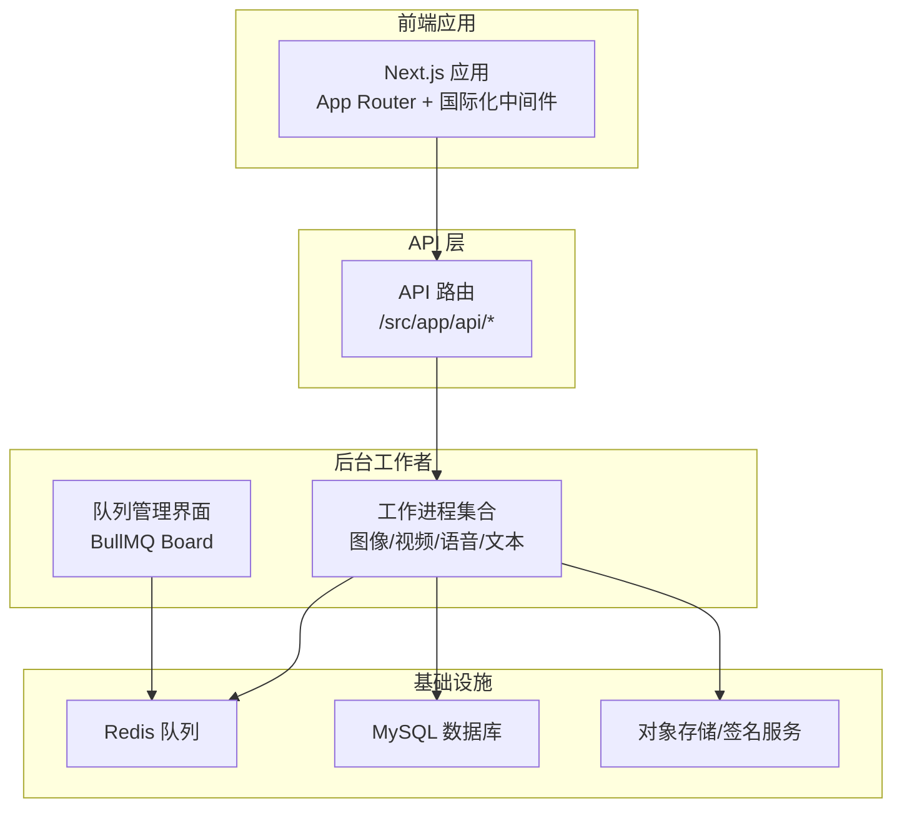
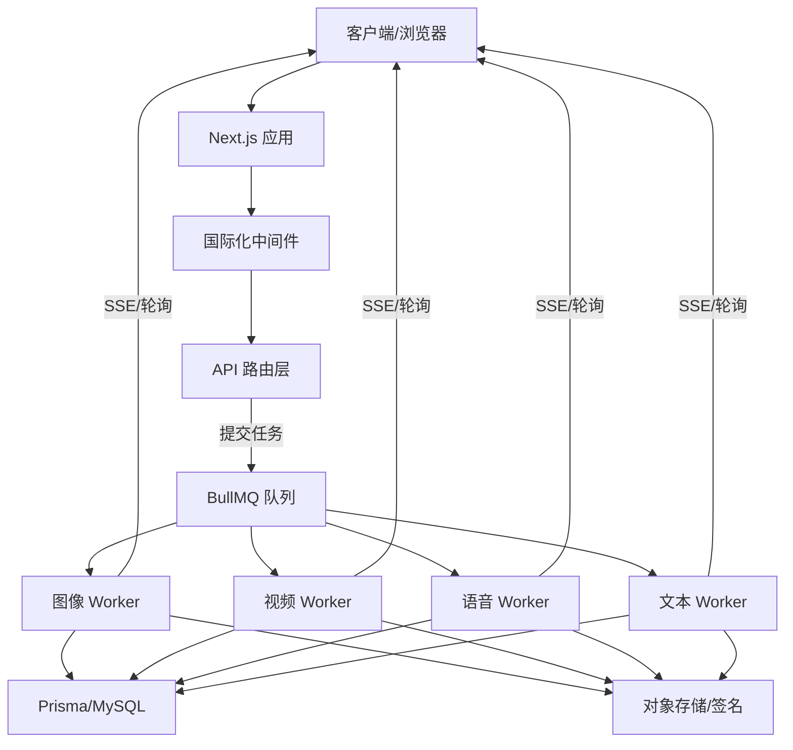
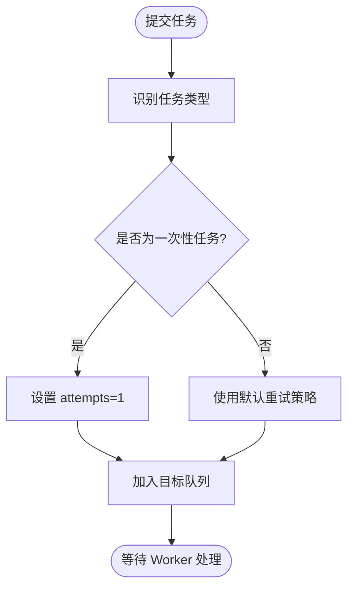
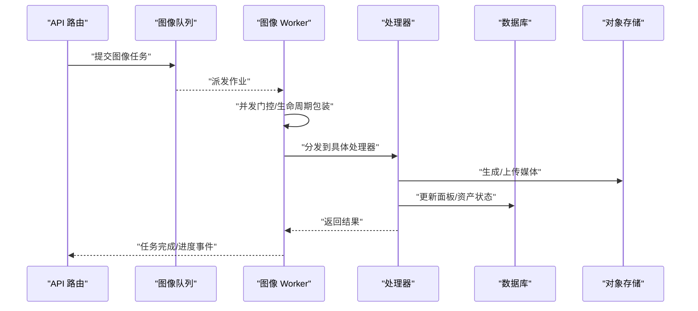
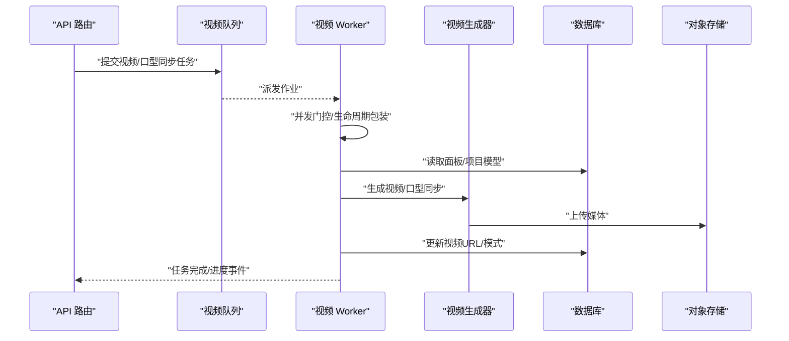
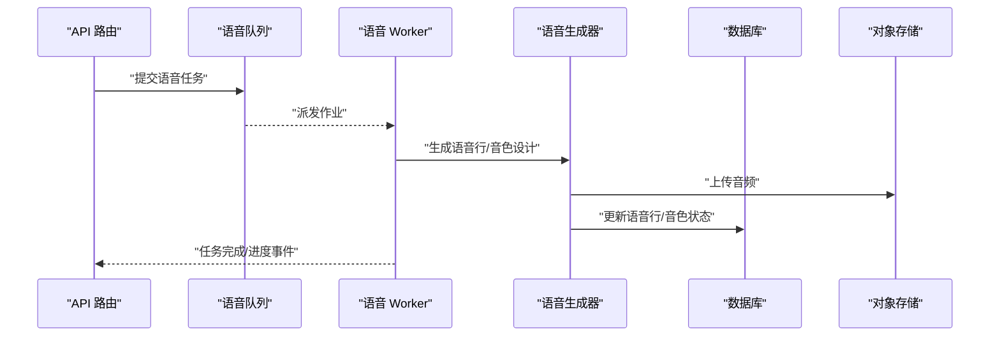
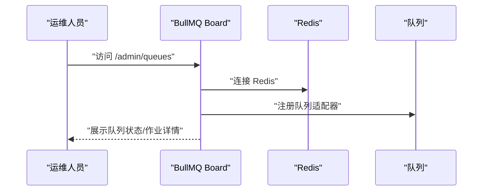
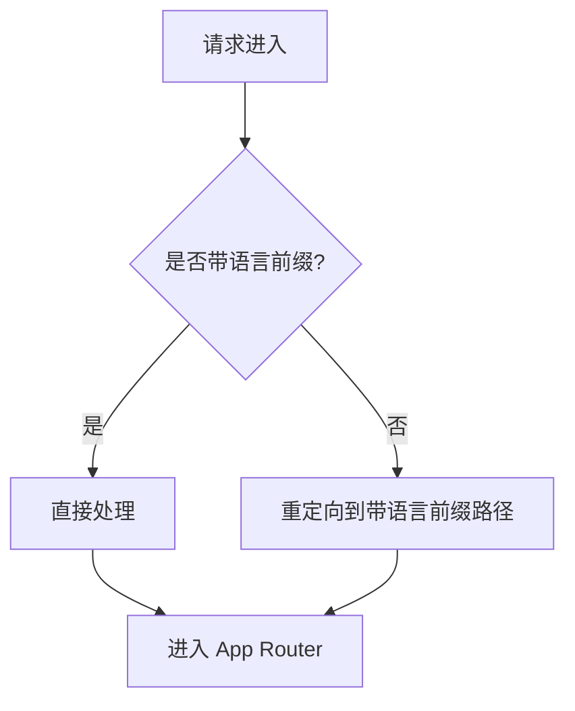
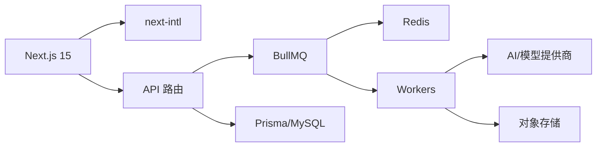

# 架构设计

<cite>
**本文引用的文件**
- [package.json](file://package.json)
- [next.config.ts](file://next.config.ts)
- [prisma/schema.prisma](file://prisma/schema.prisma)
- [src/lib/prisma.ts](file://src/lib/prisma.ts)
- [src/middleware.ts](file://src/middleware.ts)
- [src/lib/workers/index.ts](file://src/lib/workers/index.ts)
- [src/lib/workers/image.worker.ts](file://src/lib/workers/image.worker.ts)
- [src/lib/workers/video.worker.ts](file://src/lib/workers/video.worker.ts)
- [src/lib/workers/voice.worker.ts](file://src/lib/workers/voice.worker.ts)
- [src/lib/task/queues.ts](file://src/lib/task/queues.ts)
- [scripts/bull-board.ts](file://scripts/bull-board.ts)
- [src/lib/storage/init.ts](file://src/lib/storage/init.ts)
</cite>

## 目录
1. [引言](#引言)
2. [项目结构](#项目结构)
3. [核心组件](#核心组件)
4. [架构总览](#架构总览)
5. [详细组件分析](#详细组件分析)
6. [依赖分析](#依赖分析)
7. [性能考量](#性能考量)
8. [故障排查指南](#故障排查指南)
9. [结论](#结论)
10. [附录](#附录)

## 引言
本架构设计文档面向 Waoowaoo 项目，系统性阐述其高层设计、架构模式与边界划分，重点覆盖：
- 前后端分离架构与国际化中间件策略
- 微服务化拆分与任务驱动执行模型
- 事件驱动与工作流编排思路
- 数据流设计：用户请求处理、任务队列与 AI 服务集成
- 技术决策与权衡：Next.js 15、BullMQ、Prisma 等
- 基础设施要求、可扩展性与部署拓扑
- 安全、监控与灾难恢复等横切关注点
- 技术栈、第三方依赖与版本兼容性

## 项目结构
Waoowaoo 采用以功能域为中心的组织方式，结合 Next.js App Router 的约定式路由与 API 路由，配合独立的后台工作进程与任务队列，形成“前端应用 + 后台工作者 + 任务队列 + 数据库”的清晰分层。

图表来源
- [src/middleware.ts:1-28](file://src/middleware.ts#L1-L28)
- [src/lib/workers/index.ts:1-39](file://src/lib/workers/index.ts#L1-L39)
- [src/lib/task/queues.ts:1-112](file://src/lib/task/queues.ts#L1-L112)
- [scripts/bull-board.ts:1-106](file://scripts/bull-board.ts#L1-L106)
- [prisma/schema.prisma:1-120](file://prisma/schema.prisma#L1-L120)

章节来源
- [package.json:1-186](file://package.json#L1-L186)
- [next.config.ts:1-24](file://next.config.ts#L1-L24)
- [src/middleware.ts:1-28](file://src/middleware.ts#L1-L28)

## 核心组件
- 前端应用与国际化中间件：基于 Next.js 15，启用 next-intl 插件，强制语言前缀，关闭自动语言检测，确保稳定的多语言路由与国际化体验。
- API 路由：集中于 /src/app/api，覆盖鉴权、资产中心、小说推广、任务与运行、SSE 等能力，统一对外接口。
- 后台工作者：图像、视频、语音、文本四类 Worker，按任务类型路由至对应处理器，内置并发门控与生命周期包装。
- 任务队列：BullMQ 队列抽象，按任务类型自动路由到图像/视频/语音/文本队列，支持优先级、重试与指数退避。
- 数据持久化：Prisma ORM 连接 MySQL，模型覆盖用户、项目、任务、运行图、计费与媒体对象等核心域。
- 队列可视化：BullMQ Board 提供 Web 管理界面，支持基础认证与队列状态查看。
- 存储初始化：启动时进行存储相关初始化，保障对象存储可用性。

章节来源
- [next.config.ts:1-24](file://next.config.ts#L1-L24)
- [src/middleware.ts:1-28](file://src/middleware.ts#L1-L28)
- [src/lib/workers/index.ts:1-39](file://src/lib/workers/index.ts#L1-L39)
- [src/lib/workers/image.worker.ts:1-68](file://src/lib/workers/image.worker.ts#L1-L68)
- [src/lib/workers/video.worker.ts:1-324](file://src/lib/workers/video.worker.ts#L1-L324)
- [src/lib/workers/voice.worker.ts:1-64](file://src/lib/workers/voice.worker.ts#L1-L64)
- [src/lib/task/queues.ts:1-112](file://src/lib/task/queues.ts#L1-L112)
- [prisma/schema.prisma:1-120](file://prisma/schema.prisma#L1-L120)
- [scripts/bull-board.ts:1-106](file://scripts/bull-board.ts#L1-L106)
- [src/lib/storage/init.ts](file://src/lib/storage/init.ts)

## 架构总览
系统采用“前端应用 + API 路由 + 后台工作者 + 任务队列 + 数据库 + 对象存储”的分层架构。请求从浏览器进入 Next.js 应用，API 路由负责校验与编排，复杂或耗时任务通过 BullMQ 推入队列，由专用 Worker 并发执行，最终写入数据库并返回结果或通过 SSE 推送。

图表来源
- [src/middleware.ts:1-28](file://src/middleware.ts#L1-L28)
- [src/lib/workers/index.ts:1-39](file://src/lib/workers/index.ts#L1-L39)
- [src/lib/task/queues.ts:1-112](file://src/lib/task/queues.ts#L1-L112)
- [prisma/schema.prisma:1-120](file://prisma/schema.prisma#L1-L120)

## 详细组件分析

### 组件A：任务队列与路由
- 队列命名与默认策略：统一前缀与去重、失败/完成清理阈值、重试与指数退避。
- 任务类型到队列的映射：根据任务类型自动选择图像/视频/语音/文本队列；部分一次性任务仅尝试一次。
- 动态添加与取消：按 taskId 在所有队列中查找并移除作业，便于补偿与控制。

图表来源
- [src/lib/task/queues.ts:67-101](file://src/lib/task/queues.ts#L67-L101)

章节来源
- [src/lib/task/queues.ts:1-112](file://src/lib/task/queues.ts#L1-L112)

### 组件B：图像工作流
- 并发门控：按用户维度限制图像并发，避免资源争用。
- 生命周期包装：统一上报进度、错误与收尾逻辑。
- 任务分发：根据任务类型路由到角色/场景/面板/变体/资产中心等处理器。

图表来源
- [src/lib/workers/image.worker.ts:20-48](file://src/lib/workers/image.worker.ts#L20-L48)
- [src/lib/workers/index.ts:1-39](file://src/lib/workers/index.ts#L1-L39)

章节来源
- [src/lib/workers/image.worker.ts:1-68](file://src/lib/workers/image.worker.ts#L1-L68)
- [src/lib/workers/index.ts:1-39](file://src/lib/workers/index.ts#L1-L39)

### 组件C：视频工作流
- 任务解析：优先使用目标类型直接定位面板，否则通过 storyboardId + panelIndex 定位。
- 视频生成：支持普通与首尾帧两种模式，自动解析模型能力与下载头信息，上传到对象存储。
- 口型同步：对齐视频与音频时长，生成口型同步视频并落库。

图表来源
- [src/lib/workers/video.worker.ts:58-78](file://src/lib/workers/video.worker.ts#L58-L78)
- [src/lib/workers/video.worker.ts:183-222](file://src/lib/workers/video.worker.ts#L183-L222)
- [src/lib/workers/video.worker.ts:224-291](file://src/lib/workers/video.worker.ts#L224-L291)

章节来源
- [src/lib/workers/video.worker.ts:1-324](file://src/lib/workers/video.worker.ts#L1-L324)

### 组件D：语音工作流
- 语音行生成：按项目/集数/行 ID 调用语音生成器，持久化结果。
- 语音设计：支持角色音色设计与资产中心音色设计任务。

图表来源
- [src/lib/workers/voice.worker.ts:11-38](file://src/lib/workers/voice.worker.ts#L11-L38)
- [src/lib/workers/voice.worker.ts:40-52](file://src/lib/workers/voice.worker.ts#L40-L52)

章节来源
- [src/lib/workers/voice.worker.ts:1-64](file://src/lib/workers/voice.worker.ts#L1-L64)

### 组件E：队列管理与可视化
- BullMQ Board：Express 托管的 Web 界面，绑定四个队列，支持 Basic 认证与基础路径配置，便于运维与调试。

图表来源
- [scripts/bull-board.ts:60-71](file://scripts/bull-board.ts#L60-L71)
- [scripts/bull-board.ts:73-89](file://scripts/bull-board.ts#L73-L89)

章节来源
- [scripts/bull-board.ts:1-106](file://scripts/bull-board.ts#L1-L106)

### 组件F：国际化与路由匹配
- 中间件：强制语言前缀，关闭自动语言检测，避免无前缀跳转导致的语言漂移；匹配规则覆盖根路径与带语言前缀路径。

图表来源
- [src/middleware.ts:18-27](file://src/middleware.ts#L18-L27)

章节来源
- [src/middleware.ts:1-28](file://src/middleware.ts#L1-L28)
- [next.config.ts:9-21](file://next.config.ts#L9-L21)

## 依赖分析
- 前端框架：Next.js 15，启用 Turbopack 开发体验与严格构建门禁。
- 国际化：next-intl 插件，强制语言前缀，提升 SEO 与路由一致性。
- 任务队列：BullMQ，提供高可靠作业调度与可视化管理。
- 数据持久化：Prisma Client + MySQL，模型覆盖任务、运行图、计费、媒体等。
- 存储：对象存储与签名服务，配合 Worker 完成媒体生成与归档。
- 认证：NextAuth v4，配合 Prisma Adapter。
- AI/模型网关：OpenAI 兼容、Google AI、Fal、火山引擎等多家提供商集成。

图表来源
- [package.json:112-162](file://package.json#L112-L162)
- [src/lib/prisma.ts:1-9](file://src/lib/prisma.ts#L1-L9)
- [src/lib/workers/index.ts:1-39](file://src/lib/workers/index.ts#L1-L39)

章节来源
- [package.json:1-186](file://package.json#L1-L186)
- [prisma/schema.prisma:1-120](file://prisma/schema.prisma#L1-L120)

## 性能考量
- 并发控制：Worker 内置用户级并发门控，避免单用户过度占用资源；不同队列并发度可配置，平衡吞吐与成本。
- 重试与退避：默认指数退避与最大重试次数，降低瞬时故障影响。
- 队列清理：完成/失败作业自动清理，减少 Redis 占用。
- 数据库连接：Prisma Client 单例模式，开发环境隔离，生产环境复用，降低连接开销。
- 构建与运行：Turbopack 加速开发，严格 ESLint/TypeScript 门禁，保证质量与稳定性。

## 故障排查指南
- 队列异常
  - 使用 BullMQ Board 查看队列状态、作业堆积与错误详情。
  - 检查 Basic 认证配置与基础路径，确认访问权限。
- 任务失败
  - 查看 Worker 日志中的失败事件，定位作业 ID、任务类型与错误信息。
  - 根据任务类型检查对应处理器逻辑与外部服务可用性。
- 数据库问题
  - 确认 Prisma Client 初始化与连接字符串正确。
  - 检查迁移与索引，必要时重建索引或修复约束。
- 存储问题
  - 确认对象存储签名与上传流程，检查下载头与跨域配置。
- 国际化与路由
  - 确认中间件匹配规则与语言前缀策略，避免重定向循环。

章节来源
- [scripts/bull-board.ts:17-58](file://scripts/bull-board.ts#L17-L58)
- [src/lib/workers/index.ts:31-39](file://src/lib/workers/index.ts#L31-L39)
- [src/lib/prisma.ts:1-9](file://src/lib/prisma.ts#L1-L9)
- [src/middleware.ts:18-27](file://src/middleware.ts#L18-L27)

## 结论
Waoowaoo 通过“前端应用 + API 路由 + 任务队列 + 后台工作者 + 数据库 + 对象存储”的架构，实现了高内聚、低耦合的任务驱动工作流。Next.js 15 与 next-intl 提供了现代化的前端体验与国际化保障；BullMQ 与 Worker 实现了可靠的异步处理；Prisma 与 MySQL 保证了数据一致性与可观测性。该架构在可扩展性、可维护性与可运营性方面具备良好基础，适合持续演进与规模化部署。

## 附录

### 技术栈与版本兼容性
- 前端与构建
  - Next.js 15.x
  - next-intl
  - Turbopack（开发加速）
- 任务与队列
  - BullMQ
  - ioredis
- 数据与 ORM
  - Prisma Client
  - MySQL
- AI 与模型网关
  - OpenAI 兼容、Google AI、Fal、火山引擎、阿里百炼等
- 认证与会话
  - NextAuth v4 + Prisma Adapter
- 存储与签名
  - 对象存储 + 签名服务
- 开发与测试
  - TypeScript、ESLint、Vitest、Concurrently

章节来源
- [package.json:112-162](file://package.json#L112-L162)
- [package.json:164-184](file://package.json#L164-L184)