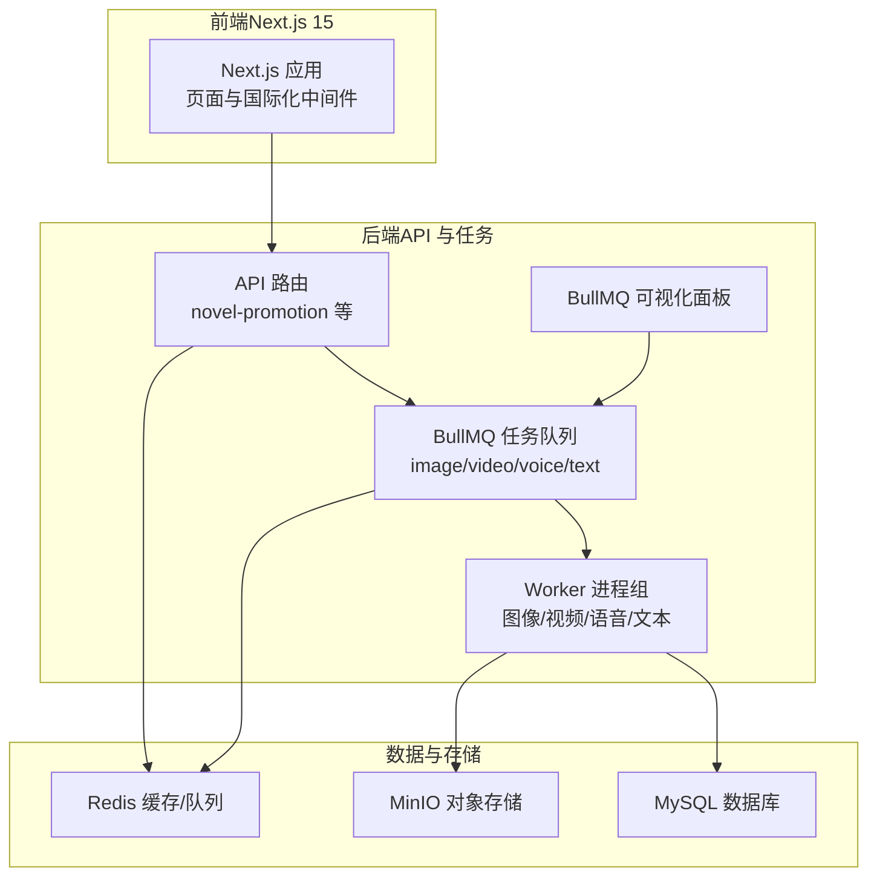
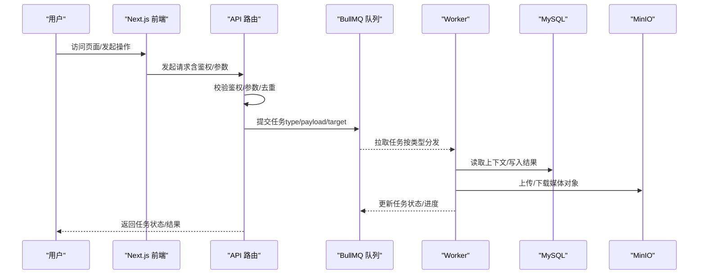
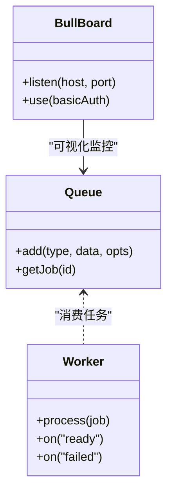
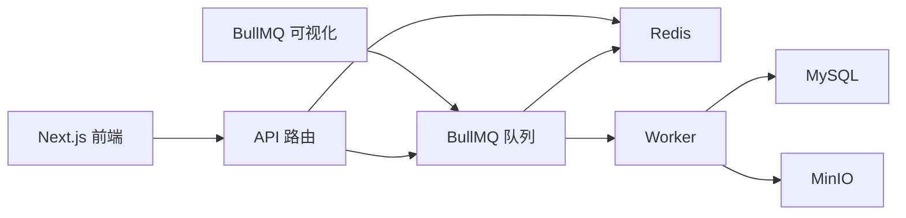

# 系统概览

<cite>
**本文引用的文件**
- [package.json](file://package.json)
- [next.config.ts](file://next.config.ts)
- [src/middleware.ts](file://src/middleware.ts)
- [src/lib/env.ts](file://src/lib/env.ts)
- [src/lib/workers/index.ts](file://src/lib/workers/index.ts)
- [src/lib/workers/image.worker.ts](file://src/lib/workers/image.worker.ts)
- [src/lib/workers/video.worker.ts](file://src/lib/workers/video.worker.ts)
- [src/lib/workers/voice.worker.ts](file://src/lib/workers/voice.worker.ts)
- [src/lib/workers/text.worker.ts](file://src/lib/workers/text.worker.ts)
- [src/lib/workers/shared.ts](file://src/lib/workers/shared.ts)
- [src/lib/workers/user-concurrency-gate.ts](file://src/lib/workers/user-concurrency-gate.ts)
- [src/lib/workers/utils.ts](file://src/lib/workers/utils.ts)
- [src/lib/task/queues.ts](file://src/lib/task/queues.ts)
- [src/lib/redis.ts](file://src/lib/redis.ts)
- [scripts/bull-board.ts](file://scripts/bull-board.ts)
- [src/app/api/novel-promotion/[projectId]/ai-create-character/route.ts](file://src/app/api/novel-promotion/[projectId]/ai-create-character/route.ts)
- [src/lib/llm-client.ts](file://src/lib/llm-client.ts)
- [src/lib/prisma.ts](file://src/lib/prisma.ts)
- [prisma/schema.prisma](file://prisma/schema.prisma)
- [src/lib/storage/init.ts](file://src/lib/storage/init.ts)
- [docker-compose.yml](file://docker-compose.yml)
</cite>

## 目录
1. [简介](#简介)
2. [项目结构](#项目结构)
3. [核心组件](#核心组件)
4. [架构总览](#架构总览)
5. [详细组件分析](#详细组件分析)
6. [依赖分析](#依赖分析)
7. [性能考量](#性能考量)
8. [故障排查指南](#故障排查指南)
9. [结论](#结论)
10. [附录](#附录)

## 简介
本项目为面向“小说推广与视频生成”的创意内容生产平台，采用前后端分离与微服务化架构，结合事件驱动的任务队列体系，实现从文本到图像、视频与语音的自动化工作流。系统围绕以下目标展开：
- 前端：基于 Next.js 15 构建的现代化 Web 应用，支持国际化与现代化开发体验。
- 后端：以 API 路由为核心，统一接入任务提交与状态查询；配合多类 Worker 实现异步任务处理。
- 任务队列：基于 BullMQ 的多队列（图像/视频/语音/文本）解耦处理，具备重试、去重与可观测性。
- AI 服务集成：统一抽象 LLM 与多模型网关，适配多家供应商与能力集。
- 数据存储：MySQL 作为主数据库，Redis 提供队列与缓存，MinIO 提供对象存储。

## 项目结构
系统采用按功能域划分的目录组织方式，前端页面与 API 路由集中于 src/app，业务逻辑与基础设施位于 src/lib，测试与脚本分布于 tests 与 scripts。

图表来源
- [package.json:112-162](file://package.json#L112-L162)
- [src/lib/task/queues.ts:1-112](file://src/lib/task/queues.ts#L1-112)
- [src/lib/workers/index.ts:1-39](file://src/lib/workers/index.ts#L1-L39)
- [scripts/bull-board.ts:1-106](file://scripts/bull-board.ts#L1-L106)
- [docker-compose.yml:1-153](file://docker-compose.yml#L1-L153)

章节来源
- [package.json:112-162](file://package.json#L112-L162)
- [next.config.ts:1-24](file://next.config.ts#L1-L24)
- [src/middleware.ts:1-28](file://src/middleware.ts#L1-L28)
- [docker-compose.yml:1-153](file://docker-compose.yml#L1-L153)

## 核心组件
- 前端 Next.js 应用：负责用户界面、国际化与静态资源托管。
- API 路由：统一入口，校验鉴权、参数校验与任务提交。
- 任务队列与 Worker：按任务类型分发至对应 Worker，执行具体生成或处理逻辑。
- AI 服务集成：统一 LLM 客户端与模型网关，屏蔽供应商差异。
- 数据存储：Prisma 管理 MySQL，Redis/BullMQ 管理队列与缓存，MinIO 管理媒体对象。

章节来源
- [src/lib/workers/index.ts:1-39](file://src/lib/workers/index.ts#L1-L39)
- [src/lib/task/queues.ts:1-112](file://src/lib/task/queues.ts#L1-L112)
- [src/lib/redis.ts:1-76](file://src/lib/redis.ts#L1-L76)
- [src/lib/prisma.ts:1-9](file://src/lib/prisma.ts#L1-L9)
- [src/lib/storage/init.ts:1-25](file://src/lib/storage/init.ts#L1-L25)

## 架构总览
系统采用“前端渲染 + API 路由 + 任务队列 + Worker 执行 + 多数据源”的分层架构。请求通过 Next.js 中间件进行语言前缀规范化与国际化，API 路由完成鉴权与参数校验后，将任务写入对应队列；Worker 从队列取出任务并执行，期间读写数据库与对象存储，并上报进度与状态。

图表来源
- [src/app/api/novel-promotion/[projectId]/ai-create-character/route.ts:1-53](file://src/app/api/novel-promotion/[projectId]/ai-create-character/route.ts#L1-L53)
- [src/lib/task/queues.ts:88-101](file://src/lib/task/queues.ts#L88-L101)
- [src/lib/workers/image.worker.ts:20-48](file://src/lib/workers/image.worker.ts#L20-L48)
- [src/lib/workers/video.worker.ts:293-304](file://src/lib/workers/video.worker.ts#L293-L304)
- [src/lib/prisma.ts:1-9](file://src/lib/prisma.ts#L1-L9)
- [src/lib/storage/init.ts:1-25](file://src/lib/storage/init.ts#L1-L25)

## 详细组件分析

### 前端：Next.js 15 与国际化
- 国际化中间件：强制语言前缀，关闭自动语言检测，确保路径一致性。
- 构建配置：允许开发源站白名单，限制远程图片来源，保证安全与可控。
- 环境变量：统一获取对外与内部 API 基础地址，便于容器内外复用。

章节来源
- [src/middleware.ts:1-28](file://src/middleware.ts#L1-L28)
- [next.config.ts:6-21](file://next.config.ts#L6-L21)
- [src/lib/env.ts:1-38](file://src/lib/env.ts#L1-L38)

### 后端 API：任务提交与鉴权
- 鉴权与参数校验：统一鉴权入口与错误处理，保障接口安全。
- 任务去重：基于输入摘要生成去重键，避免重复执行。
- 任务提交：根据任务类型选择队列，设置优先级与重试策略。

章节来源
- [src/app/api/novel-promotion/[projectId]/ai-create-character/route.ts:1-53](file://src/app/api/novel-promotion/[projectId]/ai-create-character/route.ts#L1-L53)
- [src/lib/task/queues.ts:67-86](file://src/lib/task/queues.ts#L67-L86)

### 任务队列与 Worker：事件驱动与并发控制
- 队列分层：按任务类型分为图像、视频、语音、文本四类队列，支持独立并发与重试策略。
- Worker 生命周期：统一生命周期包装、进度上报与失败处理。
- 并发门控：按用户维度与工作流类型进行并发限制，避免资源争用。
- 可视化面板：BullMQ 可视化界面，支持认证与基础路径配置。

图表来源
- [src/lib/task/queues.ts:1-112](file://src/lib/task/queues.ts#L1-L112)
- [src/lib/workers/index.ts:1-39](file://src/lib/workers/index.ts#L1-L39)
- [scripts/bull-board.ts:1-106](file://scripts/bull-board.ts#L1-L106)

章节来源
- [src/lib/workers/index.ts:1-39](file://src/lib/workers/index.ts#L1-L39)
- [src/lib/workers/shared.ts](file://src/lib/workers/shared.ts)
- [src/lib/workers/user-concurrency-gate.ts](file://src/lib/workers/user-concurrency-gate.ts)
- [scripts/bull-board.ts:1-106](file://scripts/bull-board.ts#L1-L106)

### AI 服务集成：统一客户端与模型网关
- 统一 LLM 客户端：封装聊天补全、流式输出与视觉问答等通用能力。
- 模型网关：解析模型键、路由到不同供应商，支持能力查询与兼容模板。
- 供应商适配：对多家提供方（如 Google、OpenRouter、阿里百炼等）进行抽象与统一。

章节来源
- [src/lib/llm-client.ts:1-10](file://src/lib/llm-client.ts#L1-L10)

### 数据存储：MySQL、Redis 与 MinIO
- MySQL：Prisma 管理实体关系，覆盖项目、角色、场景、分镜、任务、计费等核心模型。
- Redis：应用与队列双实例，队列专用连接禁用命令重试副作用，提升稳定性。
- MinIO：S3 兼容对象存储，统一上传/签名/下载流程，支持 COS 签名透传。

章节来源
- [src/lib/prisma.ts:1-9](file://src/lib/prisma.ts#L1-L9)
- [prisma/schema.prisma:1-800](file://prisma/schema.prisma#L1-L800)
- [src/lib/redis.ts:1-76](file://src/lib/redis.ts#L1-L76)
- [src/lib/storage/init.ts:1-25](file://src/lib/storage/init.ts#L1-L25)

## 依赖分析
系统依赖关系清晰，前端与后端通过 API 路由解耦；任务通过队列与 Worker 解耦；数据通过 Prisma 与存储层解耦。

图表来源
- [package.json:112-162](file://package.json#L112-L162)
- [src/lib/task/queues.ts:1-112](file://src/lib/task/queues.ts#L1-L112)
- [src/lib/workers/index.ts:1-39](file://src/lib/workers/index.ts#L1-L39)
- [scripts/bull-board.ts:1-106](file://scripts/bull-board.ts#L1-L106)
- [docker-compose.yml:1-153](file://docker-compose.yml#L1-L153)

章节来源
- [package.json:112-162](file://package.json#L112-L162)
- [docker-compose.yml:1-153](file://docker-compose.yml#L1-L153)

## 性能考量
- 队列并发与重试：针对不同类型任务设置独立并发与指数退避重试，平衡吞吐与稳定性。
- 并发门控：按用户与工作流类型限制并发，避免资源争用与超卖。
- 缓存与连接池：Redis 连接采用延迟连接与重试策略，减少异常抖动。
- 存储优化：媒体对象统一签名与直传，降低后端压力；支持 COS/Google 下载头透传。

## 故障排查指南
- 任务未执行：检查队列是否正确创建、Worker 是否启动、Redis 连接是否健康。
- 任务卡住：查看任务状态与心跳时间，确认 Worker 是否存活与是否被并发门控阻塞。
- API 报错：核对鉴权与参数校验日志，确认去重键与任务类型匹配。
- 存储异常：验证 MinIO 端点、桶名与凭证，确认签名 URL 有效与权限正确。
- 可视化面板：确认基础路径与认证配置，确保仅在受控网络开放。

章节来源
- [scripts/bull-board.ts:17-58](file://scripts/bull-board.ts#L17-L58)
- [src/lib/redis.ts:29-33](file://src/lib/redis.ts#L29-L33)
- [src/lib/storage/init.ts:1-25](file://src/lib/storage/init.ts#L1-L25)

## 结论
本系统通过“前端渲染 + API 路由 + 任务队列 + Worker 执行 + 多数据源”的架构，实现了从文本到图像/视频/语音的自动化工作流。Next.js 15 提供现代化开发体验与国际化支持；BullMQ 与 Worker 实现高可靠的任务编排；统一的 AI 客户端与模型网关屏蔽供应商差异；Prisma、Redis 与 MinIO 构成稳定的数据与存储底座。该架构具备良好的扩展性与可维护性，适合持续演进的内容生产平台。

## 附录
- 系统边界图：前端仅负责 UI 与 API 调用；后端负责任务编排与数据持久化；外部依赖包括多家 AI 供应商与对象存储。
- 运行时建议：开发阶段使用 docker-compose 快速搭建；生产环境建议启用 TLS、最小权限与审计日志。