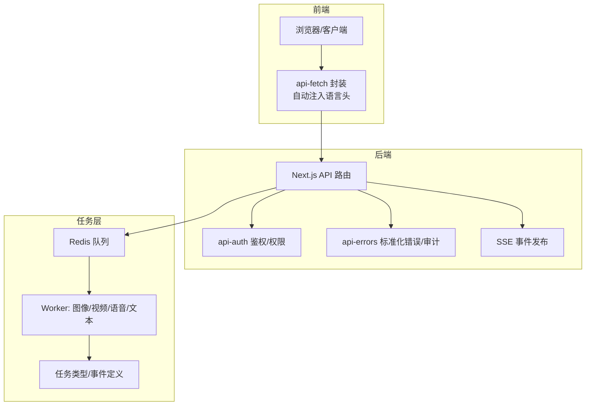
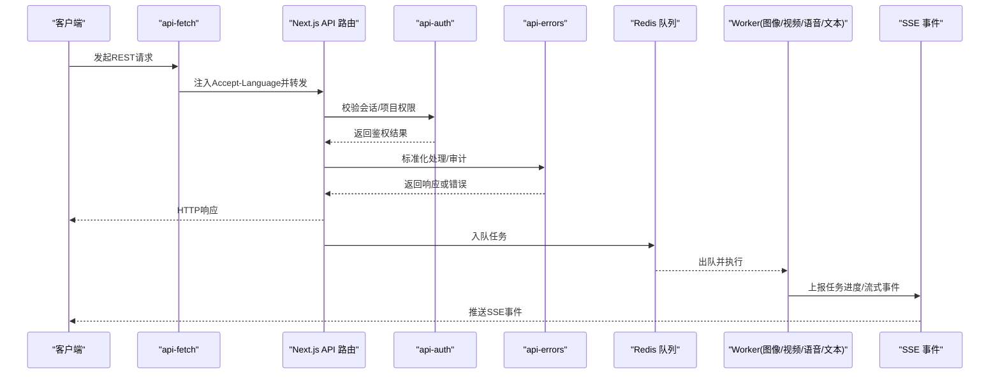
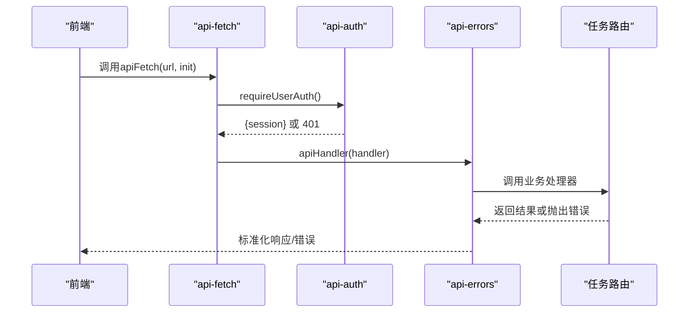
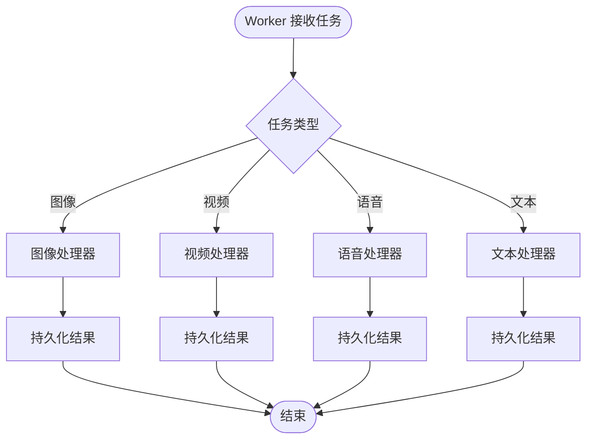
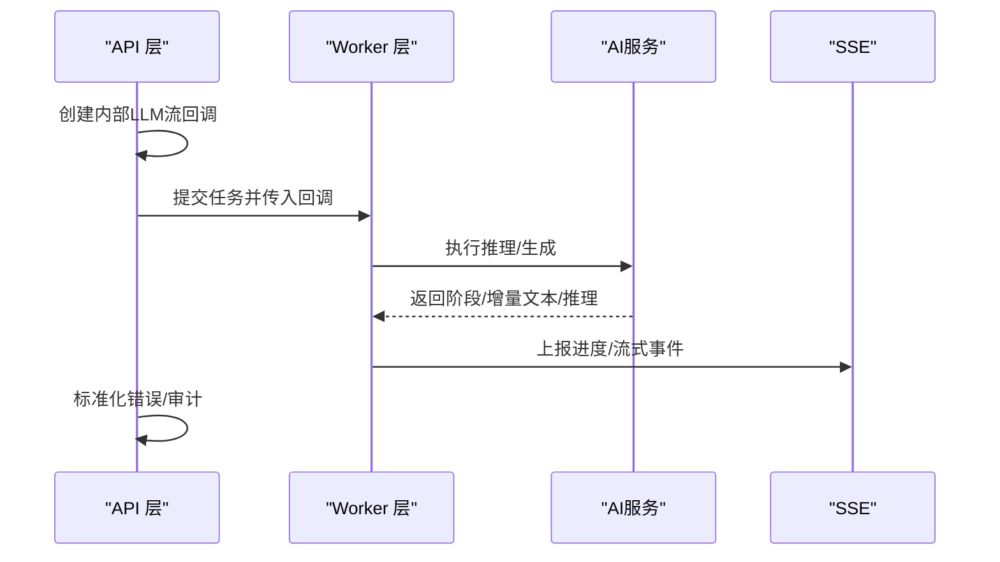
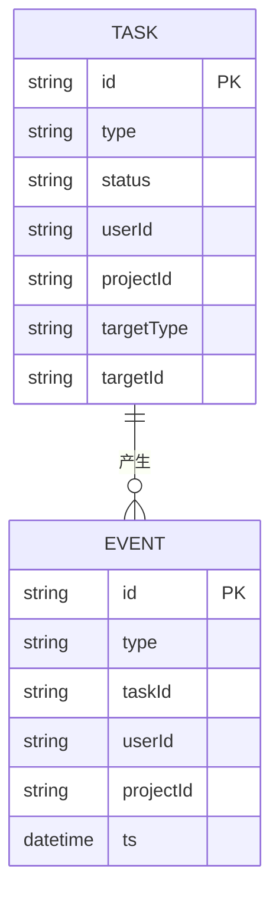
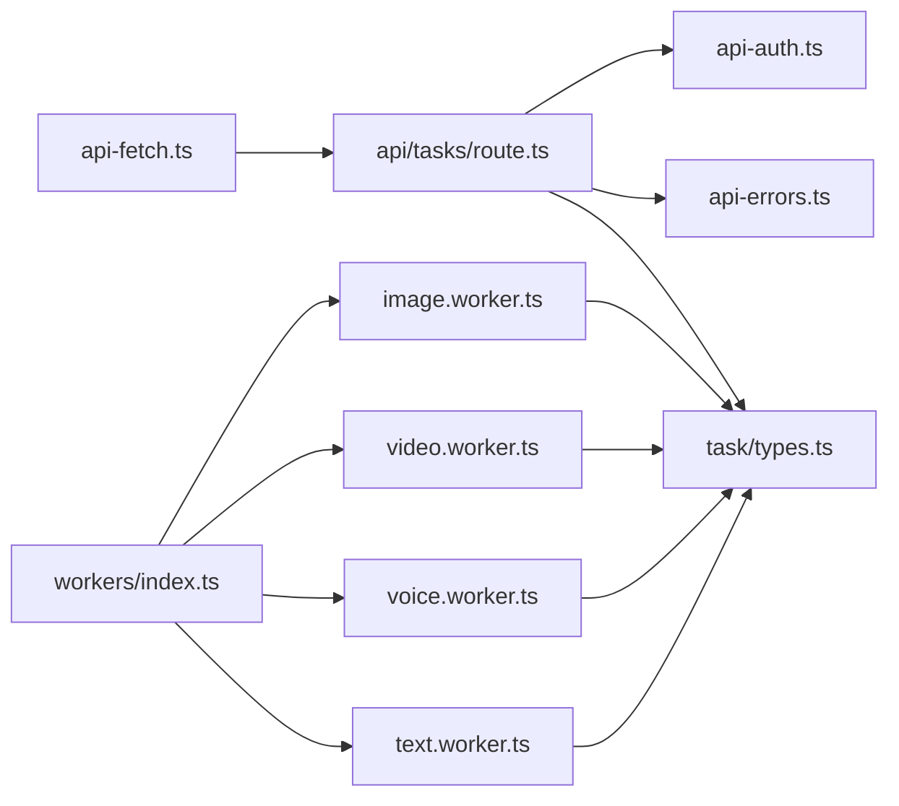

# 组件交互模式

<cite>
**本文引用的文件**
- [src/lib/api-fetch.ts](file://src/lib/api-fetch.ts)
- [src/lib/api-errors.ts](file://src/lib/api-errors.ts)
- [src/lib/api-auth.ts](file://src/lib/api-auth.ts)
- [src/app/api/tasks/route.ts](file://src/app/api/tasks/route.ts)
- [src/lib/task/types.ts](file://src/lib/task/types.ts)
- [src/lib/workers/index.ts](file://src/lib/workers/index.ts)
- [src/lib/workers/image.worker.ts](file://src/lib/workers/image.worker.ts)
- [src/lib/workers/video.worker.ts](file://src/lib/workers/video.worker.ts)
- [src/lib/workers/voice.worker.ts](file://src/lib/workers/voice.worker.ts)
- [src/lib/workers/text.worker.ts](file://src/lib/workers/text.worker.ts)
</cite>

## 目录
1. [简介](#简介)
2. [项目结构](#项目结构)
3. [核心组件](#核心组件)
4. [架构总览](#架构总览)
5. [详细组件分析](#详细组件分析)
6. [依赖关系分析](#依赖关系分析)
7. [性能考量](#性能考量)
8. [故障排查指南](#故障排查指南)
9. [结论](#结论)
10. [附录](#附录)

## 简介
本文件面向Waoowaoo项目，系统化梳理组件交互模式，重点覆盖以下方面：
- 前端与后端API的交互模式：RESTful请求、鉴权、错误标准化与审计
- WebSocket与SSE在任务进度与流式输出中的应用路径
- 任务队列中不同Worker之间的协作机制与并发控制
- AI服务集成的调用模式与错误处理策略
- 组件间依赖关系与解耦设计
- 典型业务场景下的组件协作流程与消息传递序列图

## 项目结构
Waoowaoo采用前后端分离的Next.js应用，结合服务端路由（App Router）与后台Worker（基于BullMQ）实现异步任务处理。前端通过统一的API封装进行HTTP请求；后端API路由负责鉴权、参数解析与错误标准化；任务通过Redis队列分发至对应Worker；Worker内部按任务类型执行具体逻辑，并上报进度事件。

图表来源
- [src/lib/api-fetch.ts:1-53](file://src/lib/api-fetch.ts#L1-L53)
- [src/lib/api-auth.ts:1-355](file://src/lib/api-auth.ts#L1-L355)
- [src/lib/api-errors.ts:1-571](file://src/lib/api-errors.ts#L1-L571)
- [src/app/api/tasks/route.ts:1-43](file://src/app/api/tasks/route.ts#L1-L43)
- [src/lib/task/types.ts:1-159](file://src/lib/task/types.ts#L1-L159)
- [src/lib/workers/index.ts:1-39](file://src/lib/workers/index.ts#L1-L39)
- [src/lib/workers/image.worker.ts:1-68](file://src/lib/workers/image.worker.ts#L1-L68)
- [src/lib/workers/video.worker.ts:1-324](file://src/lib/workers/video.worker.ts#L1-L324)
- [src/lib/workers/voice.worker.ts:1-64](file://src/lib/workers/voice.worker.ts#L1-L64)
- [src/lib/workers/text.worker.ts:1-715](file://src/lib/workers/text.worker.ts#L1-L715)

章节来源
- [src/lib/api-fetch.ts:1-53](file://src/lib/api-fetch.ts#L1-L53)
- [src/lib/api-auth.ts:1-355](file://src/lib/api-auth.ts#L1-L355)
- [src/lib/api-errors.ts:1-571](file://src/lib/api-errors.ts#L1-L571)
- [src/app/api/tasks/route.ts:1-43](file://src/app/api/tasks/route.ts#L1-L43)
- [src/lib/task/types.ts:1-159](file://src/lib/task/types.ts#L1-L159)
- [src/lib/workers/index.ts:1-39](file://src/lib/workers/index.ts#L1-L39)
- [src/lib/workers/image.worker.ts:1-68](file://src/lib/workers/image.worker.ts#L1-L68)
- [src/lib/workers/video.worker.ts:1-324](file://src/lib/workers/video.worker.ts#L1-L324)
- [src/lib/workers/voice.worker.ts:1-64](file://src/lib/workers/voice.worker.ts#L1-L64)
- [src/lib/workers/text.worker.ts:1-715](file://src/lib/workers/text.worker.ts#L1-L715)

## 核心组件
- API封装与请求头注入：自动从URL路径识别语言并注入Accept-Language，确保API路由能感知本地化需求。
- API错误标准化与审计：统一ApiError、错误码映射、审计日志与请求ID追踪，保障错误一致性与可观测性。
- 鉴权与权限：支持会话鉴权、内部任务令牌、项目所有权校验与可选关联数据加载。
- 任务类型与事件：定义任务状态、事件类型、SSE事件格式与任务生命周期。
- Worker启动与生命周期：集中注册图像/视频/语音/文本Worker，监听ready/error/failed并优雅关闭。
- Worker任务处理：按任务类型分派到具体处理器，内置并发门控与进度上报。

章节来源
- [src/lib/api-fetch.ts:1-53](file://src/lib/api-fetch.ts#L1-L53)
- [src/lib/api-errors.ts:1-571](file://src/lib/api-errors.ts#L1-L571)
- [src/lib/api-auth.ts:1-355](file://src/lib/api-auth.ts#L1-L355)
- [src/lib/task/types.ts:1-159](file://src/lib/task/types.ts#L1-L159)
- [src/lib/workers/index.ts:1-39](file://src/lib/workers/index.ts#L1-L39)

## 架构总览
下图展示了从前端到后端API、任务队列与Worker的整体交互链路，以及SSE事件的发布路径。

图表来源
- [src/lib/api-fetch.ts:1-53](file://src/lib/api-fetch.ts#L1-L53)
- [src/lib/api-auth.ts:1-355](file://src/lib/api-auth.ts#L1-L355)
- [src/lib/api-errors.ts:1-571](file://src/lib/api-errors.ts#L1-L571)
- [src/app/api/tasks/route.ts:1-43](file://src/app/api/tasks/route.ts#L1-L43)
- [src/lib/workers/index.ts:1-39](file://src/lib/workers/index.ts#L1-L39)
- [src/lib/workers/image.worker.ts:1-68](file://src/lib/workers/image.worker.ts#L1-L68)
- [src/lib/workers/video.worker.ts:1-324](file://src/lib/workers/video.worker.ts#L1-L324)
- [src/lib/workers/voice.worker.ts:1-64](file://src/lib/workers/voice.worker.ts#L1-L64)
- [src/lib/workers/text.worker.ts:1-715](file://src/lib/workers/text.worker.ts#L1-L715)

## 详细组件分析

### 前端与后端API交互模式
- RESTful请求：前端通过api-fetch封装发起请求，自动注入Accept-Language头，确保后端能根据路径判断是否需要注入语言头。
- 鉴权与权限：后端API路由通过requireUserAuth/requireProjectAuth等方法进行会话与项目权限校验，内部任务可通过专用令牌绕过部分校验。
- 错误标准化：统一ApiError与错误码映射，记录审计日志与请求ID，便于问题追踪。
- 审计与可观测性：对生成类操作进行审计标记，记录耗时与状态；内部LLM流回调支持细粒度进度上报。

图表来源
- [src/lib/api-fetch.ts:1-53](file://src/lib/api-fetch.ts#L1-L53)
- [src/lib/api-auth.ts:1-355](file://src/lib/api-auth.ts#L1-L355)
- [src/lib/api-errors.ts:1-571](file://src/lib/api-errors.ts#L1-L571)
- [src/app/api/tasks/route.ts:1-43](file://src/app/api/tasks/route.ts#L1-L43)

章节来源
- [src/lib/api-fetch.ts:1-53](file://src/lib/api-fetch.ts#L1-L53)
- [src/lib/api-auth.ts:1-355](file://src/lib/api-auth.ts#L1-L355)
- [src/lib/api-errors.ts:1-571](file://src/lib/api-errors.ts#L1-L571)
- [src/app/api/tasks/route.ts:1-43](file://src/app/api/tasks/route.ts#L1-L43)

### 任务队列与Worker协作机制
- Worker注册与生命周期：集中创建图像/视频/语音/文本Worker，监听ready/error/failed事件，并在进程退出信号时优雅关闭。
- 并发控制：每个Worker内部通过用户并发门控限制单用户在该Worker上的并发数，避免资源争用。
- 任务分派：Worker根据任务类型分派到对应处理器，如图像任务分派到面板/角色/场景等处理器；文本任务分派到故事板/剧本/语音分析等处理器；视频任务分派到视频生成与唇同步处理器；语音任务分派到语音生成与语音设计处理器。
- 进度上报：Worker在关键阶段上报进度事件，支持流式增量推送，最终完成时持久化结果。

图表来源
- [src/lib/workers/index.ts:1-39](file://src/lib/workers/index.ts#L1-L39)
- [src/lib/workers/image.worker.ts:1-68](file://src/lib/workers/image.worker.ts#L1-L68)
- [src/lib/workers/video.worker.ts:1-324](file://src/lib/workers/video.worker.ts#L1-L324)
- [src/lib/workers/voice.worker.ts:1-64](file://src/lib/workers/voice.worker.ts#L1-L64)
- [src/lib/workers/text.worker.ts:1-715](file://src/lib/workers/text.worker.ts#L1-L715)

章节来源
- [src/lib/workers/index.ts:1-39](file://src/lib/workers/index.ts#L1-L39)
- [src/lib/workers/image.worker.ts:1-68](file://src/lib/workers/image.worker.ts#L1-L68)
- [src/lib/workers/video.worker.ts:1-324](file://src/lib/workers/video.worker.ts#L1-L324)
- [src/lib/workers/voice.worker.ts:1-64](file://src/lib/workers/voice.worker.ts#L1-L64)
- [src/lib/workers/text.worker.ts:1-715](file://src/lib/workers/text.worker.ts#L1-L715)

### AI服务集成与错误处理
- 内部LLM流回调：API层与Worker层均提供内部LLM流回调接口，用于在任务执行过程中上报阶段、增量文本与推理内容，支持多步骤与多通道（主/推理）流式输出。
- 错误处理策略：统一ApiError，区分重试与不可重试错误，记录错误类别与用户提示键，便于前端展示与后续补偿。
- 任务审计：对生成类操作进行审计标记，记录耗时与状态，便于运营与排障。

图表来源
- [src/lib/api-errors.ts:1-571](file://src/lib/api-errors.ts#L1-L571)
- [src/lib/workers/text.worker.ts:1-715](file://src/lib/workers/text.worker.ts#L1-L715)

章节来源
- [src/lib/api-errors.ts:1-571](file://src/lib/api-errors.ts#L1-L571)
- [src/lib/workers/text.worker.ts:1-715](file://src/lib/workers/text.worker.ts#L1-L715)

### 任务类型与SSE事件模型
- 任务类型：涵盖图像/视频/语音/文本等多类任务，每类任务有明确的生命周期事件（created/processing/progress/completed/failed）。
- SSE事件：任务生命周期事件与流式事件通过SSE发布，客户端可订阅任务ID或用户ID维度的事件流，实时接收进度与结果。

图表来源
- [src/lib/task/types.ts:1-159](file://src/lib/task/types.ts#L1-L159)

章节来源
- [src/lib/task/types.ts:1-159](file://src/lib/task/types.ts#L1-L159)

## 依赖关系分析
- 前端依赖api-fetch进行HTTP请求与语言头注入，后端依赖api-auth与api-errors进行鉴权与错误标准化。
- API路由依赖任务查询与任务类型定义，向客户端返回任务列表与错误信息。
- Worker依赖任务类型定义与并发门控，按任务类型分派到具体处理器，并通过SSE上报进度。
- 任务类型定义贯穿API与Worker，作为事件与生命周期的契约。

图表来源
- [src/lib/api-fetch.ts:1-53](file://src/lib/api-fetch.ts#L1-L53)
- [src/app/api/tasks/route.ts:1-43](file://src/app/api/tasks/route.ts#L1-L43)
- [src/lib/api-auth.ts:1-355](file://src/lib/api-auth.ts#L1-L355)
- [src/lib/api-errors.ts:1-571](file://src/lib/api-errors.ts#L1-L571)
- [src/lib/task/types.ts:1-159](file://src/lib/task/types.ts#L1-L159)
- [src/lib/workers/index.ts:1-39](file://src/lib/workers/index.ts#L1-L39)
- [src/lib/workers/image.worker.ts:1-68](file://src/lib/workers/image.worker.ts#L1-L68)
- [src/lib/workers/video.worker.ts:1-324](file://src/lib/workers/video.worker.ts#L1-L324)
- [src/lib/workers/voice.worker.ts:1-64](file://src/lib/workers/voice.worker.ts#L1-L64)
- [src/lib/workers/text.worker.ts:1-715](file://src/lib/workers/text.worker.ts#L1-L715)

章节来源
- [src/lib/api-fetch.ts:1-53](file://src/lib/api-fetch.ts#L1-L53)
- [src/app/api/tasks/route.ts:1-43](file://src/app/api/tasks/route.ts#L1-L43)
- [src/lib/api-auth.ts:1-355](file://src/lib/api-auth.ts#L1-L355)
- [src/lib/api-errors.ts:1-571](file://src/lib/api-errors.ts#L1-L571)
- [src/lib/task/types.ts:1-159](file://src/lib/task/types.ts#L1-L159)
- [src/lib/workers/index.ts:1-39](file://src/lib/workers/index.ts#L1-L39)
- [src/lib/workers/image.worker.ts:1-68](file://src/lib/workers/image.worker.ts#L1-L68)
- [src/lib/workers/video.worker.ts:1-324](file://src/lib/workers/video.worker.ts#L1-L324)
- [src/lib/workers/voice.worker.ts:1-64](file://src/lib/workers/voice.worker.ts#L1-L64)
- [src/lib/workers/text.worker.ts:1-715](file://src/lib/workers/text.worker.ts#L1-L715)

## 性能考量
- 并发控制：Worker内按用户维度设置并发上限，避免单用户过度占用资源；可根据环境变量调整每类Worker的并发度。
- 流式输出：内部LLM流回调将长文本拆分为固定大小的块，减少一次性推送压力，提升前端渲染与网络传输效率。
- 任务审计：对生成类操作进行审计，便于定位热点任务与异常峰值，指导容量规划与优化。
- 缓存与预取：图像/视频等媒体在生成前进行签名URL转换与必要头部注入，减少外部下载失败风险。

## 故障排查指南
- 请求ID与错误码：所有API响应包含统一的请求ID与错误码，前端可据此定位问题并回溯日志。
- 错误分类与重试：ApiError区分可重试与不可重试错误，前端可依据retryable字段决定是否重试。
- Worker错误上报：Worker监听error/failed事件，记录任务ID、类型与错误详情，便于定位失败原因。
- SSE订阅：确认SSE事件订阅参数（任务ID/用户ID/项目ID）正确，关注事件类型与payload结构。

章节来源
- [src/lib/api-errors.ts:1-571](file://src/lib/api-errors.ts#L1-L571)
- [src/lib/workers/index.ts:1-39](file://src/lib/workers/index.ts#L1-L39)

## 结论
Waoowaoo通过统一的API封装、鉴权与错误标准化，构建了清晰的前后端交互边界；借助任务队列与Worker机制，实现了高并发、可扩展的任务处理能力；内部LLM流回调与SSE事件使任务进度可视化与可观测性得到保障。整体设计强调解耦与契约（任务类型定义），便于未来扩展新的任务类型与Worker。

## 附录
- 典型业务场景建议：
  - 图像生成：前端提交任务 → API入队 → Worker处理 → SSE推送进度 → 客户端更新UI。
  - 视频生成与唇同步：Worker拉取媒体与音频 → 调用外部视频生成/唇同步服务 → 上传结果 → 更新数据库。
  - 文本工作流：Worker按阶段执行LLM推理 → 流式上报 → 最终持久化结果。
- WebSocket与SSE：当前实现以SSE为主，若需双向交互可评估引入WebSocket，但需在鉴权与幂等性上加强约束。