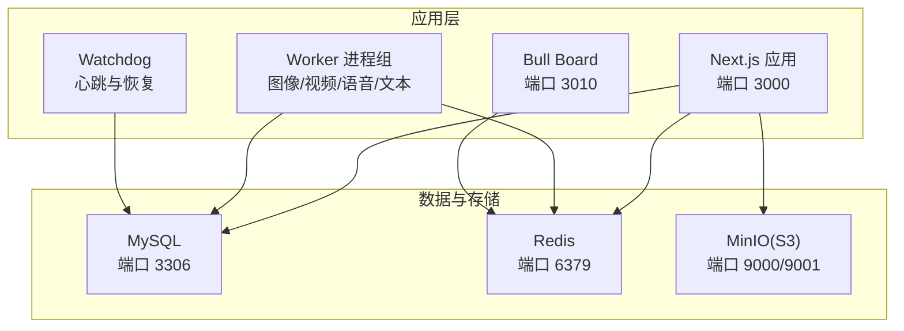
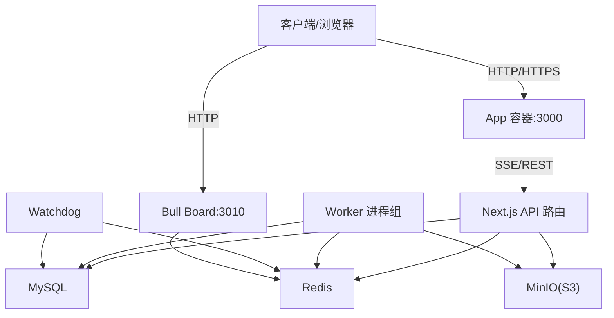
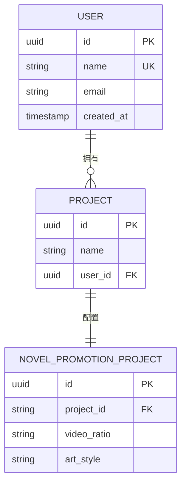
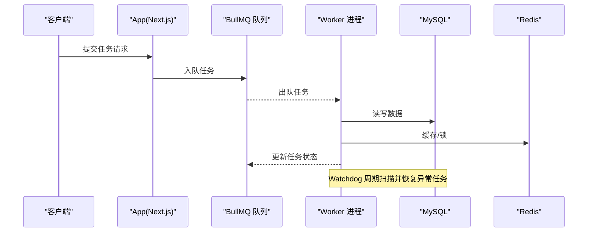
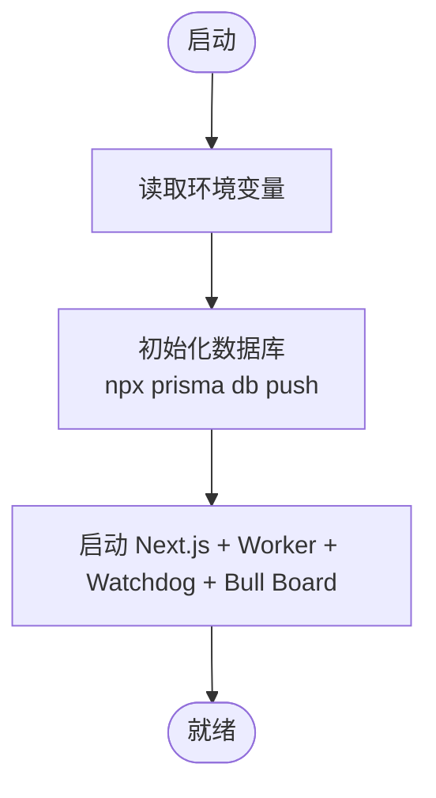
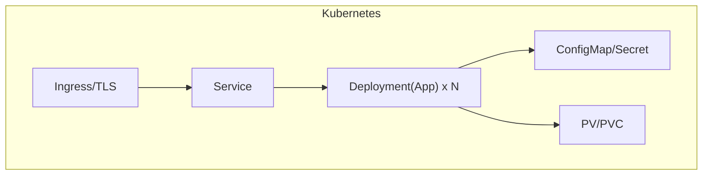

# 部署拓扑

<cite>
**本文引用的文件**
- [Dockerfile](file://Dockerfile)
- [docker-compose.yml](file://docker-compose.yml)
- [docker-compose.test.yml](file://docker-compose.test.yml)
- [.github/workflows/docker-publish.yml](file://.github/workflows/docker-publish.yml)
- [package.json](file://package.json)
- [prisma/schema.prisma](file://prisma/schema.prisma)
- [src/lib/env.ts](file://src/lib/env.ts)
- [src/lib/config-service.ts](file://src/lib/config-service.ts)
- [src/lib/storage/init.ts](file://src/lib/storage/init.ts)
- [src/lib/storage/bootstrap.ts](file://src/lib/storage/bootstrap.ts)
- [src/lib/workers/index.ts](file://src/lib/workers/index.ts)
- [scripts/watchdog.ts](file://scripts/watchdog.ts)
- [scripts/bull-board.ts](file://scripts/bull-board.ts)
</cite>

## 目录
1. [简介](#简介)
2. [项目结构](#项目结构)
3. [核心组件](#核心组件)
4. [架构总览](#架构总览)
5. [详细组件分析](#详细组件分析)
6. [依赖分析](#依赖分析)
7. [性能考虑](#性能考虑)
8. [故障排查指南](#故障排查指南)
9. [结论](#结论)
10. [附录](#附录)

## 简介
本文件面向 Waoowaoo 项目的运维与平台工程团队，提供系统化的部署拓扑文档。内容涵盖：
- 部署架构与基础设施要求
- 容器化与编排方案（Docker 与 docker-compose）
- 微服务拆分与负载均衡策略
- 存储架构（数据库、对象存储、缓存）
- 监控与日志采集
- CI/CD 流水线与自动化部署
- 环境配置示例（开发、测试、生产）

## 项目结构
Waoowaoo 采用单体 Web 应用 + 多后台进程（Worker、Watchdog、队列可视化）的混合架构：
- 前端框架：Next.js（SSR/静态导出）
- 后端服务：Next.js API 路由与后台任务处理
- 数据持久化：MySQL（Prisma ORM）
- 缓存与队列：Redis（BullMQ 队列）
- 对象存储：MinIO（S3 兼容）
- 后台守护：Watchdog（任务健康检查与恢复）、Bull Board（队列可视化）
- 部署：Docker 单容器镜像 + docker-compose 编排；GitHub Actions 自动化镜像推送

图表来源
- [docker-compose.yml:1-153](file://docker-compose.yml#L1-L153)
- [Dockerfile:1-61](file://Dockerfile#L1-L61)

章节来源
- [Dockerfile:1-61](file://Dockerfile#L1-L61)
- [docker-compose.yml:1-153](file://docker-compose.yml#L1-L153)
- [package.json:9-25](file://package.json#L9-L25)

## 核心组件
- 应用容器（App）
  - 运行时：Node.js 20 Alpine
  - 端口：3000（Web）、3010（Bull Board）
  - 启动命令：启动 Next.js、Worker、Watchdog、Bull Board，并在启动前执行数据库迁移
- 数据库（MySQL）
  - 版本：8.0
  - 健康检查：基于 mysqladmin ping
- 缓存（Redis）
  - 版本：7-alpine
  - 健康检查：基于 redis-cli ping
- 对象存储（MinIO）
  - 版本：RELEASE.xxxx
  - 控制台端口：9001
  - 健康检查：基于 /minio/health/live
- 队列与任务
  - BullMQ 队列（图像/视频/语音/文本）
  - Bull Board 可视化
  - Watchdog 定时扫描与恢复任务

章节来源
- [docker-compose.yml:63-147](file://docker-compose.yml#L63-L147)
- [src/lib/workers/index.ts:1-39](file://src/lib/workers/index.ts#L1-L39)
- [scripts/bull-board.ts:1-106](file://scripts/bull-board.ts#L1-L106)
- [scripts/watchdog.ts:1-226](file://scripts/watchdog.ts#L1-L226)

## 架构总览
下图展示了容器间的依赖关系与通信路径，以及外部访问入口。

图表来源
- [docker-compose.yml:63-147](file://docker-compose.yml#L63-L147)
- [src/lib/workers/index.ts:1-39](file://src/lib/workers/index.ts#L1-L39)
- [scripts/bull-board.ts:1-106](file://scripts/bull-board.ts#L1-L106)
- [scripts/watchdog.ts:1-226](file://scripts/watchdog.ts#L1-L226)

## 详细组件分析

### 容器化与编排
- Dockerfile
  - 多阶段构建：依赖安装、构建产物、运行时
  - 运行时环境：NODE_ENV=production，安装 tini 提升信号处理
  - 暴露端口：3000（Web）、3010（Bull Board）
  - 入口命令：/sbin/tini -- npm run start
- docker-compose
  - 服务编排：mysql、redis、minio、app
  - 环境变量集中注入（数据库、缓存、存储、认证、内部地址、队列并发、日志、计费等）
  - 健康检查：mysql、redis、minio
  - 端口映射：13000:3000、13010:3010（便于宿主机访问）
  - 启动顺序：等待 mysql/redis/minio 就绪后再启动应用
  - 数据卷：mysql_data、redis_data、minio_data
- docker-compose.test.yml
  - 用于测试环境的最小化编排（mysql、redis）

章节来源
- [Dockerfile:1-61](file://Dockerfile#L1-L61)
- [docker-compose.yml:1-153](file://docker-compose.yml#L1-L153)
- [docker-compose.test.yml:1-33](file://docker-compose.test.yml#L1-L33)

### 微服务与负载均衡
- 当前为单体应用容器，未见独立微服务拆分
- 负载均衡建议
  - 外部：反向代理（Nginx/Caddy/Traefik）或云厂商 LB
  - 内部：同一服务多副本横向扩展（需配合 Kubernetes）
- 服务发现与健康检查
  - 使用 compose 健康检查（mysql/redis/minio）
  - 应用侧可增加 HTTP 健康端点（建议）

章节来源
- [docker-compose.yml:18-23](file://docker-compose.yml#L18-L23)
- [docker-compose.yml:35-40](file://docker-compose.yml#L35-L40)
- [docker-compose.yml:56-61](file://docker-compose.yml#L56-L61)

### 存储架构
- 数据库（MySQL）
  - Prisma 数据源配置使用 DATABASE_URL 环境变量
  - 初始化：docker-compose 启动时执行 npx prisma db push
- 缓存（Redis）
  - 作为 BullMQ 队列后端
  - 环境变量：REDIS_HOST、REDIS_PORT、REDIS_USERNAME、REDIS_PASSWORD、REDIS_TLS
- 对象存储（MinIO）
  - S3 兼容接口，桶名称通过 MINIO_BUCKET 指定
  - 启动时自动校验/创建桶
  - 环境变量：MINIO_ENDPOINT、MINIO_REGION、MINIO_ACCESS_KEY、MINIO_SECRET_KEY、MINIO_FORCE_PATH_STYLE

图表来源
- [prisma/schema.prisma:402-429](file://prisma/schema.prisma#L402-L429)
- [prisma/schema.prisma:244-274](file://prisma/schema.prisma#L244-L274)

章节来源
- [prisma/schema.prisma:5-8](file://prisma/schema.prisma#L5-L8)
- [docker-compose.yml:68-84](file://docker-compose.yml#L68-L84)
- [src/lib/storage/bootstrap.ts:35-74](file://src/lib/storage/bootstrap.ts#L35-L74)
- [src/lib/storage/init.ts:1-25](file://src/lib/storage/init.ts#L1-L25)

### 队列与任务处理
- 队列类型：图像、视频、语音、文本（BullMQ）
- Worker 进程：统一启动，监听队列并处理任务
- Watchdog：周期性扫描数据库中的任务状态，恢复“卡死”或“丢失心跳”的任务
- Bull Board：提供队列可视化与管理界面，支持基础鉴权

图表来源
- [src/lib/workers/index.ts:1-39](file://src/lib/workers/index.ts#L1-L39)
- [scripts/watchdog.ts:35-126](file://scripts/watchdog.ts#L35-L126)
- [scripts/bull-board.ts:60-71](file://scripts/bull-board.ts#L60-L71)

章节来源
- [src/lib/workers/index.ts:1-39](file://src/lib/workers/index.ts#L1-L39)
- [scripts/watchdog.ts:1-226](file://scripts/watchdog.ts#L1-L226)
- [scripts/bull-board.ts:1-106](file://scripts/bull-board.ts#L1-L106)

### 监控与日志
- 日志配置
  - 统一开关：LOG_UNIFIED_ENABLED
  - 级别：LOG_LEVEL（INFO/DEBUG 等）
  - 格式：LOG_FORMAT（json）
  - 审计：LOG_AUDIT_ENABLED
  - 敏感信息脱敏：LOG_REDACT_KEYS
  - 服务名：LOG_SERVICE
- 日志输出
  - 容器内日志目录：/app/logs
  - docker-compose 映射到 ./docker-logs
- 建议
  - 结合宿主机日志收集（如 Fluent Bit/Filebeat）与集中式日志平台（如 ELK/Cloud Logging）
  - 在生产环境启用更细粒度的采样与脱敏策略

章节来源
- [docker-compose.yml:107-114](file://docker-compose.yml#L107-L114)
- [docker-compose.yml:122-124](file://docker-compose.yml#L122-L124)

### CI/CD 与自动化部署
- GitHub Actions 工作流
  - 触发：推送到 main 或打标签（v*）
  - 步骤：登录 GHCR、提取元数据、构建多平台镜像、推送
  - 缓存：GitHub Actions 缓存
- 镜像版本
  - 默认分支：latest
  - 语义化版本：semver
  - SHA 前缀标签
- 部署建议
  - 本地/测试：docker-compose
  - 生产：Kubernetes（见后续 Kubernetes 部署建议）

章节来源
- [.github/workflows/docker-publish.yml:1-56](file://.github/workflows/docker-publish.yml#L1-L56)

## 依赖分析
- 运行时依赖
  - Node.js 20（镜像基于 node:20-alpine）
  - Next.js（SSR/静态导出）
  - BullMQ（队列）
  - Prisma（ORM）
  - ioredis（Redis 客户端）
  - @aws-sdk/client-s3（MinIO/S3）
- 环境变量耦合
  - 数据库：DATABASE_URL
  - 缓存：REDIS_HOST、REDIS_PORT、REDIS_USERNAME、REDIS_PASSWORD、REDIS_TLS
  - 存储：STORAGE_TYPE、MINIO_*、MINIO_REGION、MINIO_FORCE_PATH_STYLE
  - 认证：NEXTAUTH_URL、NEXTAUTH_SECRET
  - 内部调用：INTERNAL_APP_URL、INTERNAL_TASK_API_BASE_URL
  - 队列并发：QUEUE_CONCURRENCY_IMAGE、QUEUE_CONCURRENCY_VIDEO、QUEUE_CONCURRENCY_VOICE、QUEUE_CONCURRENCY_TEXT
  - 日志：LOG_UNIFIED_ENABLED、LOG_LEVEL、LOG_FORMAT、LOG_AUDIT_ENABLED、LOG_REDACT_KEYS、LOG_SERVICE
  - 计费：BILLING_MODE
  - 流式：LLM_STREAM_EPHEMERAL_ENABLED

图表来源
- [docker-compose.yml:132-147](file://docker-compose.yml#L132-L147)
- [package.json:20-25](file://package.json#L20-L25)

章节来源
- [package.json:112-162](file://package.json#L112-L162)
- [docker-compose.yml:68-118](file://docker-compose.yml#L68-L118)

## 性能考虑
- 队列并发
  - 图像/视频/语音/文本分别配置并发上限，按资源占用调整
- 缓存命中
  - 利用 Redis 缓存热点数据与锁，降低数据库压力
- 对象存储
  - MinIO 使用路径风格访问（FORCE_PATH_STYLE），确保兼容性
- 数据库
  - 合理索引与查询优化，避免长事务
- 日志
  - 生产环境建议关闭 DEBUG，减少 IO 压力

## 故障排查指南
- 常见问题定位
  - 数据库不可达：检查 DATABASE_URL 与网络连通
  - 队列堆积：查看 Bull Board，确认 Worker 是否正常消费
  - 任务长时间无心跳：Watchdog 会将任务重置为 queued 并重新入队
  - 对象存储桶不存在：启动时自动创建，若失败检查 MINIO_* 配置
- 日志位置
  - 容器内：/app/logs
  - docker-compose：./docker-logs
- 健康检查
  - mysql/redis/minio 健康检查失败时，优先检查容器日志与端口占用

章节来源
- [docker-compose.yml:18-23](file://docker-compose.yml#L18-L23)
- [docker-compose.yml:35-40](file://docker-compose.yml#L35-L40)
- [docker-compose.yml:56-61](file://docker-compose.yml#L56-L61)
- [scripts/watchdog.ts:128-185](file://scripts/watchdog.ts#L128-L185)
- [src/lib/storage/bootstrap.ts:35-74](file://src/lib/storage/bootstrap.ts#L35-L74)

## 结论
Waoowaoo 当前采用单体容器 + docker-compose 的快速部署方案，具备良好的可移植性与可观测性。建议在生产环境中引入 Kubernetes 实现弹性扩缩容与滚动更新，并结合反向代理实现 TLS 终止与负载均衡。同时完善监控告警与日志体系，持续优化队列并发与缓存策略以提升吞吐与稳定性。

## 附录

### 环境配置示例（开发/测试/生产）
- 开发环境（本地）
  - 使用 docker-compose.yml 启动
  - 端口映射：13000:3000、13010:3010
  - NEXTAUTH_URL 指向 http://localhost:13000
  - INTERNAL_APP_URL 指向 http://127.0.0.1:3000
- 测试环境
  - 使用 docker-compose.test.yml 启动 mysql 与 redis
  - 数据库名：waoowaoo_test
- 生产环境（建议）
  - 使用 Kubernetes 部署（见下节）
  - 使用外部托管 MySQL/Redis/MinIO
  - 反向代理 + TLS 终止
  - 健康检查与就绪探针
  - 资源限制与自动扩缩容

### Kubernetes 部署建议（概念性）
- Deployment
  - 单容器：App（Next.js + Worker + Watchdog + Bull Board）
  - 副本数：≥2（结合 PodDisruptionBudget）
- Service
  - ClusterIP：内部 API
  - LoadBalancer/Ingress：对外暴露
- ConfigMap/Secret
  - 环境变量集中管理（DATABASE_URL、REDIS_*、MINIO_*、NEXTAUTH_* 等）
- PersistentVolume
  - mysql_data、redis_data、minio_data（建议使用云盘或对象存储）
- HPA/VPA
  - CPU/内存自动扩缩容
- Ingress
  - TLS 终止、路径路由、限流与健康检查

[本图为概念性示意，不直接映射具体源文件，故无图表来源]