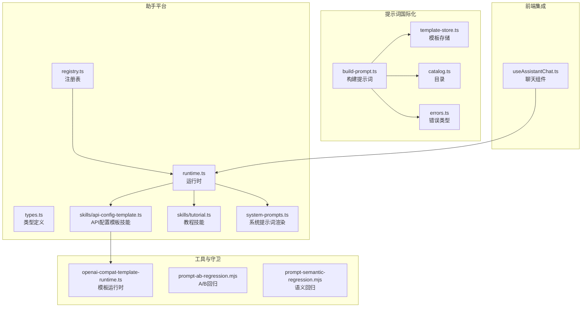
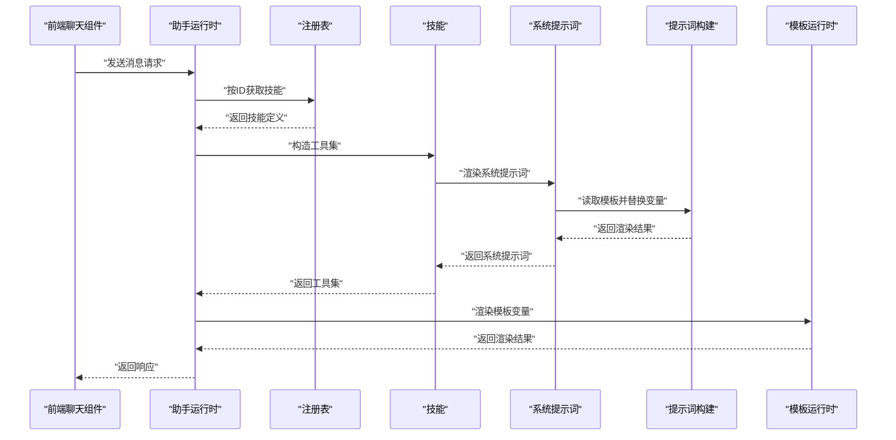
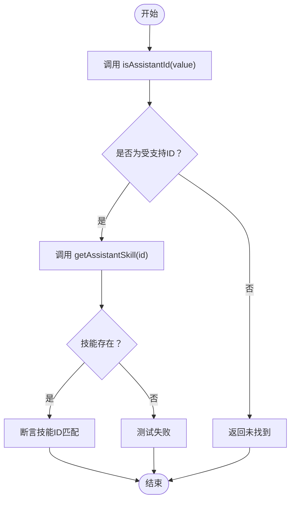
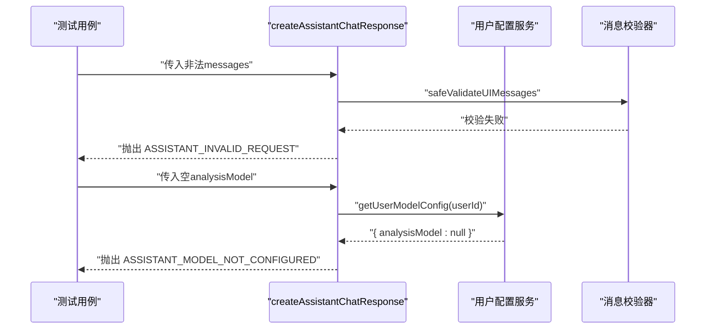
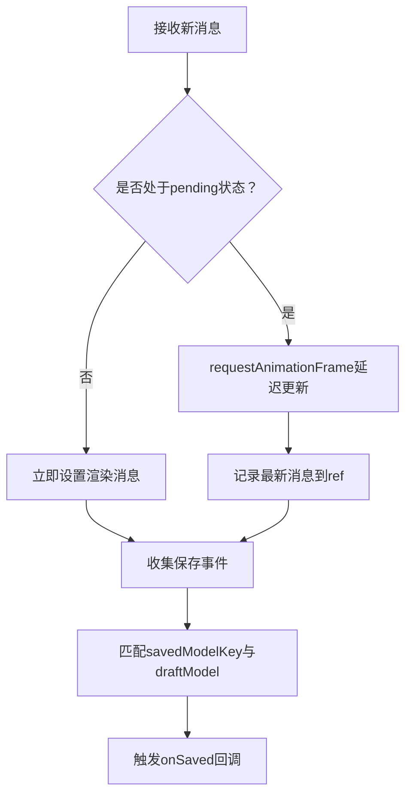
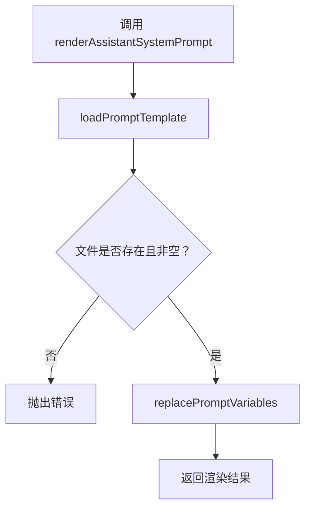
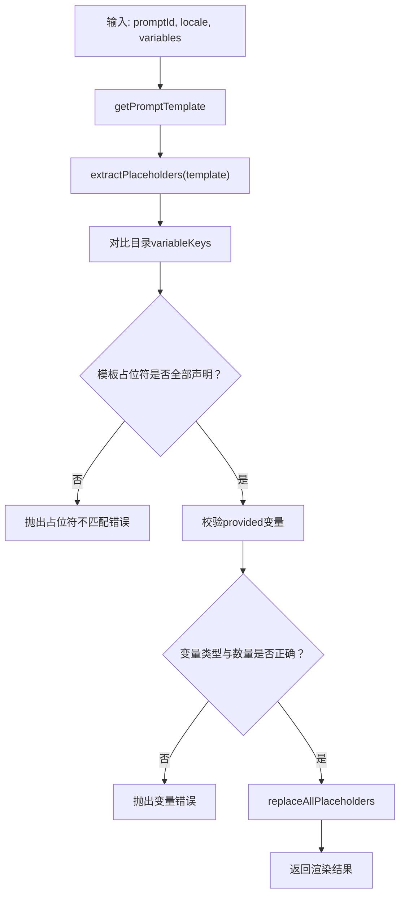
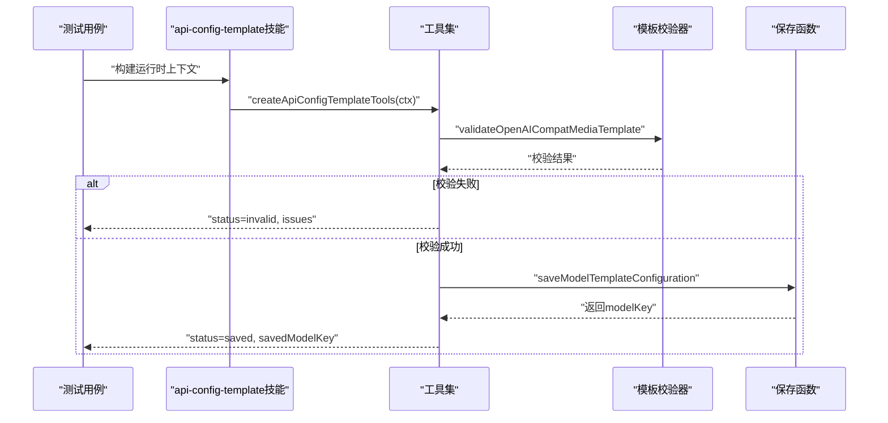
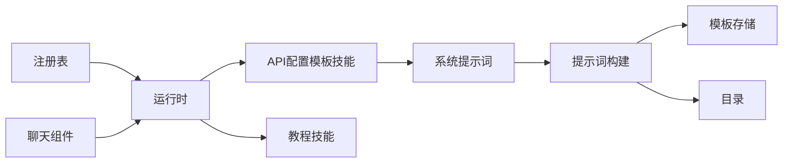

# AI助手平台测试

<cite>
**本文档引用的文件**
- [tests/unit/assistant-platform/registry.test.ts](file://tests/unit/assistant-platform/registry.test.ts)
- [src/lib/assistant-platform/registry.ts](file://src/lib/assistant-platform/registry.ts)
- [src/lib/assistant-platform/types.ts](file://src/lib/assistant-platform/types.ts)
- [src/lib/assistant-platform/runtime.ts](file://src/lib/assistant-platform/runtime.ts)
- [tests/unit/assistant-platform/runtime.test.ts](file://tests/unit/assistant-platform/runtime.test.ts)
- [src/lib/assistant-platform/skills/api-config-template.ts](file://src/lib/assistant-platform/skills/api-config-template.ts)
- [tests/unit/assistant-platform/skills-api-config-template.test.ts](file://tests/unit/assistant-platform/skills-api-config-template.test.ts)
- [src/lib/assistant-platform/skills/tutorial.ts](file://src/lib/assistant-platform/skills/tutorial.ts)
- [src/lib/assistant-platform/system-prompts.ts](file://src/lib/assistant-platform/system-prompts.ts)
- [tests/unit/assistant-platform/system-prompts.test.ts](file://tests/unit/assistant-platform/system-prompts.test.ts)
- [src/lib/prompt-i18n/build-prompt.ts](file://src/lib/prompt-i18n/build-prompt.ts)
- [src/lib/prompt-i18n/template-store.ts](file://src/lib/prompt-i18n/template-store.ts)
- [src/lib/prompt-i18n/catalog.ts](file://src/lib/prompt-i18n/catalog.ts)
- [src/lib/prompt-i18n/errors.ts](file://src/lib/prompt-i18n/errors.ts)
- [scripts/guards/prompt-ab-regression.mjs](file://scripts/guards/prompt-ab-regression.mjs)
- [scripts/guards/prompt-semantic-regression.mjs](file://scripts/guards/prompt-semantic-regression.mjs)
- [src/lib/openai-compat-template-runtime.ts](file://src/lib/openai-compat-template-runtime.ts)
- [src/components/assistant/useAssistantChat.ts](file://src/components/assistant/useAssistantChat.ts)
- [tests/unit/workflow-engine/registry.test.ts](file://tests/unit/workflow-engine/registry.test.ts)
- [tests/contracts/behavior-test-standard.md](file://tests/contracts/behavior-test-standard.md)
</cite>

## 目录
1. [简介](#简介)
2. [项目结构](#项目结构)
3. [核心组件](#核心组件)
4. [架构总览](#架构总览)
5. [详细组件分析](#详细组件分析)
6. [依赖关系分析](#依赖关系分析)
7. [性能考虑](#性能考虑)
8. [故障排查指南](#故障排查指南)
9. [结论](#结论)
10. [附录](#附录)

## 简介
本文件面向AI助手平台的单元测试，系统性梳理以下主题：
- 助手注册表的测试策略：技能注册、依赖管理与生命周期验证
- 助手运行时的测试方法：对话状态管理、上下文保持与多轮交互
- 系统提示词的测试策略：模板渲染、变量替换与内容验证
- 助手技能API配置模板的测试用例：配置验证、动态加载与错误处理

目标是帮助开发者快速理解测试覆盖范围、编写高质量的单元测试，并确保关键业务逻辑的稳定性。

## 项目结构
围绕测试目标，相关代码主要分布在以下模块：
- 助手平台核心：注册表、类型定义、运行时、技能与系统提示词
- 提示词国际化：模板解析、目录与缓存、错误类型
- 工具与守卫：OpenAI兼容模板运行时、提示词回归检查脚本
- 前端集成：聊天组件的状态管理与事件收集
- 测试用例：覆盖上述功能点的单元测试

**图表来源**
- [src/lib/assistant-platform/registry.ts:1-16](file://src/lib/assistant-platform/registry.ts#L1-L16)
- [src/lib/assistant-platform/runtime.ts:77-113](file://src/lib/assistant-platform/runtime.ts#L77-L113)
- [src/lib/assistant-platform/skills/api-config-template.ts:1-250](file://src/lib/assistant-platform/skills/api-config-template.ts#L1-L250)
- [src/lib/assistant-platform/skills/tutorial.ts:1-14](file://src/lib/assistant-platform/skills/tutorial.ts#L1-L14)
- [src/lib/assistant-platform/system-prompts.ts:1-46](file://src/lib/assistant-platform/system-prompts.ts#L1-L46)
- [src/lib/prompt-i18n/build-prompt.ts:1-98](file://src/lib/prompt-i18n/build-prompt.ts#L1-L98)
- [src/lib/prompt-i18n/template-store.ts:1-44](file://src/lib/prompt-i18n/template-store.ts#L1-L44)
- [src/lib/prompt-i18n/catalog.ts:1-157](file://src/lib/prompt-i18n/catalog.ts#L1-L157)
- [src/lib/prompt-i18n/errors.ts:1-28](file://src/lib/prompt-i18n/errors.ts#L1-L28)
- [src/lib/openai-compat-template-runtime.ts:37-317](file://src/lib/openai-compat-template-runtime.ts#L37-L317)
- [src/components/assistant/useAssistantChat.ts:128-169](file://src/components/assistant/useAssistantChat.ts#L128-L169)

**章节来源**
- [src/lib/assistant-platform/registry.ts:1-16](file://src/lib/assistant-platform/registry.ts#L1-L16)
- [src/lib/assistant-platform/types.ts:1-59](file://src/lib/assistant-platform/types.ts#L1-L59)
- [src/lib/assistant-platform/runtime.ts:77-113](file://src/lib/assistant-platform/runtime.ts#L77-L113)
- [src/lib/assistant-platform/skills/api-config-template.ts:1-250](file://src/lib/assistant-platform/skills/api-config-template.ts#L1-L250)
- [src/lib/assistant-platform/skills/tutorial.ts:1-14](file://src/lib/assistant-platform/skills/tutorial.ts#L1-L14)
- [src/lib/assistant-platform/system-prompts.ts:1-46](file://src/lib/assistant-platform/system-prompts.ts#L1-L46)
- [src/lib/prompt-i18n/build-prompt.ts:1-98](file://src/lib/prompt-i18n/build-prompt.ts#L1-L98)
- [src/lib/prompt-i18n/template-store.ts:1-44](file://src/lib/prompt-i18n/template-store.ts#L1-L44)
- [src/lib/prompt-i18n/catalog.ts:1-157](file://src/lib/prompt-i18n/catalog.ts#L1-L157)
- [src/lib/prompt-i18n/errors.ts:1-28](file://src/lib/prompt-i18n/errors.ts#L1-L28)
- [src/lib/openai-compat-template-runtime.ts:37-317](file://src/lib/openai-compat-template-runtime.ts#L37-L317)
- [src/components/assistant/useAssistantChat.ts:128-169](file://src/components/assistant/useAssistantChat.ts#L128-L169)

## 核心组件
- 注册表：集中管理助手技能，提供ID识别与技能检索能力
- 运行时：负责请求校验、上下文归一化、模型解析与工具集装配
- 技能：包含系统提示词与工具集（如API配置模板技能）
- 系统提示词：从文件加载模板并进行变量替换
- 提示词国际化：模板解析、占位符校验与错误分类
- 前端聊天组件：维护消息状态、上下文传递与事件收集

**章节来源**
- [src/lib/assistant-platform/registry.ts:1-16](file://src/lib/assistant-platform/registry.ts#L1-L16)
- [src/lib/assistant-platform/runtime.ts:77-113](file://src/lib/assistant-platform/runtime.ts#L77-L113)
- [src/lib/assistant-platform/skills/api-config-template.ts:50-54](file://src/lib/assistant-platform/skills/api-config-template.ts#L50-L54)
- [src/lib/assistant-platform/system-prompts.ts:39-46](file://src/lib/assistant-platform/system-prompts.ts#L39-L46)
- [src/lib/prompt-i18n/build-prompt.ts:34-98](file://src/lib/prompt-i18n/build-prompt.ts#L34-L98)

## 架构总览
下图展示从UI到运行时再到技能与工具的调用链路，以及提示词构建与模板运行时的关系。

**图表来源**
- [src/components/assistant/useAssistantChat.ts:128-169](file://src/components/assistant/useAssistantChat.ts#L128-L169)
- [src/lib/assistant-platform/runtime.ts:77-113](file://src/lib/assistant-platform/runtime.ts#L77-L113)
- [src/lib/assistant-platform/registry.ts:10-12](file://src/lib/assistant-platform/registry.ts#L10-L12)
- [src/lib/assistant-platform/skills/api-config-template.ts:50-54](file://src/lib/assistant-platform/skills/api-config-template.ts#L50-L54)
- [src/lib/assistant-platform/system-prompts.ts:39-46](file://src/lib/assistant-platform/system-prompts.ts#L39-L46)
- [src/lib/prompt-i18n/build-prompt.ts:34-98](file://src/lib/prompt-i18n/build-prompt.ts#L34-L98)
- [src/lib/openai-compat-template-runtime.ts:287-308](file://src/lib/openai-compat-template-runtime.ts#L287-L308)

## 详细组件分析

### 助手注册表测试策略
- 覆盖点
  - ID识别：支持的ID应返回true，未知ID返回false
  - 技能检索：通过ID能正确返回技能定义
- 测试方法
  - 使用断言验证isAssistantId与getAssistantSkill的行为
  - 结合类型定义确保ID枚举与实现一致
- 生命周期与依赖管理
  - 注册表为纯映射，无外部依赖；测试重点在边界条件与一致性
  - 类型定义约束了可用ID集合，避免运行期错误

**图表来源**
- [tests/unit/assistant-platform/registry.test.ts:4-15](file://tests/unit/assistant-platform/registry.test.ts#L4-L15)
- [src/lib/assistant-platform/registry.ts:14-16](file://src/lib/assistant-platform/registry.ts#L14-L16)
- [src/lib/assistant-platform/types.ts](file://src/lib/assistant-platform/types.ts#L4)

**章节来源**
- [tests/unit/assistant-platform/registry.test.ts:1-16](file://tests/unit/assistant-platform/registry.test.ts#L1-L16)
- [src/lib/assistant-platform/registry.ts:1-16](file://src/lib/assistant-platform/registry.ts#L1-L16)
- [src/lib/assistant-platform/types.ts](file://src/lib/assistant-platform/types.ts#L4)

### 助手运行时测试方法
- 覆盖点
  - 请求体校验：非法消息格式抛出无效请求错误
  - 模型配置校验：未配置分析模型抛出缺失模型错误
- 测试方法
  - 使用mock模拟用户配置服务，断言错误码与消息
  - 验证运行时对输入参数的严格校验与早失败策略

**图表来源**
- [tests/unit/assistant-platform/runtime.test.ts:19-45](file://tests/unit/assistant-platform/runtime.test.ts#L19-L45)
- [src/lib/assistant-platform/runtime.ts:83-97](file://src/lib/assistant-platform/runtime.ts#L83-L97)

**章节来源**
- [tests/unit/assistant-platform/runtime.test.ts:1-47](file://tests/unit/assistant-platform/runtime.test.ts#L1-L47)
- [src/lib/assistant-platform/runtime.ts:77-113](file://src/lib/assistant-platform/runtime.ts#L77-L113)

### 助手运行时对话状态管理与多轮交互
- 覆盖点
  - 上下文传递：providerId与locale在运行时上下文中生效
  - 渲染消息：前端使用requestAnimationFrame平滑更新消息
  - 保存事件：从消息parts中提取保存事件，支持单条与批量
- 测试方法
  - 断言上下文payload包含providerId与locale
  - 断言pending状态下延迟渲染，非pending时立即渲染
  - 断言保存事件收集逻辑能正确匹配draft模型

**图表来源**
- [src/components/assistant/useAssistantChat.ts:154-169](file://src/components/assistant/useAssistantChat.ts#L154-L169)
- [src/components/assistant/useAssistantChat.ts:107-115](file://src/components/assistant/useAssistantChat.ts#L107-L115)

**章节来源**
- [src/components/assistant/useAssistantChat.ts:128-169](file://src/components/assistant/useAssistantChat.ts#L128-L169)
- [src/components/assistant/useAssistantChat.ts:107-115](file://src/components/assistant/useAssistantChat.ts#L107-L115)

### 系统提示词测试策略
- 覆盖点
  - 模板加载：从指定路径读取技能提示词文件
  - 变量替换：支持双花括号变量注入，未提供的变量替换为空字符串
  - 错误处理：文件缺失或内容为空时抛出相应错误
- 测试方法
  - 断言渲染后的内容包含期望文本且不包含未替换的占位符
  - 断言在无变量时直接返回原始模板

**图表来源**
- [src/lib/assistant-platform/system-prompts.ts:13-30](file://src/lib/assistant-platform/system-prompts.ts#L13-L30)
- [src/lib/assistant-platform/system-prompts.ts:32-37](file://src/lib/assistant-platform/system-prompts.ts#L32-L37)
- [tests/unit/assistant-platform/system-prompts.test.ts:5-21](file://tests/unit/assistant-platform/system-prompts.test.ts#L5-L21)

**章节来源**
- [src/lib/assistant-platform/system-prompts.ts:1-46](file://src/lib/assistant-platform/system-prompts.ts#L1-L46)
- [tests/unit/assistant-platform/system-prompts.test.ts:1-22](file://tests/unit/assistant-platform/system-prompts.test.ts#L1-L22)

### 提示词国际化测试策略（模板渲染、变量替换与内容验证）
- 覆盖点
  - 占位符提取：同时支持单花括号与双花括号
  - 目录校验：模板中的占位符必须在目录声明中
  - 参数校验：提供的变量必须为字符串类型且在目录中声明
  - 渲染流程：按目录顺序替换所有占位符
- 测试方法
  - 断言错误类型覆盖“未注册、模板缺失、变量缺失、变量意外、变量类型错误、占位符不匹配”
  - 使用守卫脚本进行A/B回归与语义回归检查，确保跨语言一致性

**图表来源**
- [src/lib/prompt-i18n/build-prompt.ts:34-98](file://src/lib/prompt-i18n/build-prompt.ts#L34-L98)
- [src/lib/prompt-i18n/template-store.ts:14-43](file://src/lib/prompt-i18n/template-store.ts#L14-L43)
- [src/lib/prompt-i18n/catalog.ts:4-157](file://src/lib/prompt-i18n/catalog.ts#L4-L157)
- [src/lib/prompt-i18n/errors.ts:3-9](file://src/lib/prompt-i18n/errors.ts#L3-L9)

**章节来源**
- [src/lib/prompt-i18n/build-prompt.ts:1-98](file://src/lib/prompt-i18n/build-prompt.ts#L1-L98)
- [src/lib/prompt-i18n/template-store.ts:1-44](file://src/lib/prompt-i18n/template-store.ts#L1-L44)
- [src/lib/prompt-i18n/catalog.ts:1-157](file://src/lib/prompt-i18n/catalog.ts#L1-L157)
- [src/lib/prompt-i18n/errors.ts:1-28](file://src/lib/prompt-i18n/errors.ts#L1-L28)
- [scripts/guards/prompt-ab-regression.mjs:1-143](file://scripts/guards/prompt-ab-regression.mjs#L1-L143)
- [scripts/guards/prompt-semantic-regression.mjs:34-108](file://scripts/guards/prompt-semantic-regression.mjs#L34-L108)

### 助手技能API配置模板测试用例
- 覆盖点
  - 单条模板保存：校验必填字段、模板schema与媒体类型一致性
  - 批量模板保存：对每个条目执行相同校验，聚合结果
  - 动态加载：根据providerId动态选择工具集
  - 错误处理：返回invalid/error状态及具体问题列表
- 测试方法
  - 使用mock保存函数，断言调用次数与参数
  - 断言返回值包含savedModelKey/draftModel等关键字段
  - 断言异常分支：schema校验失败、媒体类型不匹配、缺失必填项

**图表来源**
- [src/lib/assistant-platform/skills/api-config-template.ts:56-241](file://src/lib/assistant-platform/skills/api-config-template.ts#L56-L241)
- [tests/unit/assistant-platform/skills-api-config-template.test.ts:35-124](file://tests/unit/assistant-platform/skills-api-config-template.test.ts#L35-L124)

**章节来源**
- [src/lib/assistant-platform/skills/api-config-template.ts:1-250](file://src/lib/assistant-platform/skills/api-config-template.ts#L1-L250)
- [tests/unit/assistant-platform/skills-api-config-template.test.ts:1-231](file://tests/unit/assistant-platform/skills-api-config-template.test.ts#L1-L231)

## 依赖关系分析
- 组件耦合
  - 注册表与技能：注册表仅持有技能定义，低耦合
  - 运行时与技能：运行时通过注册表获取技能并装配工具集
  - 提示词构建与模板存储：构建器依赖目录与模板存储，模板存储依赖目录
  - 前端聊天组件与运行时：通过传输层与运行时交互
- 外部依赖
  - 文件系统：系统提示词与提示词模板读取
  - 用户配置服务：运行时依赖用户模型配置
  - 保存函数：技能工具依赖持久化接口

**图表来源**
- [src/lib/assistant-platform/registry.ts:1-16](file://src/lib/assistant-platform/registry.ts#L1-L16)
- [src/lib/assistant-platform/runtime.ts:77-113](file://src/lib/assistant-platform/runtime.ts#L77-L113)
- [src/lib/assistant-platform/skills/api-config-template.ts:50-54](file://src/lib/assistant-platform/skills/api-config-template.ts#L50-L54)
- [src/lib/assistant-platform/system-prompts.ts:39-46](file://src/lib/assistant-platform/system-prompts.ts#L39-L46)
- [src/lib/prompt-i18n/build-prompt.ts:34-98](file://src/lib/prompt-i18n/build-prompt.ts#L34-L98)
- [src/lib/prompt-i18n/template-store.ts:14-43](file://src/lib/prompt-i18n/template-store.ts#L14-L43)
- [src/lib/prompt-i18n/catalog.ts:4-157](file://src/lib/prompt-i18n/catalog.ts#L4-L157)
- [src/components/assistant/useAssistantChat.ts:128-169](file://src/components/assistant/useAssistantChat.ts#L128-L169)

**章节来源**
- [src/lib/assistant-platform/registry.ts:1-16](file://src/lib/assistant-platform/registry.ts#L1-L16)
- [src/lib/assistant-platform/runtime.ts:77-113](file://src/lib/assistant-platform/runtime.ts#L77-L113)
- [src/lib/assistant-platform/skills/api-config-template.ts:50-54](file://src/lib/assistant-platform/skills/api-config-template.ts#L50-L54)
- [src/lib/assistant-platform/system-prompts.ts:39-46](file://src/lib/assistant-platform/system-prompts.ts#L39-L46)
- [src/lib/prompt-i18n/build-prompt.ts:34-98](file://src/lib/prompt-i18n/build-prompt.ts#L34-L98)
- [src/lib/prompt-i18n/template-store.ts:14-43](file://src/lib/prompt-i18n/template-store.ts#L14-L43)
- [src/lib/prompt-i18n/catalog.ts:4-157](file://src/lib/prompt-i18n/catalog.ts#L4-L157)
- [src/components/assistant/useAssistantChat.ts:128-169](file://src/components/assistant/useAssistantChat.ts#L128-L169)

## 性能考虑
- 缓存机制
  - 系统提示词与提示词模板均采用内存缓存，减少重复IO
- 渲染优化
  - 前端使用requestAnimationFrame延迟渲染，避免频繁重绘
- 校验与早失败
  - 运行时与技能工具在早期进行严格校验，减少无效调用

[本节为通用指导，无需特定文件来源]

## 故障排查指南
- 常见错误与定位
  - 运行时错误：检查用户配置是否返回analysisModel
  - 注册表错误：确认ID是否在类型定义范围内
  - 提示词错误：检查模板文件是否存在、变量是否齐全
  - 技能工具错误：核对模板schema与媒体类型一致性
- 排查步骤
  - 查看错误码与堆栈信息
  - 核对输入参数与环境变量
  - 使用守卫脚本进行回归检查

**章节来源**
- [src/lib/assistant-platform/errors.ts:1-17](file://src/lib/assistant-platform/errors.ts#L1-L17)
- [src/lib/assistant-platform/runtime.ts:83-97](file://src/lib/assistant-platform/runtime.ts#L83-L97)
- [src/lib/assistant-platform/system-prompts.ts:19-26](file://src/lib/assistant-platform/system-prompts.ts#L19-L26)
- [src/lib/prompt-i18n/errors.ts:11-27](file://src/lib/prompt-i18n/errors.ts#L11-L27)
- [src/lib/assistant-platform/skills/api-config-template.ts:94-120](file://src/lib/assistant-platform/skills/api-config-template.ts#L94-L120)

## 结论
本测试文档总结了AI助手平台在注册表、运行时、系统提示词与技能API配置模板方面的测试策略与实践。通过严格的单元测试与守卫脚本，能够有效保障：
- 注册表的ID识别与技能检索正确性
- 运行时的请求校验与模型配置约束
- 系统提示词的模板加载与变量替换
- 技能工具的配置验证、动态加载与错误处理

建议在新增或修改相关功能时，同步补充或更新对应测试用例，确保行为契约稳定。

[本节为总结性内容，无需特定文件来源]

## 附录
- 行为测试标准：涵盖测试范围、断言质量与回归规则，确保测试质量与覆盖面
- 工作流引擎注册表测试：验证工作流定义与重试失效步键解析，体现系统级测试策略

**章节来源**
- [tests/contracts/behavior-test-standard.md:1-30](file://tests/contracts/behavior-test-standard.md#L1-L30)
- [tests/unit/workflow-engine/registry.test.ts:1-58](file://tests/unit/workflow-engine/registry.test.ts#L1-L58)