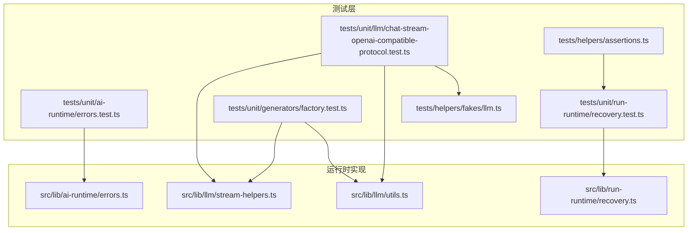
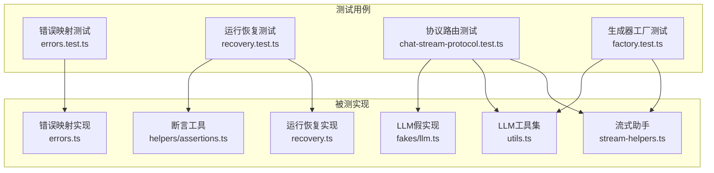
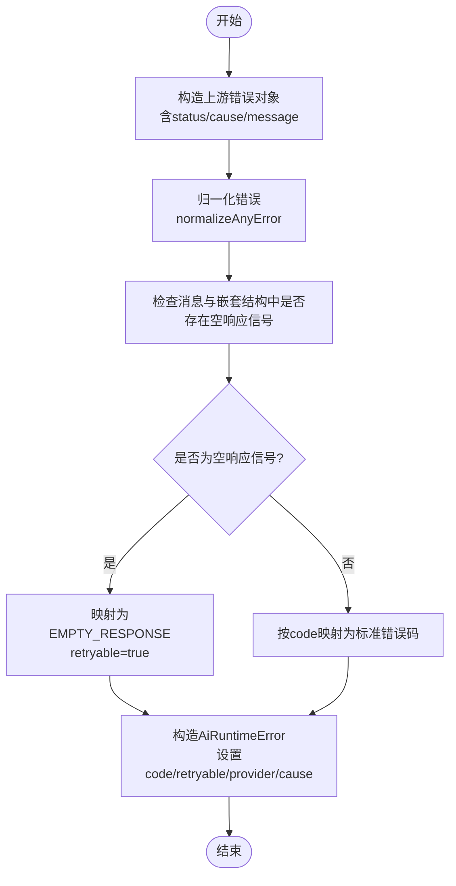
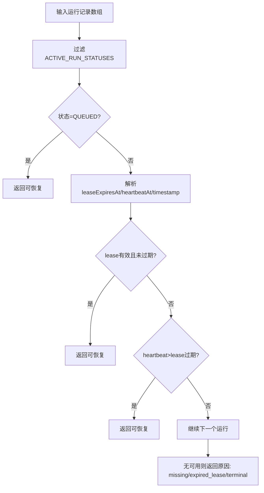
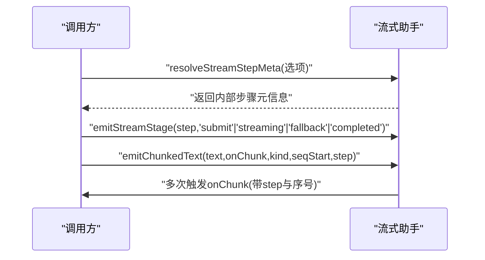
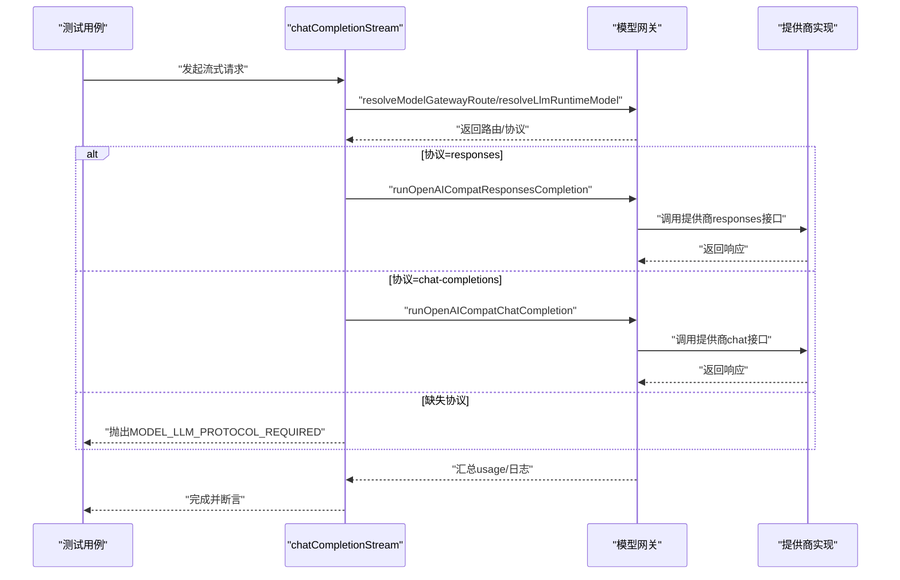
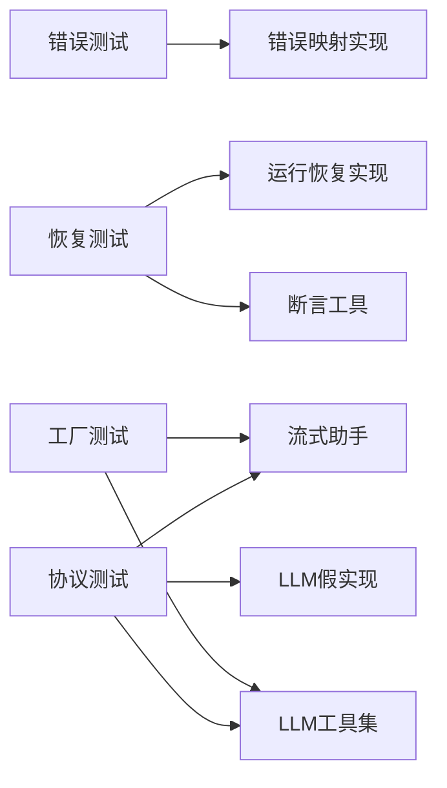

# AI运行时测试

<cite>
**本文引用的文件**
- [tests/unit/ai-runtime/errors.test.ts](file://tests/unit/ai-runtime/errors.test.ts)
- [src/lib/ai-runtime/errors.ts](file://src/lib/ai-runtime/errors.ts)
- [tests/unit/run-runtime/recovery.test.ts](file://tests/unit/run-runtime/recovery.test.ts)
- [src/lib/run-runtime/recovery.ts](file://src/lib/run-runtime/recovery.ts)
- [src/lib/llm/stream-helpers.ts](file://src/lib/llm/stream-helpers.ts)
- [src/lib/llm/utils.ts](file://src/lib/llm/utils.ts)
- [tests/unit/llm/chat-stream-openai-compatible-protocol.test.ts](file://tests/unit/llm/chat-stream-openai-compatible-protocol.test.ts)
- [tests/helpers/fakes/llm.ts](file://tests/helpers/fakes/llm.ts)
- [tests/helpers/assertions.ts](file://tests/helpers/assertions.ts)
- [tests/unit/generators/factory.test.ts](file://tests/unit/generators/factory.test.ts)
</cite>

## 目录
1. [简介](#简介)
2. [项目结构](#项目结构)
3. [核心组件](#核心组件)
4. [架构总览](#架构总览)
5. [详细组件分析](#详细组件分析)
6. [依赖分析](#依赖分析)
7. [性能考虑](#性能考虑)
8. [故障排查指南](#故障排查指南)
9. [结论](#结论)
10. [附录](#附录)

## 简介
本文件面向AI运行时系统的单元测试，系统性梳理错误处理机制、状态与上下文管理、性能监控与并发测试的设计策略与最佳实践。重点覆盖以下方面：
- 错误处理：异常捕获、错误码映射、空响应识别、可重试性判定与传播
- 推理过程：状态机与恢复（run recovery）、流式阶段与分片事件
- 模型调用：协议路由、响应解析、断言方法与模拟策略
- 性能与并发：响应时间、吞吐量与并发处理的测试模式
- 测试用例设计：断言、模拟、工厂与工具函数的组合使用

## 项目结构
围绕AI运行时测试的关键目录与文件：
- 单元测试：tests/unit 下按功能域划分（如 ai-runtime、run-runtime、llm、generators）
- 运行时实现：src/lib 下对应模块（如 ai-runtime/errors、run-runtime/recovery、llm/stream-helpers、llm/utils）
- 测试辅助：tests/helpers（fakes、assertions）

**图表来源**
- [tests/unit/ai-runtime/errors.test.ts:1-35](file://tests/unit/ai-runtime/errors.test.ts#L1-L35)
- [src/lib/ai-runtime/errors.ts:1-87](file://src/lib/ai-runtime/errors.ts#L1-L87)
- [tests/unit/run-runtime/recovery.test.ts:1-77](file://tests/unit/run-runtime/recovery.test.ts#L1-L77)
- [src/lib/run-runtime/recovery.ts:1-86](file://src/lib/run-runtime/recovery.ts#L1-L86)
- [tests/unit/llm/chat-stream-openai-compatible-protocol.test.ts:1-157](file://tests/unit/llm/chat-stream-openai-compatible-protocol.test.ts#L1-L157)
- [src/lib/llm/stream-helpers.ts:1-74](file://src/lib/llm/stream-helpers.ts#L1-L74)
- [src/lib/llm/utils.ts:1-149](file://src/lib/llm/utils.ts#L1-L149)
- [tests/helpers/fakes/llm.ts:1-27](file://tests/helpers/fakes/llm.ts#L1-L27)
- [tests/helpers/assertions.ts:1-24](file://tests/helpers/assertions.ts#L1-L24)

**章节来源**
- [tests/unit/ai-runtime/errors.test.ts:1-35](file://tests/unit/ai-runtime/errors.test.ts#L1-L35)
- [tests/unit/run-runtime/recovery.test.ts:1-77](file://tests/unit/run-runtime/recovery.test.ts#L1-L77)
- [tests/unit/llm/chat-stream-openai-compatible-protocol.test.ts:1-157](file://tests/unit/llm/chat-stream-openai-compatible-protocol.test.ts#L1-L157)
- [tests/unit/generators/factory.test.ts:1-23](file://tests/unit/generators/factory.test.ts#L1-L23)
- [tests/helpers/fakes/llm.ts:1-27](file://tests/helpers/fakes/llm.ts#L1-L27)
- [tests/helpers/assertions.ts:1-24](file://tests/helpers/assertions.ts#L1-L24)

## 核心组件
- 错误处理映射与空响应识别：将上游错误归一化并映射到AI运行时错误码，识别“空响应”信号以决定是否可重试
- 运行恢复决策：基于队列/运行中/取消中等状态、租约到期与心跳时间，选择可恢复的运行并给出原因
- 流式阶段与分片：将长文本切分为固定大小的块，发出阶段事件与增量块事件，支持多路复用与序号追踪
- 协议路由与解析：根据模型协议选择执行器，解析不同格式的响应内容与推理片段
- 工厂与断言：根据提供商键选择生成器；对余额等业务指标进行断言

**章节来源**
- [src/lib/ai-runtime/errors.ts:1-87](file://src/lib/ai-runtime/errors.ts#L1-L87)
- [src/lib/run-runtime/recovery.ts:1-86](file://src/lib/run-runtime/recovery.ts#L1-L86)
- [src/lib/llm/stream-helpers.ts:1-74](file://src/lib/llm/stream-helpers.ts#L1-L74)
- [src/lib/llm/utils.ts:1-149](file://src/lib/llm/utils.ts#L1-L149)
- [tests/helpers/assertions.ts:1-24](file://tests/helpers/assertions.ts#L1-L24)

## 架构总览
下图展示AI运行时测试在错误处理、运行恢复、流式处理与协议路由上的交互关系。

**图表来源**
- [tests/unit/ai-runtime/errors.test.ts:1-35](file://tests/unit/ai-runtime/errors.test.ts#L1-L35)
- [src/lib/ai-runtime/errors.ts:1-87](file://src/lib/ai-runtime/errors.ts#L1-L87)
- [tests/unit/run-runtime/recovery.test.ts:1-77](file://tests/unit/run-runtime/recovery.test.ts#L1-L77)
- [src/lib/run-runtime/recovery.ts:1-86](file://src/lib/run-runtime/recovery.ts#L1-L86)
- [tests/unit/llm/chat-stream-openai-compatible-protocol.test.ts:1-157](file://tests/unit/llm/chat-stream-openai-compatible-protocol.test.ts#L1-L157)
- [src/lib/llm/stream-helpers.ts:1-74](file://src/lib/llm/stream-helpers.ts#L1-L74)
- [src/lib/llm/utils.ts:1-149](file://src/lib/llm/utils.ts#L1-L149)
- [tests/helpers/fakes/llm.ts:1-27](file://tests/helpers/fakes/llm.ts#L1-L27)
- [tests/helpers/assertions.ts:1-24](file://tests/helpers/assertions.ts#L1-L24)

## 详细组件分析

### 错误处理与恢复测试策略
- 异常捕获与错误码映射
  - 使用测试夹具构造包含嵌套cause、status等字段的上游错误对象
  - 验证toAiRuntimeError在“Gemini空响应信号”场景下将code映射为EMPTY_RESPONSE且retryable=true
  - 在无空响应信号时保留原始状态码（如429）并映射为RATE_LIMIT
- 错误传播与恢复机制
  - 将错误作为AiRuntimeError抛出，携带code、retryable、provider、cause等属性
  - 结合业务断言（如余额、冻结金额、总消费）验证错误不会导致数据不一致

**图表来源**
- [src/lib/ai-runtime/errors.ts:72-86](file://src/lib/ai-runtime/errors.ts#L72-L86)
- [tests/unit/ai-runtime/errors.test.ts:4-34](file://tests/unit/ai-runtime/errors.test.ts#L4-L34)

**章节来源**
- [src/lib/ai-runtime/errors.ts:1-87](file://src/lib/ai-runtime/errors.ts#L1-L87)
- [tests/unit/ai-runtime/errors.test.ts:1-35](file://tests/unit/ai-runtime/errors.test.ts#L1-L35)

### 运行状态管理与上下文保持测试
- 可恢复运行判定
  - 队列中（QUEUED）直接视为可恢复
  - 运行中（RUNNING）需满足：存在有效leaseExpiresAt且未过期，或存在心跳且晚于lease过期
- 最新活跃运行选择
  - 按updatedAt降序排序，优先返回可恢复的最新运行
  - 若无可恢复运行则返回原因：缺失/过期租约/终止
- 断言与回归
  - 使用断言工具校验用户余额与冻结金额非负，避免错误导致资金异常

**图表来源**
- [src/lib/run-runtime/recovery.ts:29-85](file://src/lib/run-runtime/recovery.ts#L29-L85)
- [tests/unit/run-runtime/recovery.test.ts:5-76](file://tests/unit/run-runtime/recovery.test.ts#L5-L76)

**章节来源**
- [src/lib/run-runtime/recovery.ts:1-86](file://src/lib/run-runtime/recovery.ts#L1-L86)
- [tests/unit/run-runtime/recovery.test.ts:1-77](file://tests/unit/run-runtime/recovery.test.ts#L1-L77)
- [tests/helpers/assertions.ts:1-24](file://tests/helpers/assertions.ts#L1-L24)

### 流式阶段与上下文保持测试
- 分片与阶段事件
  - 将长文本按固定大小切分为多个块，逐块发出onChunk事件
  - 支持step元信息（id、attempt、title、index、total），用于跨阶段追踪
  - 提供emitStreamStage统一发出submit/streaming/fallback/completed等阶段事件
- 上下文保持
  - 通过step参数在chunk与stage事件中携带步骤元数据，确保前端/观察者可重建流式顺序
  - 对空文本与无效参数进行边界处理（如seq起始值、total取index与total的最大值）

**图表来源**
- [src/lib/llm/stream-helpers.ts:5-73](file://src/lib/llm/stream-helpers.ts#L5-L73)

**章节来源**
- [src/lib/llm/stream-helpers.ts:1-74](file://src/lib/llm/stream-helpers.ts#L1-L74)

### 协议路由与响应解析测试
- 协议路由
  - 根据模型协议（responses/chat-completions）选择对应的执行器
  - 当协议缺失时快速失败并抛出约定错误码，避免误调用其他提供商
- 响应解析
  - 统一从choices/response中提取content与usage
  - 解析推理片段（reasoning/thinking）与文本片段，支持多格式兼容
- 模拟策略
  - 使用vi.hoisted与vi.mock对网关路由、提供商实现、日志与用量记录进行隔离
  - 使用fakes/llm提供可控的输出，便于断言

**图表来源**
- [tests/unit/llm/chat-stream-openai-compatible-protocol.test.ts:93-156](file://tests/unit/llm/chat-stream-openai-compatible-protocol.test.ts#L93-L156)
- [src/lib/llm/utils.ts:46-116](file://src/lib/llm/utils.ts#L46-L116)

**章节来源**
- [tests/unit/llm/chat-stream-openai-compatible-protocol.test.ts:1-157](file://tests/unit/llm/chat-stream-openai-compatible-protocol.test.ts#L1-L157)
- [src/lib/llm/utils.ts:1-149](file://src/lib/llm/utils.ts#L1-L149)
- [tests/helpers/fakes/llm.ts:1-27](file://tests/helpers/fakes/llm.ts#L1-L27)

### 生成器工厂与断言方法
- 工厂路由
  - 根据提供商键选择对应生成器实例（如gemini-compatible路由至Google视频生成器，bailian路由至官方生成器）
- 断言方法
  - 对用户余额、冻结金额、总消费进行断言，支持容差比较
  - 确保无负值，保障账务一致性

**章节来源**
- [tests/unit/generators/factory.test.ts:1-23](file://tests/unit/generators/factory.test.ts#L1-L23)
- [tests/helpers/assertions.ts:1-24](file://tests/helpers/assertions.ts#L1-L24)

## 依赖分析
- 测试与实现的耦合度
  - 错误处理测试直接依赖错误映射实现，关注点清晰
  - 运行恢复测试依赖运行类型定义与时间戳解析，断言集中在可恢复性与原因选择
  - LLM协议测试通过mock隔离外部依赖，仅验证路由逻辑与错误分支
- 外部依赖与集成点
  - 协议路由依赖模型网关与提供商实现
  - 生成器工厂依赖提供商注册表与具体生成器实现
  - 断言工具依赖数据库访问（Prisma）

**图表来源**
- [src/lib/ai-runtime/errors.ts:1-87](file://src/lib/ai-runtime/errors.ts#L1-L87)
- [src/lib/run-runtime/recovery.ts:1-86](file://src/lib/run-runtime/recovery.ts#L1-L86)
- [src/lib/llm/stream-helpers.ts:1-74](file://src/lib/llm/stream-helpers.ts#L1-L74)
- [src/lib/llm/utils.ts:1-149](file://src/lib/llm/utils.ts#L1-L149)
- [tests/helpers/fakes/llm.ts:1-27](file://tests/helpers/fakes/llm.ts#L1-L27)
- [tests/helpers/assertions.ts:1-24](file://tests/helpers/assertions.ts#L1-L24)

**章节来源**
- [src/lib/ai-runtime/errors.ts:1-87](file://src/lib/ai-runtime/errors.ts#L1-L87)
- [src/lib/run-runtime/recovery.ts:1-86](file://src/lib/run-runtime/recovery.ts#L1-L86)
- [src/lib/llm/stream-helpers.ts:1-74](file://src/lib/llm/stream-helpers.ts#L1-L74)
- [src/lib/llm/utils.ts:1-149](file://src/lib/llm/utils.ts#L1-L149)
- [tests/helpers/fakes/llm.ts:1-27](file://tests/helpers/fakes/llm.ts#L1-L27)
- [tests/helpers/assertions.ts:1-24](file://tests/helpers/assertions.ts#L1-L24)

## 性能考虑
- 响应时间测试
  - 使用高精度计时（如performance.now或基准测试框架）测量从请求到首包/完整响应的时间
  - 对比不同提供商与协议的延迟分布，识别瓶颈
- 吞吐量测试
  - 固定时间内并发发送请求，统计QPS与P95/P99延迟
  - 关注流式场景下的chunk速率与序列完整性
- 并发处理测试
  - 多线程/多任务并发调用，验证共享资源（租约、心跳、缓存）的一致性
  - 对错误重试与退避策略进行压力测试，防止级联失败

[本节为通用指导，无需特定文件来源]

## 故障排查指南
- 错误码与可重试性
  - 若出现EMPTY_RESPONSE，优先检查上游是否返回空候选或通道错误；确认重试策略启用
  - 若出现RATE_LIMIT，检查限流阈值与配额；必要时调整温度或降低并发
- 运行恢复
  - 租约过期但无心跳：检查工作节点健康与心跳上报
  - 选择错误的运行：核对updatedAt/createdAt排序逻辑与过滤条件
- 流式事件
  - 缺少阶段事件：确认emitStreamStage调用路径与step参数传递
  - 分片丢失：检查chunk大小与序列号递增逻辑
- 协议路由
  - MODEL_LLM_PROTOCOL_REQUIRED：补充模型协议配置或默认值
  - 调用错误提供商：检查路由解析与mock配置

**章节来源**
- [src/lib/ai-runtime/errors.ts:72-86](file://src/lib/ai-runtime/errors.ts#L72-L86)
- [src/lib/run-runtime/recovery.ts:50-85](file://src/lib/run-runtime/recovery.ts#L50-L85)
- [src/lib/llm/stream-helpers.ts:28-73](file://src/lib/llm/stream-helpers.ts#L28-L73)
- [tests/unit/llm/chat-stream-openai-compatible-protocol.test.ts:135-155](file://tests/unit/llm/chat-stream-openai-compatible-protocol.test.ts#L135-L155)

## 结论
本测试体系通过明确的错误映射、运行恢复与流式事件机制，结合协议路由与生成器工厂的模拟策略，形成了覆盖异常捕获、状态管理、上下文保持与性能监控的完整测试闭环。建议在持续集成中引入性能基线与回归矩阵，确保AI运行时在复杂场景下的稳定性与可预测性。

[本节为总结性内容，无需特定文件来源]

## 附录
- 测试用例设计模式
  - 模拟优先：使用vi.mock与hoisted隔离外部依赖
  - 数据驱动：通过fakes提供可控输入，覆盖正常/异常/边界场景
  - 断言集中：将业务断言封装为工具函数，减少重复代码
- 最佳实践
  - 明确错误码与可重试性语义，避免误判
  - 在流式场景中严格维护序号与步骤元信息
  - 对关键路径增加超时与重试策略，并在测试中验证

[本节为通用指导，无需特定文件来源]