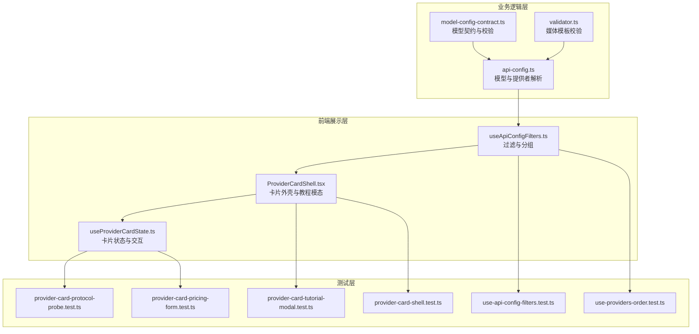
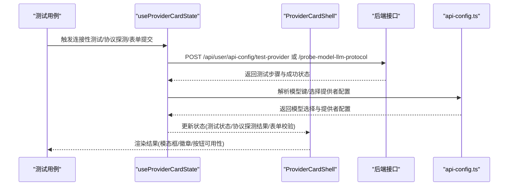
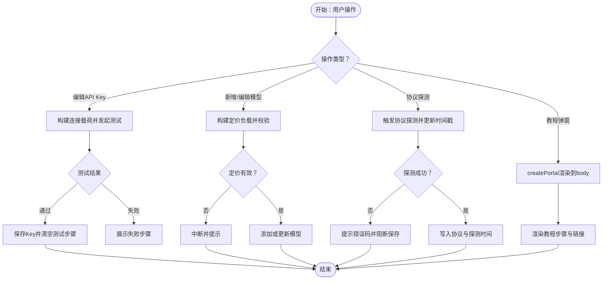
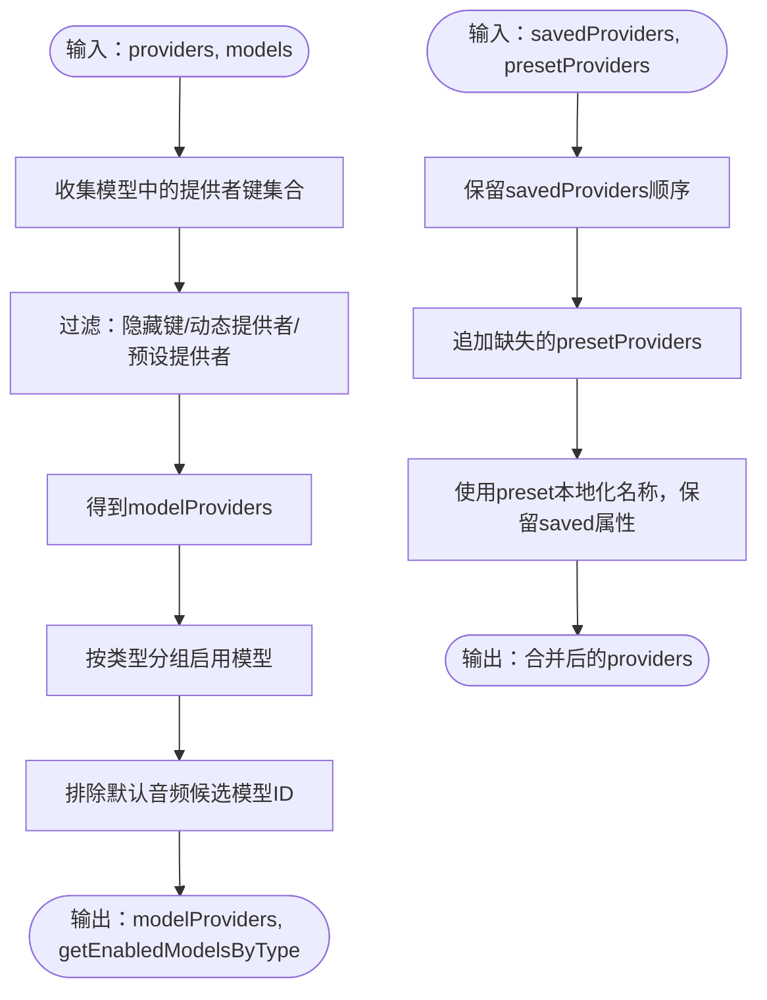
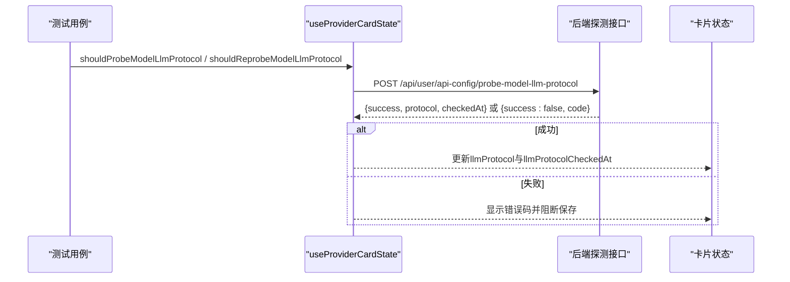
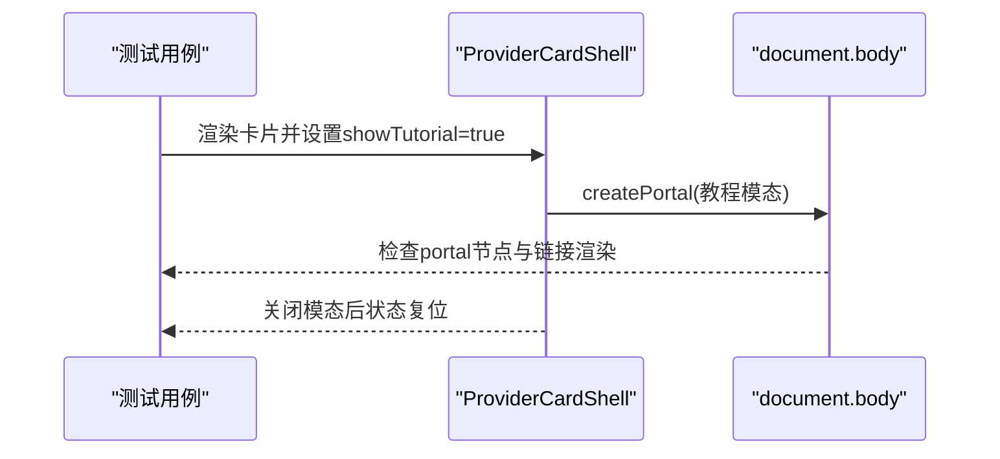
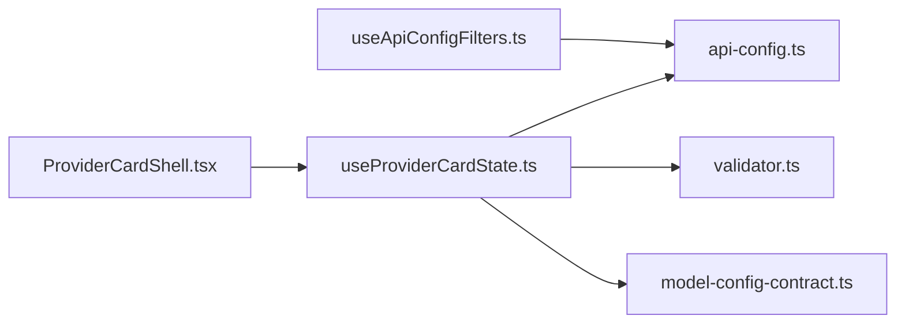

# API配置测试

<cite>
**本文档引用的文件**
- [src/lib/api-config.ts](file://src/lib/api-config.ts)
- [src/app/[locale]/profile/components/api-config-tab/hooks/useApiConfigFilters.ts](file://src/app/[locale]/profile/components/api-config-tab/hooks/useApiConfigFilters.ts)
- [src/lib/user-api/model-template/validator.ts](file://src/lib/user-api/model-template/validator.ts)
- [src/lib/model-config-contract.ts](file://src/lib/model-config-contract.ts)
- [src/app/[locale]/profile/components/api-config/provider-card/ProviderCardShell.tsx](file://src/app/[locale]/profile/components/api-config/provider-card/ProviderCardShell.tsx)
- [src/app/[locale]/profile/components/api-config/provider-card/hooks/useProviderCardState.ts](file://src/app/[locale]/profile/components/api-config/provider-card/hooks/useProviderCardState.ts)
- [tests/unit/api-config/provider-card-protocol-probe.test.ts](file://tests/unit/api-config/provider-card-protocol-probe.test.ts)
- [tests/unit/api-config/use-api-config-filters.test.ts](file://tests/unit/api-config/use-api-config-filters.test.ts)
- [tests/unit/api-config/provider-card-tutorial-modal.test.ts](file://tests/unit/api-config/provider-card-tutorial-modal.test.ts)
- [tests/unit/api-config/provider-card-pricing-form.test.ts](file://tests/unit/api-config/provider-card-pricing-form.test.ts)
- [tests/unit/api-config/provider-card-shell.test.ts](file://tests/unit/api-config/provider-card-shell.test.ts)
- [tests/unit/api-config/use-providers-order.test.ts](file://tests/unit/api-config/use-providers-order.test.ts)
</cite>

## 目录
1. [简介](#简介)
2. [项目结构](#项目结构)
3. [核心组件](#核心组件)
4. [架构总览](#架构总览)
5. [详细组件分析](#详细组件分析)
6. [依赖关系分析](#依赖关系分析)
7. [性能考虑](#性能考虑)
8. [故障排查指南](#故障排查指南)
9. [结论](#结论)
10. [附录](#附录)

## 简介
本文件面向API配置系统的单元测试，系统性梳理并输出以下测试主题：
- API配置卡片组件的测试策略：配置表单验证、动态字段渲染、状态同步
- API配置过滤器的功能测试：搜索匹配、排序逻辑、筛选条件
- API配置协议探测的测试方法：连接性验证、兼容性检查、错误处理
- API配置模板与教程模态框的测试用例设计：用户交互测试、数据持久化

目标是帮助开发者快速理解测试覆盖点、编写高质量的单元测试，并确保UI行为与业务规则一致。

## 项目结构
API配置相关代码主要分布在以下位置：
- 业务逻辑与数据模型：src/lib/api-config.ts、src/lib/model-config-contract.ts、src/lib/user-api/model-template/validator.ts
- 前端过滤与展示：src/app/[locale]/profile/components/api-config-tab/hooks/useApiConfigFilters.ts
- 卡片组件与交互：src/app/[locale]/profile/components/api-config/provider-card/ProviderCardShell.tsx、src/app/[locale]/profile/components/api-config/provider-card/hooks/useProviderCardState.ts
- 单元测试：tests/unit/api-config/*.test.ts

图表来源
- [src/lib/api-config.ts:1-509](file://src/lib/api-config.ts#L1-L509)
- [src/app/[locale]/profile/components/api-config-tab/hooks/useApiConfigFilters.ts:1-137](file://src/app/[locale]/profile/components/api-config-tab/hooks/useApiConfigFilters.ts#L1-L137)
- [src/lib/user-api/model-template/validator.ts:1-70](file://src/lib/user-api/model-template/validator.ts#L1-L70)
- [src/lib/model-config-contract.ts:1-528](file://src/lib/model-config-contract.ts#L1-L528)
- [src/app/[locale]/profile/components/api-config/provider-card/ProviderCardShell.tsx:1-213](file://src/app/[locale]/profile/components/api-config/provider-card/ProviderCardShell.tsx#L1-L213)
- [src/app/[locale]/profile/components/api-config/provider-card/hooks/useProviderCardState.ts:1-833](file://src/app/[locale]/profile/components/api-config/provider-card/hooks/useProviderCardState.ts#L1-L833)

章节来源
- [src/lib/api-config.ts:1-509](file://src/lib/api-config.ts#L1-L509)
- [src/app/[locale]/profile/components/api-config-tab/hooks/useApiConfigFilters.ts:1-137](file://src/app/[locale]/profile/components/api-config-tab/hooks/useApiConfigFilters.ts#L1-L137)
- [src/lib/user-api/model-template/validator.ts:1-70](file://src/lib/user-api/model-template/validator.ts#L1-L70)
- [src/lib/model-config-contract.ts:1-528](file://src/lib/model-config-contract.ts#L1-L528)
- [src/app/[locale]/profile/components/api-config/provider-card/ProviderCardShell.tsx:1-213](file://src/app/[locale]/profile/components/api-config/provider-card/ProviderCardShell.tsx#L1-L213)
- [src/app/[locale]/profile/components/api-config/provider-card/hooks/useProviderCardState.ts:1-833](file://src/app/[locale]/profile/components/api-config/provider-card/hooks/useProviderCardState.ts#L1-L833)

## 核心组件
- API配置读取器与解析器：负责模型与提供者的严格解析、校验与选择，确保运行时从配置中心读取且无猜测或降级。
- 过滤与分组钩子：根据模型类型、提供者能力与API Key状态，动态生成可展示的提供者列表与启用模型分组。
- 卡片外壳与状态管理：封装提供者卡片的UI外壳、教程模态框、连接性测试、协议探测、定价表单构建等交互逻辑。
- 模板与契约校验：对媒体模板路径进行合法性校验，对模型能力字段进行结构与取值范围校验。

章节来源
- [src/lib/api-config.ts:291-434](file://src/lib/api-config.ts#L291-L434)
- [src/app/[locale]/profile/components/api-config-tab/hooks/useApiConfigFilters.ts:56-136](file://src/app/[locale]/profile/components/api-config-tab/hooks/useApiConfigFilters.ts#L56-L136)
- [src/app/[locale]/profile/components/api-config/provider-card/ProviderCardShell.tsx:43-212](file://src/app/[locale]/profile/components/api-config/provider-card/ProviderCardShell.tsx#L43-L212)
- [src/app/[locale]/profile/components/api-config/provider-card/hooks/useProviderCardState.ts:354-800](file://src/app/[locale]/profile/components/api-config/provider-card/hooks/useProviderCardState.ts#L354-L800)
- [src/lib/user-api/model-template/validator.ts:50-70](file://src/lib/user-api/model-template/validator.ts#L50-L70)
- [src/lib/model-config-contract.ts:471-527](file://src/lib/model-config-contract.ts#L471-L527)

## 架构总览
下图展示了API配置测试的关键交互路径：测试驱动UI行为与业务逻辑，业务逻辑依赖数据契约与校验工具。

图表来源
- [src/app/[locale]/profile/components/api-config/provider-card/hooks/useProviderCardState.ts:451-530](file://src/app/[locale]/profile/components/api-config/provider-card/hooks/useProviderCardState.ts#L451-L530)
- [src/lib/api-config.ts:323-352](file://src/lib/api-config.ts#L323-L352)
- [src/app/[locale]/profile/components/api-config/provider-card/ProviderCardShell.tsx:104-137](file://src/app/[locale]/profile/components/api-config/provider-card/ProviderCardShell.tsx#L104-L137)

## 详细组件分析

### API配置卡片组件测试策略
本节聚焦于Provider Card相关测试，覆盖表单验证、动态字段渲染与状态同步。

- 表单验证与数据构建
  - 动态定价表单：根据模型类型与开关状态，构建LLM/图像/视频的定价负载；对非法输入返回失败。
  - 连接测试载荷：兼容提供者需包含baseUrl与llmModel，非兼容提供者忽略baseUrl。
  - 协议探测：仅对openai-compatible LLM模型触发，变更模型时按需重探测。
  
- 动态字段渲染
  - 兼容层徽章：根据提供者键显示“OpenAI兼容层”或“Gemini兼容层”，预设提供者不显示。
  - 教程模态框：通过createPortal挂载到document.body，渲染步骤文本与链接。
  - 提供者顺序合并：保留已保存提供者顺序并在末尾追加缺失的预设提供者，同时保留已保存的名称、baseUrl与apiKey。

- 状态同步
  - 测试流程：测试中/通过/失败三种状态，失败时展示网络错误步骤；纯测试模式不保存。
  - 协议探测：保存前刷新配置，探测失败时提示具体错误码并阻断保存。
  - 助手集成：开启AI助手时，支持从草稿或保存事件更新模型或添加新模型。

图表来源
- [src/app/[locale]/profile/components/api-config/provider-card/hooks/useProviderCardState.ts:169-195](file://src/app/[locale]/profile/components/api-config/provider-card/hooks/useProviderCardState.ts#L169-L195)
- [src/app/[locale]/profile/components/api-config/provider-card/hooks/useProviderCardState.ts:451-530](file://src/app/[locale]/profile/components/api-config/provider-card/hooks/useProviderCardState.ts#L451-L530)
- [src/app/[locale]/profile/components/api-config/provider-card/hooks/useProviderCardState.ts:636-694](file://src/app/[locale]/profile/components/api-config/provider-card/hooks/useProviderCardState.ts#L636-L694)
- [src/app/[locale]/profile/components/api-config/provider-card/ProviderCardShell.tsx:140-207](file://src/app/[locale]/profile/components/api-config/provider-card/ProviderCardShell.tsx#L140-L207)

章节来源
- [tests/unit/api-config/provider-card-pricing-form.test.ts:12-174](file://tests/unit/api-config/provider-card-pricing-form.test.ts#L12-L174)
- [tests/unit/api-config/provider-card-protocol-probe.test.ts:9-84](file://tests/unit/api-config/provider-card-protocol-probe.test.ts#L9-L84)
- [tests/unit/api-config/provider-card-tutorial-modal.test.ts:124-183](file://tests/unit/api-config/provider-card-tutorial-modal.test.ts#L124-L183)
- [tests/unit/api-config/provider-card-shell.test.ts:4-26](file://tests/unit/api-config/provider-card-shell.test.ts#L4-L26)
- [tests/unit/api-config/use-providers-order.test.ts:5-66](file://tests/unit/api-config/use-providers-order.test.ts#L5-L66)
- [src/app/[locale]/profile/components/api-config/provider-card/ProviderCardShell.tsx:43-212](file://src/app/[locale]/profile/components/api-config/provider-card/ProviderCardShell.tsx#L43-L212)
- [src/app/[locale]/profile/components/api-config/provider-card/hooks/useProviderCardState.ts:354-800](file://src/app/[locale]/profile/components/api-config/provider-card/hooks/useProviderCardState.ts#L354-L800)

### API配置过滤器功能测试
过滤器模块根据模型类型、提供者能力与API Key状态，动态生成可展示的提供者列表与启用模型分组。

- 搜索匹配与筛选条件
  - 动态提供者：以“gemini-compatible”、“openai-compatible”为前缀且包含冒号的提供者视为动态提供者，即使未在模型中出现也应显示。
  - 预设提供者：通过PRESET_PROVIDERS匹配，若未在模型中出现则不显示。
  - 隐藏提供者：某些提供者键被明确隐藏。
  - API Key校验：仅当提供者具备有效API Key时，其模型才计入启用分组。

- 排序与顺序
  - 保持providers输入顺序，动态提供者与已保存提供者优先，缺失的预设提供者追加至末尾。
  - 合并时保留已保存提供者的名称、baseUrl与apiKey，预设提供者仅用于本地化名称。

图表来源
- [src/app/[locale]/profile/components/api-config-tab/hooks/useApiConfigFilters.ts:56-136](file://src/app/[locale]/profile/components/api-config-tab/hooks/useApiConfigFilters.ts#L56-L136)
- [tests/unit/api-config/use-api-config-filters.test.ts:14-120](file://tests/unit/api-config/use-api-config-filters.test.ts#L14-L120)
- [tests/unit/api-config/use-providers-order.test.ts:5-66](file://tests/unit/api-config/use-providers-order.test.ts#L5-L66)

章节来源
- [src/app/[locale]/profile/components/api-config-tab/hooks/useApiConfigFilters.ts:16-136](file://src/app/[locale]/profile/components/api-config-tab/hooks/useApiConfigFilters.ts#L16-L136)
- [tests/unit/api-config/use-api-config-filters.test.ts:14-120](file://tests/unit/api-config/use-api-config-filters.test.ts#L14-L120)
- [tests/unit/api-config/use-providers-order.test.ts:5-66](file://tests/unit/api-config/use-providers-order.test.ts#L5-L66)

### API配置协议探测测试方法
协议探测用于确定openai-compatible LLM模型的协议类型（responses/chat-completions），并记录探测时间。

- 触发条件
  - 仅对openai-compatible提供者且模型类型为llm时触发。
  - 编辑或新增模型时，若模型ID或提供者发生变化，按需重探测。

- 成功与失败处理
  - 成功：返回协议类型与探测时间，写入模型对象。
  - 失败：抛出特定错误码（如认证失败、请求失败、协议无效），UI提示对应文案。

图表来源
- [src/app/[locale]/profile/components/api-config/provider-card/hooks/useProviderCardState.ts:106-157](file://src/app/[locale]/profile/components/api-config/provider-card/hooks/useProviderCardState.ts#L106-L157)
- [tests/unit/api-config/provider-card-protocol-probe.test.ts:9-84](file://tests/unit/api-config/provider-card-protocol-probe.test.ts#L9-L84)

章节来源
- [src/app/[locale]/profile/components/api-config/provider-card/hooks/useProviderCardState.ts:106-157](file://src/app/[locale]/profile/components/api-config/provider-card/hooks/useProviderCardState.ts#L106-L157)
- [tests/unit/api-config/provider-card-protocol-probe.test.ts:9-84](file://tests/unit/api-config/provider-card-protocol-probe.test.ts#L9-L84)

### API配置模板与教程模态框测试
- 教程模态框
  - 通过createPortal将模态框挂载到document.body，确保层级正确。
  - 渲染步骤文本与外部链接，点击外部区域或关闭按钮可关闭。
  - 国际化文本映射，确保按钮与标题文案正确。

- 模板与媒体兼容性
  - 媒体模板路径校验：绝对URL或相对路径，不能为空。
  - 模板校验器返回issues数组，便于UI展示具体问题。

图表来源
- [src/app/[locale]/profile/components/api-config/provider-card/ProviderCardShell.tsx:140-207](file://src/app/[locale]/profile/components/api-config/provider-card/ProviderCardShell.tsx#L140-L207)
- [tests/unit/api-config/provider-card-tutorial-modal.test.ts:124-183](file://tests/unit/api-config/provider-card-tutorial-modal.test.ts#L124-L183)

章节来源
- [src/app/[locale]/profile/components/api-config/provider-card/ProviderCardShell.tsx:140-207](file://src/app/[locale]/profile/components/api-config/provider-card/ProviderCardShell.tsx#L140-L207)
- [src/lib/user-api/model-template/validator.ts:15-48](file://src/lib/user-api/model-template/validator.ts#L15-L48)
- [tests/unit/api-config/provider-card-tutorial-modal.test.ts:124-183](file://tests/unit/api-config/provider-card-tutorial-modal.test.ts#L124-L183)

## 依赖关系分析
- useApiConfigFilters依赖api-config中的预设提供者与提供者键提取逻辑，结合模型类型与API Key状态进行过滤。
- ProviderCardShell依赖useProviderCardState的状态与国际化翻译函数，渲染徽章、测试按钮与教程模态框。
- useProviderCardState依赖api-config解析模型键、选择提供者配置，并调用后端接口进行连接性测试与协议探测。
- 模板校验器与模型契约校验器为上层UI提供数据合法性保障。

图表来源
- [src/app/[locale]/profile/components/api-config-tab/hooks/useApiConfigFilters.ts:4-6](file://src/app/[locale]/profile/components/api-config-tab/hooks/useApiConfigFilters.ts#L4-L6)
- [src/app/[locale]/profile/components/api-config/provider-card/ProviderCardShell.tsx:8-11](file://src/app/[locale]/profile/components/api-config/provider-card/ProviderCardShell.tsx#L8-L11)
- [src/app/[locale]/profile/components/api-config/provider-card/hooks/useProviderCardState.ts:11-27](file://src/app/[locale]/profile/components/api-config/provider-card/hooks/useProviderCardState.ts#L11-L27)

章节来源
- [src/app/[locale]/profile/components/api-config-tab/hooks/useApiConfigFilters.ts:4-6](file://src/app/[locale]/profile/components/api-config-tab/hooks/useApiConfigFilters.ts#L4-L6)
- [src/app/[locale]/profile/components/api-config/provider-card/ProviderCardShell.tsx:8-11](file://src/app/[locale]/profile/components/api-config/provider-card/ProviderCardShell.tsx#L8-L11)
- [src/app/[locale]/profile/components/api-config/provider-card/hooks/useProviderCardState.ts:11-27](file://src/app/[locale]/profile/components/api-config/provider-card/hooks/useProviderCardState.ts#L11-L27)

## 性能考虑
- 过滤与分组计算使用useMemo避免重复计算，提升大列表渲染性能。
- 协议探测与连接测试采用异步请求，UI状态机保证并发安全。
- 模板校验与模型契约校验在客户端进行，减少无效请求。

## 故障排查指南
- 协议探测失败
  - 检查提供者是否为openai-compatible且模型类型为llm。
  - 确认探测接口返回的协议类型与时间戳格式。
  - 查看错误码映射，定位认证失败、请求失败或协议无效等问题。

- 连接性测试失败
  - 校验构建的连接载荷是否包含正确的apiType、apiKey与baseUrl（兼容提供者）。
  - 确认测试接口返回的steps与success字段。

- 教程模态框未显示
  - 确认createPortal目标为document.body且状态showTutorial为true。
  - 检查国际化文本映射与步骤URL。

章节来源
- [src/app/[locale]/profile/components/api-config/provider-card/hooks/useProviderCardState.ts:106-157](file://src/app/[locale]/profile/components/api-config/provider-card/hooks/useProviderCardState.ts#L106-L157)
- [src/app/[locale]/profile/components/api-config/provider-card/hooks/useProviderCardState.ts:451-530](file://src/app/[locale]/profile/components/api-config/provider-card/hooks/useProviderCardState.ts#L451-L530)
- [src/app/[locale]/profile/components/api-config/provider-card/ProviderCardShell.tsx:140-207](file://src/app/[locale]/profile/components/api-config/provider-card/ProviderCardShell.tsx#L140-L207)

## 结论
本文档系统梳理了API配置系统的单元测试策略，覆盖卡片组件的表单验证、动态字段渲染与状态同步，过滤器的搜索匹配、排序与筛选，协议探测的触发条件与错误处理，以及模板与教程模态框的用户交互与数据持久化。建议在新增或修改相关功能时，同步补充对应的单元测试，确保UI行为与业务规则一致。

## 附录
- 相关实现参考路径
  - [模型解析与选择:323-352](file://src/lib/api-config.ts#L323-L352)
  - [过滤与分组:56-136](file://src/app/[locale]/profile/components/api-config-tab/hooks/useApiConfigFilters.ts#L56-L136)
  - [卡片外壳与教程模态:43-212](file://src/app/[locale]/profile/components/api-config/provider-card/ProviderCardShell.tsx#L43-L212)
  - [卡片状态与交互:354-800](file://src/app/[locale]/profile/components/api-config/provider-card/hooks/useProviderCardState.ts#L354-L800)
  - [模板校验:50-70](file://src/lib/user-api/model-template/validator.ts#L50-L70)
  - [模型契约校验:471-527](file://src/lib/model-config-contract.ts#L471-L527)