# LLM测试

<cite>
**本文档引用的文件**
- [tests/unit/llm/ark-llm-thinking.test.ts](file://tests/unit/llm/ark-llm-thinking.test.ts)
- [tests/unit/llm/chat-completion-official-provider.test.ts](file://tests/unit/llm/chat-completion-official-provider.test.ts)
- [tests/unit/llm/chat-completion-openai-compatible-protocol.test.ts](file://tests/unit/llm/chat-completion-openai-compatible-protocol.test.ts)
- [tests/unit/llm/chat-stream-official-provider.test.ts](file://tests/unit/llm/chat-stream-official-provider.test.ts)
- [tests/unit/llm/chat-stream-openai-compatible-protocol.test.ts](file://tests/unit/llm/chat-stream-openai-compatible-protocol.test.ts)
- [tests/unit/llm/completion-parts-think-tag.test.ts](file://tests/unit/llm/completion-parts-think-tag.test.ts)
- [tests/unit/llm/reasoning-capability.test.ts](file://tests/unit/llm/reasoning-capability.test.ts)
- [src/lib/ark-llm.ts](file://src/lib/ark-llm.ts)
- [src/lib/llm/completion-parts.ts](file://src/lib/llm/completion-parts.ts)
- [src/lib/llm/reasoning-capability.ts](file://src/lib/llm/reasoning-capability.ts)
- [src/lib/llm/chat-completion.ts](file://src/lib/llm/chat-completion.ts)
- [src/lib/llm/chat-stream.ts](file://src/lib/llm/chat-stream.ts)
- [src/lib/llm/utils.ts](file://src/lib/llm/utils.ts)
- [src/lib/llm/stream-helpers.ts](file://src/lib/llm/stream-helpers.ts)
</cite>

## 目录
1. [简介](#简介)
2. [项目结构](#项目结构)
3. [核心组件](#核心组件)
4. [架构总览](#架构总览)
5. [详细组件分析](#详细组件分析)
6. [依赖关系分析](#依赖关系分析)
7. [性能考量](#性能考量)
8. [故障排查指南](#故障排查指南)
9. [结论](#结论)
10. [附录](#附录)

## 简介
本文件面向LLM系统的单元测试，聚焦以下目标：
- 阿尔法（Ark）LLM思维过程的测试策略：思考标签解析、推理链验证与输出格式测试
- 聊天完成与流式响应的测试方法：覆盖官方提供程序与OpenAI兼容协议
- 推理能力的测试策略：能力检测、模型选择与性能评估
- 聊天流与补全部分思维标签的测试用例：流式处理、错误恢复与性能优化

## 项目结构
围绕LLM测试的相关目录与文件组织如下：
- 单元测试位于 tests/unit/llm 下，按功能模块划分，涵盖 Ark 思维参数构建、聊天完成与流式响应、思维标签解析、推理能力判定等
- 核心实现位于 src/lib/llm 与 src/lib/ark-llm，包含聊天完成、流式处理、思维标签解析、推理能力判断等逻辑

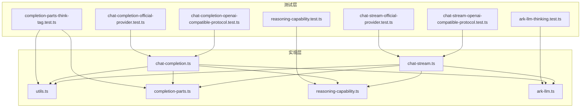

**图表来源**
- [tests/unit/llm/ark-llm-thinking.test.ts:1-23](file://tests/unit/llm/ark-llm-thinking.test.ts#L1-L23)
- [tests/unit/llm/completion-parts-think-tag.test.ts:1-51](file://tests/unit/llm/completion-parts-think-tag.test.ts#L1-L51)
- [tests/unit/llm/reasoning-capability.test.ts:1-42](file://tests/unit/llm/reasoning-capability.test.ts#L1-L42)
- [tests/unit/llm/chat-completion-official-provider.test.ts:1-125](file://tests/unit/llm/chat-completion-official-provider.test.ts#L1-L125)
- [tests/unit/llm/chat-completion-openai-compatible-protocol.test.ts:1-159](file://tests/unit/llm/chat-completion-openai-compatible-protocol.test.ts#L1-L159)
- [tests/unit/llm/chat-stream-official-provider.test.ts:1-130](file://tests/unit/llm/chat-stream-official-provider.test.ts#L1-L130)
- [tests/unit/llm/chat-stream-openai-compatible-protocol.test.ts:1-157](file://tests/unit/llm/chat-stream-openai-compatible-protocol.test.ts#L1-L157)
- [src/lib/ark-llm.ts:1-340](file://src/lib/ark-llm.ts#L1-L340)
- [src/lib/llm/completion-parts.ts:1-33](file://src/lib/llm/completion-parts.ts#L1-L33)
- [src/lib/llm/reasoning-capability.ts:1-33](file://src/lib/llm/reasoning-capability.ts#L1-L33)
- [src/lib/llm/chat-completion.ts:1-523](file://src/lib/llm/chat-completion.ts#L1-L523)
- [src/lib/llm/chat-stream.ts:1-800](file://src/lib/llm/chat-stream.ts#L1-L800)
- [src/lib/llm/utils.ts:1-149](file://src/lib/llm/utils.ts#L1-L149)
- [src/lib/llm/stream-helpers.ts:1-74](file://src/lib/llm/stream-helpers.ts#L1-L74)

**章节来源**
- [tests/unit/llm/ark-llm-thinking.test.ts:1-23](file://tests/unit/llm/ark-llm-thinking.test.ts#L1-L23)
- [tests/unit/llm/completion-parts-think-tag.test.ts:1-51](file://tests/unit/llm/completion-parts-think-tag.test.ts#L1-L51)
- [tests/unit/llm/reasoning-capability.test.ts:1-42](file://tests/unit/llm/reasoning-capability.test.ts#L1-L42)
- [tests/unit/llm/chat-completion-official-provider.test.ts:1-125](file://tests/unit/llm/chat-completion-official-provider.test.ts#L1-L125)
- [tests/unit/llm/chat-completion-openai-compatible-protocol.test.ts:1-159](file://tests/unit/llm/chat-completion-openai-compatible-protocol.test.ts#L1-L159)
- [tests/unit/llm/chat-stream-official-provider.test.ts:1-130](file://tests/unit/llm/chat-stream-official-provider.test.ts#L1-L130)
- [tests/unit/llm/chat-stream-openai-compatible-protocol.test.ts:1-157](file://tests/unit/llm/chat-stream-openai-compatible-protocol.test.ts#L1-L157)

## 核心组件
- 思维标签解析与输出格式
  - 思维标签解析：从LLM响应中提取<think>或<thinking>包裹的内容作为推理部分，其余作为文本部分
  - 输出格式：统一为包含text与reasoning字段的对象，便于后续处理与展示
- 推理能力检测与模型选择
  - 判定是否为OpenAI类推理模型（如以特定前缀开头的模型ID）
  - 在OpenAI官方或OpenAI兼容且apiMode为openai-official时启用推理相关参数
- 官方提供程序与OpenAI兼容协议
  - 官方提供程序分支：针对特定提供程序直接调用其SDK或封装函数
  - OpenAI兼容协议分支：根据llmProtocol选择responses或chat-completions执行器
- 流式处理与错误恢复
  - 统一流式接口，按chunk类型emit推理与文本增量
  - 对空响应、可重试错误进行降级与重试策略

**章节来源**
- [src/lib/llm/utils.ts:3-26](file://src/lib/llm/utils.ts#L3-L26)
- [src/lib/llm/utils.ts:46-81](file://src/lib/llm/utils.ts#L46-L81)
- [src/lib/llm/completion-parts.ts:5-32](file://src/lib/llm/completion-parts.ts#L5-L32)
- [src/lib/llm/reasoning-capability.ts:7-32](file://src/lib/llm/reasoning-capability.ts#L7-L32)
- [src/lib/ark-llm.ts:104-140](file://src/lib/ark-llm.ts#L104-L140)
- [src/lib/ark-llm.ts:209-339](file://src/lib/ark-llm.ts#L209-L339)

## 架构总览
LLM测试覆盖两条主干路径：聊天完成与聊天流式响应。两者均通过路由选择器决定调用官方提供程序还是OpenAI兼容协议，并在必要时进入Ark Responses API。

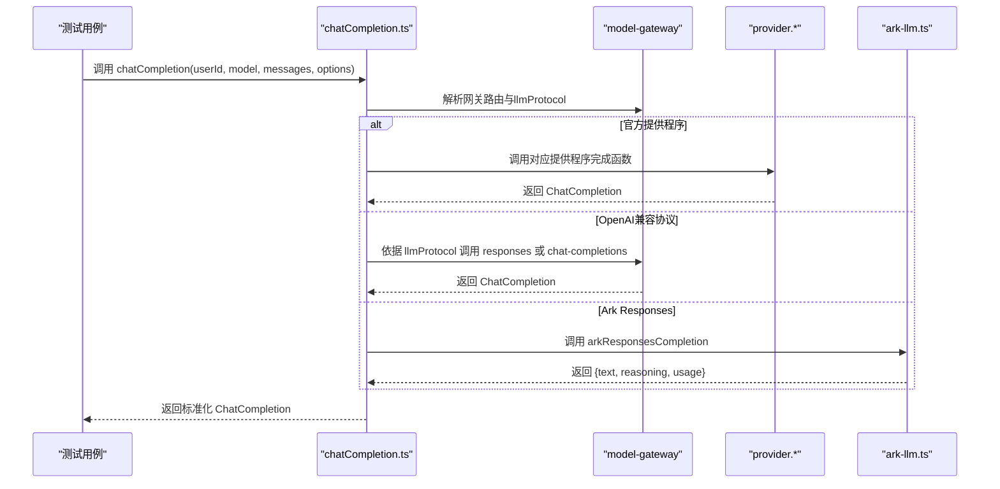

**图表来源**
- [src/lib/llm/chat-completion.ts:55-523](file://src/lib/llm/chat-completion.ts#L55-L523)
- [src/lib/ark-llm.ts:104-140](file://src/lib/ark-llm.ts#L104-L140)

**章节来源**
- [src/lib/llm/chat-completion.ts:55-523](file://src/lib/llm/chat-completion.ts#L55-L523)

## 详细组件分析

### 思维标签解析与推理链验证
- 思维标签解析
  - 支持<think>与<thinking>标签，提取其中的推理内容
  - 若未匹配到标签，则将完整内容作为文本部分
- 推理链验证
  - 通过测试断言推理与文本的分离正确性
  - 验证空响应与异常情况下的日志与错误抛出
- 输出格式测试
  - 统一返回{text, reasoning}结构，便于上层消费

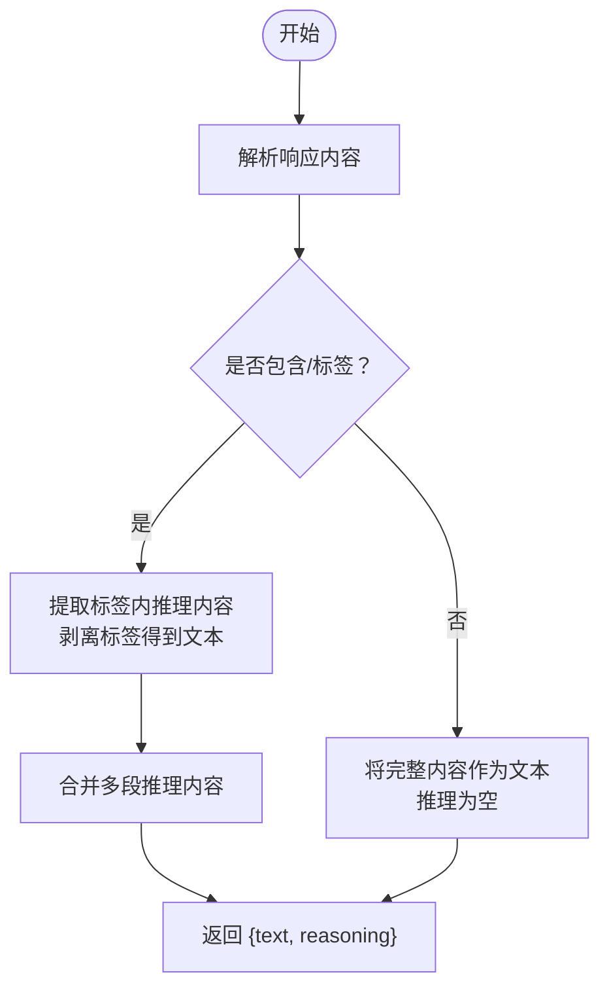

**图表来源**
- [src/lib/llm/utils.ts:3-26](file://src/lib/llm/utils.ts#L3-L26)
- [src/lib/llm/utils.ts:46-81](file://src/lib/llm/utils.ts#L46-L81)
- [src/lib/llm/completion-parts.ts:5-32](file://src/lib/llm/completion-parts.ts#L5-L32)

**章节来源**
- [tests/unit/llm/completion-parts-think-tag.test.ts:1-51](file://tests/unit/llm/completion-parts-think-tag.test.ts#L1-L51)
- [src/lib/llm/utils.ts:3-26](file://src/lib/llm/utils.ts#L3-L26)
- [src/lib/llm/utils.ts:46-81](file://src/lib/llm/utils.ts#L46-L81)
- [src/lib/llm/completion-parts.ts:5-32](file://src/lib/llm/completion-parts.ts#L5-L32)

### 推理能力检测与模型选择
- 能力检测
  - 识别可能具备推理能力的模型ID（如以特定前缀开头）
- 模型选择
  - 仅在OpenAI官方或OpenAI兼容且apiMode为openai-official时启用推理参数
  - 避免对不支持推理参数的提供程序造成空响应或错误

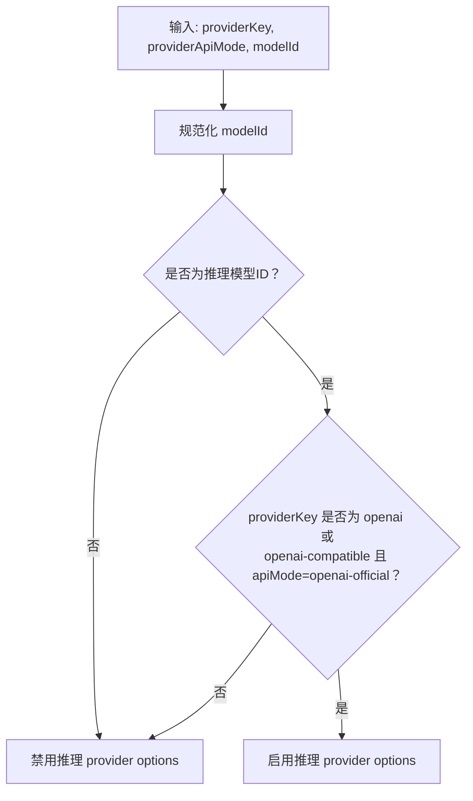

**图表来源**
- [src/lib/llm/reasoning-capability.ts:7-32](file://src/lib/llm/reasoning-capability.ts#L7-L32)

**章节来源**
- [tests/unit/llm/reasoning-capability.test.ts:1-42](file://tests/unit/llm/reasoning-capability.test.ts#L1-L42)
- [src/lib/llm/reasoning-capability.ts:7-32](file://src/lib/llm/reasoning-capability.ts#L7-L32)

### Ark LLM思维参数构建
- 思维参数构建
  - 仅发送thinking.type（enabled/disabled），避免向不兼容的模型传递thinking.effort
- 测试策略
  - 验证启用/禁用思维时生成的参数结构

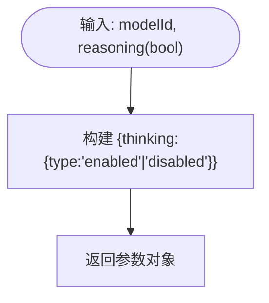

**图表来源**
- [src/lib/ark-llm.ts:197-204](file://src/lib/ark-llm.ts#L197-L204)

**章节来源**
- [tests/unit/llm/ark-llm-thinking.test.ts:1-23](file://tests/unit/llm/ark-llm-thinking.test.ts#L1-L23)
- [src/lib/ark-llm.ts:197-204](file://src/lib/ark-llm.ts#L197-L204)

### 聊天完成（官方提供程序）
- 测试要点
  - 确保官方提供程序分支被命中，且不会回退至baseUrl检查
  - 断言返回的choices与usage符合预期
- 关键断言
  - 官方提供程序函数被调用
  - OpenAI兼容执行器未被调用
  - 结果包含期望的文本内容与使用量统计

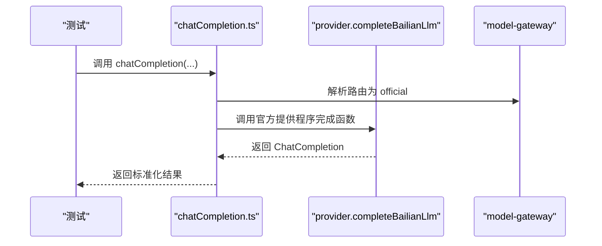

**图表来源**
- [tests/unit/llm/chat-completion-official-provider.test.ts:104-123](file://tests/unit/llm/chat-completion-official-provider.test.ts#L104-L123)
- [src/lib/llm/chat-completion.ts:245-279](file://src/lib/llm/chat-completion.ts#L245-L279)

**章节来源**
- [tests/unit/llm/chat-completion-official-provider.test.ts:1-125](file://tests/unit/llm/chat-completion-official-provider.test.ts#L1-L125)
- [src/lib/llm/chat-completion.ts:245-279](file://src/lib/llm/chat-completion.ts#L245-L279)

### 聊天完成（OpenAI兼容协议）
- 测试要点
  - 根据llmProtocol选择responses或chat-completions执行器
  - 缺少llmProtocol时快速失败并抛出指定错误
- 关键断言
  - 当llmProtocol=responses时调用responses执行器
  - 当llmProtocol=chat-completions时调用chat-completions执行器
  - 缺失llmProtocol时拒绝并抛出MODEL_LLM_PROTOCOL_REQUIRED

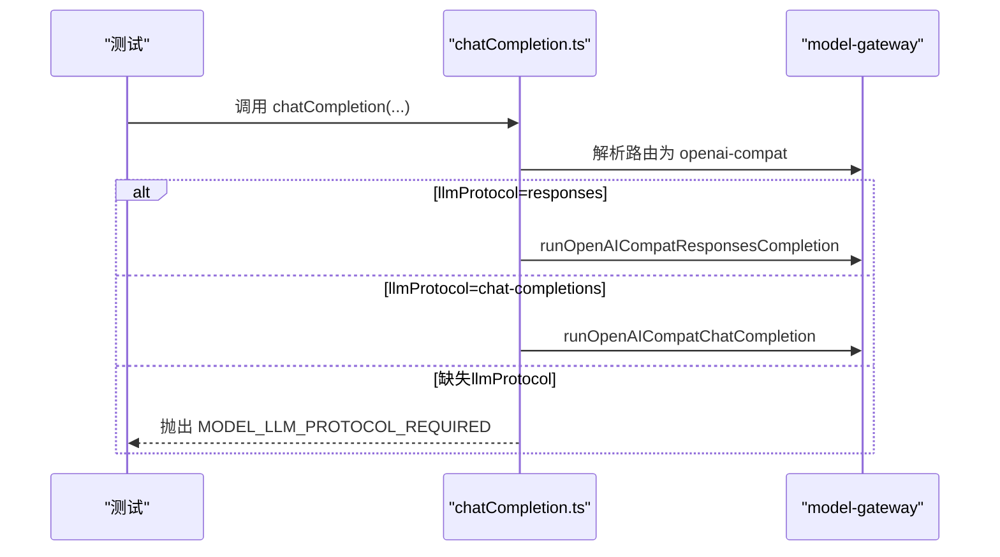

**图表来源**
- [tests/unit/llm/chat-completion-openai-compatible-protocol.test.ts:105-136](file://tests/unit/llm/chat-completion-openai-compatible-protocol.test.ts#L105-L136)
- [tests/unit/llm/chat-completion-openai-compatible-protocol.test.ts:138-157](file://tests/unit/llm/chat-completion-openai-compatible-protocol.test.ts#L138-L157)
- [src/lib/llm/chat-completion.ts:116-171](file://src/lib/llm/chat-completion.ts#L116-L171)

**章节来源**
- [tests/unit/llm/chat-completion-openai-compatible-protocol.test.ts:1-159](file://tests/unit/llm/chat-completion-openai-compatible-protocol.test.ts#L1-L159)
- [src/lib/llm/chat-completion.ts:116-171](file://src/lib/llm/chat-completion.ts#L116-L171)

### 聊天流式响应（官方提供程序）
- 测试要点
  - 官方提供程序分支下，流式响应会将完整结果转为文本增量并触发回调
  - 断言回调接收的增量类型与顺序
- 关键断言
  - 官方提供程序函数被调用
  - OpenAI兼容执行器未被调用
  - onComplete回调被触发，包含最终文本

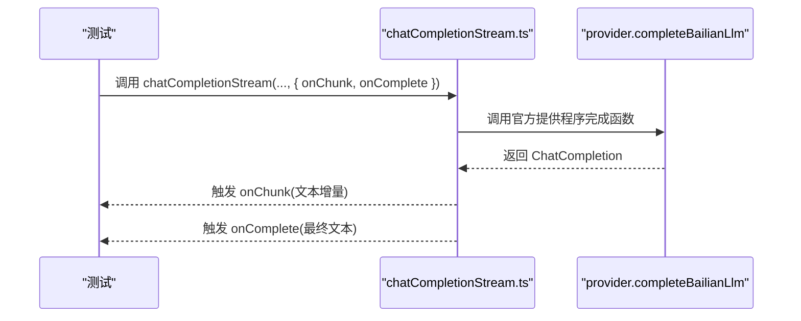

**图表来源**
- [tests/unit/llm/chat-stream-official-provider.test.ts:95-128](file://tests/unit/llm/chat-stream-official-provider.test.ts#L95-L128)
- [src/lib/llm/chat-stream.ts:282-326](file://src/lib/llm/chat-stream.ts#L282-L326)

**章节来源**
- [tests/unit/llm/chat-stream-official-provider.test.ts:1-130](file://tests/unit/llm/chat-stream-official-provider.test.ts#L1-L130)
- [src/lib/llm/chat-stream.ts:282-326](file://src/lib/llm/chat-stream.ts#L282-L326)

### 聊天流式响应（OpenAI兼容协议）
- 测试要点
  - 根据llmProtocol选择responses或chat-completions执行器
  - 缺少llmProtocol时快速失败并抛出指定错误
- 关键断言
  - responses执行器被调用时，chat-completions未被调用
  - chat-completions执行器被调用时，responses未被调用
  - 缺失llmProtocol时拒绝并抛出MODEL_LLM_PROTOCOL_REQUIRED

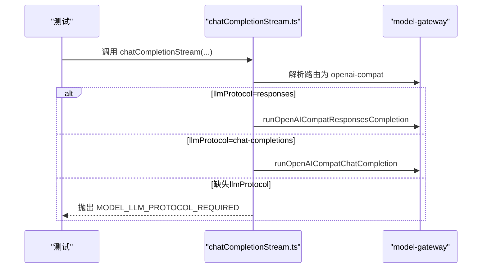

**图表来源**
- [tests/unit/llm/chat-stream-openai-compatible-protocol.test.ts:98-133](file://tests/unit/llm/chat-stream-openai-compatible-protocol.test.ts#L98-L133)
- [tests/unit/llm/chat-stream-openai-compatible-protocol.test.ts:135-155](file://tests/unit/llm/chat-stream-openai-compatible-protocol.test.ts#L135-L155)
- [src/lib/llm/chat-stream.ts:109-172](file://src/lib/llm/chat-stream.ts#L109-L172)

**章节来源**
- [tests/unit/llm/chat-stream-openai-compatible-protocol.test.ts:1-157](file://tests/unit/llm/chat-stream-openai-compatible-protocol.test.ts#L1-L157)
- [src/lib/llm/chat-stream.ts:109-172](file://src/lib/llm/chat-stream.ts#L109-L172)

### Ark Responses流式处理
- 测试要点
  - Ark Responses API支持reasoning与text两类增量事件
  - 流式完成后汇总usage并返回最终结果
- 关键断言
  - 流式事件包含reasoning与text增量
  - onComplete回调被触发，包含最终文本
  - usage被正确记录

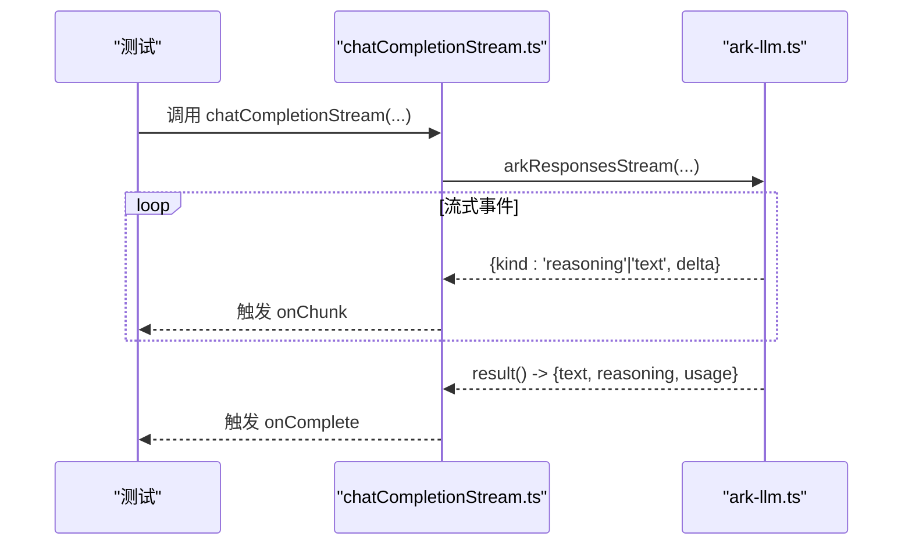

**图表来源**
- [src/lib/llm/chat-stream.ts:375-434](file://src/lib/llm/chat-stream.ts#L375-L434)
- [src/lib/ark-llm.ts:224-339](file://src/lib/ark-llm.ts#L224-L339)

**章节来源**
- [src/lib/llm/chat-stream.ts:375-434](file://src/lib/llm/chat-stream.ts#L375-L434)
- [src/lib/ark-llm.ts:224-339](file://src/lib/ark-llm.ts#L224-L339)

## 依赖关系分析
- 组件耦合
  - chat-completion.ts与chat-stream.ts共享推理能力判断、思维标签解析与输出格式化工具
  - Ark Responses API独立于通用路由，但最终统一为OpenAI兼容的ChatCompletion结构
- 外部依赖
  - OpenAI SDK、@ai-sdk/openai、Google GenAI等第三方库
  - model-gateway提供openai-compat执行器与路由解析

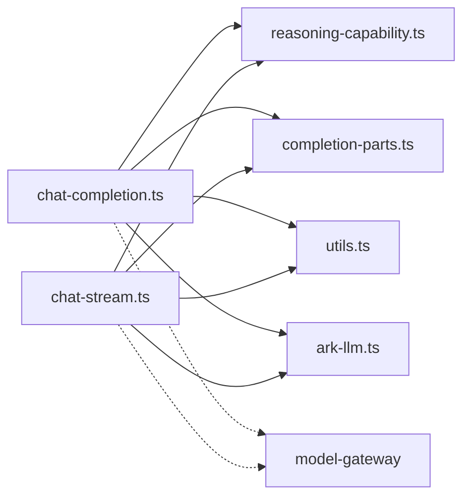

**图表来源**
- [src/lib/llm/chat-completion.ts:1-523](file://src/lib/llm/chat-completion.ts#L1-L523)
- [src/lib/llm/chat-stream.ts:1-800](file://src/lib/llm/chat-stream.ts#L1-L800)
- [src/lib/llm/reasoning-capability.ts:1-33](file://src/lib/llm/reasoning-capability.ts#L1-L33)
- [src/lib/llm/completion-parts.ts:1-33](file://src/lib/llm/completion-parts.ts#L1-L33)
- [src/lib/llm/utils.ts:1-149](file://src/lib/llm/utils.ts#L1-L149)
- [src/lib/ark-llm.ts:1-340](file://src/lib/ark-llm.ts#L1-L340)

**章节来源**
- [src/lib/llm/chat-completion.ts:1-523](file://src/lib/llm/chat-completion.ts#L1-L523)
- [src/lib/llm/chat-stream.ts:1-800](file://src/lib/llm/chat-stream.ts#L1-L800)

## 性能考量
- 重试机制
  - 对可重试错误按指数退避延迟重试，最大延迟上限控制资源占用
- 流式超时与节流
  - 使用withStreamChunkTimeout限制单个chunk处理时间，避免阻塞
  - 文本chunk按固定大小分片emit，降低UI渲染压力
- 使用量统计
  - 统一使用completionUsageSummary记录prompt与completion tokens，便于成本控制

**章节来源**
- [src/lib/llm/chat-completion.ts:513-522](file://src/lib/llm/chat-completion.ts#L513-L522)
- [src/lib/llm/chat-stream.ts:489-526](file://src/lib/llm/chat-stream.ts#L489-L526)
- [src/lib/llm/stream-helpers.ts:53-73](file://src/lib/llm/stream-helpers.ts#L53-L73)

## 故障排查指南
- 常见错误与定位
  - PROVIDER_BASE_URL_MISSING：提供程序未配置baseURL
  - MODEL_LLM_PROTOCOL_REQUIRED：OpenAI兼容模型缺少llmProtocol
  - ANALYSIS_MODEL_NOT_CONFIGURED：未配置分析模型
  - LLM_EMPTY_RESPONSE：AI SDK流式返回空内容
- 日志与诊断
  - llmLogger记录每次调用阶段、耗时与细节
  - 对空响应与错误chunk进行聚合诊断，包含finishReason、HTTP状态与未知chunk样本
- 恢复策略
  - 对Google空响应与可重试错误进行延迟重试
  - 在AI SDK推理参数导致空响应时，自动回退为非推理请求

**章节来源**
- [src/lib/llm/chat-completion.ts:362-522](file://src/lib/llm/chat-completion.ts#L362-L522)
- [src/lib/llm/chat-stream.ts:668-710](file://src/lib/llm/chat-stream.ts#L668-L710)
- [src/lib/llm/chat-stream.ts:600-665](file://src/lib/llm/chat-stream.ts#L600-L665)

## 结论
本测试文档系统性地梳理了LLM系统的单元测试策略，覆盖Ark思维参数、思维标签解析、推理能力检测、官方与OpenAI兼容协议的聊天完成与流式响应。通过mock外部依赖与断言关键行为，确保在多提供程序、多协议与多推理模式下的稳定性与一致性。建议持续补充边界条件与异常场景的测试用例，以进一步提升覆盖率与鲁棒性。

## 附录
- 测试用例清单
  - 思维标签解析：completion-parts-think-tag.test.ts
  - 推理能力检测：reasoning-capability.test.ts
  - Ark思维参数：ark-llm-thinking.test.ts
  - 官方提供程序聊天完成：chat-completion-official-provider.test.ts
  - OpenAI兼容协议聊天完成：chat-completion-openai-compatible-protocol.test.ts
  - 官方提供程序聊天流：chat-stream-official-provider.test.ts
  - OpenAI兼容协议聊天流：chat-stream-openai-compatible-protocol.test.ts