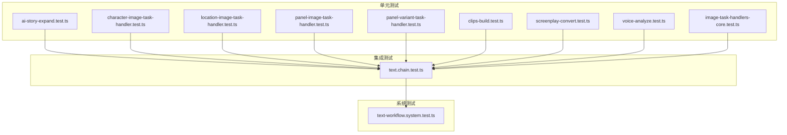
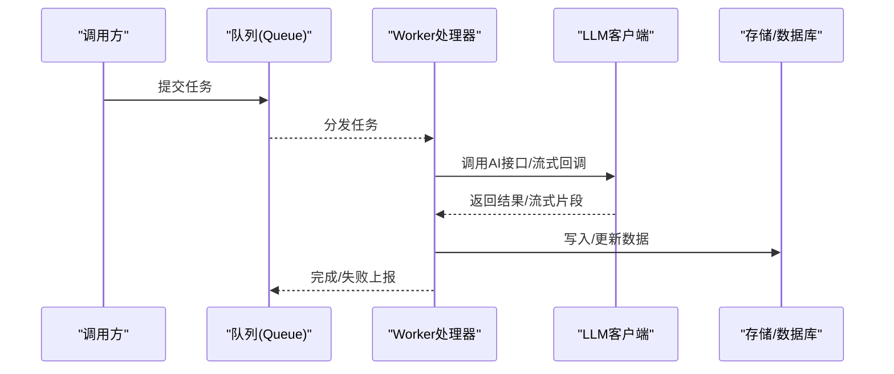
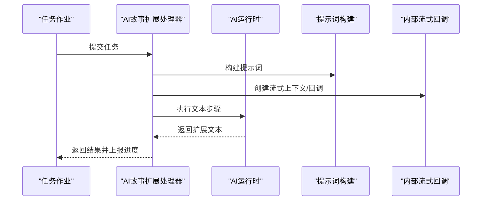
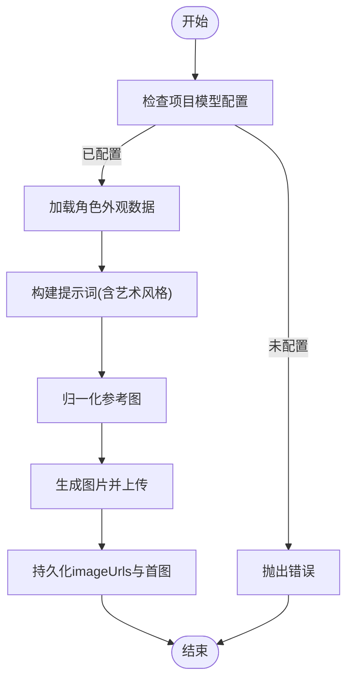
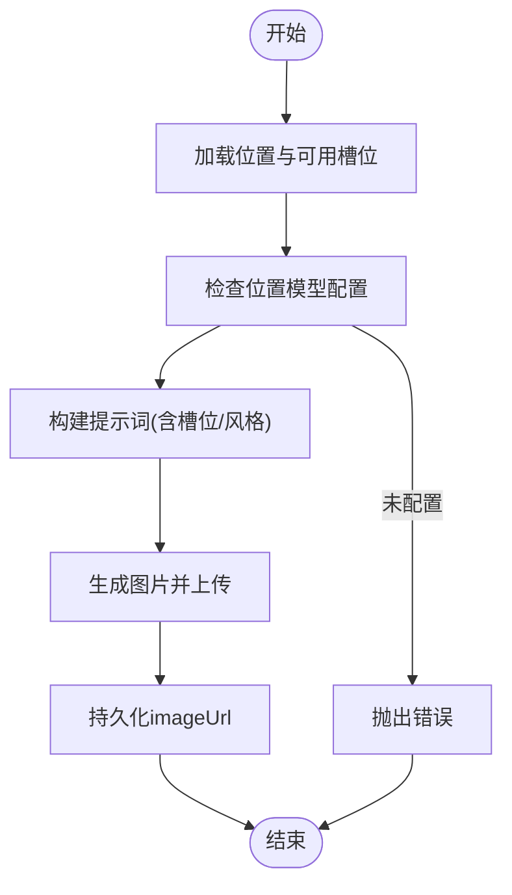
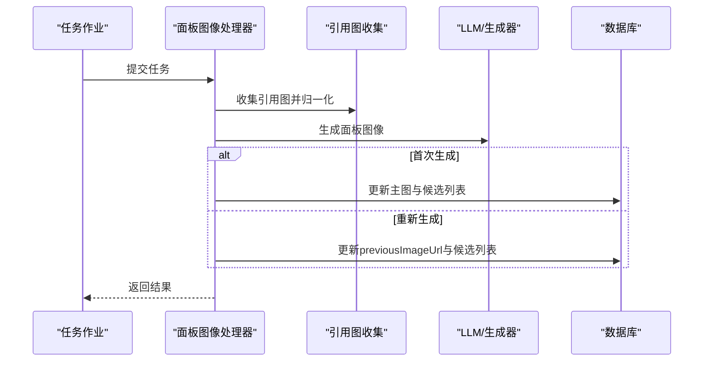
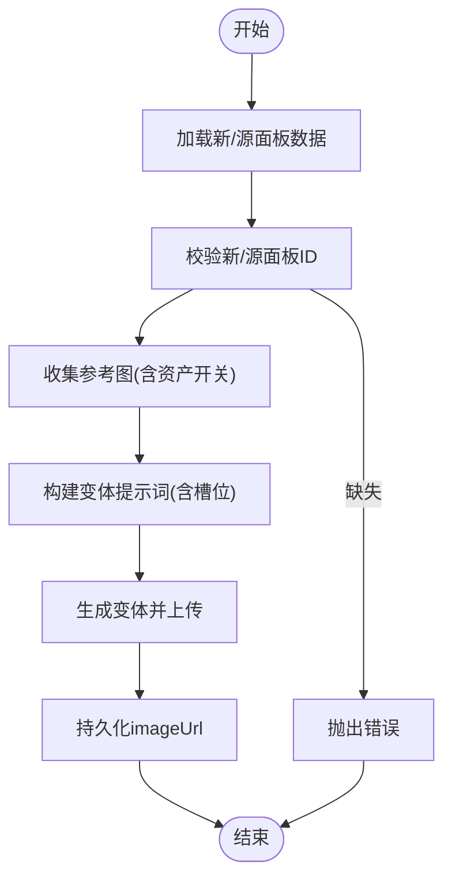
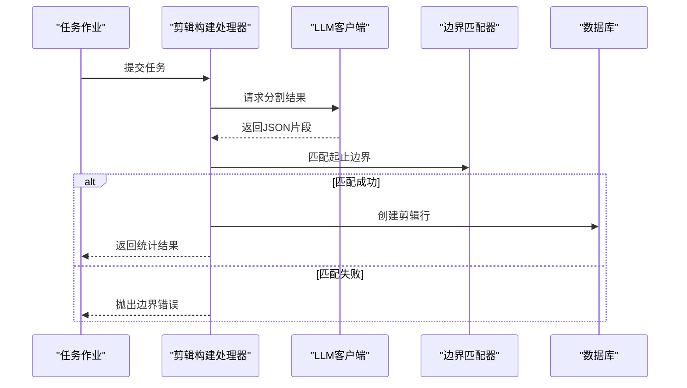
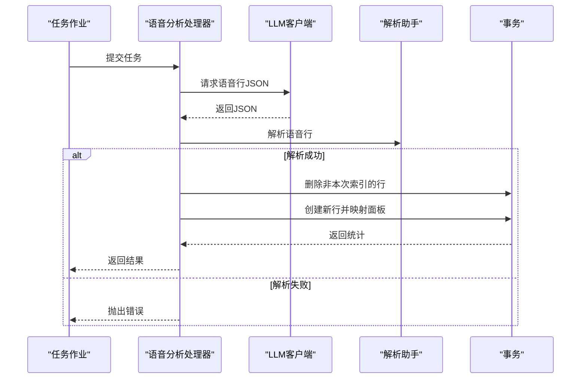
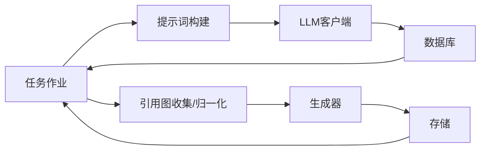

# Worker测试

<cite>
**本文引用的文件**
- [tests/unit/worker/ai-story-expand.test.ts](file://tests/unit/worker/ai-story-expand.test.ts)
- [tests/unit/worker/character-image-task-handler.test.ts](file://tests/unit/worker/character-image-task-handler.test.ts)
- [tests/unit/worker/location-image-task-handler.test.ts](file://tests/unit/worker/location-image-task-handler.test.ts)
- [tests/unit/worker/panel-image-task-handler.test.ts](file://tests/unit/worker/panel-image-task-handler.test.ts)
- [tests/unit/worker/panel-variant-task-handler.test.ts](file://tests/unit/worker/panel-variant-task-handler.test.ts)
- [tests/unit/worker/clips-build.test.ts](file://tests/unit/worker/clips-build.test.ts)
- [tests/unit/worker/screenplay-convert.test.ts](file://tests/unit/worker/screenplay-convert.test.ts)
- [tests/unit/worker/voice-analyze.test.ts](file://tests/unit/worker/voice-analyze.test.ts)
- [tests/unit/worker/image-task-handlers-core.test.ts](file://tests/unit/worker/image-task-handlers-core.test.ts)
- [tests/unit/worker/image-worker.test.ts](file://tests/unit/worker/image-worker.test.ts)
- [tests/unit/worker/voice-worker.test.ts](file://tests/unit/worker/voice-worker.test.ts)
- [tests/unit/worker/video-worker.test.ts](file://tests/unit/worker/video-worker.test.ts)
- [tests/unit/worker/llm-stream.test.ts](file://tests/unit/worker/llm-stream.test.ts)
- [tests/unit/worker/llm-proxy.test.ts](file://tests/unit/worker/llm-proxy.test.ts)
- [tests/unit/worker/resolve-analysis-model.test.ts](file://tests/unit/worker/resolve-analysis-model.test.ts)
- [tests/unit/worker/user-concurrency-gate.test.ts](file://tests/unit/worker/user-concurrency-gate.test.ts)
- [tests/unit/worker/shot-ai-tasks.test.ts](file://tests/unit/worker/shot-ai-tasks.test.ts)
- [tests/unit/worker/shot-ai-variants.test.ts](file://tests/unit/worker/shot-ai-variants.test.ts)
- [tests/unit/worker/shot-ai-prompt-appearance.test.ts](file://tests/unit/worker/shot-ai-prompt-appearance.test.ts)
- [tests/unit/worker/shot-ai-prompt-location.test.ts](file://tests/unit/worker/shot-ai-prompt-location.test.ts)
- [tests/unit/worker/shot-ai-prompt-shot.test.ts](file://tests/unit/worker/shot-ai-prompt-shot.test.ts)
- [tests/unit/worker/reference-to-character.test.ts](file://tests/unit/worker/reference-to-character.test.ts)
- [tests/unit/worker/modify-image-reference-description.test.ts](file://tests/unit/worker/modify-image-reference-description.test.ts)
- [tests/unit/worker/asset-hub-ai-design.test.ts](file://tests/unit/worker/asset-hub-ai-design.test.ts)
- [tests/unit/worker/asset-hub-ai-modify.test.ts](file://tests/unit/worker/asset-hub-ai-modify.test.ts)
- [tests/unit/worker/asset-hub-image-suffix.test.ts](file://tests/unit/worker/asset-hub-image-suffix.test.ts)
- [tests/unit/worker/analyze-novel.test.ts](file://tests/unit/worker/analyze-novel.test.ts)
- [tests/unit/worker/analyze-global.test.ts](file://tests/unit/worker/analyze-global.test.ts)
- [tests/unit/worker/episode-split.test.ts](file://tests/unit/worker/episode-split.test.ts)
- [tests/unit/worker/story-to-script.test.ts](file://tests/unit/worker/story-to-script.test.ts)
- [tests/unit/worker/story-to-script-orchestrator.retry.test.ts](file://tests/unit/worker/story-to-script-orchestrator.retry.test.ts)
- [tests/unit/worker/script-to-storyboard.test.ts](file://tests/unit/worker/script-to-storyboard.test.ts)
- [tests/unit/worker/script-to-storyboard-atomic-retry.test.ts](file://tests/unit/worker/script-to-storyboard-atomic-retry.test.ts)
- [tests/unit/worker/script-to-storyboard-orchestrator.retry.test.ts](file://tests/unit/worker/script-to-storyboard-orchestrator.retry.test.ts)
- [tests/unit/worker/voice-line-parse-helpers.test.ts](file://tests/unit/worker/voice-line-parse-helpers.test.ts)
- [tests/unit/worker/voice-design.test.ts](file://tests/unit/worker/voice-design.test.ts)
- [tests/unit/worker/voice-generation-resume.test.ts](file://tests/unit/worker/voice-generation-resume.test.ts)
- [tests/unit/worker/character-profile.test.ts](file://tests/unit/worker/character-profile.test.ts)
- [tests/unit/worker/shared.direct-run-events.test.ts](file://tests/unit/worker/shared.direct-run-events.test.ts)
- [tests/integration/chain/text.chain.test.ts](file://tests/integration/chain/text.chain.test.ts)
- [tests/system/text-workflow.system.test.ts](file://tests/system/text-workflow.system.test.ts)
- [tests/unit/generators/fal-video-kling-presets.test.ts](file://tests/unit/generators/fal-video-kling-presets.test.ts)
</cite>

## 目录
1. [简介](#简介)
2. [项目结构](#项目结构)
3. [核心组件](#核心组件)
4. [架构总览](#架构总览)
5. [详细组件分析](#详细组件分析)
6. [依赖关系分析](#依赖关系分析)
7. [性能考虑](#性能考虑)
8. [故障排查指南](#故障排查指南)
9. [结论](#结论)
10. [附录](#附录)

## 简介
本文件面向Worker系统的单元测试，围绕以下目标展开：
- AI故事扩展开发的测试策略：文本生成、内容质量与性能测试
- 角色图像任务处理器的测试：图像生成、质量评估与错误处理
- 位置图像、面板图像与面板变体任务处理器的测试：任务执行、状态更新与结果验证
- 剪辑构建、剧本转换与语音分析的测试：集成测试、性能与稳定性验证

测试覆盖了从单测到集成测试再到系统级工作流验证的多层保障，确保Worker在真实业务场景中的正确性、鲁棒性与可维护性。

## 项目结构
Worker相关测试主要集中在 tests/unit/worker 与 tests/integration/chain、tests/system 下，分别对应：
- 单元测试：针对具体Worker处理器的行为与边界条件
- 集成测试：验证队列调度、任务链路与跨模块协作
- 系统测试：端到端工作流验证，含重试、失败恢复与事件生命周期



图表来源
- [tests/unit/worker/ai-story-expand.test.ts:1-85](file://tests/unit/worker/ai-story-expand.test.ts#L1-L85)
- [tests/unit/worker/character-image-task-handler.test.ts:1-179](file://tests/unit/worker/character-image-task-handler.test.ts#L1-L179)
- [tests/unit/worker/location-image-task-handler.test.ts:1-190](file://tests/unit/worker/location-image-task-handler.test.ts#L1-L190)
- [tests/unit/worker/panel-image-task-handler.test.ts:1-218](file://tests/unit/worker/panel-image-task-handler.test.ts#L1-L218)
- [tests/unit/worker/panel-variant-task-handler.test.ts:1-226](file://tests/unit/worker/panel-variant-task-handler.test.ts#L1-L226)
- [tests/unit/worker/clips-build.test.ts:1-162](file://tests/unit/worker/clips-build.test.ts#L1-L162)
- [tests/unit/worker/screenplay-convert.test.ts:1-141](file://tests/unit/worker/screenplay-convert.test.ts#L1-L141)
- [tests/unit/worker/voice-analyze.test.ts:1-230](file://tests/unit/worker/voice-analyze.test.ts#L1-L230)
- [tests/unit/worker/image-task-handlers-core.test.ts:1-211](file://tests/unit/worker/image-task-handlers-core.test.ts#L1-L211)
- [tests/integration/chain/text.chain.test.ts:1-209](file://tests/integration/chain/text.chain.test.ts#L1-L209)
- [tests/system/text-workflow.system.test.ts:1-353](file://tests/system/text-workflow.system.test.ts#L1-L353)

章节来源
- [tests/unit/worker/ai-story-expand.test.ts:1-85](file://tests/unit/worker/ai-story-expand.test.ts#L1-L85)
- [tests/integration/chain/text.chain.test.ts:1-209](file://tests/integration/chain/text.chain.test.ts#L1-L209)
- [tests/system/text-workflow.system.test.ts:1-353](file://tests/system/text-workflow.system.test.ts#L1-L353)

## 核心组件
- 文本类Worker：AI故事扩展、剧本文本拆分、故事到脚本、脚本到故事板等
- 图像类Worker：角色/位置/面板/面板变体/修改图像等
- 语音类Worker：语音分析、语音设计、语音生成与恢复
- 辅助能力：LLM流式回调、模型解析、并发门控、提示词构建等

章节来源
- [tests/unit/worker/ai-story-expand.test.ts:1-85](file://tests/unit/worker/ai-story-expand.test.ts#L1-L85)
- [tests/unit/worker/character-image-task-handler.test.ts:1-179](file://tests/unit/worker/character-image-task-handler.test.ts#L1-L179)
- [tests/unit/worker/location-image-task-handler.test.ts:1-190](file://tests/unit/worker/location-image-task-handler.test.ts#L1-L190)
- [tests/unit/worker/panel-image-task-handler.test.ts:1-218](file://tests/unit/worker/panel-image-task-handler.test.ts#L1-L218)
- [tests/unit/worker/panel-variant-task-handler.test.ts:1-226](file://tests/unit/worker/panel-variant-task-handler.test.ts#L1-L226)
- [tests/unit/worker/clips-build.test.ts:1-162](file://tests/unit/worker/clips-build.test.ts#L1-L162)
- [tests/unit/worker/screenplay-convert.test.ts:1-141](file://tests/unit/worker/screenplay-convert.test.ts#L1-L141)
- [tests/unit/worker/voice-analyze.test.ts:1-230](file://tests/unit/worker/voice-analyze.test.ts#L1-L230)
- [tests/unit/worker/image-task-handlers-core.test.ts:1-211](file://tests/unit/worker/image-task-handlers-core.test.ts#L1-L211)

## 架构总览
Worker测试采用“单测驱动+集成验证+系统闭环”的三层策略：
- 单测：隔离外部依赖，通过Mock验证处理器输入校验、提示词构造、生成选项与持久化逻辑
- 集成：验证队列调度、任务链路与跨模块协作（如Prisma、LLM客户端、存储）
- 系统：端到端工作流，包含重试、失败恢复与事件生命周期验证



图表来源
- [tests/integration/chain/text.chain.test.ts:100-209](file://tests/integration/chain/text.chain.test.ts#L100-L209)
- [tests/system/text-workflow.system.test.ts:185-353](file://tests/system/text-workflow.system.test.ts#L185-L353)

## 详细组件分析

### AI故事扩展测试策略
- 测试要点
  - 输入校验：缺失提示词或分析模型时抛出明确错误
  - 成功路径：调用AI运行时执行文本步骤，返回扩展文本；不触碰剧集持久化
  - 提示词构建：基于i18n与模板构建，参数传递正确
  - 进度上报与任务存活：通过内部流式上下文与进度上报钩子进行行为验证



图表来源
- [tests/unit/worker/ai-story-expand.test.ts:55-85](file://tests/unit/worker/ai-story-expand.test.ts#L55-L85)

章节来源
- [tests/unit/worker/ai-story-expand.test.ts:1-85](file://tests/unit/worker/ai-story-expand.test.ts#L1-L85)

### 角色图像任务处理器测试
- 测试要点
  - 模型配置校验：项目未配置角色模型时抛错
  - 成功路径：使用主外观作为参考图，按艺术风格拼接提示词，生成并持久化图片URL列表
  - 艺术风格覆盖：payload优先于项目配置；非法风格抛错
  - 批量生成：按count扩展imageUrls并保持首张为主图
  - 参考图归一化与签名URL处理



图表来源
- [tests/unit/worker/character-image-task-handler.test.ts:67-179](file://tests/unit/worker/character-image-task-handler.test.ts#L67-L179)

章节来源
- [tests/unit/worker/character-image-task-handler.test.ts:1-179](file://tests/unit/worker/character-image-task-handler.test.ts#L1-L179)

### 位置图像任务处理器测试
- 测试要点
  - 模型配置校验：项目未配置位置模型时抛错
  - 成功路径：根据可用槽位与场景描述构建提示词，生成全景构图并持久化
  - 艺术风格覆盖：payload优先；非法风格抛错
  - 多槽位与计数控制：尊重请求计数，限制生成数量
  - 属性图比例：属性图使用与角色一致的宽高比



图表来源
- [tests/unit/worker/location-image-task-handler.test.ts:57-190](file://tests/unit/worker/location-image-task-handler.test.ts#L57-L190)

章节来源
- [tests/unit/worker/location-image-task-handler.test.ts:1-190](file://tests/unit/worker/location-image-task-handler.test.ts#L1-L190)

### 面板图像任务处理器测试
- 测试要点
  - 必填校验：缺少panelId抛错
  - 首次生成：持久化主图与候选列表
  - 重新生成：保留旧图至previousImageUrl，仅写入候选
  - 引用图收集与归一化：结合小说数据与参考图
  - 提示词变量：包含槽位与可用槽位信息



图表来源
- [tests/unit/worker/panel-image-task-handler.test.ts:97-218](file://tests/unit/worker/panel-image-task-handler.test.ts#L97-L218)

章节来源
- [tests/unit/worker/panel-image-task-handler.test.ts:1-218](file://tests/unit/worker/panel-image-task-handler.test.ts#L1-L218)

### 面板变体任务处理器测试
- 测试要点
  - 必填校验：缺少新/源面板ID抛错
  - 成功路径：将源面板图像与角色/场景资产加入参考图，生成变体并持久化
  - 资产开关：支持关闭角色/场景资产，提示词中体现
  - 国际化槽位标签：英文提示词使用英文槽位表达



图表来源
- [tests/unit/worker/panel-variant-task-handler.test.ts:94-226](file://tests/unit/worker/panel-variant-task-handler.test.ts#L94-L226)

章节来源
- [tests/unit/worker/panel-variant-task-handler.test.ts:1-226](file://tests/unit/worker/panel-variant-task-handler.test.ts#L1-L226)

### 剪辑构建测试
- 测试要点
  - 必填校验：缺少episodeId抛错
  - 成功路径：调用LLM分割文本，匹配边界并创建剪辑行
  - 边界匹配失败：抛出明确错误，避免脏数据



图表来源
- [tests/unit/worker/clips-build.test.ts:84-162](file://tests/unit/worker/clips-build.test.ts#L84-L162)

章节来源
- [tests/unit/worker/clips-build.test.ts:1-162](file://tests/unit/worker/clips-build.test.ts#L1-L162)

### 剧本转换测试
- 测试要点
  - 必填校验：缺少episodeId抛错
  - 成功路径：读取剪辑内容，调用LLM转换为剧本JSON并写回
  - 解析失败：抛出带前缀的部分失败错误码

```mermaid
flowchart TD
Start(["开始"]) --> LoadData["加载项目/剧集/剪辑数据"]
LoadData --> CallLLM["调用LLM转换为剧本JSON"]
CallLLM --> Parse["解析JSON"]
alt 解析成功
Parse --> WriteBack["写回剪辑的screenplay字段"]
WriteBack --> End(["结束"])
else 解析失败
Parse --> Err["抛出部分失败错误"]
Err --> End
end
```

图表来源
- [tests/unit/worker/screenplay-convert.test.ts:75-141](file://tests/unit/worker/screenplay-convert.test.ts#L75-L141)

章节来源
- [tests/unit/worker/screenplay-convert.test.ts:1-141](file://tests/unit/worker/screenplay-convert.test.ts#L1-L141)

### 语音分析测试
- 测试要点
  - 必填校验：缺少episodeId抛错
  - 成功路径：解析语音行，事务写入voiceLine并映射面板ID，统计说话人分布
  - 空结果：清空历史并返回零统计
  - 面板引用校验：引用不存在面板时抛错



图表来源
- [tests/unit/worker/voice-analyze.test.ts:79-230](file://tests/unit/worker/voice-analyze.test.ts#L79-L230)

章节来源
- [tests/unit/worker/voice-analyze.test.ts:1-230](file://tests/unit/worker/voice-analyze.test.ts#L1-L230)

### 修改图像任务处理器核心测试
- 测试要点
  - 必填校验：缺少类型/修改提示词抛错
  - 位置/属性图：使用统一宽高比与分辨率，合并参考图
  - 故事板面板：保留候选列表为空，记录前后图像
  - 引用图归一化与Base64处理

章节来源
- [tests/unit/worker/image-task-handlers-core.test.ts:1-211](file://tests/unit/worker/image-task-handlers-core.test.ts#L1-L211)

### Worker通用能力测试
- LLM流式回调与代理：验证内部流式上下文与回调行为
- 模型解析与并发门控：验证分析模型解析与用户并发限制
- 射击AI提示词：验证外观/地点/镜头提示词构建
- 参考转角色：验证参考图到角色画像流程
- 语音行解析辅助：验证语音行解析工具

章节来源
- [tests/unit/worker/llm-stream.test.ts](file://tests/unit/worker/llm-stream.test.ts)
- [tests/unit/worker/llm-proxy.test.ts](file://tests/unit/worker/llm-proxy.test.ts)
- [tests/unit/worker/resolve-analysis-model.test.ts](file://tests/unit/worker/resolve-analysis-model.test.ts)
- [tests/unit/worker/user-concurrency-gate.test.ts](file://tests/unit/worker/user-concurrency-gate.test.ts)
- [tests/unit/worker/shot-ai-tasks.test.ts](file://tests/unit/worker/shot-ai-tasks.test.ts)
- [tests/unit/worker/shot-ai-variants.test.ts](file://tests/unit/worker/shot-ai-variants.test.ts)
- [tests/unit/worker/shot-ai-prompt-appearance.test.ts](file://tests/unit/worker/shot-ai-prompt-appearance.test.ts)
- [tests/unit/worker/shot-ai-prompt-location.test.ts](file://tests/unit/worker/shot-ai-prompt-location.test.ts)
- [tests/unit/worker/shot-ai-prompt-shot.test.ts](file://tests/unit/worker/shot-ai-prompt-shot.test.ts)
- [tests/unit/worker/reference-to-character.test.ts](file://tests/unit/worker/reference-to-character.test.ts)
- [tests/unit/worker/modify-image-reference-description.test.ts](file://tests/unit/worker/modify-image-reference-description.test.ts)
- [tests/unit/worker/asset-hub-ai-design.test.ts](file://tests/unit/worker/asset-hub-ai-design.test.ts)
- [tests/unit/worker/asset-hub-ai-modify.test.ts](file://tests/unit/worker/asset-hub-ai-modify.test.ts)
- [tests/unit/worker/asset-hub-image-suffix.test.ts](file://tests/unit/worker/asset-hub-image-suffix.test.ts)

## 依赖关系分析
- Mock策略
  - 外部服务：LLM客户端、存储、媒体归一化、Prisma等均通过hoisted+vi.mock进行隔离
  - 内部模块：通过动态导入与部分替换，确保测试聚焦目标处理器
- 关键依赖链
  - 文本类：任务作业 → 提示词构建 → LLM客户端 → 数据库/存储
  - 图像类：任务作业 → 引用图收集/归一化 → 生成器 → 存储/数据库
  - 语音类：任务作业 → LLM客户端 → 解析助手 → 事务写入



图表来源
- [tests/unit/worker/ai-story-expand.test.ts:17-36](file://tests/unit/worker/ai-story-expand.test.ts#L17-L36)
- [tests/unit/worker/character-image-task-handler.test.ts:35-47](file://tests/unit/worker/character-image-task-handler.test.ts#L35-L47)
- [tests/unit/worker/panel-image-task-handler.test.ts:64-77](file://tests/unit/worker/panel-image-task-handler.test.ts#L64-L77)

章节来源
- [tests/unit/worker/ai-story-expand.test.ts:1-85](file://tests/unit/worker/ai-story-expand.test.ts#L1-L85)
- [tests/unit/worker/character-image-task-handler.test.ts:1-179](file://tests/unit/worker/character-image-task-handler.test.ts#L1-L179)
- [tests/unit/worker/panel-image-task-handler.test.ts:1-218](file://tests/unit/worker/panel-image-task-handler.test.ts#L1-L218)

## 性能考虑
- 单测层面
  - 使用Mock减少I/O与网络延迟，提升测试执行速度
  - 合理设置超时与断言粒度，避免长尾用例拖慢套件
- 集成与系统测试
  - 通过队列与任务生命周期验证，发现潜在阻塞点与资源竞争
  - 结合重试与失败恢复，验证系统在异常情况下的自愈能力

章节来源
- [tests/integration/chain/text.chain.test.ts:100-209](file://tests/integration/chain/text.chain.test.ts#L100-L209)
- [tests/system/text-workflow.system.test.ts:185-353](file://tests/system/text-workflow.system.test.ts#L185-L353)

## 故障排查指南
- 常见错误与定位
  - 缺少必填参数：检查任务payload与校验分支
  - 提示词构建失败：核对i18n模板ID与变量注入
  - 生成失败：确认模型配置、参考图归一化与签名URL
  - 数据持久化异常：检查事务写入与where条件
- 排查步骤
  - 单测：逐条断言定位失败点，缩小到具体模块
  - 集成：观察队列调度与任务事件，确认链路完整性
  - 系统：启用日志与事件追踪，复现失败场景并抓取上下文

章节来源
- [tests/unit/worker/ai-story-expand.test.ts:60-68](file://tests/unit/worker/ai-story-expand.test.ts#L60-L68)
- [tests/unit/worker/character-image-task-handler.test.ts:90-93](file://tests/unit/worker/character-image-task-handler.test.ts#L90-L93)
- [tests/unit/worker/location-image-task-handler.test.ts:89-92](file://tests/unit/worker/location-image-task-handler.test.ts#L89-L92)
- [tests/unit/worker/panel-image-task-handler.test.ts:128-131](file://tests/unit/worker/panel-image-task-handler.test.ts#L128-L131)
- [tests/unit/worker/panel-variant-task-handler.test.ts:124-127](file://tests/unit/worker/panel-variant-task-handler.test.ts#L124-L127)
- [tests/unit/worker/clips-build.test.ts:118-121](file://tests/unit/worker/clips-build.test.ts#L118-L121)
- [tests/unit/worker/screenplay-convert.test.ts:103-106](file://tests/unit/worker/screenplay-convert.test.ts#L103-L106)
- [tests/unit/worker/voice-analyze.test.ts:158-161](file://tests/unit/worker/voice-analyze.test.ts#L158-L161)

## 结论
本测试体系通过“单测-集成-系统”三层验证，覆盖Worker在文本生成、图像生成与语音分析等关键路径上的正确性、健壮性与稳定性。建议持续完善以下方面：
- 补充更多边界与异常场景的单测
- 在集成测试中增加并发与资源竞争场景
- 在系统测试中引入压力与混沌测试，验证极限条件下的表现

## 附录
- 相关生成器与视频预设测试：验证不同模型与端点的提交行为与负载差异

章节来源
- [tests/unit/generators/fal-video-kling-presets.test.ts:1-95](file://tests/unit/generators/fal-video-kling-presets.test.ts#L1-L95)