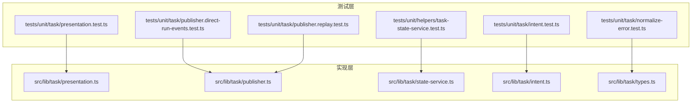
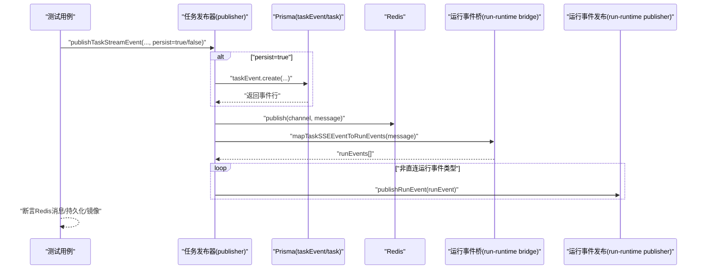
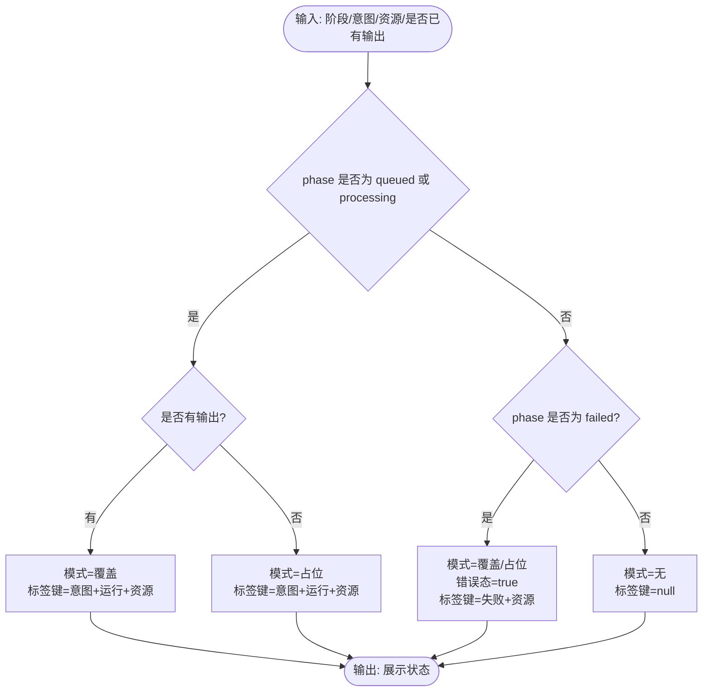
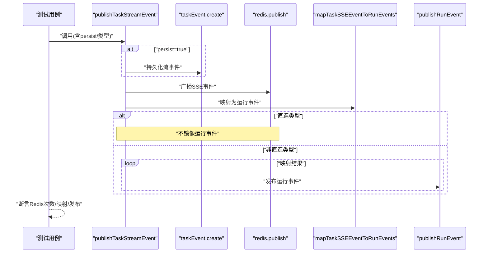
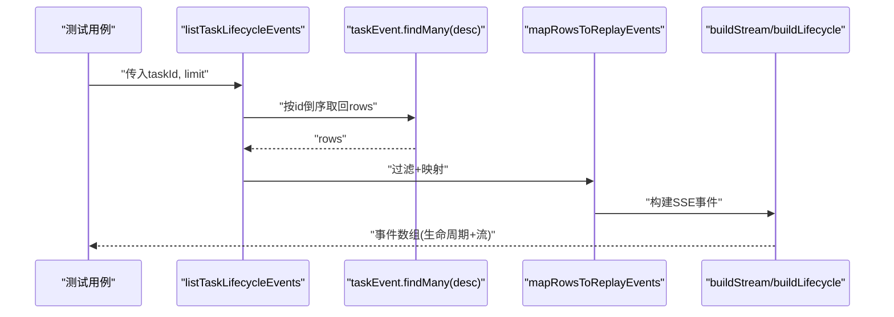
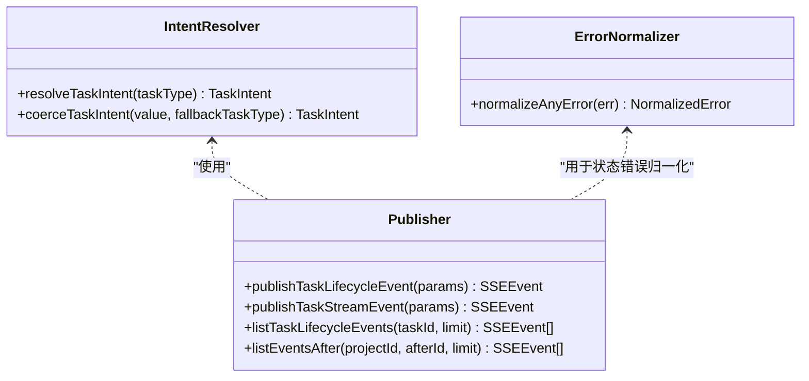
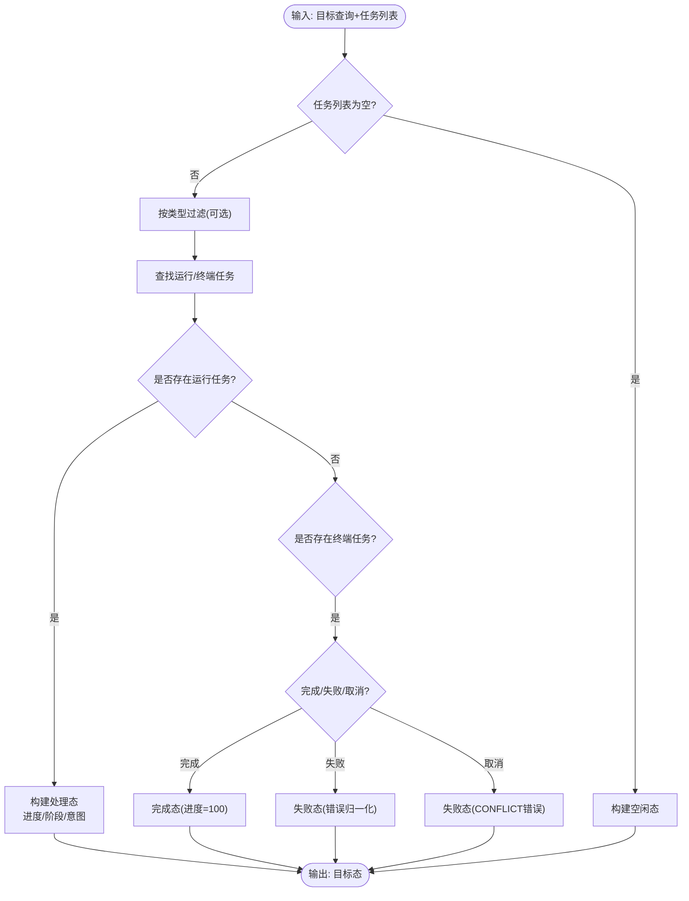
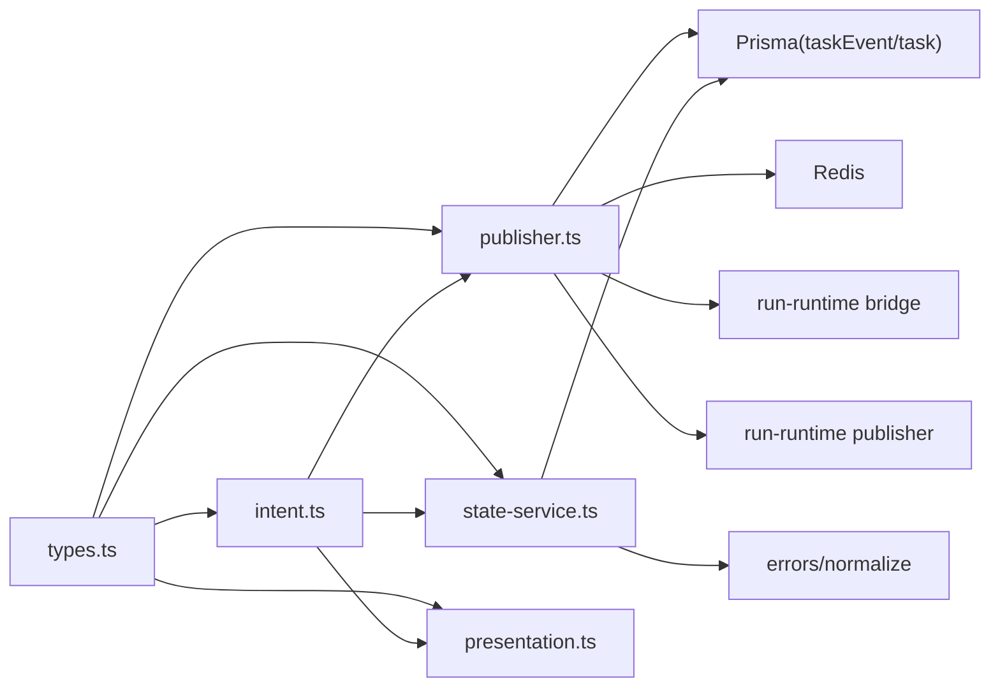

# 任务测试

<cite>
**本文引用的文件**
- [presentation.test.ts](file://tests/unit/task/presentation.test.ts)
- [publisher.direct-run-events.test.ts](file://tests/unit/task/publisher.direct-run-events.test.ts)
- [publisher.replay.test.ts](file://tests/unit/task/publisher.replay.test.ts)
- [intent.test.ts](file://tests/unit/task/intent.test.ts)
- [normalize-error.test.ts](file://tests/unit/task/normalize-error.test.ts)
- [task-state-service.test.ts](file://tests/unit/helpers/task-state-service.test.ts)
- [presentation.ts](file://src/lib/task/presentation.ts)
- [publisher.ts](file://src/lib/task/publisher.ts)
- [state-service.ts](file://src/lib/task/state-service.ts)
- [intent.ts](file://src/lib/task/intent.ts)
- [types.ts](file://src/lib/task/types.ts)
</cite>

## 目录
1. [引言](#引言)
2. [项目结构](#项目结构)
3. [核心组件](#核心组件)
4. [架构总览](#架构总览)
5. [详细组件分析](#详细组件分析)
6. [依赖关系分析](#依赖关系分析)
7. [性能考量](#性能考量)
8. [故障排查指南](#故障排查指南)
9. [结论](#结论)
10. [附录](#附录)

## 引言
本文件面向任务系统的单元测试，系统性梳理以下主题：
- 任务展示逻辑的测试策略：状态显示、进度更新与用户交互映射
- 直接运行事件发布者的测试方法：事件触发、消息传递与错误处理
- 任务意图、观察者合约与规范化错误的测试策略：任务创建、状态变更与异常处理
- 任务发布者重放与任务状态服务的测试用例：历史事件重放、状态恢复与一致性验证

目标是帮助开发者快速理解测试覆盖点、边界条件与关键流程，并提供可复用的测试设计思路。

## 项目结构
任务测试主要分布在 tests/unit/task 与 tests/unit/helpers 下，分别覆盖：
- 展示层逻辑与发布器行为
- 任务意图解析与错误归一化
- 状态服务与目标态解析

图表来源
- [presentation.test.ts:1-39](file://tests/unit/task/presentation.test.ts#L1-L39)
- [publisher.direct-run-events.test.ts:1-129](file://tests/unit/task/publisher.direct-run-events.test.ts#L1-L129)
- [publisher.replay.test.ts:1-232](file://tests/unit/task/publisher.replay.test.ts#L1-L232)
- [intent.test.ts:1-25](file://tests/unit/task/intent.test.ts#L1-L25)
- [normalize-error.test.ts:1-66](file://tests/unit/task/normalize-error.test.ts#L1-L66)
- [task-state-service.test.ts:1-106](file://tests/unit/helpers/task-state-service.test.ts#L1-L106)
- [presentation.ts:1-66](file://src/lib/task/presentation.ts#L1-L66)
- [publisher.ts:1-391](file://src/lib/task/publisher.ts#L1-L391)
- [state-service.ts:1-288](file://src/lib/task/state-service.ts#L1-L288)
- [intent.ts:1-83](file://src/lib/task/intent.ts#L1-L83)
- [types.ts:1-159](file://src/lib/task/types.ts#L1-L159)

章节来源
- [presentation.test.ts:1-39](file://tests/unit/task/presentation.test.ts#L1-L39)
- [publisher.direct-run-events.test.ts:1-129](file://tests/unit/task/publisher.direct-run-events.test.ts#L1-L129)
- [publisher.replay.test.ts:1-232](file://tests/unit/task/publisher.replay.test.ts#L1-L232)
- [intent.test.ts:1-25](file://tests/unit/task/intent.test.ts#L1-L25)
- [normalize-error.test.ts:1-66](file://tests/unit/task/normalize-error.test.ts#L1-L66)
- [task-state-service.test.ts:1-106](file://tests/unit/helpers/task-state-service.test.ts#L1-L106)

## 核心组件
- 任务展示状态解析：根据任务阶段、意图、资源类型与是否已有输出，决定 UI 模式、运行态与标签键
- 任务发布器：负责生命周期与流式事件的构建、持久化、Redis 广播与运行事件镜像
- 任务状态服务：从任务集合中解析目标态，包含进度、阶段、意图与错误归一化
- 任务意图解析：将任务类型映射到意图枚举，支持强制校正
- 任务类型与事件契约：定义任务状态、事件类型、任务类型与 SSE 事件结构

章节来源
- [presentation.ts:1-66](file://src/lib/task/presentation.ts#L1-L66)
- [publisher.ts:1-391](file://src/lib/task/publisher.ts#L1-L391)
- [state-service.ts:1-288](file://src/lib/task/state-service.ts#L1-L288)
- [intent.ts:1-83](file://src/lib/task/intent.ts#L1-L83)
- [types.ts:1-159](file://src/lib/task/types.ts#L1-L159)

## 架构总览
任务测试关注两条主线：
- 展示层契约：输入阶段/意图/资源/输出存在性，断言输出模式与标签键
- 发布器契约：事件持久化、重放顺序、运行事件镜像与错误处理

图表来源
- [publisher.ts:312-357](file://src/lib/task/publisher.ts#L312-L357)
- [publisher.direct-run-events.test.ts:75-127](file://tests/unit/task/publisher.direct-run-events.test.ts#L75-L127)
- [publisher.replay.test.ts:125-173](file://tests/unit/task/publisher.replay.test.ts#L125-L173)

## 详细组件分析

### 任务展示逻辑测试策略
- 测试目标：验证 resolveTaskPresentationState 的状态映射与 UI 模式选择
- 关键断言：
  - 运行态（排队/处理）：根据是否有输出选择覆盖或占位模式；标签键包含意图与资源
  - 失败态：标记为错误态，标签键指向失败资源
  - 其他态：无模式，标签键为空
- 边界与要点：
  - hasOutput 决定模式选择
  - 阶段与意图共同决定标签键
  - 仅当 phase 为 queued 或 processing 才视为运行态

图表来源
- [presentation.ts:22-65](file://src/lib/task/presentation.ts#L22-L65)
- [presentation.test.ts:4-38](file://tests/unit/task/presentation.test.ts#L4-L38)

章节来源
- [presentation.ts:1-66](file://src/lib/task/presentation.ts#L1-L66)
- [presentation.test.ts:1-39](file://tests/unit/task/presentation.test.ts#L1-L39)

### 直接运行事件发布者测试方法
- 测试目标：验证发布器对“直连运行事件”类型的特殊处理与运行事件镜像
- 关键断言：
  - 对于 story_to_script_run 等直连类型：不镜像运行事件，仅广播
  - 对其他类型：将 SSE 事件映射为运行事件并逐条发布
- 错误处理：
  - 未启用流式持久化时返回空
  - 非直连类型且无映射事件时跳过发布
- 数据流：
  - 构建 SSE 生命周期/流事件
  - 可选持久化到数据库
  - Redis 广播
  - 运行事件镜像（受类型白名单控制）

图表来源
- [publisher.ts:17-20](file://src/lib/task/publisher.ts#L17-L20)
- [publisher.ts:228-237](file://src/lib/task/publisher.ts#L228-L237)
- [publisher.ts:312-357](file://src/lib/task/publisher.ts#L312-L357)
- [publisher.direct-run-events.test.ts:75-127](file://tests/unit/task/publisher.direct-run-events.test.ts#L75-L127)

章节来源
- [publisher.direct-run-events.test.ts:1-129](file://tests/unit/task/publisher.direct-run-events.test.ts#L1-L129)
- [publisher.ts:1-391](file://src/lib/task/publisher.ts#L1-L391)

### 任务发布者重放与历史事件测试
- 测试目标：验证历史事件重放、持久化与顺序一致性
- 关键断言：
  - listTaskLifecycleEvents：按 id 倒序取回后反转，仅保留生命周期与流事件，断言类型与内容
  - publishTaskStreamEvent(persist=true)：持久化后返回事件 id 与类型
  - listEventsAfter：基于游标扫描，按 id 升序返回，断言类型与内容顺序
- 边界与要点：
  - 限制扫描行数与页大小，避免性能问题
  - 仅重放生命周期与流事件
  - 通过任务元数据补全事件上下文

图表来源
- [publisher.ts:212-222](file://src/lib/task/publisher.ts#L212-L222)
- [publisher.ts:161-210](file://src/lib/task/publisher.ts#L161-L210)
- [publisher.ts:108-122](file://src/lib/task/publisher.ts#L108-L122)
- [publisher.ts:146-159](file://src/lib/task/publisher.ts#L146-L159)
- [publisher.replay.test.ts:60-123](file://tests/unit/task/publisher.replay.test.ts#L60-L123)

章节来源
- [publisher.replay.test.ts:1-232](file://tests/unit/task/publisher.replay.test.ts#L1-L232)
- [publisher.ts:1-391](file://src/lib/task/publisher.ts#L1-L391)

### 任务意图、观察者合约与规范化错误测试策略
- 任务意图测试：
  - generate/regenerate/modify 的类型映射
  - 未知类型回退为 process
- 观察者合约（发布器）：
  - 生命周期事件与流事件的 payload 归一化
  - intent 字段由任务类型推导或强制校正
  - SSE 事件结构包含 taskType/targetType/targetId/episodeId/payload
- 规范化错误测试：
  - 网络终止类错误映射为可重试的网络错误
  - 提供商特定错误码映射与可重试性
  - 模板请求错误与视频格式不支持等场景

图表来源
- [intent.ts:67-83](file://src/lib/task/intent.ts#L67-L83)
- [normalize-error.test.ts:1-66](file://tests/unit/task/normalize-error.test.ts#L1-L66)
- [publisher.ts:239-357](file://src/lib/task/publisher.ts#L239-L357)

章节来源
- [intent.test.ts:1-25](file://tests/unit/task/intent.test.ts#L1-L25)
- [intent.ts:1-83](file://src/lib/task/intent.ts#L1-L83)
- [normalize-error.test.ts:1-66](file://tests/unit/task/normalize-error.test.ts#L1-L66)

### 任务状态服务测试策略
- 测试目标：验证从任务集合解析目标态，包括进度、阶段、意图与错误归一化
- 关键断言：
  - 无任务：空闲态
  - 存在运行任务：处理中/排队态，提取进度、阶段、意图
  - 完成/失败/取消：完成态或失败态，失败时进行错误归一化
  - 取消任务作为冲突错误呈现
- 辅助函数：
  - 解析对象/字符串/布尔/进度值的容错
  - 构建空闲态
  - 任务字段提取与类型安全

图表来源
- [state-service.ts:106-185](file://src/lib/task/state-service.ts#L106-L185)
- [state-service.ts:37-75](file://src/lib/task/state-service.ts#L37-L75)
- [task-state-service.test.ts:26-104](file://tests/unit/helpers/task-state-service.test.ts#L26-L104)

章节来源
- [task-state-service.test.ts:1-106](file://tests/unit/helpers/task-state-service.test.ts#L1-L106)
- [state-service.ts:1-288](file://src/lib/task/state-service.ts#L1-L288)

## 依赖关系分析
- 发布器依赖：
  - Prisma：taskEvent 与 task 查询与写入
  - Redis：频道广播
  - 运行事件桥与发布器：将任务事件映射并发布到运行系统
- 展示层与状态服务：
  - 展示层依赖意图解析
  - 状态服务依赖错误归一化与意图解析
- 类型契约：
  - 事件类型、任务类型与 SSE 结构统一由 types.ts 定义

图表来源
- [types.ts:1-159](file://src/lib/task/types.ts#L1-L159)
- [intent.ts:1-83](file://src/lib/task/intent.ts#L1-L83)
- [publisher.ts:1-391](file://src/lib/task/publisher.ts#L1-L391)
- [state-service.ts:1-288](file://src/lib/task/state-service.ts#L1-L288)
- [presentation.ts:1-66](file://src/lib/task/presentation.ts#L1-L66)

章节来源
- [publisher.ts:1-391](file://src/lib/task/publisher.ts#L1-L391)
- [state-service.ts:1-288](file://src/lib/task/state-service.ts#L1-L288)
- [intent.ts:1-83](file://src/lib/task/intent.ts#L1-L83)
- [types.ts:1-159](file://src/lib/task/types.ts#L1-L159)

## 性能考量
- 发布器重放扫描：
  - 使用游标分页与最大扫描行数限制，避免长列表遍历导致的性能问题
  - 仅重放生命周期与流事件，减少无关数据
- 状态服务查询：
  - 分批查询避免 MySQL 排序缓冲溢出
  - 应用层排序确保稳定性
- 流事件持久化：
  - 默认启用流事件持久化，可通过环境变量控制

章节来源
- [publisher.ts:359-390](file://src/lib/task/publisher.ts#L359-L390)
- [state-service.ts:187-287](file://src/lib/task/state-service.ts#L187-L287)

## 故障排查指南
- 展示状态异常：
  - 检查阶段与意图输入是否正确
  - 确认 hasOutput 与资源类型
- 发布器行为异常：
  - 确认任务类型是否在直连运行事件白名单中
  - 检查持久化开关与 Redis 发布是否执行
  - 核对运行事件映射结果是否为空
- 状态服务异常：
  - 检查任务 payload 结构与字段类型
  - 确认错误码与消息是否可归一化
- 错误归一化异常：
  - 核对错误消息文本与提供商特定字段
  - 确认可重试性与错误码映射

章节来源
- [presentation.test.ts:1-39](file://tests/unit/task/presentation.test.ts#L1-L39)
- [publisher.direct-run-events.test.ts:1-129](file://tests/unit/task/publisher.direct-run-events.test.ts#L1-L129)
- [publisher.replay.test.ts:1-232](file://tests/unit/task/publisher.replay.test.ts#L1-L232)
- [task-state-service.test.ts:1-106](file://tests/unit/helpers/task-state-service.test.ts#L1-L106)
- [normalize-error.test.ts:1-66](file://tests/unit/task/normalize-error.test.ts#L1-L66)

## 结论
本测试文档系统化梳理了任务展示、发布器、状态服务与错误归一化的测试策略与实现边界。通过明确的断言点与流程图，开发者可以高效定位问题、扩展测试覆盖并保持发布器与状态服务的一致性与可靠性。

## 附录
- 测试用例清单与覆盖范围：
  - 展示层：阶段/意图/资源/输出存在性的组合断言
  - 发布器：直连类型镜像控制、持久化开关、重放顺序
  - 状态服务：空闲态、处理态、完成态、失败态与取消态
  - 错误归一化：网络终止、提供商特定、模板请求与视频格式不支持
- 建议的新增测试方向：
  - 发布器边界：大量事件重放、扫描上限、游标边界
  - 状态服务边界：payload 非法、进度越界、类型过滤
  - 错误归一化边界：多层包装错误、空响应与超时