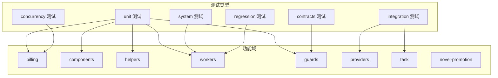
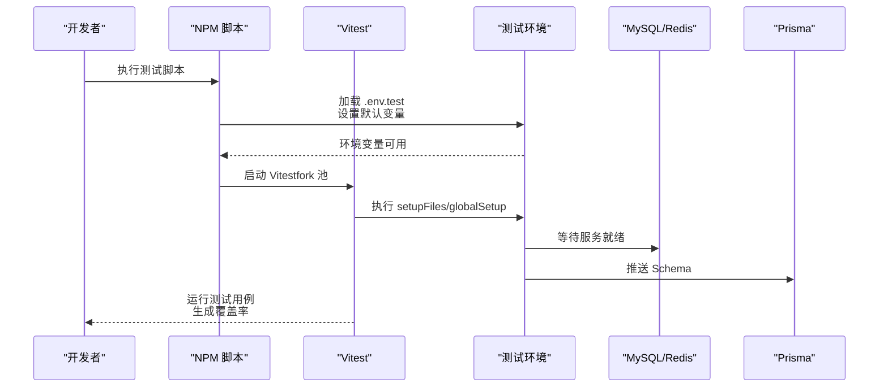
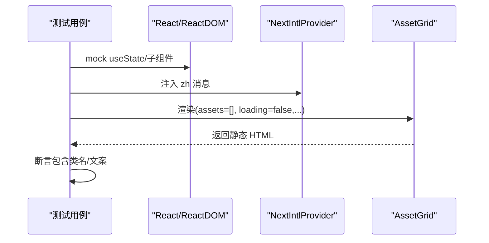
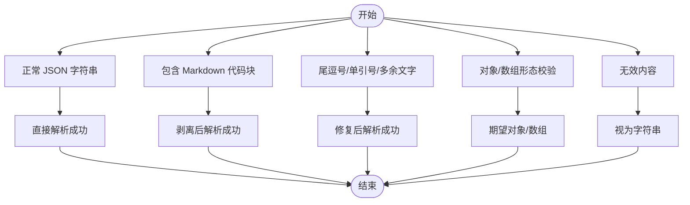
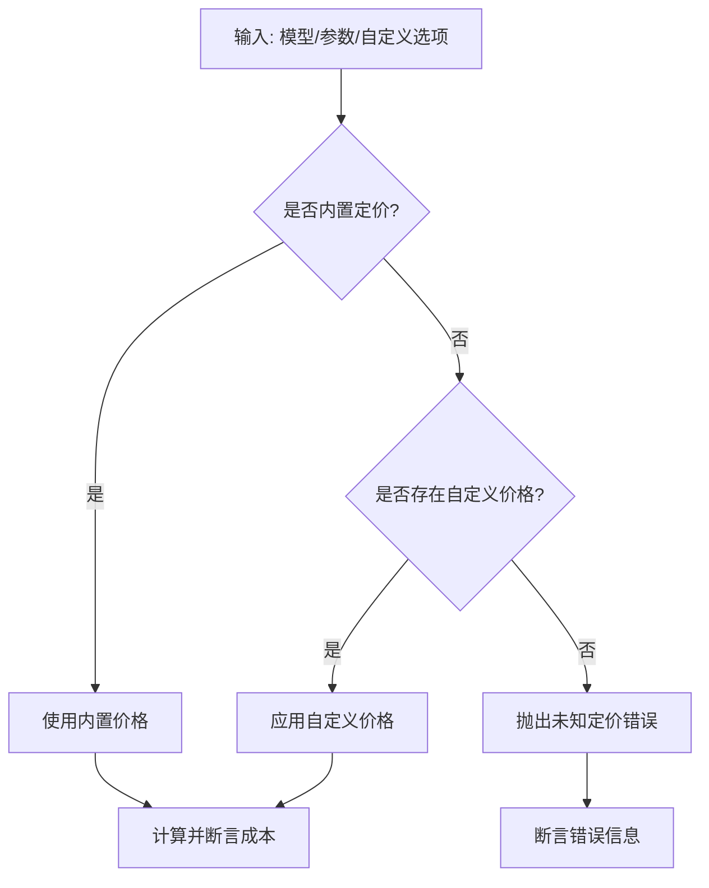
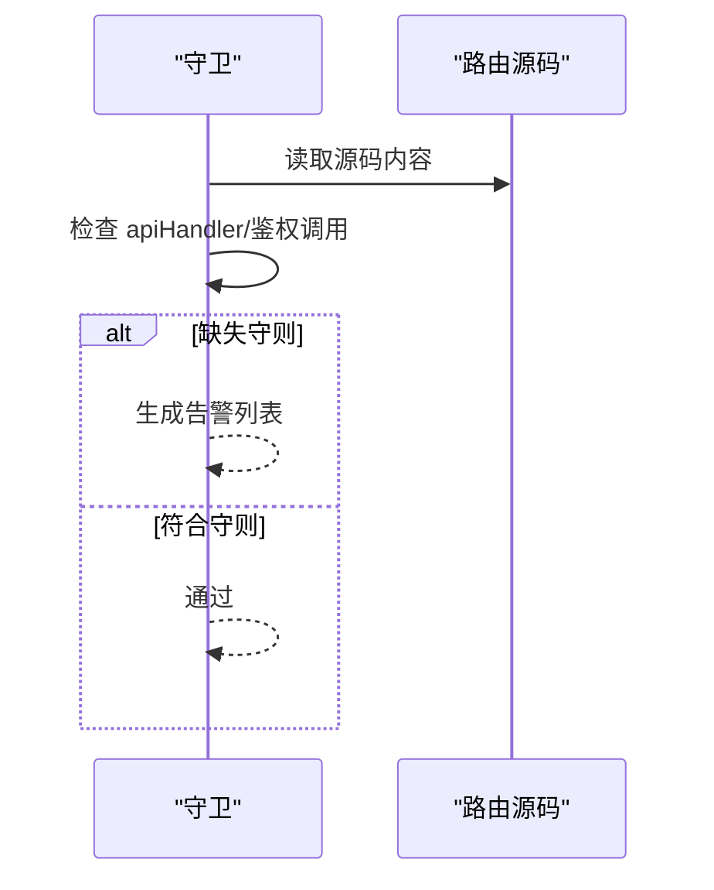
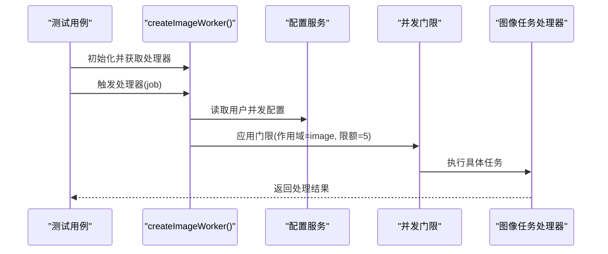
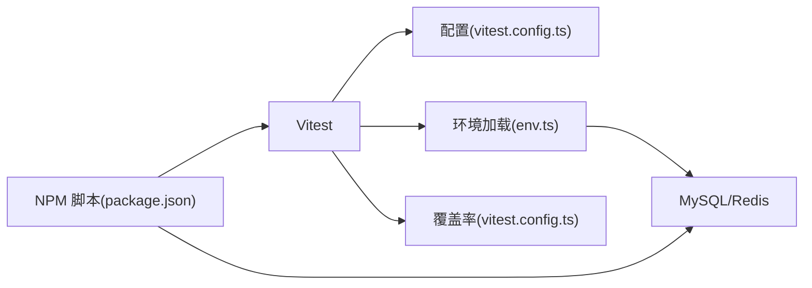

# 单元测试

<cite>
**本文引用的文件**
- [vitest.config.ts](file://vitest.config.ts)
- [vitest.core-coverage.config.ts](file://vitest.core-coverage.config.ts)
- [package.json](file://package.json)
- [tests/setup/env.ts](file://tests/setup/env.ts)
- [tests/setup/global-setup.ts](file://tests/setup/global-setup.ts)
- [tests/helpers/assertions.ts](file://tests/helpers/assertions.ts)
- [tests/helpers/prisma.ts](file://tests/helpers/prisma.ts)
- [tests/helpers/fixtures.ts](file://tests/helpers/fixtures.ts)
- [tests/helpers/db-reset.ts](file://tests/helpers/db-reset.ts)
- [tests/helpers/mock-query-client.ts](file://tests/helpers/mock-query-client.ts)
- [tests/helpers/request.ts](file://tests/helpers/request.ts)
- [tests/helpers/fakes/llm.ts](file://tests/helpers/fakes/llm.ts)
- [tests/unit/billing/cost.test.ts](file://tests/unit/billing/cost.test.ts)
- [tests/unit/components/asset-grid.test.ts](file://tests/unit/components/asset-grid.test.ts)
- [tests/unit/guards/api-route-contract-guard.test.ts](file://tests/unit/guards/api-route-contract-guard.test.ts)
- [tests/unit/helpers/json-repair.test.ts](file://tests/unit/helpers/json-repair.test.ts)
- [tests/unit/worker/image-worker.test.ts](file://tests/unit/worker/image-worker.test.ts)
</cite>

## 目录
1. [简介](#简介)
2. [项目结构](#项目结构)
3. [核心组件](#核心组件)
4. [架构总览](#架构总览)
5. [详细组件分析](#详细组件分析)
6. [依赖分析](#依赖分析)
7. [性能考虑](#性能考虑)
8. [故障排查指南](#故障排查指南)
9. [结论](#结论)
10. [附录](#附录)

## 简介
本文件系统化梳理 Waoowaoo 项目的单元测试体系，涵盖测试组织结构、实施策略、命名规范、断言策略、模拟对象使用、测试数据准备与夹具、测试辅助工具、不同类别测试的编写方法、最佳实践与常见模式，以及测试覆盖率要求、执行配置与并行优化策略。目标是帮助开发者快速理解并高效扩展测试覆盖面，确保质量与可维护性。

## 项目结构
测试目录采用按“层次+功能域”混合组织方式：
- tests/unit：按功能域细分子目录，如 billing、components、helpers、worker 等，覆盖核心业务逻辑与组件行为。
- tests/integration：集成测试，验证 API 合同、链路、任务运行时、供应商适配等。
- tests/system：端到端系统级测试，通常需要启动外部服务（数据库、Redis）。
- tests/regression：回归用例，保障关键缺陷不复现。
- tests/concurrency：并发场景测试，如账单流水并发。
- tests/contracts：需求矩阵、路由行为矩阵等契约与覆盖度检查。
- tests/helpers：断言、夹具、请求构造、查询客户端模拟、PRISMA 访问、LLM 假实现等通用工具。
- tests/setup：环境加载、全局初始化与清理。

**图表来源**
- [tests/unit/billing/cost.test.ts:1-241](file://tests/unit/billing/cost.test.ts#L1-L241)
- [tests/unit/components/asset-grid.test.ts:1-159](file://tests/unit/components/asset-grid.test.ts#L1-L159)
- [tests/unit/worker/image-worker.test.ts:1-106](file://tests/unit/worker/image-worker.test.ts#L1-L106)
- [tests/unit/guards/api-route-contract-guard.test.ts:1-54](file://tests/unit/guards/api-route-contract-guard.test.ts#L1-L54)

**章节来源**
- [package.json:70-91](file://package.json#L70-L91)

## 核心组件
- 测试运行与覆盖率配置
  - 使用 Vitest，通过两个配置文件分别管理“账单专用覆盖率”和“核心基线覆盖率”，支持 fork 池、超时、全局钩子与别名解析。
  - 覆盖率报告器、阈值与包含范围明确，便于持续改进。
- 测试环境与网络限制
  - 在测试环境中强制加载 .env.test，设置默认变量；限制 fetch 目标主机，避免意外外网访问。
  - 全局初始化负责拉起测试容器、等待 MySQL/Redis 就绪、推送 Prisma Schema。
- 断言与辅助工具
  - 针对账单余额与负数校验的断言封装。
  - PRISMA 测试入口统一加载测试环境。
  - 夹具：用户、项目、小说推广项目、全局角色/地点、剧集等。
  - 数据库重置：按模块粒度重置表，保证测试隔离。
  - 查询客户端模拟：基于内存映射的 React Query 客户端模拟。
  - 请求构造：构建 NextRequest 并调用路由处理器，便于 API 行为测试。
  - LLM 假实现：可控的聊天补全响应，便于 LLM 驱动流程测试。

**章节来源**
- [vitest.config.ts:15-42](file://vitest.config.ts#L15-L42)
- [vitest.core-coverage.config.ts:24-41](file://vitest.core-coverage.config.ts#L24-L41)
- [tests/setup/env.ts:22-73](file://tests/setup/env.ts#L22-L73)
- [tests/setup/global-setup.ts:70-99](file://tests/setup/global-setup.ts#L70-L99)
- [tests/helpers/assertions.ts:1-24](file://tests/helpers/assertions.ts#L1-L24)
- [tests/helpers/prisma.ts:1-7](file://tests/helpers/prisma.ts#L1-L7)
- [tests/helpers/fixtures.ts:1-99](file://tests/helpers/fixtures.ts#L1-L99)
- [tests/helpers/db-reset.ts:1-61](file://tests/helpers/db-reset.ts#L1-L61)
- [tests/helpers/mock-query-client.ts:24-73](file://tests/helpers/mock-query-client.ts#L24-L73)
- [tests/helpers/request.ts:18-63](file://tests/helpers/request.ts#L18-L63)
- [tests/helpers/fakes/llm.ts:1-27](file://tests/helpers/fakes/llm.ts#L1-L27)

## 架构总览
测试执行与资源准备的总体流程如下：

**图表来源**
- [tests/setup/env.ts:22-73](file://tests/setup/env.ts#L22-L73)
- [tests/setup/global-setup.ts:70-99](file://tests/setup/global-setup.ts#L70-L99)
- [vitest.config.ts:15-42](file://vitest.config.ts#L15-L42)

## 详细组件分析

### 组件测试：AssetGrid
- 目标：验证 AssetGrid 在空状态与筛选状态下的渲染行为与交互提示文案。
- 方法：使用 vi.mock 替换 React 内部状态与子组件，使用 NextIntlProvider 包裹以注入多语言消息，通过 renderToStaticMarkup 渲染并断言 HTML 片段。
- 关键点：
  - 通过 mock 子组件避免复杂 DOM 渲染，聚焦布局与文案。
  - 使用国际化 Provider 确保文案一致性。
  - 断言类名与特定文案，确保 UI 体验符合预期。

**图表来源**
- [tests/unit/components/asset-grid.test.ts:10-81](file://tests/unit/components/asset-grid.test.ts#L10-L81)
- [tests/unit/components/asset-grid.test.ts:83-159](file://tests/unit/components/asset-grid.test.ts#L83-L159)

**章节来源**
- [tests/unit/components/asset-grid.test.ts:1-159](file://tests/unit/components/asset-grid.test.ts#L1-L159)

### 工具函数测试：JSON Repair
- 目标：验证安全解析函数对畸形 JSON 的修复与提取能力。
- 方法：覆盖多种输入形态（Markdown 包裹、尾逗号、单引号、中文引号、控制字符、对象/数组提取 fallbackKey），断言解析结果或抛错信息。
- 关键点：
  - 使用 describe 分层组织子功能测试，提升可读性。
  - 针对 LLM 常见输出进行回归测试，确保稳定性。

**图表来源**
- [tests/unit/helpers/json-repair.test.ts:6-186](file://tests/unit/helpers/json-repair.test.ts#L6-L186)

**章节来源**
- [tests/unit/helpers/json-repair.test.ts:1-186](file://tests/unit/helpers/json-repair.test.ts#L1-L186)

### 业务逻辑测试：账单计费
- 目标：验证不同模型与参数组合下的计费计算、异常处理与自定义定价。
- 方法：针对文本、图像、视频、语音、唇同步、语音设计等场景，断言成本数值精度、错误信息与自定义选项匹配。
- 关键点：
  - 使用 toBeCloseTo 进行浮点比较，避免精度误差。
  - 验证未知模型/分辨率/能力的错误路径。
  - 自定义定价场景覆盖缺失选项的显式报错。

**图表来源**
- [tests/unit/billing/cost.test.ts:14-240](file://tests/unit/billing/cost.test.ts#L14-L240)

**章节来源**
- [tests/unit/billing/cost.test.ts:1-241](file://tests/unit/billing/cost.test.ts#L1-L241)

### 工具函数测试：API 路由契约守卫
- 目标：验证路由是否遵循 API 守则（apiHandler 包裹、鉴权调用等）。
- 方法：对允许白名单与受保护路由进行检查，断言缺失守则时的告警信息。
- 关键点：
  - 通过字符串内容解析与正则匹配识别守则使用情况。
  - 保证新增路由符合框架约定。

**图表来源**
- [tests/unit/guards/api-route-contract-guard.test.ts:8-53](file://tests/unit/guards/api-route-contract-guard.test.ts#L8-L53)

**章节来源**
- [tests/unit/guards/api-route-contract-guard.test.ts:1-54](file://tests/unit/guards/api-route-contract-guard.test.ts#L1-L54)

### 并发测试：Worker 并发行为
- 目标：验证图像类任务在进入处理器前应用用户并发门限。
- 方法：使用 hoisted mocks 捕获 Worker 处理器、共享模块、配置服务与并发门限，构造 Job 并断言调用顺序与参数。
- 关键点：
  - 通过 vi.hoisted 预先注入 mock，避免作用域污染。
  - 断言读取用户并发配置、应用门限后再进入具体任务处理器。

**图表来源**
- [tests/unit/worker/image-worker.test.ts:82-105](file://tests/unit/worker/image-worker.test.ts#L82-L105)

**章节来源**
- [tests/unit/worker/image-worker.test.ts:1-106](file://tests/unit/worker/image-worker.test.ts#L1-L106)

## 依赖分析
- 测试运行时依赖
  - Vitest v4，v8 覆盖率提供器，fork 池执行，全局 setup/teardown。
  - 别名 @ 指向 src，便于模块导入。
- 外部服务
  - MySQL/Redis 通过 docker-compose.test.yml 提供，global-setup 等待服务就绪并推送 Prisma Schema。
- 脚本与命令
  - 多个 npm 脚本用于分层执行测试（单元、集成、系统、并发、覆盖率），并结合守卫脚本进行契约与覆盖度检查。

**图表来源**
- [vitest.config.ts:15-42](file://vitest.config.ts#L15-L42)
- [tests/setup/env.ts:22-73](file://tests/setup/env.ts#L22-L73)
- [tests/setup/global-setup.ts:70-99](file://tests/setup/global-setup.ts#L70-L99)
- [package.json:70-91](file://package.json#L70-L91)

**章节来源**
- [vitest.config.ts:1-45](file://vitest.config.ts#L1-L45)
- [vitest.core-coverage.config.ts:1-44](file://vitest.core-coverage.config.ts#L1-L44)
- [tests/setup/env.ts:1-73](file://tests/setup/env.ts#L1-L73)
- [tests/setup/global-setup.ts:1-100](file://tests/setup/global-setup.ts#L1-L100)
- [package.json:1-186](file://package.json#L1-L186)

## 性能考虑
- 并行执行
  - 使用 fork 池执行测试，减少共享状态干扰，提高吞吐。
- 超时与稳定性
  - testTimeout、hookTimeout 合理设置，避免长耗时阻塞。
- 覆盖率范围
  - 账单专用覆盖率聚焦关键模块，核心基线覆盖率用于整体健康度监控。
- I/O 与外部依赖
  - 通过 global-setup 等待外部服务就绪，避免测试抖动。
- 建议
  - 对 I/O 密集型测试（如 API/Worker）优先使用 mock 与内存态，必要时拆分单元与集成层级。

[本节为通用建议，无需特定文件引用]

## 故障排查指南
- 网络被拦截
  - 症状：测试中发起 http/https 请求被拒绝。
  - 排查：确认 env.ts 中对 fetch 的拦截逻辑与允许主机集合。
  - 参考：[tests/setup/env.ts:53-73](file://tests/setup/env.ts#L53-L73)
- 外部服务未就绪
  - 症状：数据库/Redis 连接失败或超时。
  - 排查：检查 global-setup 是否正确拉起容器并等待服务。
  - 参考：[tests/setup/global-setup.ts:19-68](file://tests/setup/global-setup.ts#L19-L68)
- 覆盖率不达标
  - 症状：覆盖率低于阈值。
  - 排查：核对 vitest.config.ts/vitest.core-coverage.config.ts 的 include 与阈值。
  - 参考：[vitest.config.ts:24-42](file://vitest.config.ts#L24-L42)、[vitest.core-coverage.config.ts:24-41](file://vitest.core-coverage.config.ts#L24-L41)
- Mock 作用域问题
  - 症状：mock 未生效或污染其他用例。
  - 排查：使用 vi.hoisted 预设 mock，确保 beforeEach 清理。
  - 参考：[tests/unit/worker/image-worker.test.ts:7-14](file://tests/unit/worker/image-worker.test.ts#L7-L14)、[tests/unit/worker/image-worker.test.ts:82-88](file://tests/unit/worker/image-worker.test.ts#L82-L88)

**章节来源**
- [tests/setup/env.ts:53-73](file://tests/setup/env.ts#L53-L73)
- [tests/setup/global-setup.ts:19-68](file://tests/setup/global-setup.ts#L19-L68)
- [vitest.config.ts:24-42](file://vitest.config.ts#L24-L42)
- [vitest.core-coverage.config.ts:24-41](file://vitest.core-coverage.config.ts#L24-L41)
- [tests/unit/worker/image-worker.test.ts:7-14](file://tests/unit/worker/image-worker.test.ts#L7-L14)
- [tests/unit/worker/image-worker.test.ts:82-88](file://tests/unit/worker/image-worker.test.ts#L82-L88)

## 结论
Waoowaoo 的测试体系以 Vitest 为核心，结合严格的环境与外部服务准备、完善的断言与辅助工具、清晰的功能域划分与脚本编排，形成了从单元到并发、从工具到组件、从契约到系统的多层次测试方案。通过明确的覆盖率目标与并行执行策略，既保证了质量，又兼顾了效率。建议在新增功能时沿用现有模式，优先编写单元与组件测试，配合夹具与断言工具，逐步完善集成与系统级测试。

[本节为总结，无需特定文件引用]

## 附录

### 测试文件命名规范
- 命名风格：功能域/子域/具体文件.test.ts，例如 tests/unit/billing/cost.test.ts。
- 组件测试：组件名.test.ts，例如 tests/unit/components/asset-grid.test.ts。
- 工具函数测试：工具名.test.ts，例如 tests/unit/helpers/json-repair.test.ts。
- 并发测试：tests/concurrency/... 目录下按领域划分。

[本节为通用规范说明，无需特定文件引用]

### 断言策略
- 数值比较：使用 toBeCloseTo 进行浮点容差比较。
- 错误断言：使用 toThrow 或 toEqual 期望错误消息。
- 文案断言：在组件测试中断言 HTML 片段包含特定文案或类名。
- 布尔/存在性：使用 toBeTruthy/toBeFalsy、toBeGreaterThan 等。

**章节来源**
- [tests/unit/billing/cost.test.ts:14-240](file://tests/unit/billing/cost.test.ts#L14-L240)
- [tests/unit/components/asset-grid.test.ts:84-157](file://tests/unit/components/asset-grid.test.ts#L84-L157)

### 模拟对象使用方法
- vi.mock：替换第三方模块或内部依赖，常用于组件渲染与外部服务。
- vi.hoisted：预设 mock，避免作用域污染，适用于 Worker/处理器等。
- mock 函数：通过 vi.fn 返回可控行为，便于断言调用次数与参数。

**章节来源**
- [tests/unit/components/asset-grid.test.ts:10-44](file://tests/unit/components/asset-grid.test.ts#L10-L44)
- [tests/unit/worker/image-worker.test.ts:7-14](file://tests/unit/worker/image-worker.test.ts#L7-L14)

### 测试数据准备与夹具
- 夹具：用户、项目、小说推广项目、全局角色/地点、剧集等，统一通过 fixtures.ts 提供。
- 数据库重置：按模块粒度重置，避免跨用例污染。
- 示例路径：
  - [tests/helpers/fixtures.ts:1-99](file://tests/helpers/fixtures.ts#L1-L99)
  - [tests/helpers/db-reset.ts:1-61](file://tests/helpers/db-reset.ts#L1-L61)

**章节来源**
- [tests/helpers/fixtures.ts:1-99](file://tests/helpers/fixtures.ts#L1-L99)
- [tests/helpers/db-reset.ts:1-61](file://tests/helpers/db-reset.ts#L1-L61)

### 测试夹具与辅助工具
- 断言：账单余额与负数校验断言。
- PRISMA：统一加载测试环境。
- 查询客户端模拟：MockQueryClient。
- 请求构造：buildMockRequest/callRoute。
- LLM 假实现：configureFakeLLM/resetFakeLLM/fakeChatCompletion。

**章节来源**
- [tests/helpers/assertions.ts:1-24](file://tests/helpers/assertions.ts#L1-L24)
- [tests/helpers/prisma.ts:1-7](file://tests/helpers/prisma.ts#L1-L7)
- [tests/helpers/mock-query-client.ts:24-73](file://tests/helpers/mock-query-client.ts#L24-L73)
- [tests/helpers/request.ts:18-63](file://tests/helpers/request.ts#L18-L63)
- [tests/helpers/fakes/llm.ts:1-27](file://tests/helpers/fakes/llm.ts#L1-L27)

### 不同类型单元测试编写方法
- 业务逻辑测试：围绕函数/模块输入输出与边界条件，断言数值与错误。
- 组件测试：通过 mock 子组件与国际化 Provider，断言渲染片段与文案。
- 工具函数测试：覆盖多种输入形态与异常分支，确保鲁棒性。
- 并发测试：使用 hoisted mock 验证门限与处理器调用顺序。

**章节来源**
- [tests/unit/billing/cost.test.ts:1-241](file://tests/unit/billing/cost.test.ts#L1-L241)
- [tests/unit/components/asset-grid.test.ts:1-159](file://tests/unit/components/asset-grid.test.ts#L1-L159)
- [tests/unit/helpers/json-repair.test.ts:1-186](file://tests/unit/helpers/json-repair.test.ts#L1-L186)
- [tests/unit/worker/image-worker.test.ts:1-106](file://tests/unit/worker/image-worker.test.ts#L1-L106)

### 测试覆盖率要求与执行配置
- 覆盖率配置
  - 账单专用覆盖率：src/lib/billing/*，阈值 80%。
  - 核心基线覆盖率：src/app/api、src/lib/task、src/lib/workers、src/lib/media、src/lib/errors，阈值 0%（仅统计）。
- 执行脚本
  - 单元/集成/并发/系统/回归等分层执行，守卫脚本检查契约与覆盖度。
- 并行优化
  - fork 池执行，合理设置超时，拆分测试目录以并行运行。

**章节来源**
- [vitest.config.ts:24-42](file://vitest.config.ts#L24-L42)
- [vitest.core-coverage.config.ts:24-41](file://vitest.core-coverage.config.ts#L24-L41)
- [package.json:70-91](file://package.json#L70-L91)