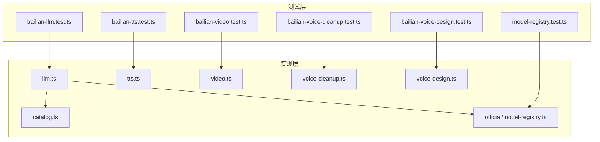
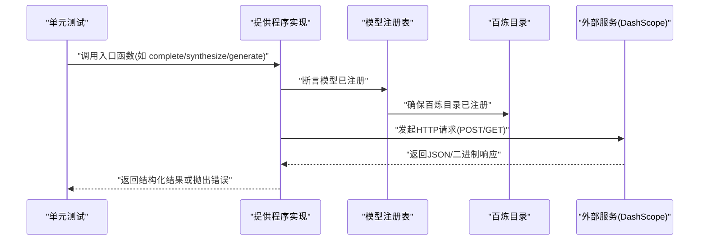
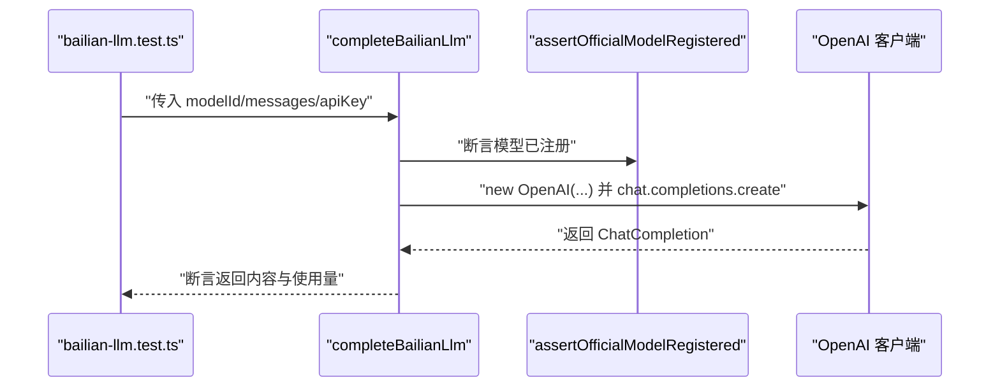
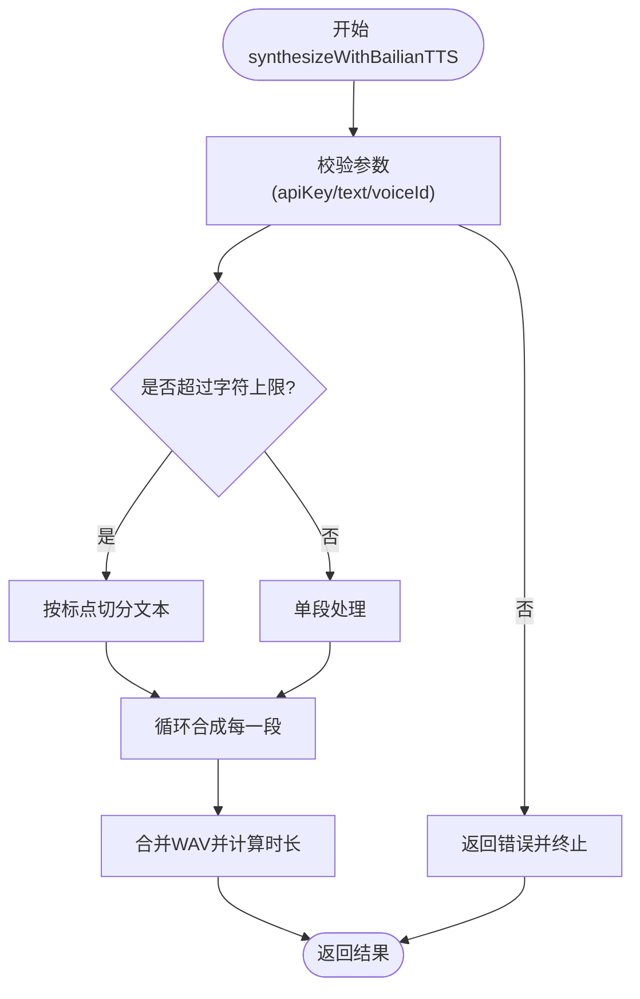
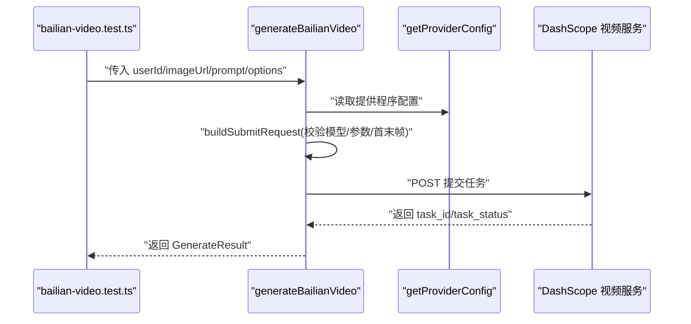
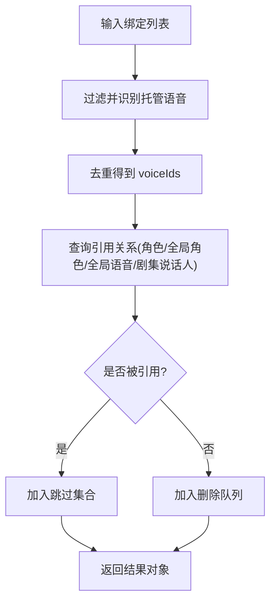
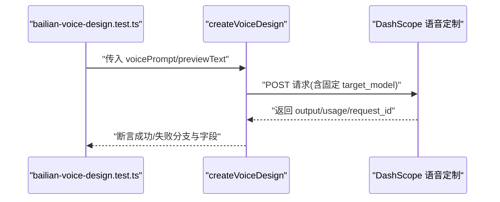
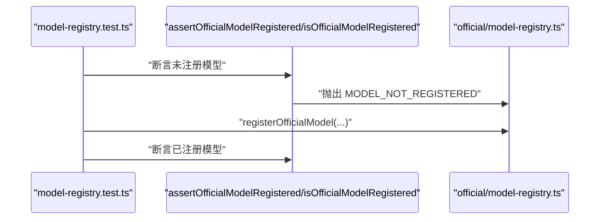
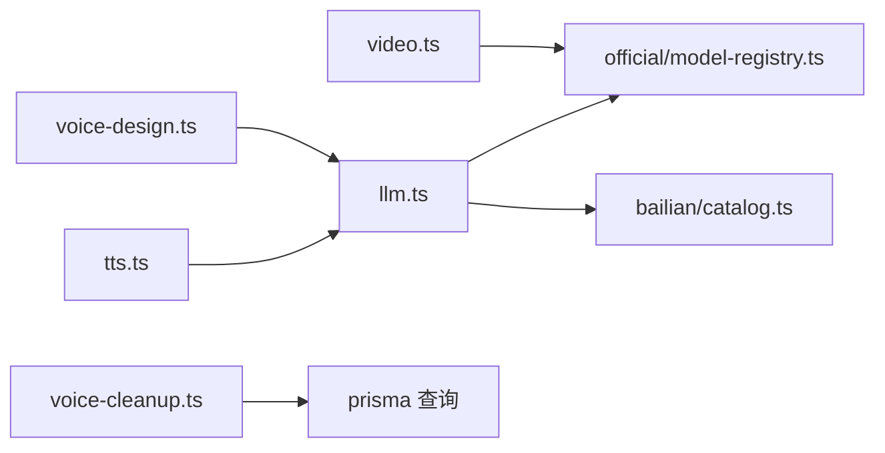

# 提供程序测试

<cite>
**本文引用的文件**
- [tests/unit/providers/bailian-llm.test.ts](file://tests/unit/providers/bailian-llm.test.ts)
- [src/lib/providers/bailian/llm.ts](file://src/lib/providers/bailian/llm.ts)
- [src/lib/providers/bailian/catalog.ts](file://src/lib/providers/bailian/catalog.ts)
- [tests/unit/providers/bailian-tts.test.ts](file://tests/unit/providers/bailian-tts.test.ts)
- [src/lib/providers/bailian/tts.ts](file://src/lib/providers/bailian/tts.ts)
- [tests/unit/providers/bailian-video.test.ts](file://tests/unit/providers/bailian-video.test.ts)
- [src/lib/providers/bailian/video.ts](file://src/lib/providers/bailian/video.ts)
- [tests/unit/providers/bailian-voice-cleanup.test.ts](file://tests/unit/providers/bailian-voice-cleanup.test.ts)
- [src/lib/providers/bailian/voice-cleanup.ts](file://src/lib/providers/bailian/voice-cleanup.ts)
- [tests/unit/providers/bailian-voice-design.test.ts](file://tests/unit/providers/bailian-voice-design.test.ts)
- [src/lib/providers/bailian/voice-design.ts](file://src/lib/providers/bailian/voice-design.ts)
- [tests/unit/providers/model-registry.test.ts](file://tests/unit/providers/model-registry.test.ts)
- [src/lib/providers/official/model-registry.ts](file://src/lib/providers/official/model-registry.ts)
</cite>

## 目录
1. [引言](#引言)
2. [项目结构](#项目结构)
3. [核心组件](#核心组件)
4. [架构总览](#架构总览)
5. [详细组件分析](#详细组件分析)
6. [依赖关系分析](#依赖关系分析)
7. [性能考量](#性能考量)
8. [故障排查指南](#故障排查指南)
9. [结论](#结论)
10. [附录](#附录)

## 引言
本文件面向“提供程序系统”的单元测试，聚焦以下目标：
- 百炼 LLM 提供程序：模型调用、响应解析与错误处理测试策略
- 百炼 TTS 与视频提供程序：语音合成、视频生成与参数校验测试
- 百炼语音清理与语音设计：数据处理、格式转换与性能优化测试
- 模型注册表与各提供程序：兼容性、性能基准与故障恢复测试

通过逐项分析测试用例与实现代码，给出可操作的测试建议、流程图与最佳实践。

## 项目结构
围绕“提供程序测试”，相关代码主要分布在：
- 单元测试目录：tests/unit/providers 下针对 bailian-llm、bailian-tts、bailian-video、bailian-voice-cleanup、bailian-voice-design、model-registry 等模块
- 实现代码目录：src/lib/providers/bailian 下对应功能模块（llm、tts、video、voice-cleanup、voice-design）以及 catalog、types 等
- 官方模型注册表：src/lib/providers/official/model-registry.ts 及其测试 tests/unit/providers/model-registry.test.ts

图表来源
- [tests/unit/providers/bailian-llm.test.ts:1-79](file://tests/unit/providers/bailian-llm.test.ts#L1-L79)
- [src/lib/providers/bailian/llm.ts:1-45](file://src/lib/providers/bailian/llm.ts#L1-L45)
- [src/lib/providers/bailian/catalog.ts:1-40](file://src/lib/providers/bailian/catalog.ts#L1-L40)
- [tests/unit/providers/bailian-tts.test.ts:1-146](file://tests/unit/providers/bailian-tts.test.ts#L1-L146)
- [src/lib/providers/bailian/tts.ts:1-371](file://src/lib/providers/bailian/tts.ts#L1-L371)
- [tests/unit/providers/bailian-video.test.ts:1-272](file://tests/unit/providers/bailian-video.test.ts#L1-L272)
- [src/lib/providers/bailian/video.ts:1-227](file://src/lib/providers/bailian/video.ts#L1-L227)
- [tests/unit/providers/bailian-voice-cleanup.test.ts:1-119](file://tests/unit/providers/bailian-voice-cleanup.test.ts#L1-L119)
- [src/lib/providers/bailian/voice-cleanup.ts:1-250](file://src/lib/providers/bailian/voice-cleanup.ts#L1-L250)
- [tests/unit/providers/bailian-voice-design.test.ts:1-54](file://tests/unit/providers/bailian-voice-design.test.ts#L1-L54)
- [src/lib/providers/bailian/voice-design.ts:1-128](file://src/lib/providers/bailian/voice-design.ts#L1-L128)
- [tests/unit/providers/model-registry.test.ts:1-40](file://tests/unit/providers/model-registry.test.ts#L1-L40)
- [src/lib/providers/official/model-registry.ts](file://src/lib/providers/official/model-registry.ts)

章节来源
- [tests/unit/providers/bailian-llm.test.ts:1-79](file://tests/unit/providers/bailian-llm.test.ts#L1-L79)
- [tests/unit/providers/bailian-tts.test.ts:1-146](file://tests/unit/providers/bailian-tts.test.ts#L1-L146)
- [tests/unit/providers/bailian-video.test.ts:1-272](file://tests/unit/providers/bailian-video.test.ts#L1-L272)
- [tests/unit/providers/bailian-voice-cleanup.test.ts:1-119](file://tests/unit/providers/bailian-voice-cleanup.test.ts#L1-L119)
- [tests/unit/providers/bailian-voice-design.test.ts:1-54](file://tests/unit/providers/bailian-voice-design.test.ts#L1-L54)
- [tests/unit/providers/model-registry.test.ts:1-40](file://tests/unit/providers/model-registry.test.ts#L1-L40)

## 核心组件
- 百炼 LLM 提供程序：封装 OpenAI 兼容客户端，基于官方模型注册表进行模型可用性校验，并调用 DashScope 兼容端点
- 百炼 TTS 提供程序：按字符上限切分文本、调用多模态语音合成接口、下载音频、合并 WAV、计算时长与用量
- 百炼视频提供程序：根据模型类型选择不同端点，校验首尾帧参数，构建请求体并返回异步任务 ID
- 百炼语音清理：识别托管语音绑定、收集去重后的语音 ID、查询引用关系并删除未被引用的语音
- 百炼语音设计：提交声音定制请求，返回目标模型与预览音频信息
- 模型注册表：集中管理各提供程序的官方模型清单，提供注册、查询与断言能力

章节来源
- [src/lib/providers/bailian/llm.ts:1-45](file://src/lib/providers/bailian/llm.ts#L1-L45)
- [src/lib/providers/bailian/tts.ts:1-371](file://src/lib/providers/bailian/tts.ts#L1-L371)
- [src/lib/providers/bailian/video.ts:1-227](file://src/lib/providers/bailian/video.ts#L1-L227)
- [src/lib/providers/bailian/voice-cleanup.ts:1-250](file://src/lib/providers/bailian/voice-cleanup.ts#L1-L250)
- [src/lib/providers/bailian/voice-design.ts:1-128](file://src/lib/providers/bailian/voice-design.ts#L1-L128)
- [src/lib/providers/official/model-registry.ts](file://src/lib/providers/official/model-registry.ts)

## 架构总览
下图展示“测试驱动的提供程序调用链”：测试用例通过伪造 fetch 或构造器，验证实现模块在不同输入下的行为与错误路径。

图表来源
- [tests/unit/providers/bailian-llm.test.ts:40-78](file://tests/unit/providers/bailian-llm.test.ts#L40-L78)
- [src/lib/providers/bailian/llm.ts:26-44](file://src/lib/providers/bailian/llm.ts#L26-L44)
- [src/lib/providers/bailian/catalog.ts:26-34](file://src/lib/providers/bailian/catalog.ts#L26-L34)
- [tests/unit/providers/bailian-tts.test.ts:36-75](file://tests/unit/providers/bailian-tts.test.ts#L36-L75)
- [src/lib/providers/bailian/tts.ts:307-370](file://src/lib/providers/bailian/tts.ts#L307-L370)
- [tests/unit/providers/bailian-video.test.ts:21-83](file://tests/unit/providers/bailian-video.test.ts#L21-L83)
- [src/lib/providers/bailian/video.ts:192-226](file://src/lib/providers/bailian/video.ts#L192-L226)

## 详细组件分析

### 百炼 LLM 提供程序测试
- 测试要点
  - 正向路径：对已注册的 Qwen 模型发起 OpenAI 兼容请求，校验客户端初始化参数与请求体字段
  - 错误路径：对未注册模型直接拒绝，不发起网络请求
- 关键断言
  - 客户端构造参数（baseURL、超时）
  - 请求体字段（model、messages、temperature）
  - 返回消息内容与令牌用量
- 失败场景
  - 非官方模型触发“未注册”错误

图表来源
- [tests/unit/providers/bailian-llm.test.ts:45-77](file://tests/unit/providers/bailian-llm.test.ts#L45-L77)
- [src/lib/providers/bailian/llm.ts:26-44](file://src/lib/providers/bailian/llm.ts#L26-L44)
- [src/lib/providers/bailian/catalog.ts:26-34](file://src/lib/providers/bailian/catalog.ts#L26-L34)

章节来源
- [tests/unit/providers/bailian-llm.test.ts:1-79](file://tests/unit/providers/bailian-llm.test.ts#L1-L79)
- [src/lib/providers/bailian/llm.ts:1-45](file://src/lib/providers/bailian/llm.ts#L1-L45)
- [src/lib/providers/bailian/catalog.ts:1-40](file://src/lib/providers/bailian/catalog.ts#L1-L40)

### 百炼 TTS 提供程序测试
- 测试要点
  - 单段合成：校验生成与下载流程、返回音频缓冲区、时长与用量
  - 分段合成：超过字符上限自动切分，合并多段音频，累加用量与时长
  - 错误处理：缺失语音 ID、无效响应、下载失败等
  - 格式转换：WAV 解析与合并、格式一致性校验
- 关键断言
  - 请求头与请求体字段（Authorization、Content-Type、model、input.text/voice/language_type）
  - 响应解析与错误码映射
  - 合成后音频时长计算与缓冲区合并
- 性能优化
  - 文本切分策略避免在标点处截断
  - 多段音频合并前进行格式一致性检查

图表来源
- [tests/unit/providers/bailian-tts.test.ts:36-127](file://tests/unit/providers/bailian-tts.test.ts#L36-L127)
- [src/lib/providers/bailian/tts.ts:307-370](file://src/lib/providers/bailian/tts.ts#L307-L370)

章节来源
- [tests/unit/providers/bailian-tts.test.ts:1-146](file://tests/unit/providers/bailian-tts.test.ts#L1-L146)
- [src/lib/providers/bailian/tts.ts:1-371](file://src/lib/providers/bailian/tts.ts#L1-L371)

### 百炼视频提供程序测试
- 测试要点
  - i2v 与 kf2v 不同端点选择：根据是否提供末帧决定使用哪个服务
  - 参数校验：分辨率、尺寸、水印、提示词扩展、时长等
  - 错误处理：缺少末帧、不支持的选项、响应体缺失任务 ID 等
- 关键断言
  - 请求 URL 与请求头（Authorization、Content-Type、X-DashScope-Async）
  - 请求体字段（model、input.img_url/first_frame_url+last_frame_url、parameters.*）
  - 返回结构（success/async/requestId/externalId）

图表来源
- [tests/unit/providers/bailian-video.test.ts:21-83](file://tests/unit/providers/bailian-video.test.ts#L21-L83)
- [src/lib/providers/bailian/video.ts:192-226](file://src/lib/providers/bailian/video.ts#L192-L226)

章节来源
- [tests/unit/providers/bailian-video.test.ts:1-272](file://tests/unit/providers/bailian-video.test.ts#L1-L272)
- [src/lib/providers/bailian/video.ts:1-227](file://src/lib/providers/bailian/video.ts#L1-L227)

### 百炼语音清理测试
- 测试要点
  - 绑定识别：通过 voiceType 或 ID 前缀判断是否为托管语音
  - 收集去重：从角色与剧集说话人配置中提取并去重
  - 清理策略：查询引用关系，仅删除未被引用的语音
- 关键断言
  - isBailianManagedVoiceBinding 的判定逻辑
  - collectBailianManagedVoiceIds 的去重结果
  - cleanupUnreferencedBailianVoices 的返回结构（已请求/跳过/删除）

图表来源
- [tests/unit/providers/bailian-voice-cleanup.test.ts:73-96](file://tests/unit/providers/bailian-voice-cleanup.test.ts#L73-L96)
- [src/lib/providers/bailian/voice-cleanup.ts:35-53](file://src/lib/providers/bailian/voice-cleanup.ts#L35-L53)
- [src/lib/providers/bailian/voice-cleanup.ts:81-111](file://src/lib/providers/bailian/voice-cleanup.ts#L81-L111)
- [src/lib/providers/bailian/voice-cleanup.ts:198-248](file://src/lib/providers/bailian/voice-cleanup.ts#L198-L248)

章节来源
- [tests/unit/providers/bailian-voice-cleanup.test.ts:1-119](file://tests/unit/providers/bailian-voice-cleanup.test.ts#L1-L119)
- [src/lib/providers/bailian/voice-cleanup.ts:1-250](file://src/lib/providers/bailian/voice-cleanup.ts#L1-L250)

### 百炼语音设计测试
- 测试要点
  - 请求体字段：校验 target_model 固定值、语言与预览文本长度限制
  - 成功路径：返回 voiceId、target_model、预览音频信息
  - 失败路径：API Key 缺失、网络异常、服务端错误码
- 关键断言
  - 请求体包含固定 target_model
  - 输入参数边界校验（提示词、预览文本）

图表来源
- [tests/unit/providers/bailian-voice-design.test.ts:9-52](file://tests/unit/providers/bailian-voice-design.test.ts#L9-L52)
- [src/lib/providers/bailian/voice-design.ts:23-104](file://src/lib/providers/bailian/voice-design.ts#L23-L104)

章节来源
- [tests/unit/providers/bailian-voice-design.test.ts:1-54](file://tests/unit/providers/bailian-voice-design.test.ts#L1-L54)
- [src/lib/providers/bailian/voice-design.ts:1-128](file://src/lib/providers/bailian/voice-design.ts#L1-L128)

### 模型注册表与兼容性测试
- 测试要点
  - 断言未注册模型抛错
  - 注册后可被识别为已注册
  - 与百炼目录联动，确保模型清单一致
- 关键断言
  - MODEL_NOT_REGISTERED 错误
  - isOfficialModelRegistered 返回 true

图表来源
- [tests/unit/providers/model-registry.test.ts:14-38](file://tests/unit/providers/model-registry.test.ts#L14-L38)
- [src/lib/providers/official/model-registry.ts](file://src/lib/providers/official/model-registry.ts)

章节来源
- [tests/unit/providers/model-registry.test.ts:1-40](file://tests/unit/providers/model-registry.test.ts#L1-L40)
- [src/lib/providers/official/model-registry.ts](file://src/lib/providers/official/model-registry.ts)

## 依赖关系分析
- 组件耦合
  - 提供程序实现依赖模型注册表与目录清单，保证只允许官方模型调用
  - 视频与语音模块依赖外部服务端点，测试通过伪造 fetch 控制响应
- 外部依赖
  - DashScope 兼容端点（LLM/TTS/视频/语音定制）
  - 数据库查询（语音清理涉及 Prisma 查询）
- 潜在环路
  - 目录注册仅在首次访问时执行，避免重复注册与环路

图表来源
- [src/lib/providers/bailian/llm.ts:1-45](file://src/lib/providers/bailian/llm.ts#L1-L45)
- [src/lib/providers/bailian/catalog.ts:1-40](file://src/lib/providers/bailian/catalog.ts#L1-L40)
- [src/lib/providers/bailian/tts.ts:1-371](file://src/lib/providers/bailian/tts.ts#L1-L371)
- [src/lib/providers/bailian/video.ts:1-227](file://src/lib/providers/bailian/video.ts#L1-L227)
- [src/lib/providers/bailian/voice-cleanup.ts:1-250](file://src/lib/providers/bailian/voice-cleanup.ts#L1-L250)
- [src/lib/providers/bailian/voice-design.ts:1-128](file://src/lib/providers/bailian/voice-design.ts#L1-L128)

章节来源
- [src/lib/providers/bailian/llm.ts:1-45](file://src/lib/providers/bailian/llm.ts#L1-L45)
- [src/lib/providers/bailian/video.ts:1-227](file://src/lib/providers/bailian/video.ts#L1-L227)
- [src/lib/providers/bailian/voice-cleanup.ts:1-250](file://src/lib/providers/bailian/voice-cleanup.ts#L1-L250)

## 性能考量
- 文本切分与音频合并
  - 使用标点提示字符进行智能切分，减少跨段落截断
  - 合并前进行 WAV 格式一致性检查，避免格式不匹配导致播放异常
- 请求与响应
  - LLM 与视频生成采用异步模式，需关注任务状态轮询与超时控制
  - TTS 合并多段音频时，注意内存占用与大文件处理
- 错误快速失败
  - 在参数校验阶段尽早抛错，减少无效网络请求

## 故障排查指南
- LLM
  - 症状：调用未发起且抛出“未注册”错误
  - 排查：确认模型是否在百炼目录中注册，或是否通过官方注册表注册
- TTS
  - 症状：WAV 解析失败或合并异常
  - 排查：检查响应是否为有效 WAV、各段格式是否一致、字符数是否超过上限
  - 症状：下载失败
  - 排查：确认音频 URL 可访问、网络状态正常
- 视频
  - 症状：提交失败或缺少任务 ID
  - 排查：核对请求体字段、端点选择、API Key 权限
  - 症状：首末帧参数不满足模型要求
  - 排查：确认模型是否支持首末帧、是否提供了末帧 URL
- 语音清理
  - 症状：误删或未删语音
  - 排查：核对引用查询范围与条件，确保去重与过滤逻辑正确
- 语音设计
  - 症状：请求体未包含固定 target_model
  - 排查：确认请求体构建逻辑与参数边界

章节来源
- [src/lib/providers/bailian/tts.ts:66-124](file://src/lib/providers/bailian/tts.ts#L66-L124)
- [src/lib/providers/bailian/video.ts:107-176](file://src/lib/providers/bailian/video.ts#L107-L176)
- [src/lib/providers/bailian/voice-cleanup.ts:113-196](file://src/lib/providers/bailian/voice-cleanup.ts#L113-L196)
- [src/lib/providers/bailian/voice-design.ts:34-48](file://src/lib/providers/bailian/voice-design.ts#L34-L48)

## 结论
通过对百炼提供程序的单元测试分析，可以总结以下关键点：
- 测试覆盖了模型注册、参数校验、请求构建、响应解析与错误处理等关键路径
- 对于外部依赖，采用伪造网络请求的方式隔离环境因素，提升测试稳定性
- 针对格式转换与多段合成等复杂逻辑，测试用例提供了充分的边界与异常场景验证
- 建议持续完善性能基准与故障恢复测试，以保障在高并发与异常情况下的稳定性

## 附录
- 测试用例清单（按模块）
  - 百炼 LLM：模型注册断言、OpenAI 兼容请求参数校验
  - 百炼 TTS：单段/多段合成、WAV 解析与合并、字符上限与错误码
  - 百炼视频：i2v/kf2v 端点选择、首末帧参数校验、异步任务返回
  - 语音清理：绑定识别、引用查询、清理结果统计
  - 语音设计：请求体字段校验、预览文本与语言参数
  - 模型注册表：未注册模型断言、注册后识别