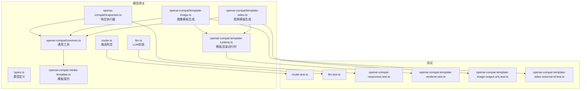
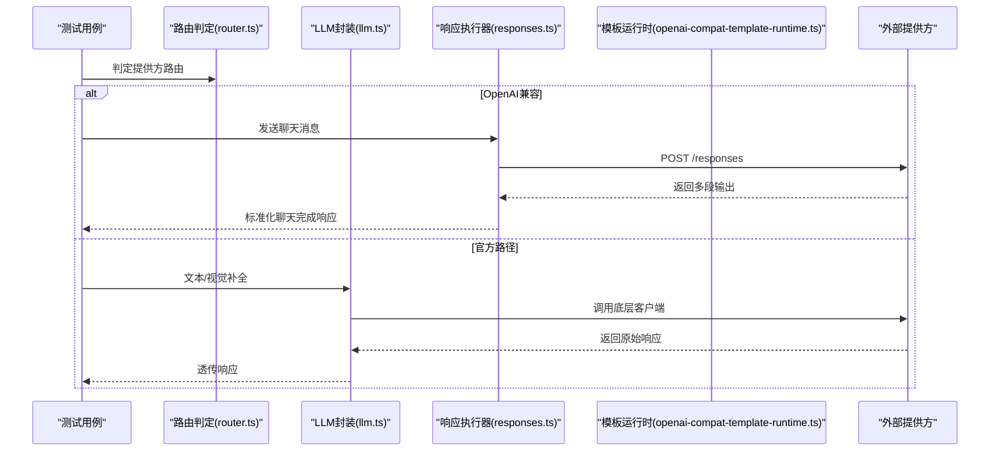
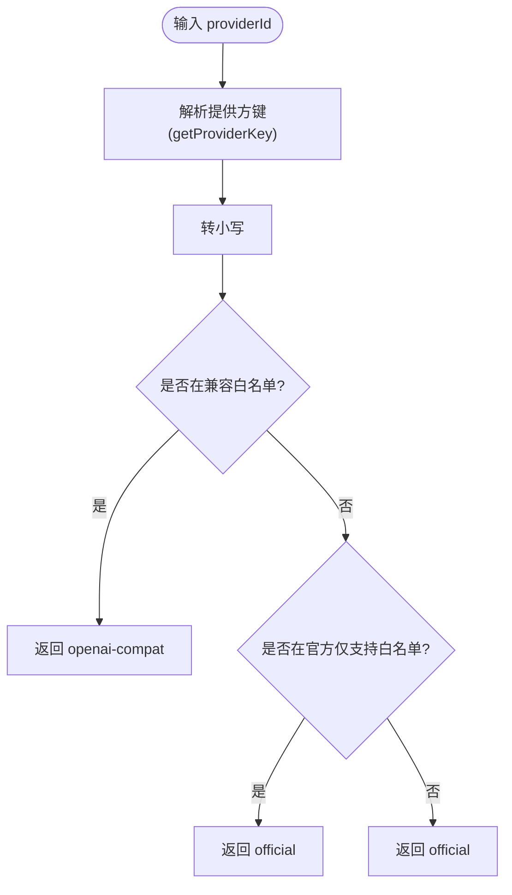
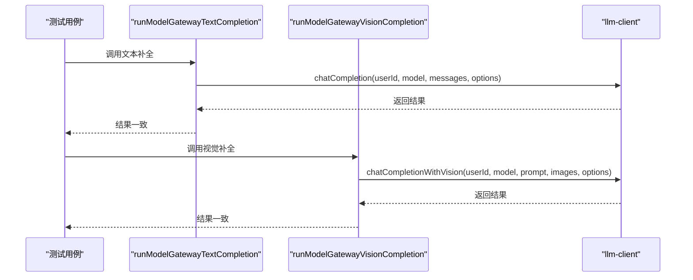
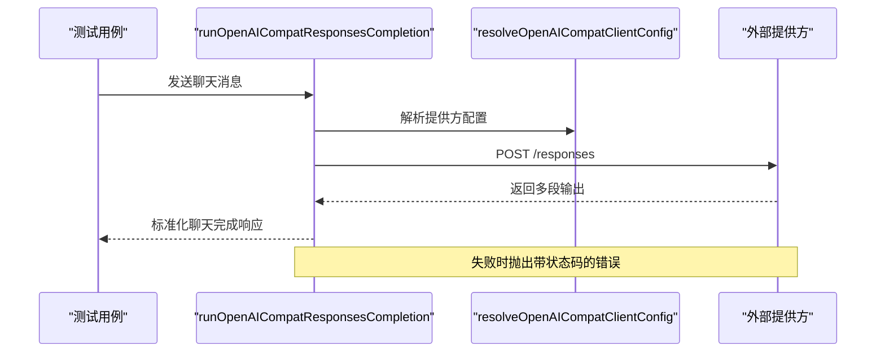
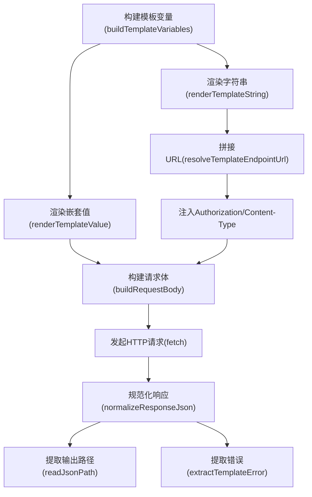
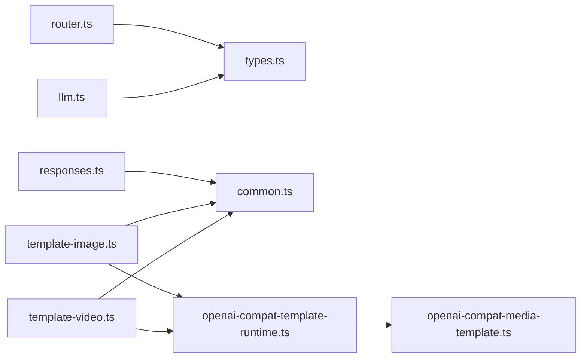

# 模型网关测试

<cite>
**本文引用的文件**   
- [router.ts](file://src/lib/model-gateway/router.ts)
- [llm.ts](file://src/lib/model-gateway/llm.ts)
- [openai-compat-template-runtime.ts](file://src/lib/openai-compat-template-runtime.ts)
- [openai-compat-media-template.ts](file://src/lib/openai-compat-media-template.ts)
- [types.ts](file://src/lib/model-gateway/types.ts)
- [common.ts](file://src/lib/model-gateway/openai-compat/common.ts)
- [responses.ts](file://src/lib/model-gateway/openai-compat/responses.ts)
- [template-image.ts](file://src/lib/model-gateway/openai-compat/template-image.ts)
- [template-video.ts](file://src/lib/model-gateway/openai-compat/template-video.ts)
- [router.test.ts](file://tests/unit/model-gateway/router.test.ts)
- [llm.test.ts](file://tests/unit/model-gateway/llm.test.ts)
- [openai-compat-responses.test.ts](file://tests/unit/model-gateway/openai-compat-responses.test.ts)
- [openai-compat-template-renderer.test.ts](file://tests/unit/model-gateway/openai-compat-template-renderer.test.ts)
- [openai-compat-template-image-output-urls.test.ts](file://tests/unit/model-gateway/openai-compat-template-image-output-urls.test.ts)
- [openai-compat-template-video-external-id.test.ts](file://tests/unit/model-gateway/openai-compat-template-video-external-id.test.ts)
</cite>

## 目录
1. [引言](#引言)
2. [项目结构](#项目结构)
3. [核心组件](#核心组件)
4. [架构总览](#架构总览)
5. [详细组件分析](#详细组件分析)
6. [依赖关系分析](#依赖关系分析)
7. [性能考量](#性能考量)
8. [故障排查指南](#故障排查指南)
9. [结论](#结论)
10. [附录](#附录)

## 引言
本文件面向模型网关的单元测试，系统化梳理路由系统、LLM网关与OpenAI兼容模板三类关键能力的测试策略与方法论。重点覆盖以下方面：
- 路由系统：请求分发、负载均衡与故障转移的测试策略
- LLM网关：请求转发、响应聚合与错误处理测试
- OpenAI兼容响应、模板渲染与外部ID处理：格式验证、兼容性检查与性能监控测试

目标是帮助测试人员快速理解测试范围、设计边界条件与回归保障点，并为持续集成提供可执行的测试清单。

## 项目结构
模型网关相关代码主要位于以下目录与文件：
- 路由与类型定义：src/lib/model-gateway/router.ts、src/lib/model-gateway/types.ts
- LLM网关封装：src/lib/model-gateway/llm.ts
- OpenAI兼容模板运行时：src/lib/openai-compat-template-runtime.ts、src/lib/openai-compat-media-template.ts
- OpenAI兼容通用逻辑：src/lib/model-gateway/openai-compat/common.ts
- OpenAI兼容响应执行器：src/lib/model-gateway/openai-compat/responses.ts
- 图像/视频模板生成器：src/lib/model-gateway/openai-compat/template-image.ts、src/lib/model-gateway/openai-compat/template-video.ts
- 单元测试：tests/unit/model-gateway/*.test.ts

图表来源
- [router.ts:1-22](file://src/lib/model-gateway/router.ts#L1-L22)
- [llm.ts:1-40](file://src/lib/model-gateway/llm.ts#L1-L40)
- [openai-compat-template-runtime.ts:1-485](file://src/lib/openai-compat-template-runtime.ts#L1-L485)
- [openai-compat-media-template.ts:1-66](file://src/lib/openai-compat-media-template.ts#L1-L66)
- [common.ts:1-74](file://src/lib/model-gateway/openai-compat/common.ts#L1-L74)
- [responses.ts:1-137](file://src/lib/model-gateway/openai-compat/responses.ts#L1-L137)
- [template-image.ts:1-138](file://src/lib/model-gateway/openai-compat/template-image.ts#L1-L138)
- [template-video.ts:1-125](file://src/lib/model-gateway/openai-compat/template-video.ts#L1-L125)
- [router.test.ts:1-28](file://tests/unit/model-gateway/router.test.ts#L1-L28)
- [llm.test.ts:1-59](file://tests/unit/model-gateway/llm.test.ts#L1-L59)
- [openai-compat-responses.test.ts:1-68](file://tests/unit/model-gateway/openai-compat-responses.test.ts#L1-L68)
- [openai-compat-template-renderer.test.ts:1-190](file://tests/unit/model-gateway/openai-compat-template-renderer.test.ts#L1-L190)
- [openai-compat-template-image-output-urls.test.ts:1-99](file://tests/unit/model-gateway/openai-compat-template-image-output-urls.test.ts#L1-L99)
- [openai-compat-template-video-external-id.test.ts:1-71](file://tests/unit/model-gateway/openai-compat-template-video-external-id.test.ts#L1-L71)

章节来源
- [router.ts:1-22](file://src/lib/model-gateway/router.ts#L1-L22)
- [llm.ts:1-40](file://src/lib/model-gateway/llm.ts#L1-L40)
- [openai-compat-template-runtime.ts:1-485](file://src/lib/openai-compat-template-runtime.ts#L1-L485)
- [openai-compat-media-template.ts:1-66](file://src/lib/openai-compat-media-template.ts#L1-L66)
- [common.ts:1-74](file://src/lib/model-gateway/openai-compat/common.ts#L1-L74)
- [responses.ts:1-137](file://src/lib/model-gateway/openai-compat/responses.ts#L1-L137)
- [template-image.ts:1-138](file://src/lib/model-gateway/openai-compat/template-image.ts#L1-L138)
- [template-video.ts:1-125](file://src/lib/model-gateway/openai-compat/template-video.ts#L1-L125)
- [router.test.ts:1-28](file://tests/unit/model-gateway/router.test.ts#L1-L28)
- [llm.test.ts:1-59](file://tests/unit/model-gateway/llm.test.ts#L1-L59)
- [openai-compat-responses.test.ts:1-68](file://tests/unit/model-gateway/openai-compat-responses.test.ts#L1-L68)
- [openai-compat-template-renderer.test.ts:1-190](file://tests/unit/model-gateway/openai-compat-template-renderer.test.ts#L1-L190)
- [openai-compat-template-image-output-urls.test.ts:1-99](file://tests/unit/model-gateway/openai-compat-template-image-output-urls.test.ts#L1-L99)
- [openai-compat-template-video-external-id.test.ts:1-71](file://tests/unit/model-gateway/openai-compat-template-video-external-id.test.ts#L1-L71)

## 核心组件
- 路由系统：根据提供方标识判断是否走OpenAI兼容路径或官方路径，支持前缀兼容与白名单控制。
- LLM网关：统一文本与视觉补全入口，透传用户ID、模型、消息与选项到底层客户端。
- OpenAI兼容模板运行时：负责模板变量渲染、URL拼接、请求体构建（含multipart/form-data）、头部处理、JSON路径读取与错误提取。
- OpenAI兼容通用工具：解析数据URL、校验字符串选项、解析提供方配置、构造OpenAI客户端、上传文件转换。
- 响应执行器：将上游“responses”输出标准化为OpenAI风格的聊天完成响应，抽取推理与文本内容及用量。
- 图像/视频模板生成器：基于模板同步/异步模式，读取任务ID与输出URL，编码外部ID以适配后续轮询与状态查询。

章节来源
- [router.ts:1-22](file://src/lib/model-gateway/router.ts#L1-L22)
- [llm.ts:1-40](file://src/lib/model-gateway/llm.ts#L1-L40)
- [openai-compat-template-runtime.ts:1-485](file://src/lib/openai-compat-template-runtime.ts#L1-L485)
- [common.ts:1-74](file://src/lib/model-gateway/openai-compat/common.ts#L1-L74)
- [responses.ts:1-137](file://src/lib/model-gateway/openai-compat/responses.ts#L1-L137)
- [template-image.ts:1-138](file://src/lib/model-gateway/openai-compat/template-image.ts#L1-L138)
- [template-video.ts:1-125](file://src/lib/model-gateway/openai-compat/template-video.ts#L1-L125)

## 架构总览
模型网关在不同场景下的调用链如下：

图表来源
- [router.ts:17-21](file://src/lib/model-gateway/router.ts#L17-L21)
- [llm.ts:8-39](file://src/lib/model-gateway/llm.ts#L8-L39)
- [responses.ts:97-135](file://src/lib/model-gateway/openai-compat/responses.ts#L97-L135)
- [openai-compat-template-runtime.ts:388-413](file://src/lib/openai-compat-template-runtime.ts#L388-L413)

## 详细组件分析

### 路由系统测试策略
- 测试目标
  - 确保OpenAI兼容提供方被正确识别并路由至openai-compat
  - 确保非兼容提供方保持在official路径
  - 验证兼容提供方白名单与前缀匹配规则
- 关键断言
  - isCompatibleProvider对兼容提供方返回true
  - resolveModelGatewayRoute对兼容提供方返回openai-compat
  - 对非兼容提供方返回official
- 边界与回归
  - 提供方ID带冒号后缀的变体
  - 大小写与空白处理
- 参考用例
  - [router.test.ts:4-27](file://tests/unit/model-gateway/router.test.ts#L4-L27)

图表来源
- [router.ts:12-21](file://src/lib/model-gateway/router.ts#L12-L21)

章节来源
- [router.test.ts:1-28](file://tests/unit/model-gateway/router.test.ts#L1-L28)
- [router.ts:1-22](file://src/lib/model-gateway/router.ts#L1-L22)

### LLM网关测试策略
- 测试目标
  - 验证文本与视觉补全调用正确转发至底层客户端
  - 验证参数透传（用户ID、模型、消息、选项）
  - 验证代理设置流程
- 关键断言
  - 文本补全调用chatCompletion且参数一致
  - 视觉补全调用chatCompletionWithVision且参数一致
  - 返回值与底层客户端一致
- 边界与回归
  - 不同温度等选项透传
  - 视觉输入图片数组为空/单张/多张
- 参考用例
  - [llm.test.ts:21-57](file://tests/unit/model-gateway/llm.test.ts#L21-L57)

图表来源
- [llm.ts:8-39](file://src/lib/model-gateway/llm.ts#L8-L39)

章节来源
- [llm.test.ts:1-59](file://tests/unit/model-gateway/llm.test.ts#L1-L59)
- [llm.ts:1-40](file://src/lib/model-gateway/llm.ts#L1-L40)

### OpenAI兼容响应测试策略
- 测试目标
  - 将上游“responses”输出标准化为OpenAI风格聊天完成响应
  - 正确抽取推理与文本内容、用量信息
  - 对失败状态抛出带状态码的错误
- 关键断言
  - choices[0].message.content包含推理与文本片段
  - usage包含prompt_tokens与completion_tokens
  - 请求URL指向baseUrl的/responses端点
  - 失败时抛出OPENAI_COMPAT_RESPONSES_FAILED并携带状态码
- 边界与回归
  - 输出结构差异（output/output_text/text/content等字段）
  - 用量字段命名差异（input_tokens/prompt_tokens等）
- 参考用例
  - [openai-compat-responses.test.ts:22-66](file://tests/unit/model-gateway/openai-compat-responses.test.ts#L22-L66)

图表来源
- [responses.ts:97-135](file://src/lib/model-gateway/openai-compat/responses.ts#L97-L135)
- [common.ts:35-45](file://src/lib/model-gateway/openai-compat/common.ts#L35-L45)

章节来源
- [openai-compat-responses.test.ts:1-68](file://tests/unit/model-gateway/openai-compat-responses.test.ts#L1-L68)
- [responses.ts:1-137](file://src/lib/model-gateway/openai-compat/responses.ts#L1-L137)
- [common.ts:1-74](file://src/lib/model-gateway/openai-compat/common.ts#L1-L74)

### OpenAI兼容模板渲染测试策略
- 测试目标
  - 模板变量渲染（字符串与嵌套对象）
  - URL拼接与去重/v1前缀处理
  - 请求体构建（application/json、multipart/form-data、application/x-www-form-urlencoded）
  - 头部处理（Authorization注入、Content-Type）
  - JSON路径读取与错误提取
- 关键断言
  - 占位符替换正确
  - 基于baseUrl与endpoint.path拼接最终URL
  - multipart/form-data自动注入文件并移除显式Content-Type
  - x-www-form-urlencoded正确序列化
  - readJsonPath能读取数组/对象路径
  - extractTemplateError从多种错误路径提取错误信息
- 边界与回归
  - 基础URL以/结尾与不以/结尾
  - 相对路径与绝对路径
  - 缺失必填字段（如Authorization、Body）
- 参考用例
  - [openai-compat-template-renderer.test.ts:13-189](file://tests/unit/model-gateway/openai-compat-template-renderer.test.ts#L13-L189)

图表来源
- [openai-compat-template-runtime.ts:278-413](file://src/lib/openai-compat-template-runtime.ts#L278-L413)
- [openai-compat-media-template.ts:18-51](file://src/lib/openai-compat-media-template.ts#L18-L51)

章节来源
- [openai-compat-template-renderer.test.ts:1-190](file://tests/unit/model-gateway/openai-compat-template-renderer.test.ts#L1-L190)
- [openai-compat-template-runtime.ts:1-485](file://src/lib/openai-compat-template-runtime.ts#L1-L485)
- [openai-compat-media-template.ts:1-66](file://src/lib/openai-compat-media-template.ts#L1-L66)

### 图像模板输出URL测试策略
- 测试目标
  - 同步模式下正确读取单/多输出URL
  - 兼容旧版单URL输出与新版多URL输出
- 关键断言
  - 多URL输出时返回第一个作为imageUrl，同时返回完整列表
  - 单URL输出时保持向后兼容
- 边界与回归
  - 输出路径为空或无效
  - 数组元素类型不一致
- 参考用例
  - [openai-compat-template-image-output-urls.test.ts:20-97](file://tests/unit/model-gateway/openai-compat-template-image-output-urls.test.ts#L20-L97)

章节来源
- [openai-compat-template-image-output-urls.test.ts:1-99](file://tests/unit/model-gateway/openai-compat-template-image-output-urls.test.ts#L1-L99)
- [template-image.ts:101-122](file://src/lib/model-gateway/openai-compat/template-image.ts#L101-L122)

### 视频模板外部ID测试策略
- 测试目标
  - 异步模式下生成紧凑外部ID，包含提供方令牌与模型引用编码
  - 外部ID长度限制与内容规范
- 关键断言
  - externalId包含紧凑提供方令牌与模型引用编码
  - 不包含完整modelKey的base64url形式
  - externalId长度不超过阈值
- 边界与回归
  - 提供方ID格式变化（UUID/非UUID）
  - modelId为空或非法
- 参考用例
  - [openai-compat-template-video-external-id.test.ts:20-69](file://tests/unit/model-gateway/openai-compat-template-video-external-id.test.ts#L20-L69)

章节来源
- [openai-compat-template-video-external-id.test.ts:1-71](file://tests/unit/model-gateway/openai-compat-template-video-external-id.test.ts#L1-L71)
- [template-video.ts:115-123](file://src/lib/model-gateway/openai-compat/template-video.ts#L115-L123)

## 依赖关系分析
- 组件耦合
  - 路由系统仅依赖提供方键解析与白名单集合，内聚性高、耦合度低
  - LLM网关依赖底层llm-client，通过mock隔离外部依赖
  - OpenAI兼容模板运行时依赖模板契约与通用工具，职责清晰
- 外部依赖
  - fetch用于HTTP请求；模板生成器依赖URL拼接、FormData、URLSearchParams
  - 错误提取依赖JSON路径读取与字符串规范化
- 循环依赖
  - 未发现循环依赖；各模块按“测试用例 -> 实现 -> 运行时/通用工具”的方向单向依赖

图表来源
- [router.ts:1-22](file://src/lib/model-gateway/router.ts#L1-L22)
- [llm.ts:1-40](file://src/lib/model-gateway/llm.ts#L1-L40)
- [responses.ts:1-137](file://src/lib/model-gateway/openai-compat/responses.ts#L1-L137)
- [template-image.ts:1-138](file://src/lib/model-gateway/openai-compat/template-image.ts#L1-L138)
- [template-video.ts:1-125](file://src/lib/model-gateway/openai-compat/template-video.ts#L1-L125)
- [openai-compat-template-runtime.ts:1-485](file://src/lib/openai-compat-template-runtime.ts#L1-L485)
- [openai-compat-media-template.ts:1-66](file://src/lib/openai-compat-media-template.ts#L1-L66)
- [common.ts:1-74](file://src/lib/model-gateway/openai-compat/common.ts#L1-L74)

章节来源
- [router.ts:1-22](file://src/lib/model-gateway/router.ts#L1-L22)
- [llm.ts:1-40](file://src/lib/model-gateway/llm.ts#L1-L40)
- [responses.ts:1-137](file://src/lib/model-gateway/openai-compat/responses.ts#L1-L137)
- [template-image.ts:1-138](file://src/lib/model-gateway/openai-compat/template-image.ts#L1-L138)
- [template-video.ts:1-125](file://src/lib/model-gateway/openai-compat/template-video.ts#L1-L125)
- [openai-compat-template-runtime.ts:1-485](file://src/lib/openai-compat-template-runtime.ts#L1-L485)
- [openai-compat-media-template.ts:1-66](file://src/lib/openai-compat-media-template.ts#L1-L66)
- [common.ts:1-74](file://src/lib/model-gateway/openai-compat/common.ts#L1-L74)

## 性能考量
- 模板渲染复杂度
  - 字符串与嵌套对象渲染为O(n)与O(depth)，建议对大对象进行分层渲染与缓存
- 文件上传与multipart构建
  - 大量文件上传会增加内存与网络开销，建议批量上传与并发上限控制
- 错误提取与JSON解析
  - 对非JSON响应进行字符串回退，避免重复解析；建议对高频错误路径做缓存
- 测试性能优化
  - 使用轻量mock与stub，避免真实网络请求
  - 并行执行独立测试用例，减少整体测试时间

## 故障排查指南
- 路由判定异常
  - 检查提供方ID大小写与前缀是否符合预期
  - 确认白名单集合是否包含目标提供方
- LLM网关调用失败
  - 核对userId、model、messages与options是否透传一致
  - 检查代理设置流程是否执行
- 响应执行器报错
  - 关注OPENAI_COMPAT_RESPONSES_FAILED错误中的状态码
  - 校验上游输出结构与用量字段命名差异
- 模板渲染错误
  - 检查占位符是否存在于变量映射中
  - 确认URL拼接与Content-Type设置是否正确
  - 验证multipart/form-data字段是否标记为文件域
- 外部ID异常
  - 确认提供方ID格式与模型引用编码规则
  - 校验externalId长度与内容是否符合规范

章节来源
- [router.test.ts:1-28](file://tests/unit/model-gateway/router.test.ts#L1-L28)
- [llm.test.ts:1-59](file://tests/unit/model-gateway/llm.test.ts#L1-L59)
- [openai-compat-responses.test.ts:1-68](file://tests/unit/model-gateway/openai-compat-responses.test.ts#L1-L68)
- [openai-compat-template-renderer.test.ts:1-190](file://tests/unit/model-gateway/openai-compat-template-renderer.test.ts#L1-L190)
- [openai-compat-template-video-external-id.test.ts:1-71](file://tests/unit/model-gateway/openai-compat-template-video-external-id.test.ts#L1-L71)

## 结论
本文档系统化梳理了模型网关的路由、LLM封装与OpenAI兼容模板三大领域的测试策略与实现要点。通过明确的关键断言、边界条件与回归保障点，可有效提升测试覆盖率与稳定性。建议在持续集成中优先运行这些核心测试，并结合性能监控与日志审计，确保在多提供方、多模板场景下的可靠性与一致性。

## 附录
- 测试清单（建议）
  - 路由系统：兼容提供方、官方提供方、边界ID格式
  - LLM网关：文本/视觉补全参数透传、错误传播
  - 响应执行器：多段输出聚合、用量抽取、错误状态码
  - 模板渲染：占位符、URL拼接、Content-Type、multipart、JSON路径、错误提取
  - 图像模板：单/多URL输出、兼容性
  - 视频模板：外部ID编码、格式不支持错误