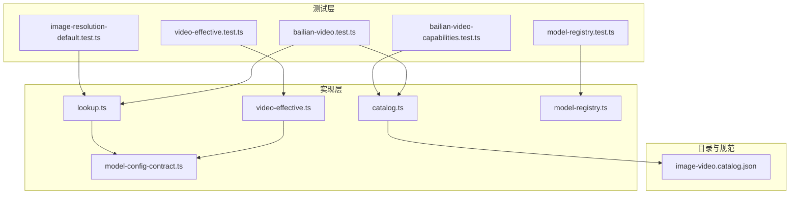
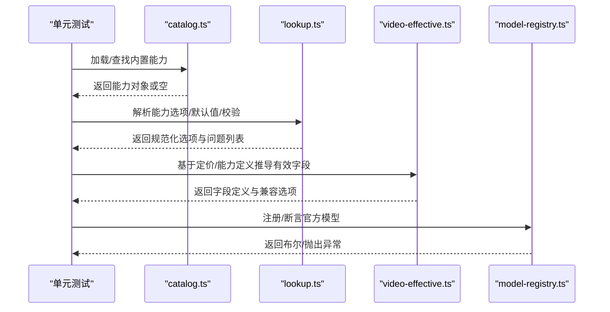
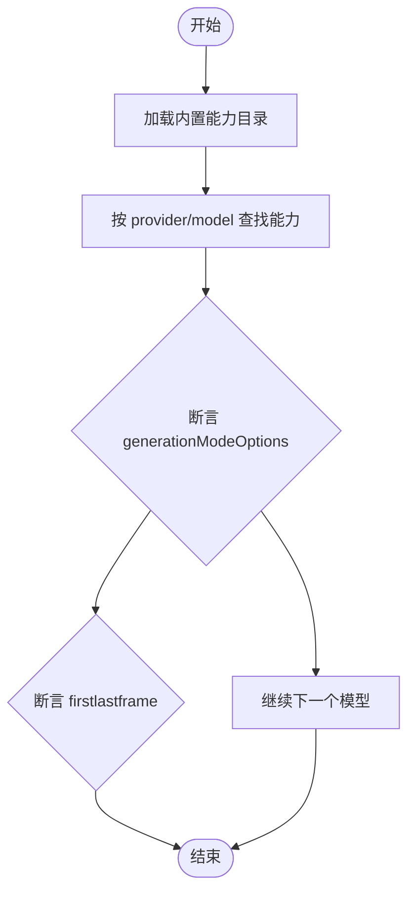
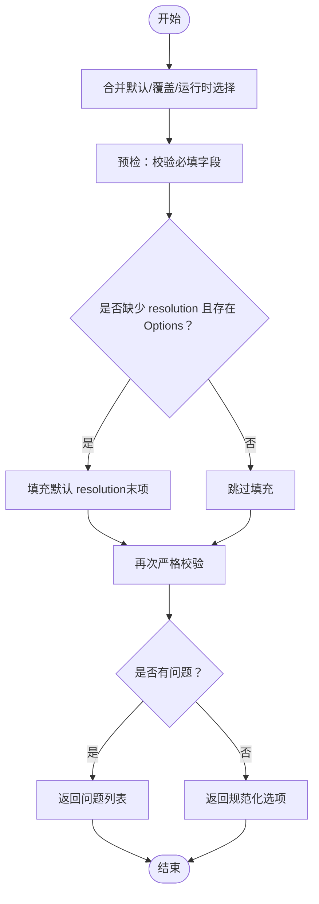
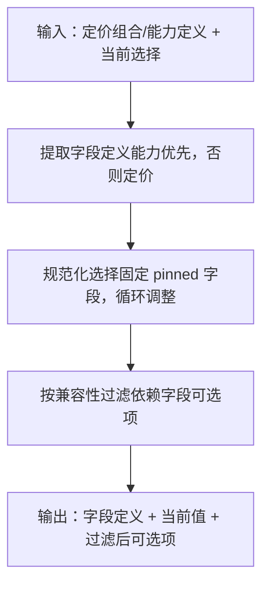
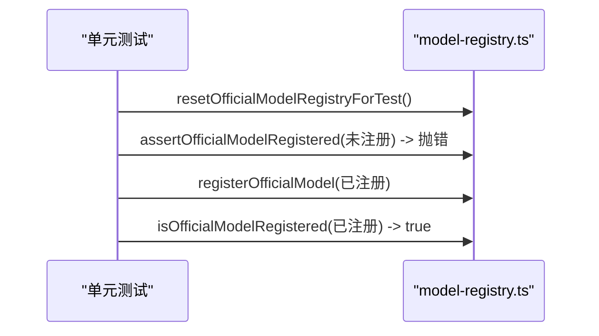
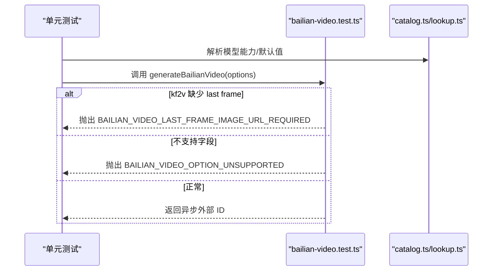
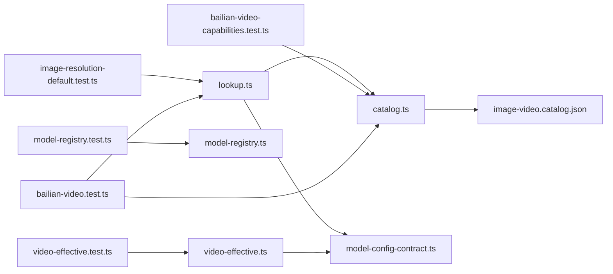

# 模型能力测试

<cite>
**本文引用的文件**
- [bailian-video-capabilities.test.ts](file://tests/unit/model-capabilities/bailian-video-capabilities.test.ts)
- [image-resolution-default.test.ts](file://tests/unit/model-capabilities/image-resolution-default.test.ts)
- [video-effective.test.ts](file://tests/unit/model-capabilities/video-effective.test.ts)
- [model-registry.test.ts](file://tests/unit/providers/model-registry.test.ts)
- [catalog.ts](file://src/lib/model-capabilities/catalog.ts)
- [lookup.ts](file://src/lib/model-capabilities/lookup.ts)
- [video-effective.ts](file://src/lib/model-capabilities/video-effective.ts)
- [model-registry.ts](file://src/lib/providers/official/model-registry.ts)
- [image-video.catalog.json](file://standards/capabilities/image-video.catalog.json)
- [model-config-contract.ts](file://src/lib/model-config-contract.ts)
- [bailian-video.test.ts](file://tests/unit/providers/bailian-video.test.ts)
</cite>

## 目录
1. [简介](#简介)
2. [项目结构](#项目结构)
3. [核心组件](#核心组件)
4. [架构总览](#架构总览)
5. [详细组件分析](#详细组件分析)
6. [依赖关系分析](#依赖关系分析)
7. [性能考虑](#性能考虑)
8. [故障排查指南](#故障排查指南)
9. [结论](#结论)
10. [附录](#附录)

## 简介
本文件面向模型能力系统的单元测试，聚焦以下目标：
- 百炼视频能力的测试策略：分辨率验证、编码格式测试与性能基准测试方法论
- 图像分辨率默认值与视频有效性测试：能力检测、兼容性验证与错误处理
- 模型注册表的测试策略：能力注册、动态发现与版本管理测试

文档以仓库中的测试用例与实现代码为依据，提供可操作的测试设计思路与验证流程。

## 项目结构
围绕“模型能力”与“官方模型注册”的关键目录与文件如下：
- 测试层
  - tests/unit/model-capabilities/*.test.ts：能力目录与解析、视频有效性、分辨率默认等测试
  - tests/unit/providers/model-registry.test.ts：官方模型注册表测试
  - tests/unit/providers/bailian-video.test.ts：百炼视频生成接口行为测试
- 实现层
  - src/lib/model-capabilities/catalog.ts：内置能力目录加载、缓存与查找
  - src/lib/model-capabilities/lookup.ts：能力选择解析、默认值填充与校验
  - src/lib/model-capabilities/video-effective.ts：基于定价与能力定义的有效能力字段推导
  - src/lib/providers/official/model-registry.ts：官方模型注册表
  - src/lib/model-config-contract.ts：能力字段类型与校验规则
- 能力目录
  - standards/capabilities/image-video.catalog.json：内置能力目录样例

**图表来源**
- [bailian-video-capabilities.test.ts:1-39](file://tests/unit/model-capabilities/bailian-video-capabilities.test.ts#L1-L39)
- [image-resolution-default.test.ts:1-58](file://tests/unit/model-capabilities/image-resolution-default.test.ts#L1-L58)
- [video-effective.test.ts:1-67](file://tests/unit/model-capabilities/video-effective.test.ts#L1-L67)
- [model-registry.test.ts:1-40](file://tests/unit/providers/model-registry.test.ts#L1-L40)
- [bailian-video.test.ts:1-272](file://tests/unit/providers/bailian-video.test.ts#L1-L272)
- [catalog.ts:1-224](file://src/lib/model-capabilities/catalog.ts#L1-L224)
- [lookup.ts:1-374](file://src/lib/model-capabilities/lookup.ts#L1-L374)
- [video-effective.ts:1-265](file://src/lib/model-capabilities/video-effective.ts#L1-L265)
- [model-registry.ts:1-48](file://src/lib/providers/official/model-registry.ts#L1-L48)
- [image-video.catalog.json:1-1161](file://standards/capabilities/image-video.catalog.json#L1-L1161)

**章节来源**
- [catalog.ts:1-224](file://src/lib/model-capabilities/catalog.ts#L1-L224)
- [lookup.ts:1-374](file://src/lib/model-capabilities/lookup.ts#L1-L374)
- [video-effective.ts:1-265](file://src/lib/model-capabilities/video-effective.ts#L1-L265)
- [model-registry.ts:1-48](file://src/lib/providers/official/model-registry.ts#L1-L48)
- [image-video.catalog.json:1-1161](file://standards/capabilities/image-video.catalog.json#L1-L1161)

## 核心组件
- 能力目录与解析
  - catalog.ts：负责从标准目录加载能力条目、构建缓存、按精确键与提供商标识键查找，并支持别名映射
  - lookup.ts：解析模型能力选项、合并默认/覆盖/运行时选择、自动填充分辨率/质量等默认值、严格校验
  - video-effective.ts：从能力或定价组合中提取有效字段定义、规范化选择并过滤依赖选项
- 官方模型注册表
  - model-registry.ts：提供注册、查询与断言能力，支持测试重置
- 能力契约与校验
  - model-config-contract.ts：定义统一模型类型、能力字段类型与校验规则（如 video 的 resolutionOptions、durationOptions 等）

**章节来源**
- [catalog.ts:169-224](file://src/lib/model-capabilities/catalog.ts#L169-L224)
- [lookup.ts:249-353](file://src/lib/model-capabilities/lookup.ts#L249-L353)
- [video-effective.ts:163-264](file://src/lib/model-capabilities/video-effective.ts#L163-L264)
- [model-registry.ts:26-47](file://src/lib/providers/official/model-registry.ts#L26-L47)
- [model-config-contract.ts:320-354](file://src/lib/model-config-contract.ts#L320-L354)

## 架构总览
下图展示“能力目录—能力解析—视频有效性—注册表”的交互关系与数据流。

**图表来源**
- [catalog.ts:129-224](file://src/lib/model-capabilities/catalog.ts#L129-L224)
- [lookup.ts:249-353](file://src/lib/model-capabilities/lookup.ts#L249-L353)
- [video-effective.ts:163-264](file://src/lib/model-capabilities/video-effective.ts#L163-L264)
- [model-registry.ts:26-47](file://src/lib/providers/official/model-registry.ts#L26-L47)

## 详细组件分析

### 百炼视频能力测试策略
- 测试目标
  - 验证不同百炼模型（i2v/kf2v）的能力注册与模式支持
  - 验证 generationModeOptions、firstlastframe 等字段的正确性
- 关键测试点
  - i2v 模型仅支持 normal 模式
  - kf2v 模型仅支持 firstlastframe 模式
  - wan2.7 i2v 支持双模（normal/firstlastframe）
- 测试方法
  - 使用 findBuiltinCapabilities 查询指定 provider+model 的能力
  - 断言 video.generationModeOptions 与 firstlastframe 字段
- 适用场景
  - UI 下拉选项生成、模型可用性筛选、工作流路由决策

**图表来源**
- [bailian-video-capabilities.test.ts:1-39](file://tests/unit/model-capabilities/bailian-video-capabilities.test.ts#L1-L39)
- [catalog.ts:169-224](file://src/lib/model-capabilities/catalog.ts#L169-L224)

**章节来源**
- [bailian-video-capabilities.test.ts:1-39](file://tests/unit/model-capabilities/bailian-video-capabilities.test.ts#L1-L39)
- [catalog.ts:169-224](file://src/lib/model-capabilities/catalog.ts#L169-L224)

### 图像分辨率默认值测试
- 测试目标
  - 在缺少 resolution 且需要全部字段时，自动填充默认分辨率
  - 用户显式提供的 resolution 不被覆盖
- 关键测试点
  - resolveGenerationOptionsForModel 在 requireAllFields=true 时进行预检与自动填充
  - 默认值选取规则：按 resolutionOptions 最后一个（最高清）
- 适用场景
  - 保证 UI/UX 一致性，避免必填字段缺失导致失败

**图表来源**
- [image-resolution-default.test.ts:1-58](file://tests/unit/model-capabilities/image-resolution-default.test.ts#L1-L58)
- [lookup.ts:249-353](file://src/lib/model-capabilities/lookup.ts#L249-L353)

**章节来源**
- [image-resolution-default.test.ts:1-58](file://tests/unit/model-capabilities/image-resolution-default.test.ts#L1-L58)
- [lookup.ts:249-353](file://src/lib/model-capabilities/lookup.ts#L249-L353)

### 视频有效性测试
- 测试目标
  - 从定价组合中提取有效字段定义（如 resolution/duration）
  - 固定 pinned 字段时，自动调整其他字段至最近支持组合
  - 依赖字段的可选项随当前选择过滤
- 关键测试点
  - resolveEffectiveVideoCapabilityDefinitions：优先使用能力定义，否则回退到定价组合
  - normalizeVideoGenerationSelections：按兼容性与默认策略规范化选择
  - resolveEffectiveVideoCapabilityFields：返回字段定义、当前值与过滤后的可选项
- 适用场景
  - 视频生成 UI 的联动选择、错误预防与体验优化

**图表来源**
- [video-effective.test.ts:1-67](file://tests/unit/model-capabilities/video-effective.test.ts#L1-L67)
- [video-effective.ts:163-264](file://src/lib/model-capabilities/video-effective.ts#L163-L264)

**章节来源**
- [video-effective.test.ts:1-67](file://tests/unit/model-capabilities/video-effective.test.ts#L1-L67)
- [video-effective.ts:163-264](file://src/lib/model-capabilities/video-effective.ts#L163-L264)

### 模型注册表测试策略
- 测试目标
  - 注册表未注册模型应抛出“未注册”错误
  - 已注册模型可通过 is/assert 方法识别
- 关键测试点
  - resetOfficialModelRegistryForTest 清理状态，确保测试隔离
  - assertOfficialModelRegistered 在缺失时抛错
  - registerOfficialModel 与 isOfficialModelRegistered 正向校验
- 适用场景
  - 官方模型白名单控制、接入前置校验

**图表来源**
- [model-registry.test.ts:1-40](file://tests/unit/providers/model-registry.test.ts#L1-L40)
- [model-registry.ts:26-47](file://src/lib/providers/official/model-registry.ts#L26-L47)

**章节来源**
- [model-registry.test.ts:1-40](file://tests/unit/providers/model-registry.test.ts#L1-L40)
- [model-registry.ts:26-47](file://src/lib/providers/official/model-registry.ts#L26-L47)

### 百炼视频生成接口测试（能力与请求）
- 测试目标
  - 验证不同模型（i2v/kf2v）提交请求的行为差异
  - 验证必填 last-frame 参数缺失时的快速失败
  - 验证不支持字段的快速失败
- 关键测试点
  - i2v：正常提交，支持 resolution/promptExtend/duration
  - kf2v：需 lastFrameImageUrl，否则抛错
  - 不支持字段（如 fps）直接拒绝
- 适用场景
  - 提供商集成测试、请求参数合法性与边界条件验证

**图表来源**
- [bailian-video.test.ts:1-272](file://tests/unit/providers/bailian-video.test.ts#L1-L272)
- [catalog.ts:169-224](file://src/lib/model-capabilities/catalog.ts#L169-L224)
- [lookup.ts:249-353](file://src/lib/model-capabilities/lookup.ts#L249-L353)

**章节来源**
- [bailian-video.test.ts:1-272](file://tests/unit/providers/bailian-video.test.ts#L1-L272)
- [catalog.ts:169-224](file://src/lib/model-capabilities/catalog.ts#L169-L224)
- [lookup.ts:249-353](file://src/lib/model-capabilities/lookup.ts#L249-L353)

## 依赖关系分析
- 能力目录依赖
  - catalog.ts 依赖 standards/capabilities/*（JSON 能力目录）
  - lookup.ts 依赖 catalog.ts 与 model-config-contract.ts
  - video-effective.ts 依赖 model-config-contract.ts 与定价类型
- 注册表依赖
  - model-registry.ts 为纯内存集合，无外部依赖
- 测试依赖
  - 各测试文件依赖对应实现模块与目录文件

**图表来源**
- [catalog.ts:1-224](file://src/lib/model-capabilities/catalog.ts#L1-L224)
- [lookup.ts:1-374](file://src/lib/model-capabilities/lookup.ts#L1-L374)
- [video-effective.ts:1-265](file://src/lib/model-capabilities/video-effective.ts#L1-L265)
- [model-registry.ts:1-48](file://src/lib/providers/official/model-registry.ts#L1-L48)
- [image-video.catalog.json:1-1161](file://standards/capabilities/image-video.catalog.json#L1-L1161)

**章节来源**
- [catalog.ts:1-224](file://src/lib/model-capabilities/catalog.ts#L1-L224)
- [lookup.ts:1-374](file://src/lib/model-capabilities/lookup.ts#L1-L374)
- [video-effective.ts:1-265](file://src/lib/model-capabilities/video-effective.ts#L1-L265)
- [model-registry.ts:1-48](file://src/lib/providers/official/model-registry.ts#L1-L48)
- [image-video.catalog.json:1-1161](file://standards/capabilities/image-video.catalog.json#L1-L1161)

## 性能考虑
- 能力目录缓存
  - catalog.ts 使用签名缓存避免重复加载与解析，建议在测试中通过 resetBuiltinCapabilityCatalogCacheForTest 清理缓存，确保每次测试独立
- 解析与校验
  - lookup.ts 的默认值填充与二次校验在 requireAllFields=true 时会增加开销，建议在批量测试中复用上下文
- 视频有效性计算
  - video-effective.ts 的规范化过程包含循环调整，字段较多时复杂度上升，建议在测试中控制字段数量与组合规模

[本节为通用指导，无需特定文件引用]

## 故障排查指南
- 能力目录相关
  - CAPABILITY_CATALOG_INVALID：目录项格式或字段类型不合法
  - CAPABILITY_CATALOG_DUPLICATE：同一模型键重复
  - CAPABILITY_CATALOG_MISSING：目录为空或路径错误
- 能力选择相关
  - CAPABILITY_SELECTION_INVALID/CAPABILITY_FIELD_INVALID/CAPABILITY_VALUE_NOT_ALLOWED/CAPABILITY_REQUIRED：选择值不符合能力定义
- 视频生成相关
  - BAILIAN_VIDEO_LAST_FRAME_IMAGE_URL_REQUIRED：kf2v 模型缺少 last frame
  - BAILIAN_VIDEO_OPTION_UNSUPPORTED：传入不支持的字段
- 注册表相关
  - MODEL_NOT_REGISTERED：官方模型未注册
  - MODEL_REGISTRY_INVALID_MODEL_ID：注册时模型 ID 为空

**章节来源**
- [catalog.ts:53-86](file://src/lib/model-capabilities/catalog.ts#L53-L86)
- [lookup.ts:106-164](file://src/lib/model-capabilities/lookup.ts#L106-L164)
- [bailian-video.test.ts:231-270](file://tests/unit/providers/bailian-video.test.ts#L231-L270)
- [model-registry.ts:40-47](file://src/lib/providers/official/model-registry.ts#L40-L47)

## 结论
- 百炼视频能力测试通过“能力目录—解析—有效性—注册表”四条主线覆盖了能力检测、兼容性与错误处理
- 图像分辨率默认值与视频有效性测试提供了稳健的 UI/UX 保障与边界条件覆盖
- 模型注册表测试确保官方模型白名单的正确性与可维护性
- 建议在持续集成中加入能力目录校验脚本与性能回归测试，以维持系统稳定性与可扩展性

[本节为总结性内容，无需特定文件引用]

## 附录

### 百炼视频能力测试清单
- i2v 模型仅支持 normal 模式
- kf2v 模型仅支持 firstlastframe 模式
- wan2.7 i2v 支持双模（normal/firstlastframe）
- 相关断言与查询路径参考：
  - [bailian-video-capabilities.test.ts:1-39](file://tests/unit/model-capabilities/bailian-video-capabilities.test.ts#L1-L39)
  - [catalog.ts:169-224](file://src/lib/model-capabilities/catalog.ts#L169-L224)

### 图像分辨率默认值测试清单
- 缺少 resolution 且 requireAllFields=true 时自动填充默认值
- 用户显式提供的 resolution 不被覆盖
- 相关断言与解析逻辑参考：
  - [image-resolution-default.test.ts:1-58](file://tests/unit/model-capabilities/image-resolution-default.test.ts#L1-L58)
  - [lookup.ts:249-353](file://src/lib/model-capabilities/lookup.ts#L249-L353)

### 视频有效性测试清单
- 从定价组合提取字段定义
- 固定 pinned 字段时自动调整其他字段
- 依赖字段可选项随当前选择过滤
- 相关断言与算法参考：
  - [video-effective.test.ts:1-67](file://tests/unit/model-capabilities/video-effective.test.ts#L1-L67)
  - [video-effective.ts:163-264](file://src/lib/model-capabilities/video-effective.ts#L163-L264)

### 模型注册表测试清单
- 未注册模型断言抛错
- 已注册模型可识别
- 测试隔离：resetOfficialModelRegistryForTest
- 相关断言与实现参考：
  - [model-registry.test.ts:1-40](file://tests/unit/providers/model-registry.test.ts#L1-L40)
  - [model-registry.ts:26-47](file://src/lib/providers/official/model-registry.ts#L26-L47)