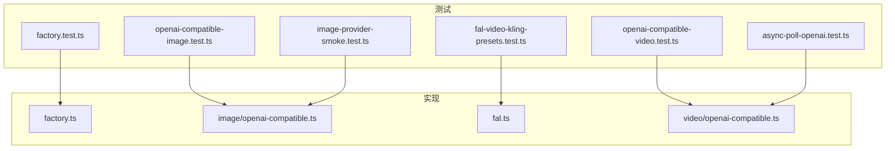
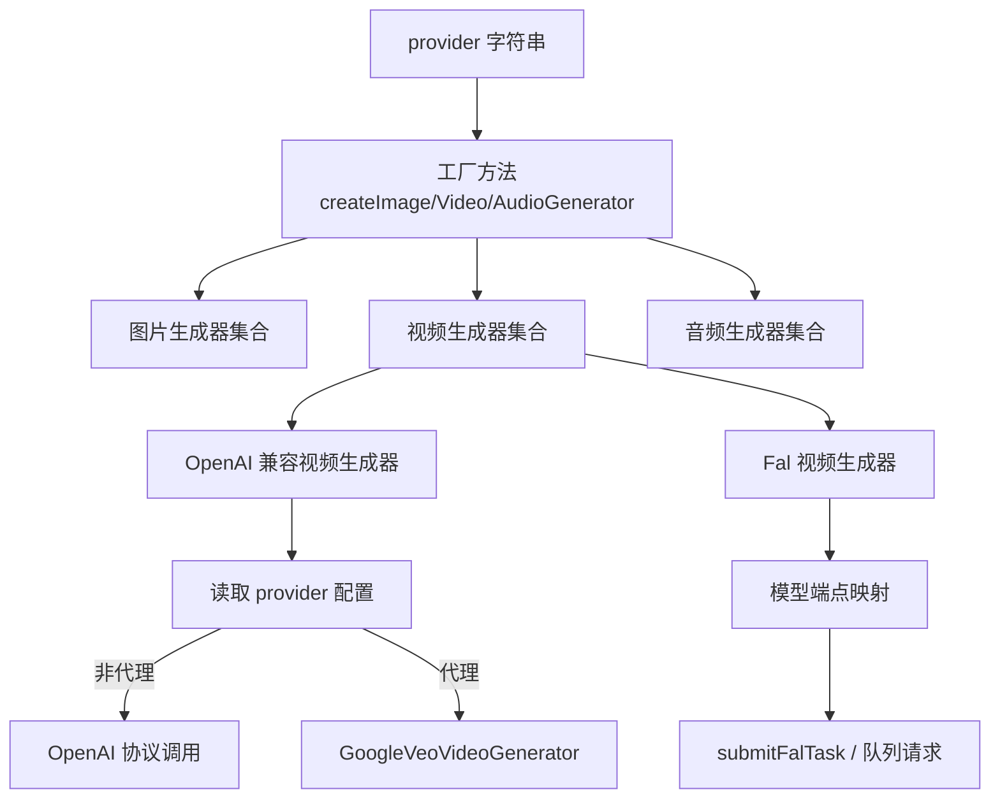
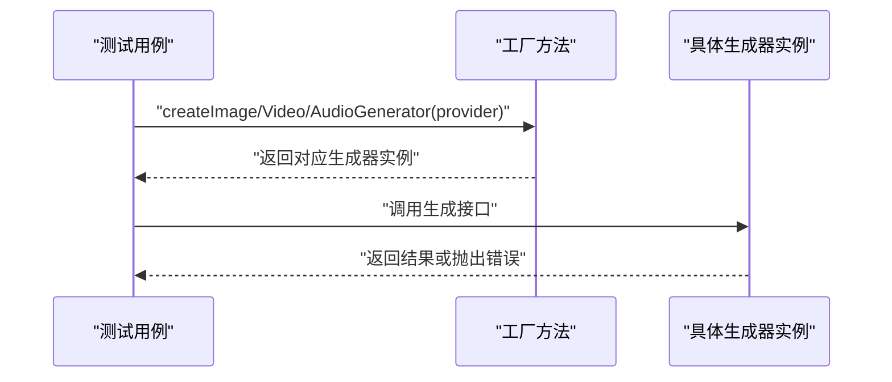
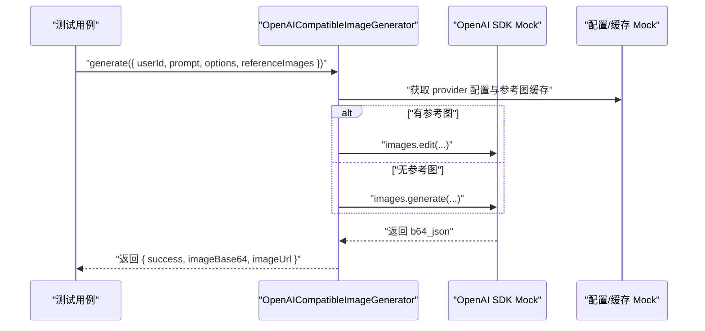
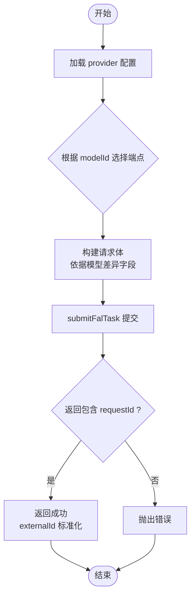
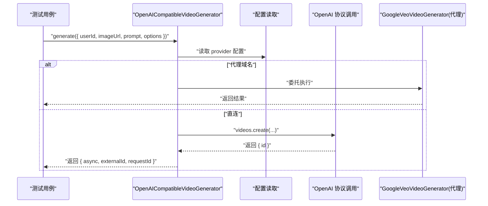
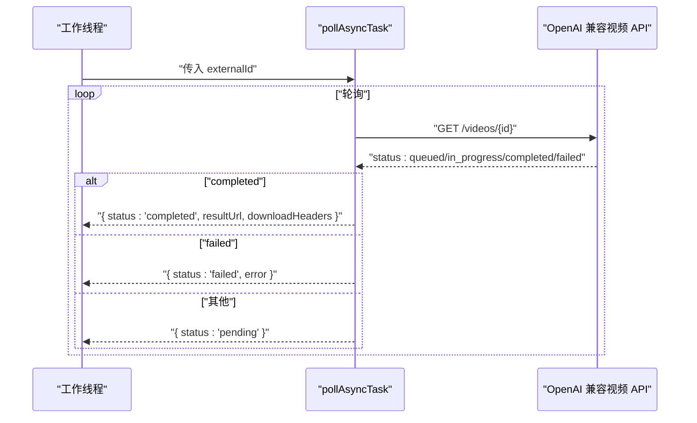
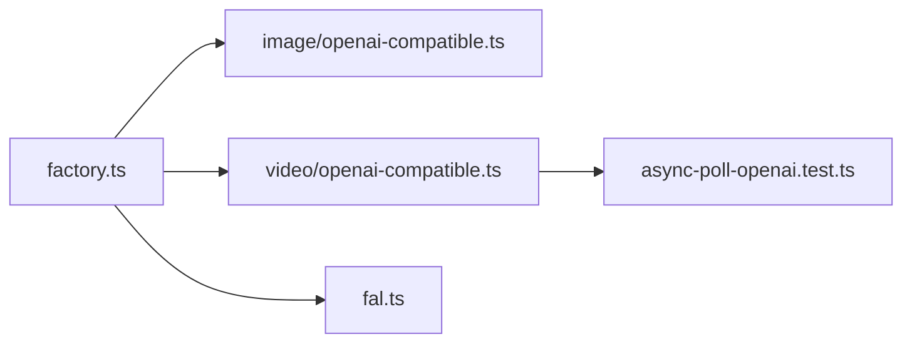

# 生成器测试

<cite>
**本文引用的文件**   
- [tests/unit/generators/factory.test.ts](file://tests/unit/generators/factory.test.ts)
- [src/lib/generators/factory.ts](file://src/lib/generators/factory.ts)
- [tests/unit/generators/openai-compatible-image.test.ts](file://tests/unit/generators/openai-compatible-image.test.ts)
- [src/lib/generators/image/openai-compatible.ts](file://src/lib/generators/image/openai-compatible.ts)
- [tests/unit/generators/fal-video-kling-presets.test.ts](file://tests/unit/generators/fal-video-kling-presets.test.ts)
- [src/lib/generators/fal.ts](file://src/lib/generators/fal.ts)
- [tests/unit/generators/openai-compatible-video.test.ts](file://tests/unit/generators/openai-compatible-video.test.ts)
- [src/lib/generators/video/openai-compatible.ts](file://src/lib/generators/video/openai-compatible.ts)
- [tests/unit/generators/image-provider-smoke.test.ts](file://tests/unit/generators/image-provider-smoke.test.ts)
- [tests/unit/task/async-poll-openai.test.ts](file://tests/unit/task/async-poll-openai.test.ts)
</cite>

## 目录
1. [引言](#引言)
2. [项目结构](#项目结构)
3. [核心组件](#核心组件)
4. [架构总览](#架构总览)
5. [详细组件分析](#详细组件分析)
6. [依赖关系分析](#依赖关系分析)
7. [性能考量](#性能考量)
8. [故障排查指南](#故障排查指南)
9. [结论](#结论)
10. [附录](#附录)

## 引言
本文件系统化梳理生成器系统的单元测试策略，覆盖以下主题：
- 生成器工厂的测试：类型识别、实例创建与配置路由的验证
- OpenAI 兼容图像生成器：请求格式、响应解析与错误处理
- Fal 视频 Kling 预设：参数校验、端点映射与请求体差异
- OpenAI 兼容视频生成器：异步任务、外部 ID 标准化与状态轮询
- 流式传输、进度报告与中断恢复：基于 OpenAI 兼容视频的轮询与断点续跑思路

## 项目结构
围绕“生成器”与“测试”的关键目录与文件如下：
- 工厂与生成器实现位于 src/lib/generators
- 对应的单元测试位于 tests/unit/generators
- 异步轮询与状态映射测试位于 tests/unit/task

图表来源
- [tests/unit/generators/factory.test.ts:1-23](file://tests/unit/generators/factory.test.ts#L1-L23)
- [src/lib/generators/factory.ts:1-118](file://src/lib/generators/factory.ts#L1-L118)
- [tests/unit/generators/openai-compatible-image.test.ts:1-123](file://tests/unit/generators/openai-compatible-image.test.ts#L1-L123)
- [src/lib/generators/image/openai-compatible.ts:1-27](file://src/lib/generators/image/openai-compatible.ts#L1-L27)
- [tests/unit/generators/fal-video-kling-presets.test.ts:1-95](file://tests/unit/generators/fal-video-kling-presets.test.ts#L1-L95)
- [src/lib/generators/fal.ts:1-315](file://src/lib/generators/fal.ts#L1-L315)
- [tests/unit/generators/openai-compatible-video.test.ts:1-167](file://tests/unit/generators/openai-compatible-video.test.ts#L1-L167)
- [src/lib/generators/video/openai-compatible.ts:1-49](file://src/lib/generators/video/openai-compatible.ts#L1-L49)
- [tests/unit/task/async-poll-openai.test.ts:1-86](file://tests/unit/task/async-poll-openai.test.ts#L1-L86)
- [tests/unit/generators/image-provider-smoke.test.ts:1-265](file://tests/unit/generators/image-provider-smoke.test.ts#L1-L265)

章节来源
- [tests/unit/generators/factory.test.ts:1-23](file://tests/unit/generators/factory.test.ts#L1-L23)
- [src/lib/generators/factory.ts:1-118](file://src/lib/generators/factory.ts#L1-L118)

## 核心组件
- 生成器工厂：根据 provider 字符串路由到具体生成器类，包含图片、视频、音频三类工厂方法
- OpenAI 兼容图像生成器：封装统一的 OpenAI 协议调用路径，支持生成与编辑两种模式
- Fal 视频生成器：统一处理多种视频模型（含 Kling v2.5/v3），按模型映射不同端点与请求体
- OpenAI 兼容视频生成器：在特定代理场景下委托 Google Veo 逻辑，否则走统一 OpenAI 协议
- 异步轮询与状态映射：对 OPENAI:VIDEO 外部 ID 进行轮询，映射队列中/进行中为 pending，完成返回下载地址与鉴权头

章节来源
- [src/lib/generators/factory.ts:36-117](file://src/lib/generators/factory.ts#L36-L117)
- [src/lib/generators/image/openai-compatible.ts:1-27](file://src/lib/generators/image/openai-compatible.ts#L1-L27)
- [src/lib/generators/fal.ts:196-308](file://src/lib/generators/fal.ts#L196-L308)
- [src/lib/generators/video/openai-compatible.ts:1-49](file://src/lib/generators/video/openai-compatible.ts#L1-L49)
- [tests/unit/task/async-poll-openai.test.ts:1-86](file://tests/unit/task/async-poll-openai.test.ts#L1-L86)

## 架构总览
生成器工厂通过 provider 关键字选择具体实现；OpenAI 兼容生成器进一步通过配置判断是否走代理中转；Fal 生成器根据模型 ID 映射到不同端点并构造差异化请求体。

图表来源
- [src/lib/generators/factory.ts:36-117](file://src/lib/generators/factory.ts#L36-L117)
- [src/lib/generators/video/openai-compatible.ts:27-47](file://src/lib/generators/video/openai-compatible.ts#L27-L47)
- [src/lib/generators/fal.ts:43-50](file://src/lib/generators/fal.ts#L43-L50)
- [src/lib/generators/fal.ts:230-289](file://src/lib/generators/fal.ts#L230-L289)

## 详细组件分析

### 生成器工厂测试策略
- 类型识别与路由：验证 provider 关键字到具体类实例的正确性，如“gemini-compatible”、“bailian”、“siliconflow”等
- 默认与异常分支：当传入未知 provider 时抛出明确错误，确保边界条件被覆盖
- 参数透传：工厂创建的生成器应保留 modelId/providerId 等参数，便于后续调用

图表来源
- [tests/unit/generators/factory.test.ts:7-22](file://tests/unit/generators/factory.test.ts#L7-L22)
- [src/lib/generators/factory.ts:36-117](file://src/lib/generators/factory.ts#L36-L117)

章节来源
- [tests/unit/generators/factory.test.ts:1-23](file://tests/unit/generators/factory.test.ts#L1-L23)
- [src/lib/generators/factory.ts:1-118](file://src/lib/generators/factory.ts#L1-L118)

### OpenAI 兼容图像生成器测试方法
- 请求格式验证：确保生成/编辑请求参数映射正确，如 response_format、output_format、quality、size 等字段
- 编辑模式分支：当存在 referenceImages 时，应使用编辑接口并正确处理数据 URL
- 错误处理：对不支持的选项值（如 quality）显式报错，保证配置约束被严格执行
- 响应解析：验证返回的 base64 数据与 data URL 组合是否符合预期

图表来源
- [tests/unit/generators/openai-compatible-image.test.ts:37-122](file://tests/unit/generators/openai-compatible-image.test.ts#L37-L122)
- [src/lib/generators/image/openai-compatible.ts:14-26](file://src/lib/generators/image/openai-compatible.ts#L14-L26)

章节来源
- [tests/unit/generators/openai-compatible-image.test.ts:1-123](file://tests/unit/generators/openai-compatible-image.test.ts#L1-L123)
- [src/lib/generators/image/openai-compatible.ts:1-27](file://src/lib/generators/image/openai-compatible.ts#L1-L27)

### Fal 视频 Kling 预设测试策略
- 模型端点映射：针对不同模型（v2.5-turbo/pro、v3/standard、v3/pro）验证 endpoint 与请求体字段差异
- 请求体字段校验：如 image_url/start_image_url、duration、negative_prompt、cfg_scale、aspect_ratio、generate_audio 等
- 外部 ID 标准化：确认 externalId 使用统一格式“FAL:VIDEO:{endpoint}:{requestId}”
- Provider 配置加载：验证通过 getProviderConfig 加载 apiKey 并传递给提交流程

图表来源
- [tests/unit/generators/fal-video-kling-presets.test.ts:40-94](file://tests/unit/generators/fal-video-kling-presets.test.ts#L40-L94)
- [src/lib/generators/fal.ts:230-307](file://src/lib/generators/fal.ts#L230-L307)

章节来源
- [tests/unit/generators/fal-video-kling-presets.test.ts:1-95](file://tests/unit/generators/fal-video-kling-presets.test.ts#L1-L95)
- [src/lib/generators/fal.ts:1-315](file://src/lib/generators/fal.ts#L1-L315)

### OpenAI 兼容视频生成器测试用例
- 异步任务与外部 ID：验证返回 async=true，并生成标准化 externalId（包含 provider token 与远端任务 id）
- 自定义模型 ID：允许传入任意字符串作为 modelId，确保协议兼容性
- 尺寸映射：针对常见横竖屏比例（如 3:2、2:3）显式映射到标准分辨率尺寸
- 不支持的比例：当传入不受支持的 aspectRatio 时，显式报错
- 代理场景：当 provider 配置指向特定代理域名时，委托 GoogleVeoVideoGenerator 执行

图表来源
- [tests/unit/generators/openai-compatible-video.test.ts:35-166](file://tests/unit/generators/openai-compatible-video.test.ts#L35-L166)
- [src/lib/generators/video/openai-compatible.ts:27-47](file://src/lib/generators/video/openai-compatible.ts#L27-L47)

章节来源
- [tests/unit/generators/openai-compatible-video.test.ts:1-167](file://tests/unit/generators/openai-compatible-video.test.ts#L1-L167)
- [src/lib/generators/video/openai-compatible.ts:1-49](file://src/lib/generators/video/openai-compatible.ts#L1-L49)

### 流式传输、进度报告与中断恢复测试思路
- 流式传输：OpenAI 兼容视频生成采用异步任务，需结合轮询接口对任务状态进行映射
- 进度报告：轮询接口将 queued/in_progress 映射为 pending，completed 返回可下载 URL 与鉴权头
- 中断恢复：基于外部 ID（OPENAI:VIDEO:{providerToken}:{taskId}）进行重试与断点续跑，避免重复提交

图表来源
- [tests/unit/task/async-poll-openai.test.ts:21-85](file://tests/unit/task/async-poll-openai.test.ts#L21-L85)
- [src/lib/generators/video/openai-compatible.ts:32-36](file://src/lib/generators/video/openai-compatible.ts#L32-L36)

章节来源
- [tests/unit/task/async-poll-openai.test.ts:1-86](file://tests/unit/task/async-poll-openai.test.ts#L1-L86)
- [src/lib/generators/video/openai-compatible.ts:1-49](file://src/lib/generators/video/openai-compatible.ts#L1-L49)

## 依赖关系分析
- 工厂到实现：工厂方法直接实例化具体生成器，耦合度低，利于扩展新 provider
- OpenAI 兼容层：图像与视频生成器均通过统一的“model-gateway”或配置读取进行调用，便于替换底层实现
- Fal 生成器：通过端点映射表集中管理模型差异，减少分支复杂度
- 轮询与状态：异步轮询独立于生成器，仅依赖外部 ID 标准化格式

图表来源
- [src/lib/generators/factory.ts:36-117](file://src/lib/generators/factory.ts#L36-L117)
- [src/lib/generators/image/openai-compatible.ts:1-27](file://src/lib/generators/image/openai-compatible.ts#L1-L27)
- [src/lib/generators/video/openai-compatible.ts:1-49](file://src/lib/generators/video/openai-compatible.ts#L1-L49)
- [src/lib/generators/fal.ts:1-315](file://src/lib/generators/fal.ts#L1-L315)
- [tests/unit/task/async-poll-openai.test.ts:1-86](file://tests/unit/task/async-poll-openai.test.ts#L1-L86)

章节来源
- [src/lib/generators/factory.ts:1-118](file://src/lib/generators/factory.ts#L1-L118)
- [src/lib/generators/fal.ts:1-315](file://src/lib/generators/fal.ts#L1-L315)

## 性能考量
- 请求体最小化：仅传递必要字段，避免冗余参数导致的网络与解析开销
- 缓存与预处理：参考图转换为 data URL 的过程应尽量复用缓存，减少重复 I/O
- 异步批处理：Fal/Kling 等平台支持队列提交，优先采用异步模式以提升吞吐
- 轮询节流：对 pending 状态的轮询应设置合理间隔，避免频繁请求

## 故障排查指南
- 未知 provider：工厂在无法识别 provider 时抛出错误，检查 provider 字符串与映射表
- 不支持的选项：Fal 图像/视频生成器对未允许的选项键会抛错，核对 options 键名与取值范围
- OpenAI 兼容视频代理：若配置指向特定代理域名，需确认代理逻辑与上游 API 差异
- 轮询失败：completed 状态应返回可下载 URL 与鉴权头；failed 状态应携带提供商错误信息

章节来源
- [src/lib/generators/fal.ts:83-88](file://src/lib/generators/fal.ts#L83-L88)
- [src/lib/generators/fal.ts:223-228](file://src/lib/generators/fal.ts#L223-L228)
- [tests/unit/task/async-poll-openai.test.ts:53-84](file://tests/unit/task/async-poll-openai.test.ts#L53-L84)

## 结论
本测试体系通过“工厂路由 + 协议兼容 + 平台适配 + 异步轮询”的分层设计，覆盖了生成器在类型识别、参数校验、请求构造与状态映射等方面的质量保障。建议持续补充：
- 覆盖更多 provider 的工厂路由用例
- 增加错误码与日志级别的断言
- 补充性能基准测试（并发、延迟、吞吐）

## 附录
- OpenAI 兼容图像/视频生成器的请求参数与返回结构，详见对应实现文件与测试用例
- Fal 视频模型端点映射与请求体差异，详见实现文件中的映射表与 switch 分支