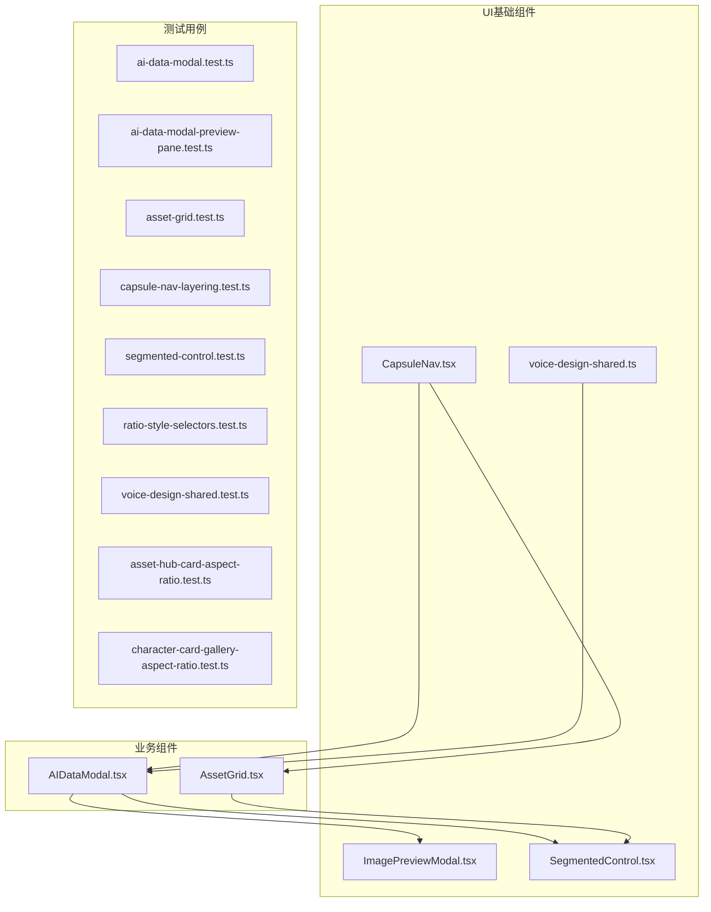
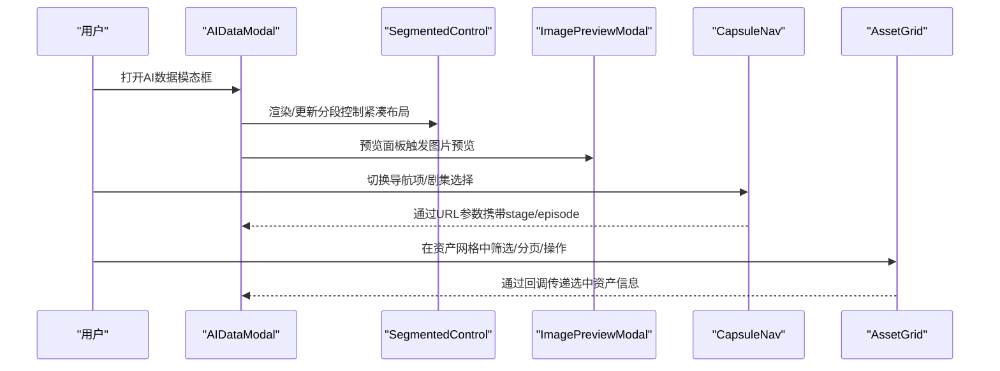
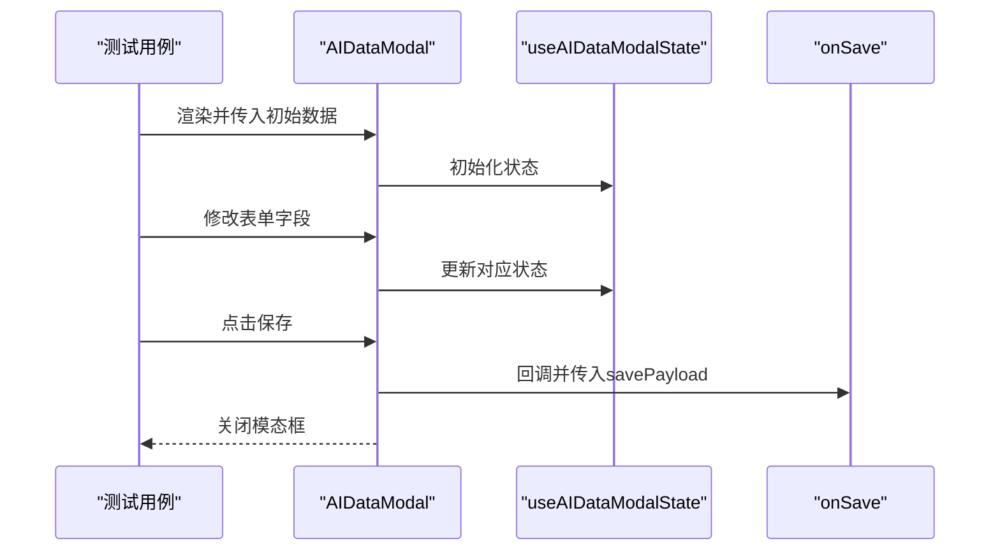
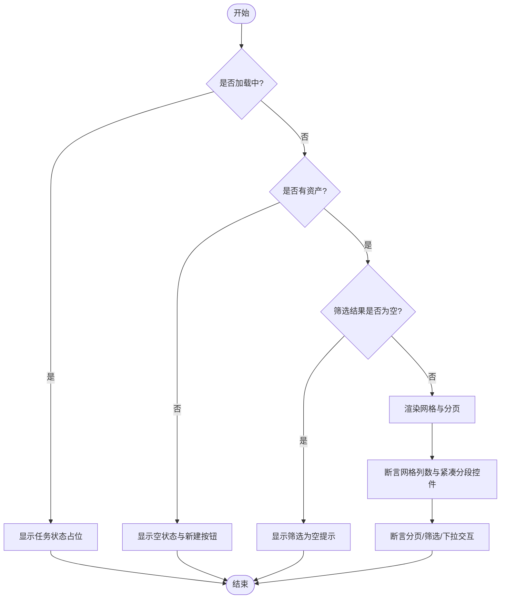
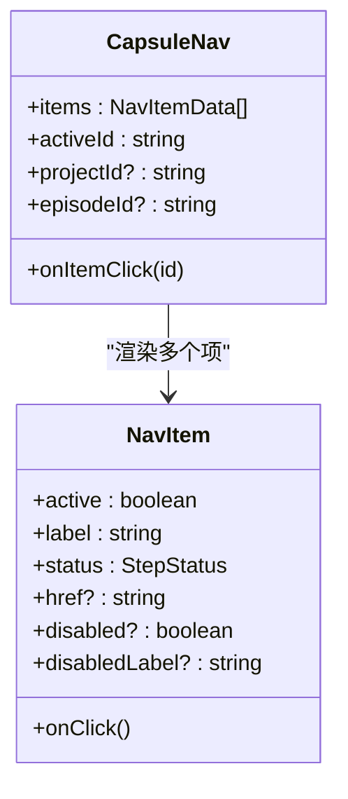
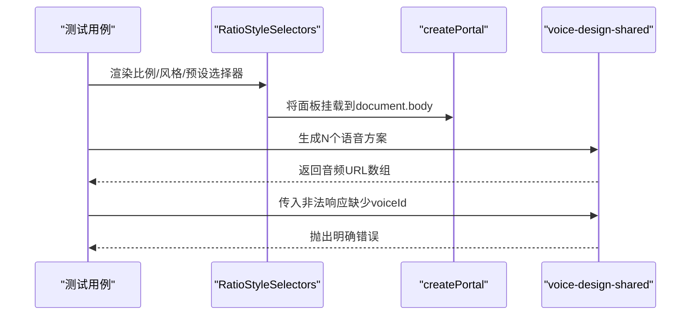
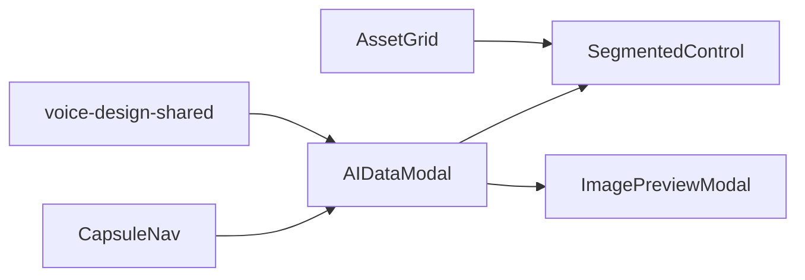

# 组件测试

<cite>
**本文引用的文件**
- [src/components/ui/CapsuleNav.tsx](file://src/components/ui/CapsuleNav.tsx)
- [src/components/ui/ImagePreviewModal.tsx](file://src/components/ui/ImagePreviewModal.tsx)
- [src/components/ui/SegmentedControl.tsx](file://src/components/ui/SegmentedControl.tsx)
- [src/components/voice/voice-design-shared.ts](file://src/components/voice/voice-design-shared.ts)
- [src/app/[locale]/workspace/[projectId]/modes/novel-promotion/components/storyboard/AIDataModal.tsx](file://src/app/[locale]/workspace/[projectId]/modes/novel-promotion/components/storyboard/AIDataModal.tsx)
- [src/app/[locale]/workspace/asset-hub/components/AssetGrid.tsx](file://src/app/[locale]/workspace/asset-hub/components/AssetGrid.tsx)
- [tests/unit/components/ai-data-modal.test.ts](file://tests/unit/components/ai-data-modal.test.ts)
- [tests/unit/components/ai-data-modal-preview-pane.test.ts](file://tests/unit/components/ai-data-modal-preview-pane.test.ts)
- [tests/unit/components/asset-grid.test.ts](file://tests/unit/components/asset-grid.test.ts)
- [tests/unit/components/asset-hub-card-aspect-ratio.test.ts](file://tests/unit/components/asset-hub-card-aspect-ratio.test.ts)
- [tests/unit/components/character-card-gallery-aspect-ratio.test.ts](file://tests/unit/components/character-card-gallery-aspect-ratio.test.ts)
- [tests/unit/components/capsule-nav-layering.test.ts](file://tests/unit/components/capsule-nav-layering.test.ts)
- [tests/unit/components/ratio-style-selectors.test.ts](file://tests/unit/components/ratio-style-selectors.test.ts)
- [tests/unit/components/segmented-control.test.ts](file://tests/unit/components/segmented-control.test.ts)
- [tests/unit/components/voice-design-shared.test.ts](file://tests/unit/components/voice-design-shared.test.ts)
</cite>

## 目录
1. [简介](#简介)
2. [项目结构](#项目结构)
3. [核心组件](#核心组件)
4. [架构总览](#架构总览)
5. [详细组件分析](#详细组件分析)
6. [依赖关系分析](#依赖关系分析)
7. [性能考量](#性能考量)
8. [故障排查指南](#故障排查指南)
9. [结论](#结论)
10. [附录](#附录)

## 简介
本文件面向UI组件的单元测试，聚焦以下目标：
- AI数据模态框的数据预览、编辑功能与状态同步测试策略
- 资产网格组件的布局渲染、响应式设计与交互行为测试
- 胶囊导航组件的层级管理、样式切换与动画效果测试
- 分割控制、比例选择器与语音设计共享组件的用户交互、状态管理与性能优化测试

通过结合源码与现有测试文件，给出可执行的测试思路、断言要点与可视化图示，帮助开发者快速落地高质量的单元测试。

## 项目结构
围绕本次文档涉及的组件与测试，关键目录与文件如下：
- UI基础组件：胶囊导航、图像预览模态、分割控制、语音设计共享工具
- 业务模态与网格：AI数据模态框、资产网格
- 测试用例：覆盖渲染、交互、状态与边界条件

图表来源
- [src/components/ui/CapsuleNav.tsx:123-162](file://src/components/ui/CapsuleNav.tsx#L123-L162)
- [src/components/ui/ImagePreviewModal.tsx:14-38](file://src/components/ui/ImagePreviewModal.tsx#L14-L38)
- [src/components/ui/SegmentedControl.tsx:34-84](file://src/components/ui/SegmentedControl.tsx#L34-L84)
- [src/components/voice/voice-design-shared.ts:44-83](file://src/components/voice/voice-design-shared.ts#L44-L83)
- [src/app/[locale]/workspace/[projectId]/modes/novel-promotion/components/storyboard/AIDataModal.tsx](file://src/app/[locale]/workspace/[projectId]/modes/novel-promotion/components/storyboard/AIDataModal.tsx#L23-L178)
- [src/app/[locale]/workspace/asset-hub/components/AssetGrid.tsx](file://src/app/[locale]/workspace/asset-hub/components/AssetGrid.tsx#L135-L481)

章节来源
- [src/components/ui/CapsuleNav.tsx:123-162](file://src/components/ui/CapsuleNav.tsx#L123-L162)
- [src/components/ui/ImagePreviewModal.tsx:14-38](file://src/components/ui/ImagePreviewModal.tsx#L14-L38)
- [src/components/ui/SegmentedControl.tsx:34-84](file://src/components/ui/SegmentedControl.tsx#L34-L84)
- [src/components/voice/voice-design-shared.ts:44-83](file://src/components/voice/voice-design-shared.ts#L44-L83)
- [src/app/[locale]/workspace/[projectId]/modes/novel-promotion/components/storyboard/AIDataModal.tsx](file://src/app/[locale]/workspace/[projectId]/modes/novel-promotion/components/storyboard/AIDataModal.tsx#L23-L178)
- [src/app/[locale]/workspace/asset-hub/components/AssetGrid.tsx](file://src/app/[locale]/workspace/asset-hub/components/AssetGrid.tsx#L135-L481)

## 核心组件
- 胶囊导航（CapsuleNav）：固定悬浮导航，支持点击切换、中键/Ctrl+点击新标签页打开；包含状态指示与禁用提示气泡；提供剧集选择器。
- 图像预览模态（ImagePreviewModal）：全屏预览图片，支持Esc关闭、原图查看链接、点击遮罩关闭。
- 分割控制（SegmentedControl）：统一iOS风格分段控件，带滑动胶囊指示器，支持紧凑/填充布局。
- 语音设计共享（voice-design-shared）：生成语音方案计数规范化、偏好名生成、批量生成语音设计选项。
- AI数据模态框（AIDataModal）：故事板AI数据编辑与预览，包含表单区与预览JSON区，支持保存与滚动锁定。
- 资产网格（AssetGrid）：资产库网格渲染，按类型分组、分页、筛选，集成任务状态与操作入口。

章节来源
- [src/components/ui/CapsuleNav.tsx:27-162](file://src/components/ui/CapsuleNav.tsx#L27-L162)
- [src/components/ui/ImagePreviewModal.tsx:14-77](file://src/components/ui/ImagePreviewModal.tsx#L14-L77)
- [src/components/ui/SegmentedControl.tsx:26-84](file://src/components/ui/SegmentedControl.tsx#L26-L84)
- [src/components/voice/voice-design-shared.ts:24-83](file://src/components/voice/voice-design-shared.ts#L24-L83)
- [src/app/[locale]/workspace/[projectId]/modes/novel-promotion/components/storyboard/AIDataModal.tsx](file://src/app/[locale]/workspace/[projectId]/modes/novel-promotion/components/storyboard/AIDataModal.tsx#L23-L178)
- [src/app/[locale]/workspace/asset-hub/components/AssetGrid.tsx](file://src/app/[locale]/workspace/asset-hub/components/AssetGrid.tsx#L135-L481)

## 架构总览
从测试视角看，组件间关系与数据流如下：

图表来源
- [src/app/[locale]/workspace/[projectId]/modes/novel-promotion/components/storyboard/AIDataModal.tsx](file://src/app/[locale]/workspace/[projectId]/modes/novel-promotion/components/storyboard/AIDataModal.tsx#L123-L178)
- [src/components/ui/SegmentedControl.tsx:34-84](file://src/components/ui/SegmentedControl.tsx#L34-L84)
- [src/components/ui/ImagePreviewModal.tsx:14-77](file://src/components/ui/ImagePreviewModal.tsx#L14-L77)
- [src/components/ui/CapsuleNav.tsx:123-162](file://src/components/ui/CapsuleNav.tsx#L123-L162)
- [src/app/[locale]/workspace/asset-hub/components/AssetGrid.tsx](file://src/app/[locale]/workspace/asset-hub/components/AssetGrid.tsx#L135-L481)

## 详细组件分析

### AI数据模态框测试策略
目标
- 数据预览：验证预览JSON包含关键字段与格式
- 编辑功能：验证表单字段变更后状态更新
- 状态同步：验证保存时payload与外部回调

测试要点
- 使用静态渲染断言预览JSON的关键键值存在性
- 断言表单字段变更触发内部状态更新
- 断言保存回调被调用且传入预期payload
- 复制预览JSON的降级逻辑（Clipboard API拒绝时回退execCommand）

建议断言清单
- 预览JSON包含角色、外观、位置等字段
- 预览JSON包含摄影规则与表演备注（若存在）
- Esc键关闭模态框、点击遮罩关闭
- 保存按钮触发onSave并关闭模态框

图表来源
- [src/app/[locale]/workspace/[projectId]/modes/novel-promotion/components/storyboard/AIDataModal.tsx](file://src/app/[locale]/workspace/[projectId]/modes/novel-promotion/components/storyboard/AIDataModal.tsx#L42-L71)
- [tests/unit/components/ai-data-modal.test.ts:15-48](file://tests/unit/components/ai-data-modal.test.ts#L15-L48)
- [tests/unit/components/ai-data-modal-preview-pane.test.ts:4-34](file://tests/unit/components/ai-data-modal-preview-pane.test.ts#L4-L34)

章节来源
- [src/app/[locale]/workspace/[projectId]/modes/novel-promotion/components/storyboard/AIDataModal.tsx](file://src/app/[locale]/workspace/[projectId]/modes/novel-promotion/components/storyboard/AIDataModal.tsx#L23-L178)
- [tests/unit/components/ai-data-modal.test.ts:15-48](file://tests/unit/components/ai-data-modal.test.ts#L15-L48)
- [tests/unit/components/ai-data-modal-preview-pane.test.ts:4-34](file://tests/unit/components/ai-data-modal-preview-pane.test.ts#L4-L34)

### 资产网格组件测试方法
目标
- 布局渲染：空状态、筛选为空、各类型卡片渲染
- 响应式设计：紧凑分段控件、网格列数随屏幕变化
- 交互行为：分页、筛选、新建资产下拉、下载按钮

测试要点
- 空状态：断言紧凑布局与“新建资产”按钮出现
- 筛选为空：断言提示文案出现
- 网格渲染：断言各类型卡片容器与分页组件存在
- 响应式：断言网格列数在不同断点下的表现（由CSS类控制）
- 交互：断言分页按钮禁用状态、筛选Tab切换、新建下拉菜单定位与点击

图表来源
- [src/app/[locale]/workspace/asset-hub/components/AssetGrid.tsx](file://src/app/[locale]/workspace/asset-hub/components/AssetGrid.tsx#L135-L481)
- [tests/unit/components/asset-grid.test.ts:83-158](file://tests/unit/components/asset-grid.test.ts#L83-L158)

章节来源
- [src/app/[locale]/workspace/asset-hub/components/AssetGrid.tsx](file://src/app/[locale]/workspace/asset-hub/components/AssetGrid.tsx#L135-L481)
- [tests/unit/components/asset-grid.test.ts:83-158](file://tests/unit/components/asset-grid.test.ts#L83-L158)
- [tests/unit/components/asset-hub-card-aspect-ratio.test.ts:149-243](file://tests/unit/components/asset-hub-card-aspect-ratio.test.ts#L149-L243)
- [tests/unit/components/character-card-gallery-aspect-ratio.test.ts:39-70](file://tests/unit/components/character-card-gallery-aspect-ratio.test.ts#L39-L70)

### 胶囊导航组件测试策略
目标
- 层级管理：确保导航在模态框之上但低于更高优先级层
- 样式切换：激活态、禁用态、状态指示（完成/处理中）
- 动画效果：进入动画与图标旋转

测试要点
- 断言固定定位与z-index层级
- 断言禁用态提示气泡在hover时可见
- 断言状态指示胶囊宽度与颜色
- 断言中键/Ctrl+点击在新标签页打开

图表来源
- [src/components/ui/CapsuleNav.tsx:19-162](file://src/components/ui/CapsuleNav.tsx#L19-L162)

章节来源
- [src/components/ui/CapsuleNav.tsx:19-162](file://src/components/ui/CapsuleNav.tsx#L19-L162)
- [tests/unit/components/capsule-nav-layering.test.ts:16-46](file://tests/unit/components/capsule-nav-layering.test.ts#L16-L46)

### 分割控制、比例选择器与语音设计共享组件测试
目标
- 分割控制：紧凑布局输出左对齐非拉伸结构
- 比例选择器：通过Portal挂载到document.body
- 语音设计共享：方案数量范围校验、批量生成与错误处理

测试要点
- 分割控制：断言紧凑布局类名与网格模板列未设置
- 比例/风格选择器：断言Portal调用次数与目标为document.body
- 语音设计：断言计数归一化、默认试听文案回退、缺失voiceId抛错

图表来源
- [tests/unit/components/ratio-style-selectors.test.ts:57-106](file://tests/unit/components/ratio-style-selectors.test.ts#L57-L106)
- [tests/unit/components/voice-design-shared.test.ts:10-68](file://tests/unit/components/voice-design-shared.test.ts#L10-L68)

章节来源
- [src/components/ui/SegmentedControl.tsx:34-84](file://src/components/ui/SegmentedControl.tsx#L34-L84)
- [tests/unit/components/segmented-control.test.ts:7-29](file://tests/unit/components/segmented-control.test.ts#L7-L29)
- [tests/unit/components/ratio-style-selectors.test.ts:57-106](file://tests/unit/components/ratio-style-selectors.test.ts#L57-L106)
- [src/components/voice/voice-design-shared.ts:24-83](file://src/components/voice/voice-design-shared.ts#L24-L83)
- [tests/unit/components/voice-design-shared.test.ts:10-68](file://tests/unit/components/voice-design-shared.test.ts#L10-L68)

## 依赖关系分析
- AIDataModal依赖SegmentedControl进行筛选与布局，依赖ImagePreviewModal进行图片预览
- CapsuleNav提供导航与剧集选择，影响AIDataModal的URL参数
- AssetGrid依赖SegmentedControl进行筛选，依赖Portal组件实现下拉菜单与弹层
- voice-design-shared被AIDataModal等组件复用，提供语音方案生成能力

图表来源
- [src/app/[locale]/workspace/[projectId]/modes/novel-promotion/components/storyboard/AIDataModal.tsx](file://src/app/[locale]/workspace/[projectId]/modes/novel-promotion/components/storyboard/AIDataModal.tsx#L123-L178)
- [src/components/ui/SegmentedControl.tsx:34-84](file://src/components/ui/SegmentedControl.tsx#L34-L84)
- [src/components/ui/ImagePreviewModal.tsx:14-77](file://src/components/ui/ImagePreviewModal.tsx#L14-L77)
- [src/components/ui/CapsuleNav.tsx:123-162](file://src/components/ui/CapsuleNav.tsx#L123-L162)
- [src/app/[locale]/workspace/asset-hub/components/AssetGrid.tsx](file://src/app/[locale]/workspace/asset-hub/components/AssetGrid.tsx#L135-L481)
- [src/components/voice/voice-design-shared.ts:44-83](file://src/components/voice/voice-design-shared.ts#L44-L83)

章节来源
- [src/app/[locale]/workspace/[projectId]/modes/novel-promotion/components/storyboard/AIDataModal.tsx](file://src/app/[locale]/workspace/[projectId]/modes/novel-promotion/components/storyboard/AIDataModal.tsx#L123-L178)
- [src/components/ui/SegmentedControl.tsx:34-84](file://src/components/ui/SegmentedControl.tsx#L34-L84)
- [src/components/ui/ImagePreviewModal.tsx:14-77](file://src/components/ui/ImagePreviewModal.tsx#L14-L77)
- [src/components/ui/CapsuleNav.tsx:123-162](file://src/components/ui/CapsuleNav.tsx#L123-L162)
- [src/app/[locale]/workspace/asset-hub/components/AssetGrid.tsx](file://src/app/[locale]/workspace/asset-hub/components/AssetGrid.tsx#L135-L481)
- [src/components/voice/voice-design-shared.ts:44-83](file://src/components/voice/voice-design-shared.ts#L44-L83)

## 性能考量
- 静态渲染断言：使用静态渲染（如renderToStaticMarkup）减少DOM副作用，提升测试稳定性与速度
- Portal挂载：断言Portal目标为document.body，避免重复挂载导致的内存泄漏
- 状态最小化：通过useState钩子模拟初始状态，避免复杂初始化成本
- 事件清理：确保键盘事件与点击事件在组件卸载时清理，防止内存泄漏

## 故障排查指南
常见问题与定位
- 预览JSON缺失字段：检查useAIDataModalState返回的savePayload结构与AIDataModal拼装逻辑
- 分段控件布局异常：确认layout属性与紧凑类名组合，避免grid-template-columns误用
- Portal未挂载：确认createPortal调用与document对象可用性
- 语音生成失败：检查onDesignVoice返回值完整性与normalizeVoiceSchemeCount边界值

章节来源
- [tests/unit/components/ai-data-modal.test.ts:15-48](file://tests/unit/components/ai-data-modal.test.ts#L15-L48)
- [tests/unit/components/segmented-control.test.ts:7-29](file://tests/unit/components/segmented-control.test.ts#L7-L29)
- [tests/unit/components/ratio-style-selectors.test.ts:57-106](file://tests/unit/components/ratio-style-selectors.test.ts#L57-L106)
- [tests/unit/components/voice-design-shared.test.ts:10-68](file://tests/unit/components/voice-design-shared.test.ts#L10-L68)

## 结论
通过将组件职责拆解为渲染、交互与状态三部分，并结合现有测试用例的断言模式，可以系统地覆盖AI数据模态框、资产网格、胶囊导航、分割控制、比例选择器与语音设计共享组件的核心行为。建议在新增功能时沿用相同断言策略，确保测试稳定、可维护且具备良好的回归防护能力。

## 附录
- 测试运行建议：使用Vitest与React Testing Utilities，配合静态渲染与Portal Mock，确保跨组件交互测试的准确性
- 国际化处理：通过NextIntl Provider注入消息，保证多语言文案断言一致性