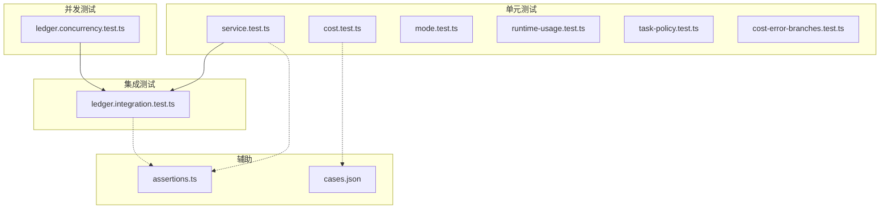
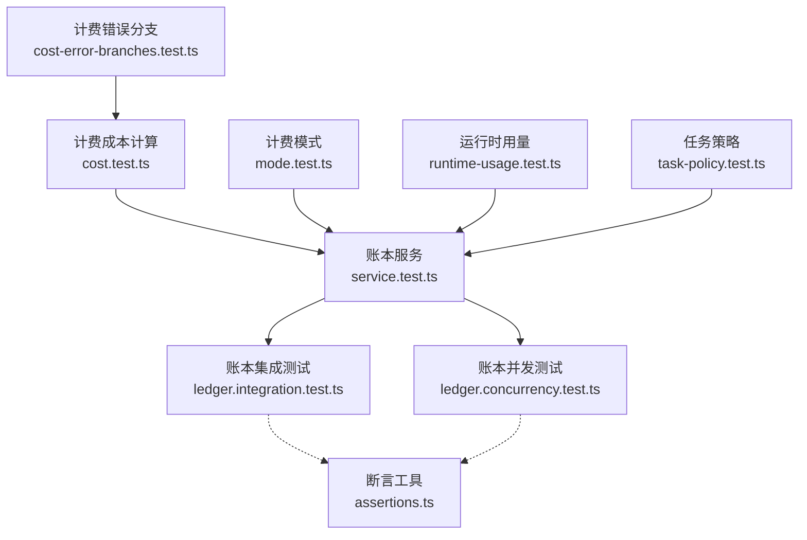
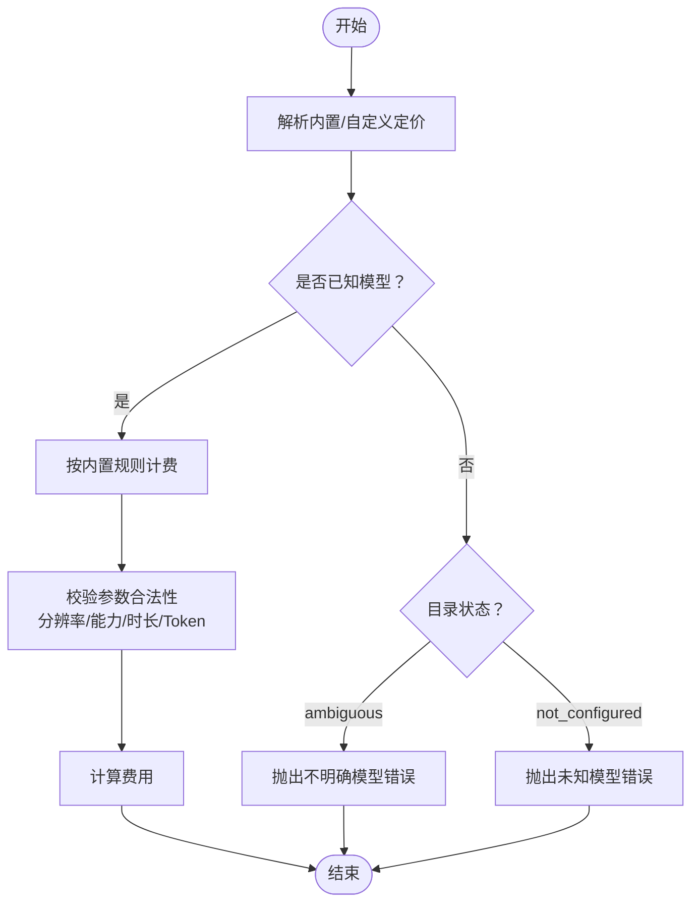
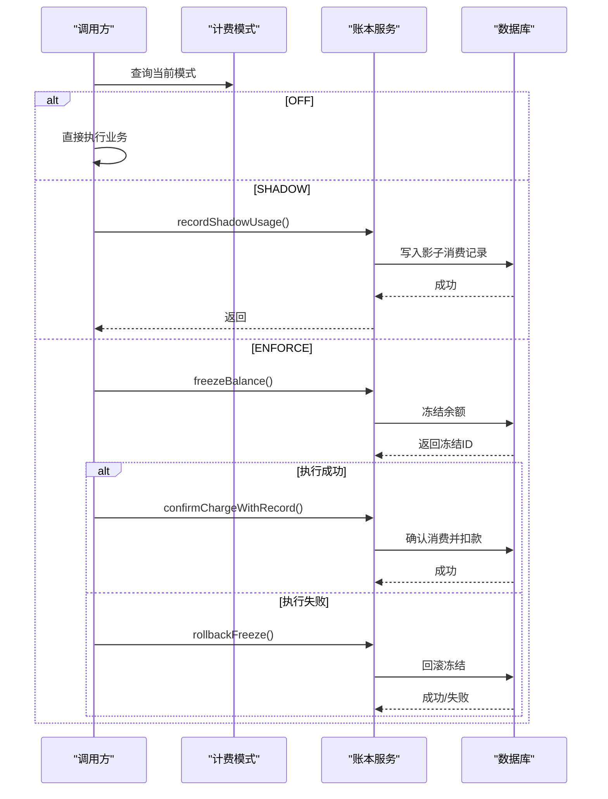
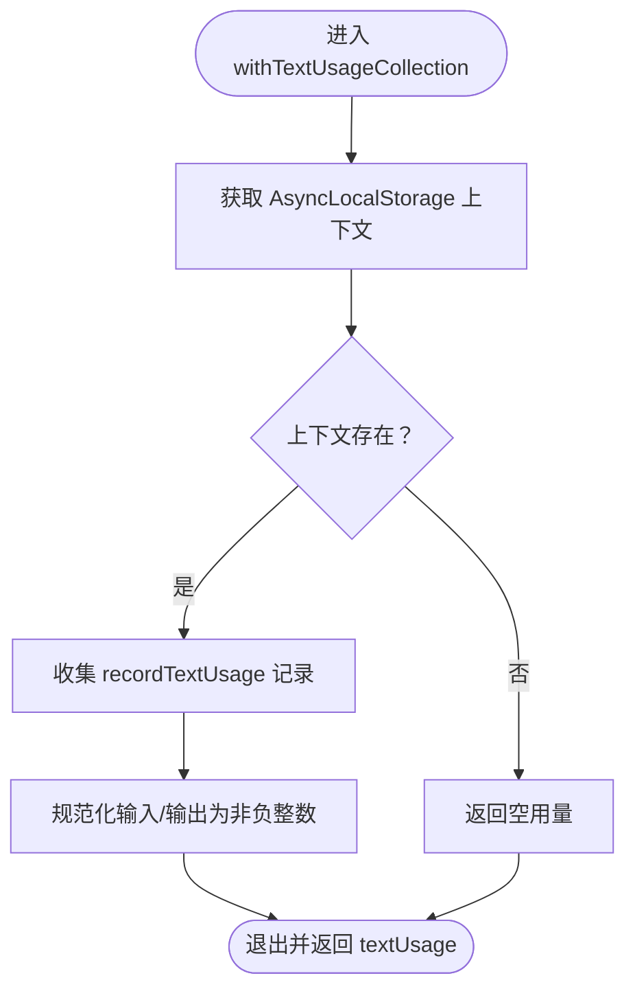
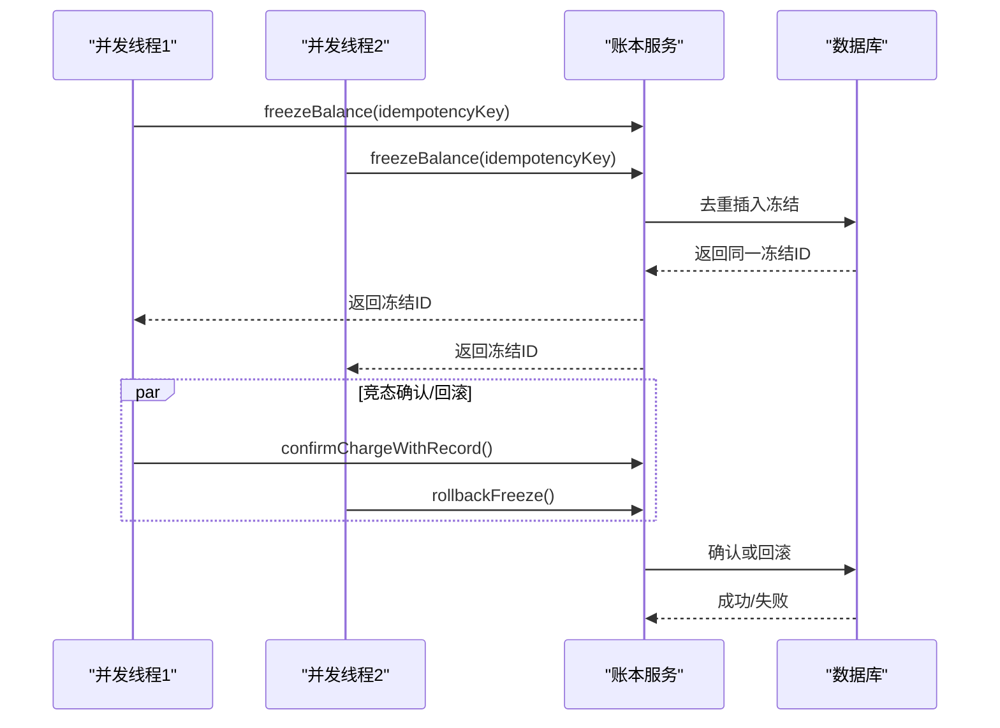
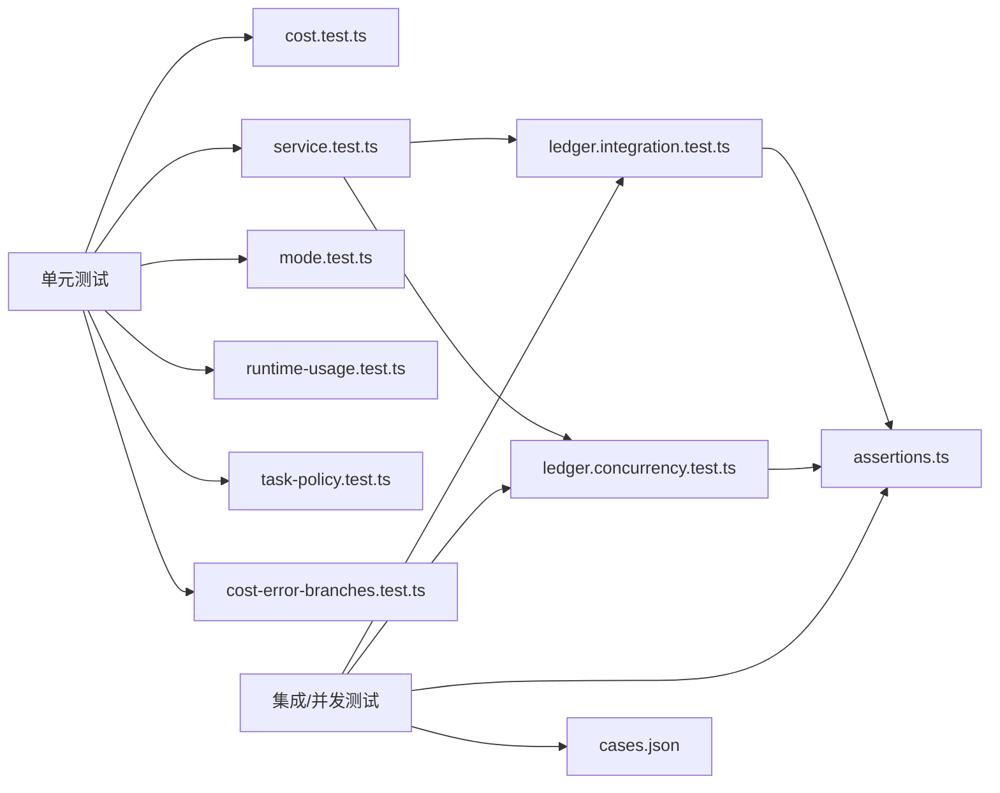

# 计费系统测试

<cite>
**本文引用的文件**
- [cost.test.ts](file://tests/unit/billing/cost.test.ts)
- [service.test.ts](file://tests/unit/billing/service.test.ts)
- [mode.test.ts](file://tests/unit/billing/mode.test.ts)
- [runtime-usage.test.ts](file://tests/unit/billing/runtime-usage.test.ts)
- [task-policy.test.ts](file://tests/unit/billing/task-policy.test.ts)
- [cost-error-branches.test.ts](file://tests/unit/billing/cost-error-branches.test.ts)
- [ledger.integration.test.ts](file://tests/integration/billing/ledger.integration.test.ts)
- [ledger.concurrency.test.ts](file://tests/concurrency/billing/ledger.concurrency.test.ts)
- [assertions.ts](file://tests/helpers/assertions.ts)
- [cases.json](file://tests/fixtures/billing/cases.json)
</cite>

## 目录
1. [简介](#简介)
2. [项目结构](#项目结构)
3. [核心组件](#核心组件)
4. [架构总览](#架构总览)
5. [详细组件分析](#详细组件分析)
6. [依赖关系分析](#依赖关系分析)
7. [性能考量](#性能考量)
8. [故障排查指南](#故障排查指南)
9. [结论](#结论)
10. [附录](#附录)

## 简介
本文件面向计费系统的单元与集成测试，系统性梳理以下测试策略与实践：
- 费用明细验证：覆盖文本、图像、视频（含按用量计费）、语音等多模态计费函数的数值正确性与边界条件。
- 折扣与规则测试：验证分辨率/能力/时长等参数对计费的影响，以及未知模型与自定义定价的容错路径。
- 精度控制测试：统一采用高精度小数比较，确保跨模块计费一致性。
- 账本服务测试：冻结/解冻/确认消费、影子用量、幂等键、重复请求保护、余额与冻结金额的并发一致性。
- 计费模式测试：离线/影子/强制三种模式在不同阶段的行为差异与错误映射。
- 运行时用量与任务策略：异步本地存储隔离、用量归集与规范化、任务计费生命周期（准备/结算/回滚）。
- 异常处理与回滚：余额不足、重复冻结、确认失败、回滚失败等场景的健壮性保障。

## 项目结构
计费相关测试主要分布在以下目录：
- 单元测试：tests/unit/billing
- 集成测试：tests/integration/billing
- 并发测试：tests/concurrency/billing
- 辅助断言：tests/helpers/assertions.ts
- 测试夹具：tests/fixtures/billing/cases.json

**图表来源**
- [cost.test.ts:1-241](file://tests/unit/billing/cost.test.ts#L1-L241)
- [service.test.ts:1-566](file://tests/unit/billing/service.test.ts#L1-L566)
- [mode.test.ts:1-23](file://tests/unit/billing/mode.test.ts#L1-L23)
- [runtime-usage.test.ts:1-80](file://tests/unit/billing/runtime-usage.test.ts#L1-L80)
- [task-policy.test.ts:1-83](file://tests/unit/billing/task-policy.test.ts#L1-L83)
- [cost-error-branches.test.ts:1-66](file://tests/unit/billing/cost-error-branches.test.ts#L1-L66)
- [ledger.integration.test.ts:1-184](file://tests/integration/billing/ledger.integration.test.ts#L1-L184)
- [ledger.concurrency.test.ts:1-126](file://tests/concurrency/billing/ledger.concurrency.test.ts#L1-L126)
- [assertions.ts:1-24](file://tests/helpers/assertions.ts#L1-L24)
- [cases.json:1-7](file://tests/fixtures/billing/cases.json#L1-L7)

**章节来源**
- [cost.test.ts:1-241](file://tests/unit/billing/cost.test.ts#L1-L241)
- [service.test.ts:1-566](file://tests/unit/billing/service.test.ts#L1-L566)
- [mode.test.ts:1-23](file://tests/unit/billing/mode.test.ts#L1-L23)
- [runtime-usage.test.ts:1-80](file://tests/unit/billing/runtime-usage.test.ts#L1-L80)
- [task-policy.test.ts:1-83](file://tests/unit/billing/task-policy.test.ts#L1-L83)
- [cost-error-branches.test.ts:1-66](file://tests/unit/billing/cost-error-branches.test.ts#L1-L66)
- [ledger.integration.test.ts:1-184](file://tests/integration/billing/ledger.integration.test.ts#L1-L184)
- [ledger.concurrency.test.ts:1-126](file://tests/concurrency/billing/ledger.concurrency.test.ts#L1-L126)
- [assertions.ts:1-24](file://tests/helpers/assertions.ts#L1-L24)
- [cases.json:1-7](file://tests/fixtures/billing/cases.json#L1-L7)

## 核心组件
- 计费成本计算：文本/图像/视频/语音等多模态计费函数，支持内置定价与自定义定价、分辨率与时长缩放、Token 精确计费等。
- 账本服务：冻结余额、确认消费、回滚冻结、影子用量记录、幂等键去重、重复请求保护。
- 计费模式：OFF（跳过计费）、SHADOW（仅记录影子用量）、ENFORCE（强制冻结与结算）。
- 运行时用量收集：基于 AsyncLocalStorage 的上下文隔离，规范化输入/输出 Token 数值。
- 任务计费策略：根据任务类型构建默认计费信息，包含数量、单位、最大冻结金额等。

**章节来源**
- [cost.test.ts:1-241](file://tests/unit/billing/cost.test.ts#L1-L241)
- [service.test.ts:1-566](file://tests/unit/billing/service.test.ts#L1-L566)
- [mode.test.ts:1-23](file://tests/unit/billing/mode.test.ts#L1-L23)
- [runtime-usage.test.ts:1-80](file://tests/unit/billing/runtime-usage.test.ts#L1-L80)
- [task-policy.test.ts:1-83](file://tests/unit/billing/task-policy.test.ts#L1-L83)

## 架构总览
下图展示计费测试的关键交互：单元测试驱动计费成本计算与服务层逻辑；集成测试与并发测试验证账本在数据库层面的一致性与并发安全；辅助断言保障最终余额状态。

**图表来源**
- [cost.test.ts:1-241](file://tests/unit/billing/cost.test.ts#L1-L241)
- [service.test.ts:1-566](file://tests/unit/billing/service.test.ts#L1-L566)
- [mode.test.ts:1-23](file://tests/unit/billing/mode.test.ts#L1-L23)
- [runtime-usage.test.ts:1-80](file://tests/unit/billing/runtime-usage.test.ts#L1-L80)
- [task-policy.test.ts:1-83](file://tests/unit/billing/task-policy.test.ts#L1-L83)
- [cost-error-branches.test.ts:1-66](file://tests/unit/billing/cost-error-branches.test.ts#L1-L66)
- [ledger.integration.test.ts:1-184](file://tests/integration/billing/ledger.integration.test.ts#L1-L184)
- [ledger.concurrency.test.ts:1-126](file://tests/concurrency/billing/ledger.concurrency.test.ts#L1-L126)
- [assertions.ts:1-24](file://tests/helpers/assertions.ts#L1-L24)

## 详细组件分析

### 组件一：计费成本计算测试策略
- 文本计费：验证已知模型价格表与未知模型抛错；支持以输入/输出 Token 数量计算。
- 图像计费：内置模型优先于自定义定价；未知模型可使用自定义选项定价，缺失选项需明确报错。
- 视频计费：分辨率与时长影响价格；部分模型支持能力参数与时长缩放；Seedance 2.0 支持按 Token 精确计费与视频输入下限。
- 语音计费：按秒计价；语音设计/唇同步为固定费用。
- 错误分支：当定价目录返回“不明确”或“未配置”时，抛出相应错误；非法数值被规范化为 0。

**图表来源**
- [cost.test.ts:1-241](file://tests/unit/billing/cost.test.ts#L1-L241)
- [cost-error-branches.test.ts:1-66](file://tests/unit/billing/cost-error-branches.test.ts#L1-L66)

**章节来源**
- [cost.test.ts:1-241](file://tests/unit/billing/cost.test.ts#L1-L241)
- [cost-error-branches.test.ts:1-66](file://tests/unit/billing/cost-error-branches.test.ts#L1-L66)

### 组件二：账本服务测试方法
- 模式行为：
  - OFF：跳过冻结，直接返回执行结果。
  - SHADOW：仅记录影子用量，不冻结余额。
  - ENFORCE：冻结余额，执行失败则回滚冻结。
- 重复请求保护：通过幂等键识别重复冻结；冻结状态为 confirmed/pending/dropped 三态。
- 结算流程：影子模式直接结算为 0；强制模式根据实际用量扩展冻结并确认消费；确认失败时尝试回滚，若两者都失败则抛出复合错误。
- 回滚流程：成功回滚后状态为 rolled_back；若回滚失败则标记为 failed。

**图表来源**
- [service.test.ts:1-566](file://tests/unit/billing/service.test.ts#L1-L566)
- [mode.test.ts:1-23](file://tests/unit/billing/mode.test.ts#L1-L23)

**章节来源**
- [service.test.ts:1-566](file://tests/unit/billing/service.test.ts#L1-L566)
- [mode.test.ts:1-23](file://tests/unit/billing/mode.test.ts#L1-L23)

### 组件三：计费模式测试策略
- 环境变量 BILLING_MODE 正常化为大写枚举值；缺失或无效时回退至 OFF。
- 启动时可通过 getBootBillingEnabled 判断是否启用计费。

**章节来源**
- [mode.test.ts:1-23](file://tests/unit/billing/mode.test.ts#L1-L23)

### 组件四：运行时用量与任务策略测试
- 运行时用量：
  - 使用 AsyncLocalStorage 在作用域内收集文本 Token 用量，自动规范化负值与 NaN 为 0。
  - 多个并发作用域相互隔离，避免交叉污染。
  - 当无法读取存储时，回退为空用量。
- 任务策略：
  - 为每个可计费任务类型构建默认计费信息，包含 API 类型、模型、数量、单位、最大冻结金额等。
  - 对图像/视频/语音等任务，依据传入参数（如候选数、时长、模型）正确设置数量与单位。

**图表来源**
- [runtime-usage.test.ts:1-80](file://tests/unit/billing/runtime-usage.test.ts#L1-L80)

**章节来源**
- [runtime-usage.test.ts:1-80](file://tests/unit/billing/runtime-usage.test.ts#L1-L80)
- [task-policy.test.ts:1-83](file://tests/unit/billing/task-policy.test.ts#L1-L83)

### 组件五：账本服务集成与并发测试
- 集成测试覆盖：
  - 冻结余额、部分确认与退款、重复确认幂等、回滚冻结、影子用量审计等。
- 并发测试覆盖：
  - 高并发冻结不产生负余额；幂等键在并发下正确去重；确认与回滚竞态下保持最终一致性；重复请求不会造成重复扣款。

**图表来源**
- [ledger.integration.test.ts:1-184](file://tests/integration/billing/ledger.integration.test.ts#L1-L184)
- [ledger.concurrency.test.ts:1-126](file://tests/concurrency/billing/ledger.concurrency.test.ts#L1-L126)

**章节来源**
- [ledger.integration.test.ts:1-184](file://tests/integration/billing/ledger.integration.test.ts#L1-L184)
- [ledger.concurrency.test.ts:1-126](file://tests/concurrency/billing/ledger.concurrency.test.ts#L1-L126)
- [assertions.ts:1-24](file://tests/helpers/assertions.ts#L1-L24)

## 依赖关系分析
- 单元测试依赖：
  - 计费成本计算：tests/unit/billing/cost.test.ts
  - 服务层：tests/unit/billing/service.test.ts
  - 模式与用量：tests/unit/billing/mode.test.ts、tests/unit/billing/runtime-usage.test.ts
  - 任务策略：tests/unit/billing/task-policy.test.ts
  - 错误分支：tests/unit/billing/cost-error-branches.test.ts
- 集成与并发测试依赖：
  - 账本服务：tests/integration/billing/ledger.integration.test.ts、tests/concurrency/billing/ledger.concurrency.test.ts
  - 断言工具：tests/helpers/assertions.ts
  - 测试夹具：tests/fixtures/billing/cases.json

**图表来源**
- [cost.test.ts:1-241](file://tests/unit/billing/cost.test.ts#L1-L241)
- [service.test.ts:1-566](file://tests/unit/billing/service.test.ts#L1-L566)
- [mode.test.ts:1-23](file://tests/unit/billing/mode.test.ts#L1-L23)
- [runtime-usage.test.ts:1-80](file://tests/unit/billing/runtime-usage.test.ts#L1-L80)
- [task-policy.test.ts:1-83](file://tests/unit/billing/task-policy.test.ts#L1-L83)
- [cost-error-branches.test.ts:1-66](file://tests/unit/billing/cost-error-branches.test.ts#L1-L66)
- [ledger.integration.test.ts:1-184](file://tests/integration/billing/ledger.integration.test.ts#L1-L184)
- [ledger.concurrency.test.ts:1-126](file://tests/concurrency/billing/ledger.concurrency.test.ts#L1-L126)
- [assertions.ts:1-24](file://tests/helpers/assertions.ts#L1-L24)
- [cases.json:1-7](file://tests/fixtures/billing/cases.json#L1-L7)

**章节来源**
- [cost.test.ts:1-241](file://tests/unit/billing/cost.test.ts#L1-L241)
- [service.test.ts:1-566](file://tests/unit/billing/service.test.ts#L1-L566)
- [mode.test.ts:1-23](file://tests/unit/billing/mode.test.ts#L1-L23)
- [runtime-usage.test.ts:1-80](file://tests/unit/billing/runtime-usage.test.ts#L1-L80)
- [task-policy.test.ts:1-83](file://tests/unit/billing/task-policy.test.ts#L1-L83)
- [cost-error-branches.test.ts:1-66](file://tests/unit/billing/cost-error-branches.test.ts#L1-L66)
- [ledger.integration.test.ts:1-184](file://tests/integration/billing/ledger.integration.test.ts#L1-L184)
- [ledger.concurrency.test.ts:1-126](file://tests/concurrency/billing/ledger.concurrency.test.ts#L1-L126)
- [assertions.ts:1-24](file://tests/helpers/assertions.ts#L1-L24)
- [cases.json:1-7](file://tests/fixtures/billing/cases.json#L1-L7)

## 性能考量
- 计费精度：所有数值比较采用高精度小数比较，避免浮点误差导致的断言失败。
- 并发一致性：冻结幂等键与确认/回滚的竞态处理保证最终一致性，同时限制并发冻结数量防止超扣。
- 数据库事务：账本操作通过事务封装，失败即回滚，确保余额与冻结金额的原子性。

[本节为通用指导，无需特定文件来源]

## 故障排查指南
- 余额不足：在 ENFORCE 模式下，冻结失败会抛出余额不足错误；服务层将其映射为 402 响应负载。
- 重复冻结/重复请求：通过幂等键去重；已确认冻结拒绝再次提交；待处理冻结拒绝新的提交。
- 确认失败与回滚失败：若确认失败且回滚也失败，抛出复合错误并携带任务与冻结上下文信息。
- 影子用量：在 SHADOW 模式下，消费不扣款但会记录审计日志，便于对账核对。
- 断言工具：使用断言工具检查最终余额、冻结金额与总支出均非负，确保账本健康。

**章节来源**
- [service.test.ts:1-566](file://tests/unit/billing/service.test.ts#L1-L566)
- [ledger.integration.test.ts:1-184](file://tests/integration/billing/ledger.integration.test.ts#L1-L184)
- [assertions.ts:1-24](file://tests/helpers/assertions.ts#L1-L24)

## 结论
本测试体系通过单元、集成与并发测试覆盖了计费成本计算、账本服务、计费模式与任务策略的全链路行为，重点保障：
- 计费规则的正确性与边界处理；
- 账本在高并发下的数据一致性与幂等性；
- 异常场景下的回滚与错误映射；
- 运行时用量的隔离与规范化。

建议在新增计费规则或修改账本逻辑时，同步补充对应测试用例，并利用断言工具进行最终状态校验。

[本节为总结性内容，无需特定文件来源]

## 附录
- 测试夹具：提供常用模型与用量示例，便于快速构造测试场景。
- 关键测试用例索引：
  - 文本/图像/视频/语音计费与错误分支
  - 账本冻结/确认/回滚与幂等键
  - 影子用量与重复请求保护
  - 并发冻结与确认/回滚竞态
  - 模式切换与错误映射

**章节来源**
- [cases.json:1-7](file://tests/fixtures/billing/cases.json#L1-L7)