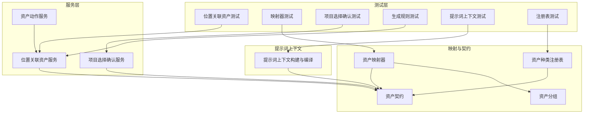
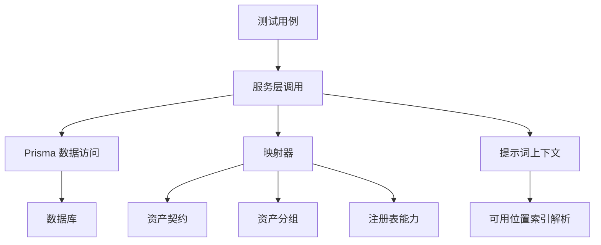
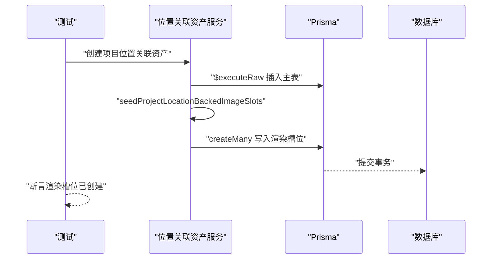
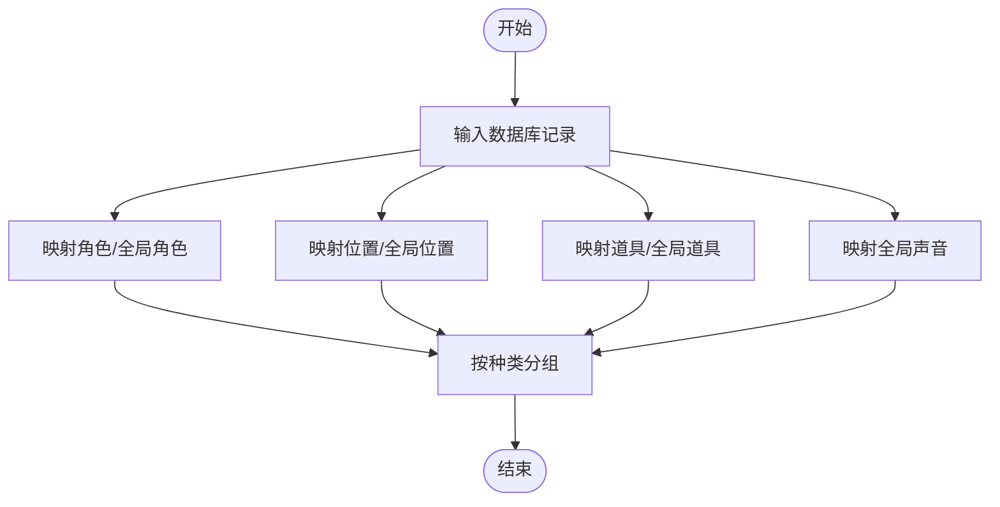
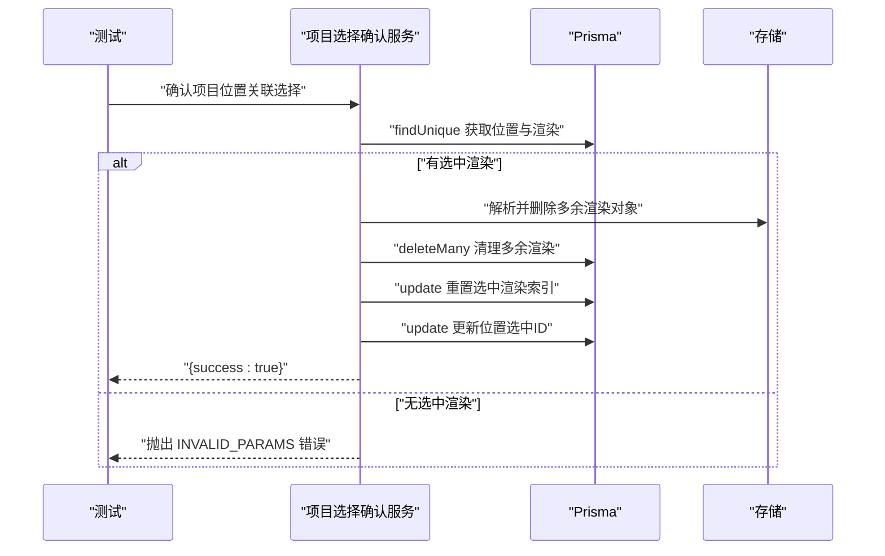
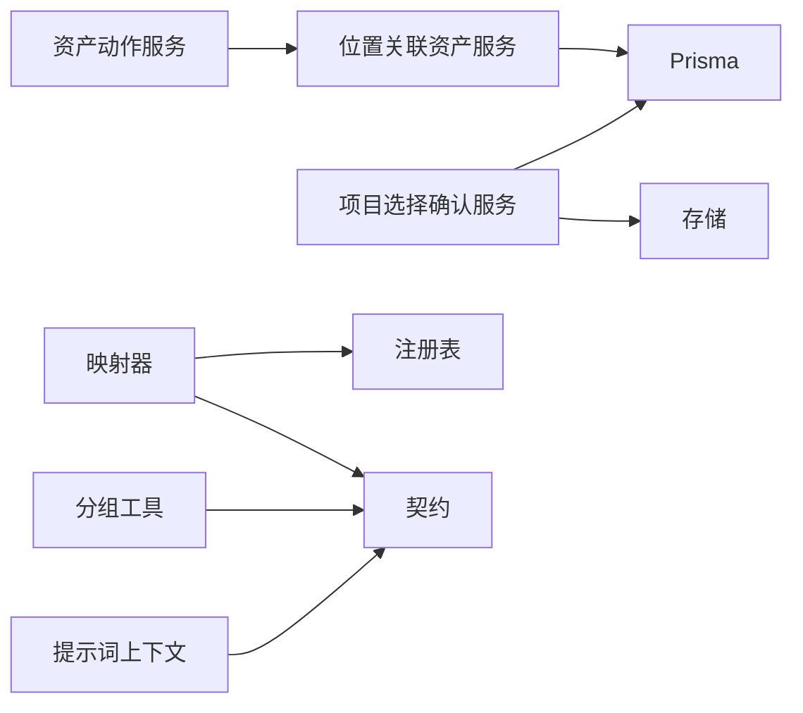

# 资产管理测试

<cite>
**本文引用的文件**
- [tests/unit/assets/location-backed-assets.test.ts](file://tests/unit/assets/location-backed-assets.test.ts)
- [src/lib/assets/services/location-backed-assets.ts](file://src/lib/assets/services/location-backed-assets.ts)
- [tests/unit/assets/mappers.test.ts](file://tests/unit/assets/mappers.test.ts)
- [src/lib/assets/mappers.ts](file://src/lib/assets/mappers.ts)
- [src/lib/assets/contracts.ts](file://src/lib/assets/contracts.ts)
- [src/lib/assets/grouping.ts](file://src/lib/assets/grouping.ts)
- [src/lib/assets/kinds/registry.ts](file://src/lib/assets/kinds/registry.ts)
- [tests/unit/assets/project-location-backed-selection.test.ts](file://tests/unit/assets/project-location-backed-selection.test.ts)
- [src/lib/assets/services/project-location-backed-selection.ts](file://src/lib/assets/services/project-location-backed-selection.ts)
- [tests/unit/assets/location-backed-generation.test.ts](file://tests/unit/assets/location-backed-generation.test.ts)
- [tests/unit/assets/prompt-context.test.ts](file://tests/unit/assets/prompt-context.test.ts)
- [src/lib/assets/services/asset-prompt-context.ts](file://src/lib/assets/services/asset-prompt-context.ts)
- [tests/unit/assets/registry.test.ts](file://tests/unit/assets/registry.test.ts)
- [src/lib/assets/services/asset-actions.ts](file://src/lib/assets/services/asset-actions.ts)
- [src/lib/query/hooks/useAssets.ts](file://src/lib/query/hooks/useAssets.ts)
</cite>

## 目录
1. [简介](#简介)
2. [项目结构](#项目结构)
3. [核心组件](#核心组件)
4. [架构总览](#架构总览)
5. [详细组件分析](#详细组件分析)
6. [依赖分析](#依赖分析)
7. [性能考虑](#性能考虑)
8. [故障排查指南](#故障排查指南)
9. [结论](#结论)
10. [附录](#附录)

## 简介
本文件面向资产管理系统的单元测试，聚焦以下目标：
- 位置关联资产的测试策略：覆盖资产生命周期（创建、查询、删除）、关联关系维护与数据一致性。
- 资产映射器的功能测试：覆盖类型转换、格式验证与数据转换。
- 项目位置关联选择的测试方法：覆盖选择逻辑、状态同步与冲突处理。
- 提示词上下文与注册表的测试用例：覆盖缓存机制、索引管理与性能优化。

## 项目结构
资产管理测试围绕“服务层”“映射层”“契约与分组”“注册表”“提示词上下文”等模块展开，并通过单元测试验证其行为与边界条件。

图表来源
- [tests/unit/assets/location-backed-assets.test.ts:1-100](file://tests/unit/assets/location-backed-assets.test.ts#L1-L100)
- [src/lib/assets/services/location-backed-assets.ts:135-340](file://src/lib/assets/services/location-backed-assets.ts#L135-L340)
- [tests/unit/assets/mappers.test.ts:1-132](file://tests/unit/assets/mappers.test.ts#L1-L132)
- [src/lib/assets/mappers.ts:161-458](file://src/lib/assets/mappers.ts#L161-L458)
- [src/lib/assets/contracts.ts:1-145](file://src/lib/assets/contracts.ts#L1-L145)
- [src/lib/assets/grouping.ts:26-50](file://src/lib/assets/grouping.ts#L26-L50)
- [src/lib/assets/kinds/registry.ts:13-89](file://src/lib/assets/kinds/registry.ts#L13-L89)
- [tests/unit/assets/project-location-backed-selection.test.ts:1-128](file://tests/unit/assets/project-location-backed-selection.test.ts#L1-L128)
- [src/lib/assets/services/project-location-backed-selection.ts:6-76](file://src/lib/assets/services/project-location-backed-selection.ts#L6-L76)
- [tests/unit/assets/location-backed-generation.test.ts:1-38](file://tests/unit/assets/location-backed-generation.test.ts#L1-L38)
- [tests/unit/assets/prompt-context.test.ts:1-54](file://tests/unit/assets/prompt-context.test.ts#L1-L54)
- [src/lib/assets/services/asset-prompt-context.ts:107-175](file://src/lib/assets/services/asset-prompt-context.ts#L107-L175)
- [tests/unit/assets/registry.test.ts:1-45](file://tests/unit/assets/registry.test.ts#L1-L45)
- [src/lib/assets/services/asset-actions.ts:1185-1201](file://src/lib/assets/services/asset-actions.ts#L1185-L1201)
- [src/lib/query/hooks/useAssets.ts:139-181](file://src/lib/query/hooks/useAssets.ts#L139-L181)

章节来源
- [tests/unit/assets/location-backed-assets.test.ts:1-100](file://tests/unit/assets/location-backed-assets.test.ts#L1-L100)
- [tests/unit/assets/mappers.test.ts:1-132](file://tests/unit/assets/mappers.test.ts#L1-L132)
- [tests/unit/assets/project-location-backed-selection.test.ts:1-128](file://tests/unit/assets/project-location-backed-selection.test.ts#L1-L128)
- [tests/unit/assets/location-backed-generation.test.ts:1-38](file://tests/unit/assets/location-backed-generation.test.ts#L1-L38)
- [tests/unit/assets/prompt-context.test.ts:1-54](file://tests/unit/assets/prompt-context.test.ts#L1-L54)
- [tests/unit/assets/registry.test.ts:1-45](file://tests/unit/assets/registry.test.ts#L1-L45)

## 核心组件
- 位置关联资产服务：负责项目与全局位置关联资产的查询、创建、种子渲染槽位、删除等。
- 项目选择确认服务：负责在多渲染中确认唯一选中渲染，清理多余资源并同步状态。
- 资产映射器：将数据库记录映射为统一资产契约对象，支持分组与能力标注。
- 注册表：声明资产种类的能力契约与家族属性，供映射器与运行时使用。
- 提示词上下文：从资产上下文构建提示片段，用于生成与渲染。

章节来源
- [src/lib/assets/services/location-backed-assets.ts:135-340](file://src/lib/assets/services/location-backed-assets.ts#L135-L340)
- [src/lib/assets/services/project-location-backed-selection.ts:6-76](file://src/lib/assets/services/project-location-backed-selection.ts#L6-L76)
- [src/lib/assets/mappers.ts:161-458](file://src/lib/assets/mappers.ts#L161-L458)
- [src/lib/assets/kinds/registry.ts:13-89](file://src/lib/assets/kinds/registry.ts#L13-L89)
- [src/lib/assets/services/asset-prompt-context.ts:107-175](file://src/lib/assets/services/asset-prompt-context.ts#L107-L175)

## 架构总览
资产管理测试采用“服务-映射-契约-注册表-提示词”的分层设计，测试覆盖从数据模型到对外契约的完整路径。

图表来源
- [src/lib/assets/services/location-backed-assets.ts:135-340](file://src/lib/assets/services/location-backed-assets.ts#L135-L340)
- [src/lib/assets/mappers.ts:161-458](file://src/lib/assets/mappers.ts#L161-L458)
- [src/lib/assets/contracts.ts:1-145](file://src/lib/assets/contracts.ts#L1-L145)
- [src/lib/assets/grouping.ts:26-50](file://src/lib/assets/grouping.ts#L26-L50)
- [src/lib/assets/kinds/registry.ts:13-89](file://src/lib/assets/kinds/registry.ts#L13-L89)
- [src/lib/assets/services/asset-prompt-context.ts:107-175](file://src/lib/assets/services/asset-prompt-context.ts#L107-L175)

## 详细组件分析

### 位置关联资产服务测试
- 测试策略
  - 查询：验证 SQL 使用真实列名与表名，确保字段映射正确。
  - 种子槽位：验证创建资产时自动写入初始渲染槽位；多描述时批量写入。
  - 生命周期：验证删除事务级操作对主表与图像表的一致性。
- 关键断言
  - SQL 字段与表名匹配预期。
  - createMany 的数据结构包含索引、描述与可用位置序列化结果。
  - 删除使用事务保证两张表同时清理。

图表来源
- [tests/unit/assets/location-backed-assets.test.ts:50-98](file://tests/unit/assets/location-backed-assets.test.ts#L50-L98)
- [src/lib/assets/services/location-backed-assets.ts:190-228](file://src/lib/assets/services/location-backed-assets.ts#L190-L228)
- [src/lib/assets/services/location-backed-assets.ts:272-303](file://src/lib/assets/services/location-backed-assets.ts#L272-L303)

章节来源
- [tests/unit/assets/location-backed-assets.test.ts:1-100](file://tests/unit/assets/location-backed-assets.test.ts#L1-L100)
- [src/lib/assets/services/location-backed-assets.ts:135-340](file://src/lib/assets/services/location-backed-assets.ts#L135-L340)

### 资产映射器功能测试
- 测试策略
  - 角色映射：验证外观变体、渲染、任务引用与语音绑定字段。
  - 全局声音映射：验证声音元数据与作用域。
  - 位置/道具映射：验证变体、渲染、选中变体 ID 与摘要。
  - 分组：按种类分组并断言结果集合。
- 关键断言
  - 统一契约字段存在且值正确。
  - 变体与渲染结构符合预期。
  - 分组函数返回正确的键集合。

图表来源
- [tests/unit/assets/mappers.test.ts:6-130](file://tests/unit/assets/mappers.test.ts#L6-L130)
- [src/lib/assets/mappers.ts:161-458](file://src/lib/assets/mappers.ts#L161-L458)
- [src/lib/assets/grouping.ts:26-50](file://src/lib/assets/grouping.ts#L26-L50)

章节来源
- [tests/unit/assets/mappers.test.ts:1-132](file://tests/unit/assets/mappers.test.ts#L1-L132)
- [src/lib/assets/mappers.ts:161-458](file://src/lib/assets/mappers.ts#L161-L458)
- [src/lib/assets/grouping.ts:26-50](file://src/lib/assets/grouping.ts#L26-L50)

### 项目位置关联选择确认测试
- 测试策略
  - 正常流程：保留选中渲染，删除其余渲染，更新位置选中 ID。
  - 异常流程：无选中渲染时报错，不执行删除。
  - 资源清理：根据媒体值解析存储键并删除对象。
- 关键断言
  - 事务内仅保留选中渲染并重置索引。
  - 未选中时抛出参数无效错误。
  - 删除多余渲染并更新位置选中 ID。

图表来源
- [tests/unit/assets/project-location-backed-selection.test.ts:53-126](file://tests/unit/assets/project-location-backed-selection.test.ts#L53-L126)
- [src/lib/assets/services/project-location-backed-selection.ts:6-76](file://src/lib/assets/services/project-location-backed-selection.ts#L6-L76)

章节来源
- [tests/unit/assets/project-location-backed-selection.test.ts:1-128](file://tests/unit/assets/project-location-backed-selection.test.ts#L1-L128)
- [src/lib/assets/services/project-location-backed-selection.ts:6-76](file://src/lib/assets/services/project-location-backed-selection.ts#L6-L76)

### 生成规则与选择逻辑测试
- 测试策略
  - 生成规则：道具需具备视觉描述才允许生成；位置可基于种子描述生成。
  - 选择路由：道具与位置的生成类型分支一致。
- 关键断言
  - 无渲染的道具不可生成。
  - 有渲染描述的位置可生成。
  - 生成类型分支返回对应类型。

章节来源
- [tests/unit/assets/location-backed-generation.test.ts:1-38](file://tests/unit/assets/location-backed-generation.test.ts#L1-L38)

### 提示词上下文与注册表测试
- 提示词上下文测试
  - 验证从集中式上下文编译主题、环境、道具片段。
  - 匹配角色别名、解析可用位置索引文本。
- 注册表测试
  - 验证资产种类注册项与能力契约。
  - 验证家族、多变体支持与生成/选择/复制等能力。
- 关键断言
  - 编译片段包含预期文本。
  - 注册表键集合与能力映射符合预期。

章节来源
- [tests/unit/assets/prompt-context.test.ts:1-54](file://tests/unit/assets/prompt-context.test.ts#L1-L54)
- [src/lib/assets/services/asset-prompt-context.ts:107-175](file://src/lib/assets/services/asset-prompt-context.ts#L107-L175)
- [tests/unit/assets/registry.test.ts:1-45](file://tests/unit/assets/registry.test.ts#L1-L45)
- [src/lib/assets/kinds/registry.ts:13-89](file://src/lib/assets/kinds/registry.ts#L13-L89)

## 依赖分析
- 服务层依赖
  - 位置关联资产服务依赖 Prisma 进行 SQL 查询与写入。
  - 项目选择确认服务依赖 Prisma 事务、存储删除与媒体值解析。
  - 资产动作服务依赖位置关联资产服务以实现删除。
- 映射层依赖
  - 映射器依赖注册表能力与契约定义，输出统一资产对象。
  - 分组工具依赖契约枚举进行分类。
- 提示词上下文依赖
  - 依赖可用位置索引解析与本地化格式化工具。

图表来源
- [src/lib/assets/services/location-backed-assets.ts:135-340](file://src/lib/assets/services/location-backed-assets.ts#L135-L340)
- [src/lib/assets/services/project-location-backed-selection.ts:6-76](file://src/lib/assets/services/project-location-backed-selection.ts#L6-L76)
- [src/lib/assets/mappers.ts:161-458](file://src/lib/assets/mappers.ts#L161-L458)
- [src/lib/assets/kinds/registry.ts:13-89](file://src/lib/assets/kinds/registry.ts#L13-L89)
- [src/lib/assets/grouping.ts:26-50](file://src/lib/assets/grouping.ts#L26-L50)
- [src/lib/assets/services/asset-actions.ts:1185-1201](file://src/lib/assets/services/asset-actions.ts#L1185-L1201)
- [src/lib/assets/services/asset-prompt-context.ts:107-175](file://src/lib/assets/services/asset-prompt-context.ts#L107-L175)

章节来源
- [src/lib/assets/services/asset-actions.ts:1185-1201](file://src/lib/assets/services/asset-actions.ts#L1185-L1201)
- [src/lib/query/hooks/useAssets.ts:139-181](file://src/lib/query/hooks/useAssets.ts#L139-L181)

## 性能考虑
- 查询与排序
  - 位置关联资产查询按创建时间排序，避免全表扫描。
  - 渲染按索引排序，减少前端排序成本。
- 批量写入
  - 种子槽位使用 createMany 批量插入，降低往返次数。
- 事务一致性
  - 删除与选择确认均在事务中执行，减少中间态风险。
- 前端缓存与去抖
  - 资产查询钩子设置较短的过期时间，平衡新鲜度与性能。
- 提示词上下文
  - 解析与格式化过程尽量复用，避免重复计算。

章节来源
- [src/lib/assets/services/location-backed-assets.ts:87-158](file://src/lib/assets/services/location-backed-assets.ts#L87-L158)
- [src/lib/assets/services/location-backed-assets.ts:272-303](file://src/lib/assets/services/location-backed-assets.ts#L272-L303)
- [src/lib/assets/services/project-location-backed-selection.ts:54-72](file://src/lib/assets/services/project-location-backed-selection.ts#L54-L72)
- [src/lib/query/hooks/useAssets.ts:139-181](file://src/lib/query/hooks/useAssets.ts#L139-L181)

## 故障排查指南
- 生成失败
  - 检查道具是否具备视觉描述；位置是否具备种子描述。
  - 参考生成规则测试用例定位问题。
- 选择确认异常
  - 若无选中渲染，会抛出参数无效错误；检查渲染列表与选中状态。
  - 确认存储键解析与删除流程。
- 映射结果不符
  - 对照映射器测试用例，核对输入数据结构与期望字段。
  - 检查注册表能力是否与契约一致。
- 提示词片段缺失
  - 核查上下文输入是否包含角色、地点、道具名称与描述。
  - 检查可用位置索引的序列化与解析。

章节来源
- [tests/unit/assets/location-backed-generation.test.ts:1-38](file://tests/unit/assets/location-backed-generation.test.ts#L1-L38)
- [tests/unit/assets/project-location-backed-selection.test.ts:99-126](file://tests/unit/assets/project-location-backed-selection.test.ts#L99-L126)
- [tests/unit/assets/mappers.test.ts:6-130](file://tests/unit/assets/mappers.test.ts#L6-L130)
- [tests/unit/assets/prompt-context.test.ts:5-52](file://tests/unit/assets/prompt-context.test.ts#L5-L52)

## 结论
本测试文档系统性覆盖了位置关联资产的生命周期、映射器的数据转换、项目选择确认的状态同步与冲突处理、生成规则与提示词上下文构建，以及注册表的能力契约。通过服务层与映射层的协同，确保资产在项目与全局范围内的数据一致性与可扩展性。

## 附录
- 相关契约与分组
  - 资产契约定义了统一字段与能力映射。
  - 分组工具按种类归类资产，便于 UI 与业务逻辑处理。
- 注册表能力
  - 统一声明资产种类的家族、多变体支持与能力集合，保障运行时一致性。

章节来源
- [src/lib/assets/contracts.ts:1-145](file://src/lib/assets/contracts.ts#L1-L145)
- [src/lib/assets/grouping.ts:26-50](file://src/lib/assets/grouping.ts#L26-L50)
- [src/lib/assets/kinds/registry.ts:13-89](file://src/lib/assets/kinds/registry.ts#L13-L89)